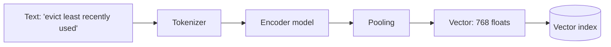
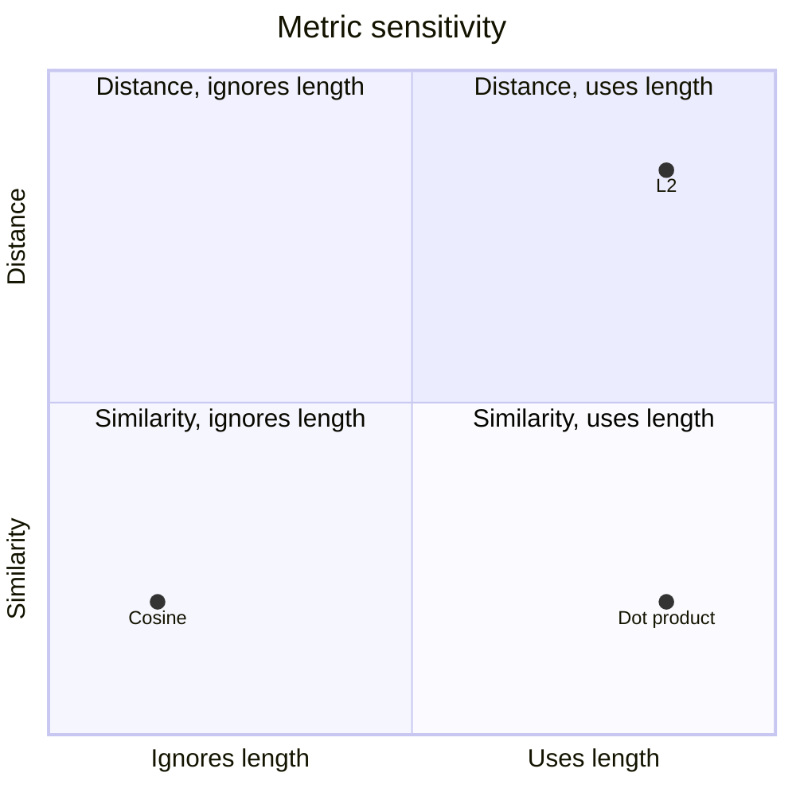
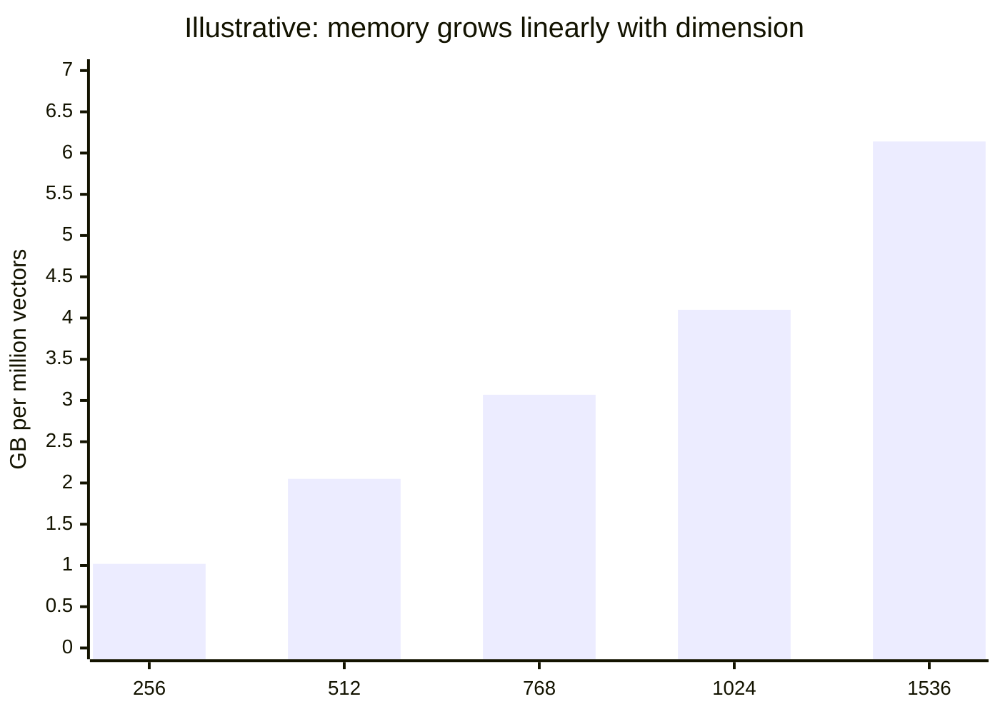
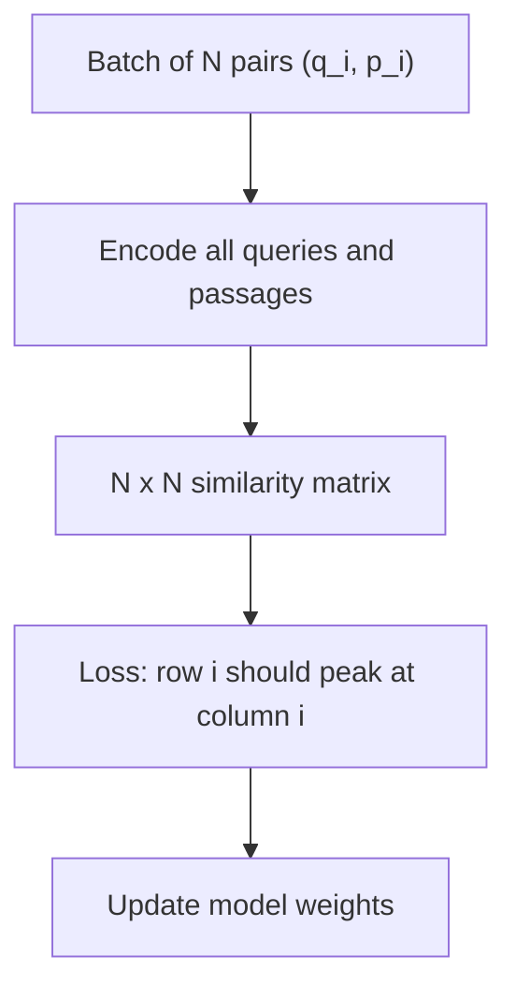
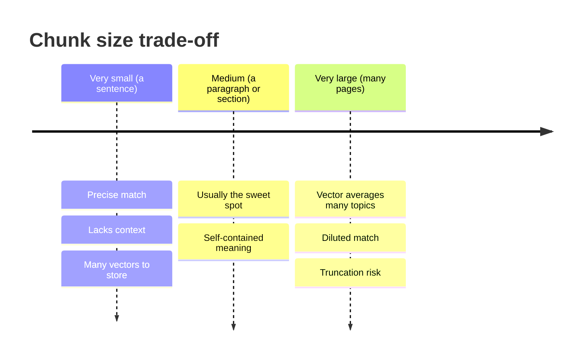
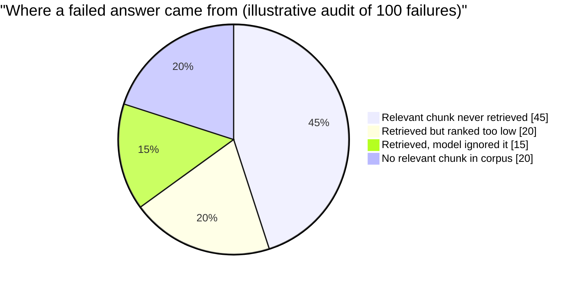

# Embeddings and similarity: vectors, metrics, model choice and the chunk/query asymmetry

## Learning objectives

After studying this lesson you should be able to:

- Explain what an embedding is and what it means for two texts to be "close" in embedding space.
- Compute dot product, cosine similarity and Euclidean distance by hand, and state exactly when they produce the same ranking.
- Reason about dimensionality: its memory cost, what it buys, and how truncation and quantization trade accuracy for size.
- Describe, at a high level, how embedding models are trained (contrastive learning with in-batch negatives) and why that shapes what "similar" means.
- Choose an embedding model with a methodical process: benchmark as a prior, your own labelled queries as the decision.
- Explain the query/document asymmetry and the practical consequences for prefixes, instructions and chunk size.

## 1. What an embedding is

An **embedding** is a fixed-length list of numbers (a vector) that a model produces for a piece of input, such that inputs the model considers related land near each other. For text, a typical embedding has between a few hundred and a few thousand dimensions. The model is a neural network (usually a Transformer encoder) that reads the tokens of a sentence or passage and pools them into one vector.

The point of the exercise is to replace a hard problem (find the passages that mean something like this question) with an easy one: **find the vectors nearest to this vector**. Keyword search fails when the question and the answer share no words ("How do I stop my cache from melting under load?" versus a passage about stampede protection). Embedding search can succeed because both texts map to the same neighbourhood.

An embedding is a **learned coordinate system for meaning**. No single dimension means anything you can name; the information lives in the pattern across dimensions. Two consequences follow immediately:

1. Vectors from **different models are not comparable**. Dimension 17 of model A has nothing to do with dimension 17 of model B, and even models with the same dimension count live in unrelated spaces. Mixing them in one index returns garbage.
2. "Similar" means whatever the **training objective** made it mean: topical relatedness, paraphrase, question-answer relevance or something else. We return to this in section 5.

> **Key idea:** an embedding is only meaningful relative to the model that produced it. The vector and the model version travel together, always.

## 2. Measuring closeness: three metrics

Given two vectors a and b of dimension d, three measures dominate.

| Metric                  | Formula                             | Range     | Larger means |
| ----------------------- | ----------------------------------- | --------- | ------------ |
| Dot product             | sum of a_i * b_i                    | unbounded | more similar |
| Cosine similarity       | dot(a, b) / (norm(a) * norm(b))     | -1 to 1   | more similar |
| Euclidean (L2) distance | square root of sum of (a_i - b_i)^2 | 0 upward  | less similar |

**Dot product** mixes direction and magnitude: a long vector scores high against everything. **Cosine similarity** is the dot product of the two vectors after scaling each to length 1, so it measures only the angle between them. **L2 distance** is the straight-line distance, which is affected by both angle and length.

### Worked example

Let a = (3, 4) and b = (4, 3).

- dot(a, b) = 3*4 + 4*3 = 24.
- norm(a) = 5, norm(b) = 5, so cosine = 24 / 25 = **0.96**.
- L2 distance squared = (3-4)^2 + (4-3)^2 = 2, so L2 = 1.414.

Now scale a by 10, giving a' = (30, 40), and compare to b again.

- dot(a', b) = 240 (ten times larger).
- cosine = 240 / (50 * 5) = **0.96** (unchanged).
- L2 distance squared = 26^2 + 37^2 = 676 + 1369 = 2045, so L2 = 45.2 (much larger).

Cosine ignores length, dot product and L2 do not. If length carries no meaning for your use (the usual case for text embeddings), cosine is the metric that tracks meaning, or you normalize vectors so the choice stops mattering.

### The relationship that makes everything simpler

If both vectors are **unit length** (norm 1), the three metrics are interchangeable for ranking:

- cosine(a, b) = dot(a, b), because the denominator is 1.
- ||a - b||^2 = ||a||^2 + ||b||^2 - 2 dot(a, b) = 2 - 2 dot(a, b).

Check with the normalized example: a/5 = (0.6, 0.8), b/5 = (0.8, 0.6). The dot product is 0.48 + 0.48 = 0.96. The squared L2 distance is 0.04 + 0.04 = 0.08, and 2 - 2*0.96 = 0.08. The formulas agree.

So for normalized vectors, **maximizing cosine, maximizing dot product and minimizing L2 give the same top-k**. This is why practitioners normalize at write time and then use whichever metric their index computes fastest (dot product, which is a pure multiply-accumulate and uses hardware well). Many embedding models already return normalized vectors; check the model documentation instead of assuming, and verify by computing the norm of a few outputs.

| Situation                                                     | Recommended                                 |
| ------------------------------------------------------------- | ------------------------------------------- |
| Model outputs unit vectors                                    | dot product (equals cosine)                 |
| Model outputs unnormalized vectors, length meaningless        | normalize, then dot product                 |
| Model trained with a dot-product objective, length meaningful | dot product, do not normalize               |
| Index only supports L2                                        | normalize, then L2 (same ranking as cosine) |

> **Key idea:** pick the metric the model was trained with. If vectors are normalized, cosine, dot and L2 agree and you choose by speed.

There is one subtlety. Cosine similarity values themselves are not calibrated across models or even across queries: 0.78 from one model may be a strong match and from another a weak one. Use the **ranking**, and if you need a threshold ("only return results above X"), calibrate it on labelled data for your model.

## 3. Dimensionality

The dimension d is a fixed property of each model (for example 384, 768, 1024, 1536 or 3072 in common models; check your model's documentation for its value). It drives cost directly.

### Storage

Each vector costs d * bytes per component. In float32 that is 4d bytes.

| Dimension | Bytes per vector (float32) | 1 million vectors | 100 million vectors |
| --------- | -------------------------- | ----------------- | ------------------- |
| 256       | 1,024                      | 1.02 GB           | 102 GB              |
| 768       | 3,072                      | 3.07 GB           | 307 GB              |
| 1536      | 6,144                      | 6.14 GB           | 614 GB              |

Going from 256 to 1536 dimensions multiplies storage, memory bandwidth and distance-computation time by six, for every query and every vector.

### What more dimensions buy

Higher dimension generally allows a model to keep more distinctions apart (more capacity), which helps with large, diverse corpora and subtle queries. But returns diminish, and on a small, focused corpus a 384-dimension model often performs within a small margin of a much bigger one. The correct question is not "which is highest dimensional" but "what is the smallest model that meets my quality bar on my data".

### Shrinking vectors without retraining

- **Truncation of Matryoshka-trained models.** Some models are trained so that the first k dimensions of the vector form a useful lower-dimensional embedding on their own; you may keep a prefix and re-normalize. This only works if the model was trained for it (the provider will say so). Truncating an ordinary model's output damages it unpredictably.
- **Scalar quantization.** Store each component in 8 bits (or fewer) instead of 32: a 4x saving at a small recall cost.
- **Binary quantization.** Keep one bit per dimension (the sign): a 32x saving, usually paired with a re-scoring step against the full-precision vectors for the top candidates.
- **Product quantization** (next lesson) compresses far harder by coding sub-vectors.

All of these save memory and speed up search at some accuracy cost, so measure recall on your own queries before and after.

## 4. How embedding models are trained (high level)

You do not need to train a model to use one well, but knowing the objective explains the behaviour.

Modern text embedding models are usually trained with **contrastive learning**. The training data are pairs (or triples) that should be close: a question and a passage that answers it, a title and its article, two paraphrases. The model is rewarded for placing the two members of a pair close together and **pushing apart** everything else in the same training batch (the **in-batch negatives**). Hard negatives, passages that look relevant but are not, sharpen the model's boundaries.

The loss treats each row of the similarity matrix as a classification problem: for query i, the right passage is passage i and the other N-1 passages are the wrong answers. Over billions of pairs, the model learns a space in which relevant text sits together.

What this means for you:

- The space reflects **the kinds of pairs the model saw**. A model trained mainly on question-passage pairs from web text may handle your internal jargon, source code or another language poorly. Domain mismatch is the most common cause of disappointing retrieval.
- "Similar" is not "same". Two passages saying opposite things ("the cache is write-through" and "the cache is not write-through") can be extremely close, because they are about the same topic. Embeddings capture topical relatedness well and logical relationships (negation, quantities, exact identifiers) badly. That is a major reason to combine them with keyword search (see the lesson on vector databases in practice).
- Models have a **maximum input length** (in tokens). Longer text is truncated silently by some APIs. This sets an upper bound on chunk size.

## 5. The chunk/query asymmetry

In retrieval, what you embed at index time (a **document chunk**, long, declarative, rich in context) is very different from what you embed at query time (a **query**: short, often a question, sometimes just keywords). A query like "TTL jitter" and a passage that explains jitter for four paragraphs differ in length, style and information content. This is an **asymmetric** task, unlike duplicate detection, where both sides are the same kind of text.

Models handle asymmetry in different ways:

| Mechanism                         | What you do                                                                                                                    |
| --------------------------------- | ------------------------------------------------------------------------------------------------------------------------------ |
| Separate query and document modes | Call the model with a task or input type flag: one for queries, one for documents                                              |
| Instruction or prefix strings     | Prepend a prescribed prefix such as a query marker to queries and a different one to documents, exactly as the model card says |
| Symmetric model                   | Same encoding for both; fine for similar-text matching, weaker for question-to-passage retrieval                               |

The failure is quiet: if the model expects a query prefix and you omit it, everything still runs and quality just drops. **Read the model card, and follow its exact input convention for each side.**

### Chunk size and what a vector can hold

One vector must summarize an entire chunk. Consider the trade-off:

A chunk that mixes three topics yields a vector in the middle of nowhere, near none of them. A chunk that is too small ("It also reduces latency.") is meaningless without its surroundings. Typical practice is chunks of a few hundred tokens along natural boundaries (headings, paragraphs), often with small overlap, and with the title or section heading prepended so that the chunk carries its context. Chunking strategy is covered in the RAG topic; here the point is that **chunk size is limited by what one vector can faithfully represent**, and that the right size is found by evaluation, not by rule.

Another trick that exploits asymmetry is to embed something other than the raw chunk. Examples: embed a **generated question** the chunk answers (so a query is compared question-to-question), or embed a **summary** while returning the full text. Both are cheap ways to close the stylistic gap, at the price of extra generation work at index time.

## 6. Choosing and evaluating an embedding model

Public leaderboards such as MTEB (the Massive Text Embedding Benchmark) score models across many tasks: retrieval, classification, clustering, semantic similarity and more. They are a good **prior** for narrowing the candidate list, but they have limits: the tasks are public (models may have seen similar data), the average hides the task you care about, and none of it is your corpus. Treat a benchmark as a way to pick three candidates, not to pick the winner.

A sound selection process:

1. **List constraints first.** Maximum input length, languages, dimension (cost), latency, licence and whether you may send data to an API at all.
2. **Shortlist from a benchmark.** Look at the retrieval sub-scores, not the global average.
3. **Build a small labelled set from your own data.** Fifty to a few hundred real queries, each with the passages that should be returned. Real user queries beat invented ones.
4. **Measure retrieval quality** with simple metrics (below), per candidate, with the same chunking.
5. **Weigh quality against cost**: dimension, price per million tokens, indexing time, query latency.
6. **Re-evaluate on change.** A new model version, a new chunking scheme or a new corpus can all move the numbers.

### Retrieval metrics

- **Recall@k**: of the passages that should be retrieved, what fraction appears in the top k?
- **Precision@k**: of the top k returned, what fraction is relevant?
- **MRR (mean reciprocal rank)**: the average of 1 / (rank of the first relevant result).
- **nDCG@k**: a graded metric that rewards putting more relevant items higher.

A tiny example: three queries whose first relevant result appears at rank 1, rank 2 and rank 4. MRR = (1/1 + 1/2 + 1/4) / 3 = 1.75 / 3 = **0.583**.

For RAG the metric that usually matters most is **recall@k at the k you pass to the model**, because the generator can only use what the retriever returned.

The figures in this chart are made up to illustrate the exercise of auditing failures; run the audit on your own system. The lesson of such audits is typically that retrieval, not generation, is where the largest share of failures sits, which is why embedding choice and chunking deserve measurement.

## 7. Practical checklist for writing and querying vectors

- Record the **model name, version, dimension, normalization and input convention** next to every index, as metadata.
- Normalize once, at write time, if your metric relies on unit vectors; apply the identical transformation to queries.
- Use the **same model** for queries and documents (unless the vendor documents a paired query/document model).
- Batch embedding calls; they are the dominant indexing cost.
- Cache query embeddings for repeated queries; they are cheap to store and expensive to recompute.
- Never compare scores across models, and be wary of fixed thresholds.

## Common pitfalls

- **Mixing models or model versions in one index.** Results look plausible and are wrong.
- **Forgetting the query prefix or task type** that the model card requires.
- **Assuming cosine and dot product are the same** on unnormalized vectors. They are not.
- **Choosing by leaderboard average** instead of testing on your data.
- **Chunks that are too large**, so the vector averages several topics.
- **Silent truncation** of inputs that exceed the model's maximum length.
- **Treating similarity as truth.** Negations, numbers and exact identifiers (error codes, SKUs) are poorly captured; add keyword search.
- **Comparing raw scores** across queries or models.

## Check your understanding

1. Two vectors have cosine similarity 0.9. You multiply one of them by 3. What happens to the cosine, the dot product and the L2 distance?
2. For unit vectors, express the squared L2 distance in terms of the dot product. If two unit vectors have dot product 0.7, what is their squared distance?
3. How many gigabytes do 5 million 1024-dimension float32 vectors occupy?
4. Why can you not put vectors from two different models in the same index?
5. What does an in-batch negative do during contrastive training?
6. Why might a retrieval system work well on questions but poorly when the same text is used as the query?
7. Why is recall@k, rather than MRR alone, often the key metric for a RAG retriever?

## Answers

1. The cosine is unchanged at 0.9 (it depends only on angle). The dot product triples. The L2 distance changes too (generally grows if the scaled vector gets longer than the other), because it depends on length.
2. Squared L2 = 2 - 2 * dot. With dot 0.7 that is 2 - 1.4 = 0.6.
3. 5,000,000 * 1024 * 4 bytes = 20,480,000,000 bytes, about 20.5 GB.
4. The dimensions of different models have unrelated meanings, even if the dimension count matches; distances between vectors from different models are arbitrary.
5. It is another item in the batch that is not the right match for a given query; the loss pushes the query away from it while pulling the true pair together, which teaches the model to separate unrelated texts.
6. Embedding retrieval is asymmetric: models trained on question-to-passage pairs expect a short query on one side and a long passage on the other, often with different prefixes. Passage-as-query changes the style, and without the right mode quality drops.
7. The generator can only use what the retriever returns. Recall@k at the k actually passed to the model measures whether the needed evidence was available at all; ranking order within the top k matters less when all k are given to the model.

## Summary

An embedding turns text into a vector so that retrieval becomes nearest-neighbour search. Vectors are only comparable within one model and version. For unit vectors, cosine, dot product and L2 give identical rankings, which is why normalizing at write time simplifies everything; for unnormalized vectors they differ, and cosine alone ignores length. Dimension drives memory and speed linearly, and can be reduced with Matryoshka truncation and quantization at some accuracy cost. Contrastive training defines similarity as topical relatedness between paired texts, which explains both the power of embeddings and their blindness to negation and exact identifiers. Queries and chunks are different kinds of text, so follow the model's query/document convention and size chunks by evaluation. Pick models by shortlisting from benchmarks and deciding on your own labelled queries. The next lesson explains how to search millions of such vectors without comparing against every one.
