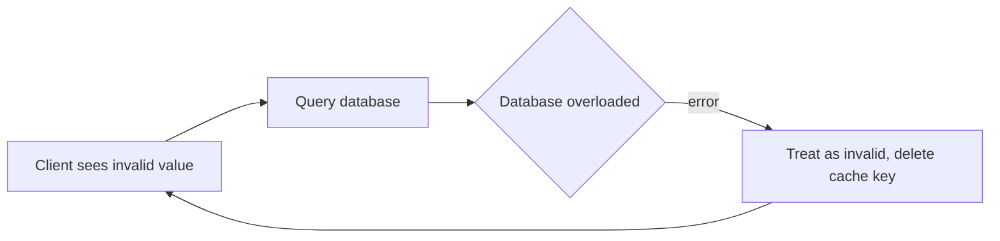
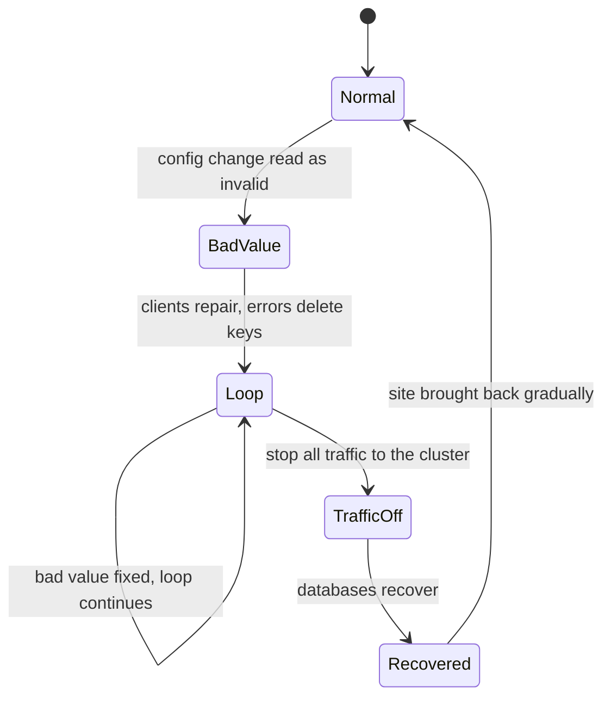

# Facebook, September 2010: the cache repair loop

## Context

Clients read configuration values through a cache backed by a persistent
store. An automated system checked cached configuration values for validity
and, when a value looked invalid, replaced it with the value from the
persistent store. That repair path was meant to make the system
self-healing.

## What happened

A change was made to a configuration value in the persistent store, and the
new value was interpreted as invalid. Every client saw the invalid value and
tried to fix it by querying a database cluster, which was quickly overwhelmed
with hundreds of thousands of queries per second. The outage lasted roughly
two and a half hours, and Facebook described it as its worst in over four
years.

## Root cause

The error handling closed a loop. When a client got an error from the
overloaded database, it treated the error as an invalid value and deleted the
corresponding cache key. So even after the original bad value was fixed, the
stream of queries continued: every error removed cached data, which caused
more database queries, which caused more errors. The database could not
recover while the loop ran.

> **Key idea:** the repair path was meant to heal the system, but because every client ran it against the same database, it multiplied one bad value into an overload.

## Fix

To break the loop, all traffic to the database cluster was stopped, which
meant turning the site off. Once the databases recovered, the site was
brought back gradually.

The incident as states, showing that fixing the value did not end it:

## Lessons

- An automatic repair path that every client runs against the database is a
  load amplifier. It multiplies a single bad value by the number of clients.
- Never treat a failed fetch as "the value is invalid". An error says nothing
  about the data, and deleting a cached value during an outage removes the
  very thing protecting the database.
- Put backoff, jitter and circuit breakers on the miss and repair paths, and
  coalesce requests so one key causes one fetch.
- Have a way to cut load to a datastore and restore it gradually. Sometimes
  the only way out of a feedback loop is to remove its input.
