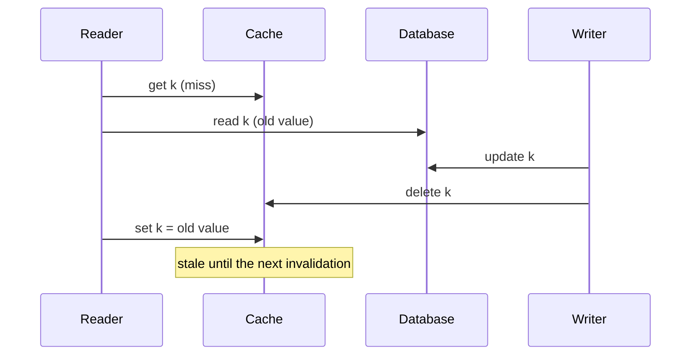

# Facebook: Scaling Memcache and leases

This is a learning case, not an outage. It is the best-known description of
what goes wrong when a look-aside cache sits in front of a database at very
large scale, and of a protocol-level fix.

## Context

Facebook used memcached as the building block of a distributed key-value
cache in front of its persistent storage. The paper's abstract describes a
system handling billions of requests per second, holding trillions of items,
for over a billion users. The cache is look-aside: clients read the cache,
and on a miss they read the database and fill the cache themselves.

## What happened

At that scale two problems that are rare in small systems become constant:

- **Thundering herds.** A popular key is invalidated or has never been
  cached, and many clients miss on it at the same moment. Every one of them
  goes to the database for the same row.
- **Stale sets.** A client misses, reads the database, and is slow to write
  the value back. Meanwhile the row is updated and the key invalidated. The
  slow client's set then puts an old value into the cache, where it can stay
  until something else removes it.

## Root cause

Both problems come from the miss path being a free-for-all. Nothing
coordinates the clients that miss on the same key, and nothing orders a
client's fill against an invalidation that happened while it was reading the
database.

## Fix

The paper introduces **leases**. On a miss, the cache gives the client a
lease token bound to that key, and only a set carrying a valid token is
accepted.

- **Stale sets:** an invalidation (delete) of the key invalidates
  outstanding tokens, so a fill that started before the invalidation is
  rejected.
- **Thundering herds:** the cache hands out a token for a key at most once
  every 10 seconds. Other clients that miss in that window are told to wait
  briefly and retry, because the value is usually refilled within
  milliseconds.

The paper reports that leases cut the peak database query rate for the
affected workload from 17K/s to 1.3K/s.

## Lessons

- The cache's main job at scale is to protect the database from correlated
  misses. Miss handling deserves a real protocol, not just "read the database
  and set".
- A fill and an invalidation for the same key must be ordered. Leases are one
  way; version numbers or compare-and-set are others.
- One mechanism (a token per key) solves a correctness problem (stale sets)
  and a load problem (herds) together, because both are about who is allowed
  to fill a key and when.
- Making other clients wait briefly is usually cheaper than letting all of
  them hit the database.
