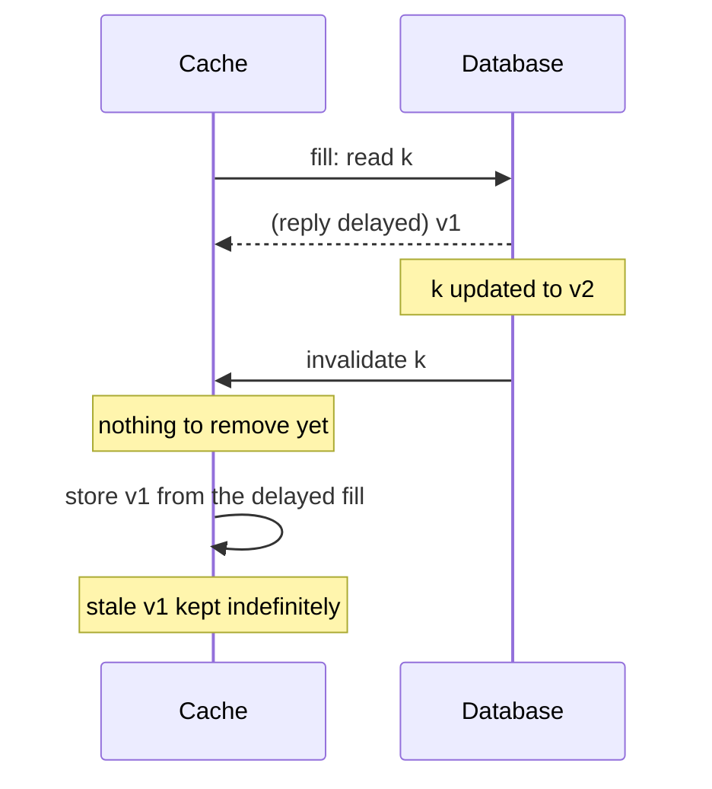

# Meta: Cache made consistent

## Context

Cache invalidation removes or updates cached entries when the source of
truth changes. If an invalidation is mishandled, the cache can serve an
inconsistent value not just briefly but indefinitely, because nothing else
will ever correct it.

## What happened

Meta described a race of this shape: a cache fill reads a value from the
database; the value is then changed in the database; the invalidation for
that change reaches the cache first; and only then does the slow fill reply
arrive and get stored. The cache now holds the old value, and the
invalidation that should have removed it has already been processed.

## Root cause

The cache had no way to order a fill response against an invalidation for
the same key. Without versions, an older value arriving late looks the same
as a fresh one.

## Fix

Meta invested in observability first: it built Polaris, which checks the
invariant "the cache should eventually be consistent with the database"
and reports violations, plus tracing for the life of invalidation events so
the faulty step can be found. With measurement in place, Meta reports a large
improvement in cache consistency.

## Lessons

- Measure consistency; do not assume it. Turn "eventually consistent" into
  an invariant you can check and a metric you can alert on.
- Use versions or timestamps so that an older value can never overwrite a
  newer one, regardless of the order messages arrive in.
- Trace invalidations end to end. When one is lost or reordered you need to
  know which hop did it.
- TTLs are a backstop that bounds how long a missed invalidation can hurt,
  not a substitute for correct invalidation.
