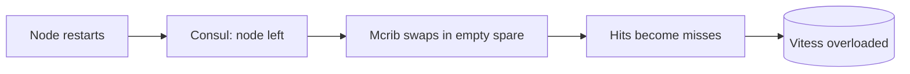

# Slack, 2-22-22: a cold cache after a fleet restart

## Context

Slack served data through Memcached, reached via Mcrouter, with Vitess
(sharded MySQL) as the datastore behind it. A service called Mcrib generated
the Mcrouter configuration and watched Consul to learn which cache nodes were
up.

## What happened

A deliberate restart of 25% of the cache fleet, done to upgrade monitoring
software, coincided with peak traffic. Many users could not connect. A Vitess
keyspace holding channel membership became severely overloaded, mostly by a
query that lists the group DM conversations of a user.

## Root cause

When Consul reported that a cache node had left, even temporarily for a
restart, Mcrib replaced it with a fresh, empty spare. Requests that would
have been hits on the restarted node became misses on the spare and went to
Vitess instead. The design was not built for a coordinated wave of restarts,
so a quarter of the cache went cold at once.

To see why that is so severe, run the numbers (the same arithmetic is a
practice question in "Learning from caching incidents"): with a 98% hit ratio, losing 25% of the cache takes the miss ratio from 2% to
about 26.5%, roughly 13 times the database load.

## Fix

The mitigation was to throttle client boot requests. That reduced the load on
the database enough for the caches to refill, after which normal traffic
could be served again.

## Lessons

- At high hit ratios the cache is part of the database's capacity, not an
  optimisation. Losing cache is the same as multiplying database load.
- Restart cache fleets slowly and watch hit ratio and database load between
  batches, especially near peak.
- Membership automation that "heals" by swapping in empty nodes trades
  availability of the cache for load on the database. Prefer letting a
  restarting node come back warm, or warming replacements first.
- Keep a lever, such as throttling expensive client operations, that lowers
  database load enough for the cache to recover.
