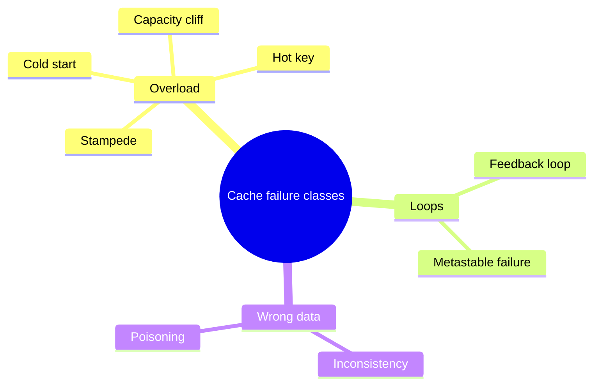
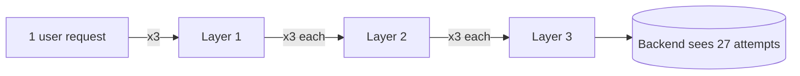
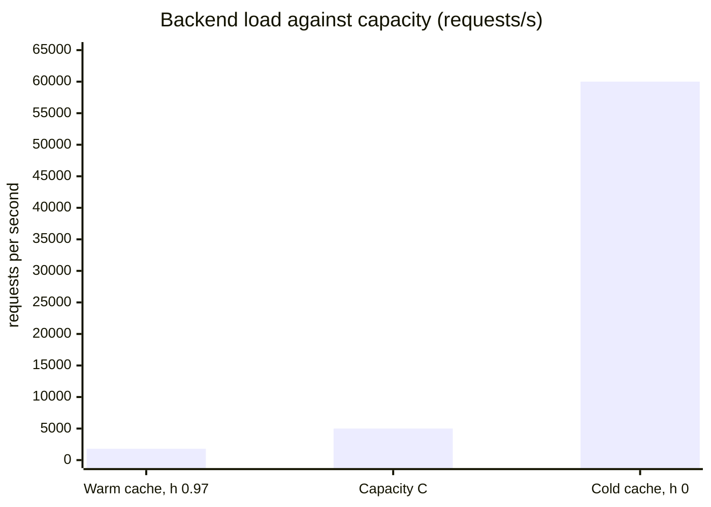
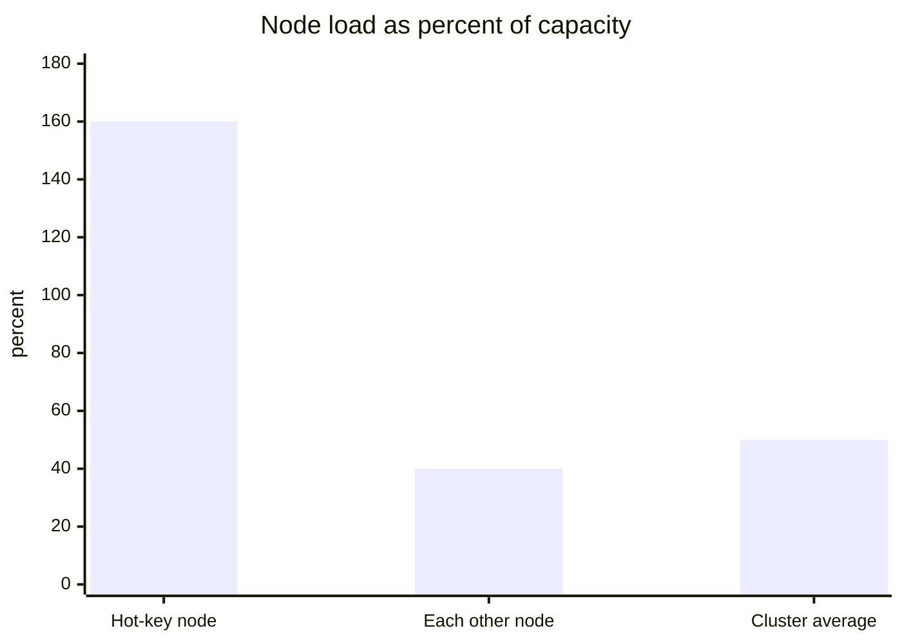
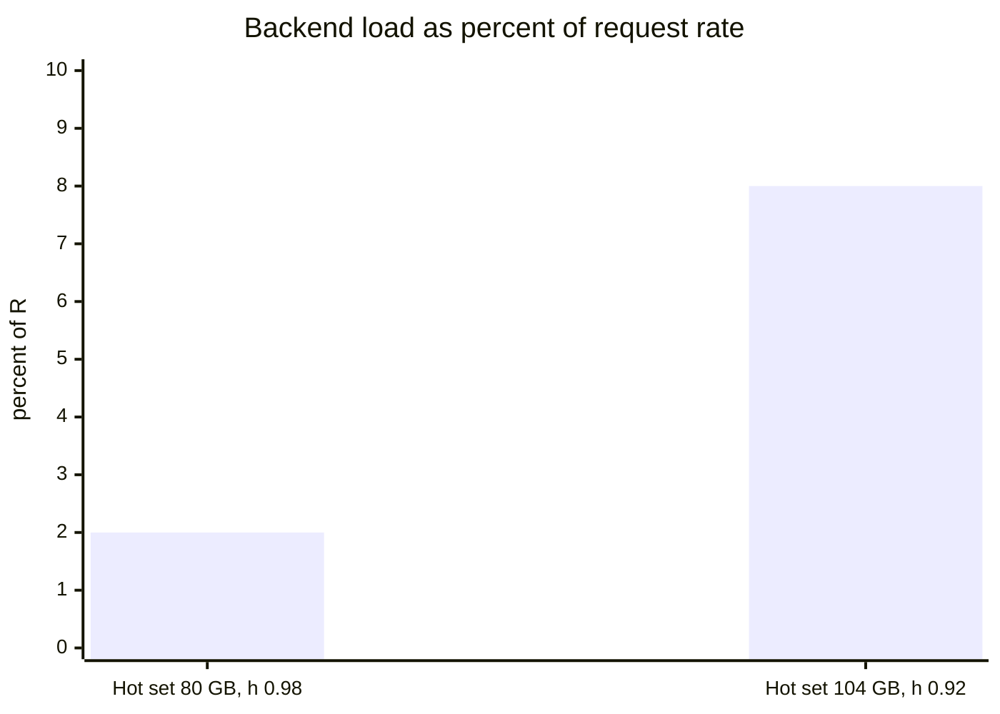
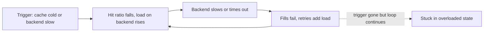
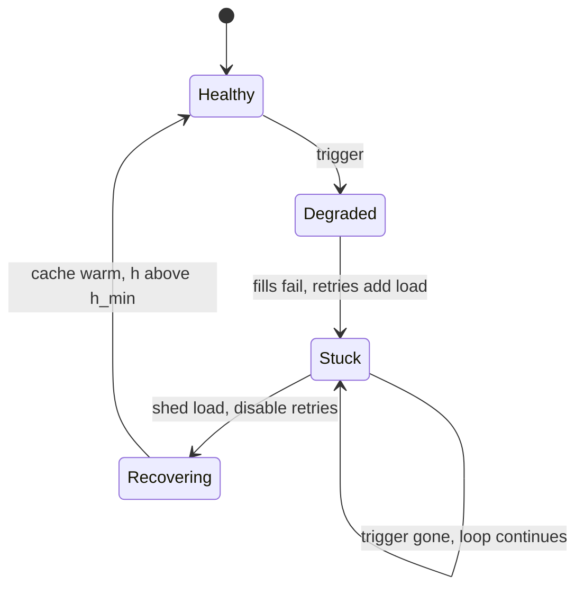
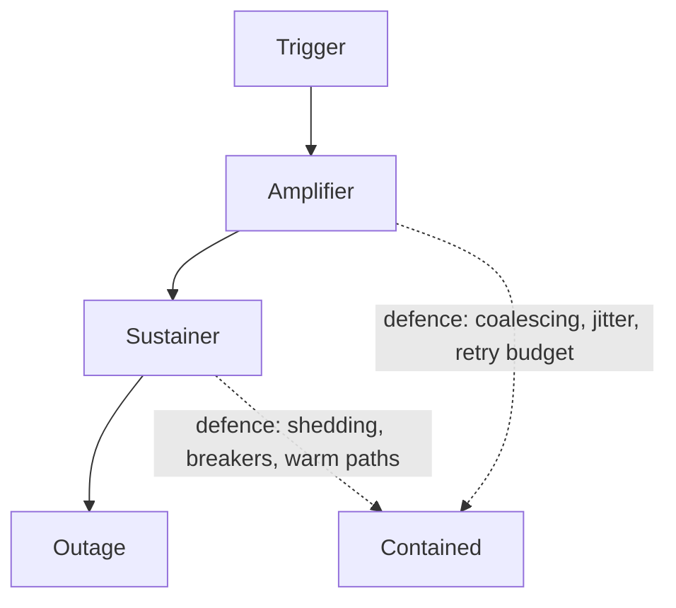

# A taxonomy of caching failures and the load-bearing cache

## Learning objectives

After this lesson you should be able to:

- Explain why incidents involving caches are best studied as patterns rather than isolated stories.
- Define and distinguish eight failure classes: stampede, feedback loop, cold start, hot key, inconsistency, poisoning, capacity cliff and metastable failure.
- Explain the cache as a load-bearing dependency: how a cache can hide the true capacity of the system behind it, and how to measure that hidden gap.
- Compute a "safe miss budget" and a "cache-loss survivability" figure for a system.
- Describe how small triggers become large outages through amplification and positive feedback.
- Recognise which defensive patterns address which failure class.

## 1. Why study failures by class

Every outage is unique in its details: a particular deploy, a particular traffic pattern, a particular configuration. But the mechanisms that turn a small event into a large outage recur. Aviation, medicine and civil engineering learned long ago that the discipline of reading incident reports and extracting mechanisms is how a field accumulates wisdom. Software engineering is catching up, and caching offers an excellent training ground, because the pattern is so regular: a cache sits in front of an expensive resource, the system is tuned to the cache's presence, and a disturbance removes the cache's protection exactly when the system is least able to afford it.

This chapter asks you to read a postmortem (an organisation's written account of an incident) the way an engineer reads a proof: not for the story, but for the causal chain. When you read an account of a caching incident, you should be able to answer: what was the trigger, what was the amplifier, what was the dependency that failed, why did it not recover by itself, and which defence would have broken the chain? We do not retell any specific incident in this chapter; the book's case studies do that, with sources. Here we build the vocabulary and method you will bring to them.

Throughout, keep in mind a basic accounting identity. If a service receives `R` requests per second and the cache has hit ratio `h`, the backing resource (database, origin, service) receives

`B = R * (1 - h)`

requests per second. Almost every failure in this chapter is a story about `R` rising, `h` falling, or `B` exceeding what the backing resource can serve, which we call its capacity `C`. The system is healthy while `B < C`. A cache is a device for making `B` much smaller than `R`; the danger is that the system then silently depends on `B` staying small.

## 2. The failure taxonomy

The eight classes at a glance:

### 2.1 Stampede (thundering herd, dogpile)

_Mechanism._ Many requests for the same key miss at the same moment, and all of them go to the backing store to recompute the value. Typical triggers: a popular key expires; a key is deleted or invalidated; a cache node restarts; a deploy changes the key format. The backing store receives `N` identical, expensive requests instead of one.

_Arithmetic._ A key read 5,000 times per second whose value takes 800 ms to compute. At the moment of expiry, every request arriving in the next 800 ms misses before anyone has filled the cache: `5,000 * 0.8 = 4,000` concurrent identical computations, where one would do. If each occupies a database connection and the pool holds 200, the pool is exhausted in under 40 ms and unrelated queries now queue behind them.

_Signature._ A sudden spike in backing-store load that coincides with an expiry or invalidation; many identical queries in the database's active list; latency rising for everything, not only the affected key.

_Defences._ Request coalescing (single-flight), so that one caller computes while the rest wait; locks or leases on the miss path with a short timeout; probabilistic early refresh so keys are renewed before they expire; TTL jitter so related keys do not expire together; serving stale while refreshing in the background. These are treated in the chapters on stampedes and TTLs.

### 2.2 Feedback loops and retry amplification

_Mechanism._ A positive feedback loop: slowness causes behaviour that causes more slowness. In caching systems the most common loops are:

- _Timeouts treated as misses._ The backing store becomes slow; requests time out; clients treat the timeout as a miss; they retry; the retries add load; the store becomes slower. Because a timed-out request often still consumes backend resources, the work is wasted.
- _Failed fills._ A miss triggers a fill; the fill fails or is too slow; nothing is stored; the next request misses again. The cache stays empty exactly because the backend is overloaded, and the cache being empty keeps the backend overloaded.
- _Retries multiply by tiers._ If each of three layers retries three times, one user request can become up to `3 * 3 * 3 = 27` backend attempts. In a request path with `d` layers each retrying `r` times, the worst-case amplification is `r^d`.

Three layers that each make 3 attempts:

_Signature._ Request rate at the backend exceeds the user request rate; error rates climb together with the request rate; recovery does not occur when the original trigger disappears.

_Defences._ Retry budgets and exponential backoff with jitter; retries at one layer only; circuit breakers that stop calls to a failing dependency; deadlines propagated down the call chain so that work for an already-abandoned request is cancelled; load shedding.

### 2.3 Cold start

_Mechanism._ A cache is empty or nearly empty: after a restart, a flush, an eviction storm, a new cluster, a failover to a region without warm data, a key-format change. `h` drops from, say, 0.97 to 0.0, and `B` jumps from `0.03 R` to `R`: a thirty-three-fold increase for a service whose backend was provisioned for the former.

_Arithmetic._ `R = 60,000` requests per second; `h = 0.97`, so `B = 1,800`. Database capacity `C = 5,000`. A cold cache sends `B = 60,000`: twelve times capacity. Even if the cache warms in a perfectly exponential fashion, the system is over capacity until `h` climbs above `1 - C/R = 1 - 5,000/60,000 = 0.917`. Warming is not instantaneous: it requires the backend to serve the misses that fill the cache, and the backend cannot serve them while overloaded, so the time to warm may become infinite. That is the doorway to a metastable state (Section 2.8).

_Signature._ An abrupt drop in hit ratio coinciding with a deploy, restart, or flush; backend saturated; slow or absent recovery.

_Defences._ Gradual traffic ramp-up; warming from a replica, a snapshot or a replayed sample of hot keys; replicas so a node loss does not cool the data; keeping the old cache and the new in dual-read mode during migrations; load shedding and rate-limited fills; never flushing a production cache as a casual fix.

### 2.4 Hot key

_Mechanism._ Sharding spreads keys evenly, not load. A single key or a small group of keys receives a large fraction of traffic (a viral item, a global configuration value, a celebrity's profile, a rate-limit counter). The node that owns it saturates in CPU or network while the rest of the cluster idles. Adding nodes does not help, since a key lives on one node.

_Arithmetic._ A 12-node cluster handles 600,000 reads/s, 50,000 per node on average. One key attracts 20% of traffic: 120,000 reads/s. A node's capacity is 100,000/s. That node is over capacity by 20% plus its normal share of other keys, while the other 11 nodes run at about 40%: the cluster as a whole is at 50% utilisation and yet is failing. Average utilisation is the wrong metric.

The 12-node example in numbers:

_Signature._ One shard's CPU, network or latency is far above its peers; error rates cluster on that shard; adding capacity elsewhere does nothing. Failures can cascade: if the hot node falls over and its keys move to the next node (as in a hash ring), the hot key moves too and takes down the next node.

_Defences._ Local in-process caches for hot keys with a short TTL; replicating the key to several nodes (key suffixes chosen randomly on reads); client-side or proxy-side detection and automatic promotion; request coalescing; splitting counters.

### 2.5 Inconsistency (stale or divergent data)

_Mechanism._ The cache holds a value that no longer matches the source of truth, or two caches disagree. Sources: lost or delayed invalidation messages; races between a reader that fills the cache and a writer that invalidates it (the reader reads old data, the writer updates and deletes, the reader then writes the old data into the cache); replication lag between database replicas followed by caching of a lagged read; multi-region delays; mismatched TTLs across layers; partial failures in dual writes; a bug that skips invalidation on one code path.

_Why it is dangerous._ Unlike overload, inconsistency does not announce itself. Dashboards are green; hit ratio is excellent; the data is wrong. It is often discovered by users, sometimes much later, and the stale value may persist until TTL. For some data (prices, permissions, inventory, security settings) the damage is financial or a security failure.

_Signature._ Complaints about stale data with healthy infrastructure; discrepancies between cache and database on sampling; correlation with deploys that touched write paths or with replication lag.

_Defences._ Delete-on-write rather than update-on-write; versioned values and compare-and-set to refuse older writes; leases that detect interleaving writers; TTLs as a backstop; invalidation driven from the database's commit log, so it cannot be skipped by application code; periodic reconciliation jobs that sample and compare; designing which data may be stale and for how long, explicitly.

### 2.6 Poisoning (bad data cached and amplified)

_Mechanism._ A wrong, empty or malicious value gets stored and served to many requests. Variants: an error response cached as if it were a success (a transient failure cached for the whole TTL); a negative-cache entry ("not found") stored because the source was briefly unavailable; a partial or corrupted result cached because a failed dependency was treated as an empty set; a response cached under a key that does not capture all the inputs (so one user's content is served to another or an attacker's crafted request alters the stored content for everyone); a bad deploy that writes malformed values before being rolled back.

_Why the cache makes it worse._ A bug that would have affected only requests it touched now affects everyone for the TTL, and the rollback of the code does not remove the data already stored.

_Signature._ Error or odd content persisting after the underlying cause is fixed; the same wrong answer to many users; recovery only on cache expiry or manual purge.

_Defences._ Never cache failures or partial results (or cache them for seconds); validate values before storing; key on all inputs that affect the response; version keys so a bad generation can be abandoned by bumping the version; separate "not found" from "error"; a documented, tested purge procedure; canary deploys with cache-correctness checks.

### 2.7 Capacity cliff

_Mechanism._ A system behaves well up to some load and then collapses sharply, rather than degrading gradually. Cache-related cliffs: memory full, so eviction begins and the working set no longer fits (hit ratio falls non-linearly when the cache becomes smaller than the hot set); connection limits reached; a thread or connection pool exhausted; the network interface saturated; a disk-backed tier (a database buffer pool that was effectively a cache) losing its working set so that queries that took microseconds from memory take milliseconds from disk, a thousand-fold slowdown.

_Arithmetic._ Hit ratio as a function of cache size under skewed access can fall steeply near the point where the hot set exceeds memory. Suppose the hot set is 80 GB and the cache is 100 GB at a 98% hit ratio. Data growth of 30% takes the hot set to 104 GB; hit ratio might drop to 92%, tripling backend load, `B` from `0.02R` to `0.08R`, a factor of four. A 30% growth in data led to a 300% growth in backend load; the system was operating on the edge of a cliff and nobody knew.

The 80 GB hot set example, before and after 30 percent growth:

_Signature._ A metric that has been flat for months suddenly bends sharply; the system "fell off a cliff" after a small change in data size, traffic or configuration.

_Defences._ Headroom planning (not just average, but the distance to the cliff); load tests that push beyond expected peak to find the cliff; alerts on leading indicators (eviction rate, memory utilisation, pool saturation) rather than on the failure; autoscaling for stateless parts and pre-provisioning for stateful ones.

### 2.8 Metastable failure

_Mechanism._ A metastable failure is a state in which the system remains overloaded and degraded **after the original trigger has gone away**, because a sustaining feedback loop keeps it there. The concept was described in the research literature on distributed systems, and it gives a precise name to a pattern that operators know well: "we fixed the cause and it still would not recover."

The structure has three parts: a _trigger_ (a spike in traffic, a cache flush, a slow database query), a _vulnerability_ (a stable state that is only stable because of an efficiency, such as a cache hit ratio, that the system relies on), and a _sustaining effect_ (a loop in which the overloaded state removes the efficiency or adds work). Here is the canonical caching form:

1. The system runs at `h = 0.95`; the backend is comfortably within capacity.
2. A trigger (a brief backend slowdown, a cache restart) causes misses and timeouts.
3. Because the backend is slow, fills fail or are delayed, and timed-out requests are retried. The cache is not warming, since the fills that would warm it cannot complete; the retries increase the load.
4. With `h` low and retries high, `B` stays above `C`. The backend remains slow.
5. Removing the original trigger changes nothing: the system's _current_ state is self-sustaining.

The same story as states, showing why removing the trigger changes nothing:

_Recovery._ Escape requires breaking the loop by **reducing load below the recovery threshold**, not by fixing the original cause: shed load aggressively (reject a fraction of requests at the edge), disable retries, route traffic gradually back as the cache refills, temporarily serve stale or degraded content, add backend capacity. Operators sometimes discover that the only way out is to shut off traffic completely, let the system drain, and reintroduce load in stages.

_Signature._ Degraded state persisting long after the trigger; high retry and timeout rates; hit ratio stuck low; relief only when load is cut.

_Defences._ Design so that the system is stable _without_ the efficiency, or at least can shed load to a level at which it is: load shedding and admission control; bounded queues; retry budgets; prioritised traffic; circuit breakers; protecting the cache-fill path so fills have reserved capacity; capacity planning for the cold state.

## 3. The cache as a load-bearing dependency

### 3.1 The idea

Architects commonly describe caches as an optimisation: they make the system faster and cheaper. But once a system has run behind a cache for long enough, its capacity planning, its traffic, its latency expectations and its team's habits all adapt to the cache. The backend is provisioned for `B = R(1 - h)`, not for `R`. At that moment the cache is no longer an optimisation: it is a **structural element**. The system will not stand without it, just as a building will not stand without its load-bearing walls, even if the walls were originally put up for a different reason.

The honest question for any cached system is: _what is the true capacity of the backend, and what is the system's capacity if the cache disappears?_ The cache **hides** this number. In steady state, everything looks healthy: the backend is at 20% utilisation, plenty of headroom, and the capacity planning review is satisfied. The real headroom, the one that matters in an incident, is hidden behind the hit ratio.

> **Key idea:** a cache with hit ratio h makes the backend carry R(1 - h), so the system is provisioned for the cached load. Its real capacity is hidden until the cache is gone.

### 3.2 Quantifying the hidden gap

Define:

- `R`: peak request rate that reaches the cache.
- `h`: normal hit ratio.
- `C`: the backend's safe capacity (the load at which it still meets its latency target, not its absolute breaking point).

Then:

- **Normal backend load:** `B = R(1 - h)`.
- **Apparent headroom:** `C / B`, how much the backend load could grow. If `B = 2,000` and `C = 10,000` the apparent headroom is 5x.
- **Cache dependence factor:** `1 / (1 - h)`. At `h = 0.95`, this is 20; at `0.99`, it is 100. It tells you how many times larger the backend load would be without the cache. A system with a dependence factor of 100 is a system that can function only because 99 out of 100 requests never reach the backend.
- **Minimum survivable hit ratio:** `h_min = 1 - C/R`. The cache must keep `h >= h_min` or the backend is over capacity. With `R = 100,000` and `C = 10,000`, `h_min = 0.90`. If the normal ratio is 0.99, then the _margin_ is nine points: any event that removes more than 9 points of hit ratio causes overload.
- **Cache-loss survivability:** the fraction `f` of the cache you can lose and stay within capacity. If the loss of a fraction `f` of keys (assuming uniform) turns those requests into misses, the new miss ratio is `(1 - h) + f h`. Setting this equal to `C/R`: `f_max = (C/R - (1 - h)) / h`. With the numbers above: `(0.10 - 0.01) / 0.99 = 0.0909`. You can lose about 9% of the cache, roughly one node in eleven. Losing 1 of 8 nodes (12.5%) takes you over the edge, and no individual node failure appeared to be critical in the design review.

### 3.3 Worked case: when the apparent headroom lies

A product page service handles 80,000 requests/s at peak with `h = 0.98`. The database handles 1,600/s of misses. It was load tested up to 8,000 per second before latency exceeded the target. The team believes they have a 5x headroom ("we could take a five-fold traffic spike").

Test the belief. A traffic spike of 5x with the same hit ratio brings `B` to 8,000: just at the limit, so far consistent. But a spike made of _new, unpopular_ items (a marketing campaign pushing a catalogue's long tail, a crawler) will arrive with a much lower hit ratio, say 0.60: `B = 0.40 * 400,000 = 160,000` at 5x load. And a cache flush at 1x load gives `B = 80,000`: ten times the tested limit. The "5x headroom" was valid for exactly one kind of event, a uniform increase in traffic with unchanged hit ratio, and invalid for the events that actually cause outages.

The correct summary is a table of scenarios rather than one number:

| Scenario                    | Hit ratio | Backend load | Within 8,000? |
| --------------------------- | --------- | ------------ | ------------- |
| Normal peak                 | 0.98      | 1,600        | yes           |
| 5x spike, same mix          | 0.98      | 8,000        | at the limit  |
| One of 10 cache shards lost | 0.882     | 9,440        | no            |
| Long-tail crawl at 2x       | 0.70      | 48,000       | no            |
| Full cache flush            | 0.00      | 80,000       | no            |

Producing such a table is the single most useful exercise in a caching design review.

### 3.4 Why the dependency is invisible

Several mechanisms conspire to hide it.

- **Success is silent.** The cache works; no alarms; no one examines the backend's capacity because it is idle.
- **Backends drift.** Because the backend is lightly loaded, others begin sharing it, and queries get heavier, schemas grow, indexes lapse. Nobody tests the backend at full unaided load.
- **Teams optimise around the cache.** Query patterns that are acceptable only when cached (a 2-second aggregation) are shipped on the assumption that they will be cached.
- **Load tests run warm.** A test that begins with a warm cache measures the cached system, and is silent about the cold one.
- **Metrics average away the risk.** A 98% mean hit ratio hides a 40% ratio on the key class that matters.

### 3.5 Making the dependency explicit

Treat the cache's presence as an SLO-level dependency:

1. **Know the unaided capacity** of every backend by load testing it with the cache disabled (in a safe environment). Record it.
2. **Compute and publish** `h_min`, the dependence factor, and cache-loss survivability. Review them when traffic or hit ratio changes.
3. **Design the degraded modes:** what happens when `h < h_min`? Options: shed low-priority traffic, serve stale content, return partial or default responses, queue and rate limit fills.
4. **Protect the backend with its own limits:** per-client rate limits, concurrency limits, query timeouts and a request queue with a bounded length, so that overload manifests as fast rejections rather than collapse.
5. **Rehearse** cache loss in a game day.
6. **Segment the criticality.** Separate caches for critical and non-critical data prevent a noisy tenant from evicting a critical working set.

## 4. How small triggers become large outages: amplification

Putting the taxonomy together, outages often follow a chain with three kinds of link:

- **Trigger:** the first event, often mundane: a deploy, a restart, an expiry, a spike, a hardware fault.
- **Amplifier:** a mechanism that multiplies the trigger's effect: a stampede (N identical requests), retries (`r^d`), a hot key moving along a ring, a cold start that converts a node loss into a backend overload.
- **Sustainer:** a loop that keeps the system in the bad state: failed fills, timeouts treated as misses, queues that fill with abandoned work, autoscalers adding capacity that is itself cold.

The practical lesson: **fixing the trigger is rarely enough; the chain is broken at the amplifier or the sustainer.** If your postmortem ends with "a bad deploy caused the outage; we added a check to the deploy", you have fixed a trigger and left the amplifier in place for the next, different trigger.

## 5. Mapping failures to defences

| Failure class  | Primary defences                                                                                   |
| -------------- | -------------------------------------------------------------------------------------------------- |
| Stampede       | single-flight, leases, early refresh, TTL jitter, stale-while-revalidate                           |
| Feedback loop  | retry budgets, backoff with jitter, circuit breakers, deadlines, single retry layer                |
| Cold start     | traffic ramp, warming, replicas, dual-read migrations, no casual flushes                           |
| Hot key        | local caches, key replication, request coalescing, hot-key detection                               |
| Inconsistency  | delete-on-write, versions and CAS, leases, log-driven invalidation, reconciliation                 |
| Poisoning      | do not cache failures, validate, key on all inputs, versioned keys, purge tooling                  |
| Capacity cliff | headroom, beyond-peak load tests, leading-indicator alerts                                         |
| Metastable     | load shedding, admission control, bounded queues, protected fill path, capacity for the cold state |

No single defence covers everything. A mature design layers them, so that when one fails another contains the damage.

## 6. Common pitfalls in analysis

- **Stopping at the trigger.** "A restart caused it" is a description of the beginning, not an explanation.
- **Treating the cache as "just a performance optimisation".** Compute the dependence factor and decide.
- **Believing aggregate metrics.** Hit ratio, CPU and latency averages hide per-shard and per-key-class failures.
- **Testing with warm caches only.**
- **Assuming linearity.** Capacity cliffs and feedback loops make behaviour non-linear.
- **Counting "headroom" in only one scenario.**
- **Treating timeouts as misses everywhere.**
- **Believing a fix is complete because the graph recovered.** In metastable failures recovery may be coincidence or manual intervention; ask whether the system could re-enter the state.

## 7. Check your understanding

1. State the identity for backend load in terms of request rate and hit ratio. Use it to compute backend load for `R = 45,000`, `h = 0.96`, and the minimum survivable hit ratio if the backend capacity is `C = 6,000`.
2. A system has hit ratio 0.995. What is its cache dependence factor, and what does that number tell you?
3. Explain the difference between a trigger, an amplifier and a sustainer using the cold-start example.
4. Why does adding more cache nodes not solve a hot key problem? Give two effective mitigations.
5. What is a metastable failure? Why is "the trigger was removed, but it does not recover" a signature of it, and what is the first thing you do to recover?
6. Retries are configured at three layers, each allowing 2 retries (3 attempts in total). What is the worst-case number of backend attempts per user request? Suggest two ways to limit the amplification.

## 8. Answers

1. `B = R(1 - h)`. With the figures: `45,000 * 0.04 = 1,800` requests/s. Minimum survivable hit ratio is `1 - C/R = 1 - 6,000/45,000 = 1 - 0.1333 = 0.867`, so the hit ratio must stay above about 86.7%.
2. `1/(1 - 0.995) = 200`. Without the cache the backend would see 200 times the load; the system is extremely dependent on the cache and almost certainly cannot run without it, so loss of the cache is an outage unless degraded modes exist.
3. Trigger: a node restart or flush that empties the cache. Amplifier: the hit ratio falls from, say, 0.97 to 0, multiplying backend load by about thirty. Sustainer: the overloaded backend cannot complete the fills that would rewarm the cache, and timeouts and retries add load, so the cache stays cold.
4. A key lives on one node, so more nodes do not share its load. Mitigations: a short-TTL in-process cache in the application for the hot key; replicate the key under several suffixed names read at random; coalesce requests; shard counters.
5. A metastable failure is a self-sustaining overloaded state in which a feedback loop persists after the trigger has gone. Because the loop itself holds the system down, removing the cause does not help. First, reduce load below the recovery threshold (shed load, disable retries, ramp traffic back gradually while the cache warms).
6. Worst case `3 * 3 * 3 = 27` attempts (if each of the three layers makes 3 attempts per request from the layer above). Limit by retrying at one layer only, using retry budgets (a cap on the retry rate as a fraction of requests), backoff with jitter, circuit breakers, and propagating deadlines.

## 9. Summary

Caching incidents repeat a small number of mechanisms: stampedes, feedback loops, cold starts, hot keys, inconsistency, poisoning, capacity cliffs and metastable failures. Because a cache makes backend load `R(1 - h)` rather than `R`, the system comes to depend on the hit ratio, and the backend's real capacity is hidden. Quantify this with the dependence factor `1/(1 - h)`, the minimum survivable hit ratio `1 - C/R` and cache-loss survivability, and test scenarios rather than a single headroom number. Outages usually chain a trigger to an amplifier to a sustainer, and the defences that matter are those that break the chain at the amplifier or sustainer: coalescing, jitter, retry budgets, shedding, warm paths and protected fills. The next lesson turns this vocabulary into a method: a template for analysing an incident report, and a checklist for reviewing a caching design in production or in an interview.
