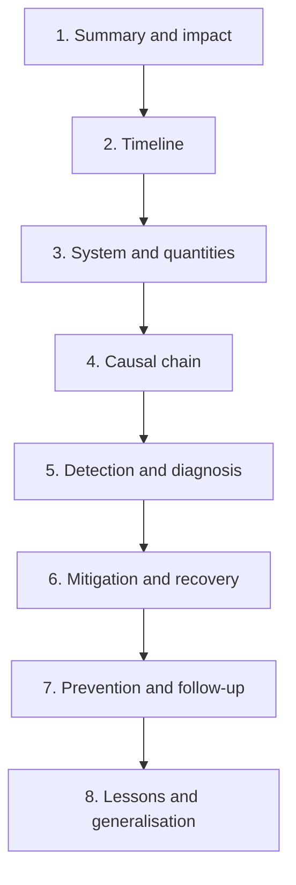

# Analyzing an incident and reviewing a caching design

## Learning objectives

After this lesson you should be able to:

- Read a postmortem critically: separate facts from interpretation, find the causal chain, and judge whether the proposed fixes address it.
- Apply a systematic incident analysis template (timeline, quantities, chain, detection, mitigation, recovery, prevention) to any caching incident.
- Reconstruct the numbers behind an incident (request rates, hit ratios, capacity) and test whether the account is quantitatively plausible.
- Use a design review checklist to examine caching in a production design.
- Use the same material as a structured approach in a system design interview.
- Write down a caching design decision in a form that a reviewer can challenge.

A note on examples. Every scenario in this lesson is a deliberately invented teaching example with made-up numbers. None describes a real organisation's incident. The book's separate case studies cover real incidents, each with verified sources, and you should apply the template here to each of them.

## 1. How to read a postmortem

A good postmortem is a piece of causal reasoning. A bad one is a story with a villain. When you read a published account of an incident (including those in this book's case studies), read it in three passes.

**Pass 1: what happened.** Extract the _observable facts_: times, graphs, numbers, quoted error messages, configuration values. Ignore adjectives. Write a timeline in your own words with a column for "fact" and a column for "claim". "At 10:02 the cache hit ratio fell from 98% to 31%" is a fact. "The cache was overwhelmed" is a claim.

**Pass 2: why it happened.** Find the causal statements. Ask of each: _is it a trigger, an amplifier, a sustainer, or a latent condition?_ (Terms from the taxonomy lesson.) Look for the words "because", "which caused", "as a result". Check that each link in the chain is supported by evidence in the document rather than assumed. If a report says "the restart caused the outage", ask what made a restart capable of causing an outage; the answer is the interesting part.

**Pass 3: what changed.** Read the remediation items. For each, ask: which link in the chain does this break? A remediation that only fixes the trigger ("add a check so this deploy cannot be released again") leaves the amplifier; a remediation that adds a circuit breaker, a retry budget or a warm path breaks a link that would defeat future triggers too. Count how many remediation items address triggers, amplifiers, sustainers, detection and recovery. A healthy list covers several.

Some further habits of a careful reader:

- **Be wary of hindsight.** The people involved did not know what you now know. Ask what information was available at each decision and whether the dashboards would have shown it. Postmortems that ask "why did the system allow this?" teach more than ones that ask "who did this?".
- **Distinguish the proximate cause from the root conditions.** There is rarely a single "root cause". A common structure is a _latent condition_ (the system had no headroom without the cache), a _trigger_ (a routine event) and _missing defences_ (no coalescing, no load shedding).
- **Check the numbers.** If the report says the database handled 4,000 queries per second normally and failed at 20,000, see whether the cache dynamics could produce a fivefold increase (Section 3).
- **Look for what went right.** Which defence worked, which person's decision shortened the outage? Copy those.
- **Notice what is not said.** A report that does not mention detection time, or why recovery took as long as it did, has probably not asked.
- **Beware generalising from one incident.** An incident shows that a failure mode is possible, not that it is likely. Use it to enrich your taxonomy and your checklist, not to dictate your priorities.

## 2. The incident analysis template

Use the following template, whether you are analysing a published incident, writing your own postmortem, or presenting a case in a study group. The sections are ordered so that facts precede interpretation.

### 2.1 Summary and impact

One paragraph: what users experienced, for how long, how many were affected, and what business or data impact followed. Include whether data was lost or wrong, because stale or incorrect data is a different category of impact from unavailability.

### 2.2 Timeline

Times, in order, each tagged _trigger_, _symptom_, _detection_, _action_, _recovery_. Include the delay between each stage: time to detect (TTD), time to mitigate (TTM), time to full recovery. These delays are often more instructive than the cause. An incident whose cause was quick to fix but took forty minutes to notice points at monitoring; one whose mitigation took hours because the system would not recover points at a sustainer (a metastable state).

### 2.3 System and quantities

Draw the architecture in miniature: clients, cache tiers, backends, and the paths between them. Then fill in the numbers. If the report omits a number, estimate it and mark it as an estimate.

| Quantity                      | Before | During | After |
| ----------------------------- | ------ | ------ | ----- |
| Request rate `R` (per second) |        |        |       |
| Hit ratio `h`                 |        |        |       |
| Backend load `B = R(1-h)`     |        |        |       |
| Backend capacity `C`          |        |        |       |
| Retry rate                    |        |        |       |
| Cache size and working set    |        |        |       |
| Latency percentiles           |        |        |       |

Check consistency: does `B` during the incident exceed `C`? By how much? Is the hit ratio drop sufficient to explain the load? If not, something else (retries, a hot key, a different workload) must have added load, and finding it is the point.

### 2.4 Causal chain

Write the chain as a sequence of statements of the form _because A, B; because B, C_. Classify each link:

- **Latent condition:** present before the incident (the backend lacked unaided capacity; no coalescing; a TTL aligned to the hour).
- **Trigger:** the event that started it.
- **Amplifier:** multiplied the effect (stampede, retries, cold start).
- **Sustainer:** kept the system in the bad state (failed fills, timeouts as misses).
- **Failed defence:** a safeguard that existed but did not work (a circuit breaker with the wrong threshold, a rate limit set above capacity, an untested failover).

Then ask the **counterfactual**: for each link, "if this had been absent, would the incident have occurred?" Links without which the incident does not occur are _necessary_; the cheapest necessary link to remove is where to invest.

Map each link to the failure taxonomy (stampede, feedback loop, cold start, hot key, inconsistency, poisoning, capacity cliff, metastable failure). Most incidents involve two or three.

### 2.5 Detection and diagnosis

How was the incident detected: an alert, a customer report, an engineer noticing? Which signals were available but unused? Which signals misled (for example a healthy aggregate hit ratio masking a failing shard)? How long did it take to find the cause, and which tools helped? Identify the missing observability that would have shortened diagnosis: per-shard metrics, per-key-class hit ratios, a dashboard linking cache and database load, a cache-status header in logs.

### 2.6 Mitigation and recovery

What actions restored service, in what order, and which actions made things worse? Record the knobs that were available (rate limits, feature flags, traffic shifting, scaling) and those that were missing. If recovery required cutting traffic and ramping up, note the ramp profile and the hit ratio at each step. Ask: could the system have recovered on its own? If not, why not (which sustainer)?

### 2.7 Prevention and follow-up

For each remediation, mark the link it breaks, its cost, its confidence and whether it has an owner and a date. Add _detection_ items (alerts on leading indicators), _containment_ items (limits, breakers, shedding), _recovery_ items (runbooks, warm-up tooling) and _verification_ items (a game day that reproduces the failure to prove the fix).

### 2.8 Lessons and generalisation

State the lesson at two levels: the specific (this system) and the general (this class of systems). The general lesson is the one you carry to your own designs. Example general lessons: "A cache's miss path must have its own capacity budget." "Never let invalidation depend solely on application code paths." "Timeouts are not misses."

### 2.9 A compact worked example (invented)

Suppose an invented report reads, in summary: "At 02:00 a nightly job refreshed 40 million keys, all given a 24-hour TTL at the same moment. At 02:00 the next day, they all expired together. The database, usually at 15% CPU, went to 100% and the site was unavailable for 25 minutes."

Apply the template.

- _Quantities._ Suppose `R = 50,000` requests/s, normal `h = 0.97`, so `B = 1,500`; database capacity `C = 6,000`. If 70% of requests touch the refreshed keys and they all expire at once, the hit ratio for that portion drops to zero until refilled: new `h ≈ 0.97 * 0.30 ≈ 0.29`, so `B ≈ 0.71 * 50,000 = 35,500` requests/s: nearly six times capacity.
- _Chain._ Latent: all keys share an expiry time (no jitter); no coalescing; database has no headroom for more than 4x. Trigger: the TTL boundary. Amplifier: synchronised expiry, a "cold start" of 70% of the traffic. Sustainer: timeouts and retries; fills failing. Failed defence: none present.
- _Taxonomy._ Stampede (synchronised expiry), cold start, feedback loop, metastable risk.
- _Remediation that breaks the chain._ TTL jitter (removes the synchronisation); coalescing and stale-while-revalidate (removes the amplifier); load shedding and a retry budget (breaks the sustainer); alerts on hit ratio and on database queue depth (detection). Remediation that only addresses the trigger: "move the job to 03:00".

Notice how the analysis turned a one-line cause into five distinct improvements and exposed a weak fix.

## 3. Checking the numbers

Quantitative plausibility checks catch errors in your reading and in the reports. A few that are worth knowing by heart.

**Hit-ratio to load.** `B = R(1 - h)`. A fall from 99% to 90% raises backend load tenfold; from 95% to 90%, twofold. Small changes in a high hit ratio are large changes in backend load.

**Fill time.** How long does a cold cache take to warm? Suppose the working set is 20 million keys and the backend can serve `F` fills per second beyond its normal load. Filling all keys takes `20,000,000 / F`. With `F = 2,000`, that is 10,000 seconds, nearly three hours, and that assumes every fill is useful and the backend is not overloaded. Hot keys fill first, so the hit ratio recovers faster than the key count, but the tail takes hours.

**Expiry rate.** A cache of `K` keys with uniform TTL `T` seconds expires `K/T` keys per second on average. With 50 million keys and a 1 hour TTL that is about 13,900 refreshes per second even with no traffic changes; a synchronised expiry multiplies this momentarily.

**Retry amplification.** Per-layer attempts multiply; `a` attempts at each of `d` layers produce `a^d`.

**Queueing.** Latency rises sharply as utilisation approaches 1. For a simple queue the mean wait scales like `1/(1 - ρ)`: at 50% utilisation the factor is 2, at 90% it is 10, at 99% it is 100. This is why a backend at "90% of capacity" is already in trouble: the latency tail is long and any extra load tips it over.

**Little's law.** The average number of requests in the system equals arrival rate times average time in system: `L = λ W`. If a database call that normally takes 5 ms starts taking 500 ms at 2,000 calls/s, the number of in-flight calls rises from `2,000 * 0.005 = 10` to `2,000 * 0.5 = 1,000`, which will exceed a connection pool of, say, 200, queuing the rest. This quick calculation explains many "pool exhausted" incidents: slowness converts directly into concurrency, and concurrency into exhaustion.

## 4. A design review checklist for caching

Use this checklist in a production design review, when assessing an existing system, or in a system design interview. It is organised by theme. The left side asks the question; the right side says what a good answer sounds like.

### 4.1 Purpose and data

1. **What is being cached, and why?** A good answer names the expensive operation, its cost and the target improvement, with numbers (latency, load, cost).
2. **Is the data cacheable?** How skewed is access (is there a hot set that fits in memory)? How often does it change? If reads are rarely repeated, a cache will not help.
3. **How stale may the data be?** Per data class, not for the whole system. A good answer distinguishes content that can be minutes stale from data (prices, permissions) that cannot.
4. **Is anything cached that is sensitive or per-user?** If so, how is leakage across users prevented?

### 4.2 Placement and pattern

5. **Which layers?** Browser, CDN, application memory, distributed cache, database cache. Each additional layer adds staleness and complexity; justify it.
6. **Which pattern?** Cache-aside, read-through, write-through, write-behind, refresh-ahead. A good answer states what happens on read, on write and on failure.
7. **Who owns the cache?** One service, or shared across services? Shared caches couple teams' failure modes and eviction pressure.

### 4.3 Keys, values and invalidation

8. **What is the key, and does it capture every input?** Missing inputs lead to poisoning; excess inputs lead to fragmentation.
9. **How is the cache invalidated?** TTL only? Explicit deletes? Log-driven? A good answer covers the race between readers filling and writers invalidating, and states what happens if an invalidation is lost.
10. **What is the TTL, and why?** Derived from the staleness budget, with jitter. TTL should be the backstop even when explicit invalidation exists.
11. **Are values versioned?** Can a bad generation be abandoned by bumping a version? Can rolling deploys with different schemas coexist?
12. **Are failures and "not found" results cached? For how long?** Negative caching should be short and distinguish a real absence from an error.

### 4.4 Load-bearing analysis

13. **What is the backend's unaided capacity?** Measured, not assumed.
14. **What are `h_min`, the dependence factor and cache-loss survivability?** Present the scenario table: normal, spike, one shard lost, cold start, long-tail traffic.
15. **What happens at `h < h_min`?** Degraded modes, shedding, stale serving. A design without an answer depends on the cache for survival.
16. **How does a cold start proceed?** Warming plan, ramp, who is allowed to flush.

### 4.5 Failure containment

17. **Stampede control:** coalescing, leases, jitter, early refresh, stale-while-revalidate.
18. **Retries and timeouts:** one retry layer, backoff with jitter, retry budgets, deadlines; cache timeouts short enough to fail fast; circuit breakers.
19. **Hot keys:** how are they detected and mitigated? Is there a local cache or replication?
20. **Node and zone loss:** replication, failover time, blast radius per shard, and the arithmetic of the database load during failover.
21. **Backend protection:** concurrency limits, rate limits, bounded queues and priority classes independent of the cache.

### 4.6 Consistency

22. **Source of truth:** is the cache ever written without the database being written first? What recovers divergence?
23. **Multi-region:** how do regions invalidate? Replication lag races?
24. **Read-your-writes:** which user flows require it, and how is it provided?
25. **Reconciliation:** is there a job or a sampling check that compares cache and source?

### 4.7 Operations

26. **Metrics:** hit ratio by key class and shard, evictions, latency percentiles (server and client), memory and fragmentation, connections, replication lag, backend load next to the hit ratio.
27. **Alerts:** symptom-based, with runbooks. Alerts on leading indicators.
28. **Runbooks and rehearsal:** documented, exercised by game days.
29. **Change management:** staged resizes and upgrades; restricted flush access; config changes via review.
30. **Capacity planning:** working set, per-item overhead, throughput, headroom, growth.

### 4.8 Security and cost

31. **Cache keys and authentication:** is the CDN or cache using headers or cookies in ways that could leak or poison?
32. **Cost:** memory, network, CDN delivery, engineering complexity. What is the cost of one more nine of hit ratio?
33. **Simplicity:** would a simpler design (no cache, a read replica, a better index, a smaller query) meet the goal? A cache is a second source of truth to maintain; add one only when the numbers justify it.

## 5. Using the framework in a system design interview

In an interview you have 40 minutes and an open-ended prompt. Caching comes up in almost every system design question, and interviewers listen for whether you treat it as a magic box or as an engineered component. A structure that works:

1. **Justify with numbers.** "Reads are 50,000 per second against a database that handles about 5,000, and the data is highly skewed, so a cache with a 95% hit ratio brings database reads to 2,500 per second." Showing the arithmetic signals competence.
2. **Pick the layer and pattern, and say why.** "Cache-aside in Redis for user profiles; CDN for static assets with versioned URLs."
3. **State the staleness budget and the invalidation approach.** "Profiles can be seconds stale; I delete the key on update and use a 5 minute TTL as a backstop, with jitter."
4. **Raise failure modes before being asked.** "If the cache dies, the database sees 20 times the load. I'd use replicas for the cache, request coalescing, and a circuit breaker that serves stale or degraded results." This is the load-bearing dependency discussion, in two sentences.
5. **Mention hot keys and sharding.** "Consistent hashing with virtual nodes; for celebrity profiles I'd add a local cache with a short TTL."
6. **Name what you would measure.** "Hit ratio by key class, evictions, p99 latency, database load."
7. **Know when to stop.** Offer additional depth (multi-region, write-behind) if the interviewer wants it, rather than drowning the main design.

Common interview mistakes: caching everything by default; ignoring invalidation ("TTL of one hour" with no discussion of what staleness means); ignoring cold start; adding Redis with no capacity numbers; treating a cache as persistent storage.

### 5.1 A short worked interview fragment (invented)

Prompt: "Design a read-heavy product catalogue for a large shop."

A strong sketch: 100 million products, 20,000 hot ones account for 80% of views. Reads peak at 100,000/s, writes at 50/s. A CDN caches product pages for 60 seconds with soft purge by product tag on update (staleness of seconds acceptable for descriptions; price served from a separate uncached or very short TTL fragment loaded by the client). Behind it, a Redis cache-aside layer on a 16-shard cluster with one replica per shard; keys versioned; TTL 10 minutes with jitter, delete on write driven from the database change log. Database capacity 8,000 reads/s; normal misses at CDN plus Redis combined hit ratio of 99% give 1,000/s. Scenario table: losing one Redis shard with no warm replica would send about `100,000 / 16 * 0.99 ≈ 6,200` extra reads per second to the database (before CDN absorption), so replicas are required; a cold start of the whole Redis tier is handled by ramping traffic by region weight and protecting the database with a concurrency limit and load shedding for non-essential product views. Metrics and runbooks mentioned. This takes four minutes to say and shows the core habits.

## 6. Recording decisions so they can be challenged

A design decision is reviewable when it is explicit. For each cache, keep a short record (in the repository, next to the code) containing:

- **Purpose and numbers:** what it protects, expected `R`, `h`, `B`, `C`.
- **Consistency contract:** maximum staleness per data class and how invalidation works.
- **Failure behaviour:** what happens on a cold start, a node loss, a full outage of the cache, a backend slowdown.
- **Limits:** TTLs, memory, key schema and version.
- **Owners and runbooks.**
- **Known risks:** with a pointer to the scenario table.

When an incident happens, this record tells the responders what was _meant_ to happen, and the post-incident review can compare intent to behaviour.

## 7. Common pitfalls

- **Writing the postmortem as a narrative without numbers.** You cannot judge plausibility.
- **Single root cause thinking.** Look for latent conditions, amplifiers and sustainers.
- **Remediation lists that only fix triggers.** The next trigger will find the same chain.
- **Checklists applied mechanically.** The checklist prompts questions; the answers need judgment and numbers.
- **Skipping the counterfactual test.** Without it you cannot tell necessary links from incidental ones.
- **Ignoring detection and recovery time.** They often account for most of the impact.
- **Learning only from famous incidents.** Your own near misses are equally instructive.
- **Interview answers with no failure modes.** Interviewers treat the cache as a risk to be managed.

## 8. Check your understanding

1. List the three passes for reading a postmortem and say what you extract in each.
2. In an incident, hit ratio fell from 99% to 80% at a steady 40,000 requests/s and the backend capacity was 3,000/s. Compute backend load before and after. Does the hit ratio drop alone explain an overload?
3. Classify each of these as latent condition, trigger, amplifier or sustainer: (a) all keys had the same TTL; (b) a routine deploy restarted every cache node; (c) clients retried timeouts three times; (d) the database had been provisioned only for the miss load.
4. A database call normally takes 4 ms and the application makes 3,000 calls per second. During an incident it takes 800 ms. Using Little's law, compute the average in-flight calls before and during, and say what happens to a connection pool of 300.
5. Name five items you would check when reviewing the caching design for a service, and for each say what a good answer looks like.
6. Why is "we moved the batch job to a different hour" an incomplete remediation for a synchronised-expiry incident?

## 9. Answers

1. Pass 1: what happened, the observable facts and timeline, separating facts from claims. Pass 2: why, the causal statements, classified into trigger, amplifier, sustainer and latent condition, checking evidence. Pass 3: what changed, the remediation items and the link each one breaks.
2. Before: `40,000 * 0.01 = 400` requests/s. After: `40,000 * 0.20 = 8,000` requests/s, a twenty-fold increase and 2.7 times the capacity of 3,000. Yes, it alone explains the overload (retries would make it worse).
3. (a) latent condition (or amplifier of synchronised expiry); (b) trigger; (c) amplifier (and a sustainer if it keeps the load high after the trigger ends); (d) latent condition (no unaided headroom).
4. Before: `3,000 * 0.004 = 12` in flight. During: `3,000 * 0.8 = 2,400` in flight. A pool of 300 is exhausted almost immediately, and the remaining demand queues or fails, which spreads the problem to other queries using the pool.
5. Examples: the key captures every input (a good answer lists them and shows no per-user data is shared); invalidation (explicit deletes plus TTL backstop, and it deals with the fill/invalidate race); backend unaided capacity (measured, with `h_min`); cold start plan (ramp and warm); stampede control (coalescing, jitter); monitoring (per key class and per shard, with runbooks).
6. It only changes the trigger's timing. The synchronised TTLs, the lack of coalescing or stale serving, and the missing load shedding remain, so a different event that expires or flushes keys together would reproduce the outage. Add TTL jitter and the other defences.

## 10. Summary

Reading a postmortem well means separating facts from claims, building the causal chain from trigger, amplifier, sustainer and latent conditions, and judging remediations by which link they break. The incident analysis template, with its timeline, quantities, causal chain, detection, recovery and generalisation, turns any account into transferable lessons, and quick numerical checks (hit ratio to load, fill time, retry multiplication, queueing and Little's law) test whether a story adds up. The design review checklist covers purpose, placement, keys and invalidation, the load-bearing analysis, failure containment, consistency, operations, security and cost, and it doubles as a structure for system design interviews: justify with numbers, state staleness and invalidation, and raise failure modes yourself. Apply these tools to each of the book's case studies, and to your own systems before an incident forces you to.
