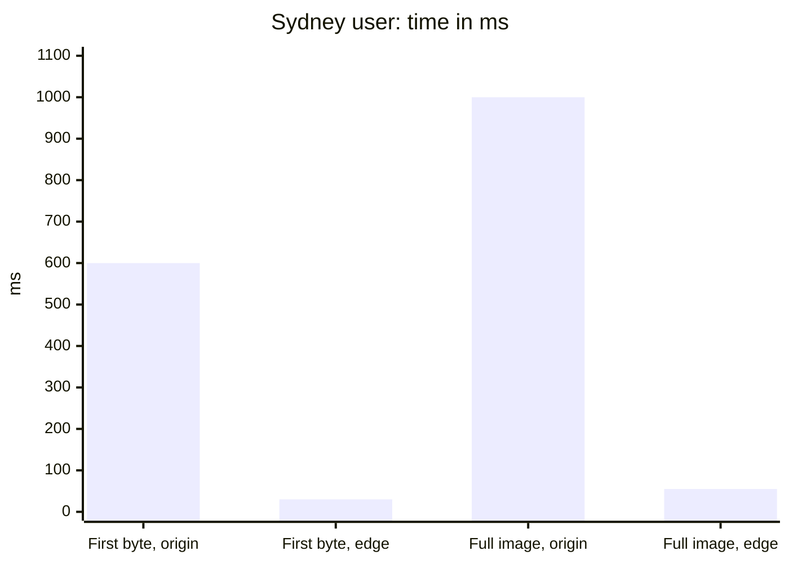
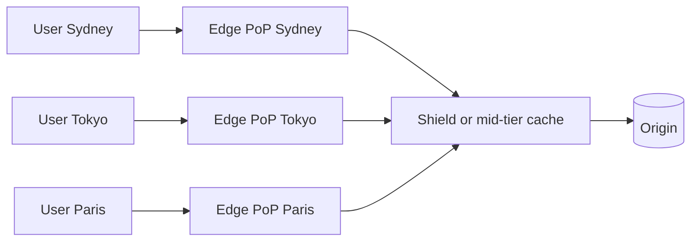
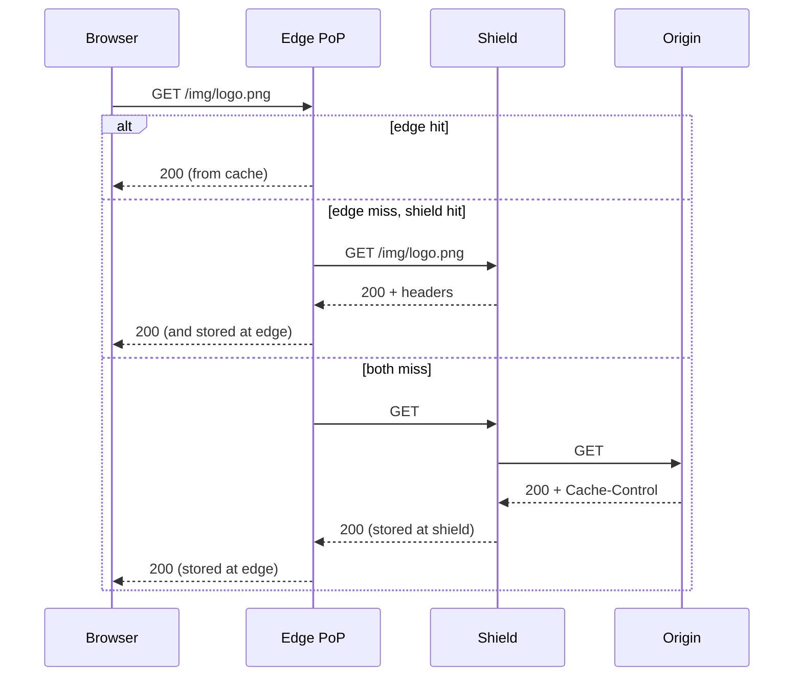
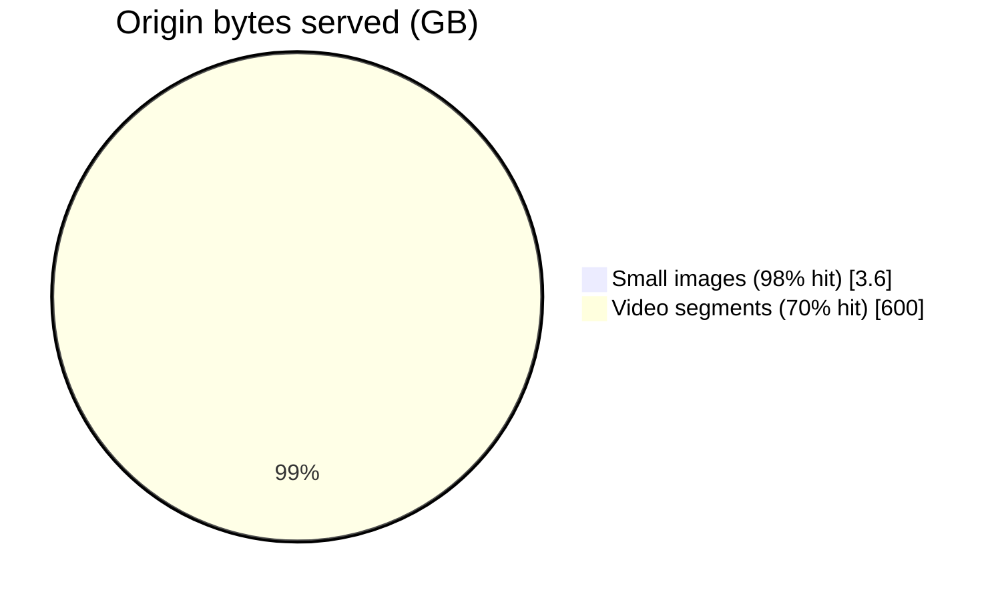
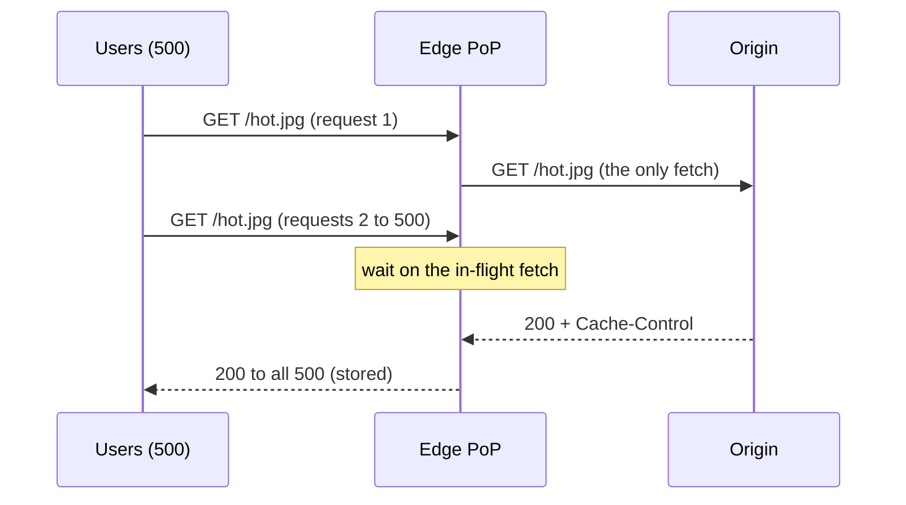
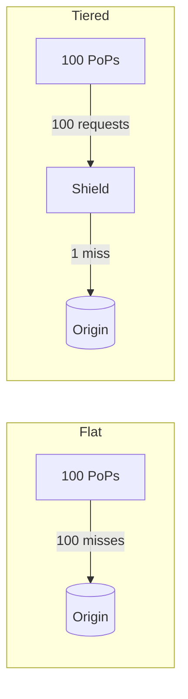

# How CDNs work

## Learning objectives

After this lesson you should be able to:

- Explain what a content delivery network is, and why physical distance and connection setup make a nearby cache valuable even for a fast origin.
- Describe the two main mechanisms that steer a user to a nearby point of presence (DNS-based routing and anycast), with their trade-offs.
- Trace a request through an edge cache, a mid-tier cache or origin shield, and the origin, and compute the resulting origin load.
- Define cache hit ratio at the edge versus offload, and explain why tiered caching increases offload.
- Explain request collapsing at the edge and how it relates to the stampede problem.
- Reason about what a CDN can and cannot cache, and when it still helps with uncacheable traffic.

## 1. The problem a CDN solves

Imagine a web application whose servers are in one data center in Virginia. A user in Sydney requests a 300 KB image. Two things limit the speed, and neither is the server's CPU.

The first is the **speed of light in fibre**. Light in glass travels at roughly two thirds of its vacuum speed, about 200,000 km/s. The great-circle distance between Sydney and Virginia is on the order of 15,000 to 16,000 km, and real cable routes are longer. So even in the best case a round trip takes `2 * 16,000 km / 200,000 km/s = 0.16 s`, about 160 ms, and in practice 200 ms or more. This is physics; no engineering of the server removes it.

The second is **round trips**. Fetching the image over a fresh connection costs one round trip for the TCP handshake and, for HTTPS on older TLS versions, one or two more for the TLS handshake (TLS 1.3 reduces this to one; QUIC combines transport and cryptographic setup and can resume with zero). Then one round trip for the request and the first byte of response. Then, because the sender starts with a small congestion window, transferring a few hundred kilobytes takes additional round trips as the window grows (slow start). With TCP and TLS 1.3 setup, the first useful byte might arrive after roughly 3 round trips: `3 * 200 ms = 600 ms`, and the whole image after 4 or 5 round trips: about a second. A page needs dozens of such resources.

A **content delivery network** (CDN) puts caching servers near users. If a server in Sydney holds the image, the round trip falls from 200 ms to perhaps 10 ms. Connection setup costs `2 * 10 ms`; the image arrives in 50 to 60 ms. The user is served in a twentieth of the time, and the Virginia origin never sees the request.

CDNs deliver three distinct benefits and it helps to keep them separate:

1. **Latency:** shorter round trips to the user.
2. **Offload:** fewer requests reach your origin, reducing its cost and capacity needs.
3. **Resilience and protection:** the CDN's large capacity absorbs traffic spikes and many denial-of-service attacks; with stale-serving rules it can keep serving when the origin is down.

Even uncacheable traffic can benefit: the CDN terminates the user's TCP and TLS connection nearby (cheap round trips) and uses a long-lived, warm, optimised connection to the origin. This is sometimes called dynamic site acceleration.

The Sydney example in numbers (approximate, from the round-trip counts above):

> **Key idea:** a nearby cache shrinks every round trip from about 200 ms to about 10 ms, and a page needs dozens of round trips. No origin tuning can do that.

## 2. Anatomy of a CDN

A CDN is a globally distributed fleet of servers organised into **points of presence** (PoPs, sometimes called edge locations): clusters of servers in data centers or at internet exchange points and inside ISPs' networks. A large provider operates hundreds of PoPs in many countries. A PoP contains many servers; requests are balanced across them.

Within a PoP, a **cache server** holds objects in RAM and on SSD (a tiered storage hierarchy; hot objects in memory, the long tail on flash). A fleet of such servers in a PoP could each hold a different slice of objects, with requests routed by consistent hashing of the URL, so the PoP's total capacity is the sum of its servers (the same idea as the sharding lesson in the distributed caches chapter) rather than each server redundantly caching the popular items. Large providers often mix approaches: hot objects replicated across servers to avoid a single hot cache node, and the long tail partitioned.

Beyond the edge PoPs sits the **origin**: your servers, or an object store acting as origin. Between them there may be **mid-tier** caches, which we discuss in Section 5.

## 3. Routing users to a nearby PoP

There are two principal techniques, and large CDNs combine them.

### 3.1 DNS-based routing

The user's browser asks DNS for `www.example.com`. You configure that name as a CNAME (alias) to a name controlled by the CDN, say `example.cdn-provider.example`. The CDN's authoritative DNS servers answer with the IP address of a PoP chosen for this client. The choice depends on the source of the DNS query and on measurements of network proximity, PoP load and health.

The weakness is that the CDN sees the address of the **recursive resolver** that asks on the user's behalf, not the user. Usually the resolver is near the user (an ISP resolver), but with public resolvers or corporate resolvers it may be far away, and the CDN will pick a PoP close to the resolver. An extension called EDNS Client Subnet lets a resolver pass a truncated version of the user's network prefix to the authoritative server, improving accuracy at some cost in privacy and cache efficiency in the resolver. Whether a particular resolver supports it varies.

DNS answers have a TTL, typically short (tens of seconds to a few minutes) so that the CDN can steer traffic away from an overloaded or failed PoP quickly. Resolvers and clients may hold the answer longer than the TTL, which makes DNS-based failover imprecise; the shift of traffic takes minutes, not milliseconds. DNS routing also costs an extra lookup, though typically cached.

### 3.2 Anycast

With **anycast**, many PoPs advertise the **same IP address** into the Internet's routing system via BGP (Border Gateway Protocol). Each router sends packets for that address along what it considers the shortest path, so a packet arrives at the topologically nearest PoP, without any DNS decision. The advantages: no dependence on resolver location; automatic failover (if a PoP withdraws its route, traffic flows to the next nearest within seconds to a minute as BGP converges); and a natural spread of DDoS traffic across many PoPs, since attackers' packets are likewise routed to their nearest PoP.

Disadvantages: BGP "nearest" is measured in network hops and policy, not latency or load, so it may pick a poor PoP (a user in one country routed to a PoP in another because of how ISPs interconnect). Routing can change during a TCP connection, sending later packets to a different PoP, which breaks the connection; this was historically a worry for long TCP flows but is rare enough in practice, and QUIC connection identifiers make migration more tolerable. Traffic engineering is coarse: you shift load by changing BGP announcements, which is slower and blunter than answering DNS differently.

Many large providers use anycast for their edge IPs and DNS (DNS servers themselves are commonly anycast) and add smarter steering on top. For you as a CDN customer the distinction mainly matters when debugging: an unexpectedly slow response may come from a user landing at a distant PoP.

At a glance, the two steering techniques:

|                  | DNS-based routing                      | Anycast                               |
| ---------------- | -------------------------------------- | ------------------------------------- |
| Who decides      | CDN's DNS answers per resolver         | Internet routers via BGP              |
| Sees             | The resolver, not the user             | The user's packets                    |
| Failover speed   | Minutes (DNS TTL and resolver caching) | Seconds to a minute (BGP convergence) |
| Steering control | Fine-grained (load, health)            | Coarse (BGP announcements)            |
| Weak spot        | Distant public or corporate resolvers  | "Nearest" is hops, not latency        |

## 4. The life of a request

The CDN treats your URL (plus selected headers, as the next lesson explains) as a cache key. If the edge holds a fresh copy, it serves it directly: this is a hit. If not, it forwards upstream, stores the response according to the caching headers the origin returned, and passes it on.

### 4.1 Hit ratio versus offload

Two numbers are commonly confused:

- **Cache hit ratio (request-based):** the fraction of requests served from cache.
- **Offload (byte-based or origin-based):** the fraction of bytes (or requests) that the origin did _not_ have to serve.

They differ because of object sizes and tiers. Suppose in a day there are 10 million requests, 90% for small images (20 KB, hit ratio 98%) and 10% for large videos segments (2 MB, hit ratio 70%). Request hit ratio is `0.9 * 0.98 + 0.1 * 0.70 = 0.882 + 0.07 = 95.2%`. Bytes: images `9M * 20 KB = 180 GB` total, of which 2% miss: 3.6 GB at origin. Video segments `1M * 2 MB = 2,000 GB` total, 30% miss: 600 GB at origin. Total origin bytes 603.6 GB of 2,180 GB total, so **byte offload is 72.3%**, although the request hit ratio was 95.2%. The large objects, though few, dominate the origin's bandwidth bill. Measure both, and optimise for the one that costs you money.

The worked example above, as origin bytes. Few large objects dominate the origin bill:

> **Key idea:** request hit ratio was 95.2% but byte offload was only 72.3%. Report both, and optimise the one that costs you money.

### 4.2 Request collapsing

When a popular object is not in the cache (new, expired, or just purged), many users may request it at the same instant. Without precautions, the PoP would send many identical requests upstream: a miniature stampede. Modern CDNs implement **request collapsing** (also called request coalescing): the first miss goes to the origin; concurrent requests for the same key wait for that response and share it. With this, 500 simultaneous requests to one PoP yield one origin request, not 500. This is the same principle as single-flight in application caches (see the stampede chapter). But collapsing has its limits and subtleties:

- It applies per PoP (or per server) unless a shield consolidates further. If there are 100 PoPs, a cold object may cause 100 origin requests, one per PoP, unless a shield is in the path. That is a strong argument for tiering.
- Waiting requests wait on the slowest case: if the first request takes 5 seconds, so do all the others. Providers add timeouts and may let waiting requests proceed individually after a limit.
- If the response turns out to be uncacheable (for example because it sets a cookie or carries `Cache-Control: private`), collapsed requests cannot share it, and some CDNs then serialise requests, one after another, slowing everyone. This is a famous pitfall: marking dynamic content "no-store" while the CDN still tries to collapse can serialise requests unless configured otherwise. Check your provider's behaviour for uncacheable responses.

Collapsing in action: 500 simultaneous requests to one PoP cause one origin fetch.

## 5. Tiered caching and origin shield

In a flat CDN, each PoP has its own cache and each miss goes to the origin. With many PoPs, the origin sees the union of all PoPs' miss traffic, and objects in the long tail, requested a few times per day per region, are often misses everywhere.

**Tiered caching** inserts one or more layers between the edge and the origin. An edge miss goes to a regional or global **mid-tier cache** (often called an **origin shield** when it is a single designated location nearby the origin), and only the mid-tier's miss reaches the origin. The mid-tier sees the aggregated request stream of many edges, so a rarely requested object that is requested once per day in each of 50 PoPs is requested 50 times per day at the shield: one origin fetch and 49 shield hits, instead of 50 origin fetches.

Worked numbers. Assume 100 PoPs, a long-tail object requested at each PoP 3 times per hour, with an edge TTL of 1 hour. Flat: each PoP misses once per hour (at best), so origin load for this object is 100 requests per hour. With a shield whose TTL also covers the hour, the shield sees 100 requests per hour from the edges, of which one is a miss: 1 origin request per hour. A 100-fold reduction for this object. For the whole catalogue of 5 million long-tail objects, that could be the difference between 500 million origin requests per hour and 5 million.

Trade-offs of tiering:

- **Extra latency on edge misses:** a path edge to shield adds a hop. If the shield is far from the edge (a Sydney edge going to a shield in Virginia), a miss takes longer than going directly to a nearer origin replica. Choose the shield location close to your origin to minimise the shield-to-origin leg; accept the edge-to-shield cost on misses.
- **Single point of concentration:** all traffic funnels through the shield on misses; if it fails, providers route around it, but check this behaviour.
- **Cost:** some providers charge for mid-tier traffic, or for shield usage.
- **Purges and consistency:** a purge must clear every tier. A staleness in the shield re-infects the edges: after the edge is purged it refetches from a shield that still holds the old copy. Understand your provider's purge propagation across tiers (the invalidation lesson covers this).

The tiering arithmetic from above (100 PoPs, one long-tail object, requests per hour reaching the origin):

|                                      | Flat        | With shield              |
| ------------------------------------ | ----------- | ------------------------ |
| Origin requests per hour, one object | 100         | 1                        |
| 5 million long-tail objects          | 500 million | 5 million                |
| Cost of tiering                      | none        | extra hop on edge misses |

## 6. What can be cached, and what else a CDN does

Static assets (images, scripts, stylesheets, fonts, downloadable files, video segments) are the classic case: identical for all users, changing rarely, large relative to the metadata. Cached with long lifetimes and versioned filenames (`app.3f9a1c.js`), they achieve very high hit ratios. HTML pages, API responses and personalised content are more subtle; the third lesson in this chapter covers caching dynamic and personalized content.

Beyond caching, CDNs commonly provide: TLS termination and certificate management; HTTP/2 and HTTP/3 support to clients even when the origin speaks only HTTP/1.1; compression (gzip, Brotli) negotiated per client; image optimisation (resize and format conversion per device); web application firewall and bot management; DDoS absorption; and programmable edge compute (running small functions at the PoP to rewrite requests, build cache keys, authenticate or assemble pages). These features sit in the same request path and interact with caching, so always consider what happens first: a request rewrite before the cache lookup changes the cache key.

Range requests and large files deserve a mention. Video and big downloads are often fetched in byte ranges or segments. CDNs can cache segments independently, or fetch and cache whole files in the background in "slice" fashion. A request for the first bytes of a 4 GB file should not force the PoP to fetch all 4 GB before replying. Understand your provider's treatment of ranges because it affects origin bandwidth.

## 7. Origin design for a CDN

A CDN reduces but does not remove the need for a healthy origin.

- **Sizing for cold misses.** After a purge, a new deployment that changes all asset URLs, or a new PoP, many misses reach the origin. Size (or shield) accordingly. Versioned asset URLs mean a deploy creates a wave of first requests; pre-warming critical assets or spreading deploys reduces it.
- **Origin protection.** Allow only CDN addresses to reach the origin (an authentication header or private link), so that attackers cannot bypass the CDN and so that cache keys cannot be bypassed with unusual hostnames.
- **Origin availability.** Configure stale-serving (the next lesson) and health-checked failover origins.
- **Consistent headers.** The origin is the source of truth for caching policy; the CDN follows its headers unless overridden. Mismatches between CDN rules and origin headers cause confusing behaviour, because different layers, the browser, the CDN, an internal reverse proxy, may apply different rules to the same response.

## 8. Cost and performance tradeoffs at a glance

CDN pricing typically has components for bandwidth delivered (per GB, varying by region, with some regions several times more expensive than others), request counts, and features (WAF, edge compute, log delivery, shield). Some providers charge for traffic from the shield to the edge; some charge for origin fetches in other ways. Typical consequences:

- High hit ratio reduces **origin** costs but not **CDN** delivery costs, which are charged per byte delivered regardless of hit or miss. A 99% hit ratio on a petabyte per month still pays for a petabyte of delivery.
- Compression and image optimisation reduce delivered bytes and therefore the bill and latency.
- Very small objects cost mostly in request fees; consider bundling.
- Multi-CDN setups improve resilience and negotiating power but complicate cache purging, logging and consistent configuration.

Because rates and models differ between providers and change over time, evaluate with your own traffic profile: object size distribution, regional mix, hit ratio and request counts, rather than with headline per-GB prices.

## 9. Common pitfalls

- **Assuming a CDN makes dynamic pages fast automatically.** Without cache rules they pass through; the benefit is limited to connection termination and routing.
- **Confusing request hit ratio with byte offload.** Report both.
- **Letting query strings fragment the cache.** Tracking parameters (`?utm_source=...`) can make every URL unique unless ignored in the cache key.
- **Cold-start after global invalidations.** A global purge or a new URL scheme sends the full load to the origin.
- **Shield far from the origin.** The extra hops add latency for every miss.
- **No origin protection.** Attackers go around the CDN.
- **Treating the CDN as a database.** It evicts, expires and can be purged, and different PoPs see different versions for a short time.
- **Forgetting that error responses can be cached.** A transient 500 or 404 cached for minutes can prolong an outage; configure error caching explicitly (the next lesson covers it).

## 10. Check your understanding

1. A user is 12,000 km of fibre from your origin. Estimate the minimum round-trip time and the time to the first byte of a response over a new TCP and TLS 1.3 connection, assuming the physical limit of 200,000 km/s.
2. Compare DNS-based routing and anycast: one advantage and one disadvantage of each.
3. In a month, a CDN serves 4 million requests for 50 KB objects at a 99% hit ratio and 400,000 requests for 5 MB objects at an 80% hit ratio. Compute the request hit ratio and the byte offload.
4. 60 PoPs each request a rarely used object once per hour with a 4 hour TTL. How many origin requests per 4 hours with no shield? With a shield? Explain.
5. What is request collapsing and what can go wrong if the origin marks the response uncacheable?
6. Why does a high CDN hit ratio not necessarily reduce your CDN bill?

## 11. Answers

1. Round trip is `2 * 12,000 / 200,000 = 0.12 s = 120 ms` as a lower bound. With TCP (1 round trip), TLS 1.3 (1 round trip) and the request/response (1 round trip), the first byte arrives after about 3 round trips, about 360 ms, at minimum.
2. DNS: advantage, flexible, fine-grained steering by load and health; disadvantage, location is inferred from the resolver and failover is limited by DNS TTL caching. Anycast: advantage, the network itself picks a near PoP and fails over quickly via BGP, and it spreads DDoS; disadvantage, BGP nearness is not latency or load, and traffic engineering is coarse.
3. Requests: `(4,000,000 * 0.99 + 400,000 * 0.80) / 4,400,000 = (3,960,000 + 320,000) / 4,400,000 = 97.3%`. Bytes: small total `4M * 50 KB = 200 GB`, misses 1% = 2 GB. Large total `400,000 * 5 MB = 2,000 GB`, misses 20% = 400 GB. Origin 402 GB of 2,200 GB, so byte offload is `1 - 402/2200 = 81.7%`.
4. No shield: each PoP misses once per 4 hours (the first request, then hits for the TTL), so 60 origin requests. With a shield: the shield misses once, so 1 origin request and 59 shield hits.
5. Collapsing lets one upstream fetch serve many concurrent requests for the same key. If the response is uncacheable it cannot be shared, so some CDNs release or serialise the waiting requests, which can slow users and still send many requests to the origin. Configure the behaviour for uncacheable responses.
6. CDN delivery is billed on bytes delivered and requests, whichever tier supplied them. Hit ratio mainly reduces origin load and egress cost.

## 12. Summary

A CDN exists because distance and connection setup impose latency that no server tuning removes. It places cache servers in PoPs near users, steers users there with DNS decisions or anycast routing, and serves hits locally while fetching misses through optional mid-tier or shield caches to the origin. Measure both request hit ratio and byte offload, since big objects dominate origin cost; use tiering to turn many edge misses into a single origin fetch; and rely on request collapsing to blunt stampedes at the edge, remembering its limits. CDNs also terminate TLS, compress, protect and run code at the edge, all of which interacts with cache keys. The next lesson looks closely at the machinery that decides what is stored, for how long, under which key: HTTP caching semantics.
