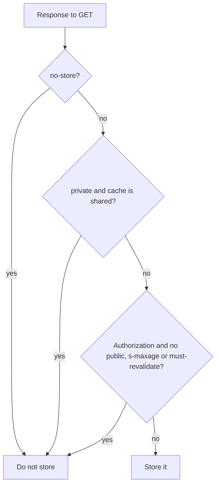
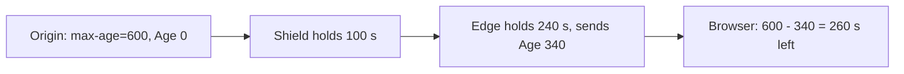
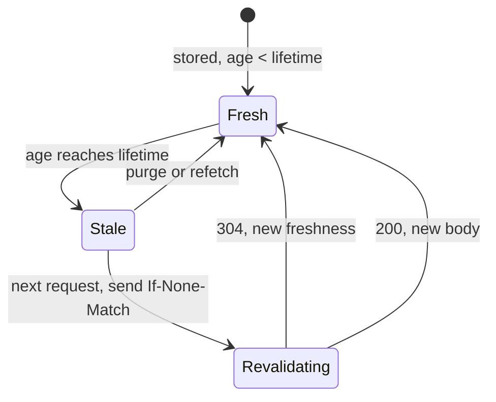
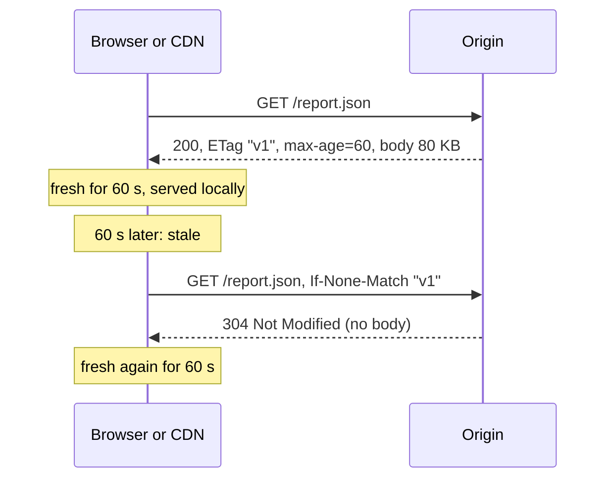
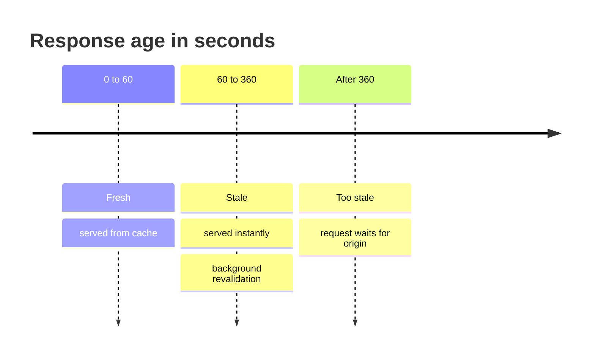
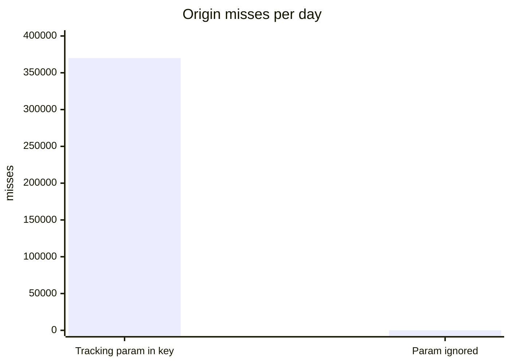

# HTTP caching semantics, cache keys and Vary

## Learning objectives

After this lesson you should be able to:

- State the two questions every HTTP cache answers (is this response storable, and is it fresh enough to reuse) and the rules that decide each.
- Compute a response's freshness lifetime and current age, and decide whether a cache may serve it without contacting the origin.
- Use `Cache-Control` directives precisely, distinguishing `no-cache` from `no-store`, `private` from `public`, and `max-age` from `s-maxage`.
- Explain validators (`ETag`, `Last-Modified`) and conditional requests, and compute the savings of a 304 response.
- Use `stale-while-revalidate` and `stale-if-error` to keep latency low and survive origin failures.
- Explain how cache keys are built, what `Vary` does, and how a careless `Vary` or query string destroys hit ratio.
- Choose caching headers for typical asset classes (versioned static files, HTML, API responses).

## 1. Caching is a protocol, not a feature

Browsers, CDNs, corporate proxies and reverse proxies all implement the same body of rules, specified in the HTTP caching standard (RFC 9111, which updated and consolidated earlier specifications such as RFC 7234). The origin communicates its intent with headers; every cache along the path interprets them. This is a remarkable design: a single response can be reused by a browser for a day, by a CDN for an hour and by a proxy for a minute, with no coordination except the headers. It is also a source of subtle bugs because there are **several caches in series**, each applying the rules slightly differently, and a mistake in one header can silently apply to all of them.

The standard distinguishes two kinds of cache:

- **Private cache:** belongs to a single user, typically the browser's cache. May store responses meant for one user.
- **Shared cache:** serves many users: a CDN, a reverse proxy, an ISP or corporate proxy. Must not store responses intended for a single user.

Everything in this lesson revolves around two questions asked of each response:

1. **Storability:** may this cache keep a copy of this response at all?
2. **Freshness:** if it has a copy, may it reuse it now without asking the origin, or must it revalidate or refetch?

## 2. Storability

By default a cache may store responses to `GET` (and `HEAD`) requests whose status code is "cacheable by default": for example 200, 203, 204, 206 (partial), 300, 301, 308, 404, 405, 410, 414 and 501. Other statuses can be stored if the response carries explicit freshness information. `POST` responses are in theory cacheable under strict conditions but in practice are not cached by almost anything; do not rely on it.

Directives that control storage:

- `no-store`: the cache must not store any part of the request or response. Use it for genuinely sensitive data: banking pages, tokens, personal data you do not wish to leave on disk.
- `private`: only a private cache (the user's browser) may store it; shared caches must not.
- `public`: shared caches may store it, even if it would otherwise be non-storable (for example, a response to a request containing an `Authorization` header, which shared caches otherwise refuse to store unless the response explicitly allows it with `public`, `s-maxage` or `must-revalidate`).

A common misreading: `no-cache` does **not** mean "do not cache". It means "you may store this, but you must **revalidate** with the origin before reusing it". We return to this in Section 5. The directive that forbids storing is `no-store`.

A cache's storability decision, in order:



> **Key idea:** `no-cache` stores and revalidates; `no-store` never stores. Only `no-store` protects secrets.

## 3. Freshness

A stored response is **fresh** if its age is less than its freshness lifetime. While fresh it can be served directly; once **stale**, a cache must revalidate (or refetch) before serving it, unless some other rule (such as `stale-while-revalidate` or an error situation covered by `stale-if-error`) permits otherwise.

### 3.1 Freshness lifetime

The cache computes the lifetime from, in priority order:

1. For shared caches only, `Cache-Control: s-maxage=N`.
2. `Cache-Control: max-age=N`.
3. The `Expires` header (an absolute date), minus the `Date` header of the response.
4. **Heuristics** if none of the above is present but a `Last-Modified` date is: a common rule, suggested but not required by the standard, is 10% of the time since last modification. A file last modified 100 days ago would be considered fresh for 10 days even with no explicit lifetime.

Heuristic freshness is a trap. If you do not specify lifetimes, caches may invent one, differently from each other. Always send explicit headers on cacheable responses, and explicit `no-store` or `no-cache` on those that must not be reused.

### 3.2 Age

`Age` is the time since the response was generated or last validated at the origin, accounting for time spent in intermediate caches. Each cache adds the time it held the response and reports the total in an `Age` header. The standard's accounting also includes network delay estimates, but the principle is simple:

`current_age ≈ Age header at receipt + time stored in this cache`

Worked example: the origin sends `Cache-Control: max-age=600`. A CDN edge stores it. Later a browser requests it through the CDN; the edge has held it for 240 seconds and the shield held it 100 seconds before that. The edge responds with `Age: 340`. The browser also stores it, and computes: freshness lifetime 600 seconds, age 340, so remaining freshness 260 seconds. For the next 260 seconds the browser will not contact anyone. The user sees stale-by-up-to-600-seconds data though only 260 seconds more of browser caching were granted: the **lifetime is not additive across layers; it is bounded by the original `max-age`, which counts age cumulatively**. By contrast, a CDN that ignores `Age` and re-stamps the response with a fresh `max-age=600` would allow up to `600 + 600` seconds total staleness. This is a classic cause of "I set 10 minutes but data was an hour old": an intermediary resets the clock.

The worked age example as a chain (lifetimes are not additive; the original `max-age` counts age cumulatively):



### 3.3 `max-age` and `s-maxage`

`max-age` applies to all caches. `s-maxage` applies only to shared caches and overrides `max-age` there. Thus a common pattern is:

```
Cache-Control: public, max-age=60, s-maxage=3600
```

meaning: browsers may reuse for 1 minute, CDNs for 1 hour. This works well when you can purge the CDN (so that long CDN lifetimes are safe) but cannot reach into users' browsers: the browser lifetime is kept short because you cannot invalidate it. Note that `s-maxage` also implies the shared cache must revalidate after it expires (it carries the semantics of `proxy-revalidate`). Many CDNs also support their own control headers, and a newer standard, targeted cache-control (`CDN-Cache-Control` and similar), lets you give separate directives to CDNs; support varies by provider, so check yours.

### 3.4 `immutable` and versioned URLs

For resources that never change at a given URL, the best strategy is to make the URL a function of the content (`app.3f9a1c.js`, a hash in the name) and give it the longest practical lifetime:

```
Cache-Control: public, max-age=31536000, immutable
```

`immutable` tells the browser not to revalidate even on a user-initiated reload, because the content at this URL will never change (a feature some browsers honour and others ignore, which is harmless). Changes are deployed as new URLs referenced from HTML that is itself cached briefly or revalidated each time. This **cache busting by naming** pattern sidesteps invalidation completely, which is why it is the foundation of front-end asset delivery.

The life of one stored response, as states:



## 4. Validation

When a stored response becomes stale, the cache need not discard it. It can ask the origin: "is my copy still current?" This is **revalidation**, which uses **validators** the origin supplied with the original response:

- `ETag`: an opaque identifier for a version of the resource, such as `"33a64df5"`. A _strong_ ETag changes whenever the bytes change; a _weak_ ETag (`W/"..."`) means "semantically equivalent" and is allowed to ignore trivial differences.
- `Last-Modified`: a timestamp, with only one-second precision and dependent on clocks.

The cache sends a **conditional request**:

```
GET /report.json HTTP/1.1
If-None-Match: "33a64df5"
If-Modified-Since: Tue, 01 Oct 2024 10:00:00 GMT
```

If the origin's version still matches, it replies `304 Not Modified` with no body (and updated freshness headers). The cache refreshes the stored copy's freshness and serves it. If it has changed, the origin replies `200` with the new body.



**Savings arithmetic.** An 80 KB JSON report with a 60 second lifetime is requested 10,000 times per minute from one CDN PoP. Without a CDN cache: 10,000 origin requests per minute (800 MB). With the cache and revalidation every 60 seconds: one conditional request per minute, with a response of roughly 300 bytes of headers when unchanged. The origin handles 1 request per minute instead of 10,000. If the report changes once per five minutes, then one in five revalidations returns the 80 KB body. Even with _no_ freshness lifetime (`max-age=0`), conditional requests save the transfer of the body, though not the origin round trip and the work of checking: it is a bandwidth saving, not a latency or load saving.

Generating a validator should itself be cheap. If computing the ETag requires rendering the whole page, the 304 saves bandwidth but not origin CPU. Good origins derive ETags from a version number, a row's update timestamp or a content hash stored with the object, so they can answer "unchanged" without regenerating the resource.

One subtlety: a server that adds compression may produce different ETags for compressed and uncompressed representations (strong ETags are per representation), or may turn them weak. Some CDNs and servers rewrite ETags when they compress. If validators stop matching across layers, 304s disappear and the full body is sent every time, quietly increasing bandwidth.

## 5. The `Cache-Control` directives in practice

| Directive                  | Applies to              | Meaning                                                                  |
| -------------------------- | ----------------------- | ------------------------------------------------------------------------ |
| `max-age=N`                | response                | fresh for N seconds from generation                                      |
| `s-maxage=N`               | response, shared caches | overrides `max-age` for shared caches                                    |
| `no-store`                 | response (or request)   | do not store at all                                                      |
| `no-cache`                 | response                | store, but revalidate before every reuse                                 |
| `private`                  | response                | browser cache only                                                       |
| `public`                   | response                | shared caches may store even if otherwise they would not                 |
| `must-revalidate`          | response                | once stale, never serve without successful revalidation (even on errors) |
| `proxy-revalidate`         | response                | same, for shared caches only                                             |
| `immutable`                | response                | will not change during its freshness lifetime                            |
| `stale-while-revalidate=N` | response                | may serve stale for N more seconds while revalidating in the background  |
| `stale-if-error=N`         | response                | may serve stale for N seconds if the origin errors                       |
| `no-transform`             | response                | intermediaries must not change the body (for example recompress images)  |

`no-cache` is useful for HTML documents that reference versioned assets: the browser stores the page, and revalidates (cheap 304 in the common case), so users always get the current set of asset URLs. `no-store` is for secrets. People frequently write `Cache-Control: no-cache, no-store, must-revalidate` as a charm; the combination is mostly redundant (`no-store` already forbids storing), and mixing in an old `Pragma: no-cache` header is only for ancient HTTP/1.0 clients. Using `no-store` on everything, including static assets, throws away the caching you are paying a CDN for.

Request directives exist too. Browsers send `Cache-Control: max-age=0` on a normal reload and `no-cache` on a hard reload, which force revalidation or refetch. A hard reload that bypasses the browser cache may still be served from the CDN, so "I hit refresh and still see the old version" can be a CDN issue.

## 6. Serving stale on purpose

Strict freshness has a cost: when a response goes stale, the next request waits for revalidation or refetch, paying origin latency. Two extensions (specified in RFC 5861) address this.

### 6.1 `stale-while-revalidate`

```
Cache-Control: max-age=60, stale-while-revalidate=300
```

For the first 60 seconds the response is fresh. From 60 to 360 seconds it is stale but may be served immediately, while the cache triggers an asynchronous revalidation in the background. Users get consistent low latency; the cost is that data can be up to 360 seconds old and the first request after the staleness boundary pays nothing. It is effectively "refresh ahead", removing the periodic latency spike and also removing a stampede trigger: the revalidation is a single background request per cache, not N waiting users. Past 360 seconds the cache must wait for a fresh response.

Browser and CDN support differs. Some CDNs implement it fully, some partially; some treat it as a hint only for certain states. Test the behaviour with your provider rather than assuming.

Timeline for `max-age=60, stale-while-revalidate=300`:



### 6.2 `stale-if-error`

```
Cache-Control: max-age=60, stale-if-error=86400
```

If the origin returns a server error (5xx) or is unreachable when the cache attempts to refetch, the cache may serve the stale copy for up to a day beyond freshness. During an origin outage, users continue to see slightly old content instead of errors. For many content sites this converts an incident into a non-event. Danger: you must be comfortable with 24 hours of staleness for the resource; do not apply it to prices or permissions.

Combine them:

```
Cache-Control: public, max-age=60, stale-while-revalidate=300, stale-if-error=86400
```

and remember `must-revalidate` overrides these: it forbids serving stale on failures.

## 7. Cache keys

A cache must decide whether a stored response can satisfy an incoming request. The **cache key** is the identity it uses. By default it is essentially:

`method + full URL (scheme, host, path, query string)`

plus the request header values named by `Vary` (Section 8). Two requests with the same key share an entry; anything that differs creates a separate entry. Therefore **the cache key determines both the hit ratio and the correctness**: too specific, and you fragment the cache (low hit ratio); too general, and one user's response can be served to another (wrong or even leaked data).

### 7.1 Fragmentation through the query string

By default `/product?id=7`, `/product?id=7&utm_source=mail` and `/product?utm_campaign=x&id=7` are three different keys, although they return the same document. Tracking parameters, session IDs in URLs and parameter ordering differences can multiply entries and destroy hit ratio. Fixes: configure the CDN to ignore irrelevant parameters or to normalise them (sort, lowercase, drop tracking parameters) before keying. Treat this as a first-class configuration item and test with real traffic: an unbounded set of unique URLs also lets attackers bypass the cache and hit the origin on purpose by appending a random parameter.

A worked example: a campaign page receives 1,000,000 requests per day at one PoP, with a 1 hour TTL. Suppose 700,000 of them carry a tracking parameter with 20,000 distinct values (equally frequent) and 300,000 carry none. With the parameter in the key there are 20,001 keys. Each tracked variant gets `700,000 / 20,000 = 35` requests per day, spread randomly over 24 one-hour windows. The expected number of windows that contain at least one request is `24 * (1 - (23/24)^35) = 24 * (1 - 0.228) = 18.5`, and each such window starts with a miss. So each variant misses about 18.5 times out of 35 requests, and the 20,000 variants produce about 370,000 misses per day. The untracked URL adds about 24. Overall hit ratio is roughly `1 - 370,000/1,000,000 = 63%`, and the origin sees about 370,000 requests per day. With the parameter ignored in the key, there is a single key and about 24 misses per day: a hit ratio above 99.99% and a 15,000-fold reduction in origin requests. One configuration line makes that difference.

The campaign-page example (1,000,000 requests per day, one PoP, 1 hour TTL), misses per day:



> **Key idea:** one cache-key configuration line moved hit ratio from about 63% to above 99.99%.

### 7.2 Other components that may belong in the key

Hostname (for multi-tenant sites), device class (mobile versus desktop, if you serve different HTML), language, country, and a few request headers or cookies. Each addition multiplies the number of variants: the key space is the product of the cardinalities. Keying on 3 device classes, 10 languages and 5 countries yields 150 variants per URL. Fewer, coarser dimensions are better; normalise values before keying (map the `Accept-Language` header to one of the 10 languages you support rather than keying on the raw header, which has thousands of distinct values).

## 8. `Vary`

`Vary` is the origin's way of telling caches: "the response depends on these request headers; do not reuse this stored response for a request unless those headers match the ones in the original request."

```
Vary: Accept-Encoding
```

The most common legitimate use: responses are stored per `Accept-Encoding` value, so a client that accepts gzip receives the gzip variant and a client that does not receives the identity variant. Others: `Vary: Accept-Language`, `Vary: Accept` (content negotiation of formats such as WebP versus JPEG).

How it works in a cache: the cache's key for the URL includes the _values of the request headers listed in Vary_, as sent by the request that populated the entry. A later request is a hit only if its values for those headers match (under the standard's matching rules).

**Where Vary goes wrong:**

- `Vary: User-Agent`. The `User-Agent` header has hundreds of thousands of distinct values. Every distinct string becomes its own variant; hit ratio drops towards zero for that URL. Servers do this to serve different HTML to mobile and desktop. Instead, classify the device at the edge into two or three classes and key on the class.
- `Vary: Cookie`. Nearly every user has a unique cookie value, so each user has their own cache entry: the shared cache is effectively disabled (and wasteful, storing thousands of copies that will never be reused). If the page is the same for all anonymous users, strip or ignore cookies at the edge for that path. The next lesson explores cookies in detail.
- `Vary: *`. Means the response cannot be matched by anything; effectively uncacheable.
- Forgetting `Vary: Accept-Encoding` when the origin compresses selectively. A cache then stores a gzip response and serves it to a client that cannot decode it. Most servers and CDNs handle this correctly by default; custom setups sometimes break it.
- Omitting Vary where there should be one. If you serve different content by `Accept-Language` without `Vary: Accept-Language` (or an equivalent CDN rule), the first visitor's language is cached for everyone. The failure is silent and affects correctness, not only performance.

Many CDNs treat `Vary` only partially for performance reasons: they may honour `Accept-Encoding` natively and ignore or limit other headers unless configured. Read your provider's documentation. An especially safe approach is to put whatever varies explicitly into the CDN's cache key configuration and limit what the origin's `Vary` can do.

`Vary` at a glance:

| Header in `Vary`  | Distinct values            | Effect on hit ratio                                |
| ----------------- | -------------------------- | -------------------------------------------------- |
| `Accept-Encoding` | a few (gzip, br, identity) | fine, the legitimate use                           |
| `Accept-Language` | many raw values            | fragments unless normalised to supported languages |
| `User-Agent`      | hundreds of thousands      | near-zero hits for that URL                        |
| `Cookie`          | about one per user         | shared cache effectively disabled                  |
| `*`               | n/a                        | uncacheable                                        |

## 9. Recipes

| Asset                         | Suggested headers (illustrative)                                                         | Reason                                             |
| ----------------------------- | ---------------------------------------------------------------------------------------- | -------------------------------------------------- |
| Hashed JS/CSS/fonts/images    | `public, max-age=31536000, immutable`                                                    | URL changes with content; never needs revalidation |
| HTML for a mostly static page | `public, max-age=60, s-maxage=600, stale-while-revalidate=300` plus CDN purge on publish | short browser TTL, longer CDN TTL, purge on change |
| HTML with per-user content    | `private, no-cache` or `no-store` depending on sensitivity                               | must not be shared                                 |
| Public API list endpoint      | `public, max-age=5, stale-while-revalidate=30`                                           | absorbs bursts with small staleness                |
| Authenticated API response    | `private, no-store` or `private, max-age=0`                                              | per-user, usually sensitive                        |
| Error pages (5xx)             | `no-store`, or a very short `max-age`                                                    | prevent prolonged outages                          |
| Redirects (301)               | explicit `max-age`, as 301 may be cached for a long time                                 | permanent redirects stick in browsers              |

These are starting points; adapt to your tolerance for staleness and your purge ability.

## 10. Common pitfalls

- **Believing `no-cache` forbids storage.** It requires revalidation. Use `no-store` to forbid storage.
- **Relying on heuristic freshness.** Different caches choose different lifetimes; set explicit headers.
- **Resetting age at intermediaries.** A layer that re-stamps `max-age` extends total staleness beyond what you intended.
- **Query-string and cookie fragmentation.** Normalise keys and drop irrelevant parameters and cookies.
- **`Vary: User-Agent` or `Vary: Cookie` on cacheable pages.** Collapses the hit ratio.
- **Missing `Vary` when content depends on a header.** Wrong content gets served to others.
- **Long `max-age` on non-versioned URLs.** You cannot recall copies in browsers. Version the URL or use short lifetimes.
- **Caching 301 redirects carelessly.** A mistaken permanent redirect can stay in browsers for a very long time.
- **ETag mismatch across servers.** If each origin server generates different ETags for identical content (for example derived from inode and mtime), conditional requests will fail whenever the load balancer switches servers.
- **Caching error responses.** Cache 5xx only deliberately and briefly.

## 11. Check your understanding

1. A response has `Cache-Control: max-age=300` and arrives at a CDN with `Age: 120`. The CDN holds it a further 100 seconds and then a browser requests it. What `Age` does the browser see, and for how many more seconds can the browser reuse it?
2. Explain the difference between `no-cache` and `no-store`. Give one resource where each is appropriate.
3. A 120 KB response is requested 3,000 times per minute at a PoP. Compare origin requests per minute and origin bytes for: no caching; `max-age=30` with a CDN; `max-age=0` with ETag revalidation where the content changes once every 10 minutes. Assume a 304 costs 400 bytes and ignore collapsing across PoPs.
4. Why does `Vary: Cookie` effectively disable a shared cache? What would you do for a page that is identical for anonymous visitors but varies for logged-in users?
5. Describe how `stale-while-revalidate=120` changes the experience of the first user after the response goes stale. What risk do you accept?
6. A product page uses the URL `/p/42?ref=<random-per-campaign-click>`. What goes wrong and how do you fix it?

## 12. Answers

1. Age at the browser is `120 + 100 = 220`. The browser's remaining freshness is `300 - 220 = 80` seconds.
2. `no-cache` allows storing but demands revalidation before every reuse; suitable for an HTML shell that references versioned assets. `no-store` forbids storing anywhere; suitable for responses containing secrets or personal financial data.
3. No caching: 3,000 requests per minute, `3,000 * 120 KB = 360 MB` per minute. With `max-age=30`: about 2 origin requests per minute (one per 30 seconds), `2 * 120 KB = 240 KB`. With `max-age=0` and revalidation: every request must revalidate unless collapsing is used, so up to 3,000 conditional requests per minute; bytes about `3,000 * 400 B = 1.2 MB`, plus one full body per change, roughly 0.1 per minute, `12 KB`. Revalidation saves bandwidth but not request count.
4. Almost every user has a different cookie value, so each user gets a separate cached variant that is never reused, giving near-zero hit ratio. For the anonymous page, remove or ignore cookies at the edge (cache key without cookies, or only a coarse "logged in or not" flag), serve the shared version to anonymous users and bypass or use `private` for logged-in users.
5. The first user after staleness receives the stale copy immediately (no wait), while the cache refreshes in the background, so latency stays low and only one refresh is made. The risk is users seeing data up to 120 seconds older than the freshness lifetime.
6. Every click creates a unique cache key, so the page is almost never a hit and the origin is hit directly (and attackers can bypass the cache by changing the parameter). Fix by removing `ref` from the cache key at the CDN or normalising the query string, while still passing it to analytics.

## 13. Summary

HTTP caching is a distributed protocol interpreted by many caches in series. Each decides whether a response is storable and, if so, whether it is fresh, using `Cache-Control`, `Expires`, `Age` and heuristics, so always set explicit lifetimes. Validators (`ETag`, `Last-Modified`) let caches revalidate cheaply with 304 responses, saving bandwidth. `stale-while-revalidate` and `stale-if-error` trade bounded staleness for lower latency and resilience. The cache key (URL plus selected request attributes) governs both hit ratio and correctness; query strings, cookies and `Vary` are the usual places where it goes wrong. For versioned assets use long immutable lifetimes; for HTML use short lifetimes or revalidation; for personal data use `private` or `no-store`. The next lesson turns to invalidation: how to change what is cached before its lifetime runs out, and how to cache dynamic and personalised content without leaking it.
