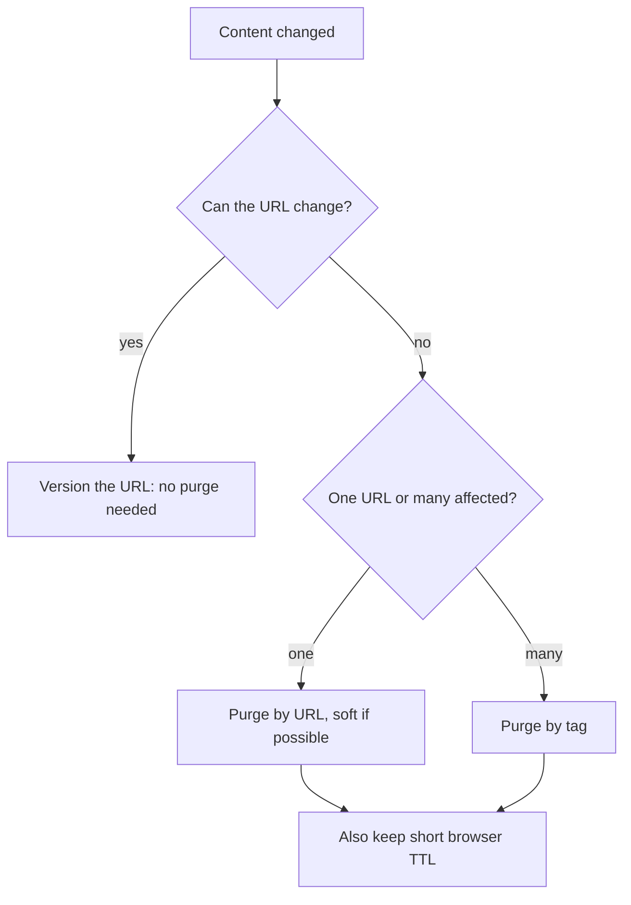

# Purging, dynamic content, security and cost

## Learning objectives

After this lesson you should be able to:

- Compare TTL expiry, URL versioning, purge by URL, purge by tag (surrogate key) and soft purge, and choose among them.
- Explain why purges are not instantaneous or atomic across a CDN and what that means for correctness.
- Cache dynamic content safely: short TTLs, micro-caching, edge-side includes and fragment caching, and caching API responses with revalidation.
- Handle personalization without leaking data: separating shared shells from private fragments, keying on coarse segments, and avoiding cookies in cache keys.
- Describe, at a conceptual level, web cache poisoning and web cache deception, and the design rules that prevent them.
- Reason about cost and performance trade-offs, including a worked example of the economics of TTL choice.

## 1. Changing what the cache holds

A cache is useful because it does not ask the origin every time; it is dangerous for the same reason. Eventually content changes, and you need the world to see the change. There are four fundamental approaches, and mature systems use several together.

### 1.1 Wait: TTL expiry

Set a lifetime and accept that staleness is bounded by it. Free and robust: it needs no machinery, and no purge failure can leave stale data beyond the TTL. The cost is a trade between freshness and origin load: halving the TTL roughly doubles the refresh rate for popular objects. Choose TTL as the maximum staleness the business tolerates for that content class (the TTL chapter of this book treats this in depth).

### 1.2 Change the URL: versioning

Never invalidate at all: if `/app.js` becomes `/app.3f9a1c.js`, old copies are simply never requested again and age out. This gives atomic, instant, global cutover (once the HTML referencing the new name is served), no purge fan-out, and unlimited lifetimes. It only works for resources referenced from something you control and can change. Its weakness is the **entry point**: the HTML or manifest that mentions the versioned names must itself be fresh, so it gets a short TTL, revalidation, or a purge. Two further cautions: keep the previous version's files available for a while, because a user mid-session may hold HTML referencing the old filenames, and avoid breaking pages with partial deploys (upload all new assets before publishing the HTML that references them).

### 1.3 Purge by URL

Ask the CDN to remove or mark stale a specific URL (or a prefix or pattern on some providers). Appropriate when one page changes: an article is corrected, a product is withdrawn. Most CDN APIs accept a list of URLs and a purge call; wildcards and "purge everything" are available on many but are heavier, and some providers rate limit them or charge for them.

The things to understand about purges:

- **Propagation takes time.** The purge request must fan out to all PoPs and tiers. Some providers achieve this in under a second to a few seconds; others, tens of seconds or minutes. It is eventually consistent: for a short while, some PoPs serve old content and others new. Do not design a workflow that assumes a purge is instant and global.
- **Multiple layers.** The browser cache is out of reach; copies already downloaded stay valid until their freshness expires. If you purge the CDN while the page told browsers `max-age=3600`, many users keep the stale page for up to an hour. Hence the pattern of short browser TTL plus longer CDN TTL plus purge.
- **Tiers.** A purge must clear the shield as well as the edges, and in the right order: a purge applied to edges first may let them refill from a shield that still holds the old object, re-infecting them. Good providers handle this; verify.
- **Variants.** An object may exist under many cache keys (languages, devices, query strings). A purge by URL may or may not remove all variants. Check how your provider treats `Vary`ing variants and query strings.
- **Races with the origin.** Sequence matters: update the origin first, **then** purge. If you purge first, a request in the gap refetches the old content from the origin and caches it again for a full TTL. If the origin itself is replicated with lag (database replicas, an object store with eventual consistency), even "update then purge" can refetch old content from a lagging origin replica. The remedy is to purge again after a short delay, or to purge after the origin confirms replication.

### 1.4 Purge by tag (surrogate keys)

Purging by URL does not scale when one change affects many pages. Imagine a product's price changes: the product page, the category listings it appears in, search results, the home page carousel and a hundred "related items" widgets all embed it. Enumerating the URLs is error-prone.

With **tag-based purging** (CDN vendors call the tags "surrogate keys" or "cache tags"), the origin attaches a header listing tags to each response, for example `Surrogate-Key: product-42 category-7 homepage` (the header name varies by provider; some use `Cache-Tag` or similar). The CDN indexes objects by tag. Later you call "purge tag `product-42`", and every object that mentioned that tag is invalidated, wherever it lives. The origin does not have to know which URLs exist, only which entities contributed to each response, which it knows at render time. This is the same idea as dependency tracking in application caches (cache tags in frameworks), and the correctness burden is the same: **if the origin forgets to tag a dependency, a stale copy survives the purge.** Treat tagging as part of the rendering contract and test it.

### 1.5 Soft purge

A **soft purge** (or "purge to stale") marks content as stale rather than deleting it. The cache will serve the stale copy while revalidating or refetching in the background (combining with `stale-while-revalidate` and `stale-if-error`), or will revalidate on the next request. Benefits: users never wait on a cold miss, the origin sees one refresh per object per PoP instead of a stampede, and if the origin is failing the old content is still available. A hard purge deletes the object, so the next request in every PoP is a miss and waits. For a mass purge on a high-traffic site the difference can be the difference between a smooth refresh and an origin outage.

### 1.6 The cost of purging everything

A global purge-all converts a warm cache into a cold one. Compute the consequence before pressing the button. A site with 30,000 requests per second, a 97% hit ratio and an origin built for 2,000 requests per second (headroom over the normal 900 reads per second of misses) will see, immediately after a hard purge-all, up to all 30,000 requests per second miss. Even with request collapsing so that each distinct object is fetched once per PoP, the number of distinct hot objects times the number of PoPs, requested within seconds, can overwhelm the origin. The effect is analogous to a database cold start (see the case-study-method chapter on cold starts). Purge by tag or URL, use soft purges, and stage large purges by region.

## 2. Caching dynamic content

"Dynamic" means generated per request by code. Many people assume this implies uncacheable. It does not: it implies the content depends on something, and the question is how fast it changes and how widely it is shared.

### 2.1 Micro-caching

Cache dynamic responses for a very short time, 1 to 10 seconds. Consider a news home page rendered at 300 ms CPU per render and requested 2,000 times per second. Uncached: `2,000 * 0.3 = 600` CPU-seconds per second, i.e. 600 cores. With a 5 second micro-cache and request collapsing, the origin renders once per 5 seconds per PoP-or-shield: with 1 shield, 0.2 renders per second, `0.06` cores. The cost of the optimisation is that users see content up to 5 seconds old, which for most pages is imperceptible. A traffic spike (a breaking news event) no longer scales origin load at all. Micro-caching is the highest leverage technique for dynamic but non-personal content, and it is easily combined with `stale-while-revalidate` to avoid users ever waiting.

### 2.2 Caching API responses

Public API endpoints, such as a product search, a price list or leaderboards, can be cached with short TTLs and normalised keys (sort query parameters, drop irrelevant ones, limit allowed parameters to a whitelist to stop cache busting). Authenticated APIs are more delicate (Section 3). For `POST`-style read queries (such as GraphQL queries sent by POST), caching needs explicit support: persisted queries sent by GET with a hash allow standard HTTP caching.

### 2.3 Edge-side includes and fragment caching

If a page is 90% identical for everyone with a small personalised region, caching the whole page is impossible, but caching the _parts_ is not. Two approaches:

- **Edge-side includes (ESI):** the origin returns a template with include tags; the CDN assembles the page from separately cached fragments (the shared body cached for minutes; the small personal fragment fetched or cached per user). Support and syntax differ between CDNs, and assembly happens at the edge.
- **Client-side composition:** serve the cacheable shell from the CDN and load the personalised parts with JavaScript from API calls (`/api/me`, `/api/cart`). The shell is shared and fast; the private data is requested with `private` caching headers. The trade-off is a visible pop-in of personalised content and a few additional requests; mitigate with skeletons and careful ordering.

A third option is **edge compute**: a small function at the PoP builds the response from cached pieces and decides what to key on. It has the most flexibility and the most room for subtle mistakes.

### 2.4 Stale-while-revalidate for dynamic content

For dynamic content with high read rates, `stale-while-revalidate` gives users the old version instantly while the cache triggers a single background refresh. The combined cost is bounded staleness and an origin load that is independent of traffic: roughly one request per object per refresh interval per cache. This is the HTTP expression of the refresh-ahead and stampede-protection patterns discussed elsewhere in this book.

## 3. Personalization without leaking

The fundamental danger: a shared cache that stores a response meant for user A and serves it to user B. This is a privacy and security incident, and caches make it easy.

Safe strategies:

1. **Separate shared from private.** Anything that depends on identity should be marked `Cache-Control: private` (or `no-store` if sensitive) and should never be served from a shared cache. Make this the default for authenticated routes: add a middleware that sets `private, no-store` on responses unless an endpoint opts in explicitly. A default of cacheable and an opt-out is how leaks happen.
2. **Key on segments, not individuals.** If content varies by country, language, device class or an A/B test bucket, put that coarse segment into the cache key (and, if needed, `Vary`). The number of variants is the product of segment cardinalities: 20 countries times 3 devices times 4 experiment arms is 240 variants of each page. With a hit ratio computed per variant, pages with low traffic may no longer get hits; consider whether a segment is worth the fragmentation.
3. **Shell plus private fragments.** As in Section 2.3.
4. **Do not rely on the origin to "know" what is shared.** Edge rules that cache all `GET`s for a path prefix will cache whatever the origin returns, including accidental error pages with user data or responses that were meant to vary. Prefer rules driven by response headers, and monitor for responses that include `Set-Cookie` yet are cacheable.

### 3.1 Cookies and the cache key

Cookies are the main way sessions are carried, and they cause three families of problems.

- **Cookies in the cache key.** If the CDN includes the entire `Cookie` header (or `Vary: Cookie`), each user is a separate variant, so the cache is useless for that path. Strip cookies from the key for paths that are the same for everybody. Many CDNs allow keying on specific cookie names; use the smallest set possible (for example a single `experiment_bucket` cookie with 4 values, not the session cookie).
- **Cookies sent to origin on cacheable requests.** Even if not in the key, forwarding cookies to the origin on a miss may cause the origin to return a personalised response, which then gets cached for everyone. Consistency rule: for any path where the response is cached shared, the origin must produce it **independently of cookies**. Enforce by not forwarding cookies on those paths at all, so the origin cannot accidentally personalise.
- **`Set-Cookie` on responses.** Many CDNs will not cache a response with `Set-Cookie` by default, because it would hand one user's session cookie to the next; others cache the body but strip the header; behaviour is configurable and varies. A stray analytics or session cookie set on every page is a common reason the hit ratio is mysteriously zero. Audit which responses set cookies and keep them off cacheable paths (set cookies from dedicated endpoints or with JavaScript).

Worked example. A site receives 5 million anonymous page views a day over 50,000 URLs, with skewed popularity: the top 1,000 URLs get 3 million views (3,000 each) and the other 49,000 get 2 million (about 41 each). The framework sets a session cookie on every response, so the CDN refuses to cache them, and the origin renders 5 million pages. After the fix (no cookie on anonymous GET pages, a 5 minute TTL, a shield that collapses to at most one render per URL per window), there are 288 five-minute windows per day. A popular URL with 3,000 views falls in nearly every window, so it renders about `288 * (1 - e^(-3000/288)) = 288` times, and the 1,000 popular URLs cost about 288,000 renders (a 90% reduction from 3 million). A tail URL with 41 views renders about `288 * (1 - e^(-41/288)) = 288 * 0.133 = 38` times, so the tail costs `49,000 * 38 = 1.87` million renders (only a 7% reduction from 2 million). Total is about 2.16 million renders, a 57% cut. Estimate by traffic tiers, not averages: a long tail has a poor hit ratio at short TTLs, and a longer TTL, tag-based purging for freshness, or a shield improves it.

## 4. Security: poisoning and deception (conceptual)

Caches multiply the effect of any bug in how requests map to responses, because one bad response can be served to many users. Two families of attack are well documented in the security literature. We describe the logic, not exploit recipes.

### 4.1 Web cache poisoning

The attacker causes the cache to **store a harmful response** under a key that normal users will request. The pattern:

1. The response depends on some part of the request that is **not part of the cache key** (an "unkeyed input"), for example a header the application reflects into the page (a forwarded-host header used to build absolute links), or a parameter ignored for keying.
2. The attacker sends a request with a malicious value in that unkeyed input, such that the origin includes it in the response (for example, a link or script URL pointing at an attacker's host).
3. The cache stores the response under the normal key.
4. Every subsequent legitimate visitor to that URL receives the poisoned response.

The root cause is a mismatch: **the cache key says two requests are equivalent, but the origin treats them differently.** Defences:

- Make the cache key a superset of everything the response depends on, or make the response not depend on unkeyed inputs. Strip or ignore headers the application does not need, and do not reflect request headers into responses.
- Do not use user-controlled headers (such as host-override headers) to construct URLs; use configured values.
- Restrict which headers reach the origin.
- Do not cache responses that contain reflected input, and do not cache error responses carelessly; poisoning with a crafted request that yields an error, cached for the legitimate URL, produces denial of service.
- Limit cache key normalisation differences between the CDN and the origin: if the CDN treats two URLs as the same key but the origin treats them as different resources, that is the same mismatch.
- Monitor for unusual values in cached responses.

### 4.2 Web cache deception

The attacker tricks the cache into **storing a private response as if it were public**, then fetches it. The pattern: the cache decides storability using a rule based on the URL (for example, "paths ending in `.css` or `.jpg` are static, cache them for an hour"), while the origin routes the same URL to a dynamic page ignoring the suffix or extra path segments. An attacker lures a logged-in victim to a URL like `/account/profile/anything.css`. The origin, ignoring the trailing segment, returns the victim's private profile page; the cache, seeing `.css`, stores it publicly; the attacker then requests the same URL and receives the victim's data.

The root cause is again a disagreement, this time between the cache's and the origin's interpretation of the URL, together with caching decisions made by file extension rather than by response headers. Defences:

- Decide cacheability from the origin's `Cache-Control` rather than from URL patterns alone. Authenticated responses carry `private` or `no-store`, and the CDN must respect them (do not use "ignore origin headers and cache by extension" overrides on paths that can reach dynamic handlers).
- Make the origin return 404 for unknown path suffixes instead of ignoring them.
- Use `Content-Type` checks: do not cache a response with an HTML content type under a static-asset rule.
- Separate static asset hosts or paths from application routes.

### 4.3 Related hygiene

- Do not cache responses that depend on credentials unless the cache key includes the credential identity (generally better not to).
- Protect the origin so requests cannot bypass edge rules.
- Be careful with `X-Forwarded-*` and host headers: define which hop is trusted.
- Treat the cache key configuration as security-sensitive code with review and tests.
- Log cache status (`HIT`, `MISS`, `EXPIRED`, `STALE`) per request in your logs, which helps with both debugging and detecting abuse.

## 5. Cost and performance trade-offs

CDN decisions are economic as much as technical. A systematic way to think: for each content class, pick a TTL (or purge-based strategy) to minimise `cost(origin work) + cost(delivery) + cost(staleness)` subject to a latency target.

### 5.1 A worked TTL economics example

An object is requested 20 times per second at one PoP (1,728,000 requests per day). Rendering at the origin costs 50 ms of CPU. Suppose a CPU-second at the origin costs, in round numbers, a fixed internal amount `c`, and compare TTLs:

- TTL 1 s: about 1 origin render per second (with collapsing), 86,400 per day, `86,400 * 0.05 = 4,320` CPU-seconds per day. Hit ratio ~95%.
- TTL 10 s: 8,640 renders per day, 432 CPU-seconds. Hit ratio ~99.5%.
- TTL 60 s: 1,440 renders, 72 CPU-seconds. Hit ratio ~99.92%.
- TTL 600 s: 144 renders, 7.2 CPU-seconds. Hit ratio 99.99%.

Origin cost falls proportionally to `1/TTL`, with sharply diminishing absolute returns: moving from 1 s to 10 s saves 3,888 CPU-seconds per day, moving from 60 s to 600 s saves under 65. Meanwhile staleness cost grows linearly with TTL. The sensible choice is usually the knee: TTL of seconds to a minute for dynamic data, with soft purge on change. Multiply by the number of PoPs and tiers to see the real total; with a shield, the effective origin cost is that of a single cache.

### 5.2 Performance levers beyond hit ratio

- **Connection reuse and protocol support** (HTTP/2, HTTP/3) reduce latency for misses and uncacheable requests.
- **Compression** (Brotli for text) and **image optimisation** reduce delivered bytes, often the largest part of the bill.
- **Prefetch and early hints** let browsers start loading assets sooner.
- **Smaller cache key space** raises the hit ratio; **more PoPs** lower latency but dilute each PoP's hit ratio for the long tail (the same object requested in more places), which tiering recovers.
- **Origin proximity:** put the shield or origin near your database to reduce miss latency.

### 5.3 Cost levers

- Delivered bytes are the dominant charge for media-heavy sites; the effect of regional price differences can be large. Regional routing restrictions or pricing tiers may be negotiable.
- Request charges dominate for sites with huge numbers of tiny objects; consider bundling or reducing requests.
- Origin egress (for example from a cloud object store) is often charged per GB, so a CDN in front can reduce it substantially; the shield makes the reduction larger.
- Purge, log and edge compute features may be metered separately.
- Multi-CDN adds redundancy; it costs engineering effort and can fragment hit ratio unless traffic is split by geography or content type.

Always model with your own traffic: object size distribution, request counts, regional mix, hit ratio per class. Published rates change and vary between vendors, so we deliberately give none here.

## 6. Common pitfalls

- **Purging before updating the origin.** The gap lets a request recache the old content.
- **Assuming a purge is global and instant.** It is eventually consistent, and browsers are unaffected.
- **Hard purge-all.** Cold-starts the entire fleet and the origin.
- **Missing tags.** Tag-based purges only reach what was tagged.
- **Cacheable-by-default for authenticated routes.** Make private the default and opt in to sharing.
- **Cookies on cacheable paths.** They disable caching or break keys.
- **Caching decisions by URL extension alone.** Opens cache deception.
- **Unkeyed inputs that influence the response.** Opens cache poisoning.
- **Caching errors.** A transient failure becomes a prolonged outage.
- **Optimising hit ratio while ignoring byte offload and delivery cost.**

## 7. Check your understanding

1. Why is URL versioning often called "invalidation-free"? What is its remaining weak point?
2. Explain why you should update the origin before purging, and describe a race that still exists even then.
3. What is a soft purge and why is it safer than a hard purge for a high-traffic page?
4. A dynamic page costs 400 ms of CPU to render and is requested 1,500 times per second. Compute origin CPU per second without caching and with a 5 second micro-cache at a single shield (assume perfect collapsing).
5. Describe web cache deception in your own words. What single design rule most directly prevents it?
6. Describe web cache poisoning in your own words. What do the cache key and the origin disagree about?

## 8. Answers

1. Because a changed resource gets a new URL, old cached copies are simply never requested; there is nothing to purge. The weak point is the entry point (HTML or manifest) that references the versioned names: it must itself be fresh via a short TTL, revalidation or purge, and old assets should remain available for sessions that still reference them.
2. If you purge first, a request in the gap fetches the old content from the origin and caches it again for a whole TTL. Even after updating first, a lagging origin replica can serve the old content on the refetch, so purge again after a delay or after replication is confirmed.
3. A soft purge marks the object stale but keeps it; the cache serves it while refreshing in the background (or revalidates). Users never wait on a cold miss and the origin sees one refresh per object per cache, instead of a burst of simultaneous misses after a hard delete.
4. Without caching: `1,500 * 0.4 = 600` CPU-seconds per second (600 cores). With a 5 second micro-cache and perfect collapsing: one render every 5 seconds, `0.4 / 5 = 0.08` CPU-seconds per second.
5. The attacker lures a logged-in victim to a URL that the cache believes is a static, cacheable asset (by extension) but the origin serves as the victim's private page; the cache stores it publicly and the attacker fetches it. Rule: cacheability must follow the origin's headers (`private`, `no-store` on authenticated responses) and the origin must not serve dynamic content for arbitrary path suffixes; never cache based on extension alone.
6. The attacker sends a request whose unkeyed input (such as a header) makes the origin produce a harmful response, which the cache stores under the normal key and serves to everyone. The cache treats the requests as equivalent; the origin treats them as different. Fix by keying on or ignoring those inputs consistently.

## 9. Summary

Changing cached content falls into four strategies: wait for TTL, change the URL, purge, or purge by tag; soft purges and ordered updates make purges safer, but purges are never instant or global and cannot reach browsers. Dynamic content is often cacheable with micro-caching, stale-while-revalidate, fragments and careful API keys. Personalization demands that anything user-specific be private by default, that cache keys include only coarse segments, and that cookies be kept out of both keys and cacheable responses. Poisoning and deception both arise when the cache and the origin interpret requests differently, so treat cache-key configuration as security-sensitive and base cacheability on the origin's headers. Finally, TTL and architecture choices are economic: costs fall as `1/TTL` with diminishing returns while staleness grows linearly, so find the knee and measure with your own traffic. With this chapter and the distributed caches chapter, you have seen caches at the edge and in the data center; the final chapter steps back to ask how these systems fail and how to learn from the failures.
