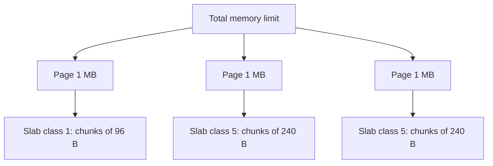
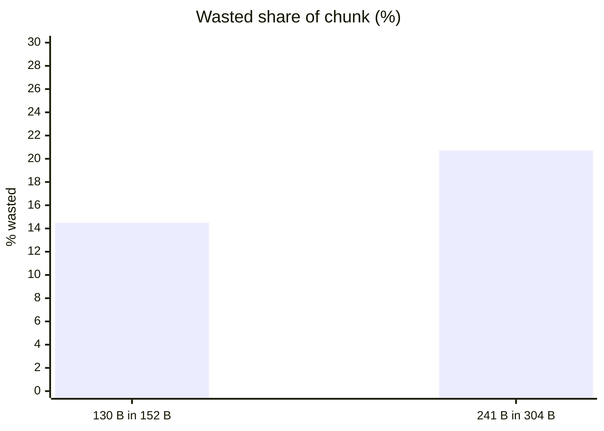
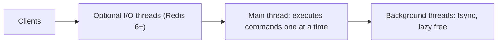
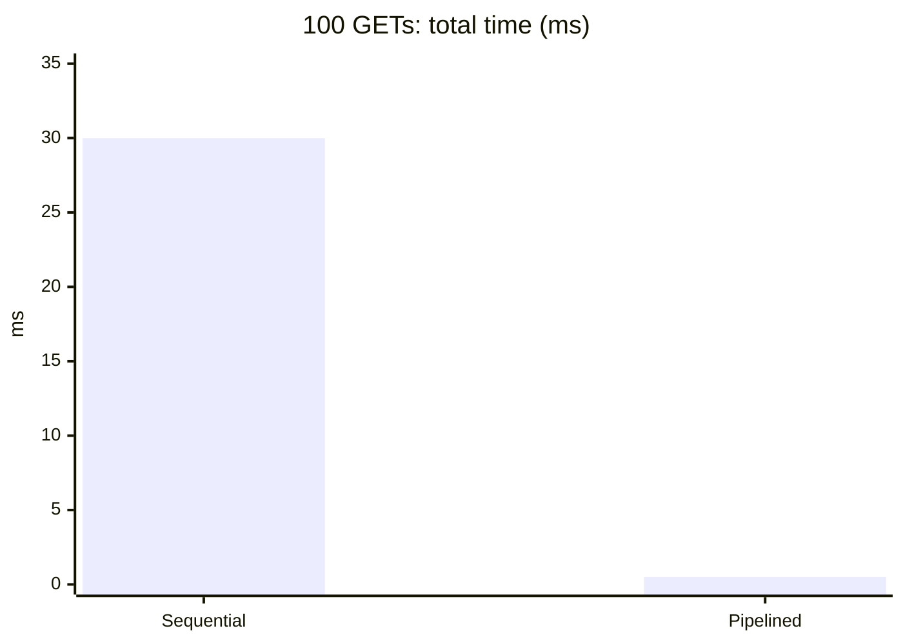
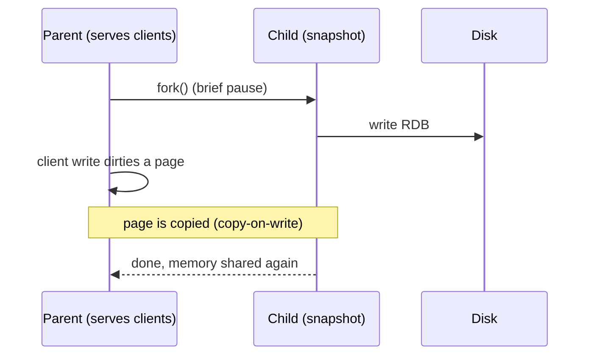
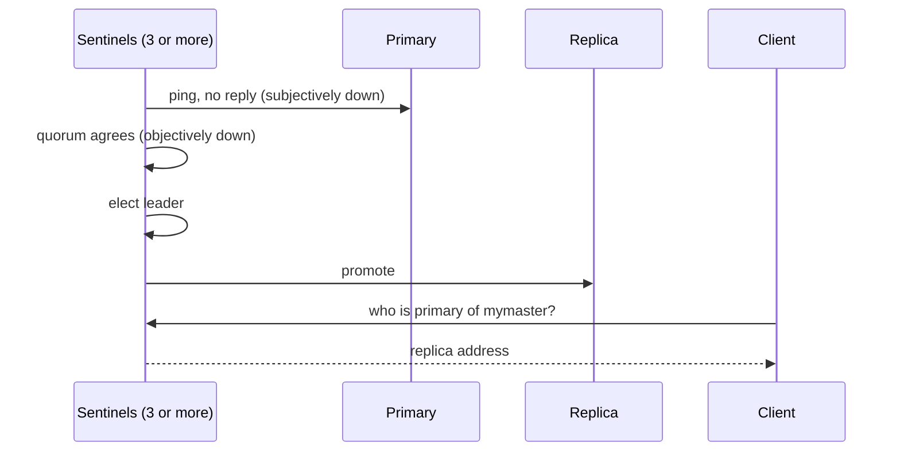
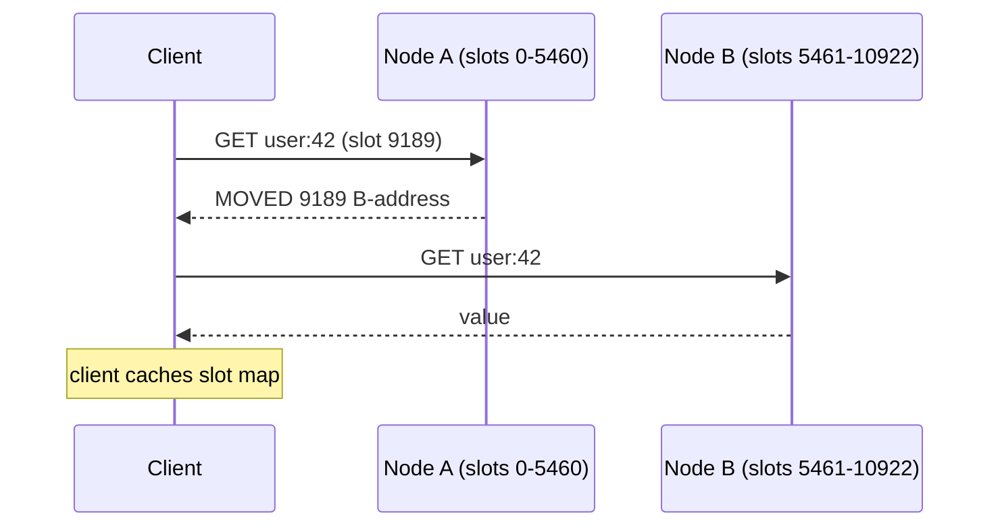
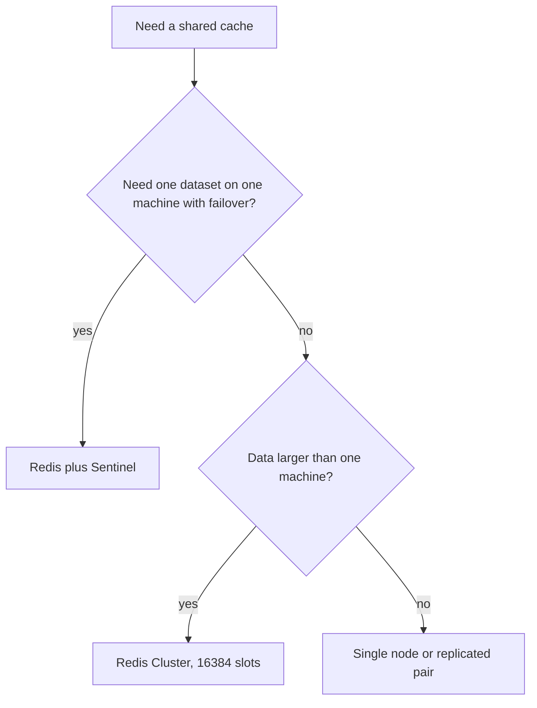
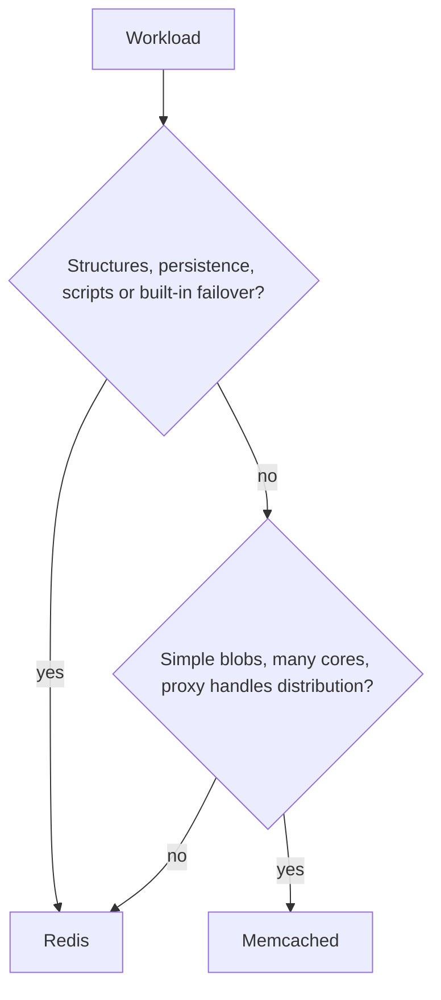

# Memcached and Redis architecture

## Learning objectives

After this lesson you should be able to:

- Describe how Memcached stores items (slab classes, chunks, pages) and why it can waste memory or evict a useful item despite free space elsewhere.
- Explain Memcached's threading model and why it has no persistence and no replication of its own.
- Explain Redis's command execution model, what is and is not single-threaded, and the consequences for latency.
- Compare RDB snapshots with the append-only file (AOF), including the fsync policies and the fork and copy-on-write cost.
- Explain Redis replication, Sentinel and Cluster (hash slots, `MOVED` and `ASK` redirects, hash tags).
- Choose between Memcached and Redis for a workload, and flag which statements depend on the version you run.

A note on certainty. These systems evolve. Where this lesson gives a default value or a feature boundary that has changed across versions, it says so. Always check the documentation for the version you operate before relying on a specific default.

## 1. Two philosophies

Memcached and Redis both keep data in RAM and answer simple commands over a network protocol, so they are often mentioned together. Their designs come from different philosophies.

**Memcached** is a deliberately small cache. It stores opaque byte strings under string keys with an expiry. It has no data structures other than the value blob, no persistence, and no clustering of its own. Its virtue is that it does one thing, scales across CPU cores, and makes very predictable use of memory. Distribution is entirely the client's or proxy's job (see the previous lesson on sharding).

**Redis** is a "data structure server". Values are typed: strings, lists, hashes, sets, sorted sets, streams, bitmaps and others. Commands operate on the structure server-side (push to a list, increment a hash field, add to a sorted set with a score). It can persist to disk, replicate, run scripts atomically, and cluster itself. It can serve as a cache, but also as a primary store for suitable data, a queue, a leaderboard or a rate limiter. This breadth brings complexity and a different performance model.

Neither is "better". The right question is what your workload needs.

## 2. Memcached internals

### 2.1 The slab allocator

A general-purpose allocator such as `malloc` fragments memory over time when many objects of varied sizes are created and freed, and its behaviour is hard to predict. A cache churns objects constantly, so Memcached avoids the problem with a **slab allocator**.

Memory is obtained in fixed-size **pages** (1 MB by default). Each page is assigned to a **slab class** and divided into equal-size **chunks**. Slab classes have chunk sizes growing geometrically by a **growth factor** (default 1.25 in recent versions: for example 96 bytes, 120, 152, 192, 240, 304, and so on; exact sizes depend on version and settings). An item is stored in the smallest chunk that fits it.

Consequences:

1. **Internal fragmentation.** An item of 130 bytes stored in a 152 byte chunk wastes 22 bytes, 14.5%. With a factor of 1.25, the average waste is bounded by about 20% of the chunk, and on average perhaps 10%. If your item sizes cluster just above a boundary, say 241 bytes into 304 byte chunks, the waste is `63 / 304 = 20.7%`. Tuning the growth factor changes this; a smaller factor means more classes and less waste per item but more classes to manage.
2. **Slab calcification.** Pages are assigned to classes as demand arises. If the workload shifts from small items to large items, all pages may already belong to the small class. The large class has few pages and evicts aggressively, even though the small class has many free or cold chunks. Memcached has a **slab rebalancer** (with an automove setting, and in newer versions a background thread) that can reassign pages between classes, but it is a mitigation, not a guarantee; the observable symptom is a rising eviction count in one slab class while memory seems plentiful in another. Inspect per-class statistics (for example via the `stats slabs` and `stats items` commands) rather than only the global figures.
3. **Per-class LRU.** Eviction is per slab class: when a class has no free chunk and cannot get a page, it evicts from the tail of its own LRU. A 200 byte item competes only with other items of similar size, not with the whole cache. This is usually fine but can surprise you: an old 200 byte item is evicted while a much staler 2 KB item survives.

Recent versions use a segmented LRU (hot, warm and cold segments plus a background crawler that reclaims expired items), which reduces lock contention and protects items that are being accessed repeatedly from being evicted by a scan of one-off keys. The details vary by version, so treat the main point as: "the LRU is approximately LRU and per class".

Internal fragmentation in slab chunks (waste as a share of the chunk):

> **Key idea:** eviction is per slab class. A class can evict hard while another class sits on free or cold chunks (slab calcification).

### 2.2 Limits and expiry

Keys are limited to 250 bytes. Values are limited to 1 MB by default (configurable, but large items fit poorly in the slab scheme and in network buffers; very large values should be split or stored elsewhere). Expiry is **lazy plus crawled**: an expired item is detected when it is read (and dropped), and a background crawler reclaims expired items so they do not occupy memory waiting for LRU pressure. TTLs longer than 30 days in the classic protocol are interpreted as absolute Unix timestamps rather than relative seconds, a quirk worth remembering when you see items expire "immediately" because someone passed a large relative number.

### 2.3 Threading

Memcached is **multithreaded**. A listener accepts connections and hands them to a pool of worker threads (a handful by default, configurable), each running an event loop (it uses libevent). Workers share the hash table and slab structures with fine-grained locking. This design lets one process use many cores, which is why a single Memcached instance can saturate a fast network card on a big machine. Operations such as `get` and `set` are individually atomic, and `cas` (compare-and-swap with a version token) lets clients implement optimistic concurrency. Multi-key atomicity does not exist.

### 2.4 No persistence, no clustering

Memcached keeps everything in RAM and does not write it to disk by default. A restart loses everything. There is no built-in replication or sharding. Some recent versions add optional features such as a flash-backed secondary storage tier for large values and a "warm restart" ability that preserves data across restarts using shared memory files; these are opt-in and version-dependent, and are best understood as operational conveniences, not durability guarantees.

The absence of server-side distribution is a feature of the architecture: servers do not know about each other, which makes them simple, and clients or proxies choose placement (consistent hashing, as in the previous lesson). Failure of a server affects only its slice of keys.

### 2.5 What Memcached gives you

Predictable memory behaviour, multi-core efficiency, a tiny feature surface (get, set, add, replace, delete, incr/decr, cas, touch and a few others, plus a newer "meta" command set in recent versions). It has fewer ways to hurt you, and fewer ways to help you.

## 3. Redis internals

### 3.1 The command execution model

Redis executes commands on a **single main thread** in an event loop. Commands from all clients are processed one at a time, in turn. This single-threaded execution is a key design decision. It means:

- **Every command is atomic**, with no locks needed for data structures. `INCR`, `LPUSH`, `ZADD` and Lua scripts run to completion without interleaving with other commands.
- **Simplicity and predictable CPU use** per command. No lock contention inside the data layer.
- **One slow command blocks everyone.** If a command takes 50 ms, every other client waits at least that long. Commands with O(N) cost on large collections are the classic hazard: `KEYS *` on a large keyspace, `SMEMBERS` or `LRANGE 0 -1` on a million-element collection, `FLUSHALL` (synchronous), or a large Lua script. Use incremental scanning commands (`SCAN`, `SSCAN`, `HSCAN`, `ZSCAN`) with a cursor, and bound range queries.
- **One core limits throughput** per instance for command execution. A single Redis instance commonly handles on the order of tens to a few hundred thousand simple operations per second, depending on hardware, command mix, payload size and pipelining. Scaling beyond that means more instances (sharding, via Cluster or client-side).

**What is not single-threaded.** This is a place where outdated lore misleads. Since Redis 6, the server can optionally use additional **I/O threads** to read from and write to sockets (parsing and writing replies) while command execution itself remains on the main thread. This is off by default and configurable; it helps when network I/O, not command execution, is the bottleneck. In addition, Redis uses background threads for operations such as closing files, fsync of the AOF and lazy freeing of large objects (`UNLINK`, and lazy-free configuration options, which reclaim memory off the main thread so deleting a huge key does not stall). RDB snapshots and AOF rewrites are performed by a **forked child process**. So "Redis is single-threaded" is accurate only for command execution. Recent versions continue to evolve their threading, so check your version's notes.

**Latency.** A simple command costs on the order of microseconds to tens of microseconds server-side; the round trip over a network adds hundreds of microseconds within a data center. Because round trips dominate, **pipelining** (send many commands without waiting for each reply) and batch commands (`MGET`, `MSET`) give large throughput gains. A client doing 100 sequential gets at a 0.3 ms round trip spends 30 ms; pipelined in one batch it spends little over one round trip plus server time, perhaps 0.5 ms.

Where Redis threads fit:

Round trips dominate latency, so pipelining pays off (100 gets at a 0.3 ms round trip):

### 3.2 Data structures and their costs

Redis exposes real structures; each command documents its time complexity. Some examples:

| Structure  | Typical use                | Notes                                           |
| ---------- | -------------------------- | ----------------------------------------------- |
| String     | cached blobs, counters     | binary-safe, up to 512 MB per value             |
| Hash       | object with fields         | partial update without rewriting the whole blob |
| List       | queues, recent items       | push/pop at ends is O(1)                        |
| Set        | membership, tags           | `SADD`, `SISMEMBER` O(1)                        |
| Sorted set | leaderboards, time indexes | scored order, roughly O(log N) updates          |
| Stream     | append-only logs           | consumer groups                                 |

For caching, hashes are useful: caching a user object as a hash lets you update one field without a read-modify-write of a serialized blob. Small collections are stored in compact encodings (for example a packed list structure) that save memory, switching to hash-table or skiplist encodings above configurable size thresholds. Memory per element can therefore change by several-fold when a collection crosses a threshold, a thing to remember when estimating capacity.

### 3.3 Memory limits and eviction

Setting `maxmemory` gives a ceiling. When it is reached, the `maxmemory-policy` determines behaviour. Policies include `noeviction` (writes fail with an error; the default in many configurations, which surprises people who expect a cache to evict), `allkeys-lru`, `allkeys-lfu`, `allkeys-random`, `volatile-lru`, `volatile-lfu`, `volatile-random` and `volatile-ttl`. The `volatile-` variants consider only keys with a TTL; if no key has a TTL, they behave like `noeviction`. For a pure cache `allkeys-lru` or `allkeys-lfu` is the typical choice.

Redis's LRU and LFU are **approximated**: instead of maintaining an exact global list it samples a small number of keys (a configurable `maxmemory-samples`, default 5) and evicts the best candidate among them. Larger samples approximate true LRU more closely at more CPU cost. Expiration works similarly: a key with a TTL is dropped lazily when accessed, and a background cycle samples keys with TTLs and deletes the expired ones. Consequently the memory used by expired but unvisited keys may linger briefly, and a mass expiry of many keys at the same instant can cause a CPU spike (jitter your TTLs, as the TTL chapter explains).

### 3.4 Persistence

Redis can persist its dataset to disk in two ways, which can be combined.

**RDB (snapshot).** A point-in-time binary dump. Redis calls `fork()`; the child process writes the snapshot while the parent continues serving. The fork uses the operating system's **copy-on-write** (COW): parent and child share memory pages until the parent modifies one, at which point that page is duplicated. Costs:

- The `fork()` call itself must copy page tables, which takes time proportional to memory size. For tens of gigabytes this may pause the main thread for tens to hundreds of milliseconds, longer on some virtualised environments. That pause is a latency spike for every client.
- During the snapshot, every written page is duplicated. Under a write-heavy workload, memory use can approach double the dataset size in the worst case. If the machine cannot afford that, the kernel may kill the process (out-of-memory) or the fork fails. Leave headroom, and watch for kernel settings such as memory overcommit and transparent huge pages (which makes COW copy 2 MB pages instead of 4 KB pages and amplifies the cost; recommended practice is to disable it for Redis hosts).
- A snapshot is a point in time. Data written after the last snapshot is lost on a crash. With snapshots every 5 minutes, you may lose up to 5 minutes of writes.

Strengths: compact file, fast restart (loading is quick), good for backups and for bootstrapping replicas.

**AOF (append-only file).** Every write command is appended to a log. On restart Redis replays the log. The `appendfsync` setting controls durability:

- `always`: fsync after each write; safest, slowest (each write waits on disk).
- `everysec`: fsync once per second; the typical choice; a crash loses at most about a second of writes (in rare stall situations somewhat more).
- `no`: leave flushing to the operating system; fastest, with a loss window of whatever the OS has buffered (often up to tens of seconds).

The log grows, so Redis periodically performs an **AOF rewrite**, again with a forked child, producing a compact log equivalent to the current dataset. Recent versions use a multi-part layout (a base file plus incremental files) and can use an RDB-format preamble in the base file for faster loading; details vary by version.

**Choosing.** For a pure cache, many deployments turn persistence off entirely: after a crash they accept a cold cache, and they use replicas for availability. That removes the fork risk. If you do want warm restarts, RDB snapshots (perhaps taken on a replica rather than the primary, so the primary never forks) are a common compromise. If Redis holds data that is not recoverable elsewhere, use AOF with `everysec` plus replication plus backups, and understand that even then Redis is not a fully durable database: replication is asynchronous and `everysec` can lose a second.

RDB versus AOF at a glance:

|                | RDB snapshot                            | AOF                       |
| -------------- | --------------------------------------- | ------------------------- |
| What it stores | point-in-time dump                      | log of every write        |
| Loss on crash  | since last snapshot (for example 5 min) | about 1 s with `everysec` |
| Main cost      | fork pause and copy-on-write memory     | fsync cost, log rewrites  |
| Restart speed  | fast                                    | slower (replay)           |

The fork-and-copy-on-write snapshot:

### 3.5 Replication

Redis replication is asynchronous primary-replica. A replica connects and issues `PSYNC`. If it has a history the primary can continue from (identified by a replication ID and offset, and still within the replication backlog buffer), a partial resynchronisation occurs. Otherwise there is a full resynchronisation: the primary forks, generates an RDB, sends it, and buffers writes made meanwhile. Replicas can have their own replicas (chained). Replicas are normally read-only. As discussed in the failover lesson, size the backlog and the client output buffers deliberately. Newer versions have added options such as diskless replication, where the RDB is streamed directly to replica sockets without touching the primary's disk; whether it is the default depends on version.

### 3.6 Sentinel

Redis Sentinel is a separate set of processes that monitor a primary and its replicas, detect failure by quorum, elect a leader among the Sentinels, promote a replica and reconfigure the others, and act as a service discovery source: clients ask a Sentinel "who is the primary of `mymaster`?". Sentinel suits a **single shard** (one dataset that fits on one machine) needing automatic failover. It does not shard data. Run an odd number of Sentinels, at least three, in independent failure domains.

Sentinel failover for a single shard:

### 3.7 Redis Cluster

Redis Cluster shards data and provides failover without Sentinel. Its design is the fixed-slot scheme from the previous lesson: **16384 hash slots**, with `slot = CRC16(key) mod 16384`. Each primary owns a subset of slots; each primary may have replicas. Nodes talk through a gossip protocol on a separate cluster bus port, exchanging health information and agreeing when a primary has failed (a majority of primaries must agree to authorise failover).

If a client asks the wrong node, the node replies `MOVED <slot> <address>`, a permanent redirect; a cluster-aware client then updates its local slot table and goes straight to the right node next time. During migration of a slot between nodes, a node may answer `ASK`, a one-time redirect that does not update the table. Resharding moves slots incrementally, migrating keys of a slot from source to target while both remain available.

**Constraints.** Multi-key commands and transactions work only if all keys are in one slot, otherwise the cluster returns a `CROSSSLOT` error. **Hash tags** (`{user:42}:profile`) force co-location by hashing only the braces content. Only one logical database (database 0) is available in cluster mode. Clients must be cluster-aware. The number of primaries is practically limited (the documentation suggests on the order of a thousand nodes as an upper design bound); this is rarely a concern.

**Availability caveat.** Cluster uses asynchronous replication, so as with Sentinel, acknowledged writes can be lost on failover. If a primary and all its replicas fail, the slots it owned are unavailable, and by default the cluster stops accepting writes for the entire cluster until coverage is restored (a configuration parameter allows partial availability). Know your setting.

Where each mode fits:

## 4. Memcached versus Redis: choosing

| Dimension                         | Memcached                               | Redis                                                         |
| --------------------------------- | --------------------------------------- | ------------------------------------------------------------- |
| Data model                        | opaque blobs                            | rich structures                                               |
| Concurrency                       | multithreaded                           | single-threaded commands (optional I/O threads)               |
| Memory efficiency for plain blobs | slab allocator; predictable; some waste | jemalloc based; some overhead per key; fragmentation possible |
| Persistence                       | none (by default)                       | RDB, AOF                                                      |
| Replication, failover             | none built in                           | built in; Sentinel and Cluster                                |
| Atomic multi-step operations      | no                                      | scripts, transactions, structure commands                     |
| Operational surface               | small                                   | larger                                                        |

A common guideline: if you need a simple, large, multi-core, shared blob cache and you control distribution through a proxy, Memcached is excellent. If you need structures, atomic server-side operations, persistence, built-in failover or you want one system to do several jobs, choose Redis. Note that mixing roles in one Redis (cache plus queue plus primary store) couples their failure modes and eviction policies; a cache needs eviction, a queue must never evict. Keep them on separate instances.

Licensing and distribution of Redis have changed over the years and compatible forks exist; if that matters to you, check current terms and projects before deciding. That is a policy question rather than an architecture one, so we only note it.

Choosing a system:

> **Key idea:** keep cache, queue and primary store on separate Redis instances. A cache must evict, a queue must never evict.

## 5. A worked example: choosing persistence and sizing for a fork

A Redis primary holds 30 GB of cache data and handles 20,000 writes per second of roughly 500 bytes each, so about 10 MB/s of modified data. Suppose a snapshot takes 120 seconds. During those 120 seconds, the amount of memory touched by writes is at most `10 MB/s * 120 s = 1,200 MB` if writes hit distinct pages, but with 4 KB pages and random keys each write may dirty a whole 4 KB page: `20,000 * 4 KB = 80 MB/s`, so up to `80 * 120 = 9,600 MB` (9.6 GB) of duplicated pages in the worst case, bounded by the dataset itself. With transparent huge pages enabled, each write dirties 2 MB, and the whole 30 GB could be duplicated quickly. This is why "peak memory during snapshot" is often 1.3 to 2 times the steady state, and why a host with 32 GB of RAM running a 30 GB dataset is a time bomb. Provision for the snapshot peak, or disable persistence on the primary, or snapshot from a replica.

## 6. Common pitfalls

- **Assuming Redis never blocks.** One `KEYS *` or a huge `SMEMBERS` can freeze a shared instance. Use scanning commands and review slow logs.
- **Leaving the default `noeviction` on a cache.** Writes begin failing when memory fills. Set an eviction policy.
- **Running Redis at 100% of RAM.** Fork, fragmentation, buffers and the OS all need room. Leave generous headroom.
- **Mixing cache and primary-store data in one instance.** Eviction policy and durability needs conflict.
- **Ignoring slab imbalance in Memcached.** Check per-class statistics when evictions rise while memory looks free.
- **Large values.** A multi-megabyte value in Memcached is awkward and in Redis blocks the event loop during transfer and serialisation of big replies.
- **Enabling transparent huge pages on Redis hosts.** It inflates fork and copy-on-write cost.
- **Cluster without hash tags for multi-key logic.** You will meet `CROSSSLOT` errors in production.
- **Trusting a version-specific default from memory.** Check the docs for your version.

## 7. Check your understanding

1. Explain how Memcached's slab allocator works and describe one benefit and two costs.
2. A Memcached cluster shows evictions rising in slab class 12 but plenty of free memory in class 3. Explain what is happening and name two responses.
3. Which parts of Redis are single-threaded and which are not? Why does a single slow command harm every client?
4. Compare `appendfsync always`, `everysec` and `no` in terms of durability and cost. What is the recommended setting for a pure cache, and why?
5. Describe the full life of a read to the wrong node in Redis Cluster, including `MOVED`. What is the difference between `MOVED` and `ASK`?
6. A 24 GB Redis primary runs on a 32 GB host with persistence enabled and a heavy write rate. Identify the risk and give two ways to reduce it.

## 8. Answers

1. Memory is allocated in 1 MB pages, each assigned to a slab class and cut into equal chunks; classes grow by a factor (default about 1.25). Items go into the smallest chunk that fits. Benefit: no general-purpose heap fragmentation and predictable allocation. Costs: internal fragmentation (wasted bytes in each chunk, up to roughly 20%), and slab calcification (pages assigned to a class stay there unless rebalanced), and eviction is per class.
2. Pages have been assigned mostly to class 3 and class 12 is starved of pages, so it evicts from its own LRU despite free memory elsewhere (slab calcification after a change of item sizes). Responses: enable or tune the slab rebalancer (automove), restart or reshape the instance, adjust the growth factor or item sizing so sizes fit classes, or add memory.
3. Command execution runs on one main thread; I/O threads (optional since 6.0), background threads for lazy free and fsync, and forked children for snapshots and AOF rewrites are separate. Commands are processed one at a time, so a command that runs 50 ms makes every queued client wait at least that long.
4. `always` fsyncs every write (strongest, slowest); `everysec` fsyncs each second (loses about a second on crash, usual choice); `no` leaves it to the OS (fastest, largest loss window). For a pure cache persistence is often disabled or limited to RDB from a replica, because a crash only yields a cold cache and avoiding the fork and disk I/O reduces latency risk.
5. The client hashes the key to a slot and sends the command to the node it believes owns it. If that node does not own the slot it replies `MOVED slot address`; the client updates its slot map and resends to the owner. `MOVED` is permanent; `ASK` is a one-time redirect during slot migration and does not change the client's map.
6. A fork for RDB/AOF rewrite plus copy-on-write can nearly double memory under heavy writes, exceeding 32 GB and triggering out-of-memory or failed forks. Reduce by provisioning more RAM, disabling persistence on the primary or snapshotting from a replica, turning off transparent huge pages, and reducing `maxmemory` to leave headroom.

## 9. Summary

Memcached is a lean multithreaded blob cache built on a slab allocator, with per-class LRU eviction, lazy plus crawled expiry, no persistence and no server-side clustering. Redis is a feature-rich structure server whose commands execute atomically on a single main thread, supported by I/O and background threads and forked children; it offers approximated LRU and LFU eviction, RDB and AOF persistence with their fork and fsync trade-offs, asynchronous replication, Sentinel for single-shard failover and Cluster with 16384 hash slots for sharding. Many of the defaults and edge behaviours depend on the version, so verify before relying on them. The next lesson turns to the memory side in detail: how to measure fragmentation, size objects, serialise and compress values, and keep memory predictable.
