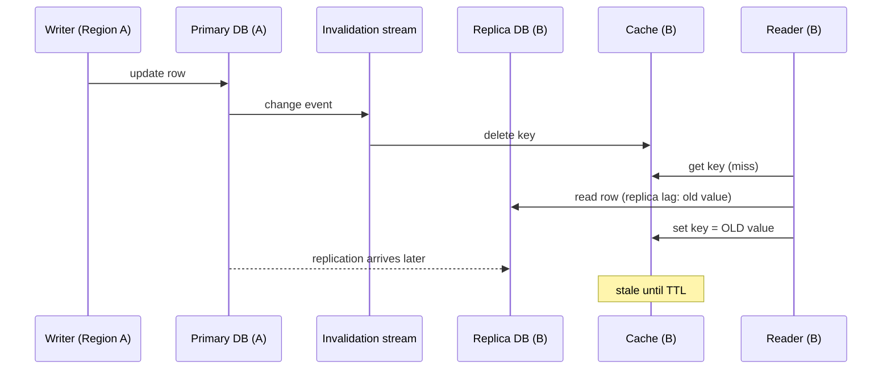

# Memory, serialization and multi-region caching

## Learning objectives

After this lesson you should be able to:

- Distinguish internal fragmentation, external fragmentation and metadata overhead, and compute the real memory cost of a cached object.
- Interpret a fragmentation ratio and choose a response.
- Choose a serialization format and a compression strategy by weighing size, CPU, schema evolution and debuggability.
- Estimate whether compression pays off using a simple cost model.
- Explain the options for multi-region caching (independent regional caches, replicated caches, a primary region) and the consistency hazards of each.
- Design cache key versioning so that rolling deployments with different serializers do not poison each other.

## 1. Where does the memory actually go?

Engineers new to caching estimate memory as "number of items times value size". This is almost always wrong, often by a large factor. Suppose you cache 100 million small user records of 200 bytes each. Naively that is 20 GB. In practice you will observe something like 35 to 45 GB. The difference is overhead, and it is predictable once you know where to look.

The per-item cost has four parts:

1. **Payload:** the value bytes you chose to store.
2. **Key:** the key bytes. Keys like `user:profile:v3:1234567890` are 27 bytes; at 100 million items that is 2.7 GB just for keys. Verbose keys are an easily avoidable cost.
3. **Per-item metadata:** pointers for the hash table and LRU list, expiry time, flags, reference counts, a CAS version in Memcached. Order of tens of bytes per item. In Redis, each key has a dictionary entry, a key object and a value object; the per-key overhead is commonly cited as roughly 50 to 100 bytes depending on version and data type. Treat that range as a planning estimate and measure on your version.
4. **Allocator rounding and fragmentation:** the allocator rounds sizes up to its bucket sizes, and over time free space becomes scattered.

An illustrative estimate for 100 million items, each with a 27 byte key, 200 byte value, about 60 bytes metadata, and 10% allocator waste:

```
per item  = (27 + 200 + 60) * 1.10 = 315.7 bytes
total     = 100,000,000 * 315.7   = 31.6 GB
```

That is 58% above the naive 20 GB. If the values are small, overhead dominates: for a 20 byte value with the same key and metadata, the item costs `(27 + 20 + 60) * 1.1 = 118` bytes, nearly six times the payload. For tiny values, packing many into a Redis hash or a compact structure (one cache entry holding 100 related small values) can dramatically cut per-value overhead; the cost is coarser invalidation and larger reads.

## 2. Fragmentation

### 2.1 Internal fragmentation

Wasted space inside an allocated block. The Memcached slab allocator trades internal fragmentation for predictability: an item is placed in a chunk of the next size class, so up to roughly a growth-factor's worth of the chunk is wasted (see the Memcached and Redis lesson). Any allocator that rounds up sizes has some.

### 2.2 External fragmentation

Free memory that is unusable because it is in small scattered holes. Imagine a heap with 10 GB free but split into millions of 64 byte holes: a request for a 1 KB block fails or forces growth of the process. In a cache, this arises because items of mixed sizes and lifetimes are allocated and freed in unrelated orders.

### 2.3 The Redis view

Redis reports `used_memory` (what the allocator has handed to Redis) and `used_memory_rss` (what the operating system has actually given the process). The ratio `used_memory_rss / used_memory` is the **memory fragmentation ratio**.

- Around 1.0 to 1.5 is generally healthy.
- Much higher than 1.5 suggests external fragmentation, where RSS far exceeds the live data. For example RSS of 15 GB against `used_memory` of 8 GB is a ratio of 1.88: nearly half the process is wasted.
- Below 1.0 is a warning sign that the operating system is swapping part of Redis's memory to disk, which is disastrous for latency. Check swap usage immediately.

Responses to high fragmentation: Redis (when built with its bundled allocator, jemalloc) supports **active defragmentation** that relocates values in the background to compact memory, configurable by thresholds and CPU effort. It consumes CPU on the main thread, so enable it with limits and watch latency. Alternatively, restart the node: with replicas, fail over and restart the old primary, gaining a freshly compacted instance. Prevent by keeping value sizes consistent and by avoiding patterns of massive delete-then-insert of differently sized values.

### 2.4 Deleting big things

Dropping a key with millions of elements frees memory proportional to its size and, if done synchronously, blocks the event loop. In Redis use `UNLINK` (asynchronous reclaim) rather than `DEL` for large keys, and consider lazy-free settings for eviction and expiry. Likewise `FLUSHALL ASYNC` rather than a synchronous flush.

## 3. Serialization

A distributed cache stores bytes, but your application has objects. Converting between them is serialization, and the choice affects cache size, CPU, compatibility and debuggability.

### 3.1 Criteria

- **Size.** Smaller values mean more items per GB, lower network cost and faster transfer.
- **CPU.** Serialization and deserialization happen on every read and write in the application tier. At 50,000 reads per second, spending 40 microseconds per decode is 2 CPU-seconds per second, i.e. two cores.
- **Schema evolution.** When you deploy a new version of the class, can old cached bytes still be read, and can the old version read new bytes (during a rolling deploy)?
- **Language portability.** Does a second service in another language need to read the entries?
- **Debuggability.** Can you inspect a value with a command line client?
- **Safety.** Deserialization of untrusted data can be exploited. Native object serialization frameworks (for example Java's built-in serialization) have a long history of vulnerabilities; never deserialize bytes that an attacker could influence, and prefer data-only formats.

### 3.2 Common choices

| Format                                                                         | Size              | CPU      | Schema evolution                   | Notes                   |
| ------------------------------------------------------------------------------ | ----------------- | -------- | ---------------------------------- | ----------------------- |
| JSON text                                                                      | large             | moderate | tolerant (extra or missing fields) | debuggable, portable    |
| Language-native serialization                                                  | varies            | varies   | brittle across versions            | risky, not portable     |
| Schema-based binary (Protocol Buffers, Avro, Thrift, FlatBuffers, Cap'n Proto) | small             | low      | designed for it                    | needs schema management |
| MessagePack / CBOR                                                             | smaller than JSON | low      | schemaless like JSON               | portable, less readable |

A worked comparison. Take a record `{id: 123456789, name: "Ada Lovelace", active: true, score: 98.6}`. As compact JSON, it is about 70 bytes: field names are repeated in every record. A schema-based binary encoding stores field numbers instead of names, maybe 25 to 30 bytes. For 100 million records the difference is `(70 - 28) * 100M = 4.2 GB`, with the extra benefit of lower CPU. But the JSON version can be read with a one-line client command during an incident. There is no universally right answer; at small scale choose debuggability, at large scale measure.

### 3.3 Schema evolution and cache versioning

A rolling deployment means two versions of your code run simultaneously for minutes or hours, sharing one cache. Version 2 adds a field; version 1 does not know it. Cases:

- v2 writes a value that v1 reads. If v1's deserializer rejects unknown fields it throws, the application treats the error as a miss (or worse, as a crash), and v1 instances thrash. Prefer tolerant readers: ignore unknown fields.
- v1 writes a value that v2 reads and the new field is missing. v2 must supply a default or treat the entry as a miss.

The robust technique is **versioned keys**: include a schema version in the key (`user:v7:123`). A new schema writes `v8` keys. Old and new versions of the application never read each other's entries. The cost is a cold cache for the new version, which you can mitigate by warming (see below) or by deploying first with dual reads. Treat the key prefix as part of the data contract. This also gives a clean rollback: v7 entries remain valid until their TTL expires.

Remember the stale-entry cousin of this: a bug that cached bad data can be fixed instantly by bumping the version, instead of hunting keys to delete. That is a cheap, powerful invalidation tool for a whole class of entries.

## 4. Compression

Compression trades CPU for memory and bandwidth. Whether it is worth it depends on value size, compressibility and where your bottleneck is.

### 4.1 A cost model

Let a value have size `S` bytes and compress to `S/r` where `r` is the compression ratio (2 for halving). Compression costs CPU time `tc` per write and decompression `td` per read. Benefits: memory saved `S(1 - 1/r)` per item, and transfer time saved on both write and read, `S(1 - 1/r) / B` for network bandwidth `B`.

Example: values are 20 KB of JSON, `r = 4` (JSON compresses well), a fast general-purpose compressor of the LZ4 or Snappy family decompresses at roughly one to several GB/s per core (order of magnitude, hardware-dependent), so `td` for 20 KB is about 10 to 20 microseconds. The memory saving is `20 KB * 0.75 = 15 KB` per item. For 50 million items that is 750 GB saved: you need perhaps a quarter of the cache fleet. The CPU cost at 50,000 reads per second is `50,000 * 15 microseconds = 0.75` core-seconds per second, under one core. Strongly worth it.

Counter-example: values are 200 bytes. Compression ratio may be near 1 (too little redundancy; compressor headers and dictionaries do not pay off), and the CPU time, though tiny, is not repaid. Skip compression below roughly a few hundred bytes to a kilobyte, a typical threshold; measure.

### 4.2 Practicalities

- **Compress only above a size threshold,** and record in a header byte whether a value is compressed and with which algorithm, so mixed entries coexist and the algorithm can change.
- **Prefer fast algorithms** (LZ4, Snappy, or Zstandard at a low level) for caches. Slower, tighter algorithms suit data that is written rarely and read rarely; for a hot cache the decompress path matters most.
- **Already-compressed data** (images, JPEG, encrypted payloads) will not compress; do not try.
- **Dictionary compression** (Zstandard supports trained dictionaries) can dramatically improve ratios for many small similar values, such as thousands of near-identical JSON records, at the price of managing the dictionary as part of the versioned contract.
- **Where to compress:** in the client library, so the cache stores compressed bytes and network transfers are smaller. Server-side compression exists in some products but clients are the common place.
- **Large-value splitting.** Memcached's default item limit is 1 MB; a 3 MB value must be chunked across keys (with a manifest) or stored elsewhere. Chunking multiplies requests and complicates atomicity: readers may see chunks from different versions. Include a version or checksum in each chunk and the manifest, or avoid caching such values.

## 5. Multi-region caching

When your users or services are in several geographic regions, a cache in one region serving another incurs cross-region latency (tens to hundreds of milliseconds; for example US East to Europe is typically on the order of 70 to 100 ms round trip, and to Asia-Pacific more; treat these as orders of magnitude). That defeats the cache's purpose, whose speed target is around a millisecond. So you place caches in each region. The new problem is keeping them coherent.

### 5.1 Option A: independent regional caches

Each region has its own cache, filled by that region's reads from its local database replica or the primary. Writes go to the primary database (wherever it is) and invalidate the local region's cache only. Other regions rely on TTLs to age out. Simple and robust; staleness in remote regions is bounded by TTL plus replication lag. Many systems accept this. The weakness is that an update in one region is not seen elsewhere until the TTL elapses, unless you add propagation.

### 5.2 Option B: propagated invalidation

The data-change event is published to a stream (database change data capture, or an invalidation message bus), and each region's invalidator deletes the affected keys. Staleness shrinks to propagation delay, typically sub-second to seconds. A subtle race remains: the invalidation can reach a region before the database replica in that region has received the new row. The region's next miss then reads the _old_ row from the lagging local replica and caches it, and no further invalidation comes. The cache is now stale until TTL. Mitigations: delay the invalidation until replication has caught up (tie the invalidation to the replicated log position), or make the invalidator re-delete after a delay, or carry a version and refuse to cache a value older than the invalidation's version. Facebook's description of Memcached at scale discusses invalidation carried by database commit logs for this reason, and cross-region staleness caused by replication lag; consult the separate case study on that paper rather than relying on this summary for details.



### 5.3 Option C: replicated cache across regions

Treat the cache itself as geo-replicated (some products provide active-active replication with conflict resolution). Reads are local and writes propagate. The usual issues: conflict resolution (last-writer-wins can lose updates), and the fact that cached values are derived from the database, not authoritative, so duplicating derived state across regions duplicates risk. Prefer replicating the _events_ that cause invalidation, and keep caches independent.

### 5.4 Option D: home region per key

Route each user's requests to the region that "owns" their data (affinity). Then both the database primary and cache entries for that user live in one region and conflicts largely vanish. Failover to another region must handle the cold cache. This works well for user-partitioned data; poorly for global data (a product catalog read from everywhere).

### 5.5 Region failover and cold starts

If a region's cache is lost and traffic from a failed region shifts in, the surviving region receives extra load against its cache and database, and the keys relevant to the new users are not in its cache. Pre-warm with synthetic traffic or by replaying a sample of reads from the failed region where feasible; ensure the database in the receiving region is sized for a cold-cache period; use rate limiting and request coalescing. Capacity planning for this scenario is part of the next lesson.

## 6. Common pitfalls

- **Capacity from payload size alone.** Add key, metadata, allocator and headroom. Measure with a realistic sample.
- **Ignoring fragmentation ratio.** A ratio above 1.5 or below 1.0 deserves action.
- **Verbose keys and verbose serialization at scale.** They multiply by item count.
- **Native serialization across versions.** Fails during rolling deploys and invites security problems.
- **No key versioning.** A schema change then needs a flush, which is an incident.
- **Compressing everything.** Tiny values and incompressible data waste CPU.
- **Cross-region reads on the hot path.** A 100 ms round trip per cache read breaks your latency budget.
- **Invalidating ahead of replication.** The race in Section 5.2 caches old data after the invalidation.
- **Deleting giant keys synchronously.** Use asynchronous reclaim.

## 7. Check your understanding

1. A team stores 50 million items with 40 byte keys and 150 byte values. They provision for `50M * 190 B = 9.5 GB`. Explain why this is insufficient and estimate a better number given 60 bytes of metadata and 15% allocator overhead.
2. Redis reports `used_memory` 10 GB and `used_memory_rss` 17 GB. Compute the fragmentation ratio and say what you would do. What would a ratio of 0.8 indicate?
3. Why can using a language's native object serialization cause an outage during a rolling deploy? How do versioned keys solve it?
4. Values average 30 KB, compress 3x, decompression takes 25 microseconds, and the service makes 40,000 reads per second. How many cores does decompression need, and how much memory is saved per million items?
5. Describe the replica-lag race in cross-region invalidation and give two mitigations.
6. When are independent regional caches with TTLs a reasonable choice, and when do you need propagated invalidation?

## 8. Answers

1. The estimate omits metadata and allocator rounding. Per item: `(40 + 150 + 60) * 1.15 = 287.5` bytes; times 50 million is about 14.4 GB, roughly 50% higher than 9.5 GB, and you still need headroom (for example 20 to 30%) for fragmentation, buffers, snapshots and growth, giving something like 17 to 19 GB.
2. 17 / 10 = 1.7, high, suggesting external fragmentation. Options: enable active defragmentation with CPU limits, or fail over and restart the node to compact it. A ratio of 0.8 means RSS is below the allocated memory, which usually means parts of the process are swapped out; fix immediately by removing swap pressure or adding RAM because swap devastates latency.
3. During a rolling deploy old and new code share the cache; native serialization often fails when class definitions differ, so one version throws on the other's entries, turning hits into errors or misses and causing thrash. Versioned keys give each schema version its own entries so they never read each other's data.
4. `40,000 * 25 microseconds = 1.0` core-second per second, so about one core. Memory saved per item is `30 KB * (1 - 1/3) = 20 KB`; per million items, 20 GB.
5. An invalidation reaches the remote region before its database replica has applied the update; a reader misses, reads the old row from the replica and caches it, and no later invalidation follows. Mitigations: delay or repeat the invalidation after replication catches up, tie invalidation to a replicated log position, or store a version with the value and refuse stale versions.
6. They suit data where bounded staleness equal to the TTL is acceptable (catalog pages, public content) and where simplicity matters. Use propagated invalidation when remote staleness must be much smaller than any practical TTL (prices, permissions, inventory shown to users).

## 9. Summary

A cached object costs much more than its payload because of keys, metadata, allocator rounding and fragmentation, so capacity estimates must start from measured per-item cost and include headroom. Fragmentation can be monitored through the RSS-to-used ratio and mitigated by active defragmentation or controlled restarts. Serialization is a design decision with consequences for size, CPU, schema evolution and security; versioned keys make rolling deploys and rollbacks safe. Compression pays for medium and large compressible values, using fast algorithms and a header to mark encoding. Multi-region caching pushes you toward independent regional caches, with TTLs or event-driven invalidation, and demands careful handling of replication lag, region failover and cold starts. The final lesson of this chapter brings these measurements together into capacity planning, monitoring and runbooks.
