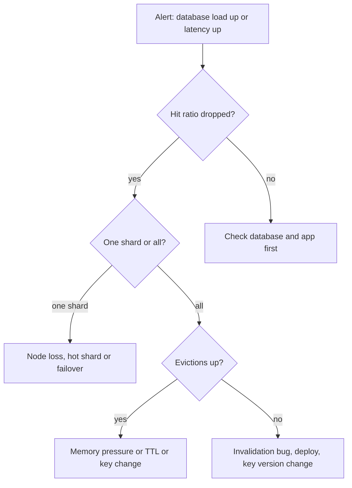

# Capacity planning, monitoring and runbooks

## Learning objectives

After this lesson you should be able to:

- Size a cache fleet from working set, per-item cost, throughput, replication and failure-tolerance requirements, showing the arithmetic.
- Read a hit-ratio-versus-size curve and judge the marginal value of more memory.
- Choose the metrics that matter for a cache (hit ratio, evictions, latency percentiles, memory, connections, replication lag) and set alerts that are actionable rather than noisy.
- Explain why averages hide cache problems and why percentiles and per-shard views are needed.
- Diagnose and respond to common failure modes using a structured runbook: node loss, hot shard, eviction storm, latency spikes, replication trouble and cold start.
- Plan safe changes: resizing, upgrades and flushing.

## 1. Capacity planning is arithmetic plus humility

Capacity planning for a cache answers a question of the form: how many nodes of what size do I need so that, under peak load, with a node or zone missing, the hit ratio is high enough that the database survives? Every input is an estimate; the point is to make the estimates explicit so that they can be checked against production.

There are five inputs.

1. **Working set.** The set of distinct keys (and their bytes) that are requested within the time window over which reuse is valuable. It is not the total data size. A 10 TB database may have a 200 GB working set because access is skewed.
2. **Per-item memory cost.** As the previous lesson showed: key, payload, metadata, allocator overhead.
3. **Throughput.** Peak operations per second and bytes per second, for reads and writes.
4. **Availability policy.** How many nodes or zones you must be able to lose and stay within the database's safe range.
5. **Headroom.** Slack for growth, fragmentation, snapshots, bursts.

### 1.1 Memory sizing

Suppose you will cache user sessions and profile fragments. Estimates: 80 million distinct keys in the working set, 300 bytes average per item including metadata and overhead (measured, not guessed). Raw data is `80M * 300 B = 24 GB`.

Add policy: one replica per primary doubles RAM: 48 GB across the fleet. Add fragmentation and persistence headroom of about 30% on each node (the guidance is roughly 25 to 50% for Redis if forking is used): 24 GB data needs nodes with `24 / 0.7 = 34.3` GB usable, per copy. Add growth at 40% over the next year: `34.3 * 1.4 = 48` GB per copy. With a replica: about 96 GB of RAM in total. If you use nodes with 16 GB each, that is six nodes (three primaries and three replicas), or choose eight nodes with four shards for smoother balance and a smaller blast radius per node.

### 1.2 Throughput sizing

Memory fit is not enough. Suppose peak is 400,000 reads per second and 40,000 writes per second, with an average 1 KB item over the wire. Network egress is `400,000 * 1 KB = 400 MB/s`, or 3.2 Gbit/s, plus replication traffic: each write is sent to the replica too, `40,000 * 1 KB = 40 MB/s` more. A 10 Gbit/s NIC handles that per cluster but not per node if the load is concentrated, so divide by the shard count and also include the imbalance factor from sharding: if the hottest shard carries 1.5 times the average, size for the hottest, not the average.

CPU: suppose each node can sustain 100,000 simple operations per second at acceptable latency (an assumed measured number, not a universal one; determine yours with a load test using your real value sizes and command mix). Peak 440,000 ops per second needs `440,000 / 100,000 = 4.4`, so five primaries minimum before headroom; with a target of 60% utilisation at peak, `4.4 / 0.6 = 7.3`, so eight primaries. Notice that throughput, not memory, became the binding constraint here: eight primaries with 16 GB each hold far more than the 24 GB dataset. You size for the larger of the memory requirement and the throughput requirement.

### 1.3 Failure-tolerance sizing

Return to the arithmetic of the replication lesson. With S shards, one shard's loss without replicas adds roughly `(peak_reads / S) * h` reads per second to the database, where `h` is the hit ratio. Compare with the database's headroom.

Let the database handle 30,000 reads per second in total, with a normal load of 8,000 from misses, leaving 22,000. At 400,000 reads per second and 98% hit ratio, miss load is 8,000 (consistent). With S = 8, losing a shard moves `(400,000 / 8) * 0.98 = 49,000` reads per second: far beyond 22,000. With replicas and a fast failover the extra is only the failover window's traffic, and the database experiences it as a brief spike: `49,000` extra for, say, 10 seconds. Does the database survive a spike of `8,000 + 49,000 = 57,000` for 10 seconds? Possibly with queuing; probably not without protective measures (request coalescing, circuit breakers, load shedding). The honest conclusion of such arithmetic is usually: replication helps, but you still need a defence in the application tier. This is the central message of the chapter on learning from caching incidents.

### 1.4 The hit ratio curve

The marginal value of cache memory shrinks. For an access pattern following a Zipf-like distribution, the hit ratio as a function of cache size rises steeply at first and then flattens. A useful illustration with invented but typical numbers:

| Cache size (% of working set) | Hit ratio |
| ----------------------------- | --------- |
| 5%                            | 70%       |
| 10%                           | 80%       |
| 25%                           | 90%       |
| 50%                           | 95%       |
| 100%                          | 99%       |

Going from 25% to 50% costs as much memory as going from 0 to 25% and buys 5 points. Whether that is worth it depends on the _miss cost_. The database load at hit ratio `h` is `(1 - h) * R` for request rate `R`. At 400,000 requests per second: 90% means 40,000 database reads per second; 95% means 20,000; 99% means 4,000. If each database read costs capacity worth X dollars, the break-even is straightforward: buy cache memory until the cost of the marginal memory equals the saved database cost. In practice the curve is estimated by simulation over production traces or by measuring hit ratio at different `maxmemory` settings on a canary. The tail of the curve is also where cache-hit improvements start hiding rare but expensive misses, so look at the latency or cost of misses, not only their count.

### 1.5 Be careful with averages when sizing

Peak and average differ. Diurnal peaks can be 3 to 5 times the trough. Events (sales, launches) push peaks beyond history. Size for the peak, plus a margin, and test with load generators that mimic the key distribution, because a uniform random test misses hot keys and understates imbalance.

## 2. Monitoring: what to watch and why

A cache is a quiet dependency until it is not. Good monitoring tells you about trouble before the database does.

### 2.1 Hit ratio

`hit_ratio = hits / (hits + misses)`. This is the headline metric, but treat it carefully.

- Track it **per cache namespace or key class**, not only globally. A global 95% can hide a critical key class at 40% whose misses are expensive.
- Track it **per shard**. One cold or broken shard dilutes into the average.
- Distinguish **misses** from **errors**. A timeout is not a miss, although the application may treat it as one; if you merge them, an outage looks like a mild hit ratio dip.
- Consider **miss cost**-weighted measures: miss rate times the database latency of that key class.
- A hit ratio that is steady is not necessarily healthy: it can be high because the cache is serving stale data after invalidation is broken.

Alert on **change** (a drop of several points over a few minutes) and on the **database load** that results, rather than a fixed threshold only.

### 2.2 Evictions and expirations

Count evictions per second. A cache at memory capacity evicts steadily by design; what matters is the trend and whether evicted items were still useful. Sudden eviction spikes mean memory pressure (a bulk load, a new large key class, a TTL change). Evictions of items that were recently used indicate the cache is too small for the working set, and the hit ratio will drop. Distinguish expirations (normal) from evictions (memory pressure). In Memcached look per slab class.

### 2.3 Latency percentiles

Averages hide tail behaviour. A cache whose mean latency is 0.4 ms may have a 99th percentile of 15 ms because of a blocking command, a fork pause or garbage collection in the client. Because a page request may involve dozens of cache calls, tail latency amplifies: if a request makes 50 independent cache calls and each has a 1% chance of being slow, then the probability that at least one is slow is `1 - 0.99^50 = 39.5%`. Monitor p50, p95, p99 and p99.9, measured both **server-side** (command latency) and **client-side** (including network, connection pool waits, serialization). When the two disagree, the problem is between them: the network, the client's pool or a CPU-starved application.

### 2.4 Memory

Track `used_memory`, `maxmemory`, the fragmentation ratio, RSS, the number of keys, and the key space by TTL class. Alert on approach to `maxmemory` for caches that must not evict and on abnormal growth rates. For Redis, also watch memory used by replication and client output buffers, which can grow quickly if a replica or a slow client lags.

### 2.5 Connections and clients

Connected clients, rejected connections, blocked clients, connection churn. A sudden growth in connection count often precedes trouble: a client bug leaking connections, or a deploy storm. Remember the multiplication problem of client-side sharding.

### 2.6 Throughput and command mix

Operations per second by command, bytes in and out. A change in mix (suddenly many `KEYS` or large `MGET` calls) is an early warning.

### 2.7 Replication and persistence

Replication lag in bytes or seconds, count of full resynchronisations, time since last successful snapshot, fork time (Redis reports the latest fork duration), AOF rewrite status, disk usage if persistence is on.

### 2.8 Slow log and hot keys

Slow command logs find expensive commands. Hot-key detection needs sampling: either server-provided key frequency statistics (Redis offers LFU-based tooling in recent versions; the available tools are version-dependent), or sampling in the client library, or proxy-level counters. Without it, a hot key looks like one overloaded node.

### 2.9 Dashboards and alerts

Two kinds of alert exist, and they should not be confused. **Symptoms** (users or the database are affected): database load above a threshold, application error rate, p99 request latency, hit ratio drop of a key class. **Causes** (a probable explanation): replica down, fragmentation ratio high, evictions rising. Page humans on symptoms and on causes that will inevitably become symptoms soon; send other causes to a dashboard or ticket. Every page should have a linked runbook. Alerts that fire daily without action train people to ignore them.

## 3. Failure modes and runbooks

A runbook is a pre-written procedure for a known situation. Write it before the 3 a.m. page. A good runbook states: how to recognise it, what to check, safe actions in order, what _not_ to do, and how to verify recovery. Below are skeleton runbooks for the most common cache failures. Adapt them to your platform.

### 3.1 Node loss or failover in progress

_Recognise:_ connection errors to one shard, hit ratio drop proportional to that shard's key share, database reads rise.
_Check:_ has automatic failover completed? Is the replica healthy and the replication offset close? Are clients refreshing topology?
_Act:_ confirm promotion; if automatic failover is stuck, perform a manual failover per your platform's procedure. Enable protective measures: ensure circuit breakers and request coalescing are on; shed low-priority traffic if the database is saturated; extend TTLs on warm shards if appropriate.
_Avoid:_ restarting everything; flushing caches; removing the node from the client list (which re-shards keys and multiplies misses) unless it is gone for good, in which case prefer replacing it with a node of the same identity.
_Verify:_ hit ratio recovers; replication re-established; replacement replica added.

### 3.2 Hot key or hot shard

_Recognise:_ one node at high CPU or network while others are idle; latency high on one shard; a few keys dominate access.
_Check:_ top keys by access frequency, via sampling.
_Act:_ add a short-lived in-process cache for the key in the application tier; replicate or split the key (suffixed copies selected randomly on read); rate limit or coalesce requests; if the key is a counter, shard the counter and sum on read.
_Avoid:_ adding more nodes as the first response; it will not redistribute one key.

### 3.3 Eviction storm or memory pressure

_Recognise:_ evictions per second jump; hit ratio falls; memory at the limit.
_Check:_ what changed? A new key class, a bulk import, larger values (a code change started caching bigger objects), a TTL increase, a missing TTL on a new key class (keys that never expire), or a traffic scan (a crawler walking the catalogue touches every item once and pollutes an LRU).
_Act:_ stop or throttle the offending writer; add memory or shards; shorten TTLs or add them where missing; if scan pollution, consider an eviction policy resistant to it (LFU or segmented LRU) or admission control.
_Verify:_ eviction rate returns to baseline and hit ratio recovers.

### 3.4 Latency spikes

_Recognise:_ p99 jumps while the mean is steady; periodic spikes at regular intervals.
_Check:_ the slow log (long commands), the latest fork time (persistence), swap usage, CPU steal on virtual machines, network drops, client-side GC pauses, mass expiry at a round time (TTLs set to expire together), background rewrite.
_Act:_ remove or replace the slow command; disable persistence on the primary or move snapshots to a replica; add TTL jitter; fix swap; move to dedicated hardware.
_Avoid:_ assuming the cache is slow when the client's pool is exhausted.

### 3.5 Replication trouble

_Recognise:_ lag growing, repeated full syncs, memory growth on the primary from output buffers.
_Check:_ network between primary and replica, backlog size relative to write rate and disconnection time, whether a replica is under-provisioned or on a noisy host.
_Act:_ increase the backlog; fix the underlying network or host; stagger restarts; temporarily route reads away from the lagging replica.
_Avoid:_ restarting replicas in bulk, which triggers simultaneous full syncs.

### 3.6 Cold start

_Recognise:_ a new fleet, a flush, a cache version bump or a regional failover: hit ratio near zero and database load surging.
_Act:_ ramp traffic gradually (weighted routing); pre-warm with a replay of recent hot keys or by reading from the old cache while writing to the new (dual reads); apply request coalescing and rate limiting; serve stale or degraded content where acceptable.
_Avoid:_ switching all traffic at once; flushing the production cache "to fix" a stale data bug without computing what the cold database load will be. Prefer targeted deletion or a key-version bump (with warming).

### 3.7 Stale or wrong data

_Recognise:_ user reports of old data while the cache hit ratio is healthy.
_Check:_ recent invalidation path changes, replication lag between database replicas, TTL changes, a key version mismatch between services, a race between concurrent writers.
_Act:_ identify the affected key class; delete those keys selectively or bump their key version; repair the invalidation path; consider shorter TTLs as a safety net.

## 4. Safe change management

- **Resizing.** One node at a time, watching the hit ratio and database load. Prefer a topology change with minimal key movement (rings, slots).
- **Upgrades.** Rolling upgrade replicas first, then fail over and upgrade the former primary. Check release notes for changes in defaults, persistence formats or protocol behaviour. Test in a staging cluster with realistic data.
- **Config changes.** Make them on one node first. Eviction policy, persistence, and memory limits can change behaviour dramatically.
- **Flushes.** Treat a full flush as a production incident requiring approval and a computed database load. Make the dangerous commands (flush, config rewrite, debug) unavailable to application credentials, or renamed or disabled by access control, so that mistakes are hard.
- **Game days.** Periodically kill a node, a zone and the whole cache in a controlled exercise and verify the arithmetic from Section 1.3 against reality. A fallback never tested is a hope, not a design.

## 5. Common pitfalls

- **Sizing on average load.** Peaks, hot shards and failure scenarios decide capacity.
- **Using a global hit ratio as the only health signal.** Break it down by key class and shard.
- **Treating timeouts as misses in metrics.** You will not notice an outage until the database falls over.
- **Alerting on causes without symptoms.** Noise and fatigue.
- **No load test with realistic skew.** Uniform keys hide hot shards.
- **Flushing as a default fix.** It causes the cold start you were avoiding.
- **Unrehearsed runbooks.** They rot; exercise them.
- **Forgetting the database's capacity.** The real question is always whether the layer behind the cache survives the misses.

## 6. Check your understanding

1. A working set has 60 million items at 350 bytes each (all-in). You want one replica per primary, 30% headroom per node and 50% growth. Compute the total RAM you should provision.
2. The cluster must serve 600,000 operations per second. A node is measured at 120,000 ops/s at acceptable latency, and you want to run at no more than 60% at peak. How many primaries? What if the busiest shard receives 1.4 times the average?
3. Explain why a 1% slow-call rate per cache call becomes a large fraction of slow page requests. Compute it for a page making 30 calls.
4. List three reasons a hit ratio might fall while the cache is perfectly healthy as a system.
5. Why should timeouts be reported separately from misses?
6. Write the outline of a runbook for a hot shard: recognition, three checks, three actions, one thing to avoid.

## 7. Answers

1. Data: `60M * 350 B = 21 GB`. Headroom 30%: `21 / 0.7 = 30 GB`. Growth 50%: `30 * 1.5 = 45 GB` per copy. With one replica per primary: 90 GB total.
2. At 60% target each node handles 72,000 ops/s. `600,000 / 72,000 = 8.33`, so 9 primaries. With a 1.4 factor the hottest shard sees `1.4 * 600,000 / n`; it must be at most 72,000, so `n >= 1.4 * 600,000 / 72,000 = 11.67`, so 12 primaries.
3. Probability at least one slow: `1 - 0.99^30 = 1 - 0.7397 = 26%`. So over a quarter of page requests hit the tail.
4. A new key class with a naturally low hit ratio launched; a traffic mix shift (a crawler or a new feature reading cold data); a deliberate TTL decrease; a key version bump after a deploy; seasonal change in popularity.
5. A timeout means the cache could not answer, which is an availability failure that needs a different response (circuit breaker, failover). Counting it as a miss makes an outage look like a small hit ratio dip.
6. Recognise: one node high CPU or network, others idle, p99 high on that shard. Checks: sample top keys, check shard balance of request rate, check whether a deploy changed access patterns. Actions: add an in-process cache with short TTL, split or replicate the hot key, coalesce requests or shed load. Avoid: adding nodes as the first step (does not move a single key's load).

## 8. Summary

Capacity planning combines working set, measured per-item cost, throughput, replication and failure tolerance, and finally headroom; whichever constraint is largest (memory or throughput) decides the fleet size. The hit ratio curve flattens, so extra memory has diminishing returns that should be weighed against miss cost. Monitoring should be broken down by shard and key class, use percentiles rather than averages, separate errors from misses, and connect alerts to symptoms with linked runbooks. Common failures (node loss, hot shards, eviction storms, latency spikes, replication trouble, cold starts, stale data) each have a recognisable signature and a safe response, and the dangerous temptations (flushing, resharding in a panic, adding nodes for a hot key) are worth writing down. Rehearse the plan with game days. The chapter on learning from caching incidents generalises these cases into a taxonomy and a method for analysing failures you have not seen yet.
