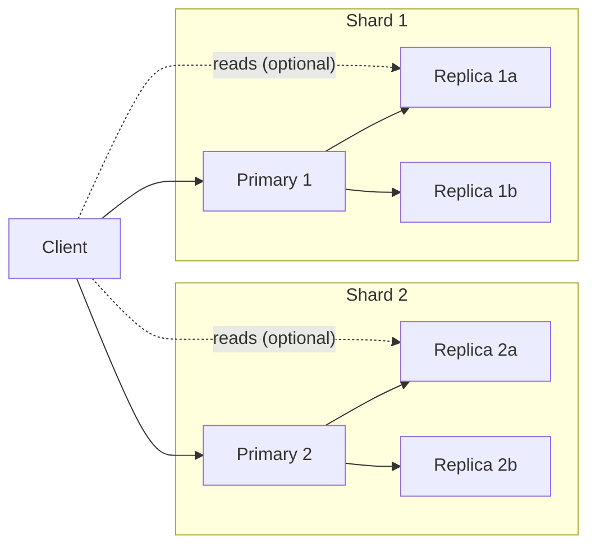
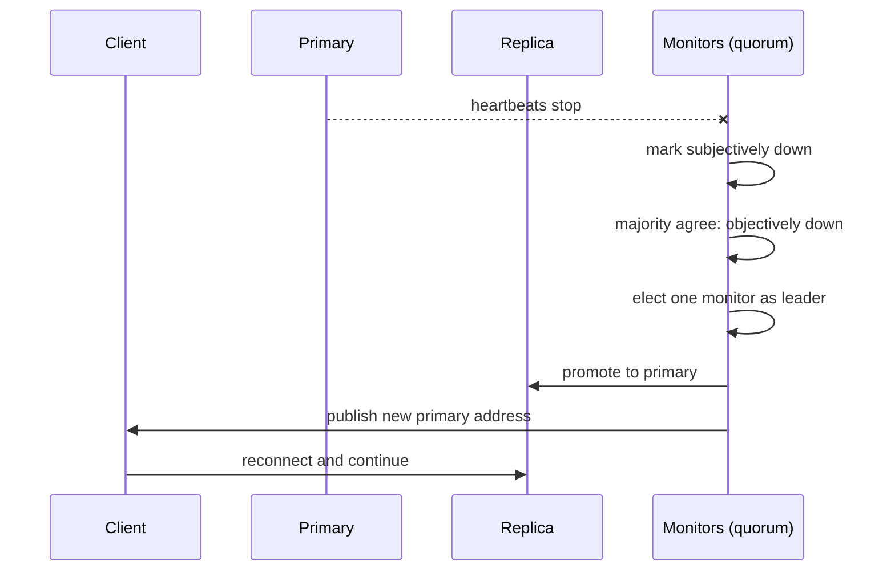

# Replication, failover and routing topologies

## Learning objectives

After this lesson you should be able to:

- Explain why replicating a cache is different from replicating a database, and when it is worth doing.
- Compare asynchronous and synchronous replication and state what a cache can safely give up.
- Describe how failure detection, election and client redirection fit together in a failover, and estimate the time it takes.
- Explain split brain and why quorum prevents it.
- Design a replica topology (primary with replicas, replicated pools, multi-copy writes) for a given availability and read-throughput goal.
- Compute the effect of a node loss on database load, with and without replicas.

## 1. Is a cache worth replicating?

A purist might say a cache holds disposable copies, so there is nothing to replicate: if a node dies, refill it from the database. That is true for correctness and false for operations. The question is not "can I lose the data?" but "can the database survive the refill?"

Take a cluster of 10 nodes serving 500,000 reads per second at a 98% hit ratio. The database sees 2% of that, 10,000 reads per second, and let us say it is provisioned for 25,000. One node fails. Its 10% of keys now miss: the miss ratio becomes `0.02 + 0.10 * 0.98 = 0.118`, so the database sees `0.118 * 500,000 = 59,000` reads per second. That is 2.4 times what it can serve. A routine hardware failure has become an overload. Note that the 10-node cluster _looked_ generously safe; it is only the loss that reveals the true dependency. The chapter on learning from caching incidents calls this the cache as a load-bearing dependency.

If the cache had one replica per primary and failover took a few seconds, the database would see almost no extra load, because the replica already holds the data. Replication in a cache is therefore a _load-protection_ mechanism, not a durability mechanism. That framing guides every decision below: we care about warm copies being available quickly, not about never losing a write.

There is a second reason: read scaling. Replicas can serve reads, multiplying read throughput for hot data, at the price of staleness.

A third reason is the cost of rewarming. If your cold fill takes 30 minutes at the database's maximum safe refill rate, then 30 minutes of degraded performance per failure is the price of not replicating.

## 2. Replication models

Replication means that a write accepted by one node is also applied elsewhere. Variations differ in who accepts writes and when the writer is acknowledged.

### 2.1 Primary-replica (leader-follower)

One node (the primary, formerly master) accepts writes; one or more replicas receive a stream of those writes and apply them in order. Reads may go to the primary only, or also to replicas. Redis uses this model (see the Redis architecture lesson). It is simple and gives a single order of writes per shard, so replicas converge to the primary's state.

### 2.2 Asynchronous versus synchronous

In **asynchronous** replication the primary acknowledges the client as soon as it has applied the write locally, and ships it to replicas in the background. Latency is minimal, but there is a window in which an acknowledged write exists only on the primary. If the primary fails in that window, the write is lost when a replica is promoted. In **synchronous** replication the primary waits for one or more replicas to confirm before acknowledging. No acknowledged write is lost on a single failure, but every write pays a network round trip (typically hundreds of microseconds within a data center, tens to hundreds of milliseconds across regions) and a slow or dead replica can stall writes.

For a cache the default is asynchronous. The data is derivable. The lost-write window loses at most a few cached values, which the next miss repopulates. However there is an important caveat: if your "cache" is also being used as a primary store for something (sessions, rate-limit counters, feature flags, job queues), the lost-write window is real data loss. Decide per use case. Some systems provide an opt-in wait-for-replicas command (Redis has `WAIT`, which blocks until a number of replicas acknowledge the preceding writes), but this narrows rather than eliminates the window, because it does not make the system fully linearizable if failover can still promote a replica that has not caught up. State that carefully when you design with it.

### 2.3 Replicated pools (multi-copy writes)

Memcached has no built-in replication. Systems that need copies replicate at the client or proxy: the proxy writes each key to two or three pools, reads from one, and falls back to the others on a miss or failure. Facebook's mcrouter, for example, supports routing policies of this kind, which is how large Memcached deployments obtain availability from servers that know nothing about each other. The key difference from primary-replica is that there is no single order of writes. Two concurrent writers can apply their updates in different orders on different copies, so the copies can diverge and stay diverged until TTL expiry. Deletes (invalidations) are especially delicate: if a delete reaches copy A but is lost on copy B, B serves a stale value indefinitely. Pair multi-copy designs with short TTLs, and design invalidation as delete-all-copies with retry.

### 2.4 Multi-primary

Allowing writes at several nodes needs conflict resolution (last-writer-wins by timestamp, version vectors, CRDTs). Some managed caches offer this across regions. It is powerful and complex; we discuss cross-region trade-offs in the multi-region lesson. For a single-region cache, avoid it unless you have a strong reason.

## 3. Topologies

The common production shape is N shards, each a small replication group of one primary and one to two replicas, spread over different failure domains (racks, availability zones). Placing the primary and its replica in the same rack or zone defeats the purpose, since a single power or network event removes both. A typical rule is "no two members of a group in the same zone".

Sizing the replica count: one replica per primary gives you tolerance of one failure and doubles RAM cost. Two replicas tolerate two failures and let you lose a zone and still have a spare. Each additional replica adds replication traffic from the primary (the primary must send each write to every replica, so 3 replicas means 3 times the outbound write bandwidth) and RAM cost. For many caches, one replica per primary across zones is the sweet spot.

### Reading from replicas

Reading from replicas scales read throughput but exposes staleness. Replication lag is usually small (milliseconds) but unbounded in principle: a replica doing a full resynchronisation, a slow network, or a heavy write burst can lag by seconds or more. Anomalies:

- **Read-your-writes violation.** A user updates their profile (write to primary, cache entry deleted or updated), reload reads a replica that has not yet received the change, and sees the old profile.
- **Monotonic read violation.** Two successive reads go to different replicas with different lag, and the user sees data go backwards in time.

Mitigations: send a user's reads to the primary for a short window after their write; pin a session to one replica; or accept the staleness for data where it is harmless (a view count).

## 4. Failure detection and failover

When a primary dies, someone must (a) notice, (b) decide on a replacement, (c) promote it, and (d) tell clients. Each step takes time and each step can go wrong.

### 4.1 Detection

Detection is usually by heartbeat or ping with a timeout. A short timeout reacts quickly but causes false positives: a long garbage collection pause, a CPU stall, a network blip or a heavy command can look exactly like death. A long timeout avoids flapping but extends the outage. Typical configured timeouts are in the seconds to tens of seconds range; the right value depends on how bad a false failover is compared with a slow one. For caches a false failover is usually cheap (data is derivable) but not free: promoting a lagging replica loses recent writes, and the new topology causes a burst of reconnects and, in some systems, full resynchronisation of the remaining replicas against the new primary.

Monitors use a two-level concept. One monitor can think a node is down ("subjectively down", in Redis Sentinel's terms) because of its own network trouble. Only when a configured number of monitors, the **quorum**, agree is the node considered down for purposes of failover. This protects against a single monitor's bad network view.

### 4.2 Election and promotion

Once a primary is declared failed, one entity must be chosen to carry out the failover so that two monitors do not each promote a different replica. This is a leader election among the monitors, usually requiring a **majority** of all monitors (not just of those that agree) to authorise it. Then a replica is selected. Typical criteria: replicas with a recent connection to the old primary, higher configured priority, and the largest replication offset (that is, the one that has applied the most of the old primary's write stream, losing the least data).

### 4.3 Informing clients

Clients need the new address. Options are: ask the monitors on connection failure ("who is the primary for shard X?"); a virtual IP or DNS name that is repointed (subject to DNS TTLs and client-side DNS caching, which can add tens of seconds if you are not careful); or topology gossip through the cache servers themselves (Redis Cluster). A proxy hides the change from application clients entirely.

### 4.4 Worked timeline

Assume a 5 second detection timeout, a monitor agreement and election step of about 1 second, promotion and replica reconfiguration of about 1 second, and clients that refresh topology on error within 1 second. Total unavailability for that shard is about 8 seconds. With 10 shards, 10% of keys are affected for 8 seconds. If the cluster serves 500,000 reads per second at 98% hit ratio, the shard's reads are 50,000 per second. For 8 seconds they miss: that is `50,000 * 0.98 = 49,000` extra database reads per second for 8 seconds, plus possibly the replica's data being slightly stale. Compare this with the no-replica case where those misses last until the new node refills, minutes to hours. This is why replication reduces the recovery from "refill duration" to "detection duration".

Clients can soften the 8 seconds. Using a **circuit breaker** around the cache node lets requests fail fast and go to the database (or to a degraded response) instead of waiting on a connect timeout of several seconds, which would otherwise pile up threads. Using a short client timeout (tens of milliseconds for a cache read) is crucial: a hung cache node that accepts connections but does not answer causes thread pool exhaustion in the application, which is a worse failure than a clean miss.

## 5. Split brain, quorum and fencing

Suppose a network partition isolates the old primary from the monitors but not from some clients. The monitors promote a replica. Now there are two primaries, each accepting writes from the clients that reach them: **split brain**. When the partition heals, one side's writes must be discarded or merged. In an asynchronous system there is no way to merge automatically; the old primary is demoted and resynchronises from the new one, discarding its divergent writes.

Quorum limits damage. A common safeguard is for a primary to stop accepting writes if it cannot reach a minimum number of replicas (Redis offers configuration for this: `min-replicas-to-write` and `min-replicas-max-lag`; check the documentation of your version for exact names and behaviour). An isolated primary with no reachable replicas then refuses writes after a short delay, so the divergence window is bounded by that delay. The cost is lost write availability for the isolated side, which for a cache usually means those writes just fail and the application reads from the database.

For caches, a more pragmatic view applies: a few seconds of split brain loses some cached writes, and the cached values are derivable. The risky case is split brain for data you are treating as primary (locks, counters, queues). Never use a plain asynchronously replicated cache for distributed locks that protect correctness; the lock service is the wrong place to trade away mutual exclusion. This is a well-known debate in the Redis community about lock algorithms spanning multiple independent instances; for a safety-critical lock use a consensus-based system.

## 6. Warm replica, cold replica, and resynchronisation cost

When a replica is added or reconnects, it must obtain the primary's state. There are two mechanisms in general:

- **Full sync (snapshot transfer).** The primary produces a snapshot of its entire dataset and ships it, then streams the writes that arrived in the meantime. This is expensive: it uses CPU and memory on the primary (in Redis, a fork and copy-on-write; see the Redis lesson), network bandwidth proportional to dataset size, and time proportional to size. A 40 GB dataset over a 1 Gbit/s link (about 125 MB/s) needs roughly `40,000 / 125 = 320` seconds just for the transfer, more than five minutes, ignoring loading time on the replica.
- **Partial sync (incremental catch-up).** If the replica was disconnected briefly, the primary can send only the writes it missed, provided it still has them in a bounded buffer (Redis calls this the replication backlog). Size the backlog to cover the longest disconnection you want to bridge. If the write rate is 20 MB/s and you want to bridge a 60 second blip, the backlog must hold `20 * 60 = 1,200` MB.

A classic failure: a primary is under load, a replica falls behind or disconnects, a full sync starts, the fork and snapshot slow the primary further, other replicas also fall behind and need full syncs, and the whole group enters a resynchronisation storm. Avoid it with generous backlog sizing, with limits on the replication output buffer so a slow replica cannot consume unbounded primary memory (it will be disconnected instead), and with staggered restarts.

## 7. Replication versus other availability techniques

- **Client fallback to database.** Free, but see the arithmetic: the database must absorb the miss burst. Combine with request coalescing (single-flight) and rate limiting.
- **Two-level caching.** A small in-process cache (L1) in front of the distributed cache (L2) absorbs part of the load when L2 is degraded and reduces L2 traffic in normal operation. It also introduces its own staleness; TTLs of a few seconds are common.
- **Over-provisioning.** Sizing N+1 means the cluster can absorb one node's load. It does not address warm data being lost, only the CPU and network that one fewer node means.
- **Gutter pools.** Facebook's Memcached deployment described a small separate "gutter" pool that takes over the traffic of a failed server for a short period, with short TTLs, so that a failed node's traffic is not sent straight to the database. The idea is that you do not restore the full data set; you merely shield the database for the duration of the outage. This is a pragmatic alternative to full replication when memory cost is the constraint. (See the separate case studies for the source material; do not rely on the details here as a citation.)

## 8. Putting numbers on the decision

Suppose your database can handle 25,000 reads per second and normal miss traffic is 10,000 per second. Headroom is 15,000. If a node's loss sends `a` extra reads per second to the database, you need `a <= 15,000` for the loss to be survivable. With 500,000 total reads per second, 98% hit ratio and S shards, a lost shard adds `(500,000 / S) * 0.98` reads per second:

| Shards S | Extra DB reads per second on one shard loss | Within 15,000 headroom? |
| -------- | ------------------------------------------- | ----------------------- |
| 5        | 98,000                                      | no                      |
| 10       | 49,000                                      | no                      |
| 20       | 24,500                                      | no                      |
| 40       | 12,250                                      | yes                     |

Doubling the shard count roughly halves the blast radius. So you have two levers: more, smaller shards (each failure matters less) and replication (the failure matters almost not at all). Smaller shards cost operational complexity; replication costs RAM. Many teams use both.

## 9. Common pitfalls

- **Same failure domain for primary and replica.** Spread across racks or zones.
- **Treating replicas as free read capacity without considering staleness.** Specify which reads tolerate it.
- **Fast detection without a quorum.** Single-observer failure detection flaps and produces needless failovers.
- **Using the cache for locks or counters that need correctness.** Asynchronous replication loses acknowledged writes on failover.
- **No client timeouts.** A hung cache node can drain the application's threads; always set connect and read timeouts, and use circuit breakers.
- **Under-sized replication backlog.** Brief disconnects trigger full syncs, which trigger further disconnects.
- **DNS-based failover with long caching.** Clients keep dialling the dead address.
- **Forgetting that promotion loses the async tail.** After failover, run invalidation checks for keys written just before the failure if stale data matters.

## 10. Check your understanding

1. Why is replication in a cache mainly a load-protection mechanism rather than a durability mechanism? Illustrate with a calculation.
2. What is the data-loss window in asynchronous replication, and what do you lose if the primary fails in it? Why is this usually acceptable for a cache but not always?
3. Explain the difference between "subjectively down" and "objectively down" in a quorum-based failure detector and why both exist.
4. What is split brain, and how does requiring a minimum number of reachable replicas limit the damage?
5. A primary holds 24 GB and a replica reconnects after a long disconnection requiring a full sync over a 1 Gbit/s link. Estimate the transfer time and name two hazards of full syncs under load.
6. Compare multi-copy writes through a proxy with primary-replica replication. What consistency problem does the former have that the latter does not?

## 11. Answers

1. Because the data can be refilled from the source of truth; the danger of losing a node is the miss burst hitting the database. With 10 shards, 500,000 reads per second and a 98% hit ratio, losing one shard raises database reads from 10,000 to about 59,000 per second. A warm replica avoids that.
2. It is the time between the primary acknowledging a write and the replicas receiving it. If the primary fails then, that write is lost on promotion. Cached values are derivable so the next miss refills them, but if the cache holds sessions, counters or locks that exist nowhere else, the loss is real.
3. A single monitor may see a node as down because of its own network trouble (subjectively down). The node is only treated as failed (objectively down) when a quorum of monitors agree, which prevents one monitor's local problem from triggering a failover.
4. Split brain means two nodes both act as primary after a partition and both accept writes, so they diverge. If a primary refuses writes when fewer than a minimum number of replicas are reachable, an isolated old primary stops accepting writes soon after losing contact, bounding the divergent writes.
5. 24 GB is about 24,000 MB; at roughly 125 MB/s that is about 192 seconds, over three minutes, ignoring replica load time. Hazards: CPU, memory and I/O pressure on the primary (snapshot/fork) that can slow it further and cause other replicas to lag, and a resynchronisation storm.
6. Multi-copy writes have no single write order, so concurrent updates or lost deletes can leave copies different from each other (and stale) until TTL expiry. Primary-replica has one ordered write stream, so replicas converge to the primary.

## 12. Summary

Replicating a cache protects the database from the miss burst that a node loss would cause, supplies read scaling, and shortens recovery from the time to refill to the time to detect and promote. Asynchronous replication is the normal choice, trading a small window of lost writes for low latency. A failover chains detection, quorum agreement, election, promotion and client redirection; each step has a timeout to tune and a failure mode to guard against, notably false positives and split brain. Resynchronisation after disconnects is a hidden source of load, so replication backlogs and output buffers deserve explicit sizing. Smaller shards, replication, gutter-style shields and client circuit breakers are complementary tools. The next lesson looks at how Memcached and Redis, the two most widely deployed caches, are actually built, and how those designs shape the topologies we have discussed.
