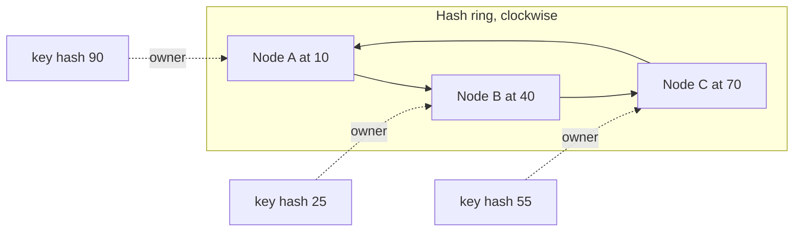
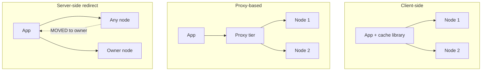

# Sharding keys across cache nodes

## Learning objectives

After this lesson you should be able to:

- Explain why a single cache node eventually stops being enough, and name the three resources (memory, CPU/network, availability) that force you to distribute.
- Compute, with arithmetic, how many keys move when a cluster using `hash(key) mod N` changes size.
- Describe consistent hashing, why virtual nodes are needed, and estimate the load imbalance a given number of virtual nodes produces.
- Describe rendezvous (highest-random-weight) hashing and compare it with a hash ring.
- Compare client-side routing, proxy-based routing and server-side redirection, and choose among them.
- Recognise the failure modes that sharding itself introduces: hot shards, cold-start after resizing, and routing disagreement.

## 1. Why distribute at all?

A single cache server is an attractive thing. It has one address, one set of metrics, one failure domain, and no routing logic. Most systems should start with one and stay there as long as it is adequate. The question is what makes it inadequate. There are three distinct pressures, and it matters to separate them because they lead to different designs.

**Capacity.** The working set may not fit in one machine's RAM. If your hot data is 600 GB and the largest instance you are willing to operate has 256 GB of usable memory, you must spread the data. This is partitioning (also called sharding): every key lives on exactly one shard, and the shards together hold the whole data set.

**Throughput.** Even if the data fits, one node has finite CPU and network bandwidth. A single node can only serve so many operations per second and so many bytes per second. If your peak is two million reads per second and one node tops out at a few hundred thousand, you need more nodes. Partitioning helps here too, because each shard serves only its share of keys. But note that partitioning does not help if the load is concentrated on a few keys; that is the hot key problem, covered in its own chapter, and we will see how sharding interacts with it in Section 8.

**Availability.** A single node is a single point of failure. When it dies, every request becomes a miss and falls through to the database. We will see in the chapter on learning from caching incidents that this is rarely survivable at scale. Spreading the data over many nodes bounds the blast radius of one failure to a fraction of the data. Replication, covered in the next lesson, is the complementary tool.

Notice that the first two pressures are solved by _partitioning_ and the third by _replication_. Real deployments use both. This lesson is about partitioning: given a key and a set of nodes, which node owns the key, and how does that answer change when the set of nodes changes?

## 2. The routing problem

Formally we need a function `owner(key, nodes) -> node`. A good function has these properties:

1. **Deterministic and shared.** Every client (or proxy) that asks must get the same answer, with no coordination on the read path. If two clients disagree, one writes a key to node A and the other looks for it on node B, and you get permanent spurious misses and, worse, stale copies.
2. **Balanced.** Each node should own roughly `1/N` of the keys and, ideally, of the traffic.
3. **Minimally disruptive.** When a node is added or removed, as few keys as possible should change owner. In a cache, a key that changes owner is not lost data (the database still has it), but it is a guaranteed miss on its new owner, and a burst of misses is a burst of database load.
4. **Cheap.** The function runs on every request, so it should be fast and use little memory.

Different schemes trade these properties against each other. We examine three: modulo hashing, consistent hashing, and rendezvous hashing. Then we look at a fourth approach, fixed hash slots, which Redis Cluster uses and which we treat in the Redis lesson.

## 3. Modulo hashing and why it breaks

The simplest function is `owner = nodes[hash(key) mod N]`. It is perfectly balanced if the hash is uniform, it is O(1), and it needs no data structure beyond the node list. Many first implementations use it.

The trouble appears when N changes. Suppose `h = hash(key)` is a large uniform integer. A key stays on the same node only if `h mod N == h mod (N+1)`.

Let us count how often that happens by working over one full cycle of residues, whose length is lcm(N, N+1) = N(N+1). Rather than trust a general rule, we verify it on a concrete case.

Take N = 4, growing to N = 5. The cycle length is lcm(4, 5) = 20. We list `h`, `h mod 4`, `h mod 5`:

| h   | mod 4 | mod 5 | same? |
| --- | ----- | ----- | ----- |
| 0   | 0     | 0     | yes   |
| 1   | 1     | 1     | yes   |
| 2   | 2     | 2     | yes   |
| 3   | 3     | 3     | yes   |
| 4   | 0     | 4     | no    |
| 5   | 1     | 0     | no    |
| 6   | 2     | 1     | no    |
| 7   | 3     | 2     | no    |
| 8   | 0     | 3     | no    |
| 9   | 1     | 4     | no    |
| 10  | 2     | 0     | no    |
| 11  | 3     | 1     | no    |
| 12  | 0     | 2     | no    |
| 13  | 1     | 3     | no    |
| 14  | 2     | 4     | no    |
| 15  | 3     | 0     | no    |
| 16  | 0     | 1     | no    |
| 17  | 1     | 2     | no    |
| 18  | 2     | 3     | no    |
| 19  | 3     | 4     | no    |

Only 4 of 20 residues agree. So 20% of keys stay and **80% of keys move** when you add the fifth node. In general the fraction that stays is `N / (N(N+1)) = 1/(N+1)`, and the fraction that moves is `N/(N+1)`. Going from 9 to 10 nodes moves 90% of keys. The bigger the cluster, the worse a one-node change is. Removing a node (a crash) is the same arithmetic in reverse: from 5 to 4 nodes, 80% of keys change owner even though only one node vanished.

Now put numbers on the consequence. Suppose a cluster of 4 nodes serves 100,000 requests per second with a 95% hit ratio, so the database sees 5,000 reads per second. You add a fifth node to handle growth. Immediately, 80% of the cached keys are on the "wrong" node and every request for them misses. If the working set is uniformly accessed, the hit ratio collapses from 95% to roughly `0.95 * 0.20 = 19%` on the first requests (plus whatever the new node and the retained 20% provide). The database now sees about 81,000 reads per second instead of 5,000, a sixteen-fold increase, precisely when you were trying to improve things. Many a "scale-up" has caused an outage this way. The resulting stampede pattern is analysed in the chapter on stampedes.

Mod-N is fine only when the node set is fixed for the life of the data, for example when you pre-split into a large, fixed number of logical partitions (which is the idea we return to with hash slots). It is not fine when physical nodes come and go.

## 4. Consistent hashing

Consistent hashing was introduced in a 1997 paper by Karger and colleagues at MIT, motivated by exactly this web-caching problem. The idea is to stop tying the owner to `N` and instead tie it to _positions on a circle_.

### 4.1 The ring

Map the output space of a hash function, for example 0 to 2^32 - 1, onto a circle. Hash each node's identifier (say `"cache-3:11211"`) to place the node at a point on the circle. To find the owner of a key, hash the key to a point and walk clockwise until you meet a node; that node owns the key.



In the figure, a key at position 25 walks clockwise to B at 40. A key at 55 walks to C at 70. A key at 90 wraps around past the top of the circle to A at 10 (positions are on a 0 to 100 scale for readability).

### 4.2 Key movement when nodes change

Add a node D at position 55. Only the keys between B (40) and D (55) change owner; they move from C to D. Every other key is unaffected. If you remove C instead, only C's keys move, and they go to the next node clockwise, which is A (via the wrap) or D if present.

In expectation, adding the (N+1)th node moves `1/(N+1)` of the keys, and all of them move _to_ the new node. Compare with mod-N, where the moved fraction was `N/(N+1)`. For N = 4 growing to 5:

- mod-N moves 80% of keys.
- consistent hashing moves about 20% of keys, which is the theoretical minimum, since the new node must take a fair share.

That is a four-fold improvement here and a ten-fold improvement from 9 to 10 nodes (90% versus about 10%).

Redo the earlier database arithmetic. A 20% movement with a 95% hit ratio means roughly 20% of requests initially miss on top of the baseline. Misses become roughly `0.05 + 0.20 * 0.95 = 0.24`, or 24% of 100,000 = 24,000 reads per second on the database, versus 81,000 for mod-N. It is still a bump (almost five times baseline), which is why you add nodes gradually and warm them, but it is survivable where mod-N might not be.

### 4.3 The balance problem

With only one point per node, the arcs between nodes are random. If you throw N points at random on a circle, the largest arc is about `ln(N)/N` of the circle, not `1/N`. For N = 10, `ln 10 = 2.3`, so the biggest arc is typically around 23% of the circle against a fair share of 10%, more than twice the average. That node holds more than twice its fair share of keys and receives more than twice the traffic, and may run out of memory first. Removing a node also dumps its entire arc onto a single neighbour, doubling that neighbour's load, which can cascade.

### 4.4 Virtual nodes

The standard fix is to give each physical node many points on the ring, called virtual nodes or vnodes. A node hashes `"cache-3:11211#0"`, `"cache-3:11211#1"`, and so on, up to V points. The ring now has `N*V` points, and a node owns the union of many small arcs.

Two benefits follow:

1. **Smoother balance.** The load on a node is the sum of V small random arcs. By the law of large numbers the relative standard deviation falls roughly as `1/sqrt(V)`. With V = 100, the relative spread is on the order of 10%; with V = 1000, about 3%. These are rules of thumb that assume independent uniform placement; real measurements vary, but the trend is reliable.
2. **Distributed failure impact.** When a node is removed, its many small arcs each go to a different neighbour, so the extra load spreads over all survivors rather than landing on one. Removing one of 10 equal nodes adds about 1/9 (11%) to each survivor's share instead of 100% to one.

Vnodes also let you weight heterogeneous machines: a node with twice the RAM gets twice as many vnodes.

The costs are memory for the ring (N*V entries, kept sorted, looked up by binary search in O(log(N*V))) and slower ring construction. With N = 50 and V = 200 that is only 10,000 entries, trivial. The well known Memcached client convention called ketama uses this approach (many points per server, derived from an MD5-based hash). Treat ketama as one popular implementation of the idea; compatibility between clients depends on using the same point-derivation recipe, which is why mixed-language fleets sometimes disagree on key placement.

### 4.5 A compact implementation

```java
import java.util.*;
import java.nio.charset.StandardCharsets;
import java.security.MessageDigest;

final class HashRing {
    private final TreeMap<Long, String> ring = new TreeMap<>();
    private final int vnodes;

    HashRing(Collection<String> nodes, int vnodes) {
        this.vnodes = vnodes;
        nodes.forEach(this::add);
    }

    void add(String node) {
        for (int i = 0; i < vnodes; i++) ring.put(hash(node + "#" + i), node);
    }

    void remove(String node) {
        for (int i = 0; i < vnodes; i++) ring.remove(hash(node + "#" + i));
    }

    String owner(String key) {
        Map.Entry<Long, String> e = ring.ceilingEntry(hash(key));
        return (e != null ? e : ring.firstEntry()).getValue(); // wrap around
    }

    private static long hash(String s) {
        try {
            byte[] d = MessageDigest.getInstance("MD5").digest(s.getBytes(StandardCharsets.UTF_8));
            long h = 0;
            for (int i = 0; i < 8; i++) h = (h << 8) | (d[i] & 0xff);
            return h >>> 1; // keep it non-negative
        } catch (Exception ex) { throw new RuntimeException(ex); }
    }
}
```

The `ceilingEntry` call is the clockwise walk, and the `firstEntry` fallback is the wrap-around. Production clients use a faster non-cryptographic hash, but the structure is the same.

## 5. Rendezvous (highest random weight) hashing

Rendezvous hashing, from Thaler and Ravishankar in the late 1990s, reaches the same goal with no ring. For each key, compute a score for every node, `score(key, node) = hash(key, node)`, and pick the node with the highest score.

```cpp
std::string owner(const std::string& key, const std::vector<std::string>& nodes) {
    uint64_t best = 0; const std::string* winner = nullptr;
    for (const auto& n : nodes) {
        uint64_t s = std::hash<std::string>{}(key + "|" + n);   // stand-in for a good 64-bit hash
        if (!winner || s > best) { best = s; winner = &n; }
    }
    return *winner;
}
```

Why does it move few keys? Remove node X. A key that did not have X as its winner still has the same winner, because the other scores are unchanged and X was not the maximum. Only keys whose winner was X are re-evaluated, and each of them moves to its second-highest scorer. Those second-place nodes are effectively random, so X's load spreads evenly over the survivors, like vnodes but with no extra tuning. Add a node: a key moves only if the new node's score beats the old winner, which happens with probability `1/(N+1)`. Same minimal movement as the ring.

Properties compared with the ring:

- **Balance** is excellent without any virtual-node parameter, since every key is an independent random draw over nodes.
- **Lookup cost** is O(N) hash computations per key, against O(log(N*V)) for the ring. For N up to a few dozen this is negligible; for hundreds of nodes you may need a hierarchical variant.
- **Simplicity.** There is no data structure to build, replicate or keep in sync, only the node list.
- **Replica selection** is natural: take the top two or three scorers as primary and replicas.

A worked example with three nodes and invented scores: key `k1` scores A=0.31, B=0.92, C=0.55, so B owns it, with C as the first replica. If B dies, `k1` goes to C. Keys that had A or C as winner are untouched.

## 6. Hash slots: a fixed intermediate layer

A third approach inserts a level of indirection. Choose a fixed number of logical partitions, `S` slots (Redis Cluster uses 16384), and compute `slot = hash(key) mod S`. Then keep an explicit table mapping each slot to a node. The mod-S step never changes, so keys never move between slots. Rebalancing means reassigning whole slots from one node to another, and this can be done a few slots at a time, copying their data, with the table updated at the end.

The advantage is control. You decide exactly which slots move and when, can throttle migration, and can resize in small steps. The disadvantage is that the slot table is state that must be distributed consistently; clients need to learn it and learn about changes. We cover this in detail in the Redis lesson.

Numerically, with 16384 slots on 4 nodes each node owns 4096 slots. Adding a fifth node means the new node should own `16384/5 = 3276.8`, about 3277 slots, taken evenly from the four existing nodes: each gives up about 205 slots (`4096 - 3277 = 819` total moved from 4 donors, about 205 each). The fraction of keys that moves is 3277/16384, about 20%, matching the consistent hashing minimum.

## 7. Where does routing run? Three architectures

Whichever function you choose, something must evaluate it. There are three common places.



**Client-side routing.** The application's cache library holds the node list and the ring (or slot table) and connects directly to the right node. This is the Memcached tradition. Advantages: no extra hop, no extra component, best latency, and no proxy to scale. Disadvantages: every client language needs a correct, compatible implementation; the node list must reach every client, and clients can hold stale or different lists during changes; connection counts multiply (every app instance connects to every cache node, so 2,000 app instances and 50 nodes is 100,000 connections); and changing policy means redeploying clients.

**Proxy-based routing.** Clients talk to a proxy that routes. Twemproxy (from Twitter) and Envoy's Redis and Memcached filters, plus Facebook's mcrouter for Memcached, are examples of this style. Advantages: thin clients that speak the ordinary protocol, central place for routing, connection pooling (the proxy keeps few long connections to servers), and room to add features such as replicated writes, failover, shadow traffic for warming new nodes, and rate limiting. Disadvantages: an extra network hop (typically hundreds of microseconds within a data center, order of magnitude), another tier to size, deploy and keep available, and the proxy itself can become a bottleneck or failure domain.

**Server-side redirection.** The client contacts any node. If the node does not own the key it answers with a redirect, and a smart client caches the topology to avoid it. Redis Cluster works this way (`MOVED` and `ASK` replies). Advantages: no separate routing tier and the servers are the source of truth for topology. Disadvantages: clients still need cluster awareness to be efficient, and multi-key operations are constrained, since keys in one command must live on one node.

Many large deployments combine them: a client talks to a local or regional proxy that applies the ring.

## 8. Multi-key operations, hash tags and hot shards

Sharding makes operations that touch several keys harder. A `MGET` of 100 keys scattered over 20 nodes becomes up to 20 parallel requests, and your latency is that of the slowest (tail latency amplification). A transaction or Lua script touching two keys on different nodes cannot be atomic across nodes. Redis Cluster addresses this by letting you force related keys into one slot with a _hash tag_: only the substring inside `{...}` is hashed, so `{user:42}:profile` and `{user:42}:cart` land together. The price is that you have deliberately created a bigger unit that cannot be split. A tag that groups all of a huge tenant's keys creates a hot shard.

Sharding spreads _keys_, not _load_. If one key receives 30% of traffic, whichever node owns it carries at least 30% of the cluster's requests no matter how many nodes you add. Remedies, covered in the hot key chapter, include replicating that key across several nodes (read from a random replica), adding a small in-process cache in front, and splitting the key into suffixed copies (`key#0` to `key#7`) chosen randomly on read. Remember that consistent hashing balances the number of keys, not the heat of keys.

## 9. Operational practice for resizing

A sensible resize procedure for a client-side ring:

1. Deploy the new node list to a small canary population of clients first. Note that during rollout different clients disagree about ownership; this causes extra misses and possibly stale reads (a client with the new list may write a value that a client with the old list never sees, and vice versa). Short TTLs bound the damage; if you cannot tolerate it, use a proxy where the change is atomic for all clients.
2. Add one node at a time, and wait for the hit ratio and database load to recover before the next.
3. Pre-warm if you can: a proxy can mirror writes or reads to the new node before it becomes the owner.
4. For removals, prefer draining (a proxy sends reads to both old and new placement) over abruptly cutting traffic.

Also be aware of a subtle issue with consistent hashing and writes: after a node is added, keys it now owns may still exist, stale, on the old owner. If the node is later removed or the ring reverts, the old owner's copy becomes visible again and may be old. TTLs and versioned keys protect against this; so does simply flushing nodes that leave the ring.

## 10. Common pitfalls

- **Using mod-N with a changing node set.** The 80% key movement figure is the reason this is a classic outage cause. Use a ring, rendezvous hashing or slots.
- **Too few virtual nodes.** With V = 1 to 10 you can see two-to-three-fold imbalance. Use at least the low hundreds unless you have measured otherwise.
- **Inconsistent hashing across clients.** A Java service and a Python service using different hash functions or different vnode recipes will each be self-consistent and mutually blind. Share a library or a proxy.
- **Hashing the wrong thing.** Hashing a key that includes a version or timestamp prefix scatters one logical object across nodes; hashing only a tenant ID concentrates a tenant on one node.
- **Assuming balanced keys means balanced load.** Measure per-node request rate and bytes, not only key counts.
- **Letting node identity change.** If a node is identified by IP and an autoscaler gives it a new IP after restart, the ring changes even though the machine is "the same". Use stable names.
- **Ignoring connection fan-out.** Client-side routing multiplies connections; budget for it.

## 11. Check your understanding

1. A cache cluster uses `hash(key) mod N`. Derive the fraction of keys that keep their owner when N goes from 6 to 7. What fraction moves?
2. Why does a consistent hash ring with one point per node produce uneven load, and how do virtual nodes fix it? Roughly how does the relative standard deviation of load scale with the number of virtual nodes per server?
3. Describe rendezvous hashing. When a node is removed, which keys move and where do they go? What is its main cost compared with a ring?
4. Your cache cluster has 8 nodes and one product page receives 25% of all reads. Does adding 8 more nodes with consistent hashing fix the overload on the owner of that key? Explain and propose two mitigations.
5. List two advantages and two disadvantages of proxy-based routing compared with client-side routing.
6. In a Redis Cluster style design with 16384 slots and 4 equal nodes, you add a fifth. Approximately how many slots does the new node receive and what fraction of keys moves?

## 12. Answers

1. A key stays only if `h mod 6 == h mod 7`. Over the cycle of 42 residues, the agreeing ones are h = 0..5, so 6 of 42 = 1/7, about 14.3%, stay. About 85.7% (6/7) move.
2. With one point per node, arc lengths are random; the largest arc is around `ln(N)/N`, much more than the fair `1/N`, so some nodes own over twice their share, and a removed node's arc lands on one neighbour. Virtual nodes give each server many small arcs; load becomes a sum of many independent pieces, so relative deviation falls roughly as `1/sqrt(V)`, and a removed node's load spreads across all survivors.
3. Each key scores every node with `hash(key, node)` and picks the highest. Removing a node moves only keys that it owned, each to its second-highest-scoring node, which spreads load evenly. The cost is O(N) hashing per lookup rather than O(log) for a ring.
4. No. The key still lives on exactly one node, which still receives 25% of cluster reads (even more as a fraction of that node's capacity if the cluster is large). Mitigations: replicate the key to several nodes and read from a random copy (suffix keys), and add a local in-process cache with a short TTL in front.
5. Advantages: thin protocol-compatible clients and central policy changes; connection pooling and failover or warming features. Disadvantages: an extra network hop adding latency; a new tier to size, deploy and keep highly available that can become a bottleneck or single point of failure.
6. 16384/5 is about 3277 slots, so the new node receives about 3277 slots (about 205 from each of the four donors) and about 20% of keys move.

## 13. Summary

A distributed cache exists because of capacity, throughput and availability limits. Partitioning decides which node owns each key. Modulo hashing is simple but moves `N/(N+1)` of keys when the node count changes, which can turn a scale-up into a database overload. Consistent hashing moves only about `1/(N+1)` of keys, and virtual nodes are needed to make its balance acceptable (spread falling roughly as `1/sqrt(V)`). Rendezvous hashing gives the same minimal movement and natural balance at the cost of O(N) lookups. Fixed hash slots add an explicit table that allows controlled, incremental rebalancing. Routing can live in the client, in a proxy tier or in the servers, each with distinct trade-offs in latency, operability and consistency of view. Whatever you choose, remember that sharding balances keys rather than heat: hot keys, multi-key operations and mid-rollout disagreement between clients remain your responsibility. The next lesson turns to replication and failover, which provide the availability that partitioning alone cannot.
