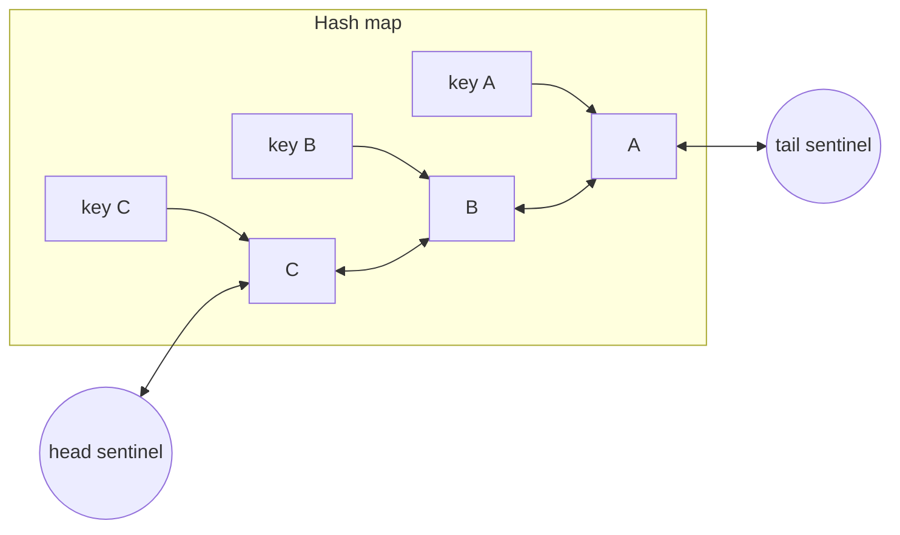
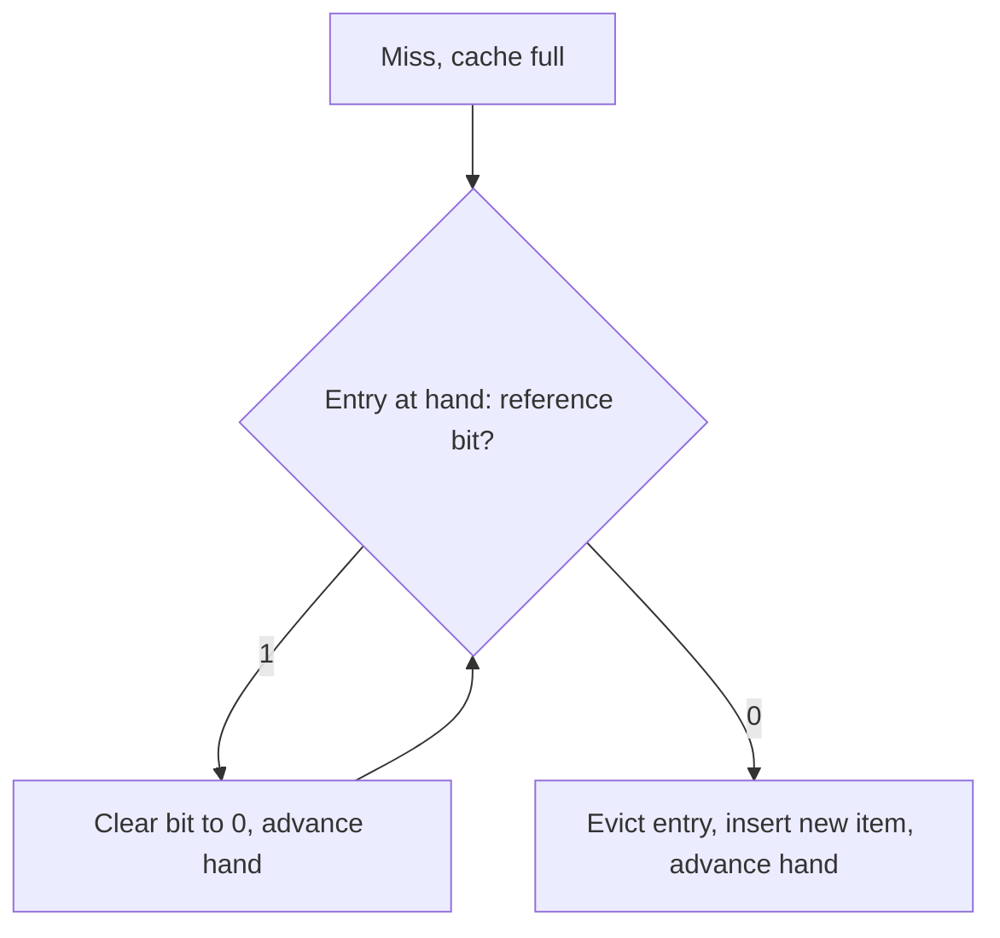

# Classic policies: FIFO, LRU, LFU, CLOCK and implementing LRU in O(1)

## Learning objectives

After studying this lesson you should be able to:

- Describe FIFO, random, LRU, LFU, CLOCK and second-chance, and state the assumption about the workload that each one makes.
- Simulate each policy by hand on a short trace.
- Explain the failure modes of each: scan pollution (LRU), frequency staleness and cache pollution by old popularity (LFU), and Belady's anomaly (FIFO).
- Implement an LRU cache with O(1) get and put using a hash map and a doubly linked list, in Java and C++, and discuss the design choices, including sentinel nodes and what to store in nodes.
- Explain how LFU can be made O(1) and why aging or decay is needed.
- Discuss why exact LRU is awkward under concurrency and how CLOCK, sampled LRU and buffered-access designs address it.

## 1. What every classical policy is trying to estimate

An eviction policy tries to guess, for each cached item, how soon it will be used again. The optimal policy (Belady's MIN, from the previous lesson) knows the answer; practical policies use evidence from the past as a proxy. Two kinds of evidence dominate:

- **Recency**: how long ago was the item last used? Items used recently are likely to be used soon (temporal locality).
- **Frequency**: how many times has the item been used? Popular items will probably be used again.

Everything in this lesson, and most of what follows in the chapter, is a different way of combining these two signals and of paying for the bookkeeping they require. Pure **insertion order** (FIFO) is a third, weaker signal, and pure **randomness** is the no-information baseline.

Each policy has a data-structure cost. In a cache that serves millions of operations per second, the cost of updating metadata on every hit is not a detail: it determines whether the policy is usable.

## 2. FIFO and random

**FIFO (first in, first out)** evicts the item that has been in the cache the longest, regardless of how often or how recently it was used. Implementation: a queue. On a miss, enqueue the new item at the tail and, if over capacity, dequeue from the head. A hit does nothing: no metadata update, which makes FIFO extremely cheap and trivially concurrent.

Weaknesses: it ignores usage, so a heavily used item is evicted purely because it is old; and FIFO is not a stack algorithm, so it can exhibit Belady's anomaly (the policy theory lesson showed a trace where more memory increases misses). Strengths: simplicity, cheap hits, and for some workloads (for example, objects that are used a short burst of times then never again) its quality is surprisingly close to LRU. Recent research and production experience on large key-value and object workloads has revisited FIFO-based designs with a small amount of reinsertion or a filter queue, exactly because hit-path cost matters at scale.

**Random** evicts a uniformly random item. It needs no per-item metadata (an array of items suffices). It has no pathological sequence that a policy designer can anticipate, since its behaviour does not depend on order, and for loops slightly larger than the cache it beats LRU. Its average performance on workloads with strong locality is below LRU, but not by dramatic amounts, and it is the foundation of **sampled** policies discussed in section 7.

## 3. LRU: least recently used

**LRU** evicts the item whose last use is oldest. It assumes temporal locality: the recent past predicts the near future. It is a stack algorithm, so it has the inclusion property and hit ratio never decreases when the cache grows.

### Worked example: FIFO versus LRU

Cache size k = 3, trace `A B C A D B A E B C` (10 requests). Tables show the cache after each request, with the least recently used on the left for LRU and the oldest-inserted on the left for FIFO.

FIFO:

| Request | Result         | Cache after (oldest first) |
| ------- | -------------- | -------------------------- |
| A       | miss           | A                          |
| B       | miss           | A B                        |
| C       | miss           | A B C                      |
| A       | hit            | A B C                      |
| D       | miss (evict A) | B C D                      |
| B       | hit            | B C D                      |
| A       | miss (evict B) | C D A                      |
| E       | miss (evict C) | D A E                      |
| B       | miss (evict D) | A E B                      |
| C       | miss (evict A) | E B C                      |

FIFO: 8 misses, 2 hits (hit ratio 20 percent).

LRU:

| Request | Result         | Cache after (LRU first) |
| ------- | -------------- | ----------------------- |
| A       | miss           | A                       |
| B       | miss           | A B                     |
| C       | miss           | A B C                   |
| A       | hit            | B C A                   |
| D       | miss (evict B) | C A D                   |
| B       | miss (evict C) | A D B                   |
| A       | hit            | D B A                   |
| E       | miss (evict D) | B A E                   |
| B       | hit            | A E B                   |
| C       | miss (evict A) | E B C                   |

LRU: 7 misses, 3 hits (hit ratio 30 percent). LRU wins here because item A and B are re-referenced soon after use. Note that the very first hit on A moved it to the most recent position, saving it from eviction at the time D arrived, whereas FIFO evicted A precisely because it was oldest.

### Where LRU fails: scans and loops

Suppose a cache of 1,000 entries serves a hot set of 500 items with high re-reference rates. A batch job now reads 10,000 distinct items once each (a table scan, a crawler, a backup). Each scanned item is, at the moment of insertion, the most recently used and displaces the least recently used, which is part of the hot set. After 1,000 scan requests, the whole hot set is gone, replaced by items never to be used again. The hit ratio collapses until the hot set reloads. This is **scan pollution** or **sequential flooding**. Similarly, a loop over k + 1 items yields a 0 percent hit ratio under LRU (the worst-case example in the policy theory lesson). The scan-resistant and adaptive policies lesson (2Q, ARC, LIRS) addresses precisely this.

## 4. Implementing LRU in O(1)

A naive LRU keeps a timestamp per entry and scans for the minimum on eviction: O(n) per eviction. A sorted tree or heap by timestamp gives O(log n). The classic solution gives O(1) for both `get` and `put`.

### The design

Combine two structures:

1. A **hash map** from key to node, for O(1) lookup.
2. A **doubly linked list** ordering nodes from most recently used (head) to least recently used (tail). A doubly linked list allows removing a node from the middle in O(1) when you hold a pointer to it, and the map gives you that pointer.

Operations:

- `get(key)`: look up the node in the map; if absent, miss. Otherwise unlink the node from its current position, insert it at the head, return its value. All pointer operations: O(1).
- `put(key, value)`: if present, update the value and move the node to the head. If absent, create a node, insert at head and add to the map; if size exceeds capacity, remove the tail node and delete its key from the map. Therefore each node must store its **key** as well as its value, so that evicting the tail can remove the right map entry. (A frequent bug: forgetting to store the key in the node.)



Using **sentinel nodes** for head and tail removes null checks: the real nodes are always between the sentinels, so insertion and removal code has no special cases for empty lists or end nodes. Most-recent items sit next to the head sentinel; the victim is `tail.prev`.

### Java implementation

```java
import java.util.HashMap;
import java.util.Map;

public class LruCache<K, V> {
    private static final class Node<K, V> {
        K key; V value;
        Node<K, V> prev, next;
        Node(K k, V v) { key = k; value = v; }
    }

    private final int capacity;
    private final Map<K, Node<K, V>> map = new HashMap<>();
    private final Node<K, V> head = new Node<>(null, null); // sentinel: most recent side
    private final Node<K, V> tail = new Node<>(null, null); // sentinel: least recent side

    public LruCache(int capacity) {
        this.capacity = capacity;
        head.next = tail;
        tail.prev = head;
    }

    public V get(K key) {
        Node<K, V> n = map.get(key);
        if (n == null) return null;
        unlink(n);
        pushFront(n);
        return n.value;
    }

    public void put(K key, V value) {
        Node<K, V> n = map.get(key);
        if (n != null) {
            n.value = value;
            unlink(n);
            pushFront(n);
            return;
        }
        if (map.size() == capacity) {
            Node<K, V> victim = tail.prev;
            unlink(victim);
            map.remove(victim.key);       // needs the key stored in the node
        }
        n = new Node<>(key, value);
        map.put(key, n);
        pushFront(n);
    }

    private void unlink(Node<K, V> n) {
        n.prev.next = n.next;
        n.next.prev = n.prev;
    }

    private void pushFront(Node<K, V> n) {
        n.next = head.next;
        n.prev = head;
        head.next.prev = n;
        head.next = n;
    }
}
```

In Java, `LinkedHashMap` already provides this structure. Constructing it with `accessOrder = true` makes `get` move the entry to the end, and overriding `removeEldestEntry` evicts when size exceeds capacity:

```java
class SimpleLru<K, V> extends LinkedHashMap<K, V> {
    private final int capacity;
    SimpleLru(int capacity) { super(16, 0.75f, true); this.capacity = capacity; }
    @Override protected boolean removeEldestEntry(Map.Entry<K, V> eldest) {
        return size() > capacity;
    }
}
```

This is excellent for a quick single-threaded cache but is not thread safe (wrap with `Collections.synchronizedMap` for simple use, accepting contention) and lacks features such as TTL and statistics.

### C++ implementation

```cpp
#include <list>
#include <unordered_map>
#include <optional>

template <class K, class V>
class LruCache {
    using Item = std::pair<K, V>;
    size_t cap_;
    std::list<Item> items_;                                  // front = most recent
    std::unordered_map<K, typename std::list<Item>::iterator> index_;
public:
    explicit LruCache(size_t cap) : cap_(cap) {}

    std::optional<V> get(const K& k) {
        auto it = index_.find(k);
        if (it == index_.end()) return std::nullopt;
        items_.splice(items_.begin(), items_, it->second);   // O(1) move to front
        return it->second->second;
    }

    void put(const K& k, V v) {
        auto it = index_.find(k);
        if (it != index_.end()) {
            it->second->second = std::move(v);
            items_.splice(items_.begin(), items_, it->second);
            return;
        }
        if (items_.size() == cap_) {
            index_.erase(items_.back().first);               // key stored in the list node
            items_.pop_back();
        }
        items_.emplace_front(k, std::move(v));
        index_[k] = items_.begin();
    }
};
```

`std::list::splice` moves a node without invalidating iterators, which is why the map can keep iterators.

### Design discussion

- **Memory overhead.** Each entry costs a map slot, a list node with two pointers (16 bytes on a 64-bit machine) and allocator overhead. For small values (a 4-byte integer) the metadata can dwarf the payload; high-performance caches use contiguous arrays with index-based links instead of pointers, giving better locality and less allocation.
- **Locking.** `get` mutates the list, so even reads need exclusive access. One global lock serializes all operations, a bottleneck on multi-core servers. Options: shard the cache into N segments each with its own lock and LRU list (approximate global LRU, much less contention); use read buffers that record accesses and replay them in batches under the lock (the approach used by some high-performance Java caches); or switch to CLOCK, whose hits only set a bit.
- **Cost of "exactness".** Exact global LRU order has little value if the workload is not strictly LRU-friendly; a sharded approximation typically loses only a small amount of hit ratio.
- **Size-based capacity.** With variable-size values, capacity is in bytes; evicting one tail node may not free enough, so the put loop evicts until the new entry fits.
- **TTL.** Expiry is orthogonal to LRU ordering. Expired entries can be removed lazily on access and by a periodic sweep, or with a separate time-ordered structure (a timing wheel or a priority queue).

### Worked cost comparison

For n = 1,000,000 entries and 10 million operations: scan-for-minimum eviction costs about n comparisons per eviction. If 30 percent of operations are evictions (3 million), that is 3 x 10^6 x 10^6 = 3 x 10^12 comparisons. A heap by timestamp costs about log2(10^6) ≈ 20 operations per access update and eviction: roughly 10^7 x 20 = 2 x 10^8. The hash map plus list costs a constant few pointer updates per operation: about 10^7 x (a handful) = on the order of 5 x 10^7. The O(1) version is at least an order of magnitude cheaper than the heap and about five orders cheaper than the naive scan.

## 5. LFU: least frequently used

**LFU** evicts the item with the lowest access count. It assumes popularity is stable: an item requested often in the past will be requested often in the future. Under the independent reference model (policy theory lesson) with stable probabilities, LFU approximates the optimal static policy.

### Weaknesses

1. **Frequency staleness (cache pollution by the past).** An item that was hot yesterday may hold a huge count and stay forever though it is never requested again. New items start with count 1 and are the first to be evicted, so a new popular item struggles to establish itself. Suppose item X accumulated 10,000 requests during a campaign that ended; a new item Y gets 100 requests per hour. LFU keeps X (count 10,000) over Y (count 100 for the first hour) even though X will not be requested again.
2. **Bookkeeping.** Counting requires updating a counter on each hit and finding the minimum quickly.
3. **Cold start problem.** A fresh item with count 1 sits at the bottom, so it is evicted when the next newcomer arrives: the cache tends to thrash on its newest slot ("the last slot churns").

**Remedies.** Aging (periodically halve all counts, or use an exponentially decayed count), bounding counts (so counts saturate), and combining with recency (LRFU, or windowed designs such as W-TinyLFU described in a later lesson). Redis implements an approximated LFU with a small logarithmic counter and decay over time; the details are configuration-dependent, so consult the documentation of the version you use.

### O(1) LFU

A common O(1) design uses a hash map from key to node and a doubly linked list of **frequency buckets**; each bucket holds a doubly linked list of nodes with that frequency, in LRU order for tie-breaking. Access increments an item's frequency: remove it from bucket f, insert it at the front of bucket f + 1 (creating the bucket if needed, deleting bucket f if empty). The eviction victim is the least recently used node in the lowest-frequency bucket, found at the end of the first bucket in O(1). Memory overhead is substantial (several pointers per entry plus buckets), one reason approximate counters like those in TinyLFU (next lessons) are preferred.

### Worked example: LFU with tie-breaking

Cache size 3, trace `A A A B C D B`. LFU with LRU tie-break: A (count 3), B (1), C (1) are in the cache after the first five requests. Request D: miss, must evict the lowest count; B and C tie at 1, evict the less recent, B → {A:3, C:1, D:1}. Request B: miss again (we just evicted it), evict the lowest count, tie between C and D, evict C → {A:3, D:1, B:1}. LRU would instead have evicted A at the arrival of D? LRU order after `A A A B C`: A is least recent, so LRU evicts A on D, yielding {B, C, D}; then B hits. Request B under LRU is a hit, under LFU a miss. This trace is LRU-friendly, whereas a trace with a persistent hot A followed by a stream of one-off items would be LFU-friendly: LFU keeps A while LRU loses it. Neither dominates, which motivates hybrids.

## 6. CLOCK and second chance

Exact LRU requires moving a node on every hit, which is expensive and lock-heavy. **CLOCK** approximates LRU with one **reference bit** per entry and a rotating pointer.

- Entries sit in a circular buffer. Each has a reference bit.
- On a **hit**, set the entry's reference bit to 1 (a single store; no list manipulation; trivially concurrent, often with just a relaxed write).
- On a **miss** with a full cache, move the clock **hand** around the circle: if the entry under the hand has bit 1, clear it to 0 and advance (a "second chance"); if the bit is 0, evict that entry, place the new one in its slot (with its bit set, in the variant described here) and advance the hand.

**Second-chance FIFO** is the same algorithm described as a queue: FIFO order, but an item with its reference bit set is moved to the back of the queue (bit cleared) instead of being evicted. CLOCK implements this without moving anything, by advancing the hand over a circular array.



### Worked example

Cache of 3 slots, entries loaded with reference bit 1. After A, B, C: slots [A:1, B:1, C:1], hand at slot 0.

- Request D (miss): hand clears A, B, C bits one by one (all become 0), wraps to A (bit 0), evicts A. Slots [D:1, B:0, C:0], hand now at slot 1 (B).
- Request B (hit): set B's bit: [D:1, B:1, C:0].
- Request E (miss): hand at B (bit 1): clear, advance; C (bit 0): evict C. Slots [D:1, B:0, E:1], hand at slot 0.

Items used since the last sweep survive. The variant behaves like LRU at coarse granularity: bit 1 means "used since the hand last passed". Cost: a hit is a single bit set; a miss may scan several entries but the amortized work is O(1), since each bit set by a hit is cleared at most once per sweep.

**Variants.** Using a two-bit counter instead of one (a small "clock with counters") gives LFU-like behaviour: the hand decrements counters and evicts at zero (PostgreSQL's buffer manager uses a clock sweep with a small usage count). Enhanced second-chance considers the dirty bit as well (prefer evicting clean pages that were not referenced), saving write-backs, relevant for the write-back policies chapter. Operating systems have long used CLOCK-style approximations of LRU for pages for the same reason: the hardware sets a reference bit on access at no software cost.

## 7. Sampled and approximate LRU

Another route to cheap approximate LRU is **sampling**: keep a last-access timestamp per entry, and on eviction sample a handful (say 5 or 10) random entries and evict the oldest among the sample. No linked list, no lock on hits (just a timestamp store), and a tunable accuracy: as the sample size grows, behaviour approaches true LRU. Redis uses this approach for its approximated LRU (a configurable sample count), maintaining a small pool of good eviction candidates between evictions. The probabilistic argument is simple: the chance that all s sampled entries come from the youngest half of the cache is (1/2)^s, so with s = 5 the sampled victim is in the older half with probability 1 - 1/32 = 96.9 percent, and is often much older.

## 8. Comparing the classical policies

| Policy      | Hit cost         | Metadata               | Captures            | Weak against                   | Stack algorithm            |
| ----------- | ---------------- | ---------------------- | ------------------- | ------------------------------ | -------------------------- |
| FIFO        | none             | queue order            | insertion age       | hot old items; Belady anomaly  | no                         |
| Random      | none             | none                   | nothing             | strong locality                | no (random)                |
| LRU         | move node (lock) | 2 pointers per entry   | recency             | scans, loops larger than cache | yes                        |
| LFU         | counter update   | counter + bucket links | long-term frequency | changing popularity            | yes (with fixed tie-break) |
| CLOCK       | set bit          | 1 bit per entry        | coarse recency      | like LRU, slightly coarser     | not exactly                |
| Sampled LRU | write timestamp  | timestamp              | approximate recency | small samples, high churn      | approximately              |

## Common pitfalls

- **Forgetting to store the key in the list node**, so the evicted node cannot be removed from the map.
- **Not moving the node on `put` of an existing key**, so a just-updated entry becomes the next victim.
- **Holding iterators or pointers into evicted nodes**, leading to use-after-free or stale reads in concurrent code.
- **Using LRU for scan-heavy workloads** without scan resistance.
- **LFU without aging**, letting old hot items live forever.
- **Counting capacity in entries when memory is the real limit**, so a few large values overflow the budget.
- **A global lock around the LRU list** on a many-core server; shard, buffer or use CLOCK.
- **Assuming sampling is unsafe.** Small samples often cost only a couple of percentage points of hit ratio.

## Check your understanding

1. Simulate LRU with k = 2 on `A B A C B A` and give the number of misses.
2. Why does the O(1) LRU design need both a hash map and a doubly linked list? What would break if the list were singly linked?
3. Give a workload for which LFU beats LRU and one for which LRU beats LFU, with a one-line justification each.
4. Describe the CLOCK algorithm, and explain why a hit is cheaper than in LRU.
5. An LRU cache of 1,000 entries serves a hot set of 400 items. A scan of 5,000 distinct items runs once. What happens to the hot set, and approximately what is the hit ratio on hot items immediately after?
6. With sampled LRU using a sample of 4 entries, what is the probability that the chosen victim is among the oldest half of entries? (Assume uniform random sampling and that the victim is the oldest of the sample.)

## Answers

1. k = 2: A miss [A]; B miss [A,B]; A hit [B,A]; C miss, evict B [A,C]; B miss, evict A [C,B]; A miss, evict C [B,A]. Misses: 5 of 6 (only one hit).
2. The map gives O(1) lookup of the node; the list gives O(1) maintenance of recency order and O(1) removal of the tail and of an arbitrary node. With a singly linked list, unlinking a node requires its predecessor, which would need an O(n) scan to find (unless storing extra structure).
3. LFU beats LRU: a stable hot set interleaved with a stream of one-off items, since LFU keeps the high-count items while LRU lets the stream push them out. LRU beats LFU: shifting popularity (old items hot then dead), since LRU forgets the past while LFU holds stale counts.
4. Entries on a circle with reference bits; a hit sets the entry's bit; on a miss the hand sweeps, clearing set bits (second chance) and evicting the first entry with a clear bit. A hit is just a bit store; no node relocation and no lock needed for ordering.
5. The scan inserts 5,000 distinct items, each becoming most recent, so after 1,000 of them every hot item has been evicted (hot items are not touched during the scan). After the scan the hit ratio on hot items is about 0 until they are reloaded: 400 misses for the hot set to come back.
6. The victim is in the older half unless all 4 sampled entries fall in the younger half: probability (1/2)^4 = 1/16 = 6.25 percent that none is in the older half, so 15/16 = 93.75 percent that the sample contains at least one older-half entry; the oldest of the sample is then in the older half with that probability.

## Summary

Classical policies combine recency and frequency signals with different bookkeeping costs. FIFO and random are free but ignore usage; LRU captures temporal locality and is a stack algorithm but suffers from scans and loops; LFU captures long-term popularity but needs aging to avoid stale counts and has a cold-start problem. LRU can be implemented in O(1) with a hash map and doubly linked list with sentinels, storing keys in nodes; this structure becomes a concurrency bottleneck, so production systems shard, buffer accesses, use CLOCK's reference bit, or sample entries. Each policy encodes a bet about the workload, and no single one wins everywhere, which motivates the scan-resistant and adaptive policies in the next lesson.
