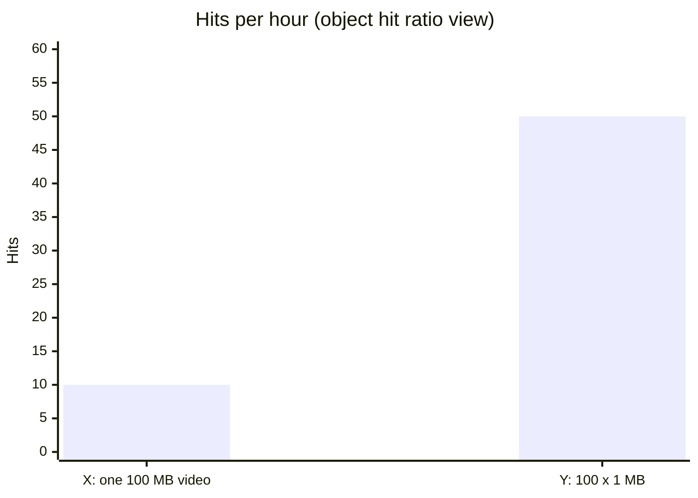
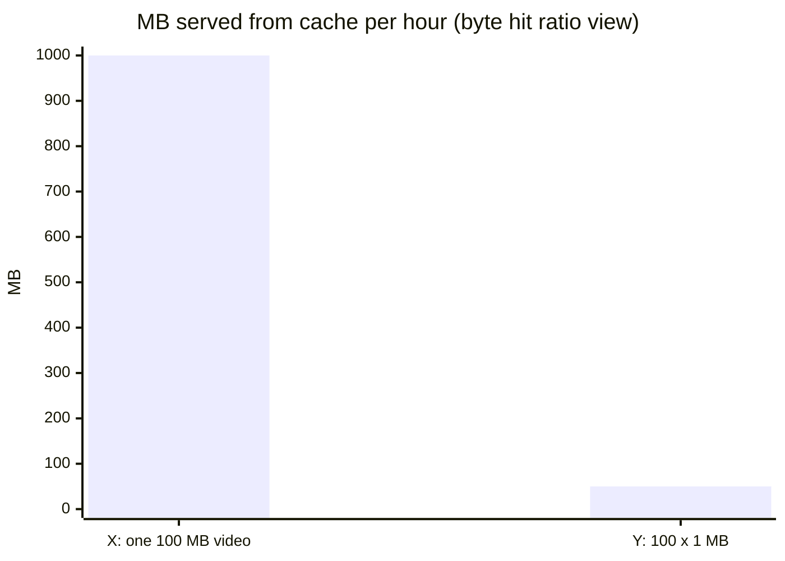
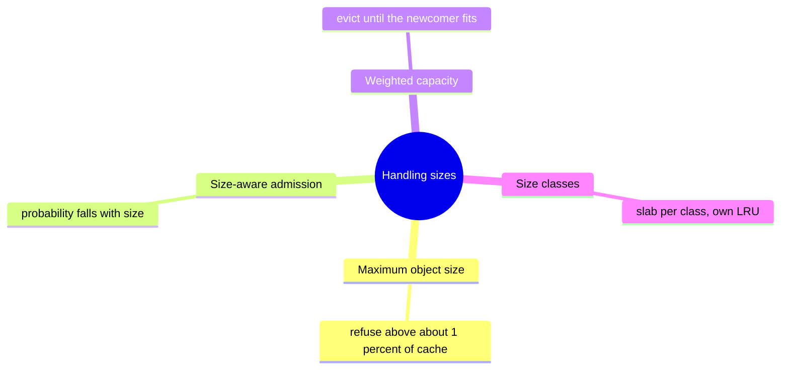
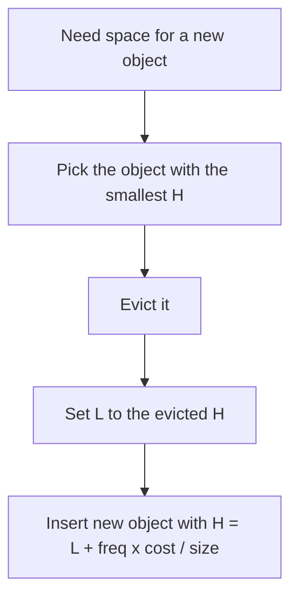
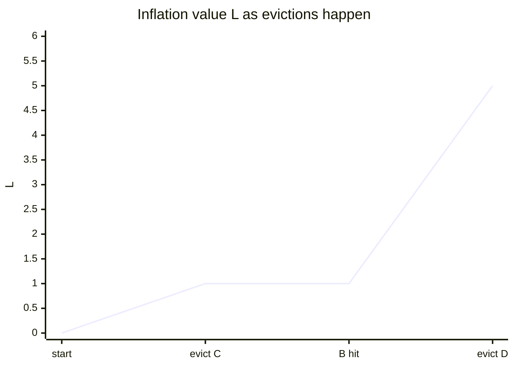
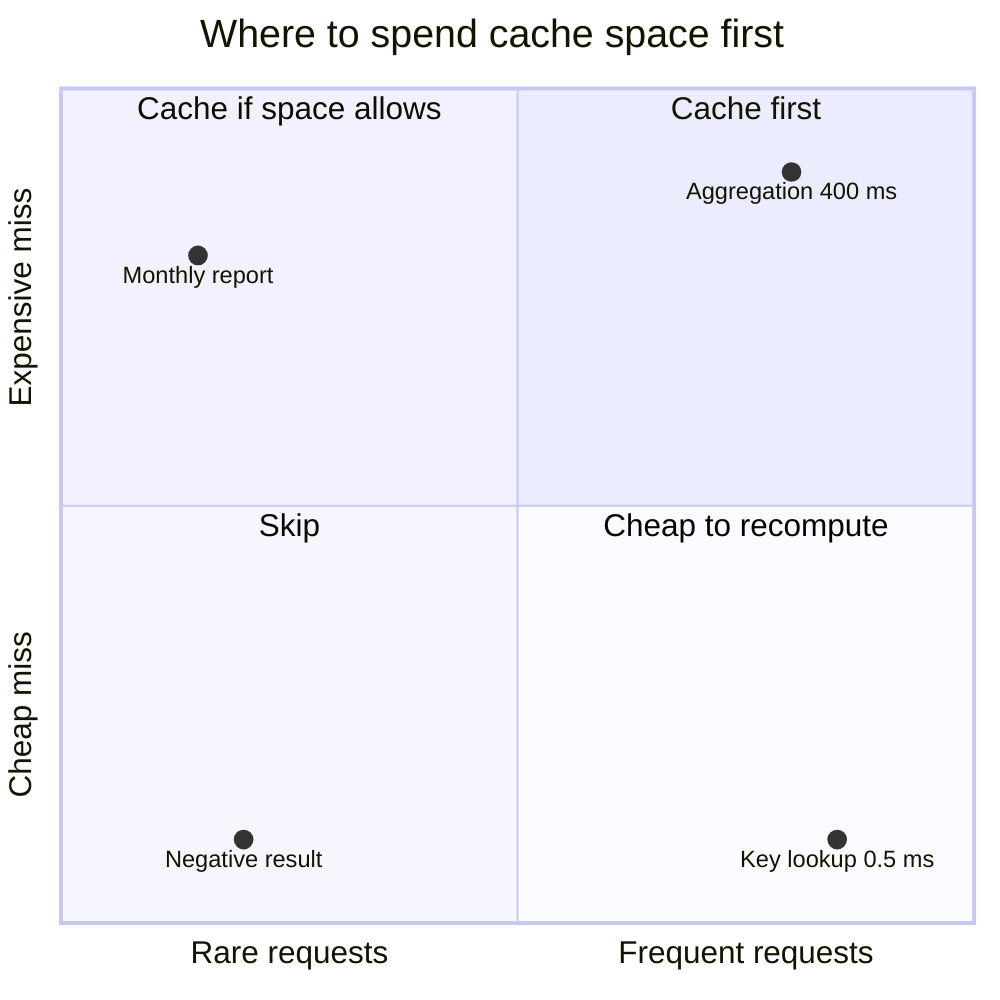
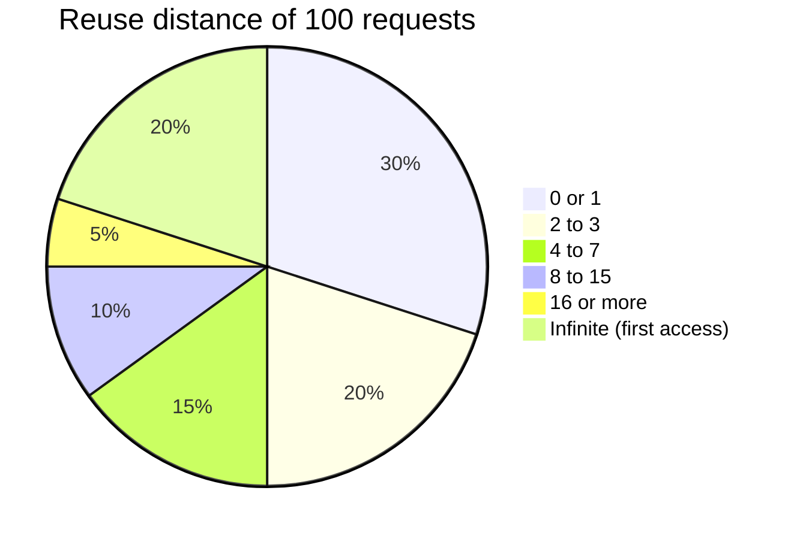
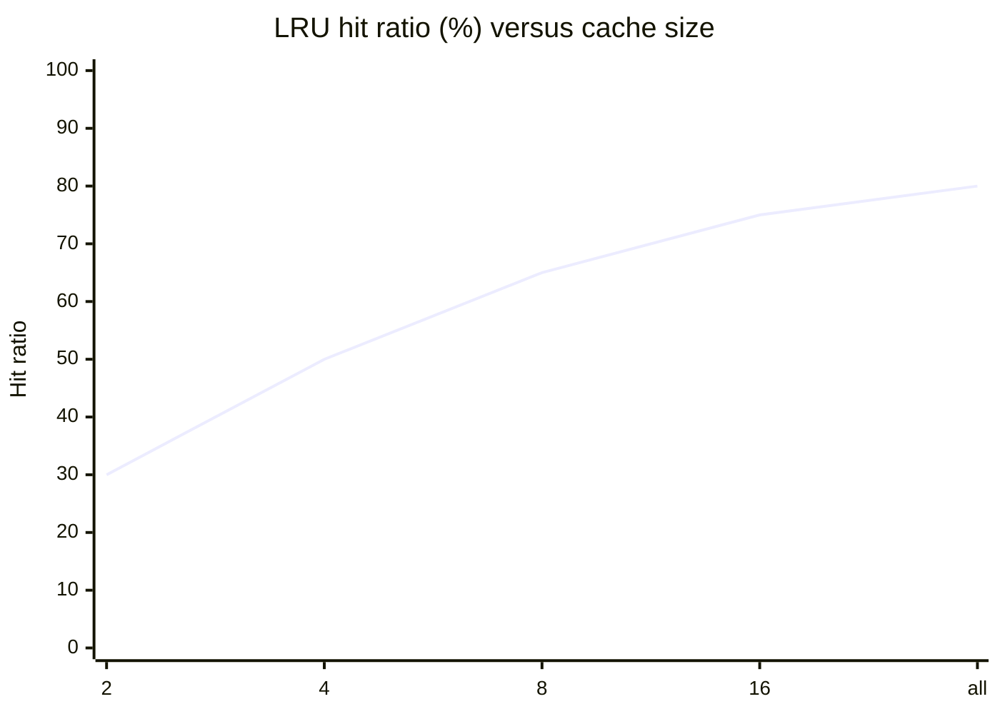
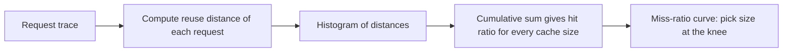
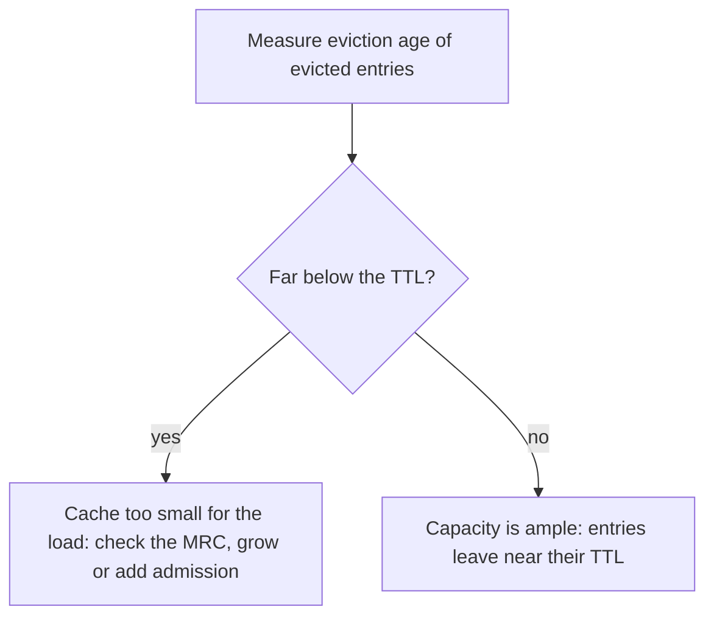

# Size-aware and cost-aware eviction, and how to evaluate policies

## Learning objectives

After studying this lesson you should be able to:

- Explain why variable object sizes and variable miss costs break the simple hit-ratio objective, and distinguish object hit ratio from byte hit ratio.
- Describe GreedyDual-Size and GDSF, compute their priorities and the inflation value L by hand, and explain how they generalize LRU and LFU.
- Configure capacity in bytes or weights, and reason about large-object admission limits.
- Build a trace-driven cache simulator, choose and warm up a trace, and report hit ratio, byte hit ratio and eviction age.
- Compute a miss-ratio curve from a reuse-distance histogram, and use it for capacity planning.
- Recognize the pitfalls of evaluation: non-stationarity, open versus closed loops, small traces, and optimizing the wrong metric.

## 1. When "one item, one slot" stops being true

All of the earlier theory assumed that every item has the same size and every miss costs the same. Real caches violate both assumptions, often dramatically:

- **Sizes vary by orders of magnitude.** A CDN holds 5 KB icons beside 500 MB video files. A key-value cache holds 100-byte counters next to 1 MB rendered pages.
- **Miss costs vary.** Rebuilding a cached value may take 1 ms (a simple key lookup) or 800 ms (a multi-table aggregation). A miss on a remote object fetched across the world costs far more than a miss on a local one.
- **Value is more than recency or frequency.** A key requested once a minute that costs 800 ms to recompute may deserve space over a key requested ten times a minute that costs 1 ms.

With unit sizes and costs, minimizing misses is the right objective. With variable ones, the question becomes: **what do we actually want to minimize?** There are several reasonable answers, and they pull in different directions.

### Object hit ratio versus byte hit ratio versus cost

- **Object hit ratio** = hits / requests. It measures how often the user gets served from cache; it favours keeping many small objects.
- **Byte hit ratio** = bytes served from cache / total bytes requested. It measures how much traffic (backend bandwidth) is avoided; it favours keeping large popular objects.
- **Cost-weighted hit ratio** = total miss cost avoided / total possible cost. If cost is latency, it measures time saved; if cost is a backend compute charge, it measures money saved.

### Worked example: the metrics disagree

A cache of 100 MB must choose between two contents:

- **Option X**: one 100 MB video that receives 10 requests per hour.
- **Option Y**: 100 small objects of 1 MB each that each receive 0.5 requests per hour.

Option X yields 10 hits per hour; Option Y yields 100 x 0.5 = 50 hits per hour. By object hit ratio, Y is 5 times better. In bytes: X serves 10 x 100 MB = 1,000 MB per hour from cache; Y serves 50 x 1 MB = 50 MB per hour. By byte hit ratio, X is 20 times better. A CDN paying for origin bandwidth prefers X; a web application whose users notice latency per request prefers Y. There is no objective answer without stating the objective. This is the first lesson of cost-aware caching: **write down the metric before choosing a policy**.





> **Key idea:** the same two cache contents rank in opposite order depending on the metric. Write down the objective before choosing a policy.

## 2. Heuristics for sizes: admission limits and size awareness

The simplest size-aware techniques are blunt but effective.

- **Maximum object size.** Refuse to cache objects larger than some fraction of the cache (for example 1 percent or even less). A single huge object can evict thousands of useful small ones. For a 10 GB cache, a limit of 100 MB means no single object displaces more than 1 percent of the capacity. CDNs often handle large media by chunking into segments or ranges that are cached independently.
- **Size-aware admission.** Admit a large candidate only if its predicted value (by frequency) outweighs the combined value of the victims it would evict. Probabilistic variants admit an object with probability that decreases with its size (e^(−size / c)); popular large objects still get in eventually, one-offs rarely do.
- **Weighted capacity.** Libraries allow each entry to have a **weight** (bytes or an estimated cost), with capacity expressed as a total weight. Evicting one tail node may not free enough space, so the eviction loop continues until the newcomer fits. Estimating entry size in managed languages is itself nontrivial (object headers, references, shared sub-objects), so approximations such as serialized size are typical.
- **Segregation by size class.** Memcached-style slab allocators group items into size classes, each with its own LRU list; this avoids fragmentation but leaves capacity stranded in the wrong class when the size distribution shifts, which is why slab rebalancing mechanisms exist. This mix of allocation and eviction is why many production caches discuss "memory allocator" and "eviction policy" together.



## 3. GreedyDual-Size and GDSF

A principled family handles sizes and costs together. **GreedyDual** generalizes LRU for variable costs; **GreedyDual-Size** (Cao and Irani, 1997) adds sizes; **GDSF** (GreedyDual-Size with Frequency, in work on web proxy caching around 1998 by Cherkasova and others) adds access counts. Treat the formulas below as the standard textbook forms.

Each cached object p carries a priority value H(p). The cache keeps a global **inflation value** L (starting at 0).

- **GreedyDual-Size**: when p is inserted or hit, set H(p) = L + cost(p) / size(p).
- **GDSF**: H(p) = L + freq(p) × cost(p) / size(p), where freq(p) is the number of times p has been requested while cached.
- **Eviction**: evict the object with the smallest H; then set L to the evicted object's H.



### Intuition

The quantity cost / size is the **benefit per byte**: a cheap-to-store, expensive-to-miss object has high value density and survives; a big, cheap one goes first. Multiplying by frequency raises the value of popular objects. The inflation value L is the clever part: it implements **aging**. Because L only increases (it takes the H of each evicted object), newly inserted or recently hit objects get priority L + something, which is higher than the priorities of objects that were last touched when L was lower. An object that is not hit retains its old, fixed H while L rises, so its relative standing falls. This gives a recency effect without per-item timestamps or a decay sweep: an elegant way to blend recency with benefit density.

Special cases show the generality. With cost = 1 and size = 1 for all objects, H(p) = L + 1 on every access: the object touched most recently has the largest H, and the smallest H belongs to the least recently touched, so GreedyDual-Size reduces to **LRU**. With GDSF and unit cost and size, H = L + freq, which behaves like LFU with aging via L (an LFU-with-dynamic-aging design). With cost = size (cost proportional to bytes, as when minimizing backend bytes transferred), cost/size is constant and the policy reduces to LRU-like behaviour that optimizes byte hit ratio; with cost = 1 and varying size, small objects are favoured, which optimizes object hit ratio. By choosing the cost function you choose the metric.

### Worked example

Capacity 10 MB, L = 0 initially. Objects are loaded and accessed once each, so freq = 1 (GDSF).

| Object | Size (MB) | Miss cost (ms) | freq | H = L + freq x cost/size |
| ------ | --------- | -------------- | ---- | ------------------------ |
| A      | 1         | 10             | 1    | 0 + 10/1 = 10            |
| B      | 4         | 10             | 1    | 0 + 10/4 = 2.5           |
| C      | 2         | 2              | 1    | 0 + 2/2 = 1              |

Used space: 1 + 4 + 2 = 7 MB; 3 MB free. Now object D arrives (size 5 MB, cost 20 ms), needing 2 MB more than is free (5 − 3 = 2).

- Evict the minimum H: C (H = 1, frees 2 MB, total free 5 MB). Set **L = 1**.
- Insert D: H(D) = L + 1 × 20/5 = 1 + 4 = 5.

Now B is requested again: freq becomes 2, so H(B) = L + 2 × 10/4 = 1 + 5 = 6. State: A = 10, B = 6, D = 5, L = 1. Next, object E (size 3 MB, cost 6 ms) arrives; free space is 10 − (1 + 4 + 5) = 0, so we need 3 MB. Evict the minimum: D (H = 5, frees 5 MB). L becomes 5. Insert E: H(E) = 5 + 1 × 6/3 = 7. State: A = 10, B = 6, E = 7, L = 5. Observe the aging effect: E, a cheap and newly inserted item with density 2, now has H = 7, higher than B's 6, although B has a density of 2.5 and two accesses, because L has risen to 5. If B is not hit again, it will be the next victim, which is how stale items eventually drop out.

| Step | Event            | Evicted | L   | H values after   |
| ---- | ---------------- | ------- | --- | ---------------- |
| 0    | A, B, C loaded   | none    | 0   | A 10, B 2.5, C 1 |
| 1    | D arrives (5 MB) | C       | 1   | A 10, B 2.5, D 5 |
| 2    | B hit, freq 2    | none    | 1   | A 10, B 6, D 5   |
| 3    | E arrives (3 MB) | D       | 5   | A 10, B 6, E 7   |



> **Key idea:** L only rises, so an object that is not hit keeps an old, fixed H and slowly becomes the cheapest victim. That is aging without timestamps.

**Practical notes.** Implementing GDSF requires a priority queue (a heap, O(log n)) or approximation by bucketing. The cost function must be defined carefully: measured fetch latency from the origin is a natural choice, but measurement noise can destabilize priorities, so many systems use moving averages or categories. GDSF is well studied for web proxy caches; modern systems often get most of the benefit with simpler approximations (size limits plus an admission filter plus a recency or frequency policy), but the framework is the right way to think about the tradeoffs.

## 4. Cost-aware caching in application practice

Application developers rarely implement GDSF, but cost awareness shapes decisions anyway.

- **Cache the expensive things first.** Before caching a 0.5 ms key lookup, find the 400 ms aggregation. Profile the cost per miss and the request frequency, and cache where (frequency × cost) is highest. This is the same cost/size × freq score, applied by a human instead of a heap.
- **TTL by cost.** An expensive-to-compute value with tolerable staleness can have a longer TTL than a cheap one.
- **Protect expensive entries from eviction.** Some caches support per-entry weights or priorities; Redis, for instance, offers policies keyed on frequency or TTL rather than cost, so cost awareness often requires application-level logic such as tiering (an "expensive" cache with its own capacity).
- **Negative or partial results** are cheap to recompute and should not occupy space that expensive results could use.
- **Recompute cost versus memory cost.** In cloud settings, one can convert both to money: memory costs per GB-month, compute per second of CPU. The break-even is when (misses avoided per month × recompute cost) exceeds the cost of the memory holding the entry. A 1 KB value that saves 50 ms of CPU thousands of times a day is a bargain; a 5 MB value that saves 2 ms once a day is not.



## 5. Evaluating policies: trace-driven simulation

How do we know which policy is better? Reasoning from theory has limits (the competitive bound does not tell LRU from FIFO). The standard methodology is **trace-driven simulation**: record a sequence of cache requests from a real system, then replay it through software models of different policies and sizes, and compare metrics.


### A minimal simulator

```java
interface Policy<K> {
    boolean access(K key, int size);   // returns true on hit; may insert/evict internally
}

final class Simulator {
    static void run(Iterable<Request> trace, Policy<String> policy, long warmup) {
        long n = 0, hits = 0, bytes = 0, hitBytes = 0;
        for (Request r : trace) {
            boolean hit = policy.access(r.key, r.size);
            if (n++ >= warmup) {               // ignore warm-up requests in the statistics
                bytes += r.size;
                if (hit) { hits++; hitBytes += r.size; }
            }
        }
        long counted = n - warmup;
        System.out.printf("object hit ratio = %.3f, byte hit ratio = %.3f%n",
                (double) hits / counted, (double) hitBytes / bytes);
    }
}
```

The policy classes from previous lessons (LRU, FIFO, 2Q, ARC, W-TinyLFU) plug in behind `Policy`. Since the simulation is deterministic, it is reproducible, cheap (millions of requests per second per core), and allows evaluating dozens of sizes in one batch. The Belady/OPT simulator from the policy theory lesson serves as the upper bound line.

### Where traces come from

1. **Production request logs**: access logs of the real system (keys, sizes, timestamps, and for cost-aware studies, fetch latencies). Best realism; consider privacy by hashing keys.
2. **Public benchmark traces**: collections of storage, database and web traces exist in the research literature and are used to compare policies. They are useful but may not resemble your workload.
3. **Synthetic traces**: generated from a model, such as Zipf popularity with parameter s, plus a scan or loop component. Good for understanding a policy's behaviour in isolation (does it resist scans?), poor for predicting production numbers.

### Methodological rules

- **Warm-up.** The first requests incur compulsory misses while the cache fills; exclude a warm-up prefix (at least the cache size in requests, often several times) from the statistics, or report separate cold and warm figures.
- **Trace length.** The trace should be long enough that every policy reaches steady state, and span the daily and weekly cycles of the workload. A one-hour trace taken at noon tells you little about the nightly batch jobs that may devastate your cache.
- **Compare at multiple sizes.** A policy may win at small sizes and lose at large ones. Always plot hit ratio against cache size.
- **Report metrics suited to the goal**: object hit ratio, byte hit ratio, cost-weighted hit ratio, and for write-back caches the write-back volume.
- **Keep the baseline honest.** Always include LRU and OPT as the reference lines; the interesting number is the gap closed (how far the new policy lies between LRU and OPT).
- **Statistical care.** For stochastic policies (random, sampled) run several seeds. For synthetic traces vary the generator seed.
- **Do not tune on the test trace only.** Parameters such as window size or sketch size tuned to one trace can overfit; validate on a second, different trace or time period.

### Limits of trace replay

- **Closed-loop effects.** In production, a cache's behaviour alters traffic: if a miss is slow, clients retry or back off, and if hits are fast, users send more requests. A recorded trace is an open-loop replay that ignores this feedback.
- **Non-stationarity.** Popularity shifts; the trace may not represent next month.
- **Lost context.** Log-derived traces miss requests served by upstream caches (browser, CDN), so they show only the already-filtered stream. Remember from the layers chapter that downstream caches see harder traffic than upstream ones; a trace recorded behind a CDN is not the same as the raw request stream.
- **Timing.** Simulations that ignore TTL expiry, concurrency, and latency overstate the hit ratio of caches in which entries expire before eviction. Include TTLs in the simulator if they matter.

## 6. Hit-ratio curves and miss-ratio curves

A **hit-ratio curve** plots hit ratio against cache size for a given policy and trace. Its complement, the **miss-ratio curve (MRC)**, plots miss ratio against cache size. MRCs are the main capacity-planning tool: they show how much memory is needed for a target miss ratio, where the "knees" (working-set boundaries) lie, and the point of diminishing returns.

### Computing an MRC for LRU from reuse distances

Recall from the policy theory lesson that under LRU a request hits in a cache of size k exactly when its reuse (stack) distance is less than k. Mattson and colleagues showed that one pass over the trace computes the reuse distance of every request. Building a histogram of distances then gives the hit ratio for **all** cache sizes simultaneously: the hit ratio at size k is the cumulative fraction of requests with distance less than k.

Naively, computing a reuse distance requires scanning back through the trace (O(n) each). Efficient algorithms use a balanced tree or a Fenwick tree (binary indexed tree) keyed by last-access time, giving O(log n) per request. For huge traces, sampling methods compute an approximate MRC from a spatially sampled subset of keys (for example 1 percent of keys, chosen by hash, with distances scaled up accordingly); the SHARDS technique by Waldspurger and colleagues follows this idea and makes online MRC estimation cheap. Accuracy depends on the sample rate and the workload; consult the original work before depending on specific error figures.

### Worked example

A trace of 100 requests has this reuse-distance histogram (distance = number of distinct other items since the previous access to the same item):

| Reuse distance          | Count |
| ----------------------- | ----- |
| 0 or 1                  | 30    |
| 2 to 3                  | 20    |
| 4 to 7                  | 15    |
| 8 to 15                 | 10    |
| 16 or more (finite)     | 5     |
| infinite (first access) | 20    |



LRU hits in a cache of k entries are requests with distance < k.

| Cache size k               | Hits (distance < k) | Hit ratio | Miss ratio |
| -------------------------- | ------------------- | --------- | ---------- |
| 2                          | 30                  | 30%       | 70%        |
| 4                          | 30 + 20 = 50        | 50%       | 50%        |
| 8                          | 50 + 15 = 65        | 65%       | 35%        |
| 16                         | 65 + 10 = 75        | 75%       | 25%        |
| above all finite distances | 75 + 5 = 80         | 80%       | 20%        |

(The size-2 row assumes the 0-or-1 bucket is entirely below 2; for finer boundaries one needs the exact distribution.) The curve falls steeply up to size 8 and flattens, and the floor of 20 percent is the compulsory miss ratio: no cache of any size can do better on this trace. Capacity planning conclusion: going from 8 to 16 entries buys 10 points, from 16 to 32 only 5; whether the extra memory is worth it depends on its cost and the cost of a miss.



> **Key idea:** the curve rises steeply to size 8 and flattens. The remaining 20 percent is the compulsory floor that no cache size can remove.



### Reading an MRC

- **A steep early drop** indicates a small hot set: a modest cache captures most reuse.
- **A long flat plateau followed by a cliff** indicates a working set of definite size (a loop or a dataset scanned repeatedly): the cache is useless until it holds the whole set, then suddenly very effective. Policies with scan and loop handling (LIRS, ARC) can smooth the cliff.
- **A long gentle slope** (typical of heavy-tailed popularity) means returns diminish gradually; tail latency may still justify bigger caches.
- **The compulsory floor** shows the limit; consider prefetching or cache warming to reduce it.
- **MRCs for non-stack policies** (FIFO, random, many adaptive policies) cannot be derived from reuse distances alone; they must be simulated at each size.

## 7. Production metrics

Offline evaluation tells you which policy to pick; online metrics tell you whether it is working.

- **Hit ratio** (object and byte), split by key class or tenant. A global average hides a key class with a 5 percent hit ratio.
- **Eviction rate and eviction age** (how long evicted entries had been in the cache, or how long since their last access). If the age of evicted items falls much below your TTLs, the cache is too small for the load: entries are being thrown out before they expire. If items are evicted only when already near their TTL, capacity is ample.
- **Miss cost metrics**: backend latency and load from misses, not merely their count.
- **Admission rejection rate** for admission-controlled caches.
- **Memory efficiency**: payload bytes divided by total memory (metadata overhead).
- **Shadow caches and A/B tests**: run a candidate policy in parallel on live traffic (a shadow cache that records what it would have hit without serving) or route a fraction of traffic to a different configuration, and compare. This captures effects that replay misses.



## 8. A decision checklist

1. Define the objective: object hits, byte hits, latency, cost, tail latency?
2. Collect a representative trace (include periodic jobs and peaks).
3. Simulate LRU and OPT first, and look at the gap. Small gap: spend effort elsewhere.
4. Add scan-resistant or admission-based candidates (2Q, ARC, W-TinyLFU) if the gap is large or the trace contains scans and many one-hit wonders.
5. If sizes or costs vary widely, add size limits and consider GDSF-style priorities or size-aware admission.
6. Plot MRCs at several sizes; choose capacity at the knee given its cost.
7. Deploy with metrics (hit ratio by class, eviction age) and revisit when the workload changes.

## Common pitfalls

- **Optimizing hit ratio when the real goal is bytes or latency**, or vice versa.
- **No maximum object size**, letting a few huge objects wipe out the working set.
- **Evaluating on a trace that is too short** or lacks the nightly jobs.
- **Including warm-up misses** in the comparison, favouring whichever policy fills faster.
- **Comparing policies at a single cache size.**
- **Replaying a trace recorded downstream of another cache** and assuming it represents the raw demand.
- **Ignoring TTLs and concurrency** in the simulator.
- **Tuning parameters on the evaluation trace** and reporting the optimistic result.
- **Confusing MRC derivation**: it is exact for stack algorithms, not for FIFO, random or most adaptive policies.
- **Estimating entry sizes inconsistently**, so the cache runs out of memory while believing it is under budget.

## Check your understanding

1. A 50 MB cache can hold either one 50 MB object requested 4 times per hour, or fifty 1 MB objects each requested once per hour. Compute the object hit counts and byte hit counts per hour for each choice. Which metric favours which?
2. State the GDSF priority formula and explain the role of the inflation value L.
3. With unit cost and unit size, what does GreedyDual-Size reduce to? Why?
4. Compute the GDSF priority of an object of size 2 MB, miss cost 30 ms, frequency 3, when L = 4.
5. A reuse-distance histogram shows 40 requests with distance < 8, 20 with distance in [8, 32), 10 with distance 32 or more (finite), and 30 first accesses, out of 100. What is the LRU hit ratio at sizes 8 and 32, and what is the minimum achievable miss ratio?
6. Give two reasons trace replay may mislead.

## Answers

1. One 50 MB object: 4 object hits and 4 x 50 = 200 MB hit per hour. Fifty small objects: 50 x 1 = 50 object hits and 50 MB per hour. Object hit ratio favours the small objects (50 versus 4); byte hit ratio favours the large one (200 MB versus 50 MB).
2. H(p) = L + freq(p) x cost(p) / size(p). L is a global value, initially 0, that is set to the H of each evicted object. Because L only rises, recently inserted or hit objects receive larger H than objects untouched since L was lower, implementing aging so that stale objects are eventually evicted without per-item timestamps.
3. LRU. H = L + 1 whenever an object is inserted or hit, and L never decreases, so the most recently touched objects have the largest H and the least recently touched has the smallest, which is evicted.
4. H = 4 + 3 x 30 / 2 = 4 + 45 = 49.
5. Hit ratio at size 8: 40/100 = 40 percent. At size 32: (40 + 20)/100 = 60 percent. The minimum miss ratio is the compulsory fraction: 30 first accesses / 100 = 30 percent (the 10 requests with distance 32 or more can also hit if the cache is large enough, giving at best 70 percent hits).
6. Examples: it ignores feedback (closed-loop effects) between cache performance and traffic; the trace may be non-representative or filtered by upstream caches; it may omit TTL, concurrency and timing effects; and the workload may shift after the trace was recorded.

## Summary

When sizes and miss costs vary, minimizing the miss count is no longer the right objective, and the choice among object hit ratio, byte hit ratio and cost-weighted metrics must be made explicitly. Practical tools include maximum object sizes, size-aware admission and weighted capacity; the principled approach is GreedyDual-Size and GDSF, which assign priority L + freq x cost / size and use a rising inflation value L for aging, reducing to LRU in the unit case. Policies are evaluated with trace-driven simulation, using warm-up, representative and long traces, multiple sizes and OPT and LRU as reference lines. Reuse-distance histograms produce exact miss-ratio curves for stack policies such as LRU, guiding capacity planning, while production metrics such as hit ratio by class and eviction age verify behaviour online. With these tools you can choose a policy and a cache size deliberately rather than by habit, which completes the eviction chapter.
