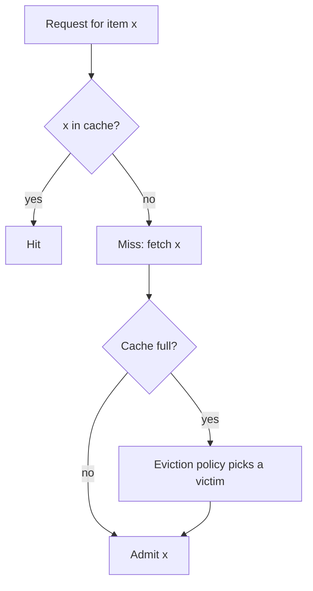
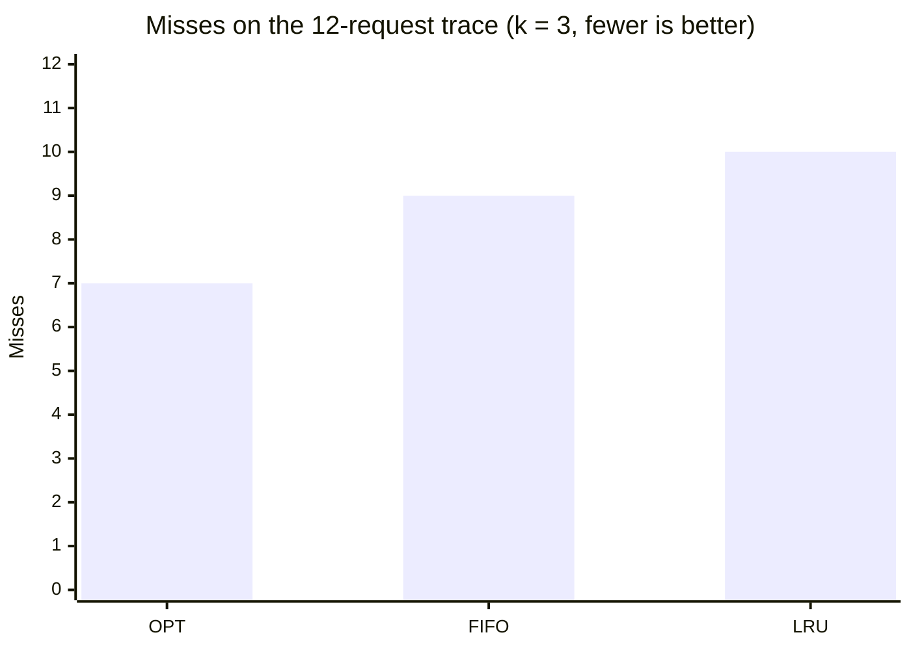
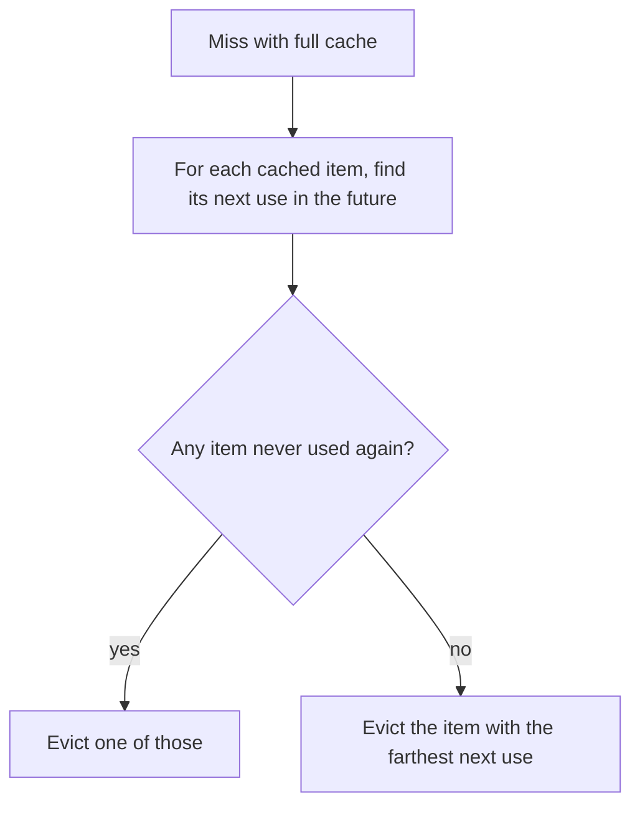
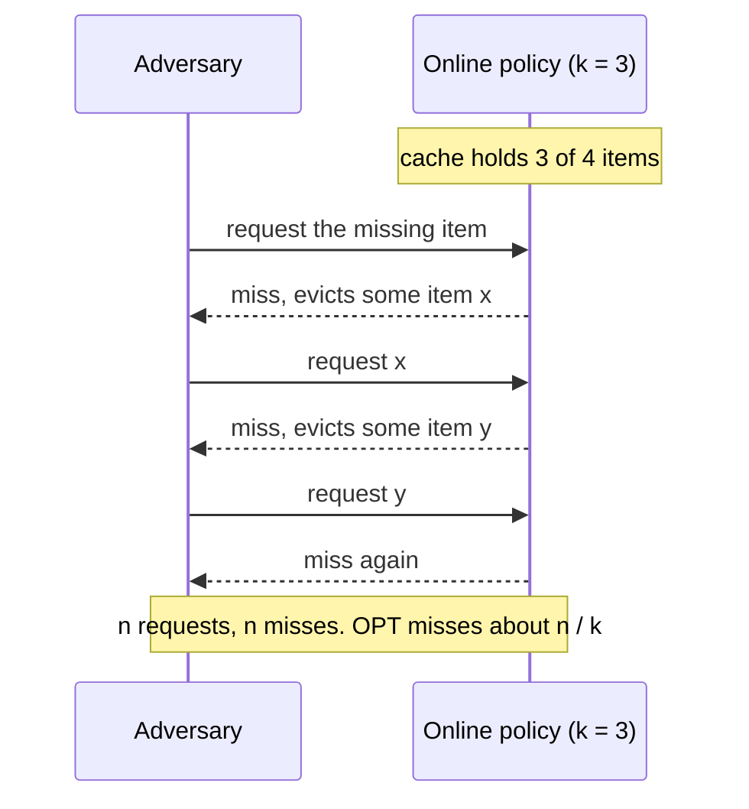
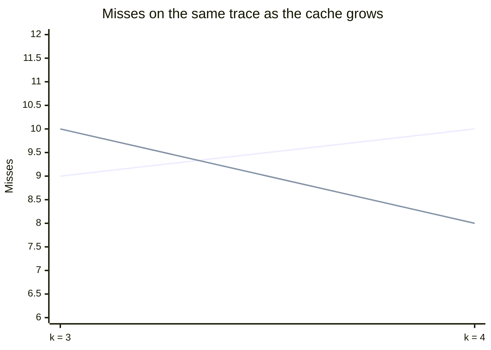
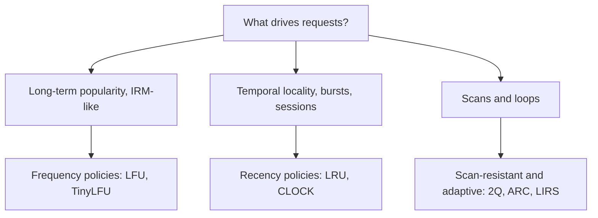

# The theory of eviction: Belady's optimum and competitive analysis

## Learning objectives

After studying this lesson you should be able to:

- State the eviction problem formally and define hit ratio, miss ratio and reuse (stack) distance.
- Describe Belady's optimal offline policy (often called MIN or OPT), simulate it by hand on a trace, and explain why it is optimal and why it cannot be implemented online.
- Explain competitive analysis, state what it means for LRU to be k-competitive, and interpret what the result does and does not say about real workloads.
- Define stack algorithms and the inclusion property, explain Belady's anomaly and why FIFO suffers from it while LRU does not.
- Explain why real policies are heuristics that exploit workload structure (recency, frequency) rather than worst-case guarantees.
- Use these concepts to compare policies on small traces with careful arithmetic.

## 1. The eviction problem

A cache has finite capacity. When a request arrives for an item that is not in the cache (a **miss**) and the cache is full, the cache must choose a **victim** to remove in order to admit the new item. The rule for choosing the victim is the **eviction policy** (also called the replacement policy). The problem appears at every layer you studied in the Cache layers chapter: CPU cache sets, the OS page cache, database buffer pools, CDN edges, Redis and Memcached.

The formal model in its simplest form (often called **paging**) is:

- A cache holds up to k items. All items have the same size and the same miss cost.
- A **request sequence** (a trace) r_1, r_2, ..., r_n of item identifiers arrives one at a time.
- On each request, if the item is in the cache it is a **hit**. Otherwise it is a **miss** (fault): the item is brought in, and if the cache already holds k items, one is evicted.
- The objective is to minimize the number of misses, equivalently maximize the **hit ratio** = hits / requests.



This model is a simplification. Real caches have items of different sizes, different load costs, expiry times, writes that make entries dirty and admission choices (the cache may refuse to store a missed item at all). We treat these refinements in the later lessons on TinyLFU admission and on size-aware and cost-aware policies. Understanding the clean model first is essential, because it supplies the vocabulary and the bounds against which everything else is measured.

Two notes on the objective. First, the policy is **online**: it must decide knowing only the past, not the future. Second, with unit sizes and unit costs, minimizing misses is the whole game; once sizes or costs differ, the problem changes character and becomes much harder.

## 2. Belady's optimal offline policy

In 1966 Laszlo Belady published a study of replacement algorithms for virtual-memory systems and showed that, if you knew the future request sequence, there is a simple optimal rule:

> **MIN (OPT):** on a miss with a full cache, evict the item whose next use is farthest in the future (or that is never used again).

This is usually called **Belady's algorithm**, **MIN**, **OPT** or the clairvoyant algorithm. It requires knowledge of the future, so it cannot be implemented in a real online cache. Its value is as a **benchmark**: for any trace, OPT gives the lowest possible miss count for a cache of size k, and thus a lower bound against which real policies can be judged.

### Why is "farthest in the future" optimal? (Intuition)

An exchange argument captures the idea. Suppose some algorithm A evicts an item x whose next use is sooner than another resident item y's next use. We could instead evict y. Compare the two futures: with A, we have y in the cache and need x soon; with the alternative, we keep x and will miss on y later than we would have needed x. Evicting the item needed farthest away postpones the next miss as long as possible, and whichever item we eventually need later can be fetched at the cost of at most one miss that A also had to pay. A careful induction shows that swapping A's choice for the farthest-in-future choice never increases the miss count. By repeating the exchange at every step, any algorithm can be transformed into MIN without adding misses. Hence MIN is optimal.

### Worked example: MIN on a trace

Take a cache of k = 3 slots and the trace (this is a classic sequence used to illustrate Belady's anomaly):

`1 2 3 4 1 2 5 1 2 3 4 5` (12 requests)

Step by step for OPT. Indices run 1 to 12. "Next use" is the next position where the item appears.

| Req | Item | Cache before | Result | Eviction decision                           | Cache after |
| --- | ---- | ------------ | ------ | ------------------------------------------- | ----------- |
| 1   | 1    | {}           | miss   | none                                        | {1}         |
| 2   | 2    | {1}          | miss   | none                                        | {1,2}       |
| 3   | 3    | {1,2}        | miss   | none                                        | {1,2,3}     |
| 4   | 4    | {1,2,3}      | miss   | next uses: 1 at 5, 2 at 6, 3 at 10; evict 3 | {1,2,4}     |
| 5   | 1    | {1,2,4}      | hit    |                                             | {1,2,4}     |
| 6   | 2    | {1,2,4}      | hit    |                                             | {1,2,4}     |
| 7   | 5    | {1,2,4}      | miss   | next uses: 1 at 8, 2 at 9, 4 at 11; evict 4 | {1,2,5}     |
| 8   | 1    | {1,2,5}      | hit    |                                             | {1,2,5}     |
| 9   | 2    | {1,2,5}      | hit    |                                             | {1,2,5}     |
| 10  | 3    | {1,2,5}      | miss   | 1 and 2 never used again, 5 at 12; evict 1  | {2,3,5}     |
| 11  | 4    | {2,3,5}      | miss   | 2, 3 never again, 5 at 12; evict 2          | {3,4,5}     |
| 12  | 5    | {3,4,5}      | hit    |                                             | {3,4,5}     |

OPT: misses at requests 1, 2, 3, 4, 7, 10, 11 = **7 misses**, 5 hits, hit ratio 5/12 = 41.7 percent.

For comparison, running LRU (evict the least recently used) with k = 3 on the same trace gives misses at requests 1, 2, 3, 4, 5, 6, 7, 10, 11, 12 = **10 misses** (hits only at requests 8 and 9), hit ratio 2/12 = 16.7 percent. FIFO (evict the oldest-inserted) gives **9 misses**. So on this trace, LRU is worse than FIFO, which is a reminder that no policy dominates on every trace. The trace is adversarial for LRU: it loops over a working set slightly larger than the cache.



> **Key idea:** even the optimal policy misses 7 of 12 times here, and the hit ratio of 5/12 is the ceiling for any policy at this cache size.



### Implementing MIN as an offline simulator

MIN is useful in the lab: given a recorded trace, you can compute the optimum by preprocessing next-use indices. A first pass walks the trace backwards and records, for each position i, the index of the next occurrence of the same key. A second pass simulates the cache with a structure ordered by next-use time.

```java
// Offline Belady simulator (sketch). Returns the number of misses for capacity k.
int beladyMisses(int[] trace, int k) {
    int n = trace.length;
    int[] next = new int[n];                    // next[i] = index of next use of trace[i]
    Map<Integer,Integer> seen = new HashMap<>();
    for (int i = n - 1; i >= 0; i--) {
        next[i] = seen.getOrDefault(trace[i], Integer.MAX_VALUE);
        seen.put(trace[i], i);
    }
    // cache maps key -> its next-use index; a TreeSet orders entries by next use
    Map<Integer,Integer> cache = new HashMap<>();
    TreeSet<int[]> byNext = new TreeSet<>((a, b) -> a[0] != b[0] ? Integer.compare(a[0], b[0])
                                                                 : Integer.compare(a[1], b[1]));
    int misses = 0;
    for (int i = 0; i < n; i++) {
        int key = trace[i];
        Integer old = cache.get(key);
        if (old != null) {                      // hit: update this key's next use
            byNext.remove(new int[]{old, key});
        } else {
            misses++;
            if (cache.size() == k) {            // evict the farthest next use
                int[] victim = byNext.pollLast();
                cache.remove(victim[1]);
            }
        }
        cache.put(key, next[i]);
        byNext.add(new int[]{next[i], key});
    }
    return misses;
}
```

The running time is O(n log k). In C++ the same design uses `std::set<pair<int,int>>` ordered by next-use. This simulator is exactly what researchers use to report "OPT" lines on hit-ratio charts, and you will use the idea again in the lesson on evaluating policies.

### Limits of OPT as a yardstick

- **It is optimal only for the simple model**: unit size, unit cost, forced admission (the missed item must enter the cache). If the cache may bypass (not admit) the item, an even lower miss count can be achieved, because admitting an item never used again wastes a slot. Some presentations therefore distinguish MIN with and without bypass.
- **With variable sizes or costs**, no simple farthest-next-use rule is optimal, and finding the optimal offline schedule is known to be computationally hard in general. Practical studies use approximations to produce a bound.
- **Compulsory misses are unavoidable**: the first access to each distinct item must miss (cold misses). A trace with U unique items has at least U misses even under OPT.

## 3. Why online algorithms cannot be optimal

An online algorithm does not know the future, so an adversary who knows the algorithm can always request the item the algorithm just evicted. Consider a deterministic online policy with a cache of size k and a universe of k + 1 items. Start with the cache full. The adversary requests the one item missing from the cache; the policy misses and must evict something; the adversary requests the item just evicted, and so on. The policy misses on **every** request.



But OPT, which knows the sequence, faces the same universe of k + 1 items: on a miss it evicts the item whose next use is farthest, which is at least k requests away (because among the k other resident items plus the one being fetched, the one farthest ahead must be at least k positions ahead when only k + 1 distinct items exist in total). So OPT misses at most once every k requests. For n requests: the online policy has n misses; OPT has at most about n / k misses. The ratio is k.

This tells us that, in the worst case, **no deterministic online policy can beat a ratio of k** against OPT. That brings us to competitive analysis.

## 4. Competitive analysis

Competitive analysis measures an online algorithm against the offline optimum on every possible input, with no assumption about the workload.

> **Key idea:** c-competitive means "never more than c times the optimum's misses, plus a constant, on any input". It is a worst-case certificate, not a prediction of real hit ratios.

**Definition.** An online algorithm A is **c-competitive** if there exists a constant b such that for every request sequence σ:

misses(A, σ) ≤ c · misses(OPT, σ) + b.

(Some presentations also allow OPT a smaller cache of size h ≤ k, giving a ratio of k / (k − h + 1); with h = k it simplifies to k.) The additive constant b absorbs boundary effects, such as the initial filling of the cache.

**Theorem (Sleator and Tarjan, 1985).** LRU and FIFO are k-competitive, and no deterministic online paging algorithm is better than k-competitive. LRU belongs to the family of **marking algorithms**; every marking algorithm is k-competitive.

### Proof idea for LRU (sketch)

Split the request sequence into **phases**: each phase is the longest run of consecutive requests containing at most k distinct items (a new phase begins when the (k+1)-th distinct item appears). Within a phase, LRU can miss at most k times, once per distinct item, because once an item is loaded in a phase, it is among the k most recently used distinct items and cannot be evicted again before the phase ends (any eviction victim must be one used less recently than all k items of the phase). Meanwhile OPT must miss at least once per phase on average: consider the phase's k distinct items plus the first request of the next phase, which is a (k+1)-th distinct item. Among those k + 1 distinct items spanning a window, OPT with k slots cannot hold them all, so it incurs at least one miss in each such window (the careful accounting uses a slightly shifted window). Therefore LRU's misses ≤ k per phase and OPT's ≥ 1 per phase, giving a ratio of at most k, up to additive boundary terms.

### Worked example: the worst case for LRU

Use k = 3 and a cyclic trace over k + 1 = 4 items: `A B C D A B C D A B C D`. LRU evicts exactly the item that is requested next, so every request misses: 12 misses. OPT, numbering requests 1 to 12: requests 1 to 3 (A, B, C) miss and fill the cache. Request 4 (D) misses; the next uses of A, B, C are at positions 5, 6, 7, so evict C, giving {A, B, D}. Requests 5 (A) and 6 (B) hit. Request 7 (C) misses; the next uses are A at 9, B at 10, D at 8, so evict B, giving {A, C, D}. Requests 8 (D) and 9 (A) hit. Request 10 (B) misses; A is never used again, so evict A, giving {B, C, D}. Requests 11 and 12 hit. OPT: misses at positions 1, 2, 3, 4, 7, 10 = 6 misses. Ratio LRU/OPT = 12 / 6 = 2, and it approaches k = 3 as the trace grows (OPT misses once per k = 3 requests in steady state, LRU on every request: ratio 3). This is the adversarial pattern known as a **loop larger than the cache** (also "scan" or "sequential flooding" in practice) which we revisit when we discuss scan resistance.

| Request | 1   | 2   | 3   | 4   | 5   | 6   | 7   | 8   | 9   | 10  | 11  | 12  |
| ------- | --- | --- | --- | --- | --- | --- | --- | --- | --- | --- | --- | --- |
| Item    | A   | B   | C   | D   | A   | B   | C   | D   | A   | B   | C   | D   |
| LRU     | M   | M   | M   | M   | M   | M   | M   | M   | M   | M   | M   | M   |
| OPT     | M   | M   | M   | M   | H   | H   | M   | H   | H   | M   | H   | H   |

### Interpreting the result

The k-competitive bound is simultaneously **reassuring and misleading**:

- **Reassuring** because LRU can never be arbitrarily bad: its miss count cannot exceed k times the optimum (plus a constant), however nasty the input.
- **Misleading** because k can be very large (millions of entries) and the bound is attained only on contrived inputs. In practice LRU is often within a small factor of OPT on workloads with good locality. It does not distinguish among LRU, FIFO and many other marking algorithms, which all share the same worst-case bound but behave very differently on real traces.
- **Randomization helps in theory.** Randomized marking algorithms (on a miss, evict a uniformly random unmarked page) achieve competitive ratio O(log k) against an oblivious adversary (one who cannot see the random choices). The theoretical gap between k and log k does not translate straight into production policies, but it explains why randomized or sampled eviction (as used by some key-value stores, which sample a few entries and evict the best candidate among them) is not a terrible idea.

Competitive analysis is therefore a **robustness certificate**, not a performance predictor. For performance we need models of workloads (Section 6) and empirical evaluation (the Evaluating policies lesson).

## 5. Stack algorithms, the inclusion property and Belady's anomaly

Intuitively, giving a cache more space should never hurt. Surprisingly, for some policies it does.

A policy is a **stack algorithm** if, for every trace and every point in the trace, the set of items in a cache of size k is a subset of the set in a cache of size k + 1. This is the **inclusion property**. Mattson, Gecsei, Slutz and Traiger (1970) studied such algorithms and showed that LRU and OPT are stack algorithms. A major consequence: for a stack algorithm, hit ratio is **monotonically non-decreasing** in cache size, and the whole hit-ratio-versus-size curve can be computed in a single pass over the trace by recording each reference's **stack distance** (see below).

FIFO is not a stack algorithm. On the trace from Section 2, FIFO with k = 3 incurs 9 misses, but with k = 4 it incurs **10 misses**. Verify with k = 4: the first four requests miss (1, 2, 3, 4) leaving {1,2,3,4}, with 1 the oldest. Requests 1 and 2 hit. Request 5 misses and evicts 1 → {2,3,4,5}. Request 1 misses and evicts 2 → {3,4,5,1}. Request 2 misses, evicts 3 → {4,5,1,2}. Request 3 misses, evicts 4 → {5,1,2,3}. Request 4 misses, evicts 5 → {1,2,3,4}. Request 5 misses, evicts 1 → {2,3,4,5}. Total misses: 4 + 1 + 5 = 10. More memory, more misses: this is **Belady's anomaly**.



The first line is FIFO: 9 misses at k = 3 but 10 at k = 4 (Belady's anomaly). The second line is LRU, which falls from 10 to 8 as the inclusion property guarantees.

For comparison, LRU with k = 4 on the same trace gives 8 misses (4 cold misses, then misses on 5, 3, 4 and 5), lower than its 10 misses at k = 3, as the inclusion property guarantees: never worse with more space.

Why does the anomaly matter in practice? It means that tuning a FIFO-managed cache upward can decrease hit ratio on some workloads, which breaks capacity-planning intuition. It is also one reason why miss-ratio-curve tools assume stack-algorithm behaviour.

### Reuse distance (stack distance)

For a request to item x, the **reuse distance** (also called stack distance) is the number of **distinct other items** accessed since the previous access to x (infinite for first access). Under LRU, a request hits in a cache of size k if and only if its reuse distance is less than k (strictly: fewer than k distinct other items intervened, so x is among the k most recently used). Therefore the LRU hit ratio for any cache size can be read from the histogram of reuse distances:

hit ratio(k) = (number of requests with reuse distance < k) / n.

**Worked example.** For the trace `A B C A B D A`: reuse distances are: A (first) = infinity; B = infinity; C = infinity; A: between the two A's we have B, C so distinct count 2; B: between the two B's are C, A so 2; D = infinity; A: between the last two A's are B, D so 2. Histogram: infinite ×4, distance 2 ×3. With a cache of size 3 (distance < 3): the three requests with distance 2 hit, so hit ratio 3/7 = 42.9 percent. With size 2 (distance < 2): none hit, 0 percent. This is exactly the data structure behind a **miss-ratio curve**, which the last lesson of this chapter develops.

| Request                     | A   | B   | C   | A   | B   | D   | A   |
| --------------------------- | --- | --- | --- | --- | --- | --- | --- |
| Reuse distance              | inf | inf | inf | 2   | 2   | inf | 2   |
| Hit at k = 3 (distance < 3) | no  | no  | no  | yes | yes | no  | yes |
| Hit at k = 2 (distance < 2) | no  | no  | no  | no  | no  | no  | no  |

## 6. From worst cases to workload models

Real workloads are not adversarial. Several standard models explain why practical policies differ in performance.

**Independent Reference Model (IRM).** Each request independently picks item i with fixed probability p_i, ignoring history. Under IRM the optimal online policy is simple: **keep the k most probable items** (the policy often called A0). This is what LFU approximates: count frequencies, evict the least frequent. LRU, which looks only at recency, wastes capacity under IRM, because a recent request to a rare item pushes out a frequently requested one. Hit ratio of the ideal static policy: sum of the k largest p_i.

_Worked example._ Four items with probabilities 0.5, 0.25, 0.15, 0.10 and a cache of size 2. The best static content is {item 1, item 2}, with hit ratio 0.5 + 0.25 = 0.75 (once warmed). LRU's steady state under IRM holds a random-looking pair weighted by recency; its hit ratio is lower than 0.75. (One can compute it exactly with a Markov chain; for this example the answer is clearly below 0.75, because LRU sometimes holds low-probability items.)

**Zipf-like popularity.** Many real systems (web objects, search queries, social media items) follow a heavy-tailed distribution in which the i-th most popular item has probability proportional to 1 / i^s with s near 1. A small set of hot items accounts for most requests, so even a small cache achieves a large hit ratio, but the long tail ensures a steady stream of one-off items that pollute an LRU cache. This motivates admission control such as TinyLFU.

**Locality models (LRU stack model).** Requests depend on recent history; the probability of re-referencing the item at stack position j is a decreasing function of j. LRU is optimal under certain such models. Programs with loops, scans and phases combine these behaviours, which is why adaptive policies (ARC, LIRS) try to detect which regime they are in.

**Take-away.** If requests are driven by long-term popularity (IRM-like), frequency-based policies win. If they are driven by temporal locality (bursts, sessions), recency-based policies win. Real traces mix both, plus scans. Chapter lessons that follow build policies that capture this mixture.



## 7. Practical implications

1. **OPT is your ceiling.** Before investing in a cleverer policy, simulate OPT on your trace. If LRU is already within a few points of OPT, further policy engineering has little to offer; capacity or admission changes might matter more.
2. **Cache size beats policy at the extremes.** For a Zipf workload, moving from 1 percent to 10 percent of the data set size often gives far more hit ratio than switching between decent policies.
3. **Worst-case traces exist in production.** A full-table scan, a crawler, a batch job or a bug that iterates over every key is a loop larger than the cache. Prefer policies with scan resistance, or isolate such traffic.
4. **Randomness and sampling can be good enough.** Because many policies share the same worst-case bound, approximations (sampled LRU, CLOCK) lose little while saving metadata and lock contention, as discussed in the next lesson.
5. **Beyond the model.** Real costs vary (a cached image of 2 MB versus a 200-byte counter, or a database query taking 500 ms versus 2 ms). Maximizing hit ratio is not minimizing cost; see the lesson on size-aware and cost-aware eviction.

## Common pitfalls

- **Treating OPT as achievable.** It is a bound, not a design target; it needs future knowledge.
- **Quoting "LRU is k-competitive" as evidence LRU is good in practice.** The bound is a worst-case guarantee; it does not separate LRU from FIFO or from random marking.
- **Forgetting cold misses.** Hit ratio on a short trace is dominated by compulsory misses; compare policies after warm-up or against OPT on the same trace.
- **Assuming more cache is never worse.** True for stack algorithms like LRU and LFU, false for FIFO (Belady's anomaly).
- **Computing reuse distance by counting requests instead of distinct items.** Repeated accesses in between do not increase the distance.
- **Ignoring admission.** Standard OPT forces admission; a cache that may skip admitting one-hit wonders can beat the basic bound.
- **Evaluating on a tiny hand-made trace** and generalizing. Small traces expose pathologies but cannot rank policies.

## Check your understanding

1. State Belady's rule. Why is it unimplementable in a real cache, and why is it still useful?
2. Simulate OPT on the trace `A B C D A B E A B C D E` with k = 3, and give the number of misses. (Hint: map A..E to 1..5; this is the earlier trace.)
3. Explain, using an adversary, why no deterministic online paging algorithm can beat competitive ratio k.
4. Define reuse distance and compute it for each request in `X Y X Z Y X`. For an LRU cache of size 2, which requests hit?
5. What is the inclusion property? Which of LRU and FIFO have it, and what anomaly results when it is absent?
6. Under the independent reference model with probabilities (0.4, 0.3, 0.2, 0.1) and cache size 2, what is the best achievable steady-state hit ratio, and which online policy family approximates it?

## Answers

1. Evict the cached item whose next use lies farthest in the future (or never). It requires knowing future requests, which a real cache does not. It is useful as the lower bound on misses for a given trace and size, to judge how much headroom a better policy could have.
2. This is the trace from Section 2 with letters for numbers: A=1, B=2, C=3, D=4, E=5. OPT has 7 misses (requests 1, 2, 3, 4, 7, 10, 11), 5 hits.
3. With k + 1 items, the adversary always requests the item that is not in the cache (the one the algorithm just evicted), so the algorithm misses on every request. OPT, with the same k+1 item universe, can always evict the item that will be requested farthest away, which is at least k requests later, so it misses at most once per k requests. The ratio is at least k.
4. Distances: X (first) = infinity; Y = infinity; X: distinct items since last X are {Y} = 1; Z = infinity; Y: since last Y the items are {X, Z} = 2; X: since last X the items are {Z, Y} = 2. With an LRU cache of size 2 a request hits when its distance is less than 2, so only the third request (X, distance 1) hits. The others have distance 2 or infinity and miss.
5. For every trace, the contents of a cache of size k are a subset of the contents of a cache of size k + 1. LRU has it; FIFO does not. Without it, increasing cache size can increase misses (Belady's anomaly).
6. Keep the two most probable items: 0.4 + 0.3 = 0.7. Frequency-based policies (LFU and its approximations such as TinyLFU) approximate this, because they estimate long-term popularity.

## Summary

The eviction problem asks which cached item to discard on a miss to minimize misses. Belady's offline MIN rule (evict the item used farthest in the future) is optimal in the unit-size, unit-cost model, and serves as the benchmark rather than an implementable policy. Competitive analysis compares online policies to OPT across all inputs: LRU is k-competitive and no deterministic policy does better, because an adversary can always request the item just evicted; randomization improves the theoretical bound to O(log k). Stack algorithms such as LRU satisfy the inclusion property, so hit ratio never falls as the cache grows, and their behaviour for all sizes is captured by reuse distances; FIFO violates inclusion and exhibits Belady's anomaly. Because worst-case bounds do not separate good policies from mediocre ones, real policy design relies on workload models (independent reference, Zipf popularity, temporal locality) and empirical evaluation. The next lesson examines the classical policies (LRU, LFU, FIFO, CLOCK) and how to implement LRU in constant time.
