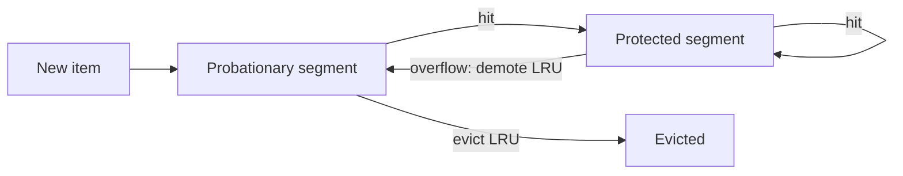
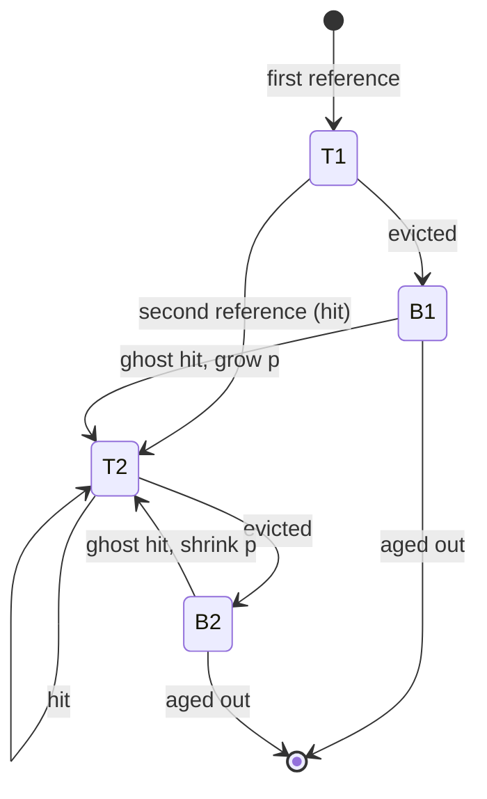

# Scan resistance and adaptive policies: SLRU, 2Q, ARC and LIRS

## Learning objectives

After studying this lesson you should be able to:

- Explain why LRU and LFU each fail on common workloads and how scans, loops and one-hit wonders cause the failures.
- Describe the idea of separating items seen once from items seen at least twice, and how segmented LRU (SLRU) and 2Q implement it.
- Explain ghost (history) lists and what information they hold without holding data.
- Describe ARC: its four lists, the adaptation parameter, and how a hit in a ghost list moves the balance between recency and frequency; perform the arithmetic of a parameter update.
- Describe LIRS conceptually: inter-reference recency, LIR and HIR blocks, and why it handles loops better than LRU.
- Compare these policies on metadata cost, tuning burden and robustness, and choose among them.

## 1. The two failure modes

The previous lesson ended with a tension. LRU treats the most recent access as the strongest evidence of future use. LFU treats the access count as the strongest evidence. Real workloads punish each in different ways.

**LRU fails when recency misleads.** A **scan** (a long run of items each accessed once) is the extreme case: each scanned item is the most recent at the moment it is touched, so LRU retains it and evicts truly valuable items. A **loop** over a working set larger than the cache is similar: LRU evicts each item just before it is needed again. More generally, a **one-hit wonder** is an item accessed exactly once; in many web and storage traces a large fraction of distinct objects (often a majority of distinct items, depending on the trace) are one-hit wonders. Each one inserted into an LRU cache displaces something else for no benefit.

**LFU fails when frequency misleads.** Old popularity persists; new items cannot establish themselves; frequency counts need aging.

A natural question follows: can we get recency's responsiveness and frequency's resistance to pollution together, without per-workload tuning? Three decades of cache research largely tries to answer it. Our starting observation is simple and powerful:

> An item that has been requested **twice** is much better evidence of reuse than an item requested once.

If the cache distinguishes items seen once from items seen at least twice, and protects the latter from being flushed out by a stream of the former, it gains scan resistance almost for free. Every policy in this lesson is an elaboration of this idea.

## 2. Segmented LRU (SLRU)

**SLRU** divides the cache into two LRU segments:

- a **probationary** segment, where newly inserted items go;
- a **protected** segment, which holds items that have been hit at least once since insertion.

On a miss, the new item enters the probationary segment (at the most recent end). On a hit in the probationary segment, the item is promoted to the most recent end of the protected segment; if protected is full, its LRU item is demoted to the most recent end of probationary (not evicted outright). On a hit in the protected segment, the item moves to its most recent end. Eviction always takes the LRU item of the probationary segment.

**Why it resists scans.** A scan only ever populates the probationary segment. Scanned items never receive a second hit, so they are never promoted, and they churn within probationary, evicting each other. The protected segment, which holds the proven hot items, is untouched.

**Parameters.** The split between segments (for example 80 percent protected, 20 percent probationary) is a tuning knob. Too small a protected segment loses hot items to churn; too small a probationary segment gives new items too little time to earn a second hit. SLRU appears in practice in storage systems and, as the main region of the W-TinyLFU design covered in the next lesson, in modern high-performance cache libraries.

## 3. 2Q

**2Q** (introduced by Johnson and Shasha in 1994) achieves similar goals with a different structure and, importantly, introduces a **ghost list**. It uses three queues:

- **A1in**: a small FIFO queue of items seen once that are currently in the cache.
- **A1out**: a FIFO list of the **keys only** (no data) of items recently evicted from A1in: the history.
- **Am**: the main LRU queue of items considered hot.

Rules:

1. On a **miss** for item x:
   - If x is in A1out (it was seen recently, evicted, and is now requested again, i.e. a second reference within a reasonable window), load x and insert it into **Am**.
   - Otherwise, insert x into **A1in**.
2. On a **hit** in A1in: do nothing (the item is not yet proven; correlated references in a short burst should not count as proof of long-term value).
3. On a **hit** in Am: move to the most recent position.
4. When A1in is over capacity, its oldest item is removed and its key goes to A1out (data discarded). When the cache is full, evict from A1in if it is over its target size, otherwise from the LRU end of Am.

Typical suggested settings for the paper's evaluation were a fixed fraction of the cache (a quarter or so) for A1in and a history list sized to track roughly half the cache's worth of keys, though these are tunable.

### Worked example: surviving a scan

Total cache capacity 4: A1in holds up to 1 item, Am up to 3, and A1out remembers 2 keys. Trace: `H1 S1 H1 S2 H2 S3 H2 S4 S5 H1 H2` where H items are hot (re-referenced) and S items are scanned once.

| Request | Action                                                          | A1in | A1out | Am    |
| ------- | --------------------------------------------------------------- | ---- | ----- | ----- |
| H1      | miss, new                                                       | H1   |       |       |
| S1      | miss, new; A1in over capacity so H1 pushed out to history       | S1   | H1    |       |
| H1      | miss, but H1 in A1out so admit to Am                            | S1   |       | H1    |
| S2      | miss, new; S1 to history                                        | S2   | S1    | H1    |
| H2      | miss, new; S2 to history                                        | H2   | S1 S2 | H1    |
| S3      | miss, new; H2 to history; A1out over capacity (2) so S1 dropped | S3   | S2 H2 | H1    |
| H2      | miss, in history, admit to Am                                   | S3   | S2    | H1 H2 |
| S4      | miss; S3 to history                                             | S4   | S2 S3 | H1 H2 |
| S5      | miss; S4 to history; S2 dropped                                 | S5   | S3 S4 | H1 H2 |
| H1      | hit in Am                                                       | S5   | S3 S4 | H2 H1 |
| H2      | hit in Am                                                       | S5   | S3 S4 | H1 H2 |

The scan items S1 to S5 flowed through A1in and into history without ever disturbing Am. The two hot items, once they showed a second reference within the history window, were protected. Plain LRU with capacity 4 on the same trace evicts H1 when S4 arrives and S3, S4, S5 crowd out the rest, so its final request for H1 misses while H2 hits. Counting the whole trace honestly, LRU scores 3 hits (requests 3, 7 and 11) against 2Q's 2 (requests 10 and 11), because 2Q pays for its caution with misses on the early second references. The benefit shows up as the scan lengthens: 2Q keeps both hot items however many scan items follow, whereas LRU loses them after four scan items.

**Cost.** Three structures, a ghost list of keys (cheap, but still memory and bookkeeping), and parameters to tune (A1in size, A1out size). The ghost list is the key conceptual contribution: it lets the cache remember an item's recent past without paying for its data.

## 4. LRU-K (briefly)

**LRU-K** (O'Neil, O'Neil and Weikum, 1993) evicts the item whose K-th most recent reference is oldest. With K = 1 it is LRU. With K = 2 it ranks items by the time of their second-most-recent reference; items referenced once have an infinite backward K-distance and are evicted first. It identifies frequently used items quickly, resists scans and was designed for database buffer pools. The cost is a per-item history of K timestamps and a priority structure (or approximation) for finding the eviction candidate, plus a "retained information period" so history survives eviction. 2Q was introduced partly as a cheaper alternative achieving similar hit ratios with constant-time operations.

## 5. ARC: the adaptive replacement cache

All of the above need a parameter that depends on the workload: how much room for once-seen items versus twice-seen items. A workload dominated by scans wants a small recency segment and a big frequency segment; a workload with strong recency (new items rapidly reused) wants the opposite. **ARC** (Adaptive Replacement Cache, by Megiddo and Modha, 2003) tunes this balance **online**, using hits in ghost lists as feedback.

### Structure

For a cache of capacity c entries, ARC maintains four lists, all in LRU order:

- **T1**: items in the cache seen **exactly once** recently (the recency list).
- **T2**: items in the cache seen **at least twice** recently (the frequency list).
- **B1**: ghost list of keys recently evicted from T1 (no data).
- **B2**: ghost list of keys recently evicted from T2 (no data).

Invariants: |T1| + |T2| ≤ c (the cache), and the total of all four lists is at most 2c. A parameter **p** is the current **target size of T1**, adapted over time, with 0 ≤ p ≤ c. T2's target is c − p.

### Behaviour

- **Hit in T1 or T2:** move the item to the most recent end of T2 (a second reference means it is now "frequent").
- **Miss, key in B1:** this means that T1 was too small: we evicted something from T1 that was requested again soon. Increase p (grow the recency target), make room via REPLACE, and load the item into T2.
- **Miss, key in B2:** T2 was too small: we evicted from the frequency list and regretted it. Decrease p (grow the frequency target), REPLACE, and load into T2.
- **Complete miss (key in no list):** insert at the most recent end of T1 after making room (and trimming ghost lists so the total stays bounded).
- **REPLACE (choose the victim):** if T1 is larger than its target p (or equal, when the incoming key was in B2), evict the LRU item of T1 and put its key in B1; otherwise evict the LRU item of T2 and put its key in B2.

The adaptation step sizes are proportional to the ratio of ghost list sizes, so a regret from a smaller ghost list moves p faster. In the original formulation, on a B1 hit, p increases by 1 if |B1| ≥ |B2|, else by |B2| / |B1|. On a B2 hit, p decreases by 1 if |B2| ≥ |B1|, else by |B1| / |B2|. Values are clamped to [0, c].

### Worked example: adapting p

Suppose c = 100 and currently p = 30, so the policy wants about 30 entries in T1 and 70 in T2. Suppose |B1| = 20 and |B2| = 40.

- A request hits in B1. Since |B1| = 20 < |B2| = 40, the increment is |B2| / |B1| = 2. New p = 32. ARC now allows T1 to be bigger, because recently evicted once-seen items are being re-requested, evidence that the workload has strong recency behaviour (or that T1 is too small for the current working set).
- Later, with |B1| = 50 and |B2| = 10, a request hits in B2. Since |B2| < |B1|, the decrement is |B1| / |B2| = 5. p goes from 32 to 27. T2 gets more room.

Intuition for the ratio: if B2 is small but is still producing hits, then each B2 hit is a rarer, stronger signal that T2 is too small, so it earns a large step.

**Scan behaviour.** A scan injects fresh keys that enter T1 and then B1 without being hit again; they never produce B1 hits (no repeats), so p does not grow because of them, while T2 (the frequent list) is protected because eviction takes from T1 whenever |T1| > p. The scan can still occupy T1 up to p, but cannot invade T2.

**Loop behaviour.** If a loop just exceeds the cache, ARC's ghost hits shift p so that part of the loop can stay resident, depending on dynamics; it does not fully solve loops, which is a strength of LIRS.

### Costs and caveats

- **Metadata**: two ghost lists, so up to 2c keys tracked, which is a significant overhead when values are small (keys are potentially large, too).
- **Complexity**: all four lists are LRU lists with locking at every hit (moving to T2), so ARC has the same concurrency issues as LRU, though variants such as CAR (CLOCK with adaptive replacement) reduce them.
- **Patents and licensing**: ARC was patented by IBM, which reportedly influenced whether open source projects adopted it. ARC-like or alternative designs appear in various file systems and databases; check the licensing situation and the documentation of any system you use rather than assuming.
- **Variable sizes**: ARC is defined for fixed-size pages; adapting it to byte-sized objects requires extensions.

## 6. LIRS: low inter-reference recency set

**LIRS** (Jiang and Zhang, 2002) takes a different approach, based on a better predictor than plain recency.

**Inter-reference recency (IRR)** of a block is the number of **distinct other blocks** accessed between its last two references (in effect, the reuse distance of its most recent reuse). Plain **recency** is the number of distinct blocks accessed since its last reference. LRU effectively ranks blocks by recency; LIRS ranks by IRR (with recency as a secondary signal). The argument: a block whose past reuse distance was small is likely to have a small reuse distance next time, so it deserves to stay, even if it has not been referenced very recently.

LIRS divides blocks into:

- **LIR (low IRR) blocks**: the hot set, nearly the whole cache (about 99 percent in the suggested configuration). Always resident.
- **HIR (high IRR) blocks**: the rest. A small fraction (about 1 percent) of the cache is reserved for resident HIR blocks; other HIR blocks may be tracked as non-resident metadata.

Data structures: a stack S (ordered by recency, holding LIR blocks, resident HIR blocks and some non-resident HIR blocks) and a queue Q of resident HIR blocks. Conceptually:

1. A new block enters as HIR. It is placed at the top of S and in Q.
2. If an HIR block is referenced again while it is still in S, it means its IRR is smaller than the recency of the LIR block at the bottom of S; it is **promoted to LIR**, and the bottom LIR block is **demoted to HIR** (moved into Q).
3. Eviction always removes the front of Q, a resident HIR block, never an LIR block.

### Why LIRS handles loops and scans

Take a loop over 120 blocks with a cache of 100. LRU yields no hits (reuse distance 119 exceeds 100). LIRS, by classing 99 blocks as LIR (their IRR is 119 each, but they were established first and remain), keeps those 99 resident, so the loop gets roughly 99 hits per 120 references, around 82 percent. This is close to the optimal for this trace (OPT would also retain most of the loop and miss only about 20 of every 120 references): a dramatic gain from a structural insight rather than a parameter. A scan consists of new HIR blocks that pass through the small HIR region without ever being promoted.

LIRS costs more to implement (stack pruning to keep the bottom of S as an LIR block, tracking non-resident metadata) and the exact bounds on metadata are subtle. It has been influential in database and storage research and implementations, including variants that make the stack and queue concurrency-friendly.

## 7. Choosing among them

| Policy | Idea                                                         | Extra metadata                  | Tuning            | Strength                     | Weakness                                       |
| ------ | ------------------------------------------------------------ | ------------------------------- | ----------------- | ---------------------------- | ---------------------------------------------- |
| SLRU   | Protect items hit twice                                      | Segment membership              | Split ratio       | Simple scan resistance       | Static split                                   |
| 2Q     | Admit to the main queue on a second reference within history | Ghost list of keys              | Queue sizes       | Cheap, effective, O(1)       | Parameter sensitivity                          |
| LRU-K  | Rank by K-th last reference                                  | K timestamps per item           | K, history period | Strong for DB patterns       | History cost, priority queue                   |
| ARC    | Adapt balance of recency and frequency using ghost hits      | Two ghost lists                 | Essentially none  | Self-tuning, robust          | Lock on every hit; 2c metadata; patent history |
| LIRS   | Rank by inter-reference recency                              | Stack with non-resident entries | HIR fraction      | Excellent on loops and mixed | Complex implementation                         |

Guidelines:

- If your system already has LRU and scans are the issue, SLRU or 2Q gives the biggest improvement for the least code.
- If workload mix changes over time and you can afford extra memory and a lock, ARC removes the tuning burden.
- If loops or sequential patterns larger than the cache dominate (scan-heavy databases and file systems), consider LIRS-like designs.
- If the cache is a high-throughput in-process cache for objects with a skewed popularity distribution, the admission-based designs of the next lesson (TinyLFU) are the current state of the art in many libraries.

## 8. A common thread: admission and history

Notice how each policy uses history beyond the current contents. SLRU uses a promotion rule, 2Q and ARC use ghost lists of keys, LIRS uses non-resident metadata. In the next lesson, TinyLFU takes this to a probabilistic extreme: it keeps approximate frequency counts for a huge number of keys in a few bits each, and uses them to decide not just whom to evict but **whether to admit the newcomer at all**.

## Common pitfalls

- **Counting correlated references as frequency.** Two references within microseconds (one request, two cache calls) is not evidence of long-term value. 2Q ignores hits in A1in for this reason.
- **Sizing ghost lists too small**, so the second reference falls outside the history window and scan resistance becomes ineffective.
- **Forgetting ghost lists consume memory** proportional to the number of keys; with large keys and small values the overhead is significant.
- **Assuming adaptive means optimal.** ARC adapts the balance but is still a heuristic and can lose to simpler policies on specific traces.
- **Implementing ARC with a bug in REPLACE** (the equality case when the incoming key was in B2). Test against the published pseudo-code on a small trace.
- **Mixing the segments' capacity logic**, so the total resident count exceeds c.
- **Ignoring concurrency cost.** Moving an item to T2 on every hit requires a lock or a read buffer.

## Check your understanding

1. Why does a scan not disturb the protected segment of an SLRU cache?
2. In 2Q, why does a hit in A1in do nothing, and what is the role of A1out?
3. In ARC, what does a hit in ghost list B1 tell the algorithm, and how is p changed? Compute the new p when c = 200, p = 50, |B1| = 10, |B2| = 30.
4. What is inter-reference recency? Compute the IRR of block X in the sequence `X A B A C X`.
5. A loop of 120 blocks runs over a cache of 100. What hit ratio does LRU get, and roughly what does LIRS get? Why?
6. Name two costs of ghost lists.

## Answers

1. Scanned items are only ever inserted into the probationary segment and never receive a second hit, so they are never promoted into the protected segment. They churn within probationary, evicting only other scanned or unproven items.
2. A hit in A1in could be a correlated re-reference in a short burst, which is not proof of long-term popularity; 2Q waits until the item is requested again after having left A1in. A1out remembers the keys of items evicted from A1in, so a later request shows the item has a reuse distance within the history window and warrants promotion to Am.
3. A B1 hit says T1 was too small: an item evicted from the recency list was requested again. Since |B1| = 10 < |B2| = 30, the increment is |B2| / |B1| = 3, so p = 53 (clamped to at most c = 200). The key is then loaded into T2.
4. IRR is the number of distinct other blocks between the last two references of the block. For X: references at positions 1 and 6; between them are A, B, A, C: distinct blocks A, B, C = 3. IRR(X) = 3.
5. LRU: 0 percent after warm-up, since each block's reuse distance (119 distinct other blocks) exceeds the 100 slots. LIRS: roughly 99 of every 120 references hit (about 82 percent), because about 99 blocks are held as LIR and never evicted while the remaining blocks cycle through the small HIR region.
6. Memory for storing keys of non-resident items (up to c extra keys per list), and extra bookkeeping on every miss and eviction (maintaining the lists); also tuning of how long history should be.

## Summary

LRU is fooled by scans and loops, LFU by stale popularity. The shared remedy is to separate items seen once from items seen repeatedly: SLRU with probationary and protected segments, 2Q with a small FIFO plus ghost list plus main LRU, and LRU-K with a K-th reference rank. ARC makes this self-tuning with four lists (T1, T2, B1, B2) and an adaptive target p moved by ghost-list hits. LIRS ranks by inter-reference recency, protecting a large LIR set and handling loops larger than the cache. Ghost lists, which remember keys but not values, are the common device that gives cheap history. The next lesson extends the idea of history to probabilistic counters and admission control with TinyLFU.
