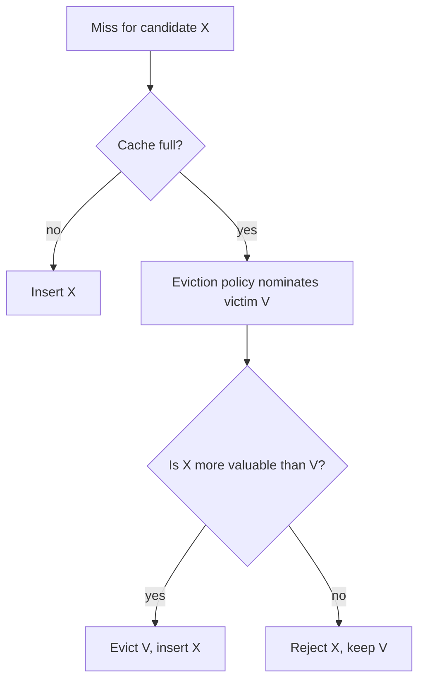
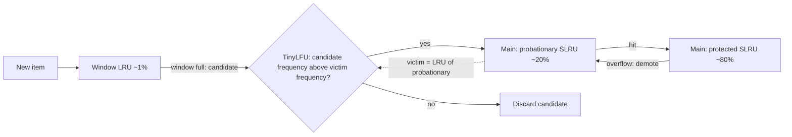

# Admission control and TinyLFU: count-min sketch, doorkeeper and W-TinyLFU

## Learning objectives

After studying this lesson you should be able to:

- Distinguish eviction (whom to remove) from admission (whether to insert a newcomer at all), and explain why admission matters for skewed workloads.
- Describe the TinyLFU admission rule and state the frequency-estimation problem it solves.
- Explain how a count-min sketch works, compute updates and estimates by hand, and state its one-sided error guarantee.
- Explain periodic reset (aging) and the doorkeeper Bloom filter, and what each saves.
- Describe the W-TinyLFU architecture (window, probationary, protected) and why the window exists.
- Sketch an implementation in Java and reason about memory cost, concurrency and adversarial behaviour.

## 1. Eviction answers the wrong half of the question

Every policy so far assumes that a missed item **must** enter the cache; the only decision is whom to throw out to make room. But consider an LRU cache of 1,000 entries under a skewed workload in which 1,000 items are very popular and millions of items are requested once. Every one-hit wonder is admitted (it must be: the policy has no choice) and displaces the least recently used entry, which might well be a popular item whose last request happened to be a while ago. The cache keeps trading a valuable item for a worthless one.

The remedy is an explicit **admission policy**: when a miss occurs and the cache is full, the eviction policy nominates a **victim**, but the cache first compares the **candidate** (the new item) with the victim and inserts the candidate only if it is judged more valuable. Otherwise, the candidate is dropped (served to the client but not cached), and the victim stays.



The question is how to estimate "value". **TinyLFU** (Einziger, Friedman and Manes, 2017) answers with **frequency**, estimated compactly over a long history, including items that are not currently cached. The admission rule is:

> Admit candidate X in place of victim V if and only if estimate(X) > estimate(V).

This resembles LFU, but there are two crucial differences: frequency is estimated for **all recently seen keys** (not just resident ones) using a tiny probabilistic structure, and it is used only for the **admission decision**, with the eviction ordering handled by a recency-based structure. The cache therefore gets LFU's protection against one-hit wonders and LRU's responsiveness.

## 2. The estimation problem

To compare a candidate with a victim we need the access frequency of an item that may have been absent from the cache for a while. We cannot afford a counter per distinct key ever seen (the key universe may be billions). We need a structure that:

1. uses memory roughly proportional to the cache size, not the key universe;
2. updates and queries in O(1);
3. forgets old history so that frequency reflects the **recent** past (aging);
4. has errors that are acceptable for ranking decisions.

The tool is the **count-min sketch**.

## 3. The count-min sketch

A **count-min sketch** (Cormode and Muthukrishnan) is a two-dimensional array of counters with d rows and w columns, plus d independent hash functions h_1, ..., h_d, one per row, each mapping a key to a column in [0, w).

- **Update(x)**: for each row i, increment counter[i][h_i(x)].
- **Estimate(x)**: return the **minimum** over rows i of counter[i][h_i(x)].

Collisions can only **add** to a counter (other keys landing in the same cell), never subtract. Every cell for x therefore holds at least x's true count, so the estimate is never below the true count: the error is **one-sided overestimation**. The minimum across rows picks the row where x suffered the least interference, which is why the sketch works well: for x to be badly overestimated, all d rows must have collisions with heavy keys.

The standard guarantee: with width w = ceil(e / ε) and depth d = ceil(ln(1 / δ)), the estimate exceeds the true count by at most ε · N (where N is the total number of updates) with probability at least 1 − δ. For example, ε = 0.01 and δ = 0.01 gives w = 272 and d = 5: 1,360 counters, regardless of how many distinct keys appear. The guarantee is in terms of the total count N, which is why aging (keeping N bounded) matters.

### Worked example by hand

Use d = 3 rows and w = 6 columns. Suppose the hash functions map the keys as follows (column index per row):

| Key | Row 1 | Row 2 | Row 3 |
| --- | ----- | ----- | ----- |
| A   | 0     | 2     | 4     |
| B   | 1     | 2     | 5     |
| C   | 0     | 3     | 4     |

Process the stream `A A A B B C` (A three times, B twice, C once). Counters after all updates:

| Row | col 0       | col 1  | col 2       | col 3  | col 4       | col 5  |
| --- | ----------- | ------ | ----------- | ------ | ----------- | ------ |
| 1   | 4 (A3 + C1) | 2 (B2) | 0           | 0      | 0           | 0      |
| 2   | 0           | 0      | 5 (A3 + B2) | 1 (C1) | 0           | 0      |
| 3   | 0           | 0      | 0           | 0      | 4 (A3 + C1) | 2 (B2) |

Estimates:

- A = min(row1[0] = 4, row2[2] = 5, row3[4] = 4) = **4** (true count 3, overestimated by collisions with C and B).
- B = min(row1[1] = 2, row2[2] = 5, row3[5] = 2) = **2** (exact; the collision with A in row 2 was ignored thanks to the minimum).
- C = min(row1[0] = 4, row2[3] = 1, row3[4] = 4) = **1** (exact, because row 2 had no collision).

Now apply admission. A cache holds A (victim candidate) and C arrives as a candidate: estimate(C) = 1 versus estimate(A) = 4, so C is rejected. Even with the 33 percent error on A, the decision is right, because the error is small relative to the gap. Sketches only misjudge when the true frequencies are close, and then the decision matters little.

### Compact counters

TinyLFU does not need large counts. Distinguishing "seen 15 or more times" from "seen 3 times" is enough for ranking purposes, and old history should fade. So each counter can be **4 bits**, saturating at 15. Sixteen 4-bit counters fit in one 64-bit word, making the sketch cache-line friendly: on a single access, all d counters can be arranged to live in the same cache line or word block, so the cost is similar to one memory access. For a cache of N entries, a sketch with a few times N counters (for example 4 rows of width proportional to N) of 4 bits each occupies on the order of a handful of bits per cache entry: a megabyte or two for a million-entry cache, far smaller than a ghost list holding the keys themselves.

## 4. Freshness: periodic reset

If counters only grow, the sketch becomes saturated and reflects all-time popularity, reintroducing LFU's staleness problem. TinyLFU applies **aging** by counting the total number of increments since the last reset. When this reaches the **sample size** W (a parameter, typically a small multiple of the cache capacity such as 10 times), it **halves every counter** (shift right by one bit) and resets the increment count to W/2 (conceptually, the oldest half of the information fades).

### Worked example of reset

Suppose W = 10 and counters for A, B, C are 4, 2, 1 (as above, ignoring collisions). Suppose the stream length since the last reset reaches 10. Halving gives A = 2, B = 1, C = 0 (integer division). Now a newly popular key D that receives 3 requests quickly overtakes A's aged count of 2 if A is not requested again. A key that was hot long ago decays by half each period, so after j periods its counter is count / 2^j: a count of 15 becomes 0 after four resets without any new hits. This is an exponential decay with a half-life of about W/2 operations: a nice, cheap approximation of recency-weighted frequency.

**Choosing W.** Larger W gives more accurate frequency estimates and a longer memory but slower adaptation. Smaller W reacts faster but yields noisier estimates (especially because frequencies cannot exceed W per period). Cache implementers typically set W in proportion to the cache size.

## 5. The doorkeeper

Most keys in skewed traces are seen once. Giving each such key a sketch counter (albeit small) wastes capacity: they raise counts through collisions without ever mattering. The **doorkeeper** is a small **Bloom filter** placed in front of the sketch:

- On an access to x: if x is **not** in the doorkeeper, insert x into the doorkeeper and **do not** touch the sketch. If x **is** in the doorkeeper, increment the sketch.
- When estimating x: add 1 if x is in the doorkeeper to the sketch value (the doorkeeper represents the first sighting).
- At reset time, clear the doorkeeper along with halving the sketch.

A Bloom filter is a bit array with k hash functions that supports "add" and "might contain" (false positives possible, false negatives impossible). The effect: one-hit wonders never reach the sketch, so the sketch stores only items seen at least twice, and its counters can be smaller or the sketch can be narrower for the same accuracy. The doorkeeper costs a few bits per cache entry and a modest increase in complexity.

Because the doorkeeper is cleared at reset, an item seen once before the reset and once after is treated as new again. That is a small approximation, in keeping with the sketch's purpose.

## 6. W-TinyLFU: adding a window

Pure TinyLFU admission has a weakness. A new item starts with a frequency estimate of 0 or 1, whereas the victim, an established item, has a larger count. Therefore a **genuinely new burst of popularity** is rejected until the item has accumulated enough history, and since rejected items are not cached, they do not get hits that raise their counts in a "cached" sense (although the sketch still counts the requests). For workloads with **bursty** access (a news item goes viral, a hot new product), this delays admission and loses hits. Recency matters too.

**W-TinyLFU** (Window TinyLFU) fixes this by dividing the cache into a small **window** and a larger **main** region:

- **Window cache**: a small LRU (around 1 percent of capacity in the standard configuration) where every new item is admitted unconditionally. It absorbs bursts and gives new items time to show their popularity.
- **Main cache**: an SLRU (segmented LRU, as in the previous lesson), typically with 20 percent probationary and 80 percent protected segments.
- **Admission filter**: the TinyLFU sketch (with doorkeeper and aging). When the window is full, its LRU item becomes the **candidate**; the **victim** is the LRU item of the main cache's probationary segment. The candidate is admitted into the probationary segment only if its estimated frequency is greater than the victim's; otherwise the candidate is discarded. Items in probationary that are hit again are promoted to protected, as in SLRU.



Every request, hit or miss, records the key in the frequency sketch (so that frequency reflects demand, not just cached hits).

### Worked example: admission decisions

Suppose the cache capacity is 100: window 1, probationary 20, protected 79 (illustrative proportions). A scan of fresh items arrives. Each fresh item enters the window; when the next fresh item arrives, the previous becomes the candidate and is compared with the probationary victim, an item with frequency estimate of, say, 3 (it has been requested several times). The candidate's estimate is 1 (just seen). 1 > 3 is false, so the candidate is discarded. The scan churns through the window and never displaces the main cache. Contrast with LRU, where the scan would have evicted everything.

Now a genuinely hot new item X: it enters the window and, being popular, receives several requests while in the window (hits in the window raise its sketch count, say to 4). When it reaches the window's end, its estimate 4 exceeds a probationary victim's estimate of 3, so X is admitted. If X had been rejected by a pure TinyLFU with no window, its requests would have all been misses, and it would have needed accumulated history across misses before admission. The window gives it the chance to prove itself in the cache.

### Reported behaviour

The authors' evaluation, and production use in the Caffeine library for Java (which implements W-TinyLFU), report hit ratios that are consistently near the best of recency-oriented and frequency-oriented policies across many traces, with performance close to ARC and LIRS on database and search traces while using much less metadata, and good behaviour on skewed web-like workloads. Treat these as findings from published evaluations on particular traces; as always, measure on your own workload. Some implementations also tune the window size dynamically (shrinking or growing it by hill climbing on observed hit ratio), because the best window fraction differs between recency-heavy and frequency-heavy workloads.

## 7. Implementation sketch

A minimal count-min sketch with saturating 4-bit-like counters (here simplified to bytes for clarity) and halving reset:

```java
final class FrequencySketch {
    private static final int DEPTH = 4;
    private final byte[][] table;       // each counter 0..15
    private final int width;            // power of two
    private final int sampleSize;       // reset threshold W
    private int additions;

    FrequencySketch(int cacheCapacity) {
        this.width = Integer.highestOneBit(Math.max(16, cacheCapacity)) << 1;
        this.table = new byte[DEPTH][width];
        this.sampleSize = 10 * cacheCapacity;
    }

    private int index(int row, int hash) {
        // derive per-row hash by mixing; real code uses better independent mixing
        int h = (hash + row * 0x9E3779B9) * 0x85EBCA6B;
        h ^= (h >>> 15);
        return h & (width - 1);
    }

    int estimate(Object key) {
        int h = key.hashCode(), min = 15;
        for (int r = 0; r < DEPTH; r++) min = Math.min(min, table[r][index(r, h)]);
        return min;
    }

    void record(Object key) {
        int h = key.hashCode();
        boolean grew = false;
        for (int r = 0; r < DEPTH; r++) {
            int i = index(r, h);
            if (table[r][i] < 15) { table[r][i]++; grew = true; }
        }
        if (grew && ++additions >= sampleSize) reset();
    }

    private void reset() {              // halve every counter: ageing
        for (byte[] row : table)
            for (int i = 0; i < row.length; i++) row[i] >>= 1;
        additions /= 2;
    }
}

boolean admit(FrequencySketch s, Object candidate, Object victim) {
    return s.estimate(candidate) > s.estimate(victim);
}
```

A production version packs sixteen 4-bit counters into each `long`, derives its indices from a single good hash of the key (spreading the hash first to defeat poor `hashCode` implementations), keeps the counters for one key within a block to limit cache misses, and uses conservative updates (increment only the minimum counters) to reduce overestimation.

In C++ the structure is the same with `std::uint64_t` words, bit shifts for packing, and `__builtin_popcountll`-style tricks if needed for halving (a mask and shift halves all sixteen nibbles at once: `(word >> 1) & 0x7777777777777777`).

### Design considerations

- **Hashing quality matters.** If keys' hash codes are poor or clustered (consecutive integers), the sketch's independence assumptions fail and errors rise. Always apply a strong mixing function.
- **Concurrency.** Recording every access on every read is hot. Concurrent implementations buffer accesses in per-thread or striped ring buffers and apply them to the sketch and policy lists in batches by a maintenance task, accepting that some accesses may be dropped under contention (a lossy but harmless approximation).
- **Adversarial input.** An attacker who can choose keys may try to craft collisions to inflate a victim's counters or to make useful items look unpopular (a "hash flooding" style attack). Mitigations: randomized hash seeds, and introducing a small element of randomness in admission decisions in some implementations so that an attacker cannot deterministically exploit the rule. For caches on public-facing endpoints this is worth considering.
- **Memory accounting.** The sketch grows with the configured capacity, not with the key universe: a significant advantage over ghost-list policies like ARC when keys are large.
- **Variable sizes.** With byte-sized capacity, the candidate may be larger than the victim and require evicting several victims; the admission rule should then compare the candidate against the combined value of the victims or use a size-aware rule. See the lesson on size-aware and cost-aware eviction.

## 8. Where admission fits in the larger picture

Admission control is not unique to TinyLFU. CDNs often admit an object only on its second request ("cache on second hit", implemented with a Bloom filter, closely related to the doorkeeper), because a large fraction of requested objects are one-hit wonders and writing them to disk wastes flash endurance and capacity. Flash caches for the same reason apply admission policies to reduce writes. The unifying principle: **space and write bandwidth are precious; do not spend them on items that have not shown evidence of reuse.**

## Common pitfalls

- **Treating the sketch as exact.** It overestimates; do not use it for billing or limits where exact counts are needed.
- **Never resetting.** The sketch saturates and acts like LFU with all its staleness problems.
- **Using a window of 0 for bursty workloads**, so that new popular items cannot enter.
- **Poor hash mixing**, giving correlated rows and a degenerate sketch.
- **Recording accesses only on hits.** The sketch must see misses too, since rejected candidates need their frequency to grow.
- **Comparing against the wrong victim.** The victim must be the entry that would actually be evicted by the main policy.
- **Ignoring adversarial keys** on a public endpoint.
- **Over-trusting benchmark hit ratios** from other workloads; replay your own trace.

## Check your understanding

1. What is the difference between an eviction policy and an admission policy? Why is admission valuable under a Zipf-like workload with many one-hit wonders?
2. State the TinyLFU admission rule.
3. In a count-min sketch with d = 3 rows, a key's three counters read 7, 3 and 5. What is its estimate, and can the true count be higher than the estimate? Lower?
4. Why are 4-bit counters enough, and what does halving all counters at the sample size W accomplish?
5. What does the doorkeeper do, and how does it change which items touch the sketch?
6. Why does W-TinyLFU add a window in front of the main cache?

## Answers

1. Eviction picks whom to remove given that a newcomer must be inserted; admission decides whether the newcomer should be inserted at all, comparing it with the would-be victim. With many one-hit wonders, forced admission lets worthless items displace valuable ones; an admission policy rejects candidates with low estimated frequency, preserving the working set.
2. Admit the candidate (replacing the eviction policy's victim) only if the estimated frequency of the candidate is greater than the estimated frequency of the victim; otherwise discard the candidate.
3. The estimate is the minimum, 3. The true count cannot be higher than 3 (collisions only add), but it can be lower, because the 3 may include collisions from other keys.
4. Ranking only needs coarse, saturating counts (distinguish few from many), so 4 bits (0 to 15) suffice and keep the sketch tiny. Halving at W operations ages the history (exponential decay), so frequencies reflect the recent past and old hot items fade.
5. The doorkeeper is a Bloom filter recording first sightings. A first access sets doorkeeper bits and does not touch the sketch; subsequent accesses increment the sketch. Thus one-hit wonders never occupy the sketch, and its capacity is focused on items seen at least twice.
6. A new item has little recorded frequency and would be rejected by the filter before it can demonstrate popularity. The window admits every new item unconditionally for a short time, letting bursty, genuinely hot items accumulate hits and frequency before facing the admission contest, which captures recency that pure frequency admission misses.

## Summary

Eviction chooses a victim; admission decides whether a newcomer deserves a slot at all. TinyLFU admits a candidate only if its estimated frequency exceeds the victim's, using a count-min sketch of small saturating counters whose estimates never undercount. Periodic halving ages the history, and a doorkeeper Bloom filter keeps one-hit wonders out of the sketch. W-TinyLFU adds a small LRU window to give new items a chance to prove themselves and uses a segmented LRU for the main region, yielding scan resistance, responsiveness to bursts and tiny metadata. Practical concerns include hash quality, buffered concurrent recording, adversarial keys and variable item sizes. The final lesson of the chapter covers size-aware and cost-aware eviction and how to measure all these policies honestly.
