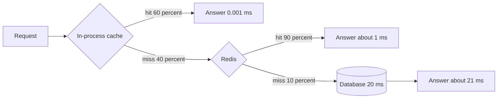

# Locality, hit ratio and average access time

## Learning objectives

After studying this chapter you should be able to:

- Explain why caches work at all, using the principles of temporal and spatial locality.
- Define hit ratio, miss ratio, hit time and miss penalty precisely, and distinguish request hit ratio from byte hit ratio.
- Compute the average memory access time (AMAT) of a single-level and a two-level cache by hand.
- Derive the break-even hit ratio below which a cache makes things slower.
- Classify misses as compulsory, capacity, conflict or coherence misses, and say what remedy each one has.
- Reason about how sensitive a backend is to small changes in the miss ratio.

## 1. A cache is a bet on the future

Every computer system is built from components that differ enormously in speed and size. A CPU register is read in a fraction of a nanosecond. Main memory takes on the order of a hundred nanoseconds. A solid-state disk is on the order of tens to hundreds of microseconds. A round trip inside a data centre is on the order of a few hundred microseconds to a millisecond. A round trip across an ocean is on the order of a hundred milliseconds. These are order-of-magnitude figures, and the exact numbers shift with every hardware generation, but the shape is permanent: **fast storage is small and expensive, large storage is slow and cheap**, and the gaps between the levels span many orders of magnitude.

A cache is the engineering response to that shape. It places a small, fast store in front of a large, slow store and keeps copies of the data that is most likely to be requested again. When the request finds its data in the small store we call it a **hit** and pay only the small store's price. When it does not, we call it a **miss**, and we pay the large store's price plus the small store's lookup cost, plus whatever it costs to install the copy.

Notice the word _likely_. A cache never knows what will be requested next. It makes a bet, using the recent past as the only evidence. The entire discipline of caching, from CPU cache design to CDN configuration, is the study of how to make that bet well, how to measure whether it paid off, and what to do when it did not.

This chapter builds the vocabulary and the arithmetic. Later chapters, including the lessons on eviction, on invalidation and on stampedes, assume you can do the calculations here without hesitation.

## 2. Why the bet usually pays: locality

Caching works because real access patterns are not random. Programs, users and networks exhibit **locality of reference**, which comes in two main flavours.

### 2.1 Temporal locality

**Temporal locality** says: if a piece of data was referenced recently, it is likely to be referenced again soon. A loop counter is touched on every iteration. A popular product page is requested by thousands of shoppers within the same minute. A user who opens a document will probably reopen it within the hour. A hot news article is read heavily for a day and then almost never.

Temporal locality is what justifies keeping an item after you have used it once. Eviction policies such as least recently used (LRU) are direct bets on temporal locality: they assume that the item untouched for the longest time is the least likely to be touched next.

### 2.2 Spatial locality

**Spatial locality** says: if a piece of data was referenced, data stored near it is likely to be referenced soon. Reading element 17 of an array makes elements 18, 19 and 20 likely candidates. Reading one row of a table often leads to reading adjacent rows. Loading one image on a page implies the page's other images are coming.

Spatial locality is what justifies **fetching more than was asked for**. A CPU does not load a single byte from memory; it loads a _cache line_, commonly 64 bytes. A disk does not read one byte; it reads a block. A database page holds many rows. A web application that loads a user also loads the user's profile settings in the same call, because the next request will probably want them. A related technique is **prefetching**, where the system speculatively fetches data it predicts will be needed.

Spatial locality in application caches is less about memory addresses and more about _relatedness_: items that are requested together. A product listing page requests twenty products; caching the whole listing as one object exploits that relatedness.

### 2.3 Other regularities

Two further regularities deserve a name because they matter later.

- **Popularity skew.** A small fraction of items receives a large fraction of requests. This is not quite the same as temporal locality: a popular item may be requested at perfectly regular intervals, and it is popularity, not recency, that makes it worth caching. We will quantify it with the Zipf distribution in the next chapter, Workloads, working sets and capacity.
- **Sequential scans.** Some workloads touch each item once, in order, and never again. A full table scan or a backup job has strong spatial locality but zero temporal locality. Such workloads are poison for naive caches because they push out useful data with data that will never be read again. We will meet this problem under the name _cache pollution_.

If your workload has no locality, a cache cannot help you. A system that reads each of a billion records exactly once will see a hit ratio of zero no matter how big the cache is. Establishing that locality exists is therefore the first step of any caching decision.

## 3. Measuring a cache: the vocabulary

Let us now define terms carefully, because the sloppy use of these words causes many arguments.

- **Hit**: a request whose data is found in the cache and is acceptable to return.
- **Miss**: a request that cannot be served from the cache and must go to the next level (the _backing store_ or _origin_).
- **Hit ratio** _h_: the fraction of requests that are hits. It lies between 0 and 1. Over a window of _N_ requests with _H_ hits, h = H / N.
- **Miss ratio** _m_: 1 − h.
- **Hit time** t_c: the time to serve a hit, including the lookup itself.
- **Miss penalty** t_d: the _additional_ time a miss costs beyond the lookup. In application caching it is usually the latency of the backing store, such as a database query.

The words "acceptable to return" in the definition of a hit are important. In a cache with expiry, an entry that is present but expired is not a hit. In a cache with invalidation, an entry that is present but known to be stale is not a hit. Different systems draw this line in different places, which is exactly why you must state your definition when you quote a number.

### 3.1 Request hit ratio versus byte hit ratio

There are two common ways to count, and they can differ wildly. The **request hit ratio** counts every request equally. The **byte hit ratio** weights each request by the number of bytes served.

Consider a CDN edge serving 1,000 requests. Nine hundred are for small icons and scripts of 10 KB each, all hits. One hundred are for large video segments of 5,000 KB (5 MB) each, all misses.

- Request hit ratio: 900 / 1,000 = 0.90, or 90 percent.
- Bytes served from the cache: 900 × 10 KB = 9,000 KB.
- Bytes fetched from origin: 100 × 5,000 KB = 500,000 KB.
- Total bytes: 509,000 KB.
- Byte hit ratio: 9,000 / 509,000 = 0.0177, or about 1.8 percent.

Both numbers are correct. They answer different questions. If your concern is latency per request, the request hit ratio matters. If your concern is origin bandwidth, which you pay for, the byte hit ratio is the one to watch. Quoting "90 percent hit ratio" to a finance team that pays for origin egress would be badly misleading here. Always ask: hit ratio _of what_?

### 3.2 Hit ratio is a property of a workload, not of a cache

It is tempting to say "our cache has a 95 percent hit ratio" as if it were a specification of the cache, like its memory size. It is not. The same cache, with the same size and the same eviction policy, can have a 99 percent hit ratio on Monday and a 60 percent hit ratio on Tuesday when a marketing campaign sends traffic to a different set of items. Hit ratio emerges from the interaction between the _cache design_ and the _workload_. Whenever you read a hit ratio, ask under what traffic it was measured, over what window, and whether it includes the warm-up period.

## 4. Average memory access time

The most important single formula in caching is the **average memory access time**, AMAT. The name comes from computer architecture, but it applies verbatim to application caches, to CDNs and to database buffer pools.

Every request pays the lookup cost t_c. A fraction m of requests additionally pays the miss penalty t_d. Therefore:

```
AMAT = t_c + m * t_d
     = t_c + (1 - h) * t_d
```

Some textbooks write AMAT = h·t_hit + m·t_miss, where t_miss = t_c + t_d. Expanding gives the same thing: h·t_c + (1−h)(t_c + t_d) = t_c + (1−h)·t_d. We will use the first form because it separates the fixed cost from the variable cost.

### 4.1 Worked example: a Redis cache in front of a database

Suppose a lookup in the cache takes 1 ms (network round trip plus processing), and a database query takes 20 ms. Without a cache, every request costs 20 ms.

At a hit ratio of 90 percent:

```
AMAT = 1 + 0.10 * 20 = 1 + 2 = 3 ms
```

The speedup compared to 20 ms is 20 / 3 = 6.67 times.

At 50 percent:

```
AMAT = 1 + 0.50 * 20 = 11 ms         (speedup 1.82x)
```

At 95 percent:

```
AMAT = 1 + 0.05 * 20 = 2 ms          (speedup 10x)
```

At 99 percent:

```
AMAT = 1 + 0.01 * 20 = 1.2 ms        (speedup 16.7x)
```

Plot these in your mind. Going from 50 to 90 percent saves 8 ms. Going from 90 to 99 percent saves only 1.8 ms. The curve flattens, because the floor is the lookup time t_c = 1 ms; no hit ratio can bring AMAT below it. This is the first lesson of the arithmetic: **returns diminish**, and the lookup cost becomes the bottleneck as the hit ratio approaches 1.

### 4.2 The average hides the tail

The average is useful, but users do not experience averages. They experience individual requests, and an individual request is either a 1 ms hit or a 21 ms miss. With h = 0.9, one request in ten takes 21 ms. If a single page view makes thirty such calls, the probability that _none_ of them miss is 0.9 to the thirtieth power, which is about 0.042. Four percent of page views are entirely fast, and ninety-six percent contain at least one slow call. Page latency is dominated by the slowest call. This is why, for latency-sensitive systems, we examine percentiles (p95, p99) and why a hit ratio that looks excellent can still produce a mediocre user experience. High fan-out amplifies the miss ratio.

### 4.3 Break-even: when does a cache make things slower?

A cache is not free. Every request pays t_c, even those that miss. For the cache to be worthwhile, AMAT must be below the uncached time t_d:

```
t_c + (1 - h) * t_d  <  t_d
t_c                  <  h * t_d
h                    >  t_c / t_d
```

So the **break-even hit ratio** is t_c / t_d. With t_c = 1 ms and t_d = 20 ms this is 0.05, so any hit ratio above 5 percent helps. That is a comfortable margin; this is why caching a slow database with a fast in-memory store is almost always a win on latency.

Now change the numbers. Suppose the backing store is itself fast, say a well-indexed key lookup of 5 ms, and the cache is a remote service at 1 ms. The break-even is 1 / 5 = 0.20. A workload with a hit ratio of 10 percent now gives:

```
AMAT = 1 + 0.90 * 5 = 5.5 ms  versus 5 ms uncached.
```

The cache made the system _slower_ by half a millisecond on average, while also costing money, memory and operational complexity. We will return to this in the chapter When to cache and when not to.

### 4.4 Two levels of cache

Real systems stack caches: a browser cache, a CDN, an in-process cache, a distributed cache, a database buffer pool. The AMAT formula nests. For two levels with lookup times t_1 and t_2, local miss ratios m_1 and m_2, and a final backing store with time t_d:

```
AMAT = t_1 + m_1 * ( t_2 + m_2 * t_d )
```

**Worked example.** An in-process cache (L1) with t_1 = 0.001 ms (1 microsecond) and a hit ratio of 60 percent. A remote Redis (L2) with t_2 = 1 ms and a hit ratio of 90 percent _of the requests that reach it_. A database with t_d = 20 ms.

```
inner  = t_2 + m_2 * t_d = 1 + 0.10 * 20 = 3 ms
AMAT   = 0.001 + 0.40 * 3 = 0.001 + 1.2 = 1.201 ms
```

Compare with Redis alone: 3 ms. The in-process level cut the average by 60 percent. But look at what has happened to the database. Only 40 percent of requests reach Redis and only 10 percent of those reach the database, so the database sees 0.4 × 0.1 = 4 percent of the traffic. Note carefully that the second level's _local_ hit ratio (90 percent) is of the traffic that reaches it, and the _global_ hit ratio of the pair is 1 − 0.04 = 96 percent. Mixing up local and global ratios is among the commonest mistakes in caching discussions.

Also notice a subtle effect: the L1 cache filters out the most repeated requests, which are the easiest hits. The traffic that reaches L2 has _weaker_ locality than the original stream, so L2's local hit ratio is usually lower than it would be if L2 were the only cache. Estimating L2's ratio in the presence of L1 requires measurement, not guesswork.



## 5. Sensitivity: why the miss ratio is the number to watch

When engineers celebrate "99 percent hit ratio" they are looking at the wrong end of the number. What the backing store feels is the **miss traffic**, which is request rate multiplied by miss ratio:

```
backend load = request rate * miss ratio
```

Suppose a service receives 10,000 requests per second and the database can handle 1,000 queries per second.

| Hit ratio | Miss ratio | Database load |
| --------- | ---------- | ------------- |
| 90 %      | 10 %       | 1,000 per s   |
| 95 %      | 5 %        | 500 per s     |
| 98 %      | 2 %        | 200 per s     |
| 99 %      | 1 %        | 100 per s     |

At 90 percent the database is exactly at capacity with zero headroom. A fall from 99 to 98 percent looks trivial in a dashboard that displays hit ratio, yet it **doubles** the database load, from 100 to 200 queries per second. A fall from 99 to 90 percent multiplies the load by ten. This non-linearity is why caches create dangerous dependencies: the system is provisioned on the assumption that the miss ratio stays low, and the database may be too small to survive if it does not. We will study this failure mode in depth in the chapter on stampedes and in the discussion of protecting the database.

The practical rule: **monitor the miss ratio and the backend load, not just the hit ratio**, and alert on changes in relative terms. A move from 1 percent misses to 2 percent is a 100 percent increase in backend traffic.

## 6. Why do misses happen? The classification

Computer architects classified cache misses into categories that were originally called the "three Cs" (compulsory, capacity, conflict); a fourth, coherence, is added for multi-cache systems. The classification is useful because each category has a different cure.

### 6.1 Compulsory misses (cold misses)

A **compulsory miss** happens the first time an item is ever requested. The cache cannot have it, because it has never seen it. These are unavoidable _for a given cache that starts empty_, hence the name. They are the dominant cost for workloads where items are rarely re-read.

Remedies: prefetching and **pre-warming**. If you can predict what will be asked for, you can load it before the first request. Larger fetch units (exploiting spatial locality) turn some future compulsory misses into hits. Pre-warming matters especially after a deploy or a cache restart, an issue we examine in the lesson on cold starts.

A quantitative example: a program streams through an array of 4-byte integers with a cache line of 64 bytes. Each line holds 16 integers. The first access to each line misses and the next 15 hit, so the miss ratio is 1 / 16 = 6.25 percent, entirely compulsory. Doubling the line size to 128 bytes halves the miss ratio to 3.125 percent for this access pattern, which is spatial locality at work. (Larger lines are not free, since they take longer to transfer and can evict more useful data, which is why line sizes are a compromise rather than as large as possible.)

### 6.2 Capacity misses

A **capacity miss** happens because the cache is too small to hold the working set. The item was in the cache once, was evicted to make room, and was requested again afterwards. Had the cache been larger, it would have survived.

Remedy: more memory, a smarter eviction policy, or storing smaller objects (compression, trimming fields, caching ids rather than entire entities). Capacity misses are the ones that respond to the sizing calculations in the next chapter.

### 6.3 Conflict misses

A **conflict miss** arises when the cache's _placement rules_ force two items to compete for the same slot even though space exists elsewhere. This is classic in CPU caches: in a direct-mapped cache, each address maps to exactly one line, so two frequently used addresses with the same index keep evicting each other even if the rest of the cache is empty. Associativity reduces them.

In application caches the analogue is a **partitioned or sharded cache** with uneven load. If a consistent-hash ring places two very hot keys on the same node, that node may evict items prematurely or saturate its CPU while its neighbours sit idle. Likewise, a cache divided into per-tenant quotas can evict one tenant's useful data while another tenant's quota has space. The overall capacity is adequate, but the placement is not. Remedies: better hashing and rebalancing, more virtual nodes, shared pools instead of rigid partitions, and hot-key mitigation (see the lesson on hot keys).

### 6.4 Coherence (invalidation) misses

A **coherence miss** happens because a cached copy was deliberately discarded or declared invalid when the underlying data changed. In a multi-core CPU, one core's write invalidates the copies in other cores' caches. In an application, a write to the database deletes the cached entry, and the next read misses.

These misses are the price of correctness. Reducing them means reducing writes to cached data, or storing data that changes less often, or accepting staleness through longer TTLs. This is the central tension explored in the whole Invalidation, TTL and consistency chapter: every invalidation you perform buys freshness at the cost of a future miss.

### 6.5 Using the classification

Given a miss log, you can ask which category dominates and respond accordingly:

| Dominant miss type | Symptom                                             | Typical response                      |
| ------------------ | --------------------------------------------------- | ------------------------------------- |
| Compulsory         | Many first-time keys, low reuse                     | Pre-warm, prefetch, larger fetch unit |
| Capacity           | Hit ratio rises steadily as you add memory          | Add memory, compress, better policy   |
| Conflict           | Some nodes or partitions evict heavily, others idle | Rebalance, shared pool, hot-key split |
| Coherence          | Misses follow write bursts                          | Update instead of delete, longer TTL  |

A cheap diagnostic for capacity versus other types is to run the same trace through a simulated cache of double the size. If the hit ratio jumps, the misses were capacity misses. If it barely moves, they were compulsory or coherence misses and more memory would be wasted money.

## 7. Implementing the measurement

A cache that does not report its own hit ratio is a black box. Instrument at least: hits, misses, evictions, expirations, bytes used, and the latency of both paths. The following Java sketch shows a minimal wrapper that counts what you need, using atomic counters.

```java
final class MeasuredCache<K, V> {
    private final Map<K, V> store = new ConcurrentHashMap<>();
    private final LongAdder hits = new LongAdder();
    private final LongAdder misses = new LongAdder();

    V get(K key, Function<K, V> loader) {
        V v = store.get(key);
        if (v != null) { hits.increment(); return v; }
        misses.increment();
        V loaded = loader.apply(key);      // the miss penalty is paid here
        if (loaded != null) store.put(key, loaded);
        return loaded;
    }

    double hitRatio() {
        long h = hits.sum(), m = misses.sum();
        return (h + m) == 0 ? 0.0 : (double) h / (h + m);
    }
}
```

This is deliberately naive. It has no size bound and no expiry, and concurrent misses on the same key will all call the loader (a defect we fix in the stampede chapter). But it makes the point: measurement is a few lines of code and it should exist from day one.

In C++ the same idea is a pair of `std::atomic<uint64_t>` counters incremented on each path:

```cpp
struct Stats {
    std::atomic<uint64_t> hits{0}, misses{0};
    double hit_ratio() const {
        uint64_t h = hits.load(), m = misses.load();
        return (h + m) ? double(h) / double(h + m) : 0.0;
    }
};
```

When you report a hit ratio, report it over a sliding window (for example the last five minutes), not as a lifetime average. A lifetime average hides a recent collapse behind months of history.

## 8. Common pitfalls

1. **Quoting hit ratio without saying of what.** Request versus byte ratios can differ by a factor of fifty, as in the CDN example above.
2. **Confusing local and global hit ratios in multi-level caches.** A 90 percent hit ratio at L2 does not mean 90 percent of traffic avoids the database.
3. **Measuring after warm-up only.** A system that is perfect when warm and catastrophic when cold is not a healthy system. Measure and plan for the cold case.
4. **Ignoring the lookup cost.** The cache is a network call. For fast backends, t_c is not negligible, and the break-even ratio t_c / t_d can be high.
5. **Watching hit ratio instead of backend load.** The same percentage change means very different things depending on request rate and backend headroom.
6. **Assuming locality without evidence.** Replaying a real access log through a cache simulator takes an afternoon and will tell you more than any intuition.
7. **Measuring a cache through the one workload you tested.** Hit ratio depends on the workload; a load test with uniformly random keys will under-report real hit ratios, while one that repeats a single key will over-report them.

## 9. Check your understanding

1. A cache lookup takes 2 ms and the backing store takes 30 ms. What is the AMAT at a hit ratio of 80 percent, and what is the break-even hit ratio?
2. A CDN serves 2,000 requests. 1,500 are hits of 20 KB each. 500 are misses of 1,000 KB each. Compute the request hit ratio and the byte hit ratio.
3. An L1 cache with lookup 0.01 ms and hit ratio 70 percent sits in front of an L2 with lookup 2 ms and local hit ratio 80 percent, in front of a store at 40 ms. Compute the AMAT and the fraction of requests that reach the backing store.
4. A service handles 20,000 requests per second. Its database can handle 600 queries per second. What is the minimum hit ratio that keeps the database within capacity?
5. A cache evicts an item because it is full, and the item is requested again ten seconds later. Which miss category is this, and how would you test your answer?
6. Give one example of a conflict miss in a distributed application cache and one remedy.

## 10. Answers

1. AMAT = 2 + 0.2 × 30 = 2 + 6 = 8 ms. Break-even h = 2 / 30 = 0.0667, about 6.7 percent.
2. Request hit ratio = 1,500 / 2,000 = 75 percent. Bytes hit = 1,500 × 20 = 30,000 KB. Bytes missed = 500 × 1,000 = 500,000 KB. Total = 530,000 KB. Byte hit ratio = 30,000 / 530,000 = 5.66 percent.
3. Inner = 2 + 0.2 × 40 = 2 + 8 = 10 ms. AMAT = 0.01 + 0.3 × 10 = 3.01 ms. Fraction reaching the store = 0.3 × 0.2 = 0.06, or 6 percent.
4. Allowed miss traffic is 600 per second out of 20,000, a miss ratio of 0.03. The hit ratio must be at least 97 percent. In practice you want headroom well above that.
5. A capacity miss (the item was evicted for lack of space). Test by replaying the trace through a simulated cache of twice the size; if the item now survives and the hit ratio improves, it was capacity. If it still misses, suspect other causes, for example expiry or invalidation.
6. A consistent-hash ring places two very hot keys on one node, which saturates or evicts aggressively while others are idle. Remedies: more virtual nodes, key splitting, or replicating hot keys across nodes.

## 11. Summary

Caches work because real workloads exhibit temporal locality, spatial locality and popularity skew. A hit ratio is a measured property of a workload and cache together, and you must say whether it counts requests or bytes. The core formula is AMAT = t_c + (1 − h) × t_d, which yields a break-even hit ratio of t_c / t_d and shows diminishing returns as h approaches 1. Multi-level caches nest the formula, and local and global ratios must not be confused. The backend feels the miss traffic, which is non-linear in the miss ratio, so watch misses and backend load rather than celebrating a high hit ratio. Misses are compulsory, capacity, conflict or coherence, and each has a different remedy. The next chapter, Workloads, working sets and capacity, uses these tools to ask how big a cache must be and what a given cache can possibly achieve.
