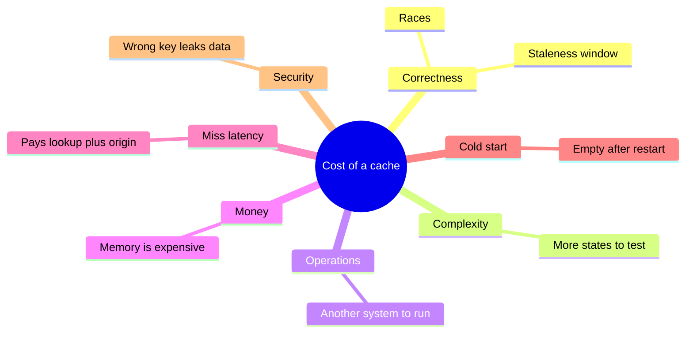
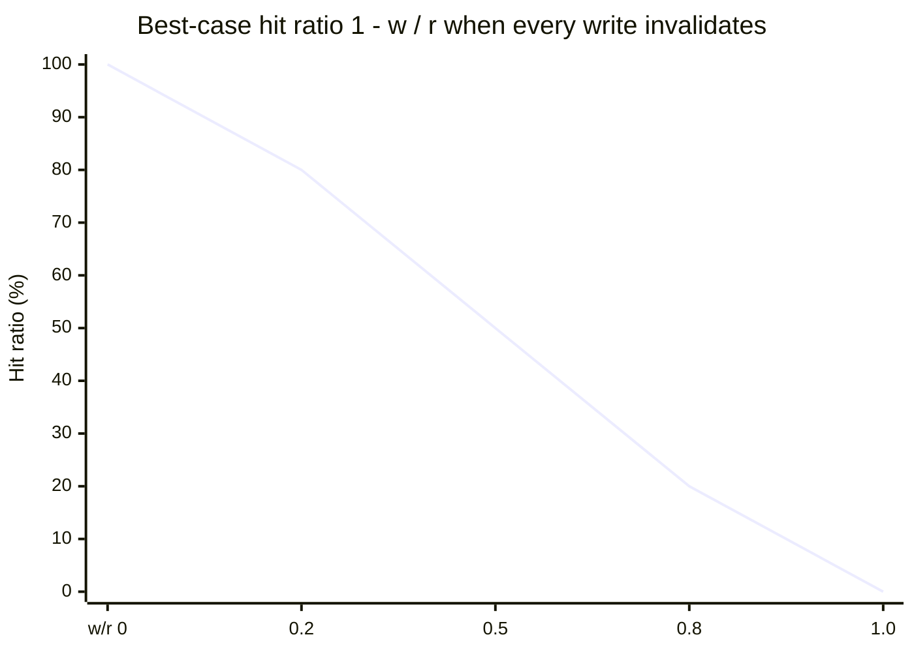
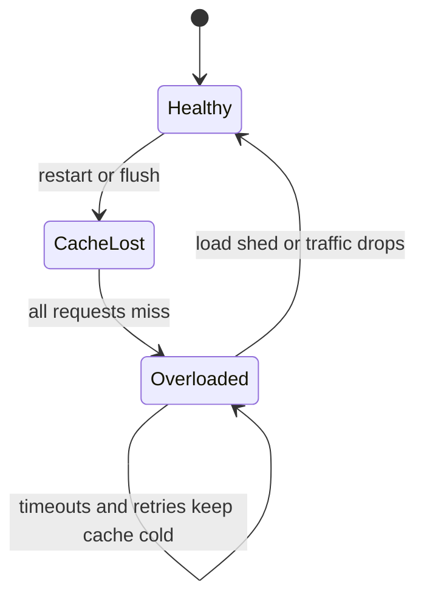
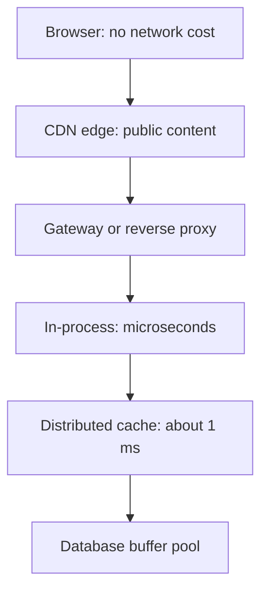
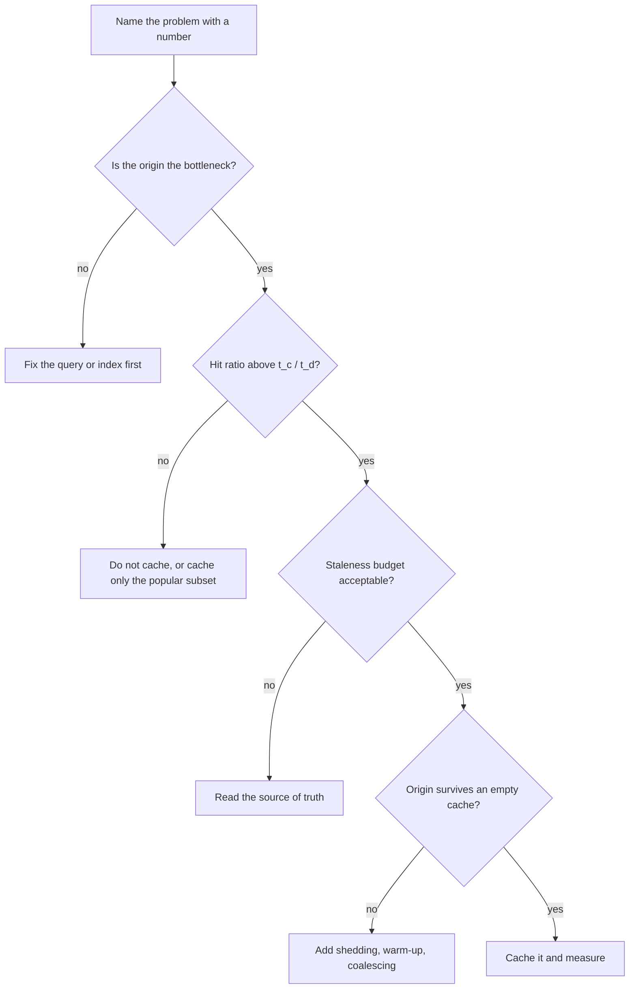
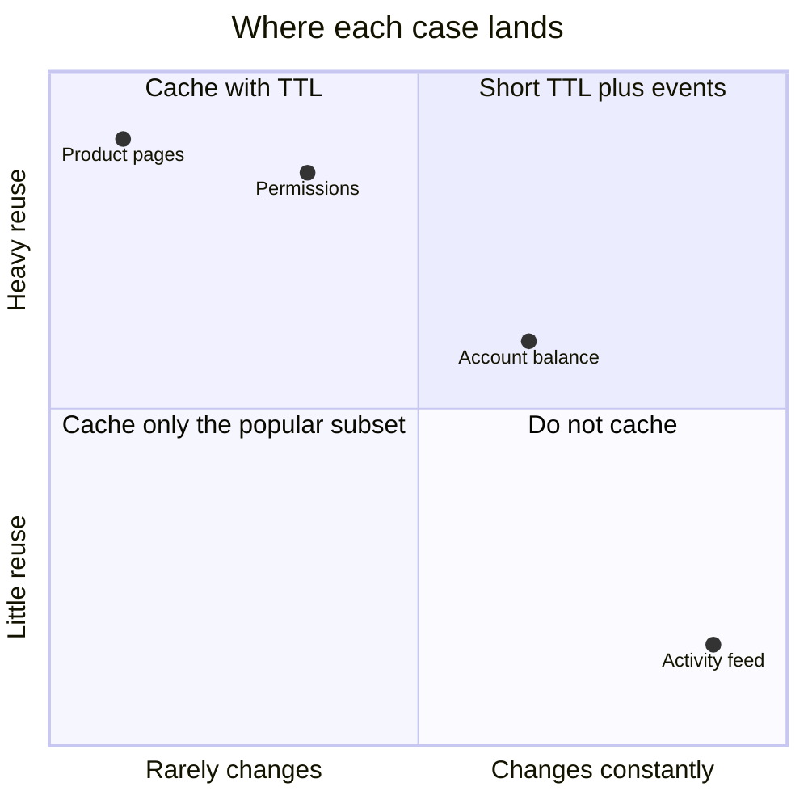
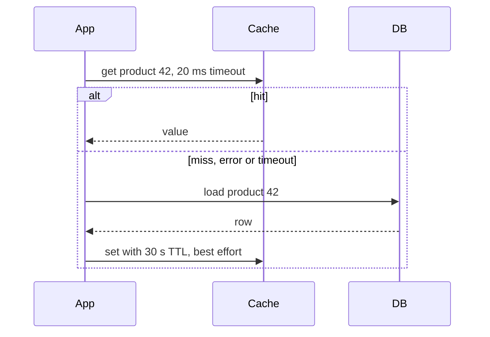

# When to cache and when not to

## Learning objectives

After studying this chapter you should be able to:

- List the full cost of a cache, beyond memory, and explain why caching is a trade rather than a free speedup.
- Identify the workloads for which caching hurts: low hit ratio, high write rate, strict correctness needs and unique-per-request data.
- Explain how a cache can turn a performance optimisation into a hard availability dependency.
- Choose among alternatives to caching: indexing, query optimisation, read replicas, precomputation and denormalisation.
- Apply a structured "should I cache this?" checklist and justify each answer with numbers.
- Pick a sensible cache granularity and location for a given problem.

## 1. The most common mistake is caching too early

Students of systems often meet caching as a miracle: add a few lines, and a slow page becomes fast. Experienced engineers meet it as a liability: add a few lines, and a month later a customer sees someone else's order history, or the database falls over during a restart, or nobody can explain why an update takes ten minutes to appear.

There is an old saying, often attributed to Phil Karlton, that there are only two hard things in computer science: cache invalidation and naming things. Whatever its origin, the sentiment is well founded. A cache creates a **second copy of the truth**, and two copies can disagree. Every use of a cache is therefore a deliberate decision to accept the disagreement risk in exchange for something else, usually speed or lower load. The earlier chapters taught you how to calculate the benefit side. This chapter teaches you to account for the cost side and to decide.

## 2. The full price of a cache

Let us enumerate the costs honestly.



### 2.1 Correctness cost: staleness and races

A cached value can be older than the source of truth. For how long and with what consequence is the central design question. Even with explicit invalidation, races between readers filling the cache and writers invalidating it can leave stale data indefinitely. The chapters on Invalidation, TTL and consistency explore these in detail. For now: **every cache adds a staleness window**, and you must be able to state its maximum duration and justify why users can live with it.

### 2.2 Complexity cost: more code, more states

A system with a cache has more states than one without: present, absent, expired, being refilled, negative, evicted, stale. Each state needs tests, metrics and operational understanding. Debugging becomes harder because a bug may be in the data, in the cache, or in the interaction of the two. "Is the cache wrong, or is the database wrong?" becomes the first question of every incident.

### 2.3 Operational cost: another system to run

An external cache (Redis, Memcached) is a service that needs capacity planning, monitoring, upgrades, security, backups or deliberate non-backups, network policy and on-call rotation. An in-process cache is simpler but consumes application memory and garbage collector time, and each instance holds a different copy.

### 2.4 Memory and money

Memory is the expensive resource of the data centre. A cache holding 500 GB of data on instances priced for memory may cost more per month than the database it protects. Calculating the saving (smaller database, fewer replicas, lower latency, avoided downtime) against that cost is part of the decision.

### 2.5 Latency cost on misses

As shown in the first chapter of this section, a miss pays t_c in addition to the backend cost. If the hit ratio is lower than t_c / t_d, the cache makes the average slower. Even above break-even, the tail latency of misses (lookup, then backend, then population) is worse than having no cache. Systems that must have a tight bound on worst-case latency may prefer a fast uncached path.

### 2.6 Cold start and failure cost

A cache starts empty. After a restart, a deploy, a failover or a flush, the miss ratio is 100 percent and the backend must absorb the full load, with nothing to protect it. If the backend cannot, the system fails, and since the cache never warms up (the requests that would warm it are timing out), the failure can persist even after the original cause is gone. We will study this "cold start" and "metastable" behaviour in the lessons on stampedes.

### 2.7 Security and privacy cost

A cache is a second place where sensitive data lives, with its own access controls (or lack thereof). A shared cache keyed incorrectly can serve one user's private data to another. Caches in CDNs can store responses that were meant to be private if the headers are wrong. The fix is mostly discipline in key design (include tenant and user in the key when the response depends on them) and in cache-control headers, but the risk is real and the consequences are often severe.

## 3. When caching hurts or does not help

### 3.1 Low hit ratio

We have seen the arithmetic. With a lookup of 1 ms and a store of 5 ms, break-even is 20 percent. Per-user, per-request, per-timestamp data typically has little reuse. Consider caching search results for free-text queries. If 90 percent of queries are unique (the long tail of human phrasing), the hit ratio is about 10 percent:

```
AMAT = 1 + 0.9 * 5 = 5.5 ms   vs 5 ms uncached
```

The cache is slower, costs memory, and pollutes itself with entries nobody will request again. Compare caching the top 1,000 queries only (many users type the same popular searches): this subset might achieve a 40 percent hit ratio on a tiny footprint, which is a different and much better proposition. Selective caching, driven by measured popularity, often beats blanket caching.

### 3.2 High write rate relative to read rate

Each write forces invalidation or update, and each invalidation creates a future miss. Let r be reads per second and w be writes per second for one key. If every write invalidates the entry, then in the steady state the number of misses is at most w (one per write, as the first read after each write misses), and the number of hits is at least r − w for r > w. The best-case hit ratio for that key is:

```
h_max = (r - w) / r = 1 - w / r
```

For a key read 10 times per second and written 5 times per second, h_max = 0.5. For a key written as often as it is read, h_max = 0, and the cache is pure overhead. Counters, "last seen" timestamps, live positions and inventory counts in a busy shop are common examples. For these, either avoid caching or accept a short TTL (bounded staleness) and decouple from per-write invalidation.



### 3.3 Strict correctness requirements

Some data must be right _now_. Bank balances at the moment of withdrawal, remaining stock at the moment of purchase, authorization decisions after a permission has been revoked. Serving a stale balance to display a dashboard is acceptable. Using a stale balance to approve a payment is not. The pattern: **cache for display, read the source of truth for decision.** The product page may show "3 in stock" from the cache; the checkout transaction must check and decrement the real count in the database atomically.

Revocation is a particularly nasty case. If a permission cache has a five-minute TTL, a fired employee may retain access for up to five minutes. Whether that is tolerable is a security decision, not a performance one.

> **Key idea:** Cache for display, read the source of truth for decisions. The product page may say "3 in stock" from the cache, but checkout must check and decrement the real count.

### 3.4 Data that is cheap to compute or fetch

If the original operation takes 0.2 ms from a local index, a remote cache at 1 ms is slower. Caches pay off when the miss penalty is large relative to the lookup cost: expensive queries, remote calls, heavy computation, or protection of a scarce resource. For a cheap operation you pay complexity for nothing.

### 3.5 When the real problem is elsewhere

A slow query is often slow because of a missing index, an unbounded scan, an N+1 query pattern or a bad join. Caching the result of a bad query hides the problem, makes the first request after each expiry painfully slow and leaves a time bomb for when a different parameter combination arrives. **Fix the query first, then decide whether you still need the cache.** A cache should amplify a healthy system, not cover for a sick one.

## 4. The cache as a hidden dependency

The most dangerous consequence of success is dependency. Suppose that your database was designed to serve 1,000 queries per second, and the service receives 10,000 requests per second. With a cache hit ratio of 95 percent, database load is 500 per second. Everything works. Over time, traffic grows to 15,000 requests per second, and the load is 750 per second. Still works. Nobody notices that the system can no longer function without the cache; the cache has changed from an optimisation into a load-bearing wall.

Now the cache cluster restarts. Hit ratio goes to zero for a while. Database load is 15,000 per second against a capacity of 1,000, fifteen times too much. The database slows, requests time out, clients retry (doubling the load), the cache cannot refill because the fills time out as well, and the outage continues until a human sheds load or the traffic goes away. The system has a stable "bad" state that it cannot leave on its own, which is the signature of what researchers call metastable failures.

| Situation            | Requests per s | Hit ratio | Database load | Database capacity |
| -------------------- | -------------- | --------- | ------------- | ----------------- |
| Healthy              | 10,000         | 95 %      | 500 per s     | 1,000 per s       |
| After traffic growth | 15,000         | 95 %      | 750 per s     | 1,000 per s       |
| Cache flushed        | 15,000         | 0 %       | 15,000 per s  | 1,000 per s       |

> **Key idea:** A cache that is working well hides how much the origin depends on it. Test with an empty cache before an outage tests it for you.

The test of your design is therefore: **what happens if the cache is empty or unavailable?** There are acceptable answers: the database can survive at reduced throughput; the service sheds load gracefully; non-essential features are turned off; traffic is admitted gradually. An unacceptable answer is "we have never tried." Chaos tests, in which you deliberately flush the cache in a staging environment under load, are among the best investments a caching team can make.



## 5. Alternatives to consider first

Before reaching for a cache, consider whether another technique achieves the goal with fewer downsides.

| Technique                           | What it does                                              | When it beats a cache                                |
| ----------------------------------- | --------------------------------------------------------- | ---------------------------------------------------- |
| Index or query fix                  | Makes the origin operation fast                           | Query is slow due to missing index or bad plan       |
| Read replicas                       | Scale reads by copying the database                       | Read-heavy, tolerates replica lag, uniform reads     |
| Precomputation / materialised views | Compute results in advance and store them in the database | Results are expensive but queried by a known key set |
| Denormalisation                     | Store joined data together                                | Joins dominate cost                                  |
| Batching / pagination               | Fewer, bigger requests; smaller payloads                  | Per-call overhead or payload size dominates          |
| Connection pooling, keep-alive      | Removes setup cost                                        | Latency is handshake-dominated                       |
| Better hardware / buffer pool       | Use the database's own page cache                         | The working set fits in the database's memory        |

Note the last row. A database already has a buffer pool, which is a cache of disk pages. A well-tuned database with enough memory serves many reads from RAM. An application cache in front of it is a second layer, justified only if it saves meaningfully more than the first layer already does: it avoids network round trips to the database, avoids query parsing and planning, and can cache computed objects instead of rows.

Precomputation deserves special mention. A materialised view or a batch-computed table is conceptually a cache whose invalidation is handled by a scheduled or incremental job. Its contract ("refreshed every five minutes") is explicit, which makes its staleness easier to reason about than an ad hoc cache scattered through application code.

## 6. Choosing granularity and location

Suppose you have decided to cache. Where, and what?

**Location** (from nearest to the user to farthest):

1. **Client or browser cache**: zero network cost, but you cannot invalidate it from the server. Use for immutable, versioned assets (a file name with a content hash can be cached for a very long time).
2. **CDN or edge cache**: shared across users, near them, ideal for public, cacheable content. Purging is possible but takes effort and time.
3. **API gateway or reverse proxy cache**: caches full responses for many users.
4. **In-process cache**: fastest (microseconds), no network, but each instance has its own copy, so they diverge and the total memory multiplies by the instance count.
5. **Distributed cache** (Redis, Memcached): shared by all instances, one logical copy per key, a network hop away (about a millisecond).
6. **Database buffer pool**: automatic, transparent.



**Granularity** (what is a cache entry):

- A _row or entity_ is reusable by many views and simple to invalidate by key, but each page assembly needs many lookups.
- A _query result_ is a medium-grained entry. It is hard to invalidate precisely, because any row change might affect it.
- A _rendered fragment or page_ offers the largest Amdahl gain but depends on many underlying rows, so one change can invalidate many entries, and the number of variants (per user, per language, per device) can multiply the key space.

A good rule of thumb: cache at the lowest level that still gives you the benefit you need, because lower-level entries are reused more widely and invalidated more precisely. Move up in granularity only if profiling shows the assembly cost is the problem.

## 7. A decision framework: should I cache this?

Walk through the following questions in order. If you cannot answer one, find out before proceeding.

1. **What problem am I solving?** Name it with a number: latency (p99 must drop from 400 ms to 100 ms), load (database at 90 percent CPU), cost, or availability. If you cannot name it, stop.
2. **Is the origin operation actually the bottleneck?** Measure what fraction of request time it takes (Amdahl). Have I fixed the obvious query and index problems?
3. **Is there enough reuse?** Estimate the achievable hit ratio from a real access trace or from log analysis. Is it above break-even t_c / t_d with a healthy margin? Is the access pattern skewed enough that a feasible cache size captures most of the benefit?
4. **How stale can the data be?** State the staleness budget in seconds, agreed with the product owner. Is it acceptable for this data, for all users, including after a permission change or a correction?
5. **Can I invalidate or expire correctly?** What is the invalidation mechanism (TTL, explicit delete, event)? What happens if the invalidation message is lost? Is a TTL backstop in place?
6. **Is the data safe to share?** Does the cache key include everything the response depends on (tenant, user, locale, permissions)? Could a different user see this entry?
7. **What happens when the cache is empty or down?** Can the origin survive the full load? If not, what is the mitigation (load shedding, warm-up, ramp-up, stale serving, a fallback)?
8. **What happens on a thundering herd?** Do I coalesce concurrent misses on the same key? Do I jitter TTLs?
9. **Can I afford it?** Memory estimate (objects times size plus overhead, headroom, replicas) and the operational cost of one more system.
10. **How will I know it works?** Metrics for hit ratio, miss ratio, backend load, evictions and staleness. An alert on backend load. A runbook.

If all ten have answers, caching is likely appropriate. If several are weak, consider an alternative from section 5.



### 7.1 A worked decision

**Case A: product detail pages for an online shop.** Latency target p99 of 150 ms; the database query with several joins takes 60 ms. Traffic: 3,000 requests per second, skewed (the top 5 percent of products receive 70 percent of views). Reads outnumber writes by a ratio of about 1,000 to 1. Price and stock can be up to 30 seconds stale for display, with the checkout path reading the database directly. Break-even is 1 / 60, about 1.7 percent, and expected hit ratio is above 90 percent. _Decision: cache the product entity in a distributed cache with a 30-second TTL plus explicit invalidation on update, coalesced misses, and a plan for cold start._ Amdahl check: if the query is 60 ms of an 80 ms request, p = 0.75, and 90 percent hits give fetch = 1 + 0.1 × 60 = 7 ms, so total = 27 ms and a speedup of 80 / 27 = 2.96.

**Case B: a per-user "recent activity" feed that changes with every action.** Each user's feed is read about once per session and updated several times per session. Reuse is low (w / r is high), and strict freshness is expected ("my action should appear instantly"). A cache would have a low hit ratio and need constant invalidation. _Decision: do not cache the feed. Optimise the query, use an index on (user, time), and consider a precomputed timeline table._ Maybe cache only the stable parts such as user display names.

**Case C: bank account balance in a mobile app.** Balance is read often but must be exact on the transaction path. _Decision: cache only for the display page with a short TTL and an explicit "as of" timestamp; the transaction path reads the ledger and ignores the cache entirely._ The "as of" timestamp is a good habit: it turns hidden staleness into a visible, honest contract with the user.

**Case D: permissions lookup on every API call.** Hit ratio would be excellent, and the lookup is cheap but frequent (a hot path). However, revocation latency is a security matter. _Decision: cache with a very short TTL, say 30 seconds, plus explicit invalidation events on permission change, plus a documented worst-case revocation delay approved by security._



| Case               | Decision                           | Deciding factor                     |
| ------------------ | ---------------------------------- | ----------------------------------- |
| A, product pages   | Cache, 30 s TTL plus invalidation  | High reuse, tolerable staleness     |
| B, activity feed   | Do not cache                       | Low reuse, strict freshness         |
| C, account balance | Display only, with an "as of" time | Transactions need exact data        |
| D, permissions     | Very short TTL plus events         | Revocation delay is a security call |

## 8. A guard-rail pattern in code

A common safeguard is to make the cache optional at every call site: if the cache fails, fall back to the origin, and bound the damage with a timeout. The cache should never be able to take the service down by being slow. Here is a Java sketch.

```java
Product getProduct(long id) {
    String key = "product:" + id;
    try {
        // hard timeout on the cache: a slow cache must not slow the request
        Product p = cache.get(key, Duration.ofMillis(20));
        if (p != null) return p;
    } catch (TimeoutException | CacheUnavailableException e) {
        metrics.increment("cache.error");   // degrade, do not fail
    }
    Product p = db.loadProduct(id);          // the source of truth
    try { cache.set(key, p, Duration.ofSeconds(30)); } catch (Exception ignored) {}
    return p;
}
```

Notice the three safeguards: a short timeout for the lookup (a cache lookup slower than 20 ms is worse than going to the origin if the origin takes 60 ms), exception handling that degrades instead of failing, and a best-effort write. In C++ the equivalent is a call with a deadline and `std::optional` as the return type for the "no value" case, with the miss path falling through to the loader.



Notice also what the sketch does _not_ do: it does not protect the database from the extra load when the cache is down. That requires admission control, which we cover under load shedding and backpressure in the Stampede and hot keys chapters.

## 9. Common pitfalls

1. **Caching to hide a slow query.** Fix the root cause. A cache is a multiplier on a healthy design.
2. **No staleness budget.** "As fresh as possible" is not a requirement. A number in seconds, agreed with the product owner, is.
3. **Cache key missing a dimension.** If the response differs by user, tenant, language or permission and the key does not, you have a data leak.
4. **Using the cache for decisions.** Display from cache; decide from the source of truth.
5. **Success blindness.** Failing to notice that the origin can no longer survive without the cache.
6. **Caching negative or error responses by accident.** A transient failure cached for ten minutes becomes a ten-minute outage.
7. **No hit ratio metric.** If you cannot see the hit ratio, you cannot know whether the cache is helping.
8. **Caching at the wrong level.** Page-level caches with unbounded variants explode the key space; row-level caches with expensive assembly leave Amdahl's gain unclaimed.

## 10. Check your understanding

1. A remote cache lookup takes 2 ms, the origin takes 8 ms, and the measured hit ratio is 20 percent. Is the cache a net win on average latency? Show the arithmetic and state the break-even.
2. A key is read 20 times per second and written 4 times per second, with every write invalidating the entry. What is the best-case hit ratio for that key?
3. Explain why "the database has been fine since we added the cache" is not evidence that the database can handle the load.
4. Give two reasons not to cache the answer to an authorization check for ten minutes, and one way to make caching acceptable.
5. A page takes 120 ms, of which a 30 ms query is the only cacheable part. What is the best speedup caching can give?
6. Name three alternatives to caching and a situation where each is preferable.

## 11. Answers

1. AMAT = 2 + 0.8 × 8 = 8.4 ms versus 8 ms uncached, so it is a net loss of 0.4 ms. Break-even h = 2 / 8 = 0.25 (25 percent); the measured 20 percent is below it.
2. h_max = 1 − w / r = 1 − 4 / 20 = 0.8, or 80 percent. In practice somewhat lower because of races, evictions and cold fills.
3. Because the cache has been absorbing most of the load. The database's capacity has not been demonstrated at full load; a cache flush or failure would send all requests to it. You must test with an empty cache.
4. Revocation delay: a user whose rights were removed keeps access for up to ten minutes. Also, stale grants may violate compliance requirements, and any key mistakes can leak decisions across users. Acceptable approach: very short TTL plus explicit invalidation on permission change, with a documented maximum revocation delay approved by security.
5. Amdahl: p = 30 / 120 = 0.25. Maximum speedup = 1 / (1 − 0.25) = 1.33. Not a big win; look for other costs.
6. Index or query fixes (when the query is slow because of a bad plan), read replicas (when you have broad read load that is tolerant of lag and uniform), materialised views or precomputation (when expensive results are keyed by a small known set and refreshed on a schedule).

## 12. Summary

A cache is a second copy of the truth, and its costs are correctness (staleness and races), complexity, operations, memory money, miss latency, cold-start risk and security exposure. It helps when the hit ratio is comfortably above t_c / t_d, when the origin operation is a large share of the request, when access is skewed, and when staleness is tolerable and bounded. It hurts when reuse is low, the write rate is high relative to reads, correctness must be exact, or the real problem is a bad query. Success creates dependency: always ask what happens when the cache is empty. Prefer the lowest granularity that works, place the cache as close to the consumer as the invalidation story allows, keep the cache optional on the request path, and use the ten-question checklist to justify each cache with numbers. The remaining chapters of this section show how to do it well once you have decided that you should.
