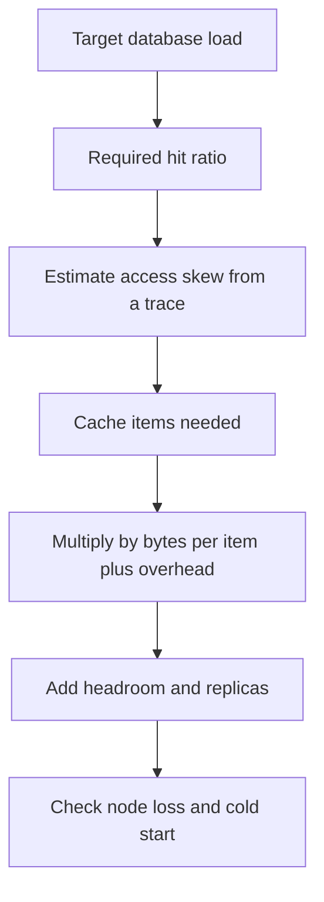

# Workloads, working sets and capacity

## Learning objectives

After studying this chapter you should be able to:

- Apply Amdahl's law to a request path and compute the ceiling on the benefit of a cache.
- Apply Little's law to estimate concurrency, connection pool sizes and queue lengths.
- Define the working set and explain why hit ratio curves have a "knee".
- Describe Zipf (power-law) popularity distributions and compute the best possible hit ratio for a cache of a given size under such a distribution.
- Do a back-of-envelope capacity plan for a cache: object counts, bytes, overheads, nodes and headroom.
- Explain why the cost of the _next_ gigabyte of cache memory usually buys less than the previous one.

## 1. Why we need more than AMAT

The previous chapter, Locality, hit ratio and average access time, gave us the formula for the average cost of a lookup. That formula takes the hit ratio as an _input_. Real design work requires answering questions one level deeper:

- How much of the whole request benefits from the cache at all?
- How many requests are in flight inside the system, and how many connections do we need?
- How big must the cache be to reach a target hit ratio?
- What hit ratio can we possibly achieve, given how popularity is distributed across our data?

This chapter provides four tools to answer them: Amdahl's law, Little's law, the working set model and the Zipf distribution. Each is a few lines of arithmetic, and together they let you do a credible capacity plan on a whiteboard.

## 2. Amdahl's law applied to caching

Gene Amdahl observed in 1967 that the overall speedup from improving one part of a system is limited by the fraction of time that part accounts for. In its general form: if a fraction p of the total time is accelerated by a factor s, then

```
overall speedup = 1 / ( (1 - p) + p / s )
```

The unimproved portion (1 − p) is a floor. Even if s were infinite, the speedup could never exceed 1 / (1 − p).

### 2.1 Worked example: a product page

A request to render a product page takes 100 ms on average, of which:

- 80 ms is spent fetching data from the database.
- 20 ms is everything else: routing, authentication, template rendering and serialization.

We add a cache with t_c = 1 ms in front of the database, with a hit ratio of 90 percent, and a miss penalty of 80 ms (the database portion). The fetch time becomes:

```
fetch = 1 + 0.10 * 80 = 9 ms
```

so the accelerated part went from 80 ms to 9 ms, a factor of s = 80 / 9 = 8.89. The fraction of time affected is p = 0.8. Therefore:

```
speedup = 1 / ( 0.2 + 0.8 / 8.89 )
        = 1 / ( 0.2 + 0.09 )
        = 1 / 0.29
        = 3.45
```

You can verify directly: new total = 9 + 20 = 29 ms, and 100 / 29 = 3.45. The cache accelerated the data fetch almost ninefold, yet the page only became 3.45 times faster, because 20 percent of the work was untouched.

The ceiling is 1 / 0.2 = 5. With a perfect cache that responded instantly to every request, the page would still take 20 ms. Pushing the hit ratio from 90 to 99 percent (fetch = 1 + 0.01 × 80 = 1.8 ms) gives a total of 21.8 ms and a speedup of 4.59. Going from 90 to 99 percent bought a further 7.2 ms, but a lot of engineering effort. The residual 20 ms is now where the time goes, and a cache cannot help with it.

### 2.2 What Amdahl's law tells a designer

1. **Profile first.** Before caching, measure which fraction of request time the candidate data fetch occupies. If it is 10 percent of the request, the maximum speedup is 1 / 0.9 = 1.11, and caching is the wrong tool.
2. **Cache at the right level.** Caching a database row accelerates the fetch. Caching the fully rendered page accelerates the fetch _and_ the rendering, which raises p. A higher-level cache covers more of the request but is also less reusable and harder to invalidate, because it depends on more underlying data. This is a standing tradeoff: the **cache granularity** problem.
3. **The unaccelerated part becomes the new bottleneck.** After a successful cache rollout, the next performance work is always elsewhere.

Amdahl's law is stated for time, but it applies equally to cost and load. If 70 percent of your database load comes from one query that you cache perfectly, the best you can do is reduce load by 70 percent.

## 3. Little's law and concurrency

### 3.1 The law

Little's law is one of the most useful results in queueing theory because it requires almost no assumptions. For any stable system in steady state:

```
L = lambda * W
```

where L is the average number of items in the system, lambda is the average arrival rate (which equals throughput in steady state), and W is the average time an item spends in the system. The law does not assume any particular arrival pattern or service time distribution. It is bookkeeping: if requests arrive at 100 per second and each stays one second, then on average 100 are in the system.

### 3.2 Using it for connection pools and thread counts

Suppose a service receives lambda = 2,000 requests per second, and each request makes one data fetch.

_Without a cache._ The data fetch takes 20 ms, which is 0.020 s. Concurrency at the database:

```
L = 2000 * 0.020 = 40 concurrent queries
```

_With the cache at AMAT = 3 ms_ (the 90 percent example), the concurrency inside the fetch layer is:

```
L = 2000 * 0.003 = 6
```

But the database only sees the miss traffic: 10 percent of 2,000 = 200 per second, each taking 20 ms:

```
L_db = 200 * 0.020 = 4 concurrent queries
```

The cache cut database concurrency tenfold, from 40 to 4. This tells you how large the database connection pool needs to be, and shows you what happens when the hit ratio falls: at h = 0.5, lambda_db = 1,000, and L_db = 1000 × 0.020 = 20. If the pool holds 10 connections, requests queue.

### 3.3 Queues explode near saturation

Little's law gives averages. To understand why caches fail dramatically, add the following well-known intuition from queueing theory. For a simple single-server queue with random arrivals, the average wait grows roughly like 1 / (1 − rho), where rho = lambda × service time / servers is the **utilisation**. At rho = 0.5 the factor is 2; at rho = 0.9, 10; at rho = 0.99, 100. The system looks healthy until it suddenly does not.

This is the mathematical basis of a cache-induced outage. Say the database has capacity for 1,000 queries per second at rho = 1. At a hit ratio of 95 percent and 10,000 requests per second, the miss traffic is 500 per second, rho = 0.5 and latency is near the minimum. If the hit ratio slips to 90 percent, miss traffic is 1,000 per second, rho = 1, and the queue grows without bound. A five-point drop in hit ratio moved the database from comfortable to collapsed.

### 3.4 Little's law for the cache itself

Little's law also applies to the cache's memory. If an item is inserted at a rate of lambda_ins items per second and lives for an average of W seconds (until expiry or eviction), the average number of resident items is L = lambda_ins × W. Suppose a session cache admits 500 new sessions per second with a 30-minute (1,800 s) idle TTL. Then:

```
L = 500 * 1800 = 900,000 sessions resident
```

At 2 KB per session that is about 1.8 GB. This calculation sizes caches whose capacity is governed by expiry rather than by eviction pressure.

## 4. The working set

### 4.1 Definition

Peter Denning introduced the **working set** in the context of virtual memory: the set of pages a process has referenced within the most recent window of time. For caching we use the idea informally: the **working set** is the set of distinct items that the workload will touch again within some period of interest. Intuitively, it is the data that "ought" to be in the cache.

If the cache is at least as large as the working set, almost every non-compulsory request hits. If the cache is smaller, items that are still in use get evicted, and the hit ratio drops. This gives the typical **hit ratio versus cache size curve** an S-like or knee-shaped appearance.

### 4.2 The knee and the thrashing cliff

Suppose a loop cycles through 1,000 distinct items in order, repeatedly, and the cache uses LRU with a capacity of 999 items. Item 1 is loaded, then 2, and so on. By the time we reach item 1000, the cache is full and item 1 is the least recently used and is evicted. When the loop restarts and requests item 1, it misses; loading it evicts item 2, which is the next to be requested, and so on. **Every single request misses**, though the cache was only one slot too small. With capacity 1,000, after the first pass every request hits. The hit ratio went from 0 to 1 with a single extra slot.

This is the extreme case of the cliff. Real workloads are smoother, but they do exhibit regions where a small shrink in cache size causes a large fall in hit ratio. A cache sitting just above a knee has very little margin. A traffic shift that enlarges the working set by 10 percent can push the system over the edge. This is the capacity version of the non-linear sensitivity we saw in the previous chapter, and it motivates **headroom**: provision above the knee, not at it.

The looping pattern also shows that LRU is not universally optimal; scan-resistant policies exist for exactly this case, and are covered in the Eviction chapter.

### 4.3 Estimating the working set

You can estimate it empirically by processing a trace of requests and counting distinct keys per window. If a one-hour window of traffic touches 3.2 million distinct keys and the average object is 1.5 KB, the hourly working set is about 4.8 GB. Pick the window to match your tolerance: a cache that retains an hour's worth of distinct keys gives you hits for anything re-requested within the hour. Plot distinct keys against window length; the curve typically grows quickly and then flattens, or keeps growing slowly in a long tail of rarely repeated keys.

## 5. Popularity: Zipf and power laws

### 5.1 The distribution

Let the items be ranked 1, 2, ..., N from most to least popular. A **Zipf distribution** with exponent s says that the probability of requesting the item of rank k is proportional to 1 / k^s:

```
P(k) = ( 1 / k^s ) / H(N, s)       where H(N, s) = sum over k=1..N of 1 / k^s
```

For s = 1, the normalising sum H(N, 1) is the N-th harmonic number, which is approximately ln(N) + 0.5772 (0.5772 is the Euler-Mascheroni constant). Zipf-like patterns have been observed in web page requests, word frequencies, and many other human-driven workloads; the exponent varies by workload and is typically somewhere around or below 1 for web traffic, but you should measure rather than assume. Treat the numbers below as illustrations of the shape, not predictions for your system.

### 5.2 Best-case hit ratio for a cache of size C

Under the simplifying **independent reference model** (each request is drawn independently from a fixed popularity distribution), the best a cache of capacity C items can do is hold the C most popular items. Its hit ratio is then the total probability mass of the top C ranks:

```
hit_ratio(C) = H(C, s) / H(N, s)
```

**Worked example.** N = 1,000,000 distinct items, s = 1.

```
H(N)       = ln(1,000,000) + 0.5772 = 13.8155 + 0.5772 = 14.3927
```

| Cache holds     | Items   | H(C)                                        | Best-case hit ratio     |
| --------------- | ------- | ------------------------------------------- | ----------------------- |
| top 0.1 percent | 1,000   | ln 1,000 + 0.5772 = 6.9078 + 0.5772 = 7.485 | 7.485 / 14.393 = 52.0 % |
| top 1 percent   | 10,000  | 9.2103 + 0.5772 = 9.7875                    | 68.0 %                  |
| top 2 percent   | 20,000  | 9.9035 + 0.5772 = 10.4807                   | 72.8 %                  |
| top 10 percent  | 100,000 | 11.5129 + 0.5772 = 12.0901                  | 84.0 %                  |
| top 50 percent  | 500,000 | 13.1224 + 0.5772 = 13.6996                  | 95.2 %                  |

Look at what this says. Caching a mere 0.1 percent of the items captures roughly half of all requests. That is why caching is so effective in practice: skew means a tiny cache goes a long way. But also look at the cost of improving: doubling the cache from 1 percent to 2 percent of items buys only 4.8 points (68.0 to 72.8). Raising the hit ratio from 84 to 95 percent requires five times as much memory (10 to 50 percent of the items). **Each additional gigabyte buys less than the last.** Here we have the economics behind the diminishing returns that we noticed in AMAT.

For a flatter distribution (smaller s), skew is weaker, the curve is more linear, and caches need to be much larger to achieve the same hit ratio. In the limit of a uniform distribution (s = 0), the best-case hit ratio is simply C / N: a cache holding 10 percent of the items gets a 10 percent hit ratio, and the cache is nearly worthless. This is why per-user or per-session data with little re-reading is a weak caching candidate and why the question "how skewed is my access pattern?" belongs at the start of every design.

### 5.3 The long tail problem

Zipf distributions have **long tails**: a vast number of items, each requested rarely. In the example, the bottom 50 percent of the items (500,000 of them) together receive only 4.8 percent of the requests. Yet every one of those requests is a miss, and each is likely to be a compulsory or capacity miss. If your miss penalty is large, the tail may dominate backend load even though it is a small percentage of traffic. This suggests designing the _backend_ to handle the tail cheaply (good indexes, read replicas) because the cache will never absorb it.

Real caches also suffer from one-hit wonders: items requested exactly once. Inserting them into the cache wastes space and pushes out useful items. Some systems use admission policies (such as a small frequency filter in front of the main cache) to refuse items until they have been seen twice. We discuss these in the Eviction chapter.

### 5.4 Popularity changes with time

The independent reference model is a useful fiction. Real popularity drifts: yesterday's headline is not today's. Cache efficiency therefore depends on the **rate of change** of the popular set relative to the time it takes to learn it. A cache that takes hours to warm is poorly suited to content whose popularity changes every few minutes, which is a theme we revisit under cold starts in the stampede chapters.

## 6. A capacity-planning recipe

Let us put the tools together in a sizing exercise.

**Scenario.** A catalogue service has 20 million items. Each cached object is a serialized item of 1.2 KB on average. Peak traffic is 30,000 requests per second. The database can sustain 2,000 queries per second at acceptable latency. We want to size a Redis-like cache cluster.

**Step 1. Required hit ratio.** The database may see at most 2,000 per second, but we want a safety margin of 50 percent, so the target miss traffic is 1,000 per second.

```
miss ratio = 1,000 / 30,000 = 0.0333    ->  hit ratio >= 96.7 percent
```

**Step 2. Find the cache fraction.** Suppose measurements indicate an access skew close to Zipf with s = 1. With N = 20,000,000: H(N) = ln(2e7) + 0.5772 = 16.8112 + 0.5772 = 17.3884. We need H(C) ≥ 0.967 × 17.3884 = 16.814, so ln(C) = 16.814 − 0.5772 = 16.237 and C = e^16.237, which is about 11.2 million items. So roughly 56 percent of the catalogue must be cached to hit 96.7 percent. That is a sobering result: even with a nice skew, the _last_ few points of hit ratio are expensive. This is why a conversation that starts with "let's target 99 percent" deserves pushback.

**Step 3. Convert to bytes.**

```
raw data  = 11.2e6 items * 1.2 KB = 13.4 GB
```

**Step 4. Add overhead.** Per-key overhead (key string, pointers, expiry metadata, allocator fragmentation) is often tens to a few hundred bytes per entry, depending on the system. Assume 100 bytes of overhead on a 1.2 KB value, plus 20 percent allocator fragmentation:

```
per entry = (1,200 + 100) * 1.2 = 1,560 bytes
total     = 11.2e6 * 1,560 = 17.5 GB
```

**Step 5. Headroom and replication.** Leave 25 percent free memory for growth and bursts: 17.5 / 0.75 = 23.3 GB. If you run replicas for availability, each primary needs a replica of equal size, doubling the memory bill, while read traffic can be spread across them.

**Step 6. Nodes and throughput.** Suppose each node has 16 GB usable. Two primaries give 32 GB, comfortable. Check throughput: at 30,000 requests per second with 96.7 percent hits, the cache must serve about 30,000 operations per second, which is well within a single modern node's capability (order of 100,000 operations per second for simple commands, though you should benchmark). Two nodes are therefore ample for load and mainly needed for capacity and fault isolation.

**Step 7. Sanity check on the failure case.** If one of the two nodes dies, half of the keys disappear. The hit ratio drops towards roughly 80 percent or less, and database load rises well above 2,000 queries per second. The design needs either more nodes (so that the loss of one removes a smaller share), replicas, or a load-shedding plan. Capacity planning should be done for the degraded state, not only the healthy one. See the lessons on cold starts and on protecting the database.



## 7. Code: a tiny trace simulator

Rather than trust formulas for your own workload, simulate. This Java sketch replays a trace of keys through an LRU cache and reports the hit ratio for several sizes. It uses `LinkedHashMap` in access order.

```java
static double simulate(List<String> trace, int capacity) {
    Map<String, Boolean> lru = new LinkedHashMap<>(16, 0.75f, true) {
        protected boolean removeEldestEntry(Map.Entry<String, Boolean> e) {
            return size() > capacity;
        }
    };
    long hits = 0;
    for (String k : trace) {
        if (lru.get(k) != null) hits++; else lru.put(k, true);
    }
    return (double) hits / trace.size();
}

// for (int c : new int[]{1_000, 10_000, 100_000}) print(c, simulate(trace, c));
```

Run it on a day of production keys and you obtain the actual hit ratio curve for your workload. The point at which the curve flattens is the sensible cache size; the point where it is still steep tells you where extra memory still pays. A C++ equivalent uses a `std::list` plus `std::unordered_map` for O(1) LRU, which you will implement in the Eviction chapter.

## 8. Common pitfalls

1. **Planning for the average.** Peak traffic, a cold cache and the loss of a node are the cases that cause outages. Size for them.
2. **Applying a Zipf formula without measuring the exponent.** The best-case numbers depend strongly on s. Fit your own trace.
3. **Forgetting per-entry overhead.** Small values with large keys and metadata can double the actual memory use.
4. **Treating the hit ratio target as free.** The last few points are the most expensive, as the Zipf table shows. Tie the target to a backend load number, not to a round percentage.
5. **Ignoring that LRU is not the best-case policy.** The Zipf calculation assumes the cache holds exactly the top items. Real policies approximate that and achieve somewhat less.
6. **Using Little's law with non-steady-state data.** The law holds for stable averages. During a spike or an outage, the averages move, and queues grow beyond the formula.
7. **Believing that caching the whole page is always better.** It raises p in Amdahl's law, but multiplies the keys and complicates invalidation.

## 9. Check your understanding

1. A request takes 200 ms, of which 150 ms is data fetch. A cache brings the fetch to 15 ms. What is the overall speedup and what is the theoretical maximum from caching this fetch?
2. A service handles 5,000 requests per second. The database sees only the misses, at a hit ratio of 96 percent, and each query takes 25 ms. What is the average number of concurrent queries at the database, and how many would there be at 80 percent?
3. A cache admits 200 new entries per second, each living 15 minutes on average. How many entries are resident, and how much memory at 3 KB per entry?
4. Under Zipf with s = 1 and N = 100,000, estimate the best-case hit ratio for a cache holding the top 1,000 items. (Use H(n) = ln n + 0.5772.)
5. Explain why an LRU cache with capacity 99 items fails completely on a loop over 100 items, while one with capacity 100 does perfectly.
6. Why should capacity planning include the case of a single node failure?

## 10. Answers

1. New time = (200 − 150) + 15 = 65 ms. Speedup = 200 / 65 = 3.08. Maximum (infinitely fast fetch) = 200 / 50 = 4.0, equivalently 1 / (1 − 0.75) = 4.
2. Miss traffic at 96 percent = 5,000 × 0.04 = 200 per second. L = 200 × 0.025 = 5. At 80 percent: 1,000 per second, L = 25. A hit ratio change from 96 to 80 percent looks modest, yet the miss ratio grew from 4 to 20 percent, a fivefold load increase.
3. L = 200 × 900 s = 180,000 entries. Memory = 180,000 × 3 KB = 540,000 KB, about 540 MB (about 0.52 GiB).
4. H(1,000) = 6.9078 + 0.5772 = 7.485. H(100,000) = 11.5129 + 0.5772 = 12.090. Ratio = 7.485 / 12.090 = 0.619, about 62 percent.
5. With LRU and a cyclic access over 100 items and capacity 99, the item needed next is always the one just evicted, so every access misses. With capacity 100 all items fit, and after the first pass every access hits. It is a cliff because LRU is wrong for cyclic scans.
6. Because the healthy state is not the one that causes outages. Losing a node removes a share of the cache, spiking miss traffic, and if the database cannot absorb it, the failure cascades. The plan should show that the degraded state is survivable or that load shedding exists.

## 11. Summary

Amdahl's law bounds what a cache can do for a request: the part you do not accelerate sets a ceiling, so profile before you cache and choose granularity deliberately. Little's law (L = lambda × W) converts rates and latencies into concurrency, which sizes connection pools and shows how the cache removes load from the backend. Queues become explosive as utilisation approaches one, so small hit ratio changes near capacity cause collapse. The working set determines the knee of the hit ratio curve; provision above it. Popularity is usually skewed, often modelled by Zipf, which makes small caches surprisingly effective and large increments of hit ratio disproportionately expensive. Capacity planning translates a backend load target into a hit ratio, then items, then bytes with overhead, then nodes with headroom, and is validated against failure states. The final chapter in this section, When to cache and when not to, asks the prior question: whether to cache at all.
