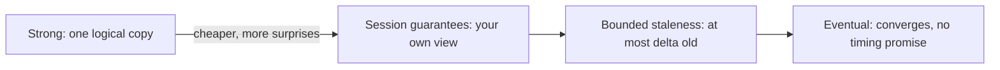
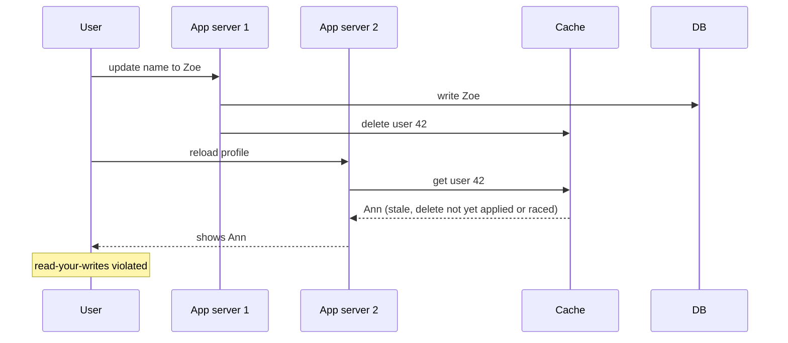
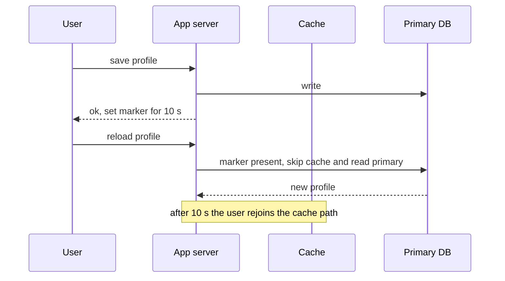
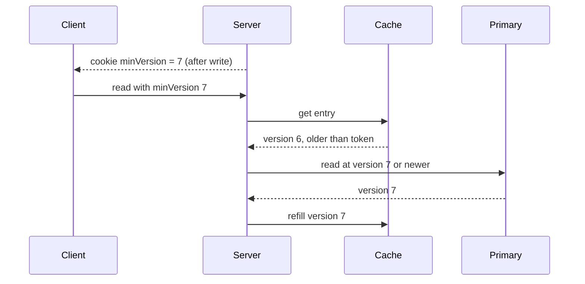
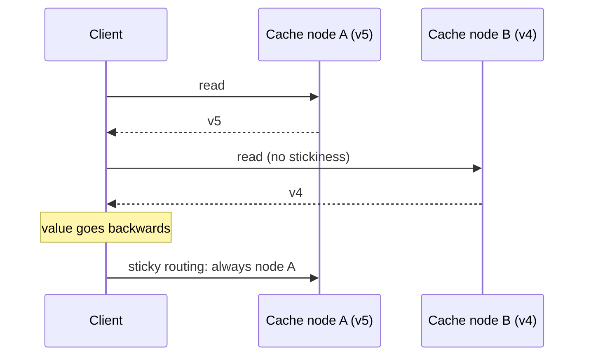
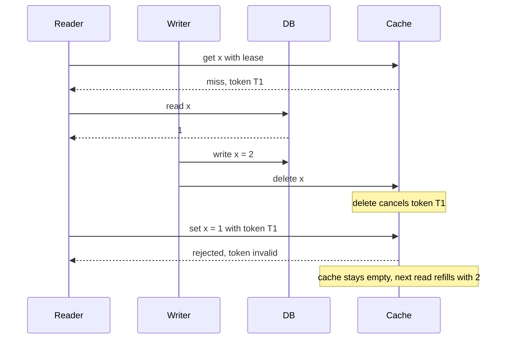
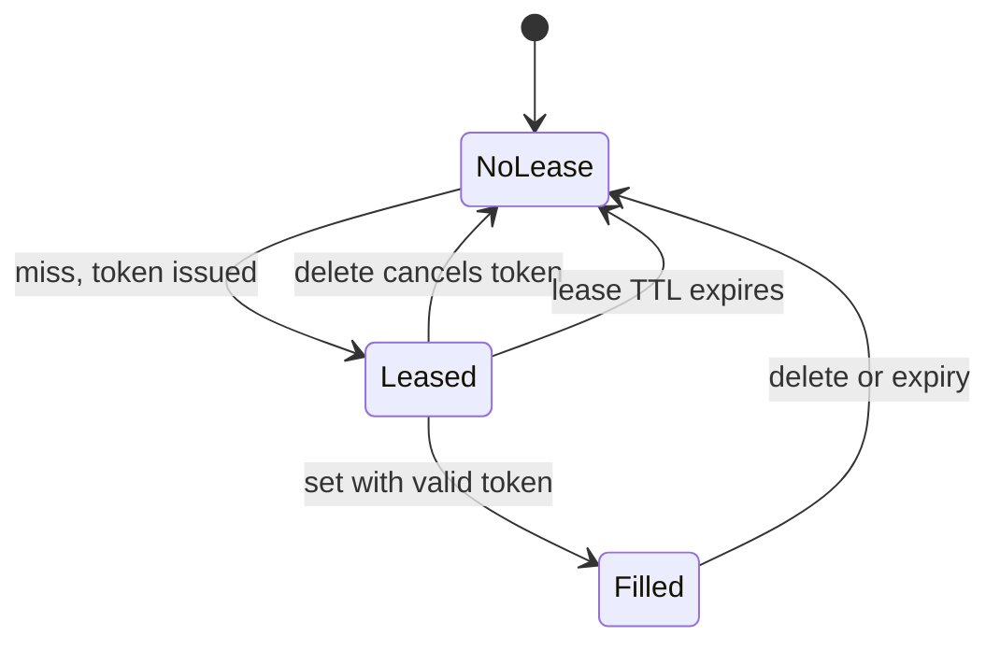
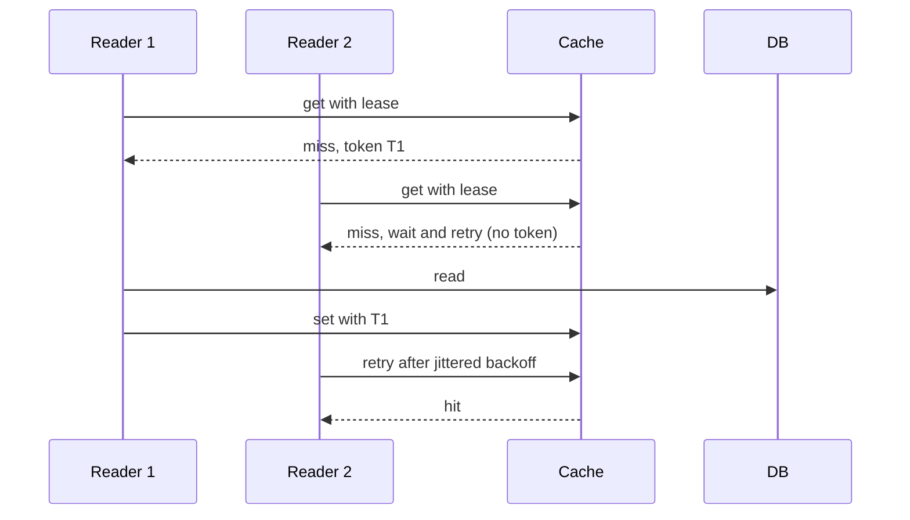
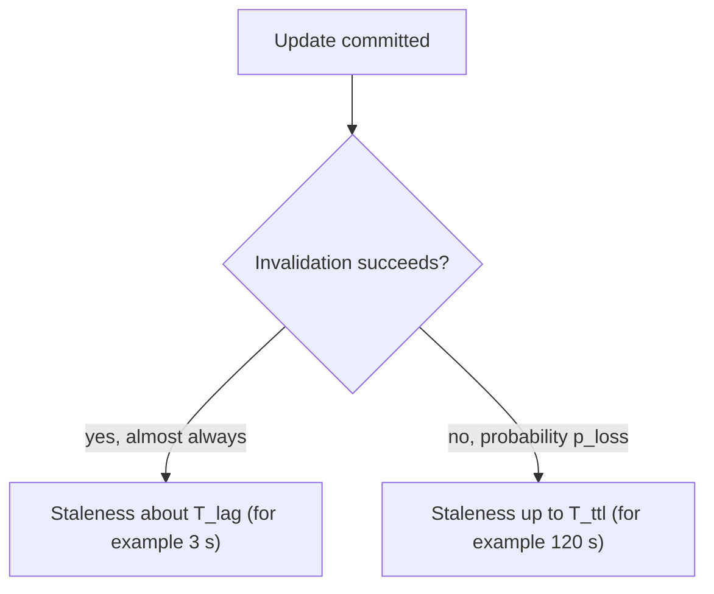
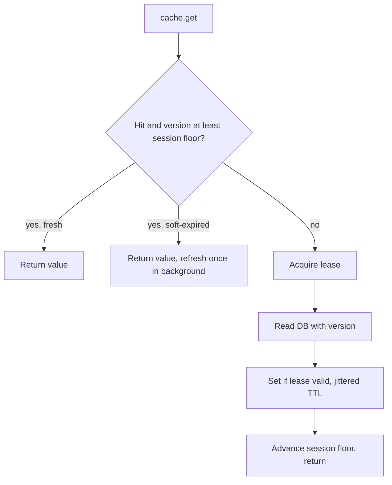

# Consistency models and leases

## Learning objectives

After studying this chapter you should be able to:

- State the meaning of strong (linearizable), eventual, read-your-writes and monotonic-reads consistency, and recognise each in a cached system.
- Explain why a cache in front of a database generally cannot offer strong consistency without extra machinery.
- Describe practical implementations of read-your-writes and monotonic reads for cached reads.
- Trace the cache-aside race step by step and show how a lease token prevents the stale fill.
- Explain how leases also limit thundering herds, and what their failure modes are.
- Define bounded staleness, compute its bound for a given design, and choose a consistency level per data class.

## 1. What do readers get promised?

The earlier chapters discussed how to reduce staleness. This one asks a sharper question: _what exactly may a reader observe?_ A **consistency model** is a contract between a data system and its clients that specifies which values a read is allowed to return, given the history of writes. Models differ in strength. A stronger model gives clients simpler reasoning and costs more performance or availability. A weaker model is cheaper and surprises clients more.

A cache in front of a database is a distributed system with at least two replicas of each value (the database and the cache) and often more (database replicas, many app-server local caches, CDN edges). Which model the combination provides is usually not a conscious decision; it falls out of the implementation, and teams discover it when a user complains. The aim here is to make the choice deliberate.

## 2. The models

We use informal definitions, enough for design work.



| Model              | Reader sees                       | Typical cache mechanism    |
| ------------------ | --------------------------------- | -------------------------- |
| Strong             | Latest committed write            | Bypass the cache           |
| Session guarantees | Own writes, never going backwards | Version tokens, stickiness |
| Bounded staleness  | At most delta old                 | Invalidation plus TTL      |
| Eventual           | Something, eventually             | TTL only                   |

### 2.1 Strong consistency (linearizability)

A system is **linearizable** if every operation appears to take effect atomically at some single instant between its start and its completion, and the instants are consistent with real time. In practice: after a write completes, every subsequent read, by anyone, anywhere, sees that write or a later one. There is one logical copy.

A cache and a database together cannot provide this without strong coordination. Between the commit of a write and the removal of the cached entry, a reader can fetch the old value from the cache, even though the write has completed from the writer's perspective. To close that gap you would need the invalidation to happen _before_ the write is acknowledged, atomically with the commit, and for no reader to be able to fill the cache with an old value afterwards. Some systems achieve this by making the cache part of the same replicated state machine (a consensus-backed store), or by routing reads and writes of a key through the same single serialisation point. For ordinary look-aside caches, assume you do not have it.

When strong consistency is needed for some operation, **do not read from the cache for it.** Read from the primary database inside the transaction.

### 2.2 Eventual consistency

A system is **eventually consistent** if, in the absence of new writes, all replicas converge to the same value. The model promises nothing about _when_ and nothing about what readers see meanwhile; two consecutive reads may even go backwards in time. A TTL-governed cache is eventually consistent: after the last write, the entry will expire within the TTL and the next fill will converge. Eventual consistency is the weakest useful guarantee, and the default result of "cache with a TTL".

The danger in practice is that "eventually" may be arbitrarily long if invalidation can fail (no TTL) or if sources of nondeterminism (lag, races) keep re-introducing stale values.

### 2.3 Session guarantees

Between the two extremes lie the **session guarantees**, formulated by researchers studying weakly consistent replicated databases. They apply to the view of a single client (a "session") and are the ones users actually notice:

- **Read-your-writes**: after a session writes a value, its subsequent reads see that write (or a later one). Violation: you change your display name, reload the page, and see the old name.
- **Monotonic reads**: once a session has seen a value, it never later sees an older value. Violation: refreshing the page shows the new comment, and refreshing again makes it disappear, because the second request hit a replica or cache that had not seen it.
- **Monotonic writes**: a session's writes take effect in the order issued.
- **Writes-follow-reads**: a write is ordered after the reads that influenced it. Violation: a reply to a message appears before the message.

For caches, read-your-writes and monotonic reads are the two that matter most. They are cheap to provide for the session even when global consistency is weak, and they remove most of the visible weirdness.



> **Key idea:** users forgive stale data about the world far more than stale data about themselves. Fix read-your-writes and monotonic reads first.

## 3. Providing read-your-writes with a cache

There are several implementation techniques, in order of increasing generality.

### 3.1 Bypass the cache for the writer, briefly

After a user writes an object, set a short-lived marker (a cookie, or a session field with a timestamp): "this user wrote at time t". For reads of the user's own data during the next N seconds, skip the cache and read from the primary database. N is chosen to exceed the invalidation lag, for example 5 to 10 seconds. After that the cache has caught up, and the user rejoins the normal path.

Cost: a small number of extra database reads, only for users who just wrote, and only for their own objects. Since writes are rare compared to reads, the added load is small. Suppose 1 percent of requests are writes and each writer bypasses the cache for 10 seconds with an average of 2 reads in that window: the extra database reads are about 0.01 × 2 = 0.02 per request, a two percent increase in database traffic. That is cheap for a clearly visible improvement.



### 3.2 Write-through for the writer's own view

Write the new value to the cache (via a versioned set) in addition to deleting or updating on the database. The writer then sees its own change on the next read, provided the versioned set cannot be overwritten by an older value. This works best with the version discipline from the previous lesson.

### 3.3 Version tokens



Return to the client the **version (or log position)** of its last write, for instance as a cookie. On each read, the server compares the cached entry's version with the client's token: if the entry is older than the token, treat it as a miss, read from the source (which must be at least that fresh, such as the primary or a replica that has reached that log position) and refill. This provides read-your-writes _across servers and replicas_, at the cost of carrying a token and storing versions in the cache entries. It is the most general technique and is used in various forms in replicated databases and in caching systems built on top of them.

## 4. Providing monotonic reads

Monotonic reads fail when consecutive reads of one session go to different copies at different staleness. Two techniques.

1. **Stickiness.** Route a session to the same cache node and the same replica for its reads (sticky sessions, consistent hashing on session id). Then the session sees a single copy that only moves forward. The cost: less flexibility in load balancing, and a failover can still reset the view.
2. **Version floors.** The client (or session) remembers the highest version it has observed for each object (or a global high-water mark) and rejects any entry whose version is lower, treating it as a miss. Combined with the version-token mechanism above, this gives both properties.



## 5. The cache-aside race, step by step, and the lease solution

We now return to the most important failure of the look-aside cache and trace it in full detail, because a lease is the cleanest cure and it teaches the general principle.

### 5.1 The interleaving, without leases

Initial state: database x = 1; cache empty. Reader R handles a request for x. Writer W changes x to 2.

| Step | Time | Actor | Action                             | DB  | Cache |
| ---- | ---- | ----- | ---------------------------------- | --- | ----- |
| 1    | t0   | R     | `GET x` from cache: miss           | 1   | empty |
| 2    | t1   | R     | `SELECT x` from DB: returns 1      | 1   | empty |
| 3    | t2   | W     | `UPDATE x = 2` and commit          | 2   | empty |
| 4    | t3   | W     | `DEL x` from cache (nothing there) | 2   | empty |
| 5    | t4   | R     | `SET x = 1` into cache             | 2   | **1** |
| 6    | t5   | R2    | `GET x`: hit, returns 1            | 2   | 1     |

At step 5 the reader installs a value that the database no longer holds. From then until the TTL fires, every reader gets the old value. Notice that nothing in the logic of R, or of W, is wrong given what each knew. The problem is that R's information expired while it was in flight, and nobody told R.

### 5.2 The lease protocol

The cache supports two special operations:

- **`get_with_lease(k)`**: on a hit, returns the value as usual. On a miss, returns a **lease token** (a unique id, recorded by the cache against the key) and tells the caller "you hold the right to fill k".
- **`set_with_lease(k, v, token)`**: stores the value only if the token is still valid for the key.
- Any **delete or invalidation of k** invalidates (cancels) the outstanding token for k.

The same interleaving with leases:



| Step | Time | Actor | Action                                                   | DB  | Cache           |
| ---- | ---- | ----- | -------------------------------------------------------- | --- | --------------- |
| 1    | t0   | R     | `get_with_lease x`: miss, token T1 issued                | 1   | empty, lease T1 |
| 2    | t1   | R     | `SELECT x`: 1                                            | 1   | empty, lease T1 |
| 3    | t2   | W     | `UPDATE x = 2`                                           | 2   | empty, lease T1 |
| 4    | t3   | W     | `DEL x`: **cancels lease T1**                            | 2   | empty, no lease |
| 5    | t4   | R     | `set_with_lease x = 1, T1`: **rejected**                 | 2   | empty           |
| 6    | t5   | R2    | `get_with_lease x`: miss, token T2                       | 2   | empty, lease T2 |
| 7    | t6   | R2    | `SELECT x`: 2, then `set_with_lease x = 2, T2`: accepted | 2   | **2**           |

The cache is correct at the end. The lease converts a time-of-check/time-of-use race into a conditional write: "install this only if nothing invalidated the key since you were told to fill it". It is the cache-side analogue of an optimistic concurrency check.



This is the mechanism described in the paper "Scaling Memcache at Facebook", where memcached hands out a lease token on a miss and rejects a `set` carrying a token invalidated by a delete. Redis offers building blocks (optimistic transactions with `WATCH`, or server-side scripts) with which one can implement the same pattern, and a simple home-made version is to store a per-key "invalidation counter" and reject fills whose observed counter differs.

### 5.3 A home-made version with a counter

```java
// On a miss, snapshot the key's invalidation epoch BEFORE reading the DB.
long epoch = cache.getLong("epoch:" + key);          // 0 if absent
Value v = db.read(key);
// Atomic on the cache side (script or CAS): set only if the epoch is unchanged.
boolean ok = cache.setIfEpochUnchanged(key, v, ttl, epoch);

// Writer, after committing to the database:
cache.incr("epoch:" + key);                          // bump the epoch
cache.delete(key);
```

The reader snapshots the epoch before reading the database; the writer bumps it after committing. Any fill that began before the write sees a changed epoch at set time and is refused. The epoch key needs a TTL longer than the longest in-flight read, or else it, too, can be evicted at an unlucky moment (in which case the reader sees epoch 0 again; use a monotonic source such as a timestamp or log position to avoid reuse of values).

### 5.4 Leases also tame stampedes

Leases have a second benefit. The cache can **rate-limit lease issuance per key**: when a lease for key k has been handed out recently, other readers who miss on k are not given a lease. Instead they are told to wait briefly and retry (by which time the lease holder will probably have filled the key), or they are given a stale value if the cache kept one. That limits concurrent refills of a hot missing key to one, which is the heart of request coalescing and is treated in the stampede chapters. The Facebook paper reports using a limit of one token per key at a time interval on the order of seconds and observing a large reduction in database queries during such events; we omit exact figures since they depend on workload.



### 5.5 Lease failure modes

- **Holder crashes or stalls.** The lease must expire (a lease TTL), so a crashed holder does not block refills forever. The lease TTL should exceed the usual fill time and be short enough to recover quickly. Pick it from the p99.9 of fill latency.
- **Slow holder, expired lease.** The holder's set is rejected, because the lease has expired and perhaps another holder has been given one. The holder should simply drop its value (or use it for its own response) and carry on. Correctness is preserved: the lease can only cause a _missed fill_, never a stale one.
- **Waiting readers.** Readers told to "wait and retry" must be bounded in number, in time, and given jittered backoff, or you move the herd from the database to the cache.
- **Support.** Standard caches may not have leases. The epoch or version approach above can be built on atomic primitives.

## 6. Bounded staleness

Strong consistency is usually unaffordable, eventual consistency is too vague for a requirement. **Bounded staleness** sits between: _a read may return a value that is no more than Δ older than the latest committed value._ The bound Δ can be stated in time (seconds) or in versions ("at most 5 updates behind").

For a cache, Δ is determined by the weakest link in the invalidation chain. Define:

- T_ttl: the maximum TTL of an entry (the backstop).
- T_lag: the worst-case invalidation delay (event pipeline lag plus replica lag).
- p_loss: the probability that an invalidation is lost or defeated by a race.

Then:

- If invalidation always works: Δ ≈ T_lag (typically seconds or less).
- If invalidation can fail: Δ = T_ttl (the backstop), with probability p_loss per write.

A design that states "Δ = 5 s with probability 99.99 percent and Δ ≤ 300 s always" is a precise, testable statement. Compare with the vaguer "the cache is eventually consistent".



**Worked example.** Product prices. Pipeline lag p99 = 2 s, replica lag p99 = 1 s, TTL = 120 s, loss and race probability per update = 0.0001. For 99 percent of updates, staleness is at most about 3 s (2 + 1). For one in 10,000 updates the stale entry may live up to 120 s. The tail is the TTL. If the product team's budget is 30 seconds for "almost all" and 5 minutes absolute, the design passes: Δ_typical = 3 s < 30 s, Δ_max = 120 s < 300 s. If the budget were 60 seconds absolute, the TTL (120 s) would need to be halved or the loss rate reduced.

### 6.1 Per-class consistency levels

A single system rarely needs a single level. A useful practice is to assign each **class of data** a level and an enforcement mechanism:

| Data class                         | Required guarantee         | Mechanism                                               |
| ---------------------------------- | -------------------------- | ------------------------------------------------------- |
| Account balance used for a payment | Strong                     | Bypass the cache; read the primary inside a transaction |
| User's own profile after editing   | Read-your-writes           | Short cache bypass after write, or version token        |
| Feed or timeline                   | Monotonic reads            | Sticky session or version floor                         |
| Product description                | Bounded staleness, minutes | TTL plus delete on edit                                 |
| Public statistics (view counts)    | Eventual                   | Long TTL                                                |
| Permissions (revocation)           | Bounded staleness, seconds | Events plus very short TTL; sensitive paths bypass      |

## 7. Putting it together: a read path

Here is a compact read path that combines several ideas of the last three lessons: a lease for the fill, a version check for session guarantees, a soft/hard TTL, and a jittered backstop. It is pseudocode in Java style.

```java
Value read(Key k, SessionToken s) {
    Entry e = cache.get(k);                           // entry has: value, version, softExpiry
    if (e != null && e.version >= s.minVersion(k)) {  // session floor: monotonic / read-your-writes
        if (now() < e.softExpiry) return e.value;      // fresh
        refreshAsync(k);                               // stale: serve and refresh, one flight
        return e.value;
    }
    // miss, or too old for this session
    Lease lease = cache.acquireLease(k);               // may return NONE if someone else is filling
    VersionedValue vv = db.readWithVersion(k);         // primary, or replica at >= s.minVersion
    if (lease != Lease.NONE) {
        cache.setIfLeaseValid(k, vv, jitteredTtl(), lease);
    }
    s.observe(k, vv.version);                          // advance the session floor
    return vv.value;
}
```

Each line answers one of the failure modes we have discussed: the version floor handles session anomalies; the soft expiry avoids waiting; the lease closes the fill race and bounds concurrent refills; the jittered TTL gives the backstop and avoids synchronization.



In C++ the same structure maps onto an `std::optional<Entry>`, a lease token returned from the cache client, and a `std::future` for the asynchronous refresh.

## 8. Common pitfalls

1. **Assuming a cache plus a database is strongly consistent.** It is not, even when invalidation is "instant" from the writer's view, because of races and lag.
2. **Reading permissions or balances for decisions from the cache.** Use the source of truth.
3. **Ignoring session guarantees.** Users forgive stale data far less when it is _their own_ data or when it flips back and forth.
4. **Sticky sessions as a silver bullet.** They break at failover and rebalancing; combine with versions for correctness.
5. **Leases with no expiry.** A crashed lease holder blocks refills indefinitely.
6. **Leases as a substitute for a TTL.** They close one race, not message loss or mapping bugs.
7. **Stating "eventual consistency" as a requirement.** It specifies no bound; state a bound.
8. **Counter-based epochs that can be evicted** and reused, reopening the race.

## 9. Check your understanding

1. Define read-your-writes and monotonic reads, with an example of a violation of each in a cached application.
2. Why can a look-aside cache not be linearizable by itself? What should a code path do if it needs strong consistency?
3. Trace the cache-aside race for a reader and a writer. At which step does a lease prevent the stale fill, and why?
4. Describe two ways of providing read-your-writes for a user who has just edited their profile, and the cost of each.
5. A lease holder crashes. What mechanism prevents the key from being unfillable, and what is the downside of making it too long or too short?
6. An invalidation pipeline has p99 lag of 4 s, replica lag p99 of 1 s, a TTL of 90 s, and a loss probability of 0.001 per update. State the staleness bound as a two-part sentence.

## 10. Answers

1. Read-your-writes: after your own write you see it. Violation: you edit your display name, reload, and see the old name because a cache returned the pre-edit entry. Monotonic reads: you never see older data after newer data. Violation: refreshing a page shows a new comment, a second refresh served by another replica or cache node hides it.
2. Between the commit of a write and the removal of the entry, and with races on fills, a reader can still be given an old value after the writer has been told the write is complete. Linearizability would require atomicity between the commit and the invalidation. For strong consistency, bypass the cache and read the primary (inside a transaction if needed).
3. Steps: R misses, R reads old value, W commits, W deletes, R sets old value. With a lease: R is given a token at the miss; W's delete cancels the token; R's set is rejected at the last step because the token is invalid. The key stays empty and the next reader fetches the new value.
4. (a) Bypass the cache for that user's reads of that object for a few seconds after the write: cheap, adds a small number of database reads. (b) A version token returned to the client and checked against cached versions: general across servers, but needs versions stored in entries and a token carried by the client.
5. The lease expires after a lease TTL, and another reader can then obtain a new lease. Too long: the key is unfillable for longer after a crash, and waiting readers pile up. Too short: a slow but healthy holder's set is rejected, wasting the fill and potentially causing repeated refills.
6. For about 99 percent of updates (those where lag does not exceed the p99), readers see the new value within about 5 s (4 s + 1 s); in the rare case (about 1 in 1,000 updates) in which the invalidation is lost or raced, staleness is bounded by the 90 s TTL.

## 11. Summary

Consistency models say what readers may see. A cache combined with a database is in general only eventually consistent, with bounded staleness determined by invalidation lag and the TTL backstop. Strong consistency requires bypassing the cache. The session guarantees, read-your-writes and monotonic reads, matter most to users and are cheap to provide with a brief cache bypass after writes, version tokens, version floors or sticky routing. The cache-aside race arises because a fill uses information that a write has since invalidated, and a lease (or an epoch or version check) turns the fill into a conditional write, rejecting the stale fill; the same mechanism limits concurrent refills of a hot key. Leases need expiry and bounded waiting. Finally, state staleness as a two-part bound and assign a consistency level to each class of data. The following chapters, on stampedes and hot keys, show what happens when many readers collide on the same missing key.
