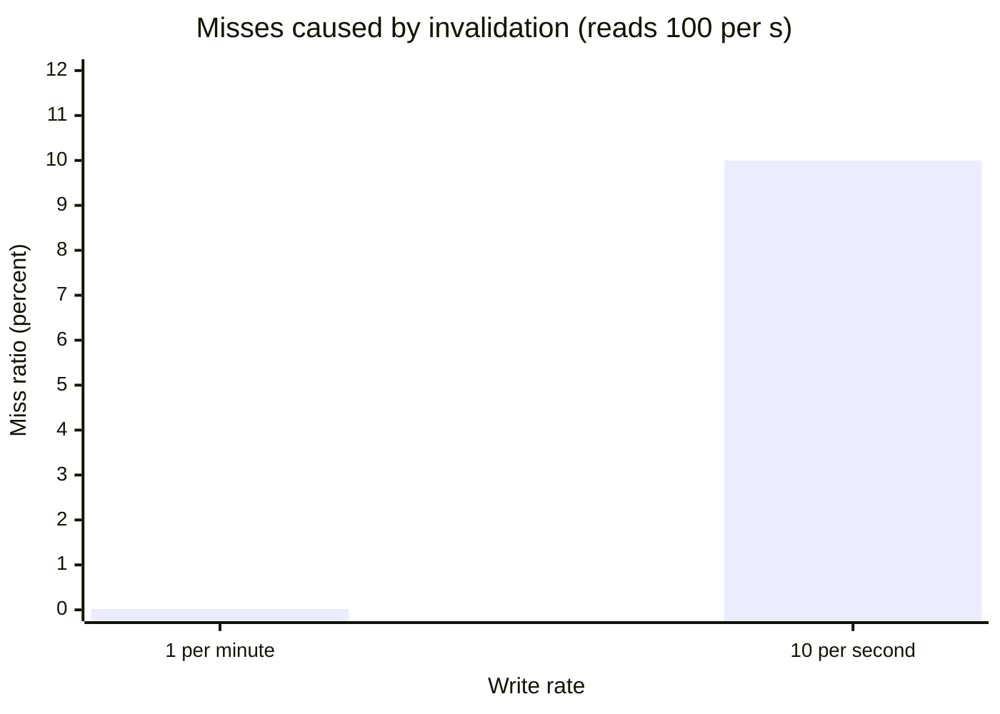
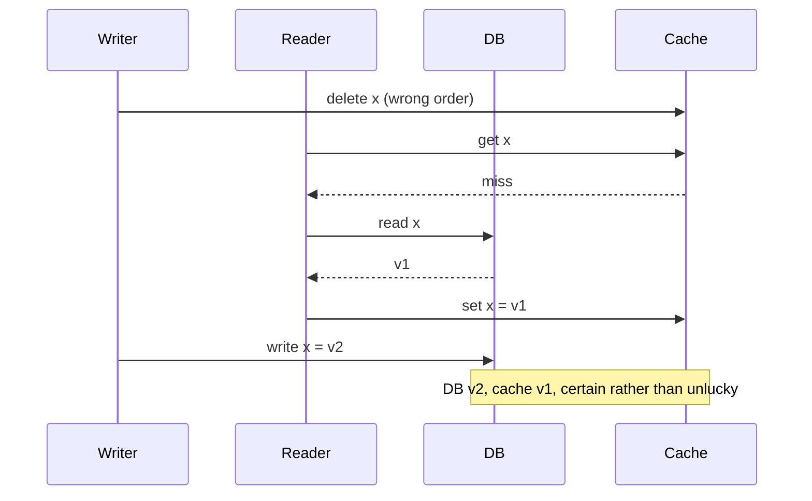
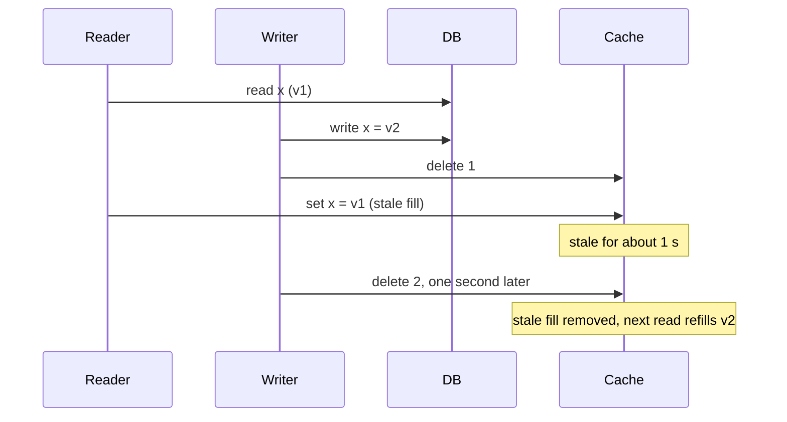
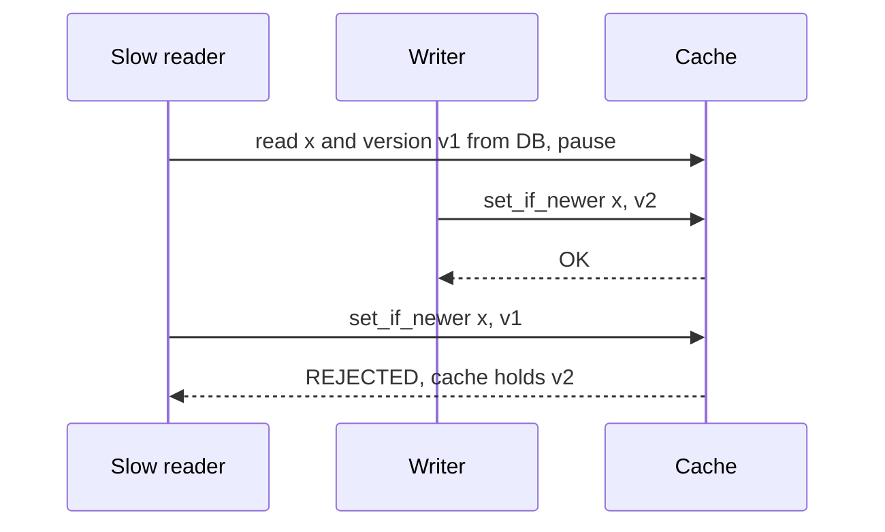
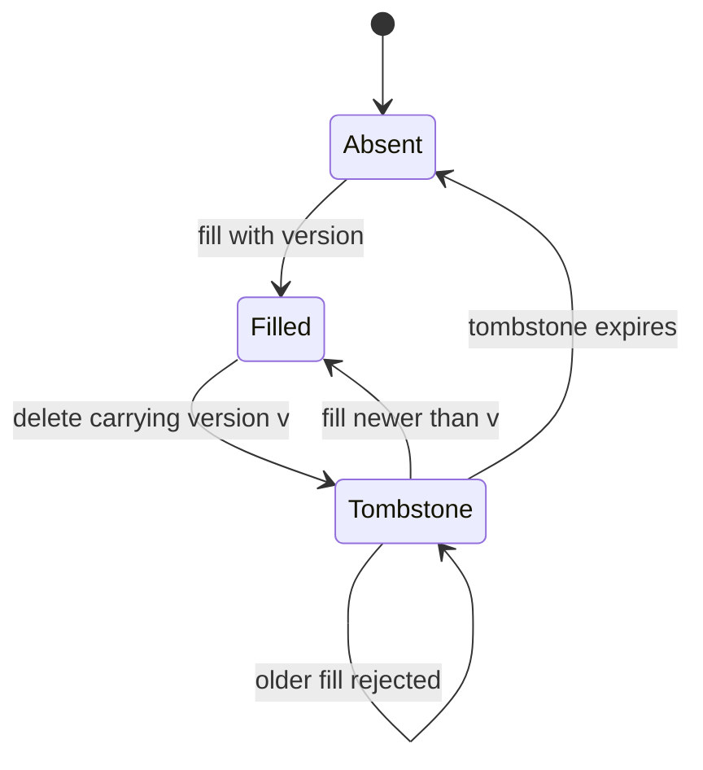
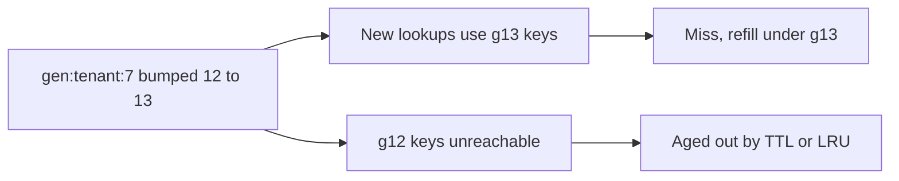
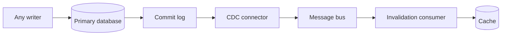
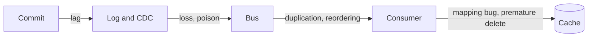
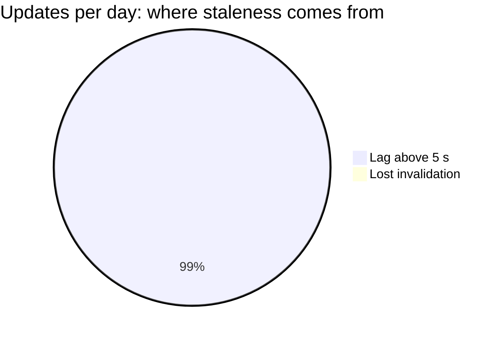

# Explicit and event-driven invalidation

## Learning objectives

After studying this chapter you should be able to:

- Compare delete-on-write with update-on-write and justify the usual preference for delete.
- Close the fill-versus-invalidate race with delayed double deletion, versioned fills and compare-and-set.
- Design versioned (generational) keys and say what they cost.
- Describe event-driven invalidation using a change data capture stream or a pub/sub channel, and the transactional outbox alternative.
- Enumerate the failure modes of event-driven invalidation: lag, loss, duplication, reordering, poison messages and ordering across keys.
- Design idempotent, reconcilable invalidation with a TTL backstop.

## 1. From expiry to action

A TTL (see TTL design) waits for time to pass. When the staleness budget is tighter than any TTL that gives an acceptable hit ratio, we must act when the data changes. This chapter studies the actions: removing or replacing cached entries in response to writes, either directly from the writer's code (explicit invalidation) or indirectly through an event that travels from the database to the cache (event-driven invalidation).

Recall the lesson from Why invalidation is hard: the central hazard is applying an operation, computed from an earlier read, after a conflicting write. Every technique here is a way to prevent that.

## 2. Delete versus update

When a row changes, the writer can do one of two things to the cached copy: delete it (so the next read refills), or set it to the new value.

### 2.1 Why delete is the default

**Update-on-write** has two weaknesses.

1. **Ordering races between writers.** As we showed, two writers can commit to the database as A then B and set the cache as B then A, leaving A. With delete, the order does not matter: both deletes leave the key absent, and the next read refills from the database, which holds the latest committed value.
2. **Wasted work and the wrong shape.** The writer must be able to compute the exact cached representation. For a cached page or an aggregate this may be a complex computation, or it may require a read the writer would not otherwise do. Most keys are written far more often than they are read (think of a long tail of rarely read rows), so eagerly computing every new representation wastes effort. Deleting is O(1) and lazily refills only the keys somebody actually wants.

**Delete's own cost** is an extra miss after each write and a window in which the next reader pays the miss penalty, which, on a hot key, may be a herd of simultaneous readers (the stampede chapters address that). For hot keys with very expensive refills, update-on-write, or refresh-ahead from a background worker, can be justified, but it must then solve the ordering problem, typically with versions (section 3.3).

A numerical illustration of the cost of delete: a key read 100 times per second, written once per minute. Each delete causes one refill; if refills are coalesced, that is 1 backend read per 6,000 requests, a miss ratio of 0.017 percent from invalidation. Negligible. If the key is written 10 times per second and read 100 per second, up to 10 of every 100 reads can miss, a 10 percent miss ratio from invalidation alone, and update-on-write (or not caching) becomes worth considering. The ratio of write rate to read rate, from the chapter When to cache and when not to, decides.

|                          | Update on write                | Delete on write              |
| ------------------------ | ------------------------------ | ---------------------------- |
| Ordering between writers | Races, needs versions          | Harmless, both deletes agree |
| Work per write           | Compute the new representation | O(1)                         |
| Cost                     | Wasted for unread keys         | One extra miss per write     |
| Best for                 | Hot keys, expensive refills    | The default                  |



### 2.2 The order of operations

For delete-on-write: **update the database first, then delete the cache entry.** If you delete first and then update, a reader can arrive between the two steps, miss, read the old row and re-cache it, leaving stale data with certainty rather than as a race:

| Time | Actor  | Action             | DB  | Cache  |
| ---- | ------ | ------------------ | --- | ------ |
| t0   | Writer | `delete x`         | v1  | empty  |
| t1   | Reader | miss, reads DB: v1 | v1  | empty  |
| t2   | Reader | `set x = v1`       | v1  | v1     |
| t3   | Writer | writes DB: v2      | v2  | **v1** |

With update first, then delete, the stale outcome requires an unlucky reader that straddles both steps (race A of the previous chapter). So "write then delete" is far better but not perfect.



## 3. Closing the fill-versus-invalidate race

Three practical mechanisms, in increasing order of strength.

### 3.1 Delayed double deletion

After the write and the first delete, schedule a **second delete** a short time later, longer than the longest plausible stale-fill window (for example the replica lag plus the maximum read-miss latency).

```java
void write(Key k, Value v) {
    db.write(k, v);
    cache.delete(k);                                   // delete 1: prompt
    scheduler.schedule(() -> cache.delete(k), 1, TimeUnit.SECONDS);  // delete 2: cleanup
}
```

Replaying race A with delete 2: the stale fill at t4 is removed at t3 + 1 s, so the stale value lives for about 1 second rather than a whole TTL. It is cheap, requires no cache support, and improves things greatly, but it is a heuristic. If a reader stalls for longer than the delay (a long GC pause, a congested network), the stale fill still wins. It also adds scheduling infrastructure with its own failure modes: a crash between the first and the second delete loses the second one. Treat it as a mitigation, with the TTL still as the final backstop.



### 3.2 Leases

The cache hands out a **lease token** on a miss, and the later fill must present it. A write (or its invalidation) revokes outstanding tokens. A stale fill then presents a revoked token and is rejected. Facebook's paper "Scaling Memcache at Facebook" describes exactly this mechanism for memcached: a token given to the client on a miss that is invalidated if a delete arrives, so that a stale `set` is refused. The same mechanism also limits how often tokens are issued per key, which helps against thundering herds. We study leases in detail in the lesson on consistency models and leases.

### 3.3 Versioned fills and compare-and-set

If the data has a monotonically increasing **version** (a row version column, an update timestamp from a single authority, or a log sequence number), the cache can enforce "only newer wins".

1. The reader reads the row _and its version_ from the database.
2. It writes to the cache only if the cache does not already hold a version at least as new.

Many caches offer atomic compare-and-set; in Redis the same effect is obtained with a small server-side script, or with optimistic transactions that watch the key. A pseudocode version:

```
-- cache operation: set_if_newer(key, version, value)
cur = cache.get_version(key)
if cur is absent or cur < version:
    cache.set(key, version, value)     // performed atomically
    return OK
else:
    return REJECTED
```

Replaying race A: the writer writes v2 and does not delete but sets (v2, value2). The slow reader then tries `set_if_newer(x, v1, value1)`; the cache holds v2, so the set is rejected. Replaying the two-writer race: W1 sets (v1), W2 sets (v2) in either order; the final state is v2 in both orderings because the older one is rejected. Versioned writes are the one technique that makes update-on-write safe against reordering.



There is a subtlety: a **delete** carries no version, so a stale fill after a delete is still accepted. To protect against that, deletes must leave a **tombstone** carrying the version of the deletion for a while (the stale fill with an older version is then rejected). Tombstones are the price of safe deletes and must themselves expire; if they are gone before the slow reader returns, the race reopens.



## 4. Versioned (generational) keys

An entirely different approach avoids invalidation altogether. Instead of mutating the cache entry, change the key.

### 4.1 Immutable content addressing

For assets, include a content hash or a build number in the key or URL: `app.3f9a1c.js`. The content under that name never changes; a new version has a new name. The old entry is not wrong, merely unused, and expires or is evicted in due course. This is why static assets can carry a one-year TTL safely. It reduces invalidation to _name selection_ in the document that references the asset, and that document is cached briefly or not at all.

### 4.2 Version numbers for entities

For application data, store a version alongside the entity in the database (or keep a version counter) and include it in the key: `user:42:v17`. A write increments the version. Readers must know the current version to form the key, which leads to a chicken-and-egg problem: where do they get it?

- Read the version from the database row (a cheap, indexed read), then look up the cache by versioned key. Reduces the problem but still costs a database read per request, which defeats part of the purpose unless the version read is much cheaper than the full read.
- Keep a **version pointer** in the cache under a stable key (`user:42:ver` -> 17), with a short TTL. Invalidation of the pointer is a single small key. A stale pointer simply leads readers to an old but self-consistent version for up to the pointer's TTL.

### 4.3 Namespaces or generations for groups

To invalidate many keys at once (everything belonging to tenant 7, or every query result touching a table), store a **generation number** per group and embed it in every key of that group:

```
gen    = cache.get("gen:tenant:7")                   // e.g. 12
key    = "t7:g" + gen + ":report:2024-05"
```



Bumping `gen:tenant:7` to 13 invalidates all of the tenant's entries in O(1), without enumerating them: every lookup now uses `g13` keys, so the old `g12` entries become unreachable and will age out via TTL or eviction. This neatly solves the dependency-tagging problem described earlier, at the cost of one additional lookup per read (the generation key; it can be cached in-process for a very short time to reduce the cost) and some garbage: old generations occupy memory until evicted. With a large memory budget and LRU, the orphaned entries are the first to go, because nobody touches them.

Evaluate the cost with numbers. A tenant has 50,000 cached entries of 2 KB, which is 100 MB. Bumping the generation does not free that 100 MB; it stays until evicted or expired. If tenants bump their generations ten times per day, up to 1 GB of garbage per tenant per day could accumulate, bounded by TTL. With a TTL of 1 hour and 10 bumps in a day, only about the last hour's worth of entries (at most a few generations) can be resident at once, so garbage is bounded by (entries created per hour) × 2 KB. Use the TTL to cap the garbage.

## 5. Event-driven invalidation

Explicit invalidation in the writer's code has a structural weakness: _every code path that writes the data must remember to invalidate_. A new service, a batch job, a manual SQL fix or a database migration that forgets to do so will leave stale caches. Event-driven invalidation moves the responsibility to the data layer. Whatever changes the data produces an event, and a separate component turns events into cache invalidations.



### 5.1 Change data capture

**Change data capture (CDC)** reads the database's own transaction log (the MySQL binary log, the PostgreSQL write-ahead log) and emits one event per committed row change. Debezium is a widely used open source CDC platform that does this and publishes to Kafka; some companies run in-house equivalents. Facebook's memcache paper describes an invalidation daemon that tails the database commit log and issues deletes to memcached, for precisely the reason above: invalidation is derived from the committed log rather than from application code, so it covers all writers and never invalidates for a transaction that rolled back.

Properties of the CDC approach:

- **Complete**: every committed change appears, regardless of who made it.
- **Correct order per row**: the log order is the commit order, and events for one row are ordered.
- **Decoupled**: writers need no knowledge of caches.
- **Delayed**: the log must be read, parsed, published and consumed. Typical end-to-end lag is milliseconds to seconds, but it can grow to minutes when the pipeline backs up.
- **Row-level**: the event says "row 42 of table users changed", and a mapping step must translate to cache keys (`user:42`, plus dependent aggregate keys).

Because the event describes the committed row, the consumer can do either a delete or a versioned set (using the log position as the version, which is monotonic). The latter makes the pipeline safe against reordering even if some events are delivered twice or out of order.

### 5.2 The transactional outbox

Not every system can tail the database log. An alternative is the **transactional outbox**: the writer inserts an "invalidate user:42" row into an `outbox` table _in the same database transaction_ as the data change. A separate relay process reads the outbox and publishes the invalidations, deleting rows once done. Because the data change and the outbox row commit atomically, an invalidation is never lost nor sent for a rolled-back change. This solves the dual-write problem of the first chapter by turning two writes into one transaction plus an asynchronous relay with at-least-once delivery.

### 5.3 Pub/sub

A simpler mechanism: the writer, after committing, publishes a message such as `invalidate user:42` to a channel, and every cache instance (or every app server with a local cache) subscribes and drops the key. This is the typical way to invalidate **in-process** caches across a fleet of servers, since each server holds its own copy.

Be careful about the delivery semantics of the pub/sub system. Redis pub/sub, for example, is fire-and-forget: a subscriber that is disconnected when the message is published never receives it, and there is no replay. Messages sent to a disconnected subscriber are lost. By contrast, a log-based system such as Kafka stores messages and lets consumers resume from their last committed offset, giving at-least-once delivery. For invalidation, where a lost message means a stale cache, at-most-once delivery needs a compensating mechanism: a short TTL, a periodic full refresh, or a version check on reconnect (when a subscriber reconnects it should assume it missed messages and flush its local cache or revalidate).

## 6. Failure modes of event-driven invalidation

A pipeline of four or five components has failures at each joint. Learn this catalogue; it also serves as a design checklist.

| Failure           | Symptom                        | Main mitigation                   |
| ----------------- | ------------------------------ | --------------------------------- |
| Lag               | Old entry visible after commit | Alert on lag, fill with a version |
| Loss              | Stale until TTL                | At-least-once delivery, TTL       |
| Duplication       | Needless extra miss            | Idempotent delete                 |
| Reordering        | Older update wins              | Version check                     |
| Premature delete  | Refill reads old data          | Delay consumer, fill from primary |
| Poison message    | Partition blocked, all stale   | Dead-letter queue                 |
| Mapping bug       | One derived key stale          | Tests per key shape               |
| Silent disconnect | Looks like a quiet system      | Heartbeat event                   |



**1. Lag.** Between the commit and the delete, readers can still see the old entry. The lag distribution has a heavy tail; plan for the p99 and for spikes. A bulk update (a migration touching ten million rows) produces ten million events, and the invalidation stream lags by minutes while it drains. Worse, readers that miss after a delete but before replication has caught up can refill stale data from a lagging replica (race B). Mitigation: fill from the primary or with a version; monitor lag as a first-class metric and alert when it exceeds the staleness budget.

**2. Loss.** A message is dropped because of at-most-once delivery, a consumer crash before acknowledgement without replay, a retention window that expired during an outage, or an operator resetting offsets. The cache stays stale until the TTL. Mitigation: at-least-once delivery with durable offsets; and always a TTL.

**3. Duplication.** At-least-once delivery means repeated messages. For deletes, duplicates are harmless (delete is idempotent). For increments or non-idempotent updates they are not. A duplicate delete can also delete a freshly refilled correct entry, causing an unnecessary miss; harmless to correctness, mildly wasteful.

**4. Reordering.** Events may arrive out of order across partitions, retries or parallel consumers. For delete-only handling this is mostly harmless. For update handling it is dangerous; hence the version check.

**5. A premature delete.** If the invalidation arrives _before_ the replica or the database read path reflects the change, the refill reads old data. This is the same as race B, with the event stream as the writer. Mitigation: invalidate after the data is visible on the replica used for fills, delay the consumer by an estimated lag, or fill with a version.

**6. Poison messages and blocked consumers.** A malformed event that crashes the consumer repeatedly blocks all following events in that partition, and the cache goes stale for everything behind it. Mitigation: dead-letter queues, bounded retries, and alerting on consumer lag.

**7. Mapping bugs.** The event says "orders row 99 changed", but the cache holds `customer-orders-summary:7`, which depends on it. If the mapping from row to keys forgets a dependent key, that key is stale until TTL. Every cached key shape needs an owner in the mapping code, and tests that fail when a new cache key is added without one.

**8. Thundering refill.** A mass invalidation (a bulk update or a generation bump on a large group) removes many hot keys at once, and all the readers refill simultaneously. This is the stampede problem, covered in the following chapters; use request coalescing and jitter.

**9. Silent disconnection.** The consumer or subscription is dead but nothing complains, because "no events" looks the same as "nothing changed". Mitigation: heartbeats. Emit a synthetic event every few seconds and alert when it is not seen within a threshold. Also measure the observed staleness with the sampling probe from the first chapter.

### 6.1 Worked example: how much staleness can a lagging pipeline cause?

Suppose the invalidation pipeline has a median lag of 200 ms and a p99 of 5 s, with a TTL backstop of 300 s. The loss rate is estimated at one message in 10,000 (consumer restarts, for instance). An entity is updated 1,000,000 times per day.

- Lost invalidations per day: 1,000,000 / 10,000 = 100. Each of these leaves a stale entry for up to 300 s (the TTL), though only if the entry is resident and read in that window.
- Exposure from lag: for the 1 percent of updates with lag above 5 s, readers see stale data for more than 5 s: 10,000 updates per day.
- Worst-case staleness bound: max(lag tail, TTL) = 300 s in the loss case.



If the staleness budget is 60 seconds, this design violates it for lost messages. Options: reduce the TTL to 60 s (costing hit ratio), reduce the loss rate with at-least-once delivery (making losses very rare), or add a reconciliation job that periodically compares and repairs. The arithmetic helps pick the cheapest.

## 7. Making invalidation robust

A few design rules that follow from the failure catalogue:

1. **Idempotent operations.** Deleting a key is idempotent. Prefer delete or versioned set, never "increment cached value".
2. **TTL on everything.** The backstop bounds every failure above.
3. **At-least-once with durable cursors** rather than at-most-once, wherever the pipeline permits.
4. **Fill from a fresh source or with a version.** Do not let a lagging replica populate the cache without a version check.
5. **Reconciliation.** A periodic job or a sampling probe compares cache and source and repairs differences. It also gives you a measured staleness rate.
6. **Observability.** Metrics for lag (age of the oldest unprocessed event), invalidation rate, error rate, and observed staleness; alerts tied to the budget.
7. **Emergency tools.** A way to flush a key, a prefix or a generation, with rate limiting so that a flush does not itself cause a stampede.

A Java skeleton of an idempotent invalidation consumer using a version check:

```java
void onChange(ChangeEvent ev) {                 // at-least-once, maybe out of order
    String key = keyFor(ev.table(), ev.primaryKey());
    long evVersion = ev.logPosition();          // monotonic per source
    // Lua or CAS on the cache side: delete only if cached version <= evVersion,
    // and leave a short tombstone carrying evVersion to reject older fills.
    cache.deleteIfNotNewer(key, evVersion, Duration.ofSeconds(30));
}
```

The tombstone's lifetime should exceed the longest read-miss latency plus the replica lag; 30 seconds in the example is an assumption you must justify for your system.

## 8. Common pitfalls

1. **Delete before update.** Guarantees a window for a stale refill; always write the source first.
2. **Forgetting a writer.** Batch jobs, admin tools and migrations that bypass the invalidation path. Prefer CDC or an outbox.
3. **Using at-most-once pub/sub as the only mechanism.** One dropped message is a permanent staleness without a TTL.
4. **Invalidating before replicas are consistent.** A refill from a lagging replica puts stale data back.
5. **Update-on-write without versions.** Reordered writers leave older data.
6. **Tombstones that expire too early** or are not used at all, reopening the stale-fill race.
7. **No heartbeat.** A silent consumer failure looks identical to a quiet system.
8. **Mass invalidation without stampede protection.** Bumping a generation on a hot group can overload the origin.
9. **Missing key mapping.** A new derived cache key that the event mapper does not know about.

## 9. Check your understanding

1. Why is delete-on-write safer than update-on-write when two writers update the same row concurrently?
2. Explain why "write the database, then delete the cache" can still leave a stale value, and how delayed double deletion reduces (but does not remove) the problem.
3. How does a version check on cache fills protect against reordered updates? What role does a tombstone play?
4. A tenant's 80,000 entries need to be invalidated at once. Describe how generation keys do this in constant time and what the cost is.
5. List four failure modes of a CDC-driven invalidation pipeline and a mitigation for each.
6. An invalidation pipeline loses one message in 5,000. A row is updated 2,000,000 times per day. How many stale entries are expected per day, and what bounds their lifetime?

## 10. Answers

1. Two deletes in any order leave the key absent; the next read refills from the database, which holds the latest committed value. Two sets arriving in the opposite order to the commit order leave the older value in the cache.
2. A reader that missed and read the old value before the write may set it after the writer's delete, caching stale data. A second delete scheduled after a delay removes a stale fill made in the meantime, limiting its life to the delay. It fails if the reader's stall exceeds the delay, or if the second delete is lost.
3. The fill carries the version it read; the cache accepts the set only if its stored version is older. An older version arriving late is rejected. A delete has no version by itself, so a tombstone records the version of the deletion for a time, which lets the cache reject a stale fill arriving after a delete.
4. Store a generation counter for the tenant and embed it in each key. Incrementing the counter makes all old keys unreachable at once (O(1) work). The cost is an extra lookup per read (or an in-process cache of the counter) and orphaned entries that stay in memory until TTL or eviction.
5. Examples: lag (monitor the age of the oldest unprocessed event, alert against the budget); loss (at-least-once delivery with durable offsets plus a TTL); reordering (version checks on writes); poison messages (dead-letter queue and bounded retries); silent disconnection (heartbeat events); mapping bugs (tests that every cache key shape has an invalidation mapping).
6. 2,000,000 / 5,000 = 400 lost invalidations per day. Each can leave a stale entry only if it was resident and is read afterwards; the TTL backstop bounds the lifetime of every such entry.

## 11. Summary

When TTLs alone cannot meet a staleness budget, we invalidate on change. Delete after the database write is the sound default because it is insensitive to writer ordering and refills lazily; update-on-write needs versions. Residual fill-versus-invalidate races are narrowed by delayed double deletes, and closed by leases or versioned compare-and-set with tombstones. Versioned and generational keys avoid mutation entirely, making invalidation a name change, at the price of a version lookup and garbage. Event-driven invalidation through CDC, a transactional outbox or pub/sub removes the dependence on every writer remembering to invalidate, but introduces lag, loss, duplication, reordering, poison messages and mapping bugs, all of which must be handled by idempotent operations, durable at-least-once delivery, a TTL backstop, reconciliation and monitoring. The next lesson, Consistency models and leases, gives the vocabulary for what readers are promised and develops leases and bounded staleness fully.
