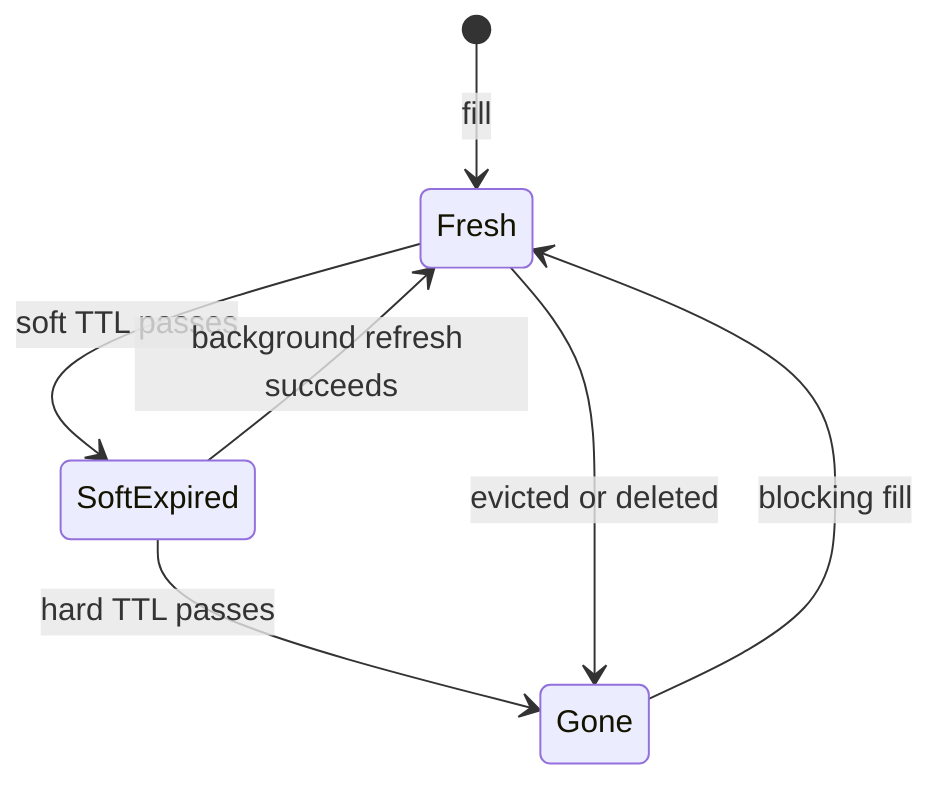

# TTL design

## Learning objectives

After studying this chapter you should be able to:

- Explain what a time-to-live (TTL) guarantees and what it does not.
- Choose a TTL from a staleness budget, a change rate and a miss cost, using the simple models in this chapter.
- Compute the hit ratio of a key as a function of its request rate and TTL.
- Explain why synchronized expiry is dangerous and apply jitter correctly, with numbers.
- Distinguish soft TTL from hard TTL and implement stale-while-revalidate.
- Design negative caching safely.
- Contrast absolute and sliding expiration and know when each is appropriate.

## 1. What a TTL is

A **time-to-live** (TTL) is a duration attached to a cache entry. Once the entry has lived that long, the cache must treat it as absent. The TTL is the simplest invalidation mechanism there is: it needs no communication with the writer, no event stream and no knowledge of what depends on what. The entry simply dies of old age, and the next reader repopulates it from the source of truth.

A TTL gives exactly one guarantee, and it is a one-sided one:

> An entry will not be served more than TTL seconds after it was stored (assuming the cache's clock is reasonable).

It follows that, in the absence of other mechanisms, the staleness of a read is at most the TTL: if the source changes right after the fill, the cache serves the old value until expiry. A TTL therefore converts an unbounded staleness problem into a bounded one. This is why the previous chapter insisted that every entry should have one, even when you also use explicit invalidation. In that case the TTL is a **backstop** for the cases where the explicit mechanism fails.

A TTL guarantees nothing in the other direction. The entry may disappear much sooner, because of eviction pressure, a restart or a manual flush. A TTL is an upper bound on lifetime, never a promise of residence.

## 2. Choosing a TTL

There is no universal right value. Three quantities pull in different directions.

1. **The staleness budget** gives an upper bound: the TTL cannot exceed it. If product prices may lag by 30 seconds, TTL ≤ 30 s (and less, if invalidation can add delay).
2. **The change rate** of the data indicates how much staleness a TTL will actually expose. Data that changes once a month is barely affected by a one-hour TTL.
3. **The miss cost and request rate** pull towards a longer TTL: every expiry costs a backend fetch. A long TTL amortises that cost over more requests.

### 2.1 Hit ratio as a function of TTL

Consider one key requested as a Poisson process with rate lambda per second (arrivals are random and independent). The entry is filled by a miss, lives for T seconds, and then expires; the next request after expiry misses and refills. A cycle therefore consists of one miss followed by every request that arrives within the next T seconds, and then a gap until the next request after expiry. The expected number of hits per cycle is lambda × T. So the per-key hit ratio is

```
h = (lambda * T) / (1 + lambda * T)
```

**Worked examples** (TTL T = 60 s):

- Hot key, lambda = 1 request per second: lambda T = 60, h = 60 / 61 = 98.4 percent.
- Warm key, lambda = 0.1 per second (one request every 10 s): lambda T = 6, h = 6 / 7 = 85.7 percent.
- Cool key, lambda = 0.01 per second (every 100 s): lambda T = 0.6, h = 0.6 / 1.6 = 37.5 percent.
- Cold key, lambda = 0.001 per second (every 1,000 s): lambda T = 0.06, h = 0.06 / 1.06 = 5.7 percent.

This tells us something important about TTL-governed caches. A short TTL is fine for popular keys and almost useless for the long tail: the tail keys expire before they are requested again. To get a 90 percent hit ratio on a key requested every 100 seconds, we need lambda T = 9, hence T = 900 seconds. But the same TTL applied to all keys has a very different staleness effect on each. This is one reason why different data classes should get different TTLs, rather than a single global default.

(The model assumes the entry is never evicted early and that expiry is measured from the fill. Under a sliding expiration, which we meet later, the dynamics differ.)

### 2.2 Combining the two: a simple selection procedure

1. Start from the staleness budget B: the maximum acceptable staleness. Set T ≤ B.
2. Estimate the change rate mu. From the previous chapter, the stale fraction exposure is about mu × T / 2 for small mu × T. If this is acceptable at T = B, take T = B.
3. Check the hit ratio for typical keys: compute lambda × T for the median and the 10th percentile key. If tail keys get no benefit, consider whether to cache them at all, or give them a longer TTL if their staleness cost is lower.
4. Check the backend load generated by expiry: for N keys each refilled once per cycle, steady-state refill load is roughly N / (T + 1/lambda) per second. If N = 1,000,000 keys with TTL 300 s and low request rates, this is up to about 3,300 backend fetches per second. Does the backend have the capacity?
5. Add jitter (next section) and a backstop.

**Worked example.** A catalogue of 2 million items, each requested on average once every 500 seconds (lambda = 0.002). Staleness budget: 5 minutes (300 s). Backend can serve 1,500 fetches per second. Try T = 300:

```
lambda * T = 0.002 * 300 = 0.6       h = 0.6 / 1.6 = 37.5 percent
requests/s = 2,000,000 * 0.002 = 4,000
misses/s   = 4,000 * (1 - 0.375) = 2,500
```

2,500 per second exceeds the backend capacity of 1,500. The TTL that the budget allows is not enough to protect the backend. Options: relax the budget (pushing T to 900 s gives lambda T = 1.8, h = 64.3 percent, misses = 4,000 × 0.357 = 1,429 per second, just under capacity); use explicit invalidation so that the TTL can be long (hours) while freshness is maintained by deletes; or use stale-while-revalidate (section 5). The arithmetic told us in a few lines that the naive design fails.

## 3. Synchronized expiry and jitter

### 3.1 The problem

Entries tend to be created together. A deploy flushes the cache; a batch job loads a million keys at 03:00 with a TTL of one hour; a cache node restarts and refills during the morning rush. If all entries share the same TTL, they also expire together, and the backend receives a wave of misses at once, which is a form of thundering herd (the next chapters on stampedes study it in detail).

**Worked example.** Suppose one million keys were loaded within the same second and have T = 300 s. At time 300 s every key expires. Next, each key is re-requested at its own rate. The first requests for each key arrive within roughly the mean inter-arrival time. If the keys are fairly popular (lambda = 0.1 per second each), then within the first second, about 1,000,000 × (1 − e^−0.1) ≈ 95,000 keys are re-requested, and the backend sees about 95,000 queries per second for a few seconds, against a steady state of N / (T + 1/lambda) = 1,000,000 / 310 ≈ 3,200 per second. A thirty-fold spike, caused purely by synchronisation.

### 3.2 The remedy: randomise the TTL

Instead of a fixed T, store each entry with a TTL drawn at random from an interval around T. A common form is

```
ttl = base * (1 + uniform(-j, +j))            // for example j = 0.1 gives +/- 10 percent
```

Now the one million keys expire spread over a window of 2 × j × base = 60 seconds (T from 270 to 330), roughly evenly:

```
expiry rate = 1,000,000 / 60 = about 16,700 keys per second
```

That is still a lot, but the spike is spread out and, because keys are re-requested only after expiry, the backend load is the smaller of the expiry rate and the request-driven refill. Wider jitter flattens it further: j = 0.5 (150 to 450 s) gives 1,000,000 / 300 = 3,300 per second, which is the steady-state rate. The tradeoff is that wider jitter makes the effective staleness bound less tight: the maximum TTL is now base × (1 + j).

Guidelines:

- Choose the jitter fraction j from the number of keys that may be filled together, not by habit. The expiry spread must be wide enough so that N / spread is below the backend's capacity.
- Apply jitter on every `set`, not once when creating the key. Otherwise entries that are refilled after a synchronized expiry become synchronized again.
- Prefer the staleness budget as the **maximum** of the distribution, so jitter should subtract from the TTL: ttl = base × (1 − uniform(0, j)). Then T never exceeds the base value.

```java
Duration jittered(Duration base, double j) {
    double factor = 1.0 - ThreadLocalRandom.current().nextDouble() * j;  // in (1-j, 1]
    return Duration.ofMillis((long) (base.toMillis() * factor));
}
// cache.set(key, value, jittered(Duration.ofSeconds(300), 0.2));  // 240..300 s
```

```cpp
std::chrono::seconds jittered(std::chrono::seconds base, double j) {
    static thread_local std::mt19937_64 rng{std::random_device{}()};
    std::uniform_real_distribution<double> u(0.0, 1.0);
    return std::chrono::seconds(
        static_cast<long>(base.count() * (1.0 - u(rng) * j)));
}
```

Jitter also helps at other layers: DNS records, HTTP caches, token refreshes and client polling intervals all benefit from randomisation, for the same reason.

## 4. Soft TTL versus hard TTL

A single expiry time forces a binary choice at the moment of expiry: serve the entry or discard it. A richer design uses two thresholds.

- **Soft TTL** (also called refresh time or fresh-until): after this time the entry is _stale but still present_. Readers may still be served the entry, but a refresh is triggered.
- **Hard TTL** (the physical expiry): after this time the entry is gone. Readers must wait for a fresh fetch.

The entry is stored in the cache with the hard TTL as its physical expiry, and the soft expiry is stored in the value itself:

```java
record Envelope<V>(V value, long softExpiresAtMillis) {}

V get(String key) {
    Envelope<V> e = cache.get(key);                // physical TTL = hard TTL
    long now = clock.millis();
    if (e == null) {
        return loadAndStore(key);                  // hard miss: caller waits
    }
    if (now < e.softExpiresAtMillis()) {
        return e.value();                          // fresh
    }
    // Soft-expired: serve the stale value, refresh in the background
    if (refreshGuard.tryAcquire(key)) {            // only one refresher per key
        executor.submit(() -> loadAndStore(key));
    }
    return e.value();
}
```

Suppose soft TTL = 60 s and hard TTL = 300 s. For the first minute the entry is fresh. From 60 s to 300 s the entry is served immediately while one background request refreshes it. In the common case the refresh completes within milliseconds, so users essentially never see a stale value for long, and **never wait for a miss**. Only if the refresh keeps failing (backend down, say) does the entry live to its hard expiry. In effect, the hard TTL is how long you are willing to serve stale data when the source is unavailable.

Benefits:

1. **Latency**: readers on hot keys do not wait for refills. The slow fetch is moved off the request path.
2. **Backend protection**: only one refresher per key (guarded) rather than a herd, and the refresh can use a lower priority.
3. **Resilience**: if the source fails, the cache continues serving stale data, for a bounded time. This is sometimes called "serve stale on error".

Costs: the staleness bound is now the hard TTL, not the soft one (during a backend outage); you need to store the soft expiry (a few bytes); and the refresh guard must be distributed if several app servers share the key, for instance with a short-lived lock key or a lease. The stampede chapters examine the guard in detail.

## 5. Stale-while-revalidate

The same idea standardised for HTTP caches is the `stale-while-revalidate` directive, defined in an RFC for HTTP cache-control extensions (RFC 5861, together with `stale-if-error`). A response with

```
Cache-Control: max-age=60, stale-while-revalidate=240
```

is fresh for 60 seconds, and for the next 240 seconds a cache may serve it as stale while it revalidates in the background. A matching directive, `stale-if-error`, lets a cache serve a stale response when the origin returns errors. These directives map precisely to the soft TTL (max-age) and the extended window of the hard TTL.

Let us redo the earlier backend-protection arithmetic. In the catalogue example, T = 300 s gave 2,500 misses per second, because each expiry sends a reader to the backend. With stale-while-revalidate, the number of backend fetches does not change at the key level (each key is still refreshed about once per soft TTL when it is being requested), but a refresh is only triggered when a request _arrives_, and requests are now never blocked. For latency purposes the effective hit ratio is nearly 100 percent: the "misses" are served stale while the refresh happens in the background. For _backend load_ purposes, the picture improves in one way and does not in another. It improves because keys that nobody requests after the soft expiry are never refreshed (no refresh-ahead waste). It does not improve for keys that are requested regularly: they are refreshed once per soft TTL regardless. To lower backend load you still need a longer soft TTL or explicit invalidation.

## 6. Negative caching

A **negative cache entry** records the fact that the source returned "not found" (or an error). Without it, requests for nonexistent items always reach the backend. This matters for the correctness of capacity planning: if a crawler requests 1,000 nonexistent URLs per second, each of which costs a database lookup, a cache with a 99 percent hit ratio on real items is still not protecting the database.

The DNS protocol standardised the idea early: RFC 2308 describes caching of negative responses ("no such name") for a duration controlled by the zone's authority. The same design applies in application caches.

Rules for negative caching:

1. **Use a short TTL**, much shorter than the positive TTL. A newly created item must become visible quickly. For example 30 seconds for negative entries versus 10 minutes for positive.
2. **Invalidate on create.** When the item is created, delete the negative entry in the same code path, as for any other write.
3. **Distinguish "not found" from "error".** Cache "not found" (a definitive answer). Do not cache transient errors such as timeouts for long; if you cache errors at all, cache them for a few seconds, to shield a struggling backend, and label them clearly.
4. **Bound the pollution.** An attacker (or a buggy client) can generate infinite distinct nonexistent keys, filling the cache with negative entries and evicting real ones. Use a separate keyspace with a size limit, a Bloom filter in front (see the lesson on penetration), or rate limiting.
5. **Store a sentinel**, not a null, so that "absent" is distinguishable from "not cached" (many caches return null for a missing key).

```java
final Object NOT_FOUND_MARKER = "__not_found__";   // sentinel; in practice a serialized marker

User getUser(long id) {
    Object cached = cache.get("user:" + id);
    if (cached == NOT_FOUND_MARKER) return null;      // cached negative
    if (cached != null) return (User) cached;
    User u = db.findUser(id);
    if (u == null) cache.set("user:" + id, NOT_FOUND_MARKER, Duration.ofSeconds(30));
    else           cache.set("user:" + id, u, Duration.ofMinutes(10));
    return u;
}
```

The effect of a 30-second negative TTL on a nonexistent key requested 10 times per second is a drop from 10 backend lookups per second to 1 every 30 seconds, about a 300-fold reduction for that key.

## 7. Absolute versus sliding expiration

**Absolute expiration** (the default in most caches): the entry expires T seconds after it was written, regardless of use. Staleness is bounded by T.

**Sliding expiration**: every read extends the entry's life (the clock restarts at each access). The entry expires T seconds after its _last access_. This is the right model for sessions ("log out after 30 minutes of inactivity") and for caches where you want to keep what is in use and drop what is not.

Danger: sliding expiration alone gives **unbounded staleness** for popular keys. A key read every few seconds never expires, so it would never be refreshed from the source. For derived-data caches, combine the two: a sliding window for retention plus an absolute maximum lifetime (a hard cap), so that even a constantly used entry is refreshed periodically.

| Property              | Absolute                     | Sliding                   |
| --------------------- | ---------------------------- | ------------------------- |
| Staleness bound       | T                            | None unless capped        |
| Keeps popular entries | Only until T, then refill    | Indefinitely              |
| Typical use           | Cached query results, config | Sessions, idle timeouts   |
| Memory behaviour      | Predictable (Little's law)   | Depends on access pattern |

## 8. Clocks, units and operational gotchas

- **Clock source.** A TTL is evaluated by the cache server against its own clock (relative durations), so client clock skew does not matter for server-enforced TTLs. For absolute timestamps embedded in values (such as the soft expiry in the envelope), skew between servers does matter: use a skew-tolerant margin or have the cache compute times.
- **Expiry is lazy.** Many caches remove expired entries only when touched or by a periodic sampler, so memory may remain occupied after expiry. Expired entries do not appear to readers, but they count against memory until reclaimed. Check how your cache does it.
- **Unit mistakes.** Seconds versus milliseconds is a classic bug: a TTL of 300 interpreted as milliseconds yields a cache that never works; 3600000 interpreted as seconds yields 41 days. Wrap durations in typed values (`Duration`, `std::chrono`).
- **Zero and negative TTL.** Check what your cache does for 0 or negative values: in some systems it means "no expiry", in others "expire immediately".
- **Per-key TTL vs per-cache default.** Prefer to state the TTL at each call site, by data class, rather than relying on a hidden global default. Keep a table of data classes and TTLs reviewed with the owners.



## 9. Common pitfalls

1. **One global TTL.** Different data has different change rates and budgets.
2. **No jitter.** Leads to synchronized expiry and periodic backend spikes.
3. **Jitter applied only at creation.** Re-synchronizes after the first wave.
4. **TTL longer than the staleness budget** because "it rarely changes". Rare is not never.
5. **Caching errors with long TTLs.** A one-second blip becomes a ten-minute outage.
6. **Negative entries never invalidated on create.** New items stay invisible until the negative entry expires.
7. **Sliding expiration with no cap.** Hot keys are never refreshed.
8. **Assuming expiry frees memory immediately.** Lazy expiry delays reclamation.
9. **Soft TTL without a single-refresher guard.** Every request after the soft expiry triggers a refresh, which is the stampede you tried to avoid.

## 10. Check your understanding

1. A key is requested as a Poisson process at 0.05 requests per second and has a TTL of 120 s. What is its expected hit ratio? What TTL is needed for 90 percent?
2. 600,000 keys are all loaded at once with a TTL of 600 s. Compute the expiry rate (keys per second) with no jitter versus a jitter that spreads TTLs uniformly over 540 to 600 s.
3. Explain the difference between soft and hard TTL and what the user experiences at each stage for a hot key.
4. Why should a negative cache entry have a shorter TTL than a positive one, and what must happen when the item is created?
5. A session store uses sliding expiration with a 30-minute idle timeout. What additional control would you add for security, and why?
6. A configuration value changes about once per day and is read by 500 servers every second each. A TTL of 1 hour is proposed. What would the staleness exposure and the backend load be if each server has its own in-process cache?

## 11. Answers

1. lambda T = 0.05 × 120 = 6, h = 6/7 = 85.7 percent. For 90 percent: lambda T / (1 + lambda T) = 0.9 gives lambda T = 9, T = 9 / 0.05 = 180 s.
2. No jitter: all 600,000 expire in the same instant (an effectively unbounded rate for that second). Jitter over 60 s: 600,000 / 60 = 10,000 keys per second.
3. The soft TTL is when the entry stops being fresh; the hard TTL is when it is removed. A hot key between the two is served immediately while one background refresh runs, so users see no latency. After the hard TTL (only if refresh failed repeatedly) readers wait for a blocking fill or an error.
4. Newly created items must become visible quickly, and a long negative TTL would hide them. On create, delete the negative entry (or overwrite it with the real value).
5. An absolute maximum session lifetime (for example 8 or 24 hours), since sliding expiry alone lets an active or stolen session live forever. Explicit revocation is also needed.
6. Staleness exposure is up to 1 hour after a change (a mean exposure of about 30 minutes for each change, if the change arrives uniformly within a cache cycle). Backend load: 500 servers each refreshing once per hour is 500 / 3600 = 0.14 fetches per second, trivial, so a shorter TTL (for example 60 s, giving 8.3 per second) is affordable and would reduce staleness sixtyfold.

## 12. Summary

A TTL converts unbounded staleness into bounded staleness at zero coordination cost, and every entry should have one. The right value comes from the staleness budget (upper bound), the change rate (exposure) and the miss cost with request rate (the per-key hit ratio is about lambda T / (1 + lambda T)). Short TTLs suit popular keys and defeat the long tail. Synchronized expiry creates backend spikes, so apply jitter on every fill, sized from the number of keys and the backend capacity. Soft and hard TTLs separate freshness from availability and enable stale-while-revalidate, which removes refills from the request path provided only one refresher runs per key. Negative caching protects the backend from lookups of nonexistent items when its TTL is short, invalidated on create and bounded in size. Sliding expiration needs an absolute cap. The next lesson, Explicit and event-driven invalidation, covers the ways to be fresher than a TTL allows.
