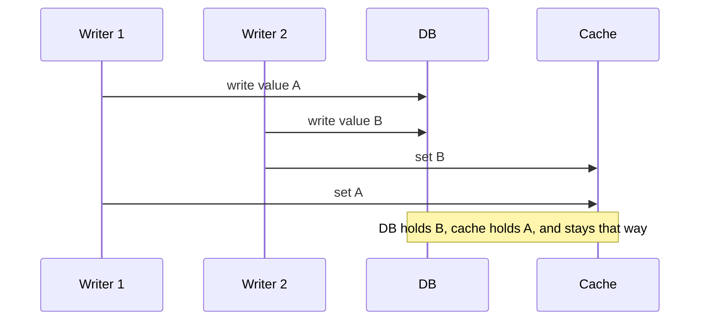
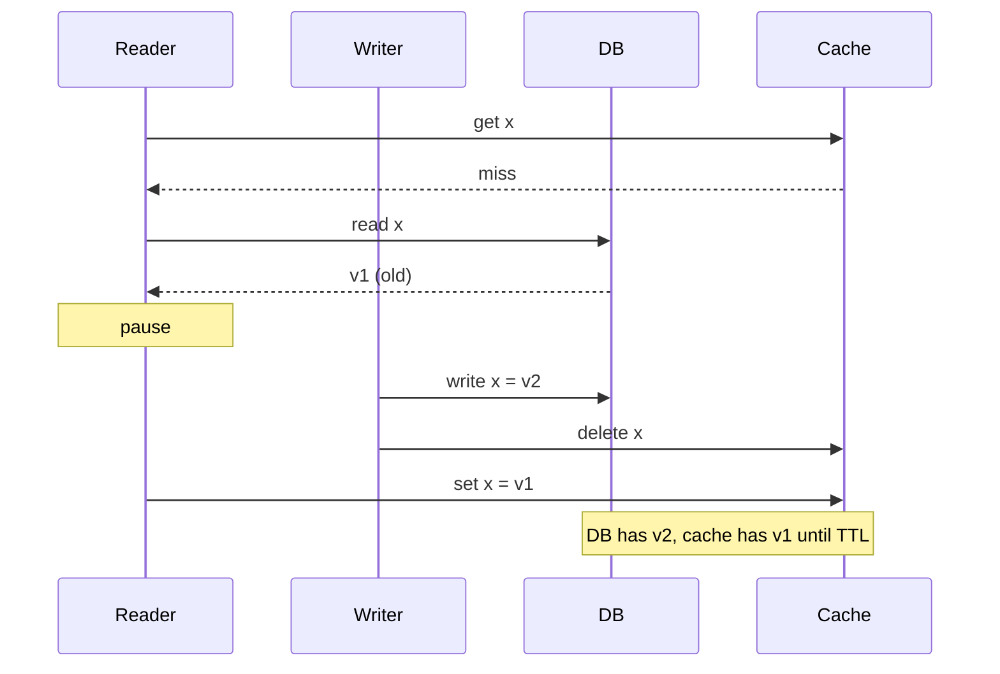

# Why invalidation is hard

## Learning objectives

After studying this chapter you should be able to:

- Define staleness precisely and distinguish it from inconsistency in general.
- Explain why keeping a cache and a database in step is a distributed systems problem even when both live in the same data centre.
- Enumerate the main invalidation strategies and what each trades away.
- Walk through, step by step, the race conditions of the cache-aside pattern and show how a stale value can persist indefinitely.
- Explain the dependency problem: one write affecting many cached derived values.
- State a staleness budget as a concrete, testable requirement.

## 1. The problem in one paragraph

A cache holds a copy of data that lives somewhere else. When the original changes, the copy is wrong. We want the copy to be dropped or corrected promptly, we want that to happen reliably, and we want it to cost less than the savings the cache was supposed to bring. Each of these desires pulls against the others. Prompt invalidation requires coordination with the writer. Reliable invalidation requires handling lost messages and crashes. Cheap invalidation requires not doing much work on every write. Put these together with concurrency, and the apparently simple question "when the data changes, remove it from the cache" turns into a genuine research topic. The saying that cache invalidation is one of the two hard problems in computer science is a joke, but a joke that survives because it is true.

This chapter explains why. The following chapters, TTL design, Explicit and event-driven invalidation, and Consistency models and leases, offer the remedies.

## 2. Terms: truth, copies and staleness

Let us fix vocabulary.

- The **source of truth** (or system of record) is the one store whose value is authoritative. Typically a database.
- A **cached copy** is a value derived from the source of truth at some earlier time.
- A cached copy is **stale** at time t if the source of truth has changed since the moment the copy was derived, and the change is visible to anyone who reads the source at time t.
- The **staleness** (or age of staleness) of a read is the time between the first change of the source after the copy was taken, and the moment the copy is read. It is zero when the copy is fresh.
- The **staleness window** of a system is the maximum staleness that can occur. It is the number a product owner should approve.

Notice that staleness is relative to a _reader's point of view_. If a write has been accepted by the database a millisecond ago, but has not yet been replicated, is a cached older value stale? To a reader connecting to the replica, no. To the writer who just received an acknowledgement, yes. Whenever we say "stale" we need to say "relative to what". This subtlety leads to the formal consistency models of the fourth chapter in this section.

Not all inconsistency is staleness. A cache can also hold a value that **never existed** in the source (a torn read combining fields from two versions), or a value from the _future_ relative to a read replica. These are different bugs, but they share causes.

## 3. Why can't we just update both?

The naive solution is to write to the database and then write the new value to the cache, in application code:

```java
void updateUser(User u) {
    db.update(u);          // step 1
    cache.set(key(u), u);  // step 2
}
```

This is the **dual write** problem, and it cannot be made correct by local reasoning alone. The two steps are not atomic. Between them, the process may crash, the network may fail, or another thread may interleave. Let us enumerate the ways it can go wrong.

**Failure 1: crash between the steps.** The database has the new value, the cache has the old value. Nothing will fix it until the entry expires. If the cache has no TTL, it is wrong forever.

**Failure 2: the second step fails.** The cache is unreachable for a second. The write to it errors. If the application ignores the error, the cache is stale. If it propagates the error, the user sees a failure for an update that did commit in the database, and may retry, which is usually safe but not always.

**Failure 3: concurrent writers reorder.** Two writers update the same row. Their database writes and cache writes can interleave in different orders:



The database serialises the two writes with A first and B second, so B is the truth. But the cache calls arrive in the opposite order, so the cache ends with A. There is no TTL in this scenario to rescue us, and no later write may come: the wrong value can persist for as long as the entry lives. Nothing in the code looks wrong in isolation. The bug exists only in the interleaving.

This should convince you of the main point: **two independent systems cannot be updated together without a protocol**. Distributed systems theory has solutions (two-phase commit, consensus, a single log from which both are derived) but each one is far more expensive than "just set the key", and most caches are chosen precisely because they are cheap.

## 4. The strategies, briefly

Before we go deep, here is a map of the strategies that the rest of this section covers, together with what each gives up.

| Strategy                                  | How it works                                                | Gives up                                                            |
| ----------------------------------------- | ----------------------------------------------------------- | ------------------------------------------------------------------- |
| **TTL only**                              | Entry expires after a fixed time                            | Freshness within the TTL; coherence misses at expiry                |
| **Invalidate on write** (delete)          | Writer removes the cached key after updating the database   | Race with concurrent readers; extra miss after every write          |
| **Update on write** (write-through style) | Writer sets the new value in the cache                      | Ordering races between writers; wasted work for unread keys         |
| **Versioned keys**                        | Key includes a version; a new version means a new key       | Extra lookup for the version; garbage from old versions             |
| **Event-driven**                          | Changes published (log, CDC, pub/sub); consumers invalidate | Lag, loss, duplication and reordering of events; new infrastructure |
| **Leases / tokens**                       | Cache grants a token on miss; stale fills are rejected      | Cache must support it; added protocol complexity                    |
| **Never cache it**                        | Skip the problem                                            | Performance                                                         |

The right answer for a real system is almost always a **combination**: for example, delete on write for promptness, plus a TTL as a safety net for the cases where the delete is lost or raced, plus a lease or a versioned fill to close the race. Few designs use just one mechanism.

## 5. Cache-aside and its races

The most common pattern in application caching is **cache-aside** (sometimes called lazy loading). The application is responsible for talking to both the cache and the database:

```java
Value read(Key k) {
    Value v = cache.get(k);
    if (v != null) return v;       // hit
    v = db.read(k);                // miss: go to the source of truth
    cache.set(k, v, ttl);          // populate
    return v;
}

void write(Key k, Value v) {
    db.write(k, v);                // update the source of truth
    cache.delete(k);               // invalidate; next read refills
}
```

Deleting rather than updating on write is the standard advice, and it is the right default; the reasons are discussed in detail in the lesson on explicit invalidation. The code looks correct. It is not, quite. Let us see how it fails.

### 5.1 Race A: the slow reader (stale fill)

A reader misses, reads the old value from the database, and is then delayed (a garbage collection pause, a slow network, a context switch). Meanwhile a writer completes. The reader then writes its old value into the cache.



The step-by-step interleaving, with times:

| Time | Actor  | Action                         | DB  | Cache  |
| ---- | ------ | ------------------------------ | --- | ------ |
| t0   | Reader | `get x`, miss                  | v1  | empty  |
| t1   | Reader | reads x from DB, gets v1       | v1  | empty  |
| t2   | Writer | writes x = v2                  | v2  | empty  |
| t3   | Writer | `delete x` (nothing to delete) | v2  | empty  |
| t4   | Reader | `set x = v1`                   | v2  | **v1** |

The writer did everything right. It updated first and deleted second. Yet the cache holds a value that is older than the database, and it will keep it until the TTL expires. If the TTL is one hour and reads are frequent, thousands of requests see v1 after the update committed.

How likely is it? It requires a read that straddles a write, where the window between the reader's database read (t1) and its cache fill (t4) must contain the writer's write and delete. That window is typically milliseconds. For one hot key with reads thousands of times per second and a write every few minutes, the probability per write of a reader being in the vulnerable window is small but not negligible. Suppose a read-miss path takes 5 ms between database read and cache fill, and reads of this key miss at 50 per second right after a deletion (because the key is hot, many readers miss together): the expected number of readers in the window at the moment of a write is about 50 × 0.005 = 0.25, so a quarter of all writes to this key could leave a stale value behind. This is why the race, which seems theoretical, actually shows up in production on hot keys, usually long after the code was written.

### 5.2 Race B: the delete lands before the replica catches up

If reads go to a **read replica** and writes to a primary, then there is replication lag. The writer updates the primary, then deletes from the cache. A reader misses at once and reads from a replica that has not yet applied the write, so it reads the old value and caches it.

| Time | Actor   | Action                   | Primary | Replica | Cache  |
| ---- | ------- | ------------------------ | ------- | ------- | ------ |
| t0   | Writer  | writes x = v2 on primary | v2      | v1      | v1     |
| t1   | Writer  | `delete x`               | v2      | v1      | empty  |
| t2   | Reader  | miss, reads replica      | v2      | v1      | empty  |
| t3   | Reader  | `set x = v1`             | v2      | v1      | **v1** |
| t4   | Replica | applies write            | v2      | v2      | v1     |

Even after the replica catches up at t4, the cache keeps v1. Here no delay was needed in the reader at all. Replication lag, typically milliseconds but sometimes seconds under load, acted as the delay. Race B is the reason people recommend a TTL even when you have explicit invalidation, and it is the motivation for techniques such as delayed double deletion and for deriving invalidations from the replication stream itself (see Explicit and event-driven invalidation).

### 5.3 Race C: the writer's cache update goes first

If instead the writer updates the cache and then the database, a reader may interleave: the reader sees the new cached value, but the database write may subsequently fail and roll back, leaving a cached value that never existed in the source of truth. This is the "value from the future" problem. Ordering the operations as "database first, then cache" avoids phantom values, but then we face races A and B. There is no free lunch in the ordering.

### 5.4 What the races have in common

All three races have the same structure: **an operation computed from a read of the source of truth is applied to the cache after a conflicting write**. The cache is being updated using information that was true when it was read and false by the time it was applied. In distributed systems vocabulary, this is a "time-of-check to time-of-use" problem. The cure is to make the cache apply an operation only if nothing relevant has happened since the read. That is exactly what leases, version checks and compare-and-set achieve, and they are the subject of the lesson on consistency models and leases.

## 6. The dependency problem

So far we assumed one cached key corresponds to one database row. Real caches hold **derived data**: a rendered page that includes a user's name, a count of items in a category, a search result list, a recommendation computed from many rows.

Suppose a blog's front page is cached under the key `frontpage`, and it embeds the title, author name and comment count of ten articles. What invalidates it?

- Any edit to the title of any of the ten articles.
- A rename of any of the authors.
- A new comment on any of the ten articles.
- A change in the ranking rule that picks which ten articles to show.
- A new article that outranks one of the ten.

One cached value depends on potentially hundreds of rows, and one row (an author's name) may appear in hundreds of cached values (every page by that author, every comment list, every search result). Invalidation needs a **reverse index** from rows to the cache keys that depend on them, or a conservative rule such as "invalidate all page-level keys on any write", which destroys the hit ratio. Maintaining such a dependency graph is as hard as the original problem, because the graph is itself state that must be consistent with the data.

Practitioners use several tactics, each a tradeoff:

1. **Cache at a lower granularity** (rows, not pages), and assemble at request time. More lookups per request, but invalidation becomes a one-key problem.
2. **Use tags or groups.** Associate cache keys with tags such as `author:42`, and invalidate by tag. Some cache libraries support this. A common implementation keeps a per-tag _generation number_: keys embed the current generation, and bumping the number orphans every key carrying the old one. (We study versioned keys in the next lessons.)
3. **Accept bounded staleness** for derived data. A homepage that is up to 60 seconds old is fine for most sites. A short TTL replaces the dependency graph.
4. **Recompute asynchronously.** A background job rebuilds the derived value when inputs change, publishing a new version. This is the materialised view approach.

The lesson: the hardness grows with the complexity of the dependency between source data and cached values. If a derived value depends on many inputs, strongly consider giving it a TTL as its _only_ invalidation mechanism.

## 7. A staleness budget

Because perfect invalidation is unattainable, mature teams replace the vague goal "the cache should be up to date" with a **staleness budget**: a statement of the form

> _For cached object type X, a reader must never see a value older than T seconds after the corresponding write was acknowledged, in at least P percent of cases, and never older than T_max._

A budget has three virtues. It is _testable_: you can write a test that updates a row and polls the cache. It is _negotiable_: product owners can weigh the cost of shorter staleness. And it _selects the mechanism_: if the budget is 24 hours, a TTL is enough; if it is a few seconds, you need explicit invalidation plus a short TTL backstop; if it is zero for some read paths, those paths must bypass the cache.

Examples of plausible budgets (illustrative, to be set by the owner of the data):

| Data                           | Budget          | Mechanism                                     |
| ------------------------------ | --------------- | --------------------------------------------- |
| Static marketing images        | Hours to days   | Long TTL, versioned file names                |
| Product description            | Minutes         | TTL plus delete on edit                       |
| Product price on display       | Seconds         | Short TTL plus delete on update               |
| Stock level shown to browser   | Tens of seconds | Short TTL; checkout re-checks the database    |
| Permission revocation          | Seconds         | Event-driven invalidation plus very short TTL |
| Account balance for a decision | Zero            | Do not read from cache                        |

### 7.1 Estimating exposure

Suppose an object is updated on average once every 10 minutes (600 s), and no explicit invalidation exists, only a TTL of T. If updates arrive randomly (a Poisson process with rate mu = 1/600 per second), what fraction of reads sees stale data? A read at age a (time since the fill) sees stale data if an update occurred in the last a seconds, which has probability 1 − e^(−mu × a). Averaging uniformly over ages from 0 to T gives the stale fraction:

```
stale fraction = 1 - ( 1 - e^(-mu*T) ) / ( mu*T )
```

For T = 60 s: mu*T = 0.1, (1 − e^−0.1) / 0.1 = 0.0952 / 0.1 = 0.952, so the stale fraction is 4.8 percent.
For T = 300 s: mu*T = 0.5, (1 − e^−0.5) / 0.5 = 0.3935 / 0.5 = 0.787, so 21.3 percent.
For T = 30 s: mu*T = 0.05, (1 − e^−0.05) / 0.05 = 0.0488 / 0.05 = 0.975, so 2.5 percent.

Roughly, the stale fraction is about mu × T / 2 when mu × T is small. This gives an intuition for a TTL-only design: halving the TTL halves the staleness exposure, but also lowers the hit ratio (the TTL chapter works through that trade). (The formula assumes reads are spread evenly over the entry's lifetime and that the entry is always resident; it is an approximation, not a law.)

## 8. Defence in depth

Because each mechanism has failure modes, robust designs layer them:

1. **Primary mechanism**: delete on write, or an event stream, for promptness.
2. **Race closure**: leases, version checks or a delayed second delete, for the fill-versus-invalidate race.
3. **Backstop**: a TTL on every entry, so any residual error is bounded in time. _Every cache entry should have an expiry_, even if it is long.
4. **Detection**: sampling comparison between the cache and the source of truth in the background; the observed disagreement rate is a live measurement of your real staleness.
5. **Escape hatch**: a way to purge a key, a prefix or a whole cache in an emergency.

The sampling check in particular is underrated. A few lines of code can read a random sample of cached keys every minute, compare each with the database and export the percentage that differs. If you have never measured it, you do not know how wrong your cache is.

```java
// Staleness probe: sample keys, compare with the source of truth.
void probe(List<String> sampleKeys) {
    int stale = 0, checked = 0;
    for (String key : sampleKeys) {
        Value cached = cache.get(key);
        if (cached == null) continue;           // nothing to compare
        Value truth = db.read(key);
        checked++;
        if (!cached.equals(truth)) stale++;
    }
    metrics.gauge("cache.stale_ratio", checked == 0 ? 0 : (double) stale / checked);
}
```

Note that this probe has its own race (the row may change between the two reads), so treat small nonzero rates as noise and look at trends.

## 9. Common pitfalls

1. **Believing "delete after write" is race-free.** It closes the update-ordering race, but not the slow-reader race or the replica-lag race.
2. **Entries without TTL.** One lost invalidation then becomes a permanent error.
3. **Swallowing cache errors on the write path.** A failed delete is a stale entry. At least log it and retry, or rely on a short TTL.
4. **Treating cached derived data like cached rows.** Page and aggregate caches have dependency graphs; do not pretend otherwise.
5. **Not defining staleness in numbers.** Without a budget, no design can be judged correct.
6. **Testing only sequentially.** The bugs here need concurrency. Unit tests that run read then write then read will pass.
7. **Reading from replicas to fill the cache.** Replica lag makes stale fills likely. Fill from the primary, or version the fill.

## 10. Check your understanding

1. Define staleness. Why does "stale" depend on the reader's point of view?
2. Draw the interleaving by which two concurrent writers leave the cache with the older value when each performs "database write, then cache set".
3. In cache-aside with delete-on-write, explain the slow-reader race and how long the stale value persists.
4. A row is updated on average every 20 minutes. Using the approximation stale fraction ≈ mu × T / 2, estimate the fraction of stale reads for TTLs of 1 minute and 10 minutes.
5. Why is invalidating a rendered page harder than invalidating a single database row?
6. Write a one-sentence staleness budget for product prices on a catalogue page.

## 11. Answers

1. Staleness is the time elapsed since the source of truth changed while a reader still receives the older value. It depends on the reader's view because replicas, caches and the writer's acknowledgements each have a different notion of the "current" value; a value can be current for a lagging replica reader while stale for the writer who just committed.
2. W1 writes A to the database; W2 writes B to the database (B is the later value); W2 sets B in the cache; W1 sets A in the cache. The cache ends with A while the database holds B. The cache calls arrive in a different order than the database commits.
3. The reader misses, reads v1 from the database, stalls; the writer commits v2 and deletes the (absent) key; the reader then sets v1. The cache keeps v1 until its TTL expires or another invalidation arrives. Hence the TTL bounds the damage.
4. mu = 1/1200 per second. For T = 60: 60 / 1200 / 2 = 0.025, about 2.5 percent. For T = 600: 600 / 1200 / 2 = 0.25, about 25 percent (the approximation is rough at this size; the exact formula gives 1 − (1 − e^−0.5)/0.5 = 21.3 percent).
5. A page depends on many rows, and a row may appear in many pages. You need a reverse mapping from rows to dependent keys, or you must invalidate conservatively. Either costs correctness, hit ratio or complexity.
6. For example: "A product price shown on a catalogue page may lag the database by at most 30 seconds; the checkout flow always reads the current price from the database."

## 12. Summary

A cache is a derived copy of data owned elsewhere, and keeping it correct is a distributed systems problem: two stores cannot be updated atomically by simple application code. Dual writes fail on crashes, errors and reordering. Cache-aside with delete-on-write is the usual pattern, but it still admits races: the slow reader that fills the cache with a value read before a write, and replica lag that lets a reader refill with old data. All the races share the shape of applying an operation computed from an old read. Derived data adds a dependency problem that is as hard as the original. The practical response is a numeric staleness budget, a layered defence of prompt invalidation, race closure and a TTL backstop, plus measurement. The next lesson, TTL design, studies the backstop in depth.
