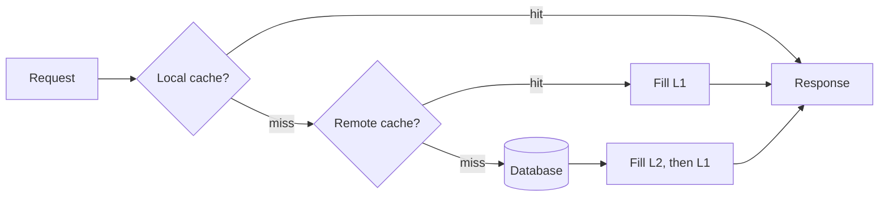

# Application, database and client-side caches, and how layers compose

## Learning objectives

After studying this lesson you should be able to:

- Compare in-process (local) caches with out-of-process (remote or distributed) caches, with latency, capacity, consistency and failure tradeoffs.
- Explain how a database buffer pool works, why query result caches fell out of favour in some databases, and how plan and statement caches differ.
- Implement memoization correctly, including bounded size and keys.
- Compute end-to-end expected latency and hit ratios when layers are stacked, and explain multiplicative filtering of misses.
- Design a multi-level cache (L1 local plus L2 remote) and identify its invalidation problems.
- State why each layer exists and when adding another layer stops paying off.

## 1. From the edge to the application

The previous lesson followed a request from the browser to the CDN edge. Suppose it misses all of them and reaches your application servers. The application itself now has several places to avoid work: a cache in its own process memory, a cache in a separate service such as Redis or Memcached, and, inside the database, a buffer pool that avoids disk reads. At the finest grain, individual functions may memoize their results. This lesson studies those layers and then shows how they compose.

Latency orders of magnitude (approximate, vary greatly with hardware, network and load):

| Operation                                         | Rough order of magnitude                 |
| ------------------------------------------------- | ---------------------------------------- |
| Read from an in-process hash map                  | tens to hundreds of ns                   |
| Deserialize a small object from bytes             | microseconds                             |
| Round trip to a Redis/Memcached node in same zone | a few hundred microseconds to about 1 ms |
| Database query served from buffer pool (simple)   | roughly 0.1 to a few ms                  |
| Database query needing random disk reads          | several ms to tens of ms                 |
| Cross-region network round trip                   | tens to hundreds of ms                   |

These figures explain the economics: a local map is about three orders of magnitude cheaper than a network hop to a remote cache, which is itself often an order of magnitude cheaper than a database query, which is about one to two orders cheaper than a cross-region call.

## 2. In-process caches

An **in-process (local, embedded) cache** lives in the application's own heap: a `HashMap` wrapped with eviction and expiry, or a library cache such as Caffeine in Java, Guava's cache, or a bounded map in C++ or Go. The data is a pointer dereference away.

**Advantages.**

- Lowest latency, no serialization if you store objects directly, and no network failure mode.
- No extra infrastructure.
- Scales with the application: each new instance brings its own cache.

**Disadvantages.**

- **Duplication and low aggregate capacity.** With 50 instances, each caches independently, so the same hot item is stored 50 times, and the total unique capacity is only that of one instance. A cold instance (new deployment, autoscaling) starts empty and pushes load onto the database: the **cold start** problem multiplies with fleet size.
- **Inconsistency across instances.** Instance A may hold a stale value that instance B has already refreshed. Invalidation requires broadcast (pub/sub), or tolerance of a short TTL.
- **GC pressure.** Large heaps of long-lived objects burden the garbage collector. Off-heap caches or compact serialization mitigate this at the cost of copying.
- **Memory competition** with the application's own working set; an unbounded local cache is a memory leak with a nicer name.

Typical uses: configuration, feature flags, reference data, small lookups, results of expensive pure computations, and a short-lived "L1" in front of a remote cache.

```java
// Bounded in-process cache with TTL (Caffeine style API)
Cache<String, User> cache = Caffeine.newBuilder()
    .maximumSize(10_000)
    .expireAfterWrite(Duration.ofSeconds(30))
    .build();

User u = cache.get(id, k -> userRepository.load(k)); // loads once per key
```

The `get(key, loader)` pattern matters: it makes concurrent callers for the same missing key share one load rather than all hitting the database, a basic defence against stampedes.

## 3. Out-of-process caches

An **out-of-process cache** (Redis, Memcached and similar, covered later in the Distributed caches lesson) is a separate service reached over the network, often sharded across many nodes.

**Advantages.**

- **Shared**: all application instances see the same entries, so there is no duplication and a single place to invalidate.
- **Large capacity**: scale to many GB or TB by adding nodes.
- **Survives application restarts and deploys** (cache stays warm).
- Language-neutral.

**Disadvantages.**

- **Network hop and serialization** on every access, perhaps 100x slower than a local read.
- **New failure modes**: the cache may be down, slow or partitioned, and the application must degrade gracefully (timeouts, circuit breakers, fallbacks to the database without overwhelming it).
- **Operational cost**: another system to run, monitor, secure and size.
- **Hot keys**: one node may become a bottleneck for a very popular key.

### Worked example: when is the network hop worth it?

Suppose a database query takes 5 ms and a remote cache lookup takes 0.5 ms. With hit ratio h, expected latency is:

T = 0.5 + (1 - h) x 5 (the lookup is always paid; misses also pay the database).

For h = 0.9, T = 0.5 + 0.5 = 1.0 ms (5x faster). For h = 0.5, T = 0.5 + 2.5 = 3.0 ms. For h = 0.1, T = 0.5 + 4.5 = 5.0 ms, no better than not caching at all, and it still adds load on the cache and complexity. The break-even is where 0.5 + (1 - h) x 5 = 5, giving h = 0.1. Below a 10 percent hit ratio, this cache is a net loss for latency. The cache is also valuable for protecting the database even when latency gains are small, but that is a throughput argument, not a latency one, and should be measured separately.

## 4. Two-level caches: local plus remote

A common design combines both. Each application instance holds a small **L1** in-process cache, with a short TTL, in front of a shared **L2** remote cache, in front of the database.



Advantages: the hottest keys are served in nanoseconds; the remote cache is shielded from the highest request rate (this is a standard mitigation for hot keys); the database is protected by two filters. Costs: invalidation now has two levels. If you delete a key from the remote cache, every instance's L1 may still hold a stale copy until its TTL expires. Common solutions: keep L1 TTL very short (a few seconds), or publish invalidation messages to all instances via pub/sub, accepting that messages can be lost, so TTL remains the safety net. The Consistency lessons treat this in detail.

## 5. Database caches

Databases are themselves heavily cached systems.

### The buffer pool

Relational databases organize data in fixed-size **pages** (commonly 4 to 16 KB, for example 8 KB in PostgreSQL's default and 16 KB in InnoDB's). A **buffer pool** (PostgreSQL calls it shared buffers) is a region of memory holding recently used pages. When a query needs a page, the engine looks it up in the pool via a hash table; a hit avoids a disk read, a miss reads the page and may evict another. Dirty pages are written back lazily, under the **write-ahead log** discipline: the log record describing a change must be durable before the modified page is written. A **checkpoint** periodically flushes dirty pages so that recovery need only replay the log from the checkpoint. This is a textbook write-back cache with a durability protocol layered on top.

Replacement in buffer pools is typically an LRU variant with scan resistance: InnoDB splits its LRU list into "young" and "old" sublists so a full table scan does not flush the working set; PostgreSQL uses a clock-sweep algorithm with usage counts. These are the policies discussed in the Eviction chapter, running at page granularity.

The most important tuning fact: the **buffer pool hit ratio** of a healthy OLTP database is usually extremely high (often above 99 percent), because indexes' upper levels and hot rows are small relative to memory. A drop from 99.9 to 99 percent increases physical reads tenfold. If a miss costs 100 microseconds on NVMe (approximate), going from 0.1 percent to 1 percent miss rate raises the average per-page cost from about 0.1 us to 1 us of added disk wait, but with a hard disk (say 5 ms per miss) the same change raises it from 5 us to 50 us per page access. Because queries touch many pages, the impact compounds.

### Query result caches

Some databases offered a **query cache** that stored the full result set keyed by the exact SQL text, invalidated whenever any table referenced by the query was modified. MySQL had such a feature, which was deprecated and later removed (in MySQL 8.0) mainly because of scalability: invalidation required global locking, and under write-heavy workloads the cache constantly invalidated itself. The lesson is general: **table-granularity invalidation is too coarse for write-heavy workloads**, and caching results keyed by text is brittle. Today, result caching is usually done in the application with explicit keys and invalidation policy, or by materialized views, which the database refreshes on a schedule or on demand.

### Plan and statement caches

Parsing and planning SQL is costly, so databases cache **prepared statements** and **execution plans**, keyed by the statement's text with parameters as placeholders. Using parameterized queries rather than concatenating literals into SQL keeps the number of distinct texts small, which improves the plan cache hit ratio and also prevents SQL injection. Plans can become stale when data distributions change (a "parameter sniffing" problem in some engines), which is why plan caches have their own invalidation rules: statistics updates, schema changes.

### Other database-adjacent caches

Index structures themselves are a form of precomputed caching. Read replicas serve cached copies of data at the cost of replication lag, and materialized views cache query results. These are covered by consistency discussions elsewhere in this book.

## 6. Client-side memoization

At the smallest scale is **memoization**: caching a function's result keyed by its arguments. It is valid for **pure** functions (the same inputs always give the same output and there are no side effects).

```java
class Fib {
    private final Map<Integer, Long> memo = new HashMap<>();
    long fib(int n) {
        if (n < 2) return n;
        Long cached = memo.get(n);
        if (cached != null) return cached;
        long v = fib(n - 1) + fib(n - 2);
        memo.put(n, v);
        return v;
    }
}
```

Naive recursive `fib(n)` makes on the order of 1.6^n calls (it grows like the golden ratio to the n); with memoization, each of the n subproblems is computed once: O(n). For n = 40, that is about 3 x 10^8 calls (roughly 331 million) versus 40 computations. This is dynamic programming described as a cache.

In UI frameworks, memoization appears as `useMemo`, `React.memo`, selectors that recompute only when inputs change, and query caches such as those in data-fetching libraries that deduplicate requests and keep results fresh with a stale-while-revalidate strategy. Considerations:

- **Bound the memo table**, or it leaks memory. Use LRU or a weak-reference map.
- **Key correctness**: the key must capture every input that affects the output. Forgetting an input, such as the locale or the user, gives wrong results, which is worse than slow results. Using object identity as a key when equal-valued objects are recreated yields a 0 percent hit rate.
- **Purity**: memoizing functions that read the clock, a database or mutable globals turns them into stale caches. If you do so, make it explicit and add a TTL.
- **Concurrency**: use atomic compute-if-absent operations to avoid duplicate work.

## 7. How layers compose

Now look at the whole path. A request passes through a sequence of caches, each filtering out some fraction of requests. If layer i has hit ratio h_i **for the requests that reach it**, the fraction of original requests that reach the origin database is the product of the miss ratios:

reach = (1 - h_1) x (1 - h_2) x ... x (1 - h_n).

### Worked example: a four-layer stack

A product page request. Hit ratios for requests reaching each layer: browser cache 30 percent, CDN edge 80 percent, application L1 40 percent, remote cache 90 percent. Starting with 1,000,000 page requests:

- Browser serves 30 percent: 300,000. Remaining: 700,000 reach the network.
- CDN edge serves 80 percent of 700,000 = 560,000. Remaining: 140,000.
- Application L1 serves 40 percent of 140,000 = 56,000. Remaining: 84,000.
- Remote cache serves 90 percent of 84,000 = 75,600. Remaining: 8,400 reach the database.

Overall miss product: 0.7 x 0.2 x 0.6 x 0.1 = 0.0084, i.e. 0.84 percent of requests reach the database, an overall 119x reduction. Notice that each layer's hit ratio looks modest or ordinary, yet the combination is dramatic.

Expected latency with illustrative costs: browser hit 1 ms, CDN hit 30 ms (includes network), app L1 hit 40 ms (CDN miss to origin) plus 0.001 ms, remote hit 41 ms, database 55 ms. The point is not the exact numbers, but that layers closer to the user save the most per hit, and that costs add along the path: a miss at every layer pays the sum of lookup costs plus the origin cost. A layer with a low hit ratio and non-trivial lookup cost makes the average worse, as the break-even calculation in section 3 showed.

### Diminishing returns and correlated misses

Two caveats prevent over-optimism.

1. **Layers are not independent.** The second layer sees only the first layer's misses, which are the harder requests: long-tail, rarely repeated, so its hit ratio is lower than it would be if it faced the raw stream. If the L1 captures all the hot keys, the L2's hit ratio is dominated by the colder tail. Always measure the hit ratio per layer, as a function of the traffic it actually sees.
2. **Misses are expensive and correlated.** The same event (a deploy, a purge, an expiring TTL on a popular key) can cause misses in all layers at once, producing a stampede at the database. Plan capacity for the cold-cache case, or use warming, request coalescing and staggered TTLs.

### Why each layer exists

| Layer            | Problem it solves                       | Best at                            | Weak at                                     |
| ---------------- | --------------------------------------- | ---------------------------------- | ------------------------------------------- |
| CPU caches       | DRAM latency                            | Locality within a core             | Programmer control is indirect              |
| OS page cache    | Disk latency                            | Sequential and repeated file reads | Durability, double caching                  |
| Browser cache    | Network latency and bandwidth           | Static assets, repeat visits       | Cannot be purged centrally                  |
| CDN edge         | Distance and origin load                | Public, cacheable content          | Personalized data, instant invalidation     |
| In-process cache | Remote call overhead                    | Hot, small, read-mostly data       | Duplication, inconsistency across instances |
| Remote cache     | Database load; sharing across instances | Large shared working set           | Network hop, new failure mode               |
| DB buffer pool   | Disk reads                              | Hot pages, index nodes             | Scans, memory limits                        |
| Memoization      | Repeated computation                    | Pure, expensive functions          | Memory growth, wrong keys                   |

When to stop adding layers: each layer adds latency on a miss, complexity, and an invalidation surface. A good rule is to add a layer only if you have measured that the layer beneath is a bottleneck in latency, cost or throughput, and that the new layer's expected hit ratio justifies its lookup cost (the break-even calculation). Prefer the simplest layer that solves the measured problem, which is often HTTP caching headers or a fixed local cache, before introducing a distributed cache.

## 8. Invalidation across layers

Every added layer multiplies the places stale data can hide. A single update to a product's price may need to reach the database (the source of truth), the remote cache (delete or update the key), each instance's L1 (TTL or broadcast), the CDN (purge by tag) and every browser (wait out the TTL or use versioned URLs). The practical design questions are:

1. What is the maximum staleness the business accepts, per data type? Prices might tolerate seconds; inventory counts for checkout might tolerate none.
2. Who initiates invalidation, and is delivery reliable? Event-based invalidation can be lost; TTLs are the safety net.
3. Can the data be versioned (keys or URLs contain a version) so that no invalidation is needed?

The Invalidation and Consistency chapters of this book return to these questions in detail.

## Common pitfalls

- **Unbounded local caches.** Always set a maximum size and, ideally, a TTL.
- **Treating hit ratio as the goal.** Hit ratio matters only through its effect on latency, cost and database load. A 95 percent hit ratio on cheap, fast-to-compute data may not matter, while a 70 percent hit ratio on expensive queries may be transformative.
- **Caching in a layer that cannot be invalidated** when the data must be fresh.
- **Cache keys missing a dimension** (tenant, locale, user, feature flag) which leaks data across users: a correctness and security bug.
- **Double caching** the same data in several layers with the same TTL: staleness adds up. If layers have TTLs of 60 seconds each, a value can be up to 120 seconds or more out of date.
- **Ignoring the cold start** of each layer after deployments, failovers and purges.
- **Memoizing impure functions.**
- **Using query-result caches with coarse invalidation** under write-heavy workloads.

## Check your understanding

1. List two advantages and two disadvantages each for in-process and out-of-process caches.
2. A database call costs 8 ms and a remote cache lookup costs 1 ms. What is the minimum hit ratio at which the cache improves average latency?
3. Four layers have hit ratios (on requests reaching them) of 20, 70, 50 and 80 percent. What fraction of requests reaches the origin?
4. Why was MySQL's query cache a poor fit for write-heavy workloads?
5. Why does a two-level cache complicate invalidation, and what two mechanisms are used to bound the damage?
6. A memoized function takes `(userId, productId)` but the result also depends on the user's locale, which is not in the key. What happens, and how do you fix it?

## Answers

1. In-process: advantages are very low latency and no extra infrastructure/failure domain; disadvantages are duplication across instances (low aggregate capacity) and inconsistency between instances (plus cold start per instance and GC pressure). Out-of-process: advantages are shared state/large capacity and surviving app restarts; disadvantages are network latency/serialization and a new failure mode plus operational burden.
2. Expected latency = 1 + (1 - h) x 8. Break-even with 8 ms: 1 + 8 - 8h = 8, so h = 1/8 = 12.5 percent. Above that the cache reduces average latency.
3. Miss ratios: 0.8 x 0.3 x 0.5 x 0.2 = 0.024, i.e. 2.4 percent.
4. Entries were invalidated whenever any referenced table changed, so under frequent writes the cache constantly emptied; invalidation and maintenance also required global synchronization that limited scalability on multi-core servers. The hit ratio fell and contention rose.
5. The same data lives in per-instance L1 caches and a shared L2; deleting from L2 does not clear the L1 copies. Mechanisms: short L1 TTLs, and pub/sub invalidation broadcasts (with TTL as a safety net for lost messages).
6. Users with different locales share cache entries, so some receive results in the wrong locale: a correctness error. Fix by including locale in the key (or by moving locale-specific formatting out of the memoized function).

## Summary

Behind the edge, applications cache in-process (fast, duplicated, inconsistent) and out-of-process (shared, large, networked), often combining them as L1 and L2. Databases cache pages in a buffer pool under write-ahead logging, cache plans and statements, and learned that coarse result caching scales poorly. Memoization caches pure function results and needs bounded size and complete keys. When layers stack, the fraction reaching the origin is the product of the miss ratios, but layers are correlated and later layers see harder traffic, so each must be measured separately. Every layer adds a lookup cost and an invalidation surface, so add layers only to relieve a measured bottleneck. The Write policies chapter next explains how data gets into and out of these caches safely.
