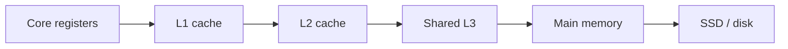
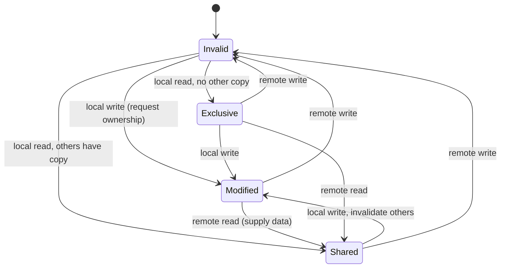

# CPU caches and the memory hierarchy

## Learning objectives

After studying this lesson you should be able to:

- Explain why a memory hierarchy exists and state the order-of-magnitude latency of each level.
- Describe a cache line, and compute the tag, index and offset fields of an address for a given cache geometry.
- Distinguish direct-mapped, set-associative and fully associative caches, and classify misses as compulsory, capacity or conflict.
- Explain, at a conceptual level, how the MESI protocol keeps per-core caches coherent.
- Recognize false sharing, explain why it hurts, and fix it.
- Write loops that respect spatial and temporal locality, and predict the performance difference.

## 1. Why a hierarchy at all?

Every cache in this book exists because of one uncomfortable fact: storage that is large is slow, and storage that is fast is small and expensive. A processor core can execute several instructions per nanosecond, yet fetching a byte from main memory (DRAM) takes on the order of tens to a hundred nanoseconds. If the core had to wait for DRAM on every load, it would spend almost all of its time idle. Hardware designers solved this decades ago with the same idea we will later apply to web servers and databases: keep a small, fast copy of the data you are likely to need again, close to where it will be used.

The approach works because real programs are not random. They exhibit **locality of reference**, which comes in two flavors:

- **Temporal locality**: if you touched an address recently, you are likely to touch it again soon (a loop counter, a hot object field).
- **Spatial locality**: if you touched an address, you are likely to touch its neighbours soon (the next element of an array, the next instruction).

A cache exploits temporal locality by retaining recently used data, and spatial locality by fetching data in blocks rather than single bytes. Those two sentences are, in effect, the entire theory of caching. The rest of this lesson, and indeed the rest of the chapter, is elaboration.

The figures below are **approximate orders of magnitude**, not measurements of any particular machine. Real numbers vary by processor generation, clock speed, memory technology and load. Treat them as a mental model, not a specification.

| Level               | Typical capacity (approx.) | Typical latency (approx.) |
| ------------------- | -------------------------- | ------------------------- |
| Register            | tens to hundreds of bytes  | well under 1 ns           |
| L1 cache (per core) | tens of KB                 | about 1 ns (a few cycles) |
| L2 cache (per core) | hundreds of KB to a few MB | a few ns                  |
| L3 cache (shared)   | several MB to tens of MB   | roughly 10 to 40 ns       |
| Main memory (DRAM)  | GBs                        | roughly 60 to 100 ns      |
| NVMe SSD            | hundreds of GB to TBs      | tens of microseconds      |
| Spinning disk       | TBs                        | several milliseconds      |

Notice the ratio. DRAM is roughly two orders of magnitude slower than L1. An SSD is another three orders slower than DRAM. When a later lesson says "a cache hit is 100 times cheaper than a miss", the number is not rhetorical: it is the same ratio that has repeated at every layer of the stack.



## 2. Cache lines: the unit of transfer

A CPU cache does not store individual bytes. It stores fixed-size blocks called **cache lines**. On most mainstream x86-64 and many ARM processors the line size is 64 bytes, though some designs use other sizes. When a load misses, the hardware fetches the entire 64-byte line that contains the requested address and installs it in the cache.

This is spatial locality made concrete. If you read `a[0]` from an array of 4-byte integers and it misses, the line also brings in `a[1]` through `a[15]`. The next fifteen reads are hits. Sequential access over an array therefore pays one miss per sixteen elements, while a pattern that touches one integer per line (a stride of 64 bytes or more) pays a miss on every access.

### Worked example: row-major versus column-major traversal

Consider a 1024 by 1024 matrix of 4-byte integers stored in row-major order (as in C, C++ and Java's arrays of arrays within a row). One row is 1024 x 4 = 4096 bytes, which is 64 cache lines of 64 bytes.

Row-wise traversal reads addresses 0, 4, 8, ... in order. Per row, there are 1024 reads and 64 line fills. Miss rate is 64 / 1024 = 6.25 percent, assuming no reuse, so about 1 miss per 16 accesses.

Column-wise traversal reads `m[0][0]`, `m[1][0]`, `m[2][0]`, ... The stride is 4096 bytes, so each access lands on a different line. If the matrix (4 MB) does not fit in the cache, by the time you come back to column 1 the line holding `m[0][1]` has been evicted. Every access misses: 100 percent miss rate, a factor of 16 more misses. If a miss costs about 100 ns versus about 1 ns for a hit, the arithmetic is:

- Row-wise: per 16 accesses, 1 miss + 15 hits = 100 + 15 = 115 ns, about 7.2 ns per access.
- Column-wise: 16 misses = 1600 ns per 16 accesses, 100 ns per access.

That is roughly a 14x difference from reordering two loops, with no change in the amount of "work". In practice hardware prefetchers and memory-level parallelism narrow the gap, but the direction and the order of magnitude hold. Many real speedups from "loop interchange" and "blocking" (tiling) come entirely from this effect.

```java
// Cache-friendly: inner loop walks consecutive memory
long sum = 0;
for (int i = 0; i < N; i++)
    for (int j = 0; j < N; j++)
        sum += m[i][j];

// Cache-hostile: inner loop strides by a whole row
for (int j = 0; j < N; j++)
    for (int i = 0; i < N; i++)
        sum += m[i][j];
```

## 3. Where does a line go? Mapping and associativity

A cache has far fewer lines than memory has blocks, so we need a rule for which cache slot a given memory block may occupy. The three classical designs trade hardware cost against flexibility.

**Direct-mapped.** Each memory block maps to exactly one cache slot, chosen by a bit-slice of the address. Lookup is trivial and fast: compute the slot, compare one tag. The weakness is conflicts: two hot blocks that map to the same slot will evict each other forever even though the rest of the cache is empty.

**Fully associative.** A block may live in any slot. This eliminates conflicts but requires comparing the tag against every slot in parallel, which is expensive in area and power. It is used for very small structures (for example, small TLBs, discussed in the next lesson) but not for large data caches.

**N-way set-associative.** The compromise used almost everywhere. The cache is divided into sets; each block maps to exactly one set, but may occupy any of the N ways within that set. An 8-way cache compares 8 tags in parallel. When a set is full, a **replacement policy** picks the victim, typically an approximation of LRU (pseudo-LRU using a few bits per set), because exact LRU for 8 or 16 ways is costly. This is the first place in the book where you meet eviction: the hardware solves exactly the problem that the Eviction chapter solves in software, with a tight bit budget.

### Splitting an address: tag, index, offset

Given a cache of capacity C bytes, line size B bytes and associativity N:

- Number of lines = C / B.
- Number of sets S = C / (B x N).
- Offset bits = log2(B). Index bits = log2(S). Tag bits = address bits - index bits - offset bits.

**Worked example.** A 32 KB, 8-way cache with 64-byte lines on a machine with 48-bit physical addresses (an illustrative case).

- Lines = 32768 / 64 = 512.
- Sets = 512 / 8 = 64.
- Offset bits = log2(64) = 6. Index bits = log2(64) = 6. Tag bits = 48 - 6 - 6 = 36.

For address `0x0000_1234_5678`, the low 6 bits select the byte in the line, the next 6 bits select one of 64 sets, and the remaining 36 bits are stored as the tag. Lookup: use the index to find the set, compare the 36-bit tag with the 8 stored tags in parallel, and on a match use the offset to pick the byte. A neat consequence: addresses that differ by a multiple of 64 x 64 = 4096 bytes land in the same set. A program that walks an array with a stride of exactly 4096 bytes uses only one set, so only 8 lines (the associativity) can be live at once, and the 32 KB cache behaves like a 512-byte one. This is the notorious **power-of-two stride** pathology.

### The three C's of misses

Classifying misses tells you which remedy applies:

- **Compulsory (cold) misses**: the first touch of a block. Unavoidable without prefetching.
- **Capacity misses**: the working set is larger than the cache. Remedy: bigger cache, smaller working set, blocking.
- **Conflict misses**: the cache has room overall but too many hot blocks map to one set. Remedy: higher associativity, padding or changing strides.

A fourth category appears in multicore systems, **coherence misses**, caused by other cores invalidating your line. We turn to those now.

## 4. Writes: policies appear even in silicon

Caches must also handle stores. The same vocabulary we use later for distributed caches already exists here.

- **Write-through**: every store updates both the cache and the next level. Simple and consistent, but generates a lot of traffic.
- **Write-back**: a store updates only the cache and marks the line **dirty**; the next level is updated when the dirty line is evicted. Most L1, L2 and L3 caches are write-back because it coalesces many stores into a single line write.
- **Write-allocate vs no-write-allocate**: on a store miss, do we first fetch the line into the cache (allocate) or send the store straight down? Write-back caches normally allocate; write-through caches often do not.

The dirty bit is the seed of every durability and consistency issue discussed in the Write policies chapter: while a line is dirty, the cache holds the only up-to-date copy. If the "cache" is a CPU, a power loss simply loses the program's state anyway, so nobody minds. When the cache is Redis in front of a database, the same design suddenly raises the question "what if we crash before the flush?".

## 5. Coherence: many cores, many copies

Modern CPUs have several cores, each with a private L1 and usually L2, plus a shared L3. If core A and core B both cache the line containing variable `x`, and A writes `x`, B must not keep reading a stale value. **Cache coherence protocols** enforce this. The most widely taught is **MESI**, where each line in a cache is in one of four states:

- **Modified (M)**: this cache has the only copy, and it is dirty (differs from memory).
- **Exclusive (E)**: this cache has the only copy, and it is clean.
- **Shared (S)**: possibly several caches hold the line; all copies are clean.
- **Invalid (I)**: the line is not valid here.

Conceptually, the rules are these. To **read** a line you do not hold, you issue a read request; if another cache holds it in M, it supplies the data (and writes it back or downgrades to S). To **write** a line, you must first own it exclusively: you broadcast an invalidation (or request for ownership) so that all other copies move to I, and your copy becomes M. Writes to a line already in E or M need no bus traffic: E silently upgrades to M. This is why exclusive ownership is valuable.



Real processors use variants (MESIF, MOESI) and directory-based schemes at scale, but the insight is stable: the system maintains a **single-writer, multiple-reader** invariant per cache line, using invalidation to take away other cores' copies before a write is allowed to proceed. Hold that thought, because distributed caches face exactly the same problem across machines, and they pay far more for it.

### Worked example: a counter bouncing between cores

Two threads each increment a shared counter 1 million times. Suppose each increment requires obtaining the line in M state and each ownership transfer costs about 50 ns (illustrative figure). If the threads alternate perfectly, there are up to 2 million ownership transfers, about 2,000,000 x 50 ns = 100 ms, even though an uncontended increment takes about 1 ns (2 ms total for the same work done by one thread). Contention converts a 1 ns operation into a 50 ns one, simply because the line must ping-pong.

## 6. False sharing

Coherence operates on whole lines, not variables. Suppose two threads update two **different** variables that happen to sit in the same 64-byte line:

```java
class Counters {
    volatile long a;   // updated by thread 1
    volatile long b;   // updated by thread 2
}
```

`a` and `b` are 8 bytes each and almost certainly share a line. Thread 1 writes `a`, taking the line to M and invalidating thread 2's copy. Thread 2 writes `b`, which requires taking the line back. The threads never touch each other's data, yet they fight over ownership. This is **false sharing**: no logical sharing, but physical sharing of a line. Throughput can drop by an order of magnitude compared with the same code using separate lines.

The cure is to separate the hot fields onto different lines, by **padding** or alignment:

```cpp
struct alignas(64) PaddedCounter {
    std::atomic<long> value;
    // alignas(64) pads the struct size up to 64 bytes
};
PaddedCounter counters[NUM_THREADS]; // each element on its own line
```

In Java, you can pad manually with unused `long` fields, or use library facilities for striped counters such as `LongAdder`, which spreads updates across cells to reduce contention. Some JVMs offer an annotation for contended fields, but it is an internal, version-dependent mechanism, so prefer measured, documented techniques. The trade-off is memory: padding wastes space, so apply it only to structures proven hot, using a profiler (hardware performance counters that report cache-line contention are the right tool).

The same pattern shows up above hardware: a "hot key" in a distributed cache, hammered by thousands of clients, is a macroscopic analogue of a contended line, as the Hot keys lesson discusses.

## 7. Inclusion, victim caches and prefetching (brief)

A few more concepts round out the picture without needing detail:

- **Inclusive vs exclusive hierarchies**: in an inclusive L3, every line in a private L2 is also in L3, simplifying coherence at the cost of duplicated capacity. Exclusive designs avoid the duplication.
- **Prefetching**: hardware detects sequential or strided patterns and fetches lines before they are demanded. It converts compulsory misses on streaming access into hits, but wasteful prefetches pollute the cache. Remember this idea: it reappears as "refresh-ahead" and CDN pre-warming.
- **Write buffers and store forwarding**: stores are queued so the core need not wait for the line. These interact with memory ordering rules, which is why concurrent programs need memory barriers or language-level atomics, not just coherence.

## 8. What this teaches us about caching in general

Before leaving silicon, extract the lessons that transfer upward:

1. **Granularity matters.** The cache moves lines, not bytes; a CDN moves whole objects; a database buffer pool moves pages. A mismatch between access granularity and transfer granularity wastes capacity.
2. **Hit ratio is not enough; cost per miss is the metric.** Average access time = hit time + miss rate x miss penalty. With hit time 1 ns, miss penalty 100 ns: a 99 percent hit rate gives 1 + 0.01 x 100 = 2 ns; 95 percent gives 1 + 0.05 x 100 = 6 ns. Going from 99 to 95 percent triples average latency. Small drops in hit rate are expensive when the miss penalty is large.
3. **Replacement is a policy choice with limited information.** Hardware approximates LRU; software can do better when it has more memory per entry.
4. **Keeping copies consistent costs something.** Coherence traffic is the price of having several copies, and it grows with the number of writers.

## Common pitfalls

- **Quoting latencies as exact.** Cache and memory latencies depend on the specific chip. State them as approximate and compare ratios.
- **Assuming big-O alone predicts speed.** A linked list and an array have the same asymptotic traversal cost, but the array wins by a large constant factor due to spatial locality and prefetching.
- **Padding everything.** Padding to avoid false sharing on structures that are not contended just wastes cache capacity.
- **Power-of-two strides and sizes.** Tables whose rows are exactly 4096 bytes apart can trigger conflict misses; adding a small pad can help.
- **Believing coherence makes concurrent code correct.** Coherence guarantees a single value per line, not ordering across variables. Use atomics, locks and barriers.
- **Micro-benchmarking without warm-up.** The first pass is dominated by compulsory misses and JIT compilation.

## Check your understanding

1. A cache has 64 KB capacity, 64-byte lines and is 4-way set-associative. How many sets does it have, and how many bits are used for offset, index and (assuming 40-bit addresses) tag?
2. Explain why summing a 2D array column by column can be an order of magnitude slower than row by row, even though both perform the same number of additions.
3. A hit costs 2 ns in total and a miss costs 120 ns in total. What hit rate is needed to achieve an average access time of 4 ns?
4. What is the single-writer, multiple-reader invariant, and which MESI transition enforces it on a write to a Shared line?
5. Two threads update adjacent fields of an object and scale poorly. Diagnose the problem and give two remedies, including a downside of each.
6. Classify these misses: (a) the first read of a freshly allocated array, (b) a loop over 3 MB of data in a 1 MB cache, (c) 9 hot lines whose addresses are 4096 bytes apart in an 8-way, 64-set cache.

## Answers

1. Lines = 65536 / 64 = 1024. Sets = 1024 / 4 = 256. Offset = 6 bits, index = 8 bits, tag = 40 - 8 - 6 = 26 bits.
2. Row-major layout means consecutive columns of a row are adjacent in memory. Row-by-row access uses all 16 four-byte integers in each fetched 64-byte line (about 1 miss per 16 accesses). Column-by-column access strides by a whole row, so each access touches a different line, and the line is evicted before its other elements are needed if the matrix exceeds cache capacity. Miss rate rises from about 6 percent to near 100 percent; with a miss costing roughly 100 times a hit, the slowdown is about an order of magnitude.
3. Let h be the hit rate. Average = h x 2 + (1 - h) x 120 = 120 - 118h. Setting this to 4 gives h = 116 / 118 = 98.3 percent. Equivalently, using hit time plus miss rate times extra penalty: 2 + m x 118 = 4, so m = 1.7 percent.
4. What is the single-writer, multiple-reader invariant, and which MESI transition enforces it on a write to a Shared line?
5. Two threads update adjacent fields of an object and scale poorly. Diagnose the problem and give two remedies, including a downside of each.
6. Classify these misses: (a) the first read of a freshly allocated array, (b) a loop over 3 MB of data in a 1 MB cache, (c) 9 hot lines whose addresses are 4096 bytes apart in an 8-way, 64-set cache.

## Answers

1. Lines = 65536 / 64 = 1024. Sets = 1024 / 4 = 256. Offset = 6 bits, index = 8 bits, tag = 40 - 8 - 6 = 26 bits.
2. Row-major layout means consecutive columns of a row are adjacent in memory. Row-by-row access uses all 16 four-byte integers in each fetched 64-byte line (about 1 miss per 16 accesses). Column-by-column access strides by a whole row, so each access touches a different line, and the line is evicted before its other elements are needed if the matrix exceeds cache capacity. Miss rate rises from about 6 percent to near 100 percent; with a miss costing roughly 100 times a hit, the slowdown is about an order of magnitude.
3. Average = 2 + m x 120 where m is the miss rate; setting this to 4 gives m = 2 / 120 = 1.67 percent, so the hit rate must be about 98.3 percent. (Equivalent form: h x 2 + (1 - h) x 120 = 4 gives h = 116/118 = 98.3 percent.) The first form treats the miss penalty as additional time on top of the hit time; the second treats a miss as costing 120 total; both give approximately 98.3 to 98.3 percent, which is about the same answer at this precision.
4. At any time a line may have either one writer (M or E) or many readers (S). When a core writes a line in Shared state it broadcasts an invalidation or ownership request; all other copies go to Invalid and the writer's copy moves to Modified.
5. False sharing: the fields share a cache line, so each write invalidates the other core's copy. Remedies: pad or align fields to separate lines (cost: wasted memory and cache capacity); restructure the data so each thread has its own copy and results are merged later, or use a striped counter such as LongAdder (cost: reads need to aggregate and are no longer a single atomic snapshot).
6. (a) Compulsory. (b) Capacity. (c) Conflict: all 9 lines map to the same set which has only 8 ways, though the cache as a whole is nearly empty.

## Summary

The memory hierarchy exists because fast storage is small and large storage is slow; caches work because programs show temporal and spatial locality. Hardware caches move 64-byte lines, are typically set-associative with approximate-LRU replacement, and use write-back policies with dirty bits. Misses split into compulsory, capacity and conflict. Multicore systems keep copies coherent with protocols such as MESI, which maintain a single-writer, multiple-reader invariant by invalidating other copies; false sharing is the penalty when unrelated variables share a line. Average access time is hit time plus miss rate times miss penalty, so small changes in hit rate matter greatly when miss penalties are large. These ideas (granularity, locality, replacement, write policy, coherence) recur at every layer covered in the next lessons, starting with the operating system's page cache and TLB.
