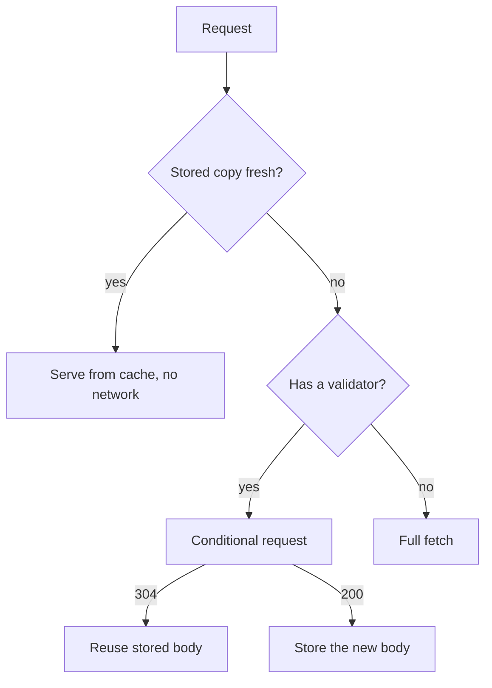
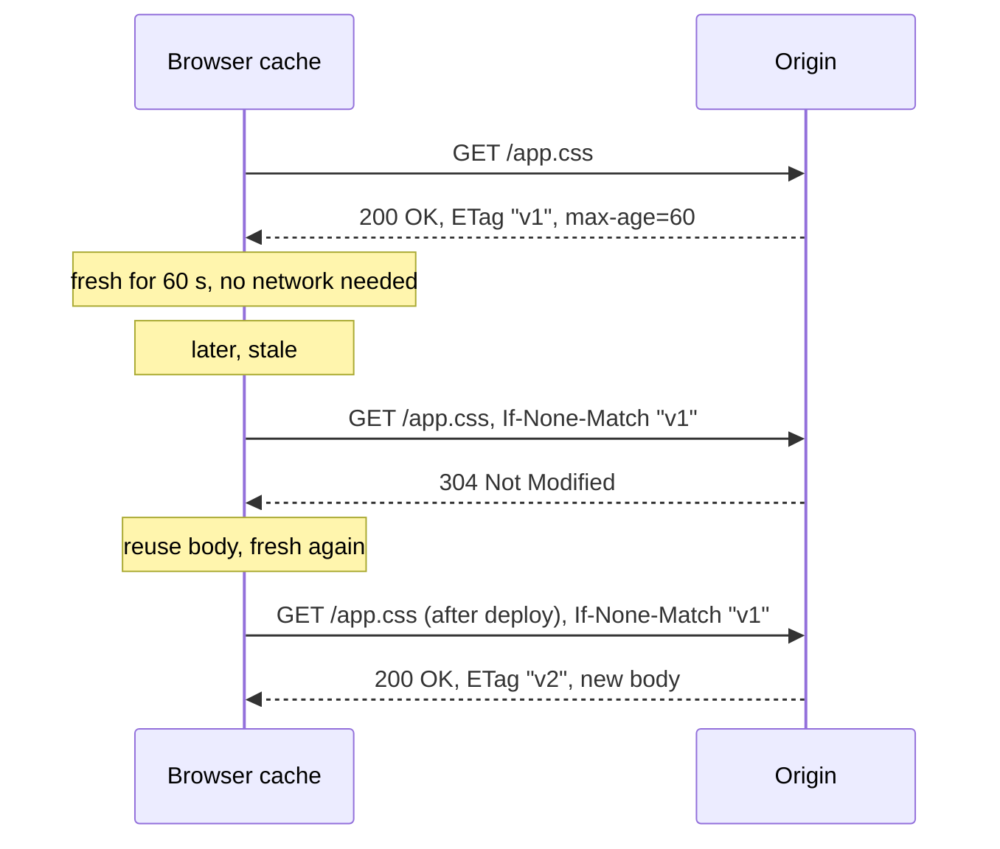
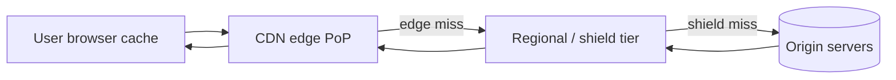
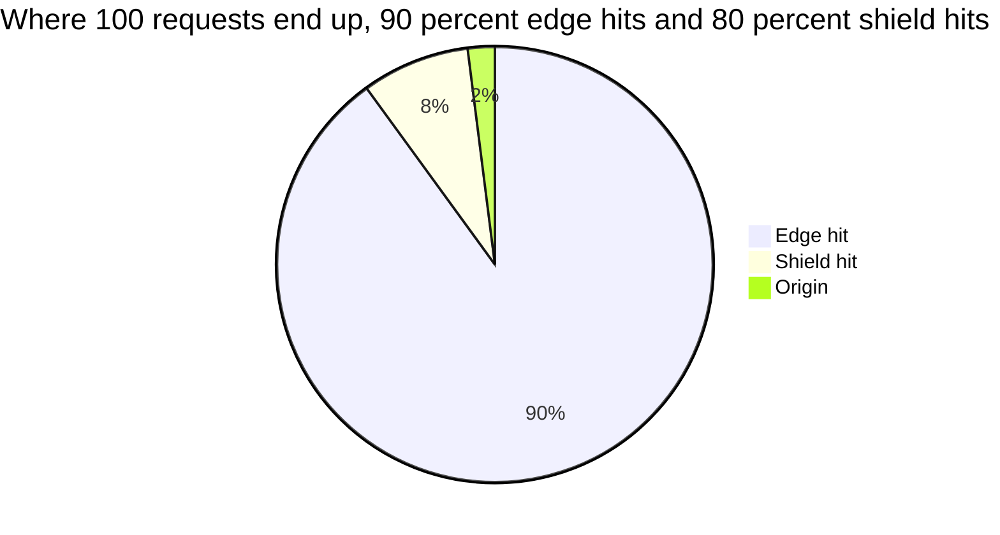
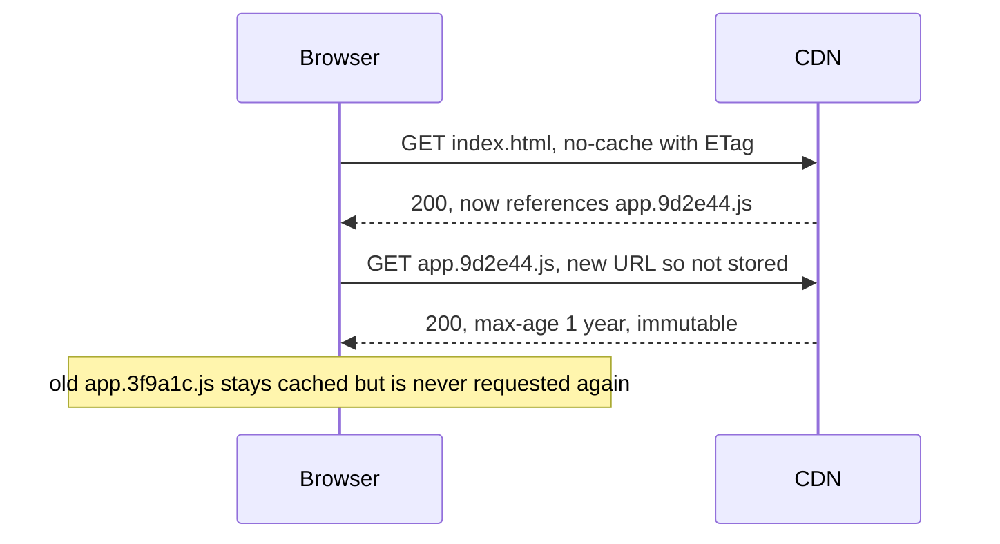
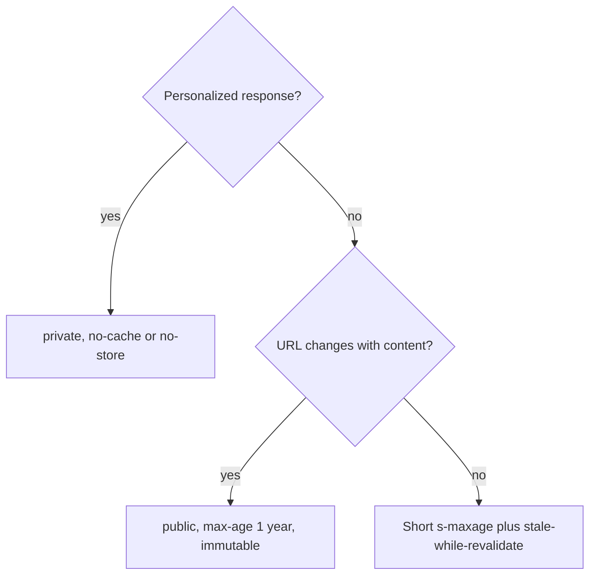

# Browser, HTTP and CDN edge caching

## Learning objectives

After studying this lesson you should be able to:

- Distinguish private caches (browser) from shared caches (proxies, CDNs) and say who is allowed to store what.
- Read and write `Cache-Control` directives, and explain freshness, `max-age`, `s-maxage`, `no-cache`, `no-store`, `private`, `public` and `immutable`.
- Explain validation with `ETag` / `If-None-Match` and `Last-Modified` / `If-Modified-Since`, including the 304 response.
- Use `Vary` correctly and explain how it affects the cache key.
- Describe the role of a reverse proxy and a CDN edge, the request path through multiple tiers, and the difference between purge and versioned URLs.
- Choose caching headers for HTML, API responses and static assets.

## 1. The web's built-in caching model

HTTP was designed with caching in mind. A response may carry instructions that tell every intermediary and the end client how long it may be reused, and how to check whether it is still good. The relevant specification is the HTTP caching RFC (RFC 9111 in its current form, which supersedes earlier RFC 7234); this lesson explains the ideas it formalizes rather than quoting it.

The key insight is that HTTP caches are everywhere, and the origin server controls them only through headers. A single response may be stored in the user's browser, in a corporate proxy, in a CDN edge server near the user, in a CDN regional tier, and in a reverse proxy in front of the origin. Each one makes its own decision based on the same headers, so the headers are a contract.

Latency order of magnitude (approximate, depends heavily on geography and network): a response served from the browser's own cache costs about a millisecond or less. A response from a nearby CDN edge might cost tens of milliseconds, dominated by network round trips. A response from a distant origin may cost one hundred milliseconds to several hundred, because TCP/TLS setup and long-haul round trips add up (speed-of-light delay alone across a continent is on the order of tens of milliseconds one way). Hence "the fastest request is the one that never leaves the device."

> **Key idea:** The fastest request is the one that never leaves the device. Freshness avoids the request, validation avoids the body, and only a miss pays the full cost.

## 2. Private versus shared caches

- A **private cache** serves a single user. The browser cache is the main example. It may store responses that contain user-specific data, because only that user can read them.
- A **shared cache** serves many users: CDN edges, corporate proxies, reverse proxies. It must never serve one user's personalized response to another.

The directives `private` and `public` encode this. `Cache-Control: private` means "only a private cache may store this". `public` explicitly allows shared caches even in situations (such as responses to requests with an `Authorization` header) where they would otherwise be restricted. If a response is personalized and you forget to mark it `private` or `no-store`, a shared cache might serve it to a stranger. This class of bug has caused real security incidents across the industry, which is why the safe default for authenticated, personalized responses is `Cache-Control: private, no-store` or at least `private`, and why CDNs commonly have rules that bypass caching when cookies or authorization headers are present.

## 3. Freshness: how long may I reuse this?

A stored response is **fresh** until its freshness lifetime expires. The origin declares it with:

```
Cache-Control: max-age=3600
```

meaning "may be reused without asking the origin for 3600 seconds from the time it was generated" (more exactly, accounting for the age the response already had in upstream caches, conveyed in the `Age` header). Shared caches can be given a different lifetime with `s-maxage`, which overrides `max-age` for shared caches only.

If no explicit lifetime is given, caches may estimate one heuristically, commonly a fraction (such as 10 percent) of the time since `Last-Modified`. Heuristic freshness surprises people, so set explicit lifetimes.

Main directives to know:

| Directive                  | Meaning                                                                                    |
| -------------------------- | ------------------------------------------------------------------------------------------ |
| `max-age=N`                | Fresh for N seconds.                                                                       |
| `s-maxage=N`               | Like `max-age` but for shared caches only.                                                 |
| `no-cache`                 | May be stored, but must be revalidated with the origin before each reuse.                  |
| `no-store`                 | Do not store at all (use for sensitive data).                                              |
| `private`                  | Only the end user's cache may store it.                                                    |
| `public`                   | Any cache may store it.                                                                    |
| `must-revalidate`          | Once stale, must not be used without successful revalidation.                              |
| `immutable`                | The resource will never change during its freshness lifetime; do not revalidate on reload. |
| `stale-while-revalidate=N` | May serve stale for N seconds while refreshing in the background.                          |
| `stale-if-error=N`         | May serve stale for N seconds if the origin errors.                                        |

A frequent confusion: `no-cache` does **not** mean "do not cache". It means "cache, but check first." `no-store` is the directive that means "do not keep a copy".



## 4. Validation: is my copy still good?

When a stored response is stale (or marked `no-cache`), the cache does not have to throw it away. It can ask the origin whether the stored copy is still valid, using a **conditional request**. This costs a round trip but not a full body transfer.

There are two validators:

- **`ETag`**: an opaque identifier for a specific version of the representation (for example a hash of the content). The client sends it back as `If-None-Match`.
- **`Last-Modified`**: a timestamp. The client sends it back as `If-Modified-Since`. Timestamps have one-second resolution and can be wrong after redeployments (files re-copied with new times), so ETags are generally more precise.

If the stored copy is still valid, the origin returns `304 Not Modified` with no body. The cache refreshes the stored response's metadata and serves the stored body. Otherwise the origin returns `200` with the new body and validators.



### Worked example: bytes and round trips

A 200 KB JavaScript bundle on a mobile link with 80 ms round trip time and 10 Mbit/s throughput:

- Cold fetch: one round trip (80 ms) plus transfer time 200 KB x 8 / 10 Mbit/s = 1.6 Mbit / 10 Mbit/s = 160 ms. Total roughly 240 ms (ignoring connection setup).
- Revalidation with 304: one round trip of 80 ms and a few hundred bytes of headers. About 80 ms.
- Fresh cache hit: no network; a few milliseconds to read from disk cache.

So validation saves two thirds of the time and nearly all bandwidth, but freshness removes the request entirely. This ordering (fresh hit, then 304, then full fetch) is the basic cost model of HTTP caching.

| Case              | Network round trips     | Time on the 200 KB bundle |
| ----------------- | ----------------------- | ------------------------- |
| Cold fetch        | 1, plus 200 KB transfer | about 240 ms              |
| Revalidation, 304 | 1, headers only         | about 80 ms               |
| Fresh cache hit   | 0                       | a few ms from disk        |

### Weak versus strong validators

ETags can be **strong** (byte-for-byte identical) or **weak** (prefixed `W/`, semantically equivalent). Range requests need strong validators. Also, an ETag generated from file inode or modification time may differ across servers in a load-balanced fleet, causing needless cache misses and full fetches; generate ETags from content.

## 5. The cache key and `Vary`

A cache needs a **key** to look up a stored response. By default it is the request method and URL (the "primary key"). But the same URL can produce different representations depending on request headers: language (`Accept-Language`), compression (`Accept-Encoding`), device hints. The origin declares which request headers affect the response with `Vary`:

```
Vary: Accept-Encoding
```

Now the cache stores one variant per distinct `Accept-Encoding` value (in practice, per normalized value). Two principles follow.

1. **Forget `Vary` and you serve the wrong thing**: the gzipped body to a client that cannot decode it, or French content to an English reader.
2. **Over-broad `Vary` destroys hit rate**: `Vary: User-Agent` creates a separate cache entry for each distinct user agent string, of which there are thousands; `Vary: Cookie` means nearly one entry per user. CDNs often let you normalize the key (collapse user agents into "mobile"/"desktop", ignore irrelevant cookies and query parameters) to recover hit rate. Ignoring a parameter that does affect the response is a correctness bug; including tracking parameters (such as `utm_source`) in the key needlessly fragments the cache.

| Vary header     | Variants stored     | Effect on hit rate           |
| --------------- | ------------------- | ---------------------------- |
| Accept-Encoding | A handful           | Fine                         |
| User-Agent      | Thousands           | Cache becomes nearly useless |
| Cookie          | Nearly one per user | Cache becomes nearly useless |

> **Key idea:** Vary defines the cache key. Leave a dimension out and you serve the wrong content, include too many and the hit rate collapses.

## 6. Reverse proxies and CDN edges

A **reverse proxy** (for instance Nginx, Varnish or HAProxy configured with caching) sits in front of your application servers, terminates client connections and answers repeated requests from its own cache. It protects the origin from load and absorbs bursts. Because it is operated by you, you control purge and key policy precisely.

A **Content Delivery Network (CDN)** is a geographically distributed fleet of reverse proxies, called **edge** nodes or points of presence (PoPs), placed close to users, often with intermediate **regional** or **shield** tiers. The CDN gives you three things:

1. **Latency**: the response comes from a nearby server, cutting round-trip time. TLS can terminate at the edge, and persistent connections to the origin are reused.
2. **Offload**: most requests never reach the origin. If the edge hit ratio is 95 percent, the origin sees 5 percent of requests, a 20x reduction.
3. **Resilience**: edges can serve stale content when the origin is down (`stale-if-error`) and absorb traffic spikes and some denial-of-service attacks.



### Worked example: offload with tiers

An edge-only configuration has 300 PoPs. For a rarely requested object, each PoP may miss independently and go to the origin: up to 300 origin fetches after a purge. With a shield tier that collapses misses, the origin sees about 1 fetch. If the edge hit ratio is 90 percent and the shield hit ratio on the remaining misses is 80 percent, only 0.10 x 0.20 = 2 percent of requests reach the origin. For 10,000 requests per second, that is 200 per second at the origin instead of 1,000. **Request coalescing** (collapsing concurrent misses for the same key into one origin fetch) adds further protection against the stampede problem discussed in a later lesson.



### What belongs at the edge

Static assets (images, scripts, stylesheets, fonts, video segments) are the classic case. Many CDNs also cache API responses and even HTML for anonymous users, and some run code at the edge to assemble responses. The limit is personalization: anything unique per user cannot be shared, unless you split the page into a cached shell plus small per-user fetches.

## 7. Invalidation at the HTTP layer: purge versus versioned URLs

Phil Karlton's remark that there are only two hard things in computer science, cache invalidation and naming things, applies especially here, because you do not control the browsers. Two strategies:

**Purge (invalidate by request).** Ask the CDN to delete or mark stale a URL or a tag (surrogate keys / cache tags). Works for edges you control, takes seconds to minutes to propagate, and cannot reach browser caches. Suitable for content that must change at a URL, such as an article correction.

**Versioned (fingerprinted) URLs.** Include a content hash in the file name: `app.3f9a1c.js`. Because the URL changes whenever the content changes, you can serve it with `Cache-Control: public, max-age=31536000, immutable`, a year-long lifetime, and never need to invalidate: the new HTML references the new URL. This "cache busting" is the standard approach for static assets and the single most effective trick in web caching. The HTML document that references the assets must itself be short-lived or revalidated (`no-cache` with an ETag, or a short `max-age`), or users keep an old HTML pointing to old assets (which, if you delete old files too early, produce 404s).



### Choosing headers: a practical table

| Resource                    | Suggested policy                                                    | Why                                                      |
| --------------------------- | ------------------------------------------------------------------- | -------------------------------------------------------- |
| Fingerprinted JS/CSS/images | `public, max-age=31536000, immutable`                               | URL changes with content; never stale.                   |
| HTML shell                  | `no-cache` plus ETag, or `max-age=60` with `stale-while-revalidate` | Must pick up new asset URLs quickly.                     |
| Public API, tolerant of lag | `public, s-maxage=30, stale-while-revalidate=60`                    | CDN absorbs load; bounded staleness.                     |
| Personalized API            | `private, no-cache` or `no-store`                                   | Must not be shared; sensitive data should not be stored. |
| Banking page / tokens       | `no-store`                                                          | Do not leave copies on disk or in proxies.               |

Remember that these are starting points; the right staleness bound is a business decision.



## 8. Other client-side storage and service workers

Beyond the HTTP cache, browsers expose programmable storage: the Cache API (used by service workers), IndexedDB, `localStorage` and in-memory JavaScript variables. A **service worker** can intercept requests and implement strategies such as cache-first, network-first and stale-while-revalidate with full control. This is how offline-capable web apps work; the PocketBook project defers this to its second phase. The programmable layer is powerful but shifts invalidation responsibility to you: a buggy service worker can serve stale assets for a long time, and updating it requires care.

## 9. HTTP caching in your API client

Caching does not stop at the browser. A mobile app or server-side HTTP client library may include its own cache that follows the same headers. When you build API clients, check that the library honours conditional requests, that cache directories are bounded, and that sensitive responses are excluded. For service-to-service traffic inside a data centre, a sidecar or gateway cache following the same semantics can offload shared dependencies.

## Common pitfalls

- **Confusing `no-cache` with `no-store`.** The former still stores; the latter does not.
- **Caching personalized responses in a shared cache** by omitting `private` or by letting a CDN ignore `Set-Cookie` and `Authorization` rules. Audit cache rules for any path that may carry user data.
- **Long-lived HTML.** A one-hour `max-age` on a page that references hashed assets means up to an hour of users on the old release.
- **Non-fingerprinted assets with long lifetimes.** `style.css` with `max-age=1 year` cannot be fixed without renaming it.
- **Broad `Vary` headers.** `Vary: Cookie` or `Vary: User-Agent` can make the cache nearly useless.
- **Cache key fragmentation through query strings.** Tracking parameters and parameter ordering create duplicate entries.
- **Relying on purge alone.** Browsers keep copies you cannot purge; design for bounded staleness.
- **Per-server ETags** generated from inode/time in a multi-server fleet cause false misses.
- **Caching error responses accidentally.** A `500` or an unexpectedly cacheable `404` stored at the edge can extend an outage; set explicit rules for error status codes and use short lifetimes for them.

## Check your understanding

1. What is the difference between `Cache-Control: no-cache` and `Cache-Control: no-store`, and when would you use each?
2. A page is served with `Cache-Control: public, max-age=600`. After 5 minutes, a user reloads. Walk through what the browser does. What changes after 11 minutes if the response also had an `ETag`?
3. Why can fingerprinted asset URLs be cached for a year, and what must be true of the HTML that refers to them?
4. A CDN reports 92 percent edge hit ratio and 75 percent shield hit ratio on edge misses. If the site gets 20,000 requests per second, how many requests per second reach the origin?
5. Explain how `Vary: User-Agent` can harm a CDN, and propose a fix.
6. Why can purge not guarantee that every user sees updated content immediately?

## Answers

1. `no-cache` allows storage but requires successful revalidation before every reuse (cheap when the origin answers 304); use it for HTML or data that changes unpredictably but is large enough to benefit from conditional requests. `no-store` forbids keeping a copy at all; use it for sensitive data such as account pages or tokens.
2. At 5 minutes the response is still fresh (300 s < 600 s), so the browser serves from cache without contacting the server (a hard reload bypasses this). After 11 minutes it is stale; with an ETag the browser sends `If-None-Match`, and a 304 reply lets it reuse the body and restart freshness; without a validator it must refetch the whole response.
3. The URL changes whenever the content changes, so a given URL always maps to the same bytes and can never be stale. The HTML must be short-lived or revalidated so users quickly get the new asset URLs, and old assets should remain available for a while for users still on the old HTML.
4. Edge misses: 20,000 x 0.08 = 1,600 requests per second. Shield misses: 1,600 x 0.25 = 400 requests per second reach the origin.
5. User-Agent strings are extremely varied, so the cache stores a separate copy for each distinct value, lowering hit ratio and increasing origin load. Fix: normalize the key at the edge (map user agents to a small set of classes such as mobile and desktop), and Vary on that derived header only if the response truly differs.
6. Purge only reaches caches under the CDN's control, with propagation delay. Browsers and other private or third-party caches hold copies they never hear about; those stay until their freshness expires. Hence use short lifetimes for mutable content or versioned URLs.

## Summary

HTTP defines a layered caching model controlled by response headers. Freshness (`max-age`, `s-maxage`) avoids requests; validation (`ETag`, `Last-Modified`, 304) avoids body transfers; `private`, `public`, `no-cache` and `no-store` determine who may store what; `Vary` and normalization define the cache key. Reverse proxies and CDNs provide latency reduction, offload and resilience through edge and shield tiers, with request coalescing protecting the origin. Invalidation by purge reaches only the caches you control, so the dominant best practice is fingerprinted, immutable asset URLs with short-lived HTML. The next lesson moves behind the edge, to application-level and database caches and how all the layers compose.
