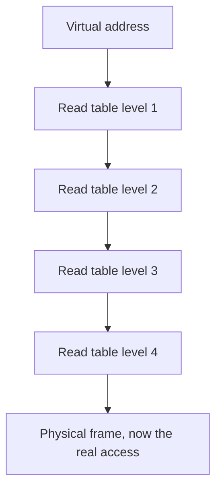
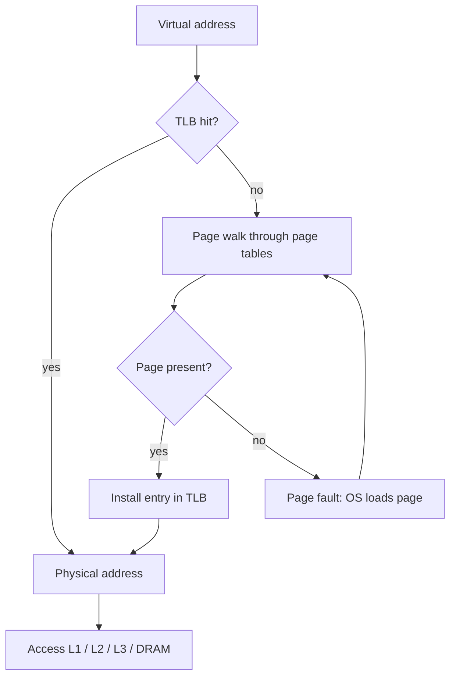
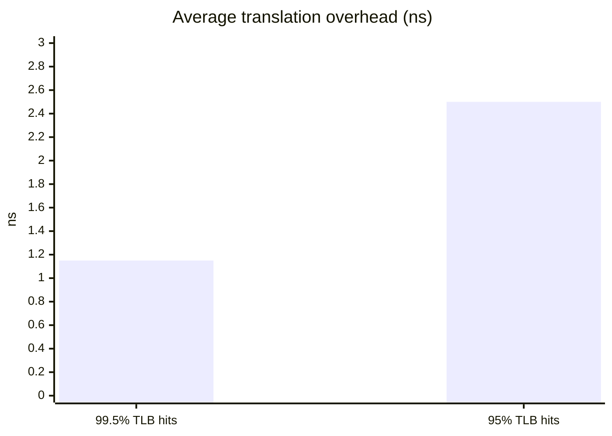
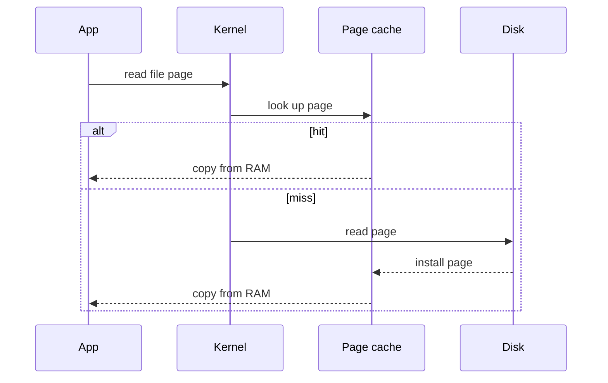
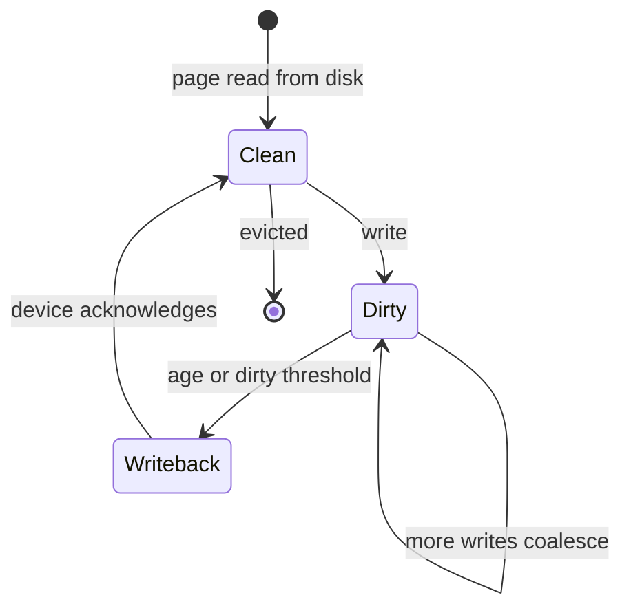
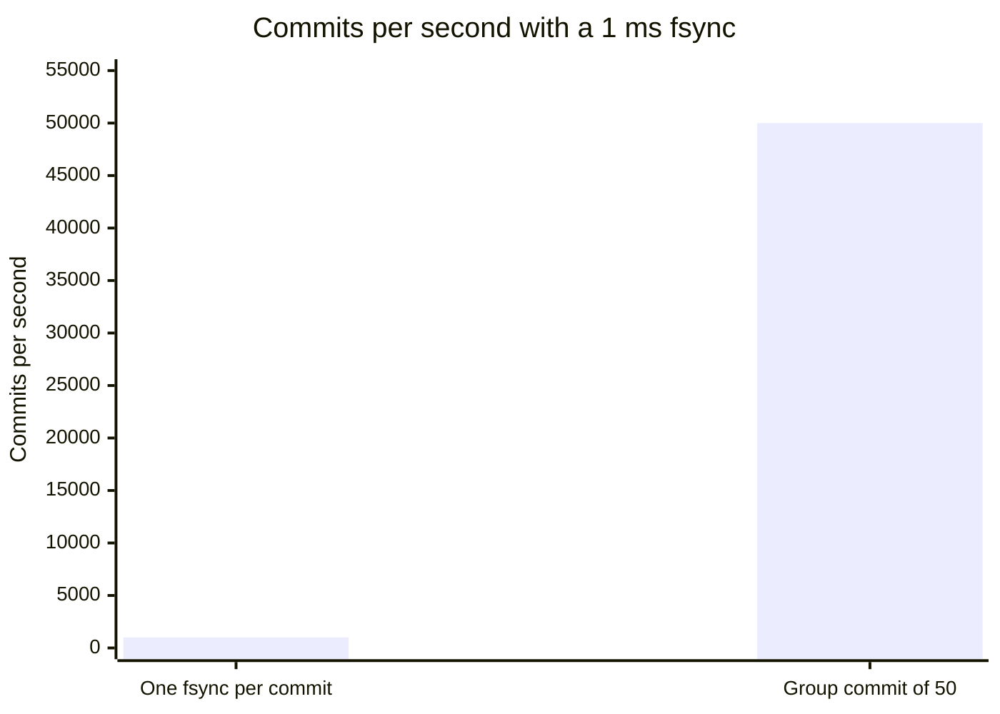
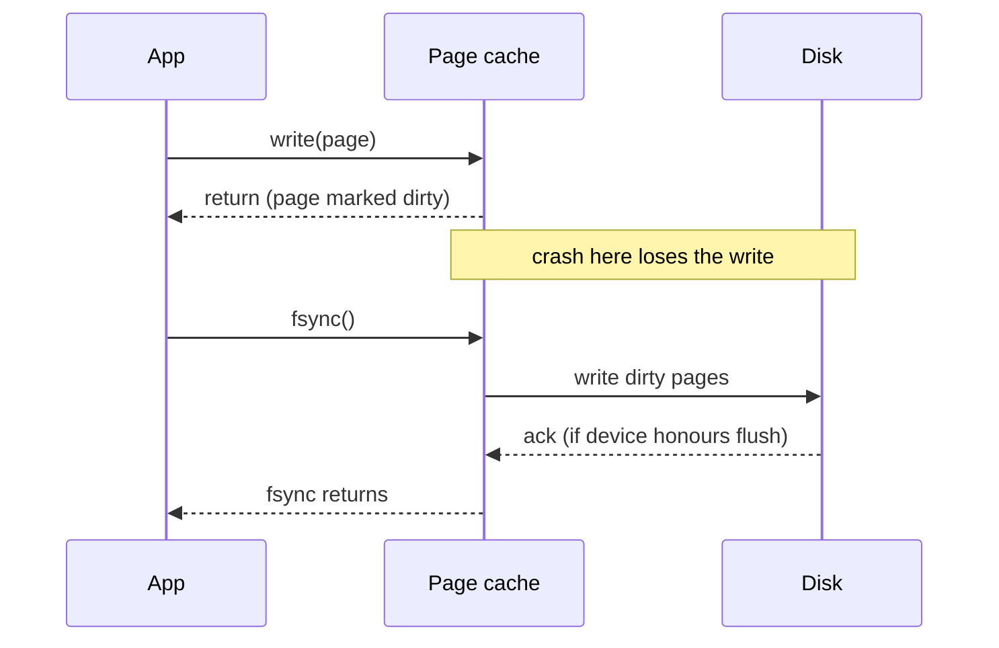
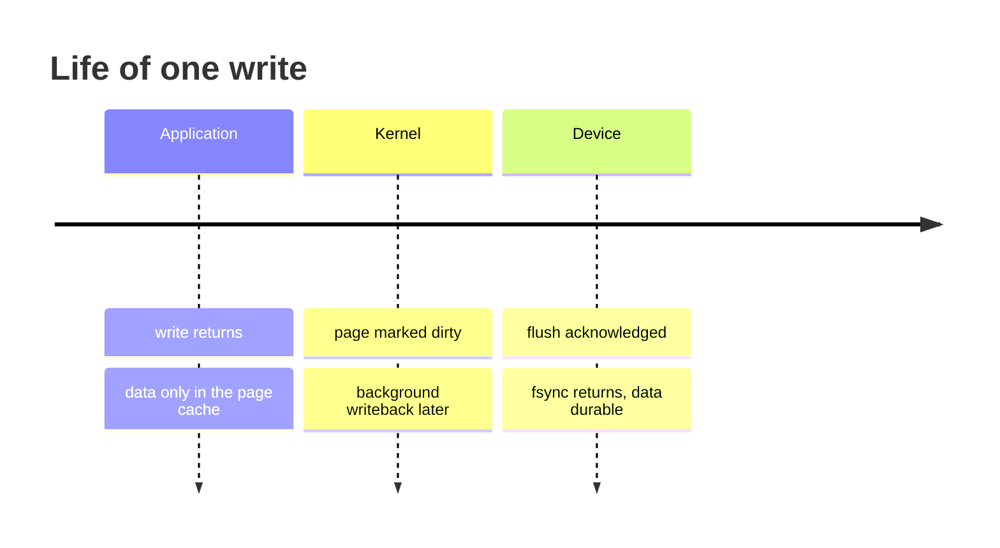

# The operating system's caches: page cache and TLB

## Learning objectives

After studying this lesson you should be able to:

- Explain virtual memory and why address translation itself needs a cache (the TLB).
- Compute the cost of a translation with and without a TLB hit, and the effect of TLB reach and huge pages.
- Describe the OS page cache: what it caches, how reads, writes, read-ahead and write-back work, and what `fsync` guarantees.
- Explain why a database or application may bypass or cooperate with the page cache (direct I/O, `mmap`, double caching).
- Reason about dirty-page writeback, durability and the failure scenarios that follow.
- Interpret "free memory" correctly on a machine whose page cache is large.

## 1. Two caches hiding in every operating system

Between your program and the physical hardware sits the operating system, and it quietly operates two caches that every other layer of the stack builds upon.

1. The **Translation Lookaside Buffer (TLB)** caches the results of virtual-to-physical address translation. It is a hardware structure managed in cooperation with the OS.
2. The **page cache** (also called the buffer cache or file system cache) keeps the contents of recently used file blocks in RAM, so that reading a file does not require going to disk each time.

They differ in scale (the TLB holds tens to thousands of entries; the page cache can occupy most of main memory) and in purpose (one avoids repeated address arithmetic through memory-resident tables, the other avoids slow storage I/O), but they obey the same logic as the CPU caches of the previous lesson: locality, a bounded capacity, a replacement policy, and a write policy. Latency figures below are, as before, approximate orders of magnitude.

|              | TLB                                   | Page cache                     |
| ------------ | ------------------------------------- | ------------------------------ |
| Caches       | Virtual to physical translations      | Recently used file blocks      |
| Size         | Tens to thousands of entries          | Can occupy most of main memory |
| A miss costs | A page walk of up to four table reads | A disk read                    |
| Changes      | TLB shootdown on other cores          | Dirty pages written back later |

## 2. Virtual memory in two minutes

Each process sees its own **virtual address space**. The OS and the memory management unit (MMU) map **virtual pages** (commonly 4 KB) onto **physical frames** in RAM. This indirection gives isolation, lazy allocation, memory-mapped files and the illusion of more memory than physically exists (by paging to disk).

The mapping is stored in **page tables**, a tree-shaped structure in main memory. On a 64-bit x86 processor with 4 KB pages, a common configuration uses a four-level tree: translating one address means reading up to four table entries, one per level, each a memory access. A **page walk** can therefore cost several memory accesses. If each costs about 100 ns when it misses all CPU caches (the walker's reads usually hit in the data caches, so typical cost is lower), the worst case is 400 ns before the real data access even starts.

That would be catastrophic, since _every_ load and store needs a translation. The hardware answer is the TLB.



### The TLB

The TLB is a small, fast, associative cache of recent translations: virtual page number to physical frame number, plus permission bits. Typically there is a small L1 TLB (tens of entries, split for instructions and data) and a larger L2 TLB (on the order of a thousand or more entries). A hit costs roughly a cycle or is hidden entirely in the pipeline; a miss triggers the page walk, which on x86 is done by hardware and on some architectures by software.



### Worked example: effective translation cost

Suppose a TLB hit adds about 1 ns, a miss adds a page walk of about 30 ns (assuming page-table entries mostly hit in cache), and the TLB hit rate is 99.5 percent. The expected translation overhead is:

0.995 x 1 + 0.005 x (1 + 30) = 0.995 + 0.155 = 1.15 ns.

With a 95 percent hit rate it becomes 0.95 x 1 + 0.05 x 31 = 0.95 + 1.55 = 2.5 ns, more than double, even though both hit rates look "excellent". The same lesson as before: with a large miss penalty, the last few percent of hit rate matter.



### TLB reach and huge pages

**TLB reach** is the amount of memory the TLB can map at once: entries x page size. A 1,536-entry L2 TLB (an illustrative size) with 4 KB pages reaches 1536 x 4 KB = 6 MB. A program with a 2 GB working set accessed randomly will have a TLB miss on most accesses. If we instead use 2 MB **huge pages**, the same 1,536 entries reach 1536 x 2 MB = 3 GB. Databases, JVM heaps with large working sets and in-memory caches such as Redis or Memcached can all benefit from huge pages, through transparent huge pages or explicit configuration, but with tradeoffs: internal fragmentation, latency spikes from compaction in some configurations, and larger copy-on-write costs when forking. Some vendors recommend disabling transparent huge pages for specific databases for exactly these reasons; always follow the documentation for the software you run and measure.

| Page size       | Entries | Reach |
| --------------- | ------- | ----- |
| 4 KB            | 1,536   | 6 MB  |
| 2 MB huge pages | 1,536   | 3 GB  |

> **Key idea:** Reach is entries times page size. A random-access working set far larger than the reach misses the TLB on most accesses, and huge pages stretch the reach.

### Context switches and coherence of translations

A TLB entry is only valid for one address space. On a context switch the OS either flushes the TLB or uses tags (address space identifiers, ASIDs, or PCIDs on x86) so entries from different processes can coexist. When the OS changes a mapping (unmapping a page, changing permissions), stale TLB entries on _other_ cores must be invalidated, usually by an inter-processor interrupt called a **TLB shootdown**. This is the OS-level analogue of cache invalidation, and like all invalidation it is expensive and scales poorly with core count. This is a recurring theme: reads are cheap because caches cheat; invalidation is where the bill arrives.

## 3. The page cache

### What it does

Disks and SSDs are orders of magnitude slower than RAM: roughly tens of microseconds for a fast NVMe read, and several milliseconds for a rotating disk seek, against around 100 ns for DRAM. When a process calls `read()` on a file, the kernel first looks for the requested pages in the page cache. If present (a **hit**), it copies the data to the user buffer from RAM. If absent (a **miss**), the kernel issues a disk read, installs the page in the cache and then copies it out.



On Linux, almost all file I/O flows through the page cache, and it is sized dynamically: it uses essentially all memory that applications do not need and gives it back under pressure. This is why a freshly booted server shows lots of "free" memory and a long-running one shows very little: the memory is not wasted, it is serving as cache. Operators learn to read "available" memory (free plus reclaimable cache) rather than "free".

> **Key idea:** Low "free" memory on a healthy Linux server is normal because the page cache uses what applications do not. Watch available memory, swap and major faults instead.

### Read-ahead

Sequential access is common, so the kernel detects it and **reads ahead**: when you read page 10 and then 11, it prefetches 12 through, say, 40 asynchronously before you ask. This turns a stream of latency-bound reads into one bandwidth-bound stream. It is the same idea as hardware prefetching, one level up. The danger is waste: random access defeats read-ahead, and aggressive read-ahead on random workloads pollutes the cache and burns disk bandwidth. Databases often tune or disable read-ahead on devices serving random I/O for this reason.

### Writes: write-back with dirty pages

By default, `write()` copies the data into the page cache, marks the page **dirty** and returns immediately. Background kernel threads later **write back** dirty pages to disk, triggered by age (typically tens of seconds) or by the fraction of memory that is dirty crossing a threshold. This is a **write-back** policy, exactly as in CPU caches, with the same benefits (fast writes, coalescing of repeated writes to the same page, batching) and the same risk: if the machine loses power or the kernel crashes before writeback, the data the application believed it had written is lost.



Applications that need durability must ask explicitly:

- `fsync(fd)` blocks until all dirty pages of the file (and the metadata needed to find them) are flushed to stable storage, as far as the device and file system will honour.
- `fdatasync(fd)` flushes data and only the metadata required to read it back.
- Opening with `O_SYNC` or `O_DSYNC` makes every write synchronous.
- Writing with `O_DIRECT` bypasses the cache.

```c
// Durable append: a write-ahead log record
write(fd, record, len);   // goes to page cache; may be lost in a crash
fsync(fd);                // now durable (modulo disk write caches)
```

An important subtlety: **storage devices have their own caches**. A consumer disk may acknowledge a flush while the data still resides in volatile device RAM, unless the device honours flush/FUA commands or has power-loss protection. Durability is a chain, and the weakest cache in the chain defines what survives a power cut. Likewise, `fsync` of a file does not necessarily persist the directory entry of a newly created file; careful programs `fsync` the parent directory as well.

The cost of `fsync` is visible: on an SSD without power-loss protection it may take on the order of hundreds of microseconds to milliseconds; on a rotating disk, several milliseconds. A database that calls `fsync` per transaction is therefore limited to a few hundred to a few thousand commits per second per device unless it uses **group commit**, batching many transactions into one flush. Here you meet, in miniature, the central tradeoff of the write policies chapter: latency and throughput versus durability.

### Worked example: group commit arithmetic

Suppose each `fsync` takes 1 ms. Committing each transaction individually yields at most 1 / 0.001 = 1,000 commits per second. With group commit, the log writer collects all transactions that arrive while the previous flush is in progress. If 50 transactions arrive per millisecond window, one fsync commits 50 of them: throughput becomes about 50,000 commits per second, while each transaction's latency is bounded by roughly the wait for the current flush plus its own flush (about 1 to 2 ms). Batching trades a small, bounded delay for large gains in throughput.



### Replacement in the page cache

The kernel must evict pages when memory is needed. A pure LRU would be vulnerable to a scan: reading one huge file once (a backup, a `grep -r`, `cat bigfile > /dev/null`) would flush the entire useful cache. So Linux and other kernels use LRU-like schemes with multiple lists (active and inactive lists, with a promotion on second access), designed to give **scan resistance**. The newer Linux multi-generational LRU work is another refinement along similar lines. The details change between kernel versions, so treat this as a conceptual description; the eviction chapter covers the underlying ideas (2Q, CLOCK, and others) in depth.

## 4. mmap, direct I/O and double caching

Applications have three broad ways to deal with the page cache.

1. **Buffered I/O (the default).** `read`/`write` through the page cache. The simplest option; the OS handles caching, read-ahead and writeback. Data may be copied twice: disk to page cache, page cache to user buffer.
2. **Memory-mapped files (`mmap`).** The file's pages are mapped directly into the process's address space; a load that touches an unmapped page triggers a page fault, and the kernel brings the page from the page cache (or disk). It avoids the copy and makes the file look like memory, but you give up control over eviction and I/O timing: a page fault can stall a thread unpredictably, and errors (such as I/O failures) surface as signals rather than return codes. Several database authors have documented reasons for avoiding `mmap` for core storage engines, and others use it successfully for read-mostly data; the right answer depends on workload.
3. **Direct I/O (`O_DIRECT`).** Bypasses the page cache; the application manages its own cache. Databases such as those with a **buffer pool** (covered in the application and database caches lesson) frequently do this to avoid **double caching**: holding the same page in both the database buffer pool and the OS page cache, wasting memory and adding copies.

| Approach     | Copies of the data                 | Who decides eviction | Main risk                         |
| ------------ | ---------------------------------- | -------------------- | --------------------------------- |
| Buffered I/O | Disk to page cache to user buffer  | Kernel               | Double caching with a buffer pool |
| mmap         | Page cache mapped into the process | Kernel               | Unpredictable page-fault stalls   |
| O_DIRECT     | Application buffer only            | The application      | App must build its own cache      |

The decision framework is: who is better placed to know which pages are hot and when to evict or flush them? The database knows its query plans and log ordering rules (it must write the log before the data page it describes), the OS does not. Conversely, an ordinary application that reads configuration files has no need to reinvent a cache, and the OS provides one for free.

A caution on tuning: if you give a database a very large buffer pool and also leave the page cache enabled, memory can be consumed twice for the same data, and then an unrelated process's allocation causes the OS to evict part of one of the copies. Conversely, giving the buffer pool nearly all RAM leaves nothing for the kernel, network buffers and other processes, leading to swapping, which is dramatically worse than a cache miss.

## 5. Failure scenarios and what they teach

- **Power loss with unflushed dirty pages.** All writes since the last writeback or `fsync` may be lost, and the file may contain a mixture of old and new pages unless the application uses an ordering discipline (write-ahead logging, copy-on-write, checksums).
- **Torn writes.** A 16 KB database page is written as four 4 KB blocks; a crash after two leaves a page that is half old, half new. Databases defend with doublewrite buffers or full-page images in the log.
- **Fsync failure semantics.** On some systems, a failed `fsync` may mark dirty pages clean while the data is not on disk, so retrying `fsync` can return success without durability. This surprised the PostgreSQL community around 2018, and affected how databases treat `fsync` errors (usually by crashing and recovering from the log rather than retrying). The lesson: handle I/O errors from a cache's flush path as fatal unless documented otherwise.
- **Cold cache after reboot or failover.** After a restart, the page cache is empty. A database with a working set of 200 GB and a disk delivering random reads at tens of microseconds each may take many minutes to become fast. Operators warm caches by replaying queries or reading files ahead of time. This is the same "cold start" problem that will reappear for CDN and application caches in the stampede lesson.





## 6. Observing and reasoning about these caches

On Linux, tools such as `free`, `vmstat` and `/proc/meminfo` report cache size and dirty pages; `perf` can report TLB misses; utilities exist to show how much of a file is resident in the page cache. For capacity planning, a useful back-of-envelope: if the hot data set is smaller than the memory available for caching, expect hit ratios close to 100 percent after warm-up; if it is 3x larger and the access pattern is uniform random, expect a hit ratio of about 1/3 (the fraction of the data that fits) because every block is equally likely and the cache holds a third of them. Skewed access (a few hot blocks) does much better, which is why the shape of the access distribution, not just the size, drives hit rate. The Evaluating policies lesson in the eviction chapter formalizes this with miss-ratio curves.

## Common pitfalls

- **Reading "free" memory as spare capacity.** Cache memory is reclaimable, and a low "free" value on a healthy Linux server is normal. Monitor available memory, swap activity and major faults instead.
- **Assuming `write()` means durable.** It means copied into the page cache. Use `fsync`/`fdatasync` at the points that require durability, and understand device caches.
- **Ignoring the directory entry.** A new file may not survive a crash unless its parent directory is synced.
- **Retrying a failed `fsync`.** Do not assume the second call can succeed meaningfully.
- **Double caching.** A large buffer pool plus an unmanaged page cache can waste memory; decide deliberately between buffered and direct I/O.
- **Sizing the working set against page count rather than TLB reach.** For huge random-access in-memory structures, TLB misses can dominate; consider huge pages after measuring.
- **Benchmarking a warm cache and calling it disk speed.** Drop caches (in a test environment) or use direct I/O to measure the device honestly, and also measure the cold-start case.

## Check your understanding

1. Why does the system need a TLB if page tables already store the mapping? Quantify using a four-level page walk.
2. A TLB has 512 entries. What is its reach with 4 KB pages and with 2 MB pages? When might the larger reach not help?
3. Explain the difference between `write()` returning and `fsync()` returning. What can still go wrong after `fsync` returns?
4. An fsync takes 2 ms. What is the maximum single-threaded commit rate without batching? If group commit batches an average of 40 transactions per flush, what is the approximate commit rate?
5. Why would a database use `O_DIRECT` and its own buffer pool rather than rely on the OS page cache?
6. A server reports 500 MB "free" and 30 GB "cached" on a 32 GB machine. Should you worry? What would you look at next?

## Answers

1. Without a TLB each load/store would require reading up to four page-table entries (four extra memory accesses) before the data access, i.e. around five accesses for every one. With a TLB hit rate of 99 percent or more, nearly all translations are served in about a cycle, and only occasional misses pay the page walk.
2. 512 x 4 KB = 2 MB; 512 x 2 MB = 1 GB. The larger reach does not help if the application's accesses are concentrated within a small region already covered, if huge pages cannot be allocated due to fragmentation, or if internal fragmentation and compaction latency outweigh the benefit.
3. `write()` returns once data is in the kernel's page cache (dirty); `fsync()` returns after the kernel has asked the device to persist the data and metadata. After `fsync`, problems can still arise if the device's volatile cache lied about flushing, if the directory entry was not synced, or if media fails; also, a failed `fsync` can leave uncertain state.
4. 1 / 0.002 = 500 commits per second. With 40 per flush: about 500 x 40 = 20,000 commits per second (latency per transaction rises slightly, to roughly the flush time plus waiting time).
5. The database knows access patterns, must enforce write-ahead log ordering, wants predictable I/O and eviction, and wants to avoid keeping two copies of each page in memory plus extra copying; the OS cache cannot know any of that.
6. Probably not: 30 GB of cache is reclaimable, so available memory is high. Next check swap usage, major page-fault rate, dirty page volume and I/O wait to confirm there is no real memory pressure.

## Summary

The OS contributes two crucial caches. The TLB caches virtual-to-physical translations, avoiding multi-level page walks; its effectiveness is described by hit rate and reach, which huge pages can extend at some cost. The page cache keeps file data in RAM, uses read-ahead for sequential patterns, scan-resistant LRU-like replacement, and a write-back policy with dirty pages, which makes `write()` fast but not durable until `fsync`. Durability is a chain through kernel, file system and device caches; failures include lost writes, torn writes and cold starts. Databases often bypass the page cache with direct I/O and manage their own buffer pools, trading convenience for control. These principles (write-back risk, scan resistance, invalidation cost, cold start) show up again in the browser, CDN and application caches of the next lessons.
