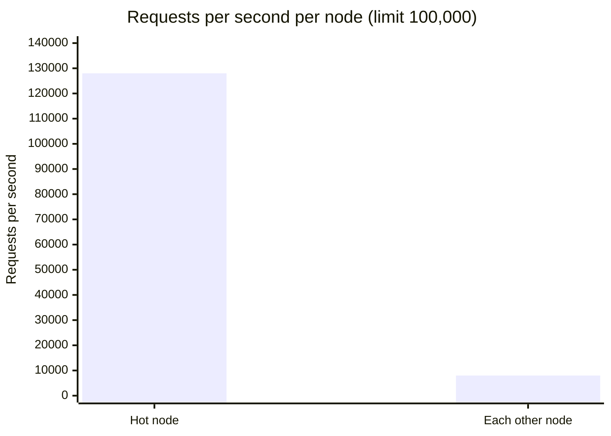
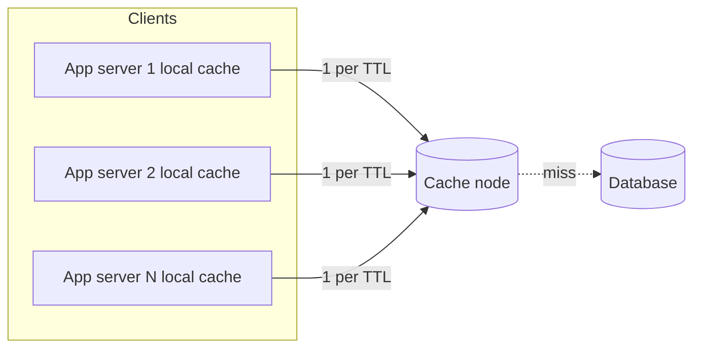
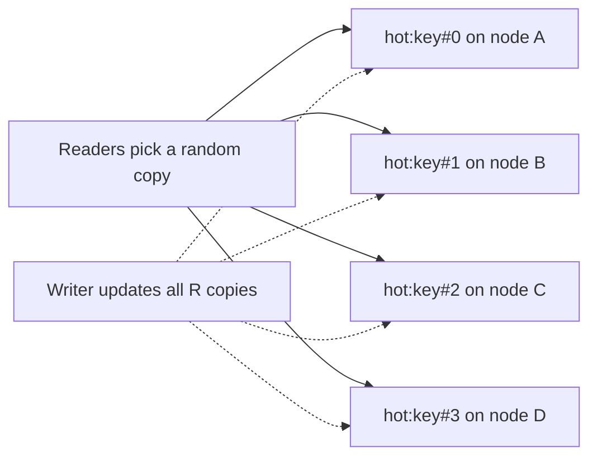
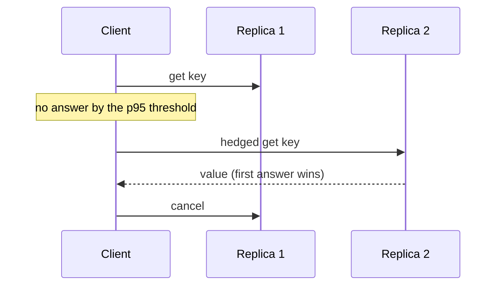
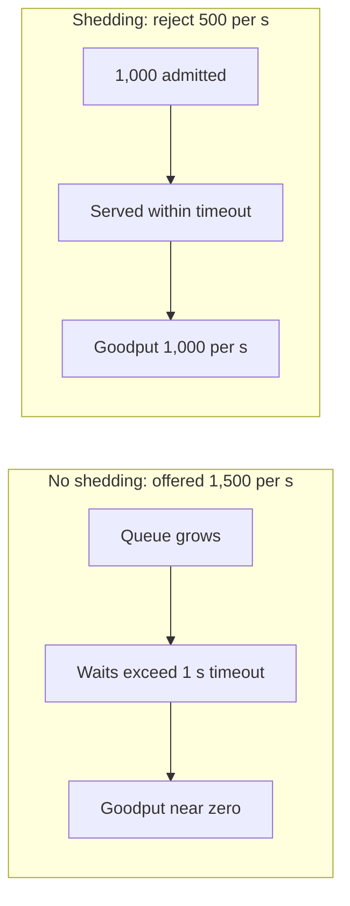
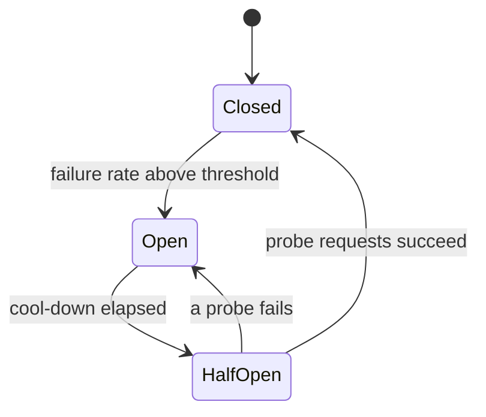
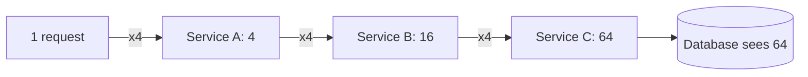
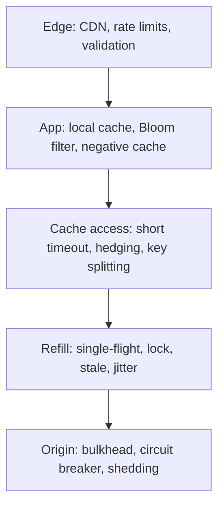

# Hot keys and load shedding

## Learning objectives

After studying this chapter you should be able to:

- Explain why a single hot key defeats horizontal scaling of a sharded cache and compute when a key exceeds a node's limits (operations per second and bandwidth).
- Describe practical hot key detection methods and their costs.
- Apply the main mitigations: local (near) caches, key splitting (salting), replicated reads and request hedging, and state the staleness and consistency cost of each.
- Define load shedding and backpressure, and explain why rejecting work early can increase total useful throughput.
- Size queue and concurrency limits with Little's law.
- Assemble a layered plan to protect the database: timeouts, bulkheads, circuit breakers, retry budgets and priority-based shedding.

## 1. The limits of sharding

A distributed cache scales by **sharding**: keys are assigned to nodes by hashing, so more nodes mean more memory and more total throughput. This works when load is spread evenly across keys. It fails when a single key carries so much traffic that the node owning it saturates, because a key lives on exactly one node (plus perhaps replicas for failover). No matter how many nodes you add, the hot key's node is the bottleneck.

Call a key **hot** if the traffic it receives is a significant fraction of a single node's capacity. Typical examples: a celebrity's profile when they post; the front page; a flash-sale product; a configuration or feature-flag document read on every request; a global counter; a viral link; a tenant in a multi-tenant system that is 100 times bigger than the others.

### 1.1 How much is too much?

There are two limits.

**Operations per second.** A single-threaded in-memory store such as Redis can handle on the order of 100,000 simple operations per second per core (a rough order of magnitude; depends on command, network and hardware; measure your own). Suppose a key receives 150,000 reads per second at peak. One node cannot serve it, and the node's other keys suffer as well, since the thread is saturated and every request on it, even for cold keys, waits in the same queue.

**Network bandwidth.** Consider a 100 KB cached value (a rendered page fragment) requested 20,000 times per second:

```
bandwidth = 100 KB * 20,000 = 2,000,000 KB/s = about 2 GB/s = about 16 Gbit/s
```

A node with a 10 Gbit/s network interface cannot serve this even though 20,000 operations per second is small by CPU standards. Bytes, not operations, are the limit. Large values make hot keys much worse.

**Memory is not the limit.** A hot key might be 100 KB. The cache has gigabytes free. The problem is purely throughput on one node.

### 1.2 The imbalance, in numbers

A cluster of 10 nodes receives 200,000 requests per second. With uniform spread each node sees 20,000 per second (20 percent utilisation at a 100,000-ops limit). Now one key draws 120,000 of those requests; the other keys total 80,000, spread over 10 nodes: 8,000 each. The hot node receives 120,000 + 8,000 = 128,000 per second, more than its capacity, while the other nine sit at 8 percent. Aggregate capacity is 1,000,000 per second; the cluster is 20 percent utilised, and it is failing. Hot key problems are invisible to averaged metrics.



> **Key idea:** the cluster is 20 percent utilised and still failing. Averages hide hot keys, so watch per-node load.

When the hot node saturates, latency rises and requests time out. Clients treat timeouts as misses and fall back to the database (the fallback path we warned about), so the database now absorbs the traffic of the hot key. A cache node's overload becomes a database overload.

## 2. Detecting hot keys

You cannot fix what you cannot see, and the standard cache metrics (hit ratio, memory) will not show it. Useful signals and methods:

1. **Per-node load imbalance.** Compare each node's operations per second, CPU and network throughput. A node at three or more times the median is suspicious. This tells you _that_ there is a hot key, not _which_ key.
2. **Server-side sampling.** Some stores offer a facility: Redis, for instance, has a `--hotkeys` option in `redis-cli` that scans for frequently accessed keys, and it requires a least-frequently-used eviction policy to be configured because it relies on the access frequency counters. Memory- and CPU-costly operations like this should be run in a controlled way.
3. **Client-side counting.** Each client library keeps a small structure counting keys it requests, and periodically reports the top few. Because the work is distributed across clients, the overhead per client is tiny. This is the most scalable approach.
4. **Proxy-layer statistics.** If a proxy sits between clients and cache nodes (a cache router), it can maintain counts centrally.
5. **Streaming top-k algorithms.** You cannot afford a counter for every key in a large keyspace. Fixed-memory algorithms estimate the heaviest hitters:
   - **Count-min sketch**: a small two-dimensional array of counters indexed by several hash functions. Incrementing a key increments one counter per row; the estimate is the minimum across rows. It never underestimates, and overestimates only a little when collisions are few. A sketch with 4 rows of 2,000 counters (8,000 counters, around 32 KB with 4-byte counters) can track a stream of millions of keys with small error for the heaviest items.
   - **Space-Saving** (also called the stream-summary): keeps exactly k counters. When a new key arrives and all counters are in use, it replaces the entry with the lowest count and inherits its count plus one. It reliably finds items with frequency above N/k.
6. **Time-windowed rates.** A hot key is defined by a rate, so use sliding windows: for example, count per second over the last ten seconds. A key above a threshold (say 5,000 requests per second, or more than 1 percent of the total traffic of a node's capacity) is marked hot.

Detection can feed automatic mitigation: clients that find a key in their own hot list automatically start serving it from a local cache or from split replicas. Some large systems maintain a dynamically updated hot key list distributed to all clients.

Alternatively, **predict**: keys that are hot are often known by the business (the front page, a launch, a celebrity), so pre-configure them.

## 3. Mitigations



| Mitigation           | Effect on the hot node                | Main cost                            |
| -------------------- | ------------------------------------- | ------------------------------------ |
| Local cache, 1 s TTL | 120,000 down to 200 per s             | Staleness up to 1 s per server       |
| Key splitting, R = 4 | 30,000 per s each                     | Write amplification, partial failure |
| Hedging at p95       | About 5 percent extra load            | Worse under overload                 |
| CDN or smaller value | Load never arrives, or less bandwidth | Only for public or shrinkable data   |

### 3.1 Local (near) caches

Add an **in-process cache** in each application server, in front of the distributed cache, with a **very short TTL** for hot keys (say 1 second, or even 100 ms). A hot key is then fetched from the shared cache at most once per TTL per server.

**Worked example.** The hot key is read 120,000 times per second across 200 application servers (600 per server per second). With a local TTL of 1 second, each server fetches it from the cache once per second:

```
load on the cache node = 200 servers * 1 fetch/s = 200 per second   (down from 120,000)
reduction              = 120,000 / 200 = 600 times
```

Even a 100 ms TTL would give 200 x 10 = 2,000 per second, a sixtyfold reduction. The key is practically unloaded.

Costs:

- **Staleness** up to the local TTL, on each server independently. Different servers may show different values for up to a second, which breaks monotonic reads across servers (see Consistency models and leases) unless sessions are sticky. For many hot keys (a home page, a config) a second of staleness is fine.
- **Invalidation** of in-process caches requires a broadcast mechanism (pub/sub) or just short TTLs. With such short TTLs the TTL alone is normally preferable.
- **Memory** multiplies by the number of servers, but only for the small set of hot keys.
- Apply selectively: the local cache for all keys would waste memory and lose freshness. Enable it for keys identified as hot (by detection or configuration).

Also note that the local cache provides **single-flight** naturally: with the coalescing from the previous chapter, concurrent local misses collapse into one request to the shared cache.

### 3.2 Key splitting (salting, replication across nodes)

If the data cannot be cached locally (too large, or must be fresher), spread the key across several nodes by storing **R copies under different names**: `hot:key#0`, `hot:key#1`, ..., `hot:key#(R-1)`. Because the names hash to different nodes, the copies land on different nodes. Readers choose a copy at random (or by hashing a client id). The read load divides by R.

```java
String readKey(String base, int replicas) {
    int i = ThreadLocalRandom.current().nextInt(replicas);   // spread reads
    return base + "#" + i;
}

void writeAll(String base, int replicas, Value v, Duration ttl) {
    for (int i = 0; i < replicas; i++) {
        cache.set(base + "#" + i, v, ttl);                  // write amplification: R writes
    }
}
```



**Worked example.** The key receives 120,000 reads per second on a node limited to 100,000. With R = 4 copies on four different nodes, each handles 30,000 reads per second, plus the usual background load. Bandwidth also divides by four, which solves the earlier 16 Gbit/s example if R is at least 2 (8 Gbit/s each, and R = 4 gives 4 Gbit/s).

Costs:

- **Write amplification.** An update must change or delete all R copies. Writes are rare for hot keys, so this is usually acceptable.
- **Partial failure.** If the writer updates three of four copies and then fails, readers will see old data on the fourth for as long as it lives. Fix with versions (readers reject older versions if they have seen newer), short TTLs, or an invalidation that retries until all copies are done.
- **Memory** multiplies by R for those keys.
- **Hash placement luck.** The names must actually hash to distinct nodes; with few nodes two copies may land together. Choose names by probing, or use a placement scheme that guarantees distinct nodes.
- **When to split**: determine R from load / capacity target. If the key needs 120,000 operations per second and you want each node at no more than 25,000 for the key, R = 5.

A variant is **read replicas** of cache nodes: replicate the whole hot shard to followers and let clients read from any follower. Simpler for clients but replicates the entire shard instead of just the hot key.

### 3.3 Request hedging

Hot nodes and busy nodes have long tails: most requests are fast, a few are very slow. **Request hedging** sends a request to one replica and, if no response arrives within a threshold, sends a second ("hedged") request to another replica and uses whichever answers first. The technique is described in "The Tail at Scale" (Dean and Barroso), which shows how to cut tail latency at a small cost in extra load.

The key choice is the threshold: if it is the **95th percentile** latency, only about 5 percent of requests trigger a hedge, so the extra load is roughly 5 percent. The slowest 5 percent of requests, which would have taken, say, 50 ms or more, now complete at about (threshold + a typical latency), perhaps 2 to 3 ms in total in a healthy cache. The p99 can drop dramatically for a small increase in load.



Caveats:

- **Hedging adds load when the system is already overloaded** and so can make an overload worse. Use hedge budgets (limit hedges to a few percent of requests) and disable hedging when the error rate or queue depth is high.
- Requests must be **idempotent** (reads, safe retries).
- It needs **replicas** with the data; combined with key splitting, the R copies provide natural hedging targets.
- Cancel the slower request when the first returns.

### 3.4 Shrink and move the data

Sometimes the cheapest mitigation is making the hot value smaller (compress it, drop unused fields, cache an id instead of an entire document) or moving it closer to users: public hot content belongs at the CDN edge, where the load is spread across hundreds of locations and never reaches your cache at all.

### 3.5 Hot writes

A hot key can also be a hot **write**: a global counter incremented by every request (page views, likes), or a single row updated constantly. Reads can be replicated; writes to one logical value cannot be so easily. The standard tactics are **sharded counters** (maintain R sub-counters and sum them on read; each increment picks one at random) and **batching** (aggregate increments in memory in each server and flush totals every second). Both trade exactness and freshness for throughput.

## 4. Overload: when everything fails together

Mitigations reduce the chance of overload but cannot eliminate it: some day, traffic will exceed capacity, whether from a surge, a failure removing capacity, a stampede or an attack. What happens next depends on whether the system has been designed to behave under overload. The answer for a system with no such design is a collapse in which no one gets service.

### 4.1 Throughput versus goodput

**Throughput** is work done per second. **Goodput** is _useful_ work done per second: responses delivered before the client gave up. Consider a database that can process 1,000 queries per second. The offered load is 1,500 per second, and clients time out after 1 second.

Without any control, requests join an ever-growing queue. After a short time the queue holds so many requests that their waiting time exceeds 1 second. The database keeps working at 1,000 per second, but nearly every response arrives after the client has already given up, so goodput approaches zero while the database is at 100 percent utilisation. Even worse, clients retry, increasing the offered load.

With **load shedding**, the system rejects the excess 500 per second immediately (or when the queue exceeds a bound). The 1,000 admitted requests are served promptly, within the timeout. Goodput is 1,000 per second, a thousand times better than the collapse state, and the rejected clients know quickly and can degrade or retry later.

The principle is simple and somewhat counterintuitive: **rejecting some work early increases the amount of useful work completed.**



### 4.2 Sizing the queue with Little's law

Allow a queue only as long as it can drain within the time the client is willing to wait. If the service rate is mu = 1,000 per second and requests should wait no longer than 200 ms in the queue, Little's law gives the maximum queue length:

```
L_max = mu * W_max = 1,000 * 0.2 = 200 requests
```

When the queue holds 200, a new arrival would wait 200 ms and anything beyond that would wait longer than is useful. Reject (or divert) the 201st. This is **admission control**. The same law bounds the number of concurrent in-flight queries: if each query takes 20 ms and you can sustain 1,000 per second, concurrency of 1,000 x 0.02 = 20 suffices; allowing 500 concurrent queries just builds a queue inside the database.

### 4.3 Where to shed

- **At the edge** (load balancer, gateway): cheapest, since the rejected request costs almost nothing.
- **In front of the origin** (a concurrency limiter on the database client): protects the database even if upstream limits fail.
- **In the cache client** when a cache node is slow: skip the cache and fail fast instead of waiting, preferably with a degraded response.

### 4.4 What to shed: priorities

Not all requests are equal. Classify and shed in order of lowest value first:

1. Background and batch work (reports, prefetching, pre-warming, analytics).
2. Non-essential features (recommendations, counters, suggestions).
3. Anonymous or unauthenticated traffic (or the least valuable tenants).
4. Reads that can be served stale or defaulted.
5. Core user transactions last (checkout, login).

A **degraded response** (a cached or default answer; a page without the recommendations panel) is better than an error, and an error returned in 2 ms (HTTP 503 with a `Retry-After` hint) is better than a timeout after 30 s.

> **Key idea:** a 503 in 2 ms beats a timeout after 30 s. Shed the lowest-value work first and answer it with something degraded rather than nothing.

### 4.5 Concurrency limits and bulkheads

Put a hard cap on the number of concurrent calls to each dependency. A **bulkhead** isolates dependencies from each other, as the compartments of a ship, so that a slow one cannot consume all threads. Each dependency (database, cache, search service) gets its own pool or semaphore.

```java
final class Bulkhead {
    private final Semaphore permits;
    Bulkhead(int maxConcurrent) { this.permits = new Semaphore(maxConcurrent); }

    <T> T call(Callable<T> work, Supplier<T> fallback) {
        if (!permits.tryAcquire()) {            // do not wait: shed immediately
            return fallback.get();              // degraded answer or exception
        }
        try { return work.call(); }
        catch (Exception e) { return fallback.get(); }
        finally { permits.release(); }
    }
}

// Value v = dbBulkhead.call(() -> db.query(k), () -> staleOrDefault(k));
```

A fixed limit is a guess. **Adaptive concurrency limits** adjust the limit by observing latency: increase additively while latency stays near its minimum, decrease multiplicatively when latency or errors rise (the same AIMD idea as TCP congestion control). The limit then tracks the capacity automatically.

### 4.6 Circuit breakers

A **circuit breaker** wraps a dependency call. It counts failures; when the failure rate exceeds a threshold, it **opens** and short-circuits all calls (failing fast, or returning the fallback) for a cool-down period. After the cool-down it goes **half-open**, allowing a few probe requests; if they succeed it closes, otherwise it opens again. This gives the troubled dependency time to recover instead of being hammered by retries.



### 4.7 Timeouts, deadlines and retry budgets

- **Timeouts everywhere**, shorter than the caller's timeout. Propagate a **deadline** through the call chain so that work whose caller has given up is abandoned (and can be cancelled at the database).
- **Retries with exponential backoff and jitter**, and a **retry budget**: retries may add at most, say, 10 percent to the request rate. Without a budget, retries multiply load in the worst moments: three retries across three layers of services can amplify a failure by 4 x 4 x 4 = 64 times.
- **Do not retry on overload signals** such as 503 with `Retry-After`, or at least obey the hint.



### 4.8 Backpressure

**Backpressure** is the propagation of "slow down" upstream so that producers match the consumer's rate, rather than buffering without bound. In synchronous call chains it is automatic if you have bounded concurrency (callers block or get rejected). In asynchronous systems it must be designed: bounded queues, explicit demand signals (reactive streams), or credit-based flow control. An unbounded queue is not backpressure; it is a deferred failure that arrives as memory exhaustion and enormous latency.

For caches: the cache client should not queue requests without limit to a slow node. Use bounded pipelines and fail fast to the fallback.

## 5. A layered plan to protect the database

Combine everything from this section in one picture. From the user to the origin:

1. **Edge**: CDN for public content; rate limits per client; reject malformed requests.
2. **Application**: local cache for hot keys; validation; Bloom filter and negative caching for nonexistent keys.
3. **Cache access**: short timeouts on the cache with a fallback; hedging for tail latency; key splitting for hot keys.
4. **Refill path**: single-flight per instance; distributed lock or lease; stale serving; probabilistic early refresh; jittered TTLs.
5. **Origin protection**: bulkhead (concurrency limit) on the database client; statement timeouts and query cancellation; circuit breaker; priority-based load shedding with degraded responses.
6. **Operations**: metrics for hit ratio, miss rate, per-node imbalance, duplicate loads, queue depth, shed counts; runbooks for cache flush, hot key splitting, ramping traffic; regular cold-start and overload tests.



**Worked example.** The database handles 1,000 queries per second. Traffic is 10,000 requests per second at 95 percent hit ratio (500 per second to the database). A cache node fails, and the hit ratio falls to 85.5 percent (10 nodes; see the previous lesson): 1,450 queries per second are requested. Without protections: 1.45 times capacity, queues grow, timeouts follow, goodput collapses. With a bulkhead sized at the database's sustainable concurrency (1,000 per second x 20 ms = 20 concurrent): 1,000 queries per second proceed, 450 per second are shed. Of those, say 300 per second are background or low-value requests served degraded content, and 150 per second are core reads served from a stale copy where available or rejected with a retry hint. Core-user goodput stays high, the cache refills at the rate the database allows, and the system self-heals within the warm-up period of a few minutes (Zipf-like skew refills the top keys first). The failure is invisible to most users, which is the entire purpose of the design.

## 6. Common pitfalls

1. **Looking only at averages.** Hot keys hide behind low cluster-wide utilisation.
2. **Hot key detection only after the outage.** Add client-side top-k counting before you need it.
3. **Local caches for everything.** They multiply memory and weaken freshness; use them selectively for detected hot keys.
4. **Key splitting without versioning.** Partial updates leave stale copies readable.
5. **Hedging during overload.** Extra requests make overload worse; budget and disable when stressed.
6. **Unbounded queues.** They convert overload into latency and memory exhaustion, and goodput collapses.
7. **Shedding indiscriminately.** Reject by priority; keep core transactions.
8. **Retrying without budgets, backoff and jitter.** Retries amplify failures multiplicatively across layers.
9. **A circuit breaker without a fallback.** It converts slow failures to fast failures, which is better but not a user experience; add degraded responses.
10. **Never testing overload.** Run load tests that exceed capacity and verify that goodput stays flat instead of collapsing.

## 7. Check your understanding

1. A key's value is 50 KB and it is requested 30,000 times per second. What network bandwidth does the owning node need? Which limit is likely to bind first on a 10 Gbit/s node?
2. 150 application servers read a hot key at 90,000 requests per second in total. With a local TTL of 500 ms, how many requests per second reach the cache node, and by what factor does that reduce the load?
3. Explain key splitting and give two problems it introduces.
4. Why does a hedging threshold at the p95 add roughly 5 percent load, and what is the danger during overload?
5. A database serves 800 queries per second with 25 ms per query. Offered load is 1,200 per second. Clients time out at 500 ms. Describe what happens without shedding, and compute a sensible queue and concurrency limit with shedding.
6. Why is "unbounded queue" not a form of backpressure?

## 8. Answers

1. Bandwidth = 50 KB x 30,000 = 1,500,000 KB/s = about 1.5 GB/s = about 12 Gbit/s (taking 1 GB/s as 8 Gbit/s). That exceeds a 10 Gbit/s interface, so bandwidth binds before operations per second (30,000 is well within 100,000 ops/s).
2. Each server fetches once per 0.5 s, i.e. 2 times per second: 150 x 2 = 300 per second. The reduction is 90,000 / 300 = 300 times.
3. Store R copies of the key under different names (key#0 to key#R-1) so they land on different nodes, read a random copy, and write all copies. Problems: write amplification and partial update inconsistency (some copies stale); memory multiplied by R; the need to ensure the copies actually land on distinct nodes. Any two of these are acceptable.
4. Only requests slower than the 95th percentile (5 percent of them) exceed the threshold and trigger a hedge. During overload latency rises across the board, so far more than 5 percent of requests exceed the threshold, and the hedges add load to an already overloaded system, worsening it. Hence budgets and disabling hedges when stressed.
5. Without shedding the queue grows at 400 per second; waiting time soon exceeds 500 ms, so most responses arrive after the timeout and goodput collapses toward zero while the database is fully busy; retries worsen it. With shedding: a queue limit of mu x W_max = 800 x 0.2 (choosing 200 ms of queueing out of the 500 ms budget, leaving time for the query itself) = 160 requests; concurrency of 800 x 0.025 = 20. Reject the excess about 400 per second.
6. It does not slow the producer; it merely absorbs the excess in memory, so latency grows without bound, memory eventually runs out, and the work queued is stale by the time it is served. Backpressure requires a bounded buffer and a signal to slow or reject.

## 9. Summary

A sharded cache scales only with evenly spread load; a hot key concentrates traffic on one node and is limited by that node's operations per second or, for large values, by its network bandwidth. Detect hot keys with per-node imbalance, client-side counting and streaming top-k structures. Mitigate with short-TTL local caches (which cut load by the ratio of request rate to servers x refreshes per second), key splitting across nodes (at the price of write amplification and the need for versioning), hedged requests for tail latency (with a load budget), smaller values and edge caching, and sharded counters for hot writes. Because overload will eventually happen, design for it: goodput matters more than throughput, so admit only what can be served in time, with queue bounds from Little's law, bulkheads and adaptive concurrency limits, circuit breakers, deadlines, retry budgets with jittered backoff, priority-based shedding with degraded responses, and genuine backpressure. Together with the earlier lessons, Cache stampede mechanics, Stampede mitigations and Penetration and cold start, this forms the layered defence that keeps the database alive when the cache cannot protect it.
