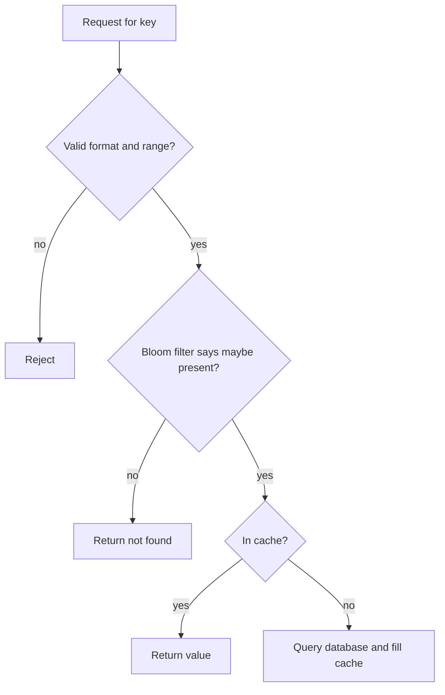

# Penetration and cold start

## Learning objectives

After studying this chapter you should be able to:

- Define cache penetration and explain why ordinary caching does not protect against it.
- Size a Bloom filter for a given number of keys and false positive rate, and show the arithmetic.
- Describe the correctness constraints of using a Bloom filter as a guard in front of a cache and database.
- Contrast negative caching and Bloom filters, and combine them.
- Explain the cold start and mass restart problems and quantify their impact on the origin.
- Design a safe warm-up: pre-warming, gradual traffic ramp, persistence, node-failure blast radius and staged deploys.

## 1. Two ways to bypass the cache

A cache protects the origin only for requests that it can eventually answer. Two situations leave requests with nothing to hit.

1. **Penetration**: the request asks for something that does not exist. There is nothing to cache (or nothing worth caching), so each request goes to the origin and returns "not found". The cache is "penetrated".
2. **Cold start**: the cache is empty (or mostly empty), because it was just started, restarted, flushed or replaced, and every request is a miss until it has been refilled.

Both lead to a flood of requests to the origin. The previous chapters addressed _concurrent identical misses_. These two problems concern _volume of distinct misses_, and the remedy is different: not coalescing, but filtering and ramping.

## 2. Cache penetration

### 2.1 What it looks like

A product page lookup `GET /product/987654321`, for an id that was never allocated. The cache has nothing, so the application queries the database, which finds no row and returns empty. The application returns "404". If the application does not cache the 404, the next request for the same id repeats the whole journey. Where does such traffic come from?

- **Bugs**: a client generating bad ids, an off-by-one in pagination, a mobile app version with a wrong URL.
- **Stale references**: links to deleted items that remain in search engines or emails.
- **Crawlers and scanners** probing sequential ids.
- **Attacks**: an adversary deliberately requesting random ids to defeat the cache and overload the database. Because the ids are random, there is no hot key and nothing repeats, so TTL tricks and coalescing have nothing to coalesce.

### 2.2 The arithmetic

Suppose the service handles 10,000 legitimate requests per second at a 95 percent hit ratio (database sees 500 per second, capacity 1,000). An attacker sends 5,000 requests per second for random nonexistent ids. Each one misses the cache by construction and reaches the database:

```
database load = 500 (legitimate misses) + 5,000 (penetrating) = 5,500 per second
capacity      = 1,000 per second
overload      = 5.5 times capacity
```

The attacker needs only half as much traffic as the legitimate users to push the database to 5.5 times capacity. The cache's hit ratio for legitimate users is irrelevant: the attack bypasses it.

### 2.3 Defence 1: negative caching

Cache "not found" with a short TTL (see TTL design for the rules: short TTL, invalidate on create, bounded size, distinguish "not found" from errors). If the same missing id is requested repeatedly, the database is hit once per negative TTL.

Limits: negative caching helps only when the _same_ absent key repeats. Against random ids it is useless and worse: each random key creates a negative entry, filling the cache with garbage and evicting valuable entries. If the attacker sends 5,000 distinct ids per second and the negative TTL is 60 seconds, the cache holds up to 300,000 negative entries from the attack alone, at perhaps 100 bytes each: 30 MB. That is tolerable. At 100,000 distinct ids per second, 6 million entries and 600 MB, which is not. Restrict negative entries to a separate, size-limited keyspace or cache.

### 2.4 Defence 2: validate before looking up

Many invalid keys can be rejected without any lookup:

- **Syntax and range checks.** If product ids are positive integers below 10 million, reject others. If they are UUIDs, reject strings that do not parse. If ids are assigned sequentially and the current maximum is known, reject anything beyond it.
- **Authentication and rate limiting.** Unauthenticated callers can be rate limited per client; random id probing is then bounded by the limit.
- **Signed identifiers.** Ids embed a signature or checksum so forged ids fail validation cheaply.

These are cheap, deterministic and should come first. They do not stop an attacker who knows the valid id format and range.

### 2.5 Defence 3: a Bloom filter

If you can cheaply answer the question "could this key possibly exist?", you can reject nonexistent keys before they reach the cache or the database. A **Bloom filter** is a compact probabilistic set that answers membership queries with:

- **No false negatives**: if the key was added, the filter always says "maybe present".
- **Some false positives**: for a key never added, the filter occasionally says "maybe present" (and then the request proceeds to the cache and database as usual).

It answers "definitely absent" for the great majority of random keys, in memory, in about a microsecond.

#### How it works

A Bloom filter is an array of m bits, initially zero, with k independent hash functions. To **add** a key, compute its k hashes, each giving a position in 0..m-1, and set those k bits. To **query** a key, compute the same k positions; if any bit is zero, the key is definitely absent; if all are one, it is possibly present (those bits may have been set by other keys).



#### Sizing

For n keys and a target false positive probability p, the optimal sizing is

```
m = - n * ln(p) / (ln 2)^2          bits
k = (m / n) * ln 2                  hash functions
```

The false positive rate with k hashes is approximately (1 - e^(-k n / m))^k.

**Worked example.** n = 10 million product ids, p = 1 percent.

```
ln(0.01)      = -4.605
(ln 2)^2      = 0.4805
m / n         = 4.605 / 0.4805 = 9.585 bits per key
m             = 10,000,000 * 9.585 = 95,850,000 bits = 11.98 MB (about 12 MB)
k             = 9.585 * 0.6931 = 6.64  -> use 7
check:        (1 - e^(-7/9.585))^7 = (1 - e^(-0.7303))^7 = (1 - 0.4818)^7
              = 0.5182^7 = 0.0100   (1.0 percent)
```

Twelve megabytes protect ten million keys, and fit in every application server's memory. For p = 0.1 percent, m / n = 14.38 bits per key (about 18 MB for the same n), and k = 10.

Effect on the attack: with p = 1 percent, 5,000 random requests per second yield 50 per second false positives that reach the database. The database load is 500 + 50 = 550 per second instead of 5,500, a tenfold reduction in the attack's effect (a hundredfold reduction of the attack traffic itself). Combine with negative caching for the 50 that do pass, if the same ids repeat.

#### Correctness constraints (these are the part people get wrong)

1. **It must contain every existing key.** Because a "definitely absent" answer is final (the request is rejected without consulting the database), a key that exists but is missing from the filter is rejected wrongly. That is a correctness bug, not a performance issue. Therefore _new keys must be added to the filter before they become visible_, i.e. at creation, in the same code path (or before the creation returns). In a distributed deployment where every server holds its own filter, propagation delay is a risk: a newly created item may be rejected by a server that has not yet seen the addition. Mitigations: keep the filter in a shared store (Redis supports Bloom filter modules; a plain bitmap with `SETBIT` and `GETBIT` also works), or apply a short grace period in which newly created ids bypass the filter, or consult the database when the key is within the "recently created" id range.
2. **Deletions.** A standard Bloom filter cannot remove keys (clearing a bit might affect other keys). Deleted keys stay "maybe present" and proceed to the database, which says "not found". That is correct, just slightly less efficient. A **counting Bloom filter** supports deletions at the cost of several bits per cell, or you can rebuild the filter periodically from the source of truth (for instance nightly) and swap it in atomically.
3. **Growth.** As more keys are added beyond the n the filter was sized for, the false positive rate rises. Plan for growth (size for next year's n) or use a scalable variant, or rebuild with a larger m.
4. **Initial population.** Building the filter requires scanning all keys once. Do it offline, then keep it updated incrementally.

#### Code: a minimal Bloom filter

```java
final class Bloom {
    private final long[] bits;
    private final int m, k;
    Bloom(int mBits, int k) { this.m = mBits; this.k = k; this.bits = new long[(mBits + 63) >>> 6]; }

    // Double hashing: derive k positions from two hashes of the key.
    private int pos(long h1, long h2, int i) { return (int) Long.remainderUnsigned(h1 + i * h2, m); }

    void add(String key) {
        long h1 = hash1(key), h2 = hash2(key) | 1;
        for (int i = 0; i < k; i++) { int p = pos(h1, h2, i); bits[p >>> 6] |= 1L << (p & 63); }
    }
    boolean mightContain(String key) {
        long h1 = hash1(key), h2 = hash2(key) | 1;
        for (int i = 0; i < k; i++) { int p = pos(h1, h2, i); if ((bits[p >>> 6] & (1L << (p & 63))) == 0) return false; }
        return true;
    }
    // hash1/hash2: any two good independent 64-bit hashes (for example two seeds of a murmur-style hash)
}
```

The double hashing trick (computing k positions as h1 + i x h2) is a standard way to avoid running k separate hash functions with little loss of accuracy. In C++ the layout is the same with a `std::vector<uint64_t>`.

### 2.6 A layered defence

In practice combine all of them: cheap validation first, then rate limiting, then a Bloom filter for large keyspaces, then negative caching for repeated absent keys that pass the filter, and finally the usual cache and coalescing. Each layer removes a class of traffic cheaply before the next, more expensive layer.

## 3. Cold start

### 3.1 The problem

A cache that has just started is empty. For a period after start, almost every request misses. Contrast with the steady state: a 95 percent hit ratio means the database sees 5 percent of the traffic. After a cold start the database sees close to 100 percent.

**Worked example.** Traffic: 10,000 requests per second. Database capacity: 1,000 queries per second. Steady state at 95 percent hit ratio: 500 per second (50 percent utilisation). At the moment of a full cache loss: 10,000 per second, which is **10 times capacity**. The database falls over, the fills time out, the cache does not warm, and (as the stampede chapter described) the outage sustains itself.

The trouble is that the capacity requirement of the origin is set by the _cold_ case, not the warm one, and the cold case is rarely tested.

### 3.2 Events that cause cold starts

- **Cache restart or crash** (including upgrades, out-of-memory kills, and kernel patches).
- **Failover to a replica that has not replicated data** (asynchronous replication may lose recent writes, and some systems replicate nothing).
- **Flush by operators** (`FLUSHALL` as an emergency fix for bad data).
- **A new region or cluster** brought online.
- **A key-space change**: a new key prefix or versioned key format deployed (all old keys become unreachable), or a changed serialization format.
- **Scaling the cache cluster**: adding nodes changes the key-to-node mapping, and with naive hashing remaps most keys (with consistent hashing only about 1/N of keys move, which is the reason that consistent hashing exists).
- **In-process caches in the application tier** restart with every deploy. A rolling deploy of 200 instances cold-starts each instance's local cache, and if all 200 restart in quick succession the shared cache and database see the sum of the cold misses.

### 3.3 Blast radius and node loss

With a distributed cache of N nodes and uniform key distribution, the loss of one node loses 1/N of the cached data. Using the previous numbers (10,000 requests per second, 95 percent hit ratio, capacity 1,000):

| Nodes N | Fraction lost | Hit ratio after loss  | Miss ratio | Database load |
| ------- | ------------- | --------------------- | ---------- | ------------- |
| 3       | 33.3 %        | 0.95 x 0.667 = 63.3 % | 36.7 %     | 3,670 per s   |
| 10      | 10 %          | 0.95 x 0.9 = 85.5 %   | 14.5 %     | 1,450 per s   |
| 20      | 5 %           | 0.95 x 0.95 = 90.25 % | 9.75 %     | 975 per s     |
| 50      | 2 %           | 0.95 x 0.98 = 93.1 %  | 6.9 %      | 690 per s     |

With 3 nodes, one failure sends 3.7 times capacity to the database. With 10 nodes, 1.45 times. Only at about 20 nodes does the loss of a node fit within capacity (and the database has no headroom then). The lesson: **more, smaller nodes reduce the blast radius** of a single failure, and replicas (a standby holding a copy of each shard) reduce it further, at the cost of memory. Capacity planning must include the single-failure case, as the earlier chapter, Workloads, working sets and capacity, emphasised. (This calculation is approximate: the lost keys on a hot node may be disproportionately hot, so the real impact can be worse.)

### 3.4 How fast does a cache warm up?

It depends on the access pattern. For a Zipf-like workload the answer is encouraging. Take N = 1,000,000 items, exponent 1, and 10,000 requests per second. The probability of rank k is 1 / (k x H) where H = 14.39. The request rate for rank k is 10,000 / (14.39 k) = 695 / k per second. For k = 10,000, that is 0.0695 per second, i.e. roughly one request every 14 seconds. So within a minute or so, the top 10,000 items (68 percent of traffic) have been requested at least once and are cached, _provided the origin survives long enough to answer_. Rank 100,000 has a rate of 0.00695 per second, one request per 144 seconds: the middle of the distribution takes minutes to tens of minutes, and the long tail never fully warms but contributes little traffic.

Therefore: skewed workloads warm quickly **if** the origin is not overloaded in the meantime. The problem is not the duration of warming, it is the survival of the origin during it. The goal of every technique below is to keep miss traffic within the origin's capacity during the warm-up.

### 3.5 Strategies

#### Pre-warm before taking traffic

Before a new cache node (or instance) is added to the pool, load the known hot data into it. Where does the list come from?

- A periodic **hot key report** (top-k from metrics or a sample of recent requests), stored somewhere durable.
- Replay the last N minutes of production request keys from a log, at a controlled rate.
- **Copy from a peer**: stream the contents of a healthy replica or a sibling node.
- A **snapshot** of the cache (Redis can persist to disk with RDB snapshots or an append-only file; a restarted node reloads them). The data may be somewhat old, but the keys are the right keys, and the TTLs bound the staleness. Persistence trades extra I/O and restart time for a warm cache, and does not help if the node is replaced rather than restarted.

Pre-warming must itself be rate-limited, otherwise it is a stampede that you launched yourself. For example, warming 1 million keys at 500 per second (leaving headroom) takes 2,000 seconds, about 33 minutes; warming only the top 50,000 keys takes 100 seconds and captures most of the benefit under Zipf (the top 5 percent of 1 million items are about 79 percent of requests for s = 1: H(50,000)/H(1,000,000) = (10.82 + 0.5772) / 14.39 = 0.79).

#### Gradual traffic ramp

Admit only a fraction of traffic to the cold cache's path and increase it as the hit ratio rises. A cold cache with miss ratio m_t at time t, request rate R, and origin capacity C permits an admitted fraction f such that

```
f * R * m_t  <=  C_available
f  <=  C_available / (R * m_t)
```

With R = 10,000, C_available = 800 (leaving 200 for other traffic), and m_t = 1 at the start (fully cold): f <= 800 / 10,000 = 8 percent. As the cache warms to m_t = 0.5, f can be 16 percent; at m_t = 0.2, 40 percent; at m_t = 0.05, 100 percent. Implementation: hash users or requests into buckets and admit buckets progressively (the others receive a degraded response or are served from another region), or use a load balancer weight ramp for a new cluster. This is "slow start" in load-balancer vocabulary, applied to the cache.

Admitting a **consistent subset of users** (hash of user id) rather than random requests has a nice property: the same users keep hitting the same keys, so the cache warms for the right keys rather than being sprayed.

#### Staggered deploys and restarts

Roll deployments in small batches with a pause between them, and wait for each batch's in-process caches to warm (hit ratio above a threshold) before continuing. For 200 instances, restarting 10 at a time with a health gate means that at most 5 percent of local caches are cold at once, so the shared cache sees at most a 5 percent increase in its miss-driven load rather than 100 percent.

#### Serve stale and fall back

During cold start, a **second-level fallback** helps: a read-only replica cache, a secondary region's cache, or stale data from a durable snapshot. Facebook's "Scaling Memcache at Facebook" describes a pool of spare servers (called "gutter") that take over the traffic of failed memcached servers for a short time: misses from the failed node are sent to the gutter pool, which caches them with a short TTL, protecting the database while the failed node is replaced. The general principle is a small, temporary, short-TTL cache that absorbs the failed node's traffic.

#### Protect the origin directly

The preceding techniques reduce miss traffic. Independently, cap what the origin will accept: connection pool limits, per-query timeouts, rate limits per caller, and load shedding when the queue is deep. Those are the topic of the lesson Hot keys and load shedding. A cold start with load shedding means some users receive errors while the cache warms, which is far better than a total outage.

### 3.6 Testing cold start

The only way to know that your system survives a cold start is to do it. In a staging environment with production-like data and load (replayed traffic works), flush the cache and watch: how high does origin load go? How long does the hit ratio take to reach 90 percent? Do timeouts and retries amplify? Does the system recover on its own? Repeat for a single-node loss, and for a rolling restart of the application tier. Record the results in the runbook, along with the manual levers (ramp admission, disable expensive features, flush a key, add capacity).

## 4. Putting the pieces together

| Problem                           | Symptom                                  | First defences                                        |
| --------------------------------- | ---------------------------------------- | ----------------------------------------------------- |
| Penetration by invalid ids        | Origin load from "not found" queries     | Validation, rate limits, Bloom filter, negative cache |
| Penetration by repeated absent id | Same missing key queried again and again | Negative cache with short TTL                         |
| Cold start (restart or flush)     | Hit ratio near zero, origin overloaded   | Pre-warm, traffic ramp, persistence, shedding         |
| Node loss                         | Hit ratio falls by 1/N                   | More nodes, replicas, gutter pool                     |
| Mass app restart                  | Shared cache load spikes                 | Staggered rollout with health gates                   |

## 5. Common pitfalls

1. **A Bloom filter that misses new keys.** Rejecting real items is a correctness failure. Add keys at creation, before visibility.
2. **Using negative caching as the only defence against random-id floods.** It fills the cache with junk.
3. **Negative entries with long TTLs.** New items stay invisible.
4. **Sizing the origin for warm traffic only.** The cold case defines the capacity requirement unless shedding and ramp are in place.
5. **Unthrottled pre-warming.** A self-inflicted stampede.
6. **Flushing the cache to fix a data bug** in a system that cannot survive a cold cache.
7. **Few large cache nodes.** A single failure removes a large share of the data.
8. **Restarting all application instances at once**, cold-starting all local caches together.
9. **Assuming the cache will warm by itself when the origin is overloaded.** Fills that time out do not populate the cache; recovery needs load reduction first.
10. **Never testing the cold case.**

## 6. Check your understanding

1. What is cache penetration, and why does a high hit ratio for legitimate keys not protect against it?
2. Compute the size in bits and megabytes of a Bloom filter for 50 million keys and a 1 percent false positive rate, and the number of hash functions. (Use m/n = 9.585.)
3. A Bloom filter protects a lookup service. A newly created record is not yet in a particular server's filter. What happens to the first requests for it, and how can you prevent the problem?
4. A cache cluster has 8 nodes. Traffic is 6,000 requests per second at a 96 percent hit ratio, and the database capacity is 600 per second. If one node fails, estimate the database load. Is it within capacity?
5. Describe how to ramp traffic onto a cold cache. If R = 8,000 per second, origin capacity available is 400 per second and the current miss ratio is 0.5, what fraction of traffic can be admitted?
6. Why are skewed workloads quick to warm up, and what is the main risk during warm-up?

## 7. Answers

1. Penetration is a flood of requests for keys that do not exist, so there is nothing to cache and each request reaches the database. The hit ratio for legitimate keys is irrelevant because the attacker's requests never could hit; they add to the database load on top of the legitimate misses.
2. m = 50,000,000 x 9.585 = 479,250,000 bits = about 59.9 MB (479.25 Mbit / 8). k = 9.585 x 0.693 = 6.64, so 7 hash functions.
3. The filter says "definitely absent", so the request is wrongly rejected as not found. Prevent it by adding the key to the filter before the record becomes visible, keeping the filter in a shared store, or letting recently created ids bypass the filter for a grace period.
4. Lost fraction 1/8 = 12.5 percent. Hit ratio = 0.96 x 0.875 = 0.84. Miss ratio = 0.16. Database load = 6,000 x 0.16 = 960 per second, 1.6 times capacity. Not within capacity.
5. Admit a fraction f of users (by hashing user id) so that f x R x miss ratio is at most the available capacity, increasing f as the miss ratio falls. f <= 400 / (8,000 x 0.5) = 0.10, so 10 percent.
6. Few keys carry most requests, and those keys are requested often enough to be cached within seconds or a minute. The risk is that the origin is overloaded by the volume of misses during the warm-up, so fills time out and the cache never fills.

## 8. Summary

Penetration and cold start are the two ways a cache fails to protect the origin even when nothing is stampeding on a single key. Penetration, requests for nonexistent keys, is defended in layers: validation and rate limiting, a Bloom filter (sized by m/n = -ln p / (ln 2)^2 bits per key, about 9.6 bits per key at one percent, with the absolute requirement that every existing key be added before it becomes visible) and short-lived negative caching. Cold start, an empty cache after restart, flush, failover or deploy, sends nearly all traffic to an origin sized for the warm case. Skewed workloads warm quickly, so the task is to keep the origin alive meanwhile: pre-warm hot keys at a controlled rate, ramp admitted traffic as the hit ratio improves (f <= capacity / (R x miss ratio)), stagger restarts, use more and smaller nodes plus replicas or a gutter pool to limit blast radius, and shed load as the last line of defence. The final lesson, Hot keys and load shedding, covers the opposite extreme: a key so hot that the cache node holding it becomes the bottleneck, and the discipline of rejecting work deliberately to protect the database.
