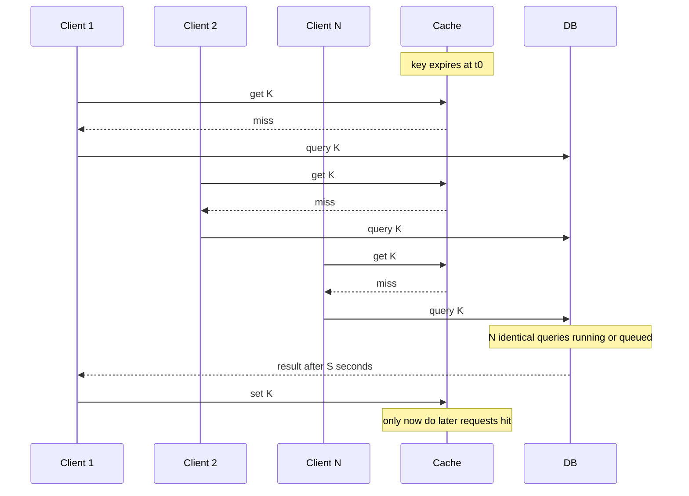
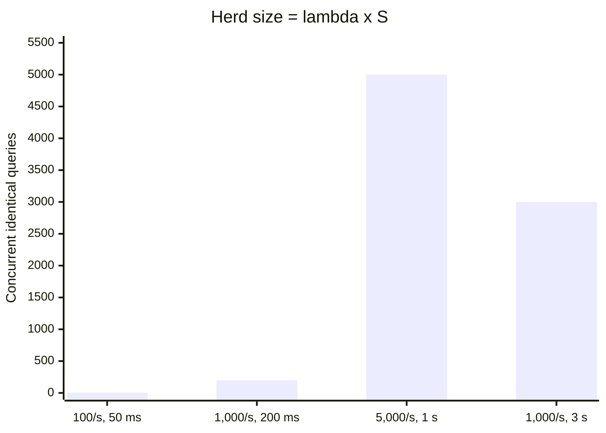
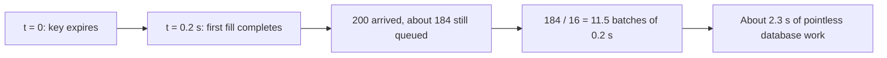
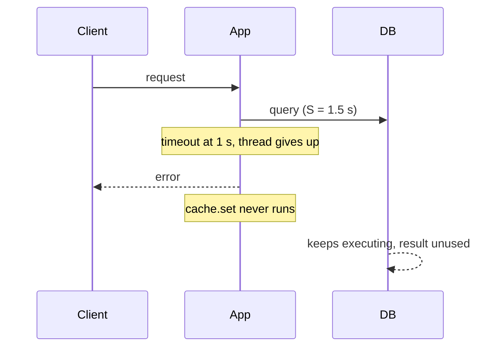
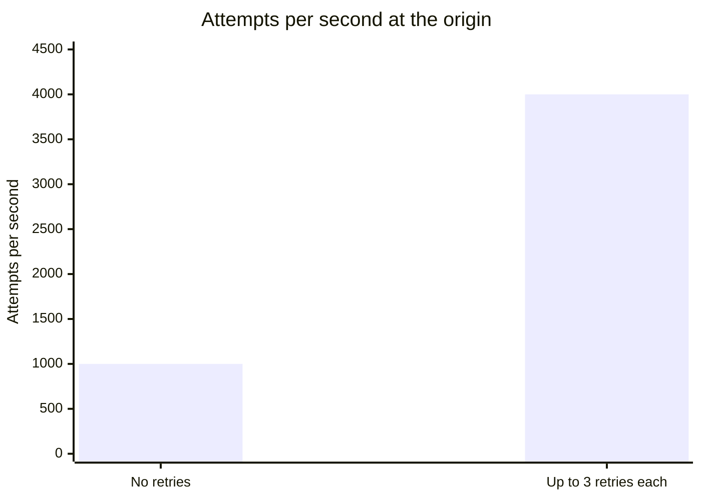
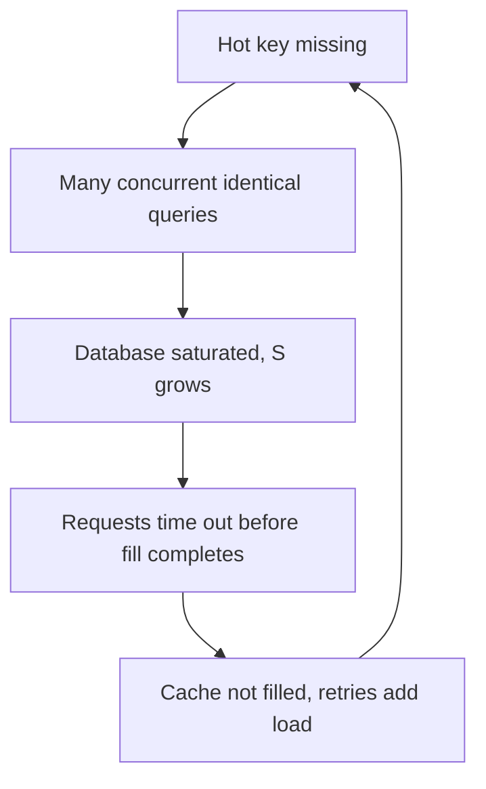
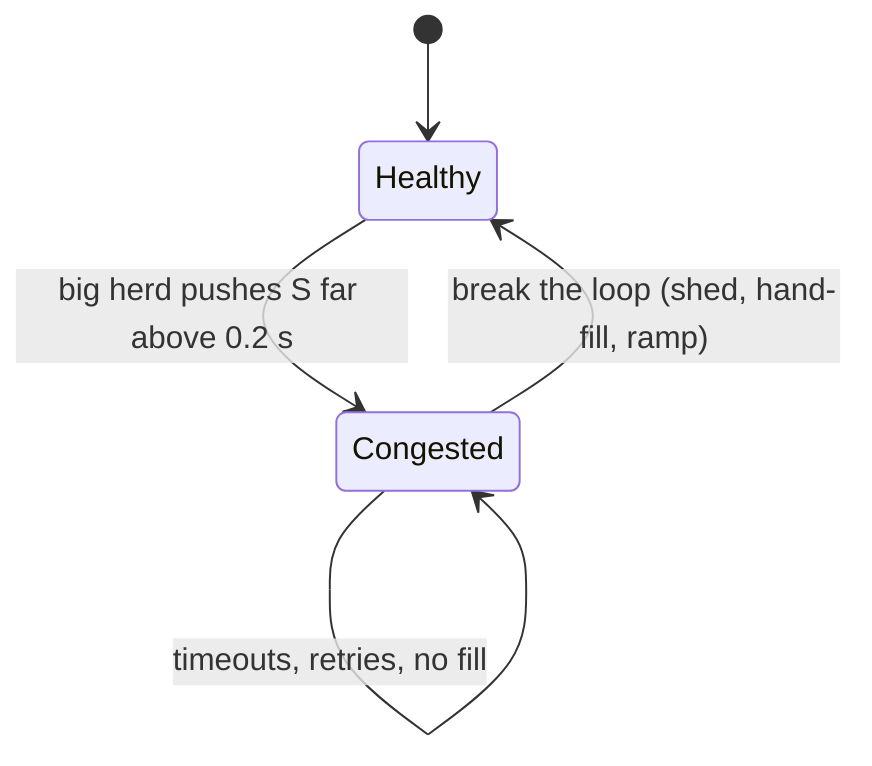
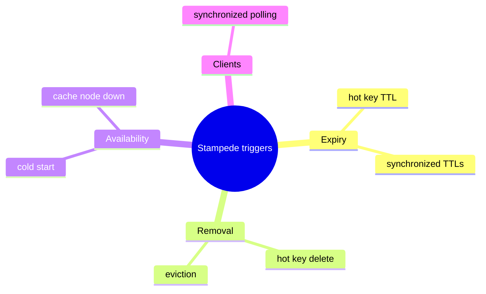

# Cache stampede mechanics

## Learning objectives

After studying this chapter you should be able to:

- Define cache stampede, dogpile and thundering herd, and distinguish the main triggers.
- Trace the timeline of a stampede on a single hot key and compute how many redundant fetches occur using Little's law.
- Model the load a stampede places on a database with basic queueing arithmetic.
- Explain how timeouts and retries turn a short stampede into a self-sustaining outage.
- Recognise stampede-prone keys in advance using the product of request rate and fill time.
- Identify the metrics that reveal a stampede while it is happening.

## 1. A problem that appears only at scale

Everything works in the test environment. The cache is hot, the database is idle, latencies are low. In production, at 03:00 a popular key expires. For a fraction of a second, a thousand requests per second arrive and every one of them finds the key missing. Each one does what the code says to do on a miss: query the database. The database, which was comfortably serving 100 queries per second, is suddenly handed several hundred identical expensive queries at once. It slows down. The slow queries take longer, more requests arrive in the meantime, and the system tips into a state from which it does not recover on its own.

This is a **cache stampede**, also called a **dogpile** or a **thundering herd** (the last term comes from operating systems, where many processes are awakened to compete for one resource, and is used loosely for the cache case). The defining feature: **many concurrent requests miss on the same data at the same time, and all of them independently go to the origin to recompute the same answer.**

A cache exists to protect the origin from repeated work. A stampede is the exact opposite: the moment of maximum demand for a key is the moment the cache offers no protection for it. The key that expired was _popular_, which is why the herd is big.

This chapter explains the mechanics and the arithmetic. The next chapter, Stampede mitigations, presents the cures, and the chapters after that apply the ideas to cold starts, to nonexistent keys, and to hot keys.

## 2. The anatomy of a stampede

### 2.1 The standard cache-aside code

Consider the usual read path:

```java
Value get(Key k) {
    Value v = cache.get(k);
    if (v != null) return v;
    v = db.query(k);          // takes S seconds; may be expensive
    cache.set(k, v, ttl);
    return v;
}
```

Notice that nothing in this code prevents two threads, or two thousand, from being inside `db.query` for the same `k` at once. The check of the cache and the fill are separate operations. Between the first request's miss and the moment its `set` completes, which takes at least the fill time S, every other request for that key also misses.

### 2.2 Timeline



The herd size is the number of requests that arrive between the expiry and the completion of the **first** fill. After the first successful `set`, new arrivals hit. Therefore the whole stampede is determined by one quantity: how long it takes for the first fill to complete. Anything that lengthens that time (a slow query, a loaded database, a queue in front of it) makes the herd bigger, and a bigger herd lengthens it further. That positive feedback is the dangerous part.

## 3. How big is the herd? Little's law

Let lambda be the request rate for the key (requests per second) and S be the time to fill (the fetch from the origin plus the cache write). The expected number of requests that arrive during the fill is simply

```
herd size  =  lambda * S
```

This is Little's law again: the number of requests "in the system" (waiting for a fill) equals the arrival rate times the time spent. Of these, one is necessary and the rest are redundant.

**Table of herd sizes:**

| Key request rate | Fill time                      | Herd (lambda x S) | Redundant fetches |
| ---------------- | ------------------------------ | ----------------- | ----------------- |
| 10 per s         | 5 ms                           | 0.05              | essentially none  |
| 100 per s        | 50 ms                          | 5                 | 4                 |
| 1,000 per s      | 200 ms                         | 200               | 199               |
| 5,000 per s      | 1 s                            | 5,000             | 4,999             |
| 1,000 per s      | 3 s (database already slowing) | 3,000             | 2,999             |

The last two rows show the sensitivity to S. If a database that is already stressed doubles the fill time, the herd doubles. The rule of thumb: **a key is stampede-prone when lambda x S is much larger than one**. A key requested once a minute with a 10 ms fill (herd of 0.0002) will never stampede. A key requested 1,000 times per second with a 200 ms fill will, every time it expires.



> **Key idea:** a stampede is a property of the product of popularity and fill time. Doubling the fill time doubles the herd, and a bigger herd lengthens the fill.

Notice that stampede risk is about the _product_. Expensive-to-compute and popular keys are the worst: the home page, a leaderboard, the top-sellers list, the feature-flag configuration, a hot user's profile. Teams often discover which keys these are only after an incident.

## 4. The load on the origin

### 4.1 Work and capacity

Suppose the fill is a database aggregate that costs 0.2 core-seconds (200 ms of CPU on one core), and the database has m = 16 cores. In normal operation, with TTL 60 s, this key costs 0.2 core-seconds per minute. Utterly negligible.

During the stampede with lambda = 1,000 per second, requests accumulate at 1,000 per second, each demanding 0.2 core-seconds. The _offered load_, in cores, is

```
offered load = lambda * S = 1,000 * 0.2 = 200 cores of work per second of wall time
utilisation  = offered / capacity = 200 / 16 = 12.5
```

A utilisation above 1 means the queue grows without bound while the condition lasts. The stampede lasts until the first fill completes and the cache starts answering.

### 4.2 A FIFO model: how long does it take to drain?

Assume that the database runs at most 16 queries at a time and queues the rest first-in-first-out. At t = 0 the key has expired and requests begin to arrive at 1,000 per second.

- The first 16 requests start immediately and finish at t = 0.2 s. The first completion fills the cache at about t = 0.2 s.
- By t = 0.2 s, 200 requests have arrived. 16 are running (or just finished), so about 184 are waiting in the queue.
- After the fill, new arrivals hit the cache and add no further load. But the 184 queued requests still execute their (now pointless) queries, one batch of 16 at a time. Each batch takes 0.2 s, and there are 184 / 16 = 11.5 batches, hence about 2.3 s of extra database work.

For those 2.3 seconds the database is saturated by redundant work. **Every other query in the system** (for other keys, other features, other users) waits behind those 184 queries. A stampede on one key causes collateral damage to the entire application. The total wasted work is 199 queries × 0.2 core-s = 39.8 core-seconds, which is 2.5 seconds of the whole 16-core machine, burned to recompute one value that needed 0.2 core-seconds.



|                         | Value                                    |
| ----------------------- | ---------------------------------------- |
| Needed work             | 1 query, 0.2 core-s                      |
| Redundant queries       | 199                                      |
| Wasted work             | 39.8 core-s (2.5 s of a 16-core machine) |
| Offered load / capacity | 200 / 16 = 12.5                          |

### 4.3 A worse model: degradation under concurrency

The FIFO model is the _optimistic_ one. Real databases degrade when too many queries run concurrently: lock contention, cache thrashing, context switches, memory pressure and connection overhead all increase the service time as concurrency rises. If running 200 queries at once makes each take 1.5 s instead of 0.2 s, then S itself has become 1.5 s, the herd becomes lambda x S = 1,500, and the database is pushed further into degradation. In this model the system has two stable states: a healthy state with S = 0.2 s, and a congested state with S >> 0.2 s, and a sufficiently large herd throws it from one to the other.

## 5. Why a short stampede becomes a long outage

### 5.1 Timeouts abandon the fill

Applications set timeouts. Suppose the client timeout is 1 s. If the congestion pushes S above 1 s, then _every request times out before its query returns_, and, critically, in many implementations the thread that timed out never executes the `cache.set`. No one fills the key. New requests continue to arrive and miss. The condition that caused the congestion (a missing key) is never repaired because the repair requires completing a query, and the queries can no longer complete in time.

```
lambda = 1,000 per s, S_effective = 1.5 s, timeout = 1 s
queries in flight at any moment = 1,000 * 1.0 = 1,000 (they are abandoned at 1 s,
                                 but the database keeps executing them)
no fill ever succeeds -> the key stays missing -> load persists
```

Abandoned queries are especially insidious: the client gave up but the database is still executing the query, so the database does work that nobody will ever use.



### 5.2 Retries multiply the load

Clients and middleware retry on timeouts. If each failed request is retried up to 3 more times, the offered load can approach 4× the original. Our 1,000 requests per second become 4,000 attempts per second, S gets worse, and more requests time out. Retries convert a transient overload into a sustained one. Without backoff and jitter, retries also synchronise into waves.



### 5.3 The loop



Once this loop is running, removing the original trigger does not stop it. The system is in what recent literature calls a **metastable failure**: a failure state that is sustained by the system's own feedback (work amplification, retries, a cold cache) after the initial trigger has gone. The recovery action is not "wait", it is "break the loop": shed load, fill the key by hand, block the retries, or restart traffic gradually.



## 6. The triggers, classified

All stampedes share the mechanics above; they differ in what removes the cache entry or makes it unavailable.

1. **Single hot key expiry.** A very popular key reaches its TTL. The classic case. Herd size lambda x S.
2. **Mass synchronized expiry.** Many keys share an expiry time because they were created together with the same TTL. Each key may be only moderately popular, but the sum is large. Jitter (see TTL design) addresses it.
3. **Explicit invalidation of a hot key.** A write deletes the cached value of a busy key, or a bulk job deletes thousands of keys. The invalidation chapters pointed out that delete causes a refill; on a hot key the refill is a stampede.
4. **Cold start.** A cache node restart, a failover to an empty replica, a deploy that flushes an in-process cache, or a new region brought online. All keys are missing at once. See Penetration and cold start.
5. **Eviction of a hot key.** Memory pressure or a scan evicts a hot key (usually a sign of a badly sized cache or a pollution problem).
6. **Dependency failure.** The cache node holding the key becomes unreachable; clients treat errors as misses and all go to the database.
7. **Client behaviour change.** A mobile app release makes thousands of devices poll a particular key at the same minute; a TTL-based alarm in clients fires on the hour.

Notice that cases 4 and 6 are not about expiry at all. A system protected only by "the key has a TTL with jitter" is not protected against them.



## 7. Detecting stampedes

You want to know about a stampede in seconds, not after the postmortem. Signals:

- **Database connections or concurrency** jump suddenly while request rate is flat.
- **Query duplication**: the same query text or key appearing many times in the slow query log within a short window. A cheap detector is a counter per key of in-flight loads; any value above, say, 5 is a stampede in progress.
- **Cache hit ratio dips** sharply, especially for one key group, while request volume is unchanged.
- **Latency percentiles** (p95 and p99) rise at the application tier.
- **Timeouts and retries** climb.
- **Cache write rate** spikes with the same key written multiple times (many redundant fills completing).

The in-flight counter is the most direct. Instrument the loader so you can see, per key class, the maximum concurrent loads for a single key. In normal operation it should be 1. Here is a Java sketch.

```java
private final ConcurrentHashMap<Key, LongAdder> inflight = new ConcurrentHashMap<>();

Value loadWithMetrics(Key k) {
    LongAdder c = inflight.computeIfAbsent(k, x -> new LongAdder());
    c.increment();
    try {
        long now = c.sum();
        if (now > 5) metrics.increment("cache.duplicate_loads", Tags.of("class", k.klass()));
        return db.query(k);
    } finally {
        c.decrement();
    }
}
```

(In production you would bound the size of this map; the point is to expose duplicated loads.)

## 8. A small simulation

To build intuition, simulate: key requested at lambda per second, fill takes S seconds, count how many fills are launched per expiry.

```java
// Expected duplicates per expiry, assuming Poisson arrivals and fixed fill time.
static double duplicatesPerExpiry(double lambda, double fillSeconds) {
    return lambda * fillSeconds;       // E[arrivals during the fill], by Little's law
}
// duplicatesPerExpiry(1000, 0.2) -> 200
// duplicatesPerExpiry(1000, 1.5) -> 1500
```

The expected number of arrivals during the fill window is lambda x S, and the arrivals in a Poisson process have a standard deviation of sqrt(lambda x S), about 14 for a mean of 200. So the herd size is predictable to within about 7 percent; it is not a rare unlucky event but a _deterministic consequence_ of the key's popularity and the fill time. It happens at every expiry.

## 9. Common pitfalls

1. **Treating a stampede as a rare event.** For hot keys it occurs at every expiry; it merely goes unnoticed while the origin has headroom.
2. **Sizing the origin for the steady state.** Provisioning for the miss rate averaged over time ignores the burst of lambda x S queries at expiry.
3. **Abandoned queries.** Timeouts that leave the database executing work no one wants. Use query cancellation and server-side statement timeouts.
4. **Retries without backoff and jitter.** They convert overload into sustained overload.
5. **Relying on TTL jitter alone.** Jitter addresses mass expiry, not a single hot key, not invalidation, not restarts.
6. **Filling the cache only on success within the request timeout.** If fills are abandoned with the request, the key may never be repopulated. Decouple the fill from the request's lifetime where possible.
7. **Believing that more cache nodes help.** A stampede is about one key's fill, not about cache capacity.
8. **Not measuring duplicate loads.** You cannot fix what you do not see.

## 10. Check your understanding

1. Define cache stampede and name three different triggers.
2. A key receives 400 requests per second. Its fill takes 150 ms. How many requests arrive during one fill, and how many of those are redundant?
3. Using the FIFO model from section 4.2, a database has 8 workers, each query takes 100 ms, and a key with 600 requests per second expires. How many requests have arrived by the time the first fill completes, how many are queued, and how long does the redundant work take to drain?
4. Explain why a timeout shorter than the fill time can prevent a stampede from ever ending.
5. Why does adding more cache memory not fix a stampede?
6. Which metric directly shows duplicate loads of the same key, and what value indicates trouble?

## 11. Answers

1. A stampede is a surge of concurrent requests that all miss the same data and all go to the origin to recompute it. Triggers include the expiry of a hot key, synchronized expiry of many keys, explicit invalidation of a hot key, a cache restart (cold start), eviction of a hot key and cache node failure.
2. lambda x S = 400 × 0.15 = 60 requests arrive during the fill; 59 are redundant (one fetch is needed).
3. First fill completes at 0.1 s. Arrived by then: 600 × 0.1 = 60. Running: 8, so 52 queued (ignoring that the first 8 just finished). Draining 52 queries at 8 per 0.1 s: 52 / 8 = 6.5 batches, about 0.65 s of redundant work.
4. If every request times out before its query returns and the timed-out requests never write the cache, no fill ever succeeds. The key stays missing, load persists, and retries add more. The loop feeds itself.
5. The key's absence is caused by expiry, invalidation or a cold start, not lack of capacity. The problem is concurrent identical fills, which only coordination (coalescing) or avoiding the miss can address.
6. The count of in-flight loads per key (concurrent loads). Normally 1; values above a handful (say 5) indicate a stampede.

## 12. Summary

A cache stampede occurs when many concurrent requests miss on the same key and each independently recomputes the value at the origin. The herd size is lambda x S, the product of the key's request rate and the fill time, so popular and expensive keys are prone to it at every expiry. The origin experiences utilisation far above one for the duration, and collateral damage reaches every other workload sharing it. Worse, the system has a positive feedback loop: slow fills lengthen the window, timeouts abandon fills, and retries multiply load, so the failure can become self-sustaining. Stampedes are triggered by expiry, mass expiry, invalidation, cold starts, eviction and cache failure. Measuring concurrent loads per key makes the problem visible. The next chapter, Stampede mitigations, shows how to ensure that exactly one request recomputes while the others wait, are served stale data, or never miss at all.
