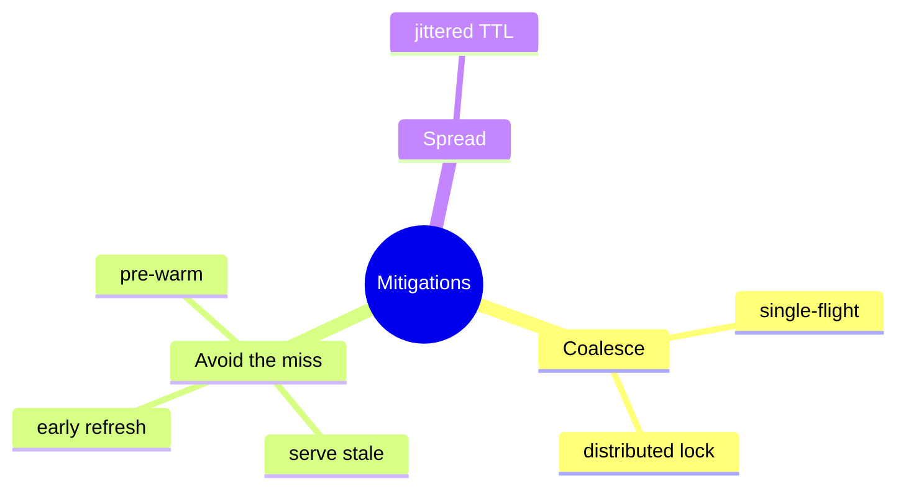
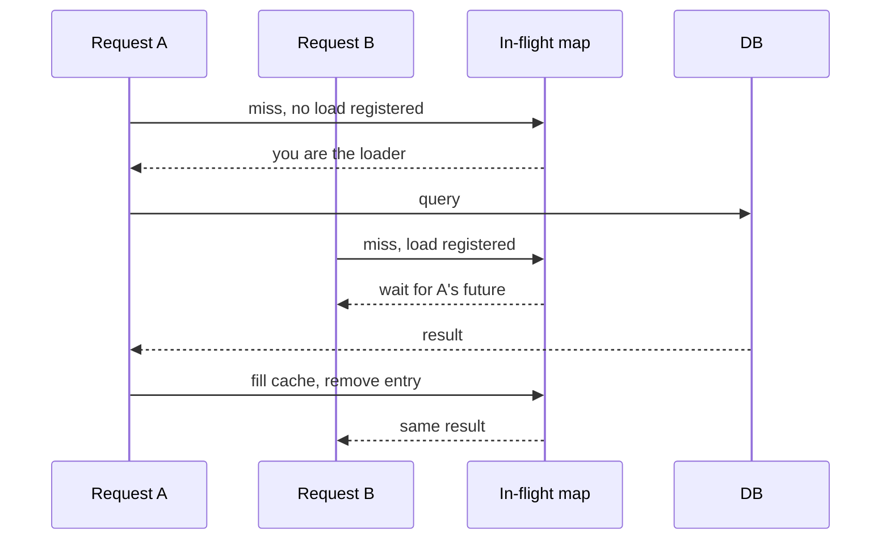
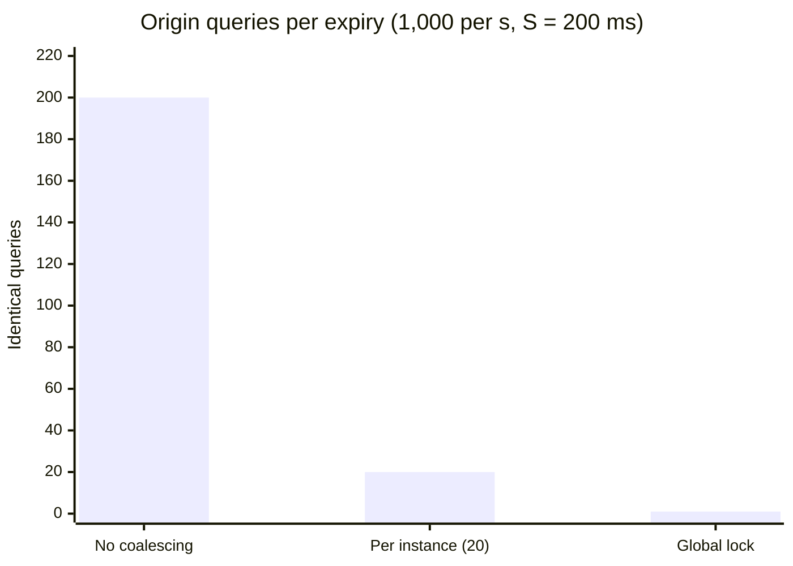
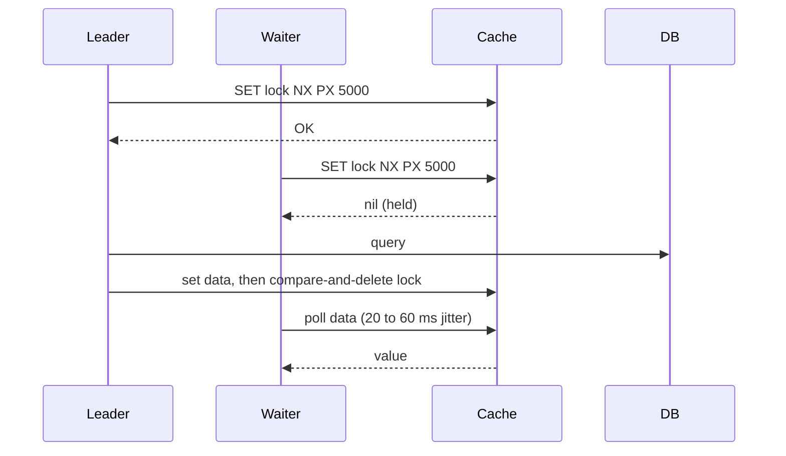
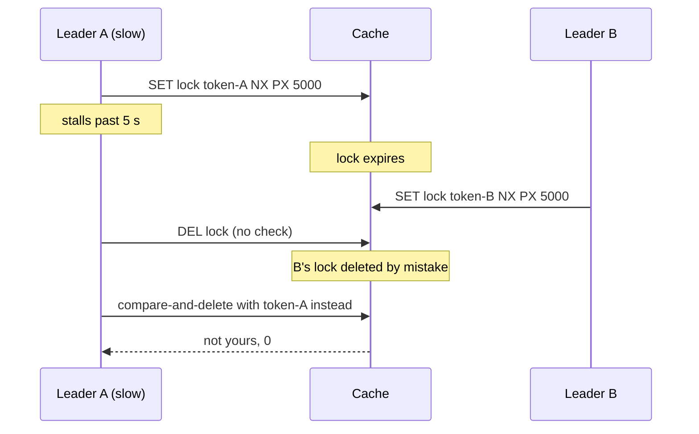
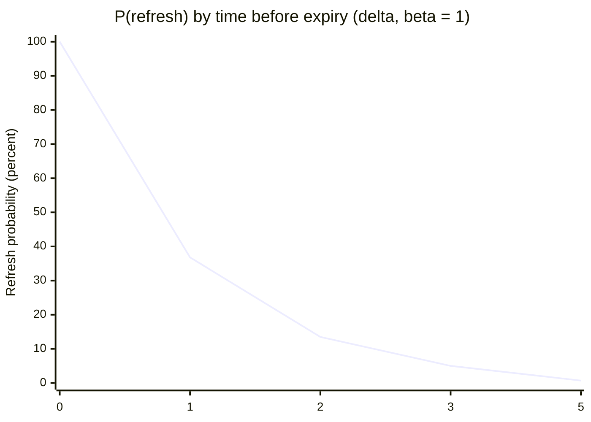
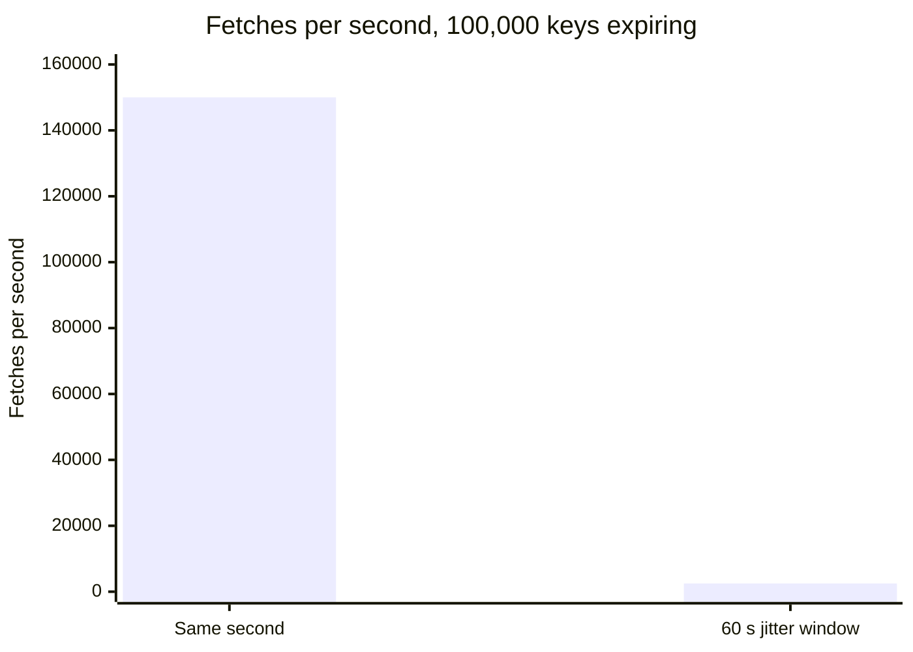
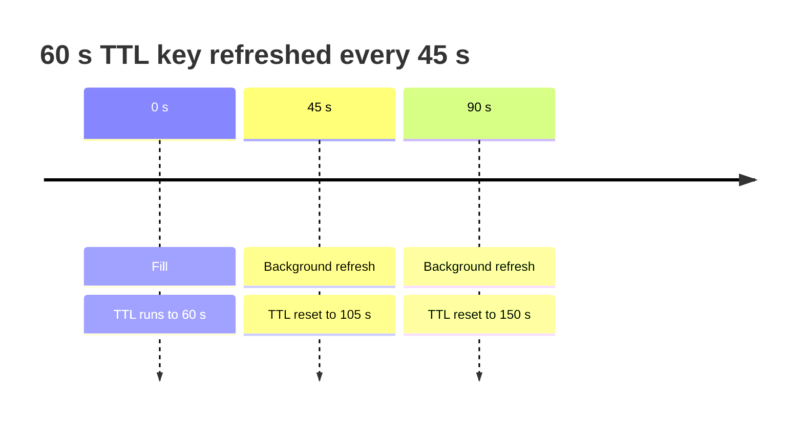
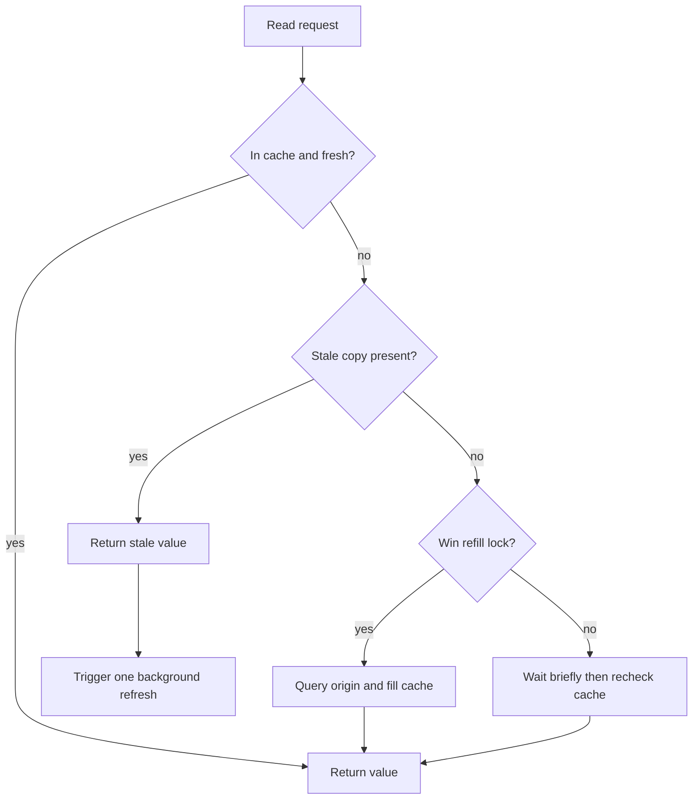

# Stampede mitigations

## Learning objectives

After studying this chapter you should be able to:

- Implement in-process request coalescing (single-flight) in Java and describe the C++ equivalent.
- Design a distributed lock for cache refills, with a safe timeout, an ownership token and a safe release.
- Explain probabilistic early expiration, derive when a refresh begins and compute the expected number of redundant recomputes.
- Combine stale serving, jittered TTLs and pre-warming (refresh-ahead) into a layered defence.
- Compare the techniques by latency, origin load, complexity and failure behaviour, and choose among them.

## 1. What are we trying to achieve?

The previous chapter, Cache stampede mechanics, showed that the damage of a stampede is proportional to the herd lambda x S, the number of requests that arrive while the first fill is in flight. A mitigation can attack that in three ways.

1. **Coalesce**: let one request recompute while the rest wait for its result. The herd still exists but only one query reaches the origin.
2. **Avoid the miss**: keep serving something (the old value) while a refresh happens in the background, or refresh _before_ expiry, so that no request ever sees an empty cache.
3. **Spread out**: make expiry events non-simultaneous so that no instant has a big herd (jitter).



The best production systems combine one technique from each family. Here is a map of this chapter.

| Technique                      | Family   | Latency for waiters    | Origin load per expiry | Main risk                      |
| ------------------------------ | -------- | ---------------------- | ---------------------- | ------------------------------ |
| In-process single-flight       | Coalesce | Up to S                | One per app instance   | Not global across instances    |
| Distributed lock               | Coalesce | Up to S (plus polling) | One globally           | Lock expiry, crashes, waiters  |
| Serve stale while revalidate   | Avoid    | None                   | One                    | Staleness up to the hard TTL   |
| Probabilistic early expiration | Avoid    | None                   | A handful              | Needs recompute-time estimate  |
| Refresh-ahead / pre-warming    | Avoid    | None                   | Planned                | Wasted refreshes for cold keys |
| Jittered TTL                   | Spread   | None                   | Spread over a window   | Does not help one hot key      |

## 2. Request coalescing (single-flight)

### 2.1 The idea

Maintain a map from key to an in-progress load. The first request that misses starts the load and registers a future (promise). Any request that misses while a load for the same key is registered does not start its own; it waits for the registered future. When the load completes, all waiters receive the result and the registration is removed.

In Go this pattern is packaged as the `singleflight` package. In Java, `ConcurrentHashMap.computeIfAbsent` with a `CompletableFuture` gives it in a few lines. Libraries such as Caffeine do this internally for loading caches: concurrent `get` calls for the same absent key invoke the loader once.



### 2.2 Java implementation

```java
final class Coalescer<K, V> {
    private final ConcurrentHashMap<K, CompletableFuture<V>> inflight = new ConcurrentHashMap<>();

    V load(K key, Function<K, V> loader) {
        CompletableFuture<V> mine = new CompletableFuture<>();
        CompletableFuture<V> existing = inflight.putIfAbsent(key, mine);
        if (existing != null) {
            return existing.join();                  // wait for the leader's result
        }
        try {
            V v = loader.apply(key);                 // I am the leader: one origin call
            mine.complete(v);
            return v;
        } catch (Throwable t) {
            mine.completeExceptionally(t);           // waiters see the failure too
            throw t;
        } finally {
            inflight.remove(key, mine);              // always unregister
        }
    }
}

Value get(Key k) {
    Value v = cache.get(k);
    if (v != null) return v;
    return coalescer.load(k, key -> {
        Value fresh = db.query(key);
        cache.set(key, fresh, jitteredTtl());
        return fresh;
    });
}
```

Several details matter. The `finally` block ensures the entry is removed even on failure, otherwise future requests would wait on a dead future forever. Waiters should use a **timeout** (`existing.get(timeout)`) so that a stuck leader cannot hang everyone. And a thread-safety subtlety: after a leader finishes, a latecomer might still miss if the cache write has not yet landed; sequence the cache `set` _before_ the future completes (as above) so that this window is closed.

### 2.3 C++ equivalent

In C++ the same structure uses a `std::shared_future`:

```cpp
std::mutex mu;
std::unordered_map<Key, std::shared_future<Value>> inflight;

Value load(const Key& k) {
    std::promise<Value> p;
    std::shared_future<Value> f;
    bool leader = false;
    {
        std::lock_guard<std::mutex> g(mu);
        auto it = inflight.find(k);
        if (it == inflight.end()) { f = p.get_future().share(); inflight[k] = f; leader = true; }
        else f = it->second;
    }
    if (!leader) return f.get();               // wait for the leader
    try {
        Value v = db_query(k);
        cache_set(k, v);                       // fill before publishing the result
        p.set_value(v);
    } catch (...) {
        p.set_exception(std::current_exception());
    }
    { std::lock_guard<std::mutex> g(mu); inflight.erase(k); }
    return f.get();
}
```

### 2.4 Effect: arithmetic

A key at 1,000 requests per second, fill S = 200 ms, served by 20 application instances (50 requests per second each).

- Without coalescing: herd 1,000 × 0.2 = 200 queries.
- With in-process coalescing: each instance runs one load, so at most 20 queries (fewer if some instances' first miss comes a little after another instance filled the cache).

That is a tenfold reduction, but the origin still sees 20 identical queries. With 500 instances the figure would be 500 queries, and in the limit the herd is at most the _number of instances_, not the number of requests. For fleets of hundreds of servers, you want coalescing that is global, which leads to the distributed lock.



Latency for the waiters is up to S = 200 ms, but this is an upper bound: the average waiter arrived midway through the fill and waits about 100 ms. This is far better than a database queue in which every one of the 200 queries takes 2.3 s to drain (section 4.2 of the previous chapter).

## 3. A distributed lock around the refill

### 3.1 The pattern

Use the cache itself to elect a leader across all instances. On a miss, try to create a short-lived **lock key** with "set if not exists" semantics. In Redis:

```
SET lock:product:42 <unique-token> NX PX 5000
```

`NX` means set only if the key does not exist; `PX 5000` means expire after 5,000 ms. If the command succeeds, you are the leader: recompute, fill the cache, and release the lock. If it fails, someone else is already refilling; you either wait and re-check the cache, or serve a stale value if you have one.



### 3.2 Safe release and the timeout

The lock must have an **expiry**. Without one, a leader that crashes after acquiring the lock leaves it forever, and nobody can refill the key. The timeout must be chosen carefully:

- **Too short** (shorter than the fill time): the lock expires while the leader is still working. A second request becomes leader and starts a duplicate fill, the very thing the lock was to prevent. Worse, when the first leader finishes it may release _the second leader's_ lock.
- **Too long**: after a leader crash, the key stays unfillable for the whole timeout, and waiters pile up.

Choose the timeout as a generous multiple of the typical fill time but short enough that a crash is tolerable, and use p99.9 fill latency as a guide. With a typical S = 200 ms, p99.9 = 1.5 s, a lock timeout of 3 to 5 seconds is reasonable.

To avoid releasing someone else's lock, store a **unique token** (random value) as the lock value and release only if the stored value still equals your token. This compare-and-delete must be atomic, so use a small server-side script:



```
-- release.lua: delete the lock only if we still own it
if redis.call("GET", KEYS[1]) == ARGV[1] then
  return redis.call("DEL", KEYS[1])
else
  return 0
end
```

A Java skeleton of the whole refill:

```java
Value getWithLock(String key) {
    Value v = cache.get(key);
    if (v != null) return v;

    String lockKey = "lock:" + key;
    String token = UUID.randomUUID().toString();
    if (redis.setNxPx(lockKey, token, 5000)) {              // I am the leader
        try {
            v = cache.get(key);                             // double-check after winning
            if (v == null) {
                v = db.query(key);
                cache.set(key, v, jitteredTtl());
            }
            return v;
        } finally {
            redis.evalCompareAndDelete(lockKey, token);     // safe release
        }
    }
    // Not the leader: wait briefly for the leader's fill
    long deadline = System.nanoTime() + Duration.ofMillis(1000).toNanos();
    while (System.nanoTime() < deadline) {
        sleepWithJitter(20, 60);                            // 20..60 ms
        v = cache.get(key);
        if (v != null) return v;
    }
    return db.query(key);                                   // fallback: do not hang forever
}
```

The **double check after winning** matters: between the first miss and winning the lock, another leader may have completed its fill and released the lock. Without the re-check, the new leader would redundantly query.

### 3.3 Waiting costs

The waiters poll the cache. With 200 waiters each polling every 40 ms on average, the cache sees 200 / 0.040 = 5,000 reads per second for the duration of the fill. Cheap for a cache (it handles hundreds of thousands per second) but not free, and it contributes to hot key problems on the lock or data key (see the lesson on hot keys). Improve with exponential backoff plus jitter, or let waiters block on a notification (pub/sub or a blocking list operation).

The final **fallback** (query the database after the deadline) is a deliberate choice. It prevents indefinite hangs but allows a bounded herd after a leader failure. Some systems instead return an error or a degraded response at the deadline. Which is better depends on whether the origin can survive the herd.

### 3.4 The subtle problem: leases and lock safety

A lock held by a stalled process can expire while the process still believes it holds it. This is the well-known weakness of time-based locks: a long garbage collection pause can make a leader continue after its lock has been handed to someone else. For cache refills the consequence is benign if the fill is idempotent and versioned: two leaders compute the same answer, and the versioned `set` (see Consistency models and leases) rejects an older one. For correctness-critical mutual exclusion this approach would not be enough, but a cache refill is not one: the lock is a performance optimisation, not a correctness mechanism. State that explicitly in the design: if the lock fails, the system still works, only slower.

## 4. Serve stale while revalidating

Instead of making waiters wait, give them something. Keep the old value in the cache past its soft expiry and let readers use it while exactly one of them refreshes. This was introduced in TTL design as soft and hard TTLs. For stampede purposes:

1. The entry has a soft expiry and a hard expiry (the physical TTL).
2. After the soft expiry, the first reader to notice acquires the refresh lock (or a local single-flight guard) and refreshes asynchronously. All other readers return the stale value immediately.
3. If the refresh fails, the stale value keeps being served until the hard expiry.

Result: zero waiting for users, one origin query per expiry, and graceful degradation if the origin fails. The cost is that users see values up to (soft TTL + refresh time) old, or up to the hard TTL in failure. This is acceptable for most read-mostly data, but not for data with a tight staleness budget.

> **Key idea:** the hard TTL is how long you are willing to serve stale data when the origin is down. The soft TTL is how fresh you want data when it is up.

Two refinements. First, if the entry's _physical_ TTL (hard TTL) passes before any refresh succeeds, you are back to a cold miss, and need coalescing again. A layered defence uses stale serving for the common case and the lock for the rare hard miss. Second, the refresher should have a lease or lock with a timeout so that a crashed refresher is replaced; otherwise the entry would be stale until its hard expiry.

## 5. Probabilistic early expiration

### 5.1 The idea

A refresh triggered at expiry always races with the herd. A better trigger is to **refresh slightly before expiry**, and to spread the decision randomly so that exactly one or a few requests perform it. The elegant formulation is due to Vattani, Chierichetti and Lowenstein, in a paper on optimal probabilistic cache stampede prevention, often called "XFetch" after its algorithm.

Each cached entry stores, alongside its value and expiry time, the time delta it took to compute it. On each read, a request decides independently whether to refresh early:

```
refresh now  if   now - delta * beta * ln(rand())  >=  expiry
```

where rand() is uniform in (0, 1], so ln(rand()) is negative and the term `-delta * beta * ln(rand())` is a positive random number: an exponential random variable with mean delta x beta. The parameter beta (default 1) tunes aggressiveness: larger values refresh earlier.

### 5.2 Why it works: the arithmetic

Let t be the time remaining until expiry. The condition above is equivalent to -ln(rand()) >= t / (delta x beta), which has probability

```
P(refresh | t) = exp( -t / (delta * beta) )
```

For a request arriving 3 delta before expiry the probability is e^-3 = 0.05; at delta before expiry it is e^-1 = 0.37; at expiry it is 1. The probability rises smoothly as expiry approaches, and it is higher for entries that are expensive to compute (larger delta), which are exactly those that need more lead time.



**Worked example.** lambda = 1,000 requests per second, delta = 0.2 s, beta = 1. The expected number of triggering requests over the final window is the integral of the arrival rate times the probability:

```
expected triggers in the last t seconds before expiry
  = integral from 0 to t of  lambda * exp(-u / delta) du   (u = time before expiry)
  = lambda * delta * ( 1 - exp(-t / delta) )
```

Letting t grow large, the total over the whole lifetime tends to lambda x delta = 200 if nothing ever reset the clock. The expected number of triggers that happen _earlier_ than t seconds before expiry is the remainder, lambda x delta x exp(-t/delta). The first trigger is expected when this remainder equals one:

Solving:

```
lambda * delta * exp(-t / delta) = 1
200 * exp(-t / 0.2) = 1
t = 0.2 * ln(200) = 0.2 * 5.30 = 1.06 s
```

So the first refresh is typically triggered about one second before expiry, a comfortable five delta, giving the refresh time to finish (0.2 s) well before expiry. During the 0.2 s refresh, requests keep arriving and may also trigger; the expected additional triggers during that window are lambda x delta x (exp(-(t-0.2)/delta) - exp(-t/delta)) = 200 x (e^-4.3 - e^-5.3) = 200 x (0.0136 - 0.0050) = 1.7. So you expect roughly 2 to 3 recomputations per expiry instead of 200. Notice that no lock, no coordination between servers, and no shared state beyond the stored delta is needed: each request flips its own coin.

### 5.3 Code

```java
record Entry<V>(V value, double deltaSeconds, long expiryMillis) {}

V read(String key) {
    Entry<V> e = cache.get(key);
    long now = System.currentTimeMillis();
    double beta = 1.0;
    boolean refreshEarly = e == null
        || now - e.deltaSeconds() * 1000 * beta * Math.log(ThreadLocalRandom.current().nextDouble()) >= e.expiryMillis();
    if (!refreshEarly) return e.value();

    long t0 = System.nanoTime();
    V fresh = loader.apply(key);
    double delta = (System.nanoTime() - t0) / 1e9;                    // measure the cost
    cache.set(key, new Entry<>(fresh, delta, now + ttlMillis()), hardTtl());
    return fresh;
}
```

Remember to guard against `Math.log(0)`: use `1.0 - nextDouble()` to get a value in (0, 1].

### 5.4 Caveats

- The early refresh _is_ a blocking refresh for the unlucky request that performs it. Combine with asynchronous refresh or coalescing if that latency matters.
- The technique prevents the herd at expiry; it does not help with explicit invalidation (the key is simply absent), nor with cold starts.
- Entries that are rarely requested still expire normally. This is fine: they have no herd.
- It slightly wastes TTL: entries are refreshed a bit early. With delta = 0.2 s against a TTL of 60 s the waste is under two percent.

## 6. Jittered TTLs

TTL design explained jitter for the synchronized expiry case. In the stampede context it adds the following. Jitter spreads **many keys'** expiries, so that the sum of the herds of the keys is not a spike. It does nothing for one very hot key whose own herd is large. Use it always, and add one of the other techniques for hot keys.

A quick calculation of the benefit: 100,000 keys of moderate popularity (each lambda x S = 0.5 expected redundant fetches), all expiring in the same second: 100,000 × (1 + 0.5) = 150,000 fetches in that second. Spread over a 60-second jitter window: 150,000 / 60 = 2,500 per second. The origin can plan for 2,500 per second; it cannot survive 150,000 in a second.



## 7. Pre-warming and refresh-ahead

For keys that are known to be hot (the home page, the top 1,000 products, feature flags, configuration), do not wait for requests to refresh them. Run a **background refresher** that recomputes them periodically, a little more often than their TTL, so that they are never absent.

```java
// Every 45 s refresh a 60 s TTL key, so the entry is always renewed before expiry.
scheduler.scheduleAtFixedRate(() -> {
    for (Key k : hotKeys()) {
        Value v = db.query(k);
        cache.set(k, v, Duration.ofSeconds(60));
    }
}, 0, 45, TimeUnit.SECONDS);
```



Costs and caveats:

- You pay for the refresh whether or not anyone reads the key. For 1,000 hot keys, 45-second refresh, each costing 20 ms of origin time: 1,000 / 45 = 22 queries per second, 0.44 core-seconds per second. Predictable and cheap compared with the stampede. For one million keys it would be absurd; restrict to a measured set.
- Choose the hot set from data (top-k by request count) and update it regularly. A stale hot list wastes effort.
- With several instances running the scheduler, elect one (a lock) or shard the key list, otherwise you refresh each key once per instance.
- Pre-warming is also the main tool for cold start: load the known hot keys before the node takes traffic. The next lesson, Penetration and cold start, develops this.

## 8. Choosing and combining

A decision guide.

1. **Always**: jittered TTLs; instrumentation of duplicate loads.
2. **Every cache-aside path with a nontrivial fill**: in-process single-flight. It is cheap and removes the per-instance herd.
3. **Large fleets or expensive fills**: add a distributed lock or lease so the origin sees one query, not one per instance.
4. **Latency-sensitive hot keys**: stale serving or probabilistic early refresh so that users do not wait. Add pre-warming for the known hottest keys.
5. **Strict freshness data**: you cannot serve stale; rely on coalescing, and consider keeping the TTL long and invalidating explicitly, with refill coalesced.



The diagram combines three techniques: the stale path serves immediately and triggers one refresh, the hard miss path elects a leader by lock, and the waiters poll briefly. Each box has a bounded wait or a bounded retry.

> **Key idea:** pick one technique from each family: spread (jitter), avoid the miss (stale or early refresh), and coalesce (single-flight, then a lock for large fleets).

## 9. Common pitfalls

1. **Coalescing without a timeout.** A stuck leader hangs every waiter. Always bound the wait.
2. **Lock without an expiry**, or with an expiry shorter than the fill time.
3. **Releasing without checking ownership.** A slow leader deletes the next leader's lock.
4. **Missing double-check after winning the lock.** Leads to redundant queries.
5. **Not removing the in-flight entry on failure** (`finally`), causing permanent waits.
6. **Failing leaders propagate errors to all waiters** and the retry then re-creates the herd. Consider negative caching of failures for a few seconds and serving stale on error.
7. **Pre-warming everything.** Costly and pointless for cold keys. Pre-warm a measured hot set only.
8. **Relying on the lock for correctness.** It is a performance optimisation; the system must still be correct if two leaders run.
9. **Stale serving on data that cannot be stale.** Check the staleness budget.
10. **Polling waiters in lockstep.** Without jitter they hit the cache in waves.

## 10. Check your understanding

1. Describe how single-flight reduces the origin load for a key at 2,000 requests per second with S = 100 ms, served by 10 instances. What is the herd size without and with it?
2. Why must a Redis refill lock have an expiry, and what goes wrong if the expiry is shorter than the fill time?
3. Why is the lock release done by a compare-and-delete script rather than a plain delete?
4. In probabilistic early expiration with delta = 0.5 s and beta = 1, what is the probability that a request arriving 2 s before expiry triggers a refresh?
5. For delta = 0.1 s and a key at 500 requests per second, estimate how long before expiry the first refresh is expected.
6. What is the difference between pre-warming a list of hot keys at startup and refresh-ahead on a schedule?

## 11. Answers

1. Without: lambda x S = 2,000 × 0.1 = 200 queries. With single-flight per instance: at most 10 (one per instance). A distributed lock would reduce this to 1.
2. If the leader crashes holding a lock without an expiry, the key can never be refilled. If the expiry is shorter than the fill, the lock lapses mid-fill, a second leader starts a duplicate fill, and the first leader might release the second's lock (unless ownership is checked).
3. To ensure you delete the lock only if you still own it. A plain delete could remove a lock that expired and was reacquired by a different leader, letting a third process also become leader.
4. P = exp(-t / (delta x beta)) = exp(-2 / 0.5) = e^-4 = 0.018, about 1.8 percent.
5. t = delta x ln(lambda x delta) = 0.1 × ln(500 × 0.1) = 0.1 × ln(50) = 0.1 × 3.91 = 0.39 s before expiry.
6. Pre-warming at startup is a one-off load of known hot keys before taking traffic, addressing cold start. Refresh-ahead is a continuing background process that renews hot keys before they expire so they are never absent. They share the hot-key list and refresh code.

## 12. Summary

Stampede defences either coalesce concurrent fills, avoid the miss, or spread expiry out. In-process single-flight caps the herd at one fill per instance. A distributed lock with an expiry, a unique token and an atomic release caps it at one globally, with the lock as a performance optimisation rather than a correctness mechanism. Serving stale values with a single background refresher removes waiting entirely. Probabilistic early expiration needs no coordination: each request refreshes with probability exp(-t / (delta x beta)) at time t before expiry, which for realistic parameters yields a few recomputes per expiry instead of hundreds. Jitter spreads the expiry of many keys, and refresh-ahead keeps known hot keys permanently warm. Layer them, bound every wait, and measure duplicate loads. The next lesson, Penetration and cold start, deals with the cases that expiry-based techniques do not cover.
