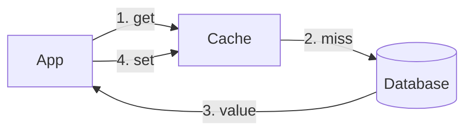

# What a cache is and why it exists

A cache keeps a copy of data closer to where it is needed, so repeated reads
are faster and cheaper than going back to the source of truth.

This placeholder lesson only exists to exercise the build pipeline.
