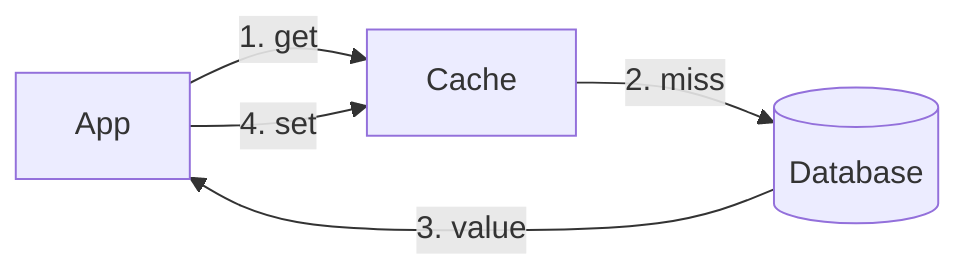
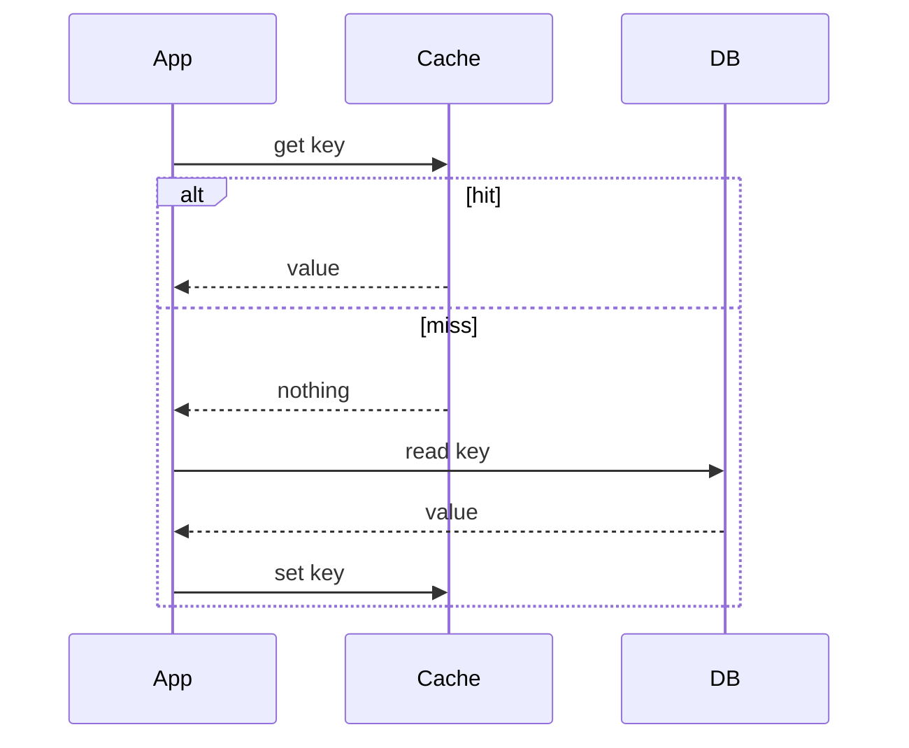
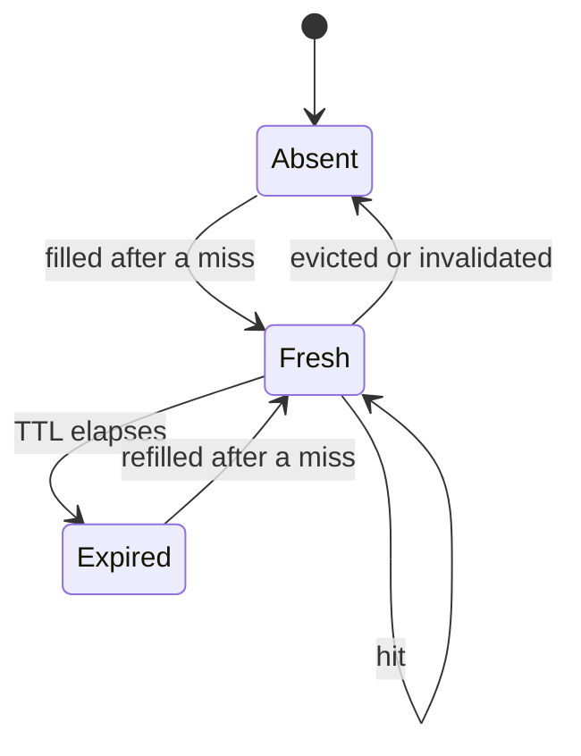

# What a cache is and why it exists

A cache keeps a copy of data closer to where it is needed, so repeated reads
are faster and cheaper than going back to the source of truth.

|                             | Hit       | Miss                                   |
| --------------------------- | --------- | -------------------------------------- |
| Where the answer comes from | The cache | The database, then the cache is filled |
| Relative cost               | Cheap     | Lookup plus the full database cost     |
| Effect on the cache         | None      | A new entry is stored                  |

> **Key idea:** A cache is a copy, not the truth. It trades some freshness for speed, so every entry needs a way to expire or be replaced.

This placeholder lesson only exists to exercise the build pipeline.
