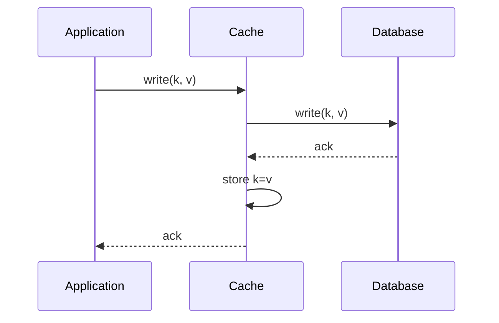
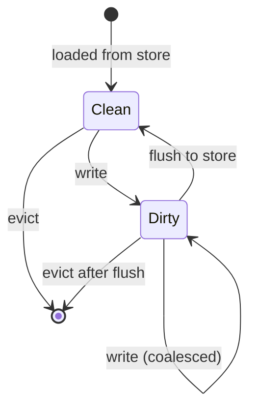
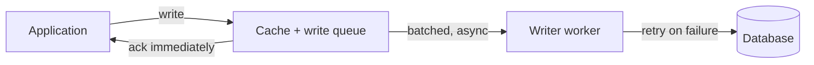

# Write-through, write-back, write-around and write-behind

## Learning objectives

After studying this lesson you should be able to:

- Define write-through, write-back, write-around and write-behind precisely, and distinguish write-back from write-behind.
- Compare the policies on latency, durability, consistency, write amplification and read-after-write behaviour.
- Calculate effective write latency and write traffic to the backing store for each policy under a given workload.
- Describe failure scenarios for each policy: lost writes, ordering violations, and coalescing surprises.
- Choose a policy for a given workload (write-heavy, read-heavy, write-once, bursty) and justify it.
- Explain how write-allocate and no-write-allocate relate to these policies.

## 1. Two places, one truth

Every cache sits in front of a **backing store**, also called the system of record or source of truth: a database, a disk, a remote service. When the application reads, the cache's job is easy to state: return the stored copy if it is valid. When the application **writes**, the cache faces a decision: it now holds, or might hold, a copy that disagrees with the source of truth, or the new value must be recorded in both places. A **write policy** is the rule that says when and how the cache and the backing store are updated.

The choice is not cosmetic. It determines:

1. **Write latency**: does the caller wait for the slow store?
2. **Durability**: if the cache crashes right now, is the write safe?
3. **Consistency**: can a reader see old data, and for how long?
4. **Load on the backing store**: how many writes reach it?
5. **Read-after-write behaviour**: will the next read hit and see the new value?

You have already seen these questions answered in hardware: CPU caches are typically write-back (with a dirty bit), and the OS page cache is write-back with `fsync` as the durability escape hatch (see the CPU caches and OS caches lessons). This lesson names the four classic policies and studies their trade-offs in the setting of application and distributed caches. The next lesson covers read-side patterns (cache-aside, read-through, refresh-ahead), and the third studies dual writes, idempotency and queues.

## 2. Write-through

**Definition.** On a write, the application writes to the cache and the cache synchronously writes to the backing store. The write is acknowledged only after both have succeeded.

(Ordering inside the cache layer varies by implementation; some update the store first, then the cache, so that a failed store write never leaves a phantom value in the cache.)

**Properties.**

- **Consistency**: strong between cache and store for writes that pass through the cache. A subsequent read from the cache sees the new value (read-after-write works).
- **Durability**: as durable as the backing store, since the acknowledgement waits for it.
- **Write latency**: the sum (or at best the max, if done in parallel) of cache and store latency. The store dominates, so writes are as slow as without a cache.
- **Read latency**: excellent for data recently written, because it is already in the cache.
- **Store load**: every write reaches the store, so write-through does nothing to reduce write load.

**When it fits.** Data that is read soon after being written and must not be lost: user profile updates, configuration, session objects whose durability matters. Read-heavy workloads where write rates are modest, so slow writes are acceptable.

**Costs.** It "caches data that may never be read." If most written items are never read again, you populate the cache with useless entries that evict useful ones (cache pollution) and pay the cost of storing them. Also, write-through requires the cache to be in the write path: every writer must use the cache API.

## 3. Write-back (copy-back)

**Definition.** On a write, the application writes only to the cache, which marks the entry **dirty** and acknowledges immediately. The cache flushes dirty entries to the backing store later: on eviction, on a timer, when a dirty-count threshold is hit, or on explicit flush.

**Properties.**

- **Write latency**: the cost of a cache write only (microseconds for a remote cache, nanoseconds for local).
- **Store load**: reduced by **coalescing**: if a key is written 100 times between flushes, only the last value is written. A counter incremented a million times may become a single store update.
- **Batching**: flushes can be batched into larger sequential operations, which are more efficient on most stores.
- **Durability**: weakened. Until flushed, the cache holds the only copy of the newest value. A crash loses the dirty entries. How much can be lost depends on the flush interval and dirty set size.
- **Consistency**: other readers going directly to the store (bypassing the cache) see stale data until the flush. The cache is effectively the primary, which complicates anything else that reads the store: reports, replicas, other services.

**Eviction interacts with writes.** Evicting a dirty entry requires a flush first, so a dirty eviction costs a store write on the foreground path, making eviction latency spikes possible. Policies that account for dirtiness (preferring clean victims) exist in hardware and storage systems.

**When it fits.** Write-heavy workloads where some loss is tolerable or the cache itself is durable and replicated: counters, metrics, "last seen" timestamps, view counts, game state with periodic checkpoints. CPU caches and the OS page cache are write-back for these reasons.

### Worked example: coalescing

A video site increments a view counter for a popular video 5,000 times per second. The database can handle perhaps a few thousand simple writes per second but this single row would also create heavy lock contention.

- Write-through: 5,000 database writes per second to the same row. Contention and load are severe.
- Write-back with flush every 5 seconds: the cache accumulates 5 x 5,000 = 25,000 increments, then issues a single `UPDATE views = views + 25000`. Database writes: 0.2 per second for that key, a reduction of 25,000x for 5 seconds of exposure. The cost: if the cache node crashes, up to 5 seconds of increments (25,000 views) are lost. For a view counter that is likely acceptable; for account balances it never is.

## 4. Write-around

**Definition.** Writes go directly to the backing store and bypass the cache. The cache is populated only on reads (a read miss loads the entry). In the hardware vocabulary this corresponds to **no-write-allocate**.

**Properties.**

- **Write latency**: the store's latency, same as write-through.
- **Cache pollution avoided**: data written but never read does not occupy the cache. Valuable for write-once, read-rarely data such as logs, bulk imports and archives.
- **Read-after-write**: the first read after a write misses (the entry is absent), unless an older version is cached, in which case that version is **stale** and must be invalidated or overwritten. This is the main catch: write-around alone does not update or remove cached copies. It is almost always paired with invalidation (delete the key on write), which is precisely the cache-aside pattern described in the next lesson.

**When it fits.** Workloads with many writes and few reads of the written data, bulk loads, and cases where freshly written data is unlikely to be read immediately.

## 5. Write-behind (write-back as an asynchronous service)

The terms are often used interchangeably, but a useful distinction exists in application caching.

**Write-behind** (also called write-back in some caching products) means the application writes to the cache and the cache asynchronously persists to the store, usually through a **queue or buffer managed by the cache layer**, with batching and retries. Compared with CPU-style write-back, whose flushes are driven mostly by eviction, write-behind emphasizes a continuous, time-delayed pipeline: "the writes will arrive at the database shortly."

Characteristics beyond plain write-back:

- A **write queue** holds pending updates in order, possibly persisted (for example on disk or in a replicated log) to survive cache crashes.
- **Retries and backoff** handle store outages; the cache can absorb writes while the store is down, up to the queue capacity. This is a resilience benefit.
- **Coalescing and batching** can be configured: merge updates for the same key, flush every N items or every T milliseconds.
- **Ordering** becomes a design question (see below).

**Risks.**

- **Data loss**: if the queue is in memory and the cache process dies, queued writes vanish. Mitigations: replicate the cache (a write is acknowledged after reaching a quorum of cache nodes), persist the queue, or accept bounded loss.
- **Reordering**: if two updates to different keys have a dependency (create the order, then add its lines) and are flushed in a different order, the database may transiently or permanently hold an inconsistent state, or constraints may fail. Per-key ordering is easy to preserve; cross-key ordering usually requires a single ordered queue or sequence numbers.
- **Visibility**: other systems reading the database see stale data until the flush completes. Reads of data that has been written but not yet flushed must go through the cache, or they miss recent writes.
- **Failure of the flush**: a write acknowledged to the user may later be rejected by the database (constraint violation, schema change). The user was told "success" but the store disagrees. You need a dead-letter path and a way to surface or reconcile failures, or limit write-behind to updates that cannot fail validation.
- **Backlog and backpressure**: if writes arrive faster than the store can absorb, the queue grows. Without a bound, memory is exhausted; with a bound, you must either block writers (reverting to write-through behaviour) or drop writes.

### Worked example: queue sizing

Writes arrive at 2,000 per second on average, with a peak of 10,000 per second for 30 seconds. The database sustains 4,000 writes per second. During the peak, the backlog grows at 10,000 - 4,000 = 6,000 per second, so after 30 seconds it holds 180,000 pending writes. After the peak the queue drains at 4,000 - 2,000 = 2,000 per second net, which takes 180,000 / 2,000 = 90 seconds. If each entry is 1 KB, the queue needs about 180 MB, and the system exposes up to ~120 seconds of lag where the database lags the cache. With coalescing at 50 percent (many updates hit the same key), the effective peak load becomes 5,000 per second, backlog growth 1,000 per second, a 30,000-entry queue, and drain in 15 seconds. This shows why write-behind absorbs bursts: it converts peak load into a smooth, bounded delay, provided the average rate is below the store's capacity.

## 6. Comparing the four

| Policy        | Write latency        | Durability on ack                 | Store write load    | Read-after-write from cache | Typical risk                          |
| ------------- | -------------------- | --------------------------------- | ------------------- | --------------------------- | ------------------------------------- |
| Write-through | Slow (store)         | As good as the store              | Every write         | Yes                         | Slow writes; pollution by unread data |
| Write-back    | Fast (cache)         | Weak until flush                  | Reduced (coalesced) | Yes                         | Lost dirty data; stale store          |
| Write-around  | Slow (store)         | As good as the store              | Every write         | Miss first, stale if cached | Stale copies unless invalidated       |
| Write-behind  | Fast (cache + queue) | Weak, depends on queue durability | Reduced, smoothed   | Yes                         | Loss, reordering, rejected writes     |

Notice the pattern: you can buy low write latency and lower store load only by giving up durability and strong consistency, unless you replace the cache's weak durability with replication or a durable log. This is a specific instance of the more general trade-off between latency, durability and consistency that distributed systems theory keeps rediscovering.

### A decision procedure

1. **Can the data be lost or approximated?** (counters, telemetry, positions). If yes, write-back or write-behind with bounded flush intervals.
2. **Must every acknowledged write survive a cache failure?** If yes, use write-through, or write-behind only with a durable replicated queue.
3. **Will written data be read soon?** If yes, prefer policies that leave it in the cache (write-through, write-back). If rarely, write-around.
4. **Does anything else read the backing store directly?** If yes, write-back and write-behind produce stale views for those readers; either route them through the cache or accept lag.
5. **Is the store the bottleneck on writes?** If yes, coalescing (write-back/behind) is the lever.

## 7. Write-allocate and the cost of a write miss

When a write targets a key not currently cached, the cache can **write-allocate** (load or create the entry, then update it) or **not allocate** (send the write to the store only). Write-through caches commonly do not allocate; write-back caches commonly do, because they need somewhere to hold the dirty value. For partial updates (modify one field of a large object), write-allocate with write-back forces a **read-modify-write**: fetch the old object from the store, merge, mark dirty. This extra read can be expensive; some systems store deltas or whole-object replacements to avoid it.

## 8. Failure scenarios in detail

**Cache crash with dirty data (write-back).** Suppose a cache node holds 40 dirty entries when the process is killed by the OS out-of-memory handler. On restart the entries are gone. The application acknowledged those writes. Defences: periodic flush with a small interval, replicating dirty entries to a second node before acknowledging, writing a local append-only log, or classifying data so only tolerant data uses write-back.

**Store outage (write-through).** If the store is down, write-through writes fail (or block). The system is unavailable for writes, though reads may continue from the cache. A designer must decide whether to fail the write or accept it into a buffer (becoming write-behind).

**Partial failure ordering (write-through).** If the cache is updated first and the store write then fails, the cache holds a value that was never persisted: readers see a value that disappears later. Safer ordering: write the store first, then update the cache; if the cache update fails, delete the key or accept staleness bounded by TTL. This is the heart of the dual-write problem covered in the third lesson of this chapter.

**Lost update from out-of-order flushes.** Two writes to key K from different application servers: W1 (value 1) at time t1 and W2 (value 2) at time t2 > t1. If the write-behind queue processes them out of order, the store ends up with 1 although 2 was the last write. Use per-key sequence numbers or version stamps and conditional updates (`UPDATE ... WHERE version < ?`) so that stale writes are rejected.

**Read from store while data is dirty in the cache.** A background job computes a report from the database while the cache has unflushed changes: the report omits them. Either flush before critical reads or route reports through the cache.

## 9. Policies and eviction together

Write-back caches must integrate with eviction: an eviction of a dirty entry triggers a flush; a full cache with all entries dirty stalls writes. Many designs maintain a **cleaner** thread that proactively flushes dirty entries in the background so that most evictions find clean victims. The dirty ratio is therefore a key operational metric, alongside hit ratio. See the Eviction chapter's lessons on classical policies for how victim choice and cost-awareness interact.

## Common pitfalls

- **Calling write-back "caching" without acknowledging the durability change.** Document which data may be lost and how much.
- **Using write-through for write-once data**, filling the cache with entries never read again.
- **Updating the cache before the store** and leaving phantom values when the store write fails.
- **Write-around without invalidation**, leaving stale values readable indefinitely.
- **Unbounded write-behind queues**, leading to memory exhaustion or silent growth in lag.
- **Cross-key ordering assumptions** in an asynchronous flush.
- **Telling the user "saved"** for a write that may later be rejected by the store.
- **Forgetting other readers** of the store when using write-back.
- **Ignoring dirty eviction cost**, producing latency spikes under memory pressure.

## Check your understanding

1. Define write-through and write-back. For each, state what a crash of the cache node immediately after acknowledging a write can cost.
2. A counter is incremented 2,000 times per second. With write-back flushing every 10 seconds, how many database writes per second occur for that key, and what is the maximum loss on a crash?
3. Why is write-around usually combined with invalidation?
4. What distinguishes write-behind from simple write-back? Name two features a write-behind queue provides.
5. A write-behind system must write an order record and its line items to two tables. What can go wrong if flushes are reordered, and how would you prevent it?
6. Writes arrive at an average of 1,000 per second with bursts of 6,000 per second for 20 seconds, and the database sustains 3,000 per second. How large does the queue grow, and how long to drain after the burst?

## Answers

1. Write-through: the cache updates the store synchronously before acknowledging, so a crash after acknowledgement loses nothing that was acknowledged (the store has it). Write-back: the cache acknowledges after updating only itself, so a crash loses any dirty entries not yet flushed.
2. One flush every 10 seconds means 0.1 database writes per second for that key (each a single batched update adding about 20,000). Maximum loss: up to 10 seconds of increments, about 20,000 (the dirty accumulation since the last flush).
3. Because write-around does not update the cache, an older cached version of the key may remain and be served as stale data; invalidating (deleting) the key on write ensures the next read misses and loads the new value.
4. Write-behind flushes continuously and asynchronously through a managed queue rather than mainly at eviction time. Features: batching and coalescing of updates; retry with backoff when the store is down; optionally durable or replicated queue and ordering guarantees.
5. If line items are written before their order, a foreign-key constraint may fail or readers see orphan data; if the order is written but items are lost, the order is incomplete. Prevent by writing both as one unit (single atomic batch or transaction), preserving order in a single ordered queue, or using a transactional outbox.
6. Backlog growth during the burst: 6,000 - 3,000 = 3,000 per second x 20 seconds = 60,000 pending writes. Drain rate after the burst: 3,000 - 1,000 = 2,000 per second net, so 60,000 / 2,000 = 30 seconds.

## Summary

A write policy decides when the cache and its backing store learn about a write. Write-through is synchronous and durable but slow and does nothing to reduce store load. Write-back is fast and coalesces writes but risks losing dirty data and leaves the store stale. Write-around avoids polluting the cache with write-once data but needs invalidation to avoid stale reads. Write-behind adds an asynchronous queue with batching, retries and burst absorption at the price of loss, reordering and surprising rejections. The right policy follows from how much loss the data tolerates, who reads the store, and whether the written data will be read soon. The next lesson turns to the read side: cache-aside, read-through and refresh-ahead.
