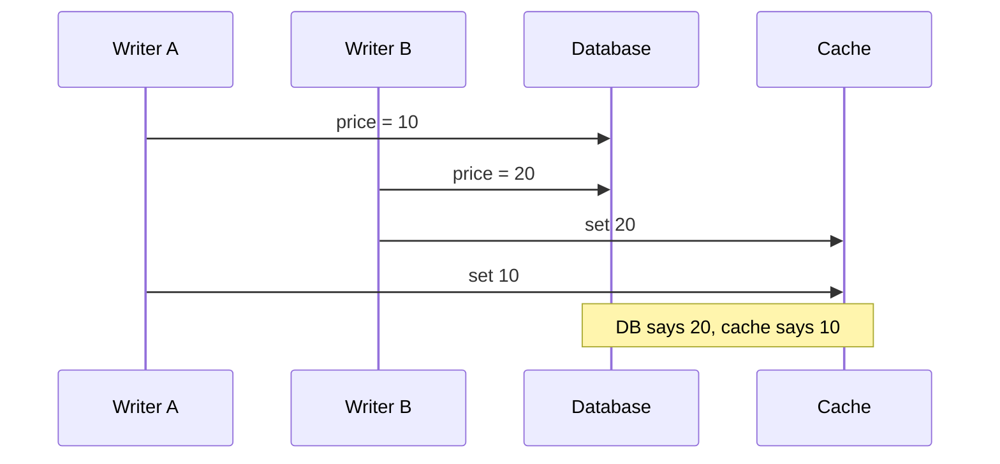
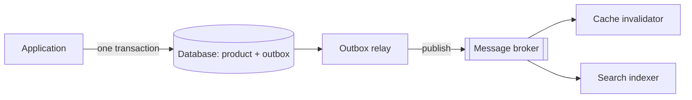
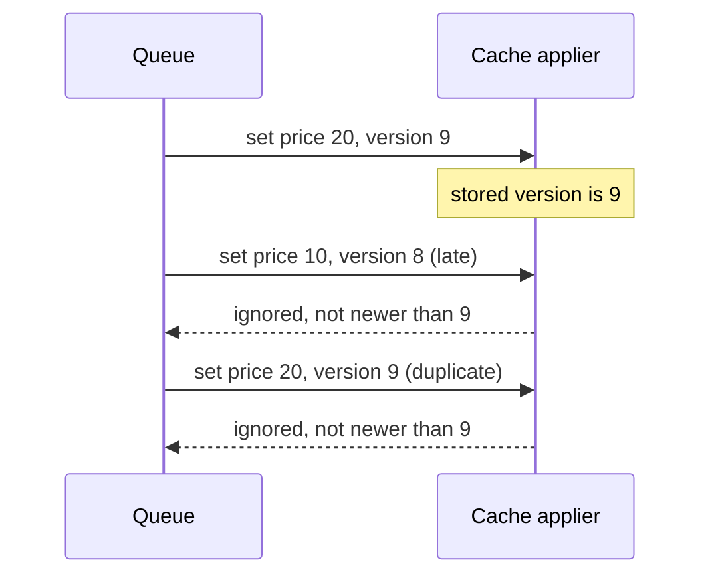
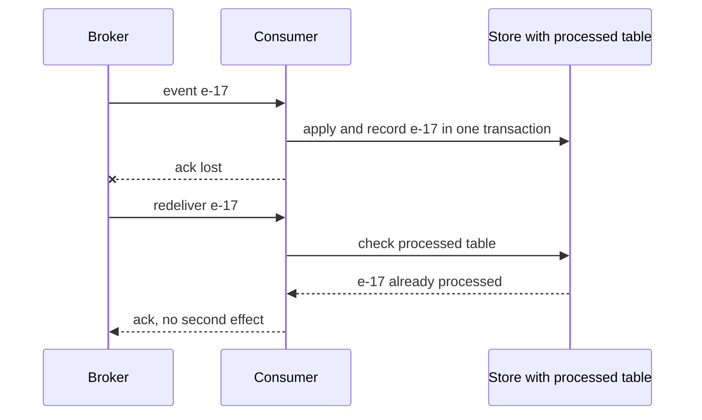
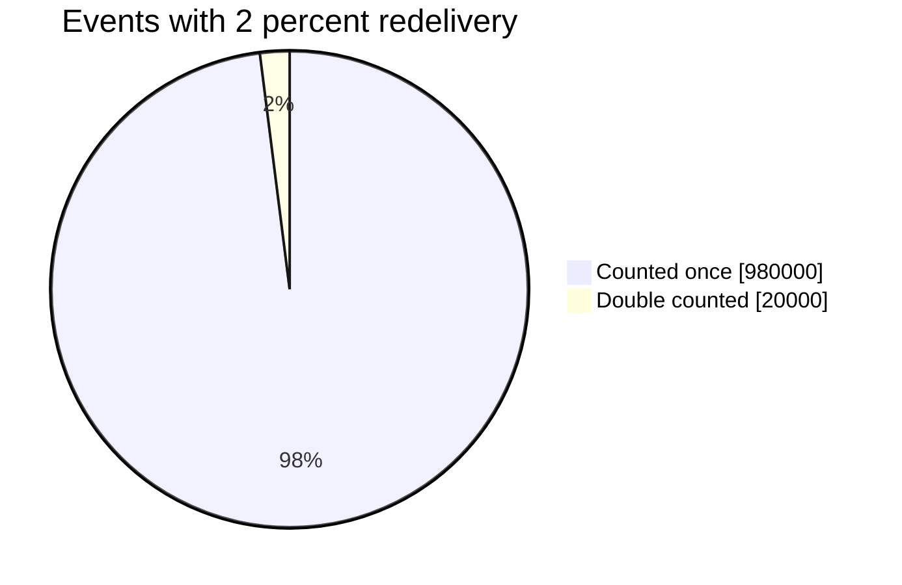
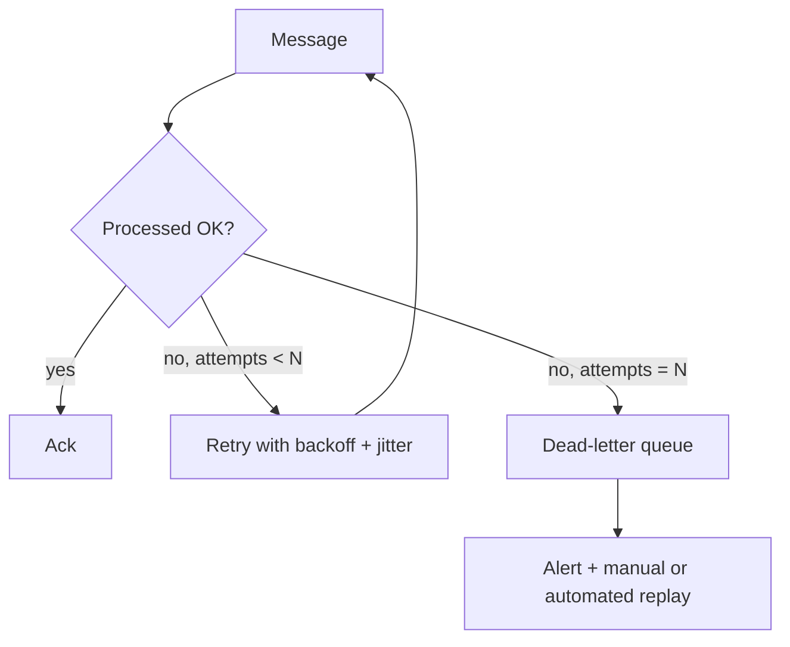
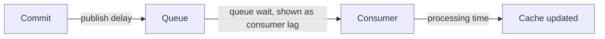
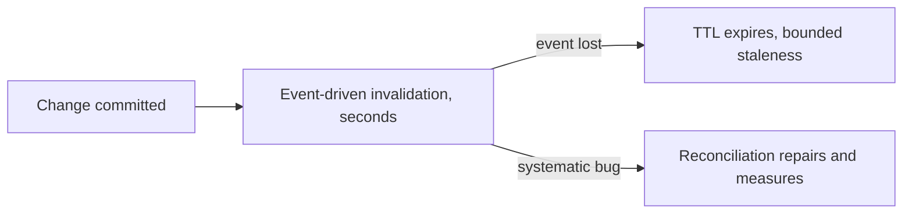

# Dual writes, idempotency and queue-based patterns

## Learning objectives

After studying this lesson you should be able to:

- Explain the dual-write problem and construct failure interleavings that produce permanent inconsistency between a database and a cache or search index.
- Describe the transactional outbox pattern and change data capture (CDC) and why they fix dual writes.
- Define idempotency, explain why at-least-once delivery requires it, and design idempotent consumers using keys, versions and conditional writes.
- Reason about ordering: per-key ordering, partitioned queues, version numbers and last-writer-wins.
- Design a queue-based write-behind or invalidation pipeline, including retries, dead-letter queues and backpressure.
- Choose between TTL, event-driven invalidation and periodic reconciliation, and combine them.

## 1. The problem: two systems, no shared transaction

A cache is rarely the only copy of the truth you must keep aligned. A single business event (an order is placed, a price changes) often must be reflected in several places: the primary database, a cache, a search index, a data warehouse, a message to another service. Each is a separate system with its own failure modes, and there is typically **no transaction that spans them**. The naive solution is to write them one after another in application code. That is the **dual-write problem** (or, more generally, the multi-write problem).

```java
// Dual write: two systems, no atomicity
db.updatePrice(productId, newPrice);      // step 1
cache.set("price:" + productId, newPrice); // step 2
```

What can go wrong?

1. **Crash between steps.** The process dies after step 1. The database has the new price; the cache has the old one until TTL. If the order were reversed, the cache would hold a value the database never received, which is worse: a phantom value, possibly served to users, which then vanishes.
2. **Step 2 fails transiently.** The cache is briefly unreachable; the write is "successful" from the caller's perspective but the cache is stale.
3. **Concurrent writers interleave.** Two writers A and B update the same key. In the database, A commits before B. In the cache, B's set lands before A's. The two systems now disagree permanently, and nothing will repair it until another write or a TTL.
4. **Partial success across more systems.** With three destinations the number of failure combinations multiplies.



The root cause is that "update two systems" is not atomic, and retries do not fix reordering. Distributed-systems theory proves that atomic commit across independent systems needs a coordination protocol (such as two-phase commit), which is usually unavailable between a database and a cache, and has its own availability costs when available.

> **Key idea:** retries fix lost steps but not reordering, and a dual write has no way to detect either. The fix is to stop depending on two separate writes landing in the right order.

### Worked example: how often does it happen?

Suppose a service performs 1,000 writes per second, and the probability that a write's cache update fails or is reordered is 0.0001 (one in ten thousand), a very reliable system. That is 0.1 inconsistencies per second, 8,640 per day, each lasting until the TTL expires or the key is next written. With a 1-hour TTL and uniform distribution, at any moment the system carries on the order of 0.1 x 3,600 = 360 stale keys. "Rare" at the request level is routine at scale. This is why the design must tolerate, detect or repair inconsistencies rather than merely hope they do not occur.

## 2. Strategy 1: make the cache disposable (invalidate and TTL)

The cheapest defence is to avoid writing derived data into the cache in the write path at all. On write, update the database (the single source of truth) and _delete_ the cached key; readers repopulate it on demand (the cache-aside pattern from the previous lesson). Add a **TTL** as an upper bound on staleness. Because the cache is derived data, a lost or failed invalidation only causes bounded staleness, not corruption.

Strengths: simple, no new infrastructure. Weaknesses: the invalidation can still be lost (crash after commit, before delete), so staleness is bounded by TTL, not by milliseconds; and the repopulation race (stale reader) described earlier still exists.

## 3. Strategy 2: the transactional outbox

To make the _event_ of the change reliable, write it in the same database transaction as the change itself.

1. In one local database transaction: update the business row **and** insert a row into an `outbox` table describing the event (for example `{type: PriceChanged, productId, price, version}`).
2. A separate **relay** process reads unpublished outbox rows in order and publishes them to a message broker or applies them (updates the cache, search index, etc.), then marks them as published.



Because the business change and the outbox row commit atomically, either both exist or neither does: **no lost events**. The relay may crash after publishing but before marking the row published, so an event can be delivered **more than once**: at-least-once delivery. Consumers must therefore be idempotent (section 5).

### Change data capture (CDC)

An alternative that removes the application-level outbox table is **CDC**: a tool reads the database's own transaction log (the write-ahead log or binlog) and emits a stream of committed changes. Because the log is the authoritative ordered record of what committed, CDC gives complete, commit-ordered invalidations, regardless of which client wrote the data (application, admin script, migration). Systems built this way publish row changes to a log such as Kafka, and consumers update caches and indexes. Costs: operating the CDC pipeline, handling schema changes, and a replication lag that makes invalidation slightly delayed (typically sub-second to seconds, but unbounded under failure). The outbox and CDC can be combined: CDC tails the outbox table, avoiding polling.

Both approaches shift the guarantee from "we hope both writes happen" to "the change is durably recorded once, and propagation is retried until it succeeds." That is the essence of **eventual consistency by design**.

| Strategy             | What it guarantees                      | Cost or caveat                                         |
| -------------------- | --------------------------------------- | ------------------------------------------------------ |
| Invalidate and TTL   | Staleness bounded by the TTL            | An invalidation can still be lost; refill race remains |
| Transactional outbox | No lost events, delivered at least once | A relay process; consumers must be idempotent          |
| CDC                  | Commit-ordered changes from any writer  | Pipeline to run, replication lag, schema changes       |

## 4. Ordering

Reliable delivery is not enough: events must also be applied in a sensible order.

**Per-key ordering.** For cache invalidation and updates, the ordering that matters most is per key. If a message broker partitions by key (the same product always goes to the same partition), then events for one key are consumed in order by a single consumer. Cross-key ordering is rarely needed for caches, and giving it up allows parallelism.

**Versions to defend against reordering.** Even with partitioning, retries, multiple relays or multi-region replication can reorder events. Attach a monotonically increasing **version** (a row version column, an LSN from the log, or a timestamp from a single source) and apply updates conditionally: "set this value only if my version is greater than the stored one." In a cache that supports Lua scripts or compare-and-set, this is a few lines; in a database it is `UPDATE ... WHERE version < :v`.

```java
// Idempotent, order-safe cache update using a version (pseudocode)
boolean applyUpdate(String key, Value v, long version) {
    // Executed atomically in the cache (e.g. as a script)
    long current = cache.getVersion(key);       // 0 if absent
    if (version > current) {
        cache.set(key, v, version);
        return true;
    }
    return false;                                // stale or duplicate event: ignore
}
```

With this rule, delivering an event twice (duplicate), or events out of order, is harmless: the older one is simply ignored. Clock-based versions (wall-clock timestamps) are dangerous when several servers generate them because of clock skew; prefer database-assigned versions or log positions.

A versioned apply ignores both a late older event and a duplicate:



**Deletes vs sets.** If invalidation is expressed as "delete the key", reordering is safe, since delete is idempotent and the reader will reload the current state from the database. Update-style messages ("set price to 20") need versions. This is another reason to prefer invalidation messages over value-carrying messages when the cached value is cheap to reload.

**Last-writer-wins and its dangers.** Ordering by timestamp and keeping the greatest ("LWW") is simple but silently drops one of two concurrent writes, and with skewed clocks may keep the older one. It is acceptable for data like "last seen" and unacceptable for data like inventory counts, which need conflict-free merging or serialized updates.

## 5. Idempotency

An operation is **idempotent** if applying it several times has the same effect as applying it once. `SET x = 5` is idempotent; `x = x + 1` is not. Message systems that guarantee delivery typically offer **at-least-once** semantics: the broker redelivers a message if the consumer does not acknowledge in time (the consumer may have processed it and crashed before acking). "Exactly once" delivery across independent systems is not generally achievable; what is achievable is **effectively once** processing: at-least-once delivery plus idempotent processing.

Techniques:

1. **Naturally idempotent operations.** Prefer "set to value" over "increment", "upsert" over "insert", "delete key" over "delete if exists and decrement".
2. **Idempotency keys.** The producer attaches a unique ID to each logical operation (a UUID generated by the client, or a business key like `order-123-payment`). The consumer records processed IDs in a durable store, atomically with its side effects when possible, and skips duplicates.
3. **Versions / conditional writes.** As above: apply only if newer.
4. **Deduplication windows.** Keep processed IDs for a limited time (hours or days), longer than the maximum redelivery delay.

```java
// Idempotent consumer using a processed-events table in the same transaction
void handle(Event e) {
    db.begin();
    if (db.exists("processed", e.id)) { db.commit(); return; }  // duplicate
    applySideEffects(e);                                        // in the same DB
    db.insert("processed", e.id);
    db.commit();
}
```

This only provides exactly-once effects when the side effect and the dedup record are in the _same_ transactional store. If the side effect is a cache write, it is naturally made idempotent via a version check or `SET`, rather than a processed table.

**Idempotency for client retries.** The same logic applies at the API edge: if a mobile client retries a "create payment" request after a timeout, the server should recognize the repeated idempotency key and return the original result rather than creating a second payment. This is the pattern used by payment APIs.

Why a lost acknowledgement produces a redelivery, and how the processed table absorbs it:



### Worked example: at-least-once with a counter

A consumer receives `Increment(videoId, 1)` events and updates a cached counter and a database counter. If the broker redelivers 2 percent of events, then after 1,000,000 events about 20,000 are double counted: the counter is 2 percent high. Convert to idempotent form: carry `eventId` and keep a processed set, or switch to state-based events ("count is now N, version V") that can be re-applied safely. For approximate metrics, 2 percent error may be acceptable; for billing, it is not.

With 2 percent redelivery, the effect on the 1,000,000-event counter:



## 6. Queue-based patterns for caching

Queues appear in three cache-related roles.

**A. Asynchronous invalidation.** After commit, publish `EntityChanged(key, version)` to a topic. Cache servers or application instances subscribe and delete or refresh the key (also their L1 entries, which solves the multi-instance invalidation problem from the layers chapter). Because publishing can fail or messages can be lost (especially with lightweight pub/sub that does not persist), keep TTL as the backstop and, for critical data, publish via the outbox.

**B. Write-behind pipeline.** As discussed in the write policies lesson, writes accepted into the cache are enqueued and applied to the database by workers. The queue should be durable if loss is unacceptable, partitioned by key for per-key ordering, and consumers should write idempotently (upsert with a version check).

**C. Cache warming and refresh jobs.** A scheduler enqueues "refresh key" jobs for hot keys before they expire (a worker-based refresh-ahead), or after deployments to prefill cold caches. Jobs for the same key should be deduplicated (coalesced) so that a burst of changes produces a single refresh.

### Retries, dead letters and backpressure

- **Retries with exponential backoff and jitter** avoid synchronized retry storms against a recovering database.
- **Dead-letter queue (DLQ).** After N failed attempts, a message moves to a DLQ for inspection. Without a DLQ, a poison message (one that always fails) blocks its partition forever, or retries until the queue is full. Alarms should fire on DLQ depth.
- **Backpressure.** If consumers lag, the queue grows. Monitor **consumer lag** (the age of the oldest unprocessed message) because it is your staleness bound for derived data. If lag exceeds the tolerated staleness, degrade (serve with a "may be stale" marker, shed non-critical consumers) or scale consumers.
- **Bounded staleness in practice.** Staleness is roughly commit-to-publish delay + queue wait + processing time. Alert on each stage, not only on the total.



Where the staleness comes from, stage by stage (alert on each stage, not only the total):



## 7. Reconciliation: trust but verify

No matter how careful the pipeline, bugs and operational accidents happen (a consumer was down for a day, a deploy skipped a code path, someone updated the database by hand). Mature systems add a periodic **reconciliation** (anti-entropy) job that samples or scans keys, compares the cache (or index) against the source of truth, and repairs differences, emitting a metric for the **inconsistency rate**. A cheap variant: when reading from the cache, occasionally (say 0.1 percent of the time) also read the database and compare, logging mismatches. The measured rate tells you whether your invalidation strategy actually works, and trends reveal regressions.

A layered defence is common:

1. **TTL** bounds the worst case.
2. **Event-driven invalidation** (outbox/CDC) delivers fast freshness in the common case.
3. **Reconciliation** repairs what both missed and measures the system's real consistency.



## 8. Sagas and cross-service writes (brief)

When a business operation spans multiple services, each with its own database, a distributed transaction is usually avoided in favour of a **saga**: a sequence of local transactions, each with a compensating action to undo it if a later step fails. Caching interacts with sagas through intermediate states: a cached view may reflect a step that is later compensated. Design cache TTLs and invalidation for these states, and treat cached data from partially completed sagas as provisional. Saga design is beyond this chapter, but the principle that you design for failure and compensation, not for impossible atomicity, is the same one that governs cache consistency.

## Common pitfalls

- **Dual write in application code** with no retry, no outbox and no reconciliation.
- **Writing the cache before the database**, which can expose phantom values.
- **Assuming a message broker gives exactly-once effects.** It gives, at best, at-least-once delivery; you must build idempotency.
- **Using wall-clock timestamps from multiple servers as versions.**
- **Not partitioning by key**, losing per-key ordering.
- **Unbounded retries on a poison message** that blocks a partition; always have a DLQ and alarms.
- **Ignoring consumer lag**, the true staleness metric.
- **Trusting invalidation completely**, with no TTL and no reconciliation.
- **Value-carrying cache updates** without versions, which permit stale overwrites.
- **Treating CDC lag as zero.** Plan for delay and for catch-up bursts after downtime.

## Check your understanding

1. Describe an interleaving of two writers that leaves a database and cache permanently inconsistent under a dual write. Which simple change (to the cache operation) makes this particular race harmless?
2. Explain the transactional outbox pattern. Which failure does it eliminate, and which new property must consumers handle?
3. Why is "exactly once delivery" generally unrealistic, and what do systems do instead?
4. A consumer applies `Set(key, value, version)` events to a cache. How do you make it safe against duplicates and reordering? Write the rule.
5. A broker delivers 0.5 percent duplicate messages. A consumer applies `Increment` operations 4,000,000 times. Roughly how many extra increments occur, and name two ways to prevent them.
6. Why combine TTL, event-driven invalidation and reconciliation instead of choosing one?

## Answers

1. Writer A commits price 10 to the database, then writer B commits 20; B then sets the cache to 20 and A sets it to 10, leaving DB 20 and cache 10 until TTL or next write. Changing the cache operation from "set value" to "delete key" makes the order irrelevant, since the next read reloads the database's current value (a versioned conditional set also works).
2. The business change and an event record are written in one database transaction; a relay later publishes the outbox rows to a broker or applies them. It eliminates lost events from a crash between the database write and the notification. The consumer must handle duplicates (at-least-once delivery) and possibly reordering.
3. A message can be processed and the acknowledgement lost, so the sender cannot know whether to resend; across independent systems without a shared transaction, you can choose "might lose" or "might duplicate". Systems choose at-least-once delivery with idempotent processing to achieve effectively-once effects.
4. Apply the update only if the incoming version is greater than the stored version (absent counts as 0), atomically (script or compare-and-set); otherwise ignore it. Duplicates have equal versions and are ignored; late older events have lower versions and are ignored.
5. 4,000,000 x 0.005 = 20,000 extra increments. Prevent by idempotency keys with a processed-event record in the same transaction, or by sending state-based events (absolute value plus version) instead of increments.
6. Each covers the others' gaps: TTL bounds staleness when events are lost; events provide low-latency freshness in the common case; reconciliation catches systematic bugs, measures real inconsistency and repairs drift that neither detects.

## Summary

Keeping a cache aligned with a source of truth is a multi-system update problem without atomic commit, so naive dual writes lose or reorder updates and create persistent inconsistency. The robust approaches are to treat the cache as disposable derived data (invalidate and TTL), to record changes atomically with the business data via a transactional outbox or capture them from the database log (CDC), and to deliver them through queues with retries, dead-letter handling and monitoring of consumer lag. Because delivery is at-least-once and ordering can break, consumers must be idempotent, using naturally idempotent operations, idempotency keys, or versions with conditional updates, and per-key partitioning gives the ordering that matters. Finally, combine TTL, event-driven invalidation and reconciliation so that staleness is bounded, normally small, and measured. With the write policies and patterns of this chapter in hand, the Eviction chapter turns to the other half of a bounded cache: deciding what to throw away.
