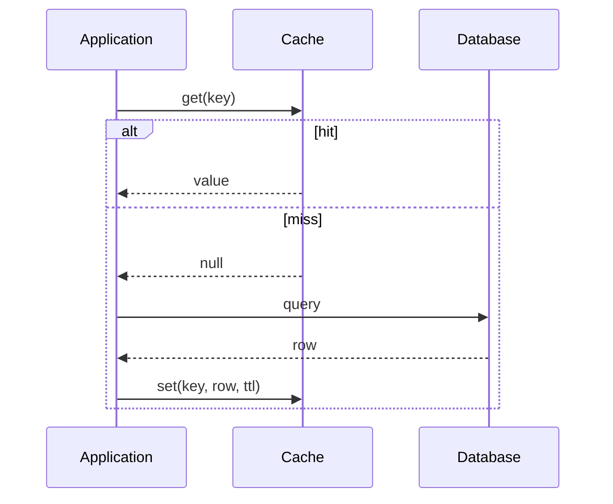
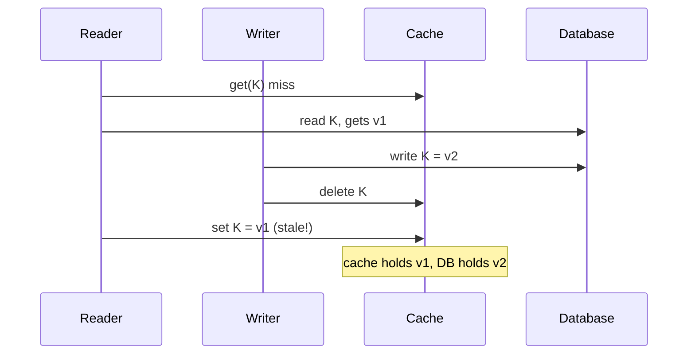
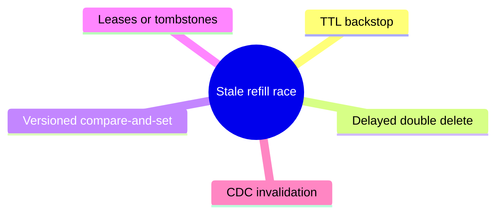
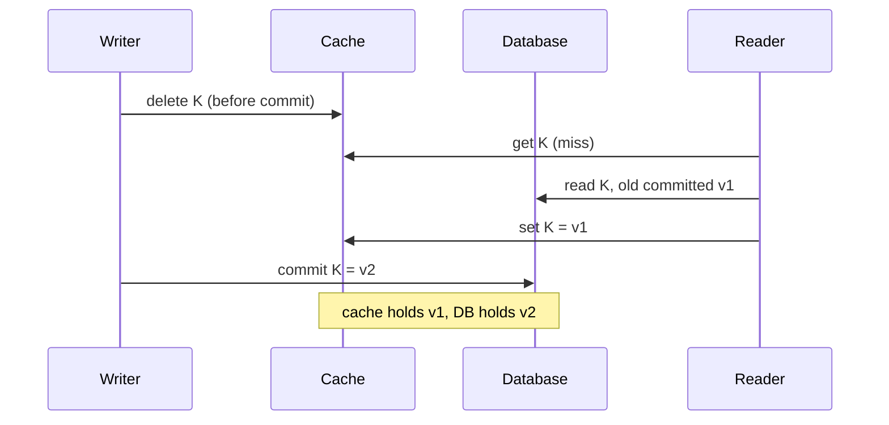
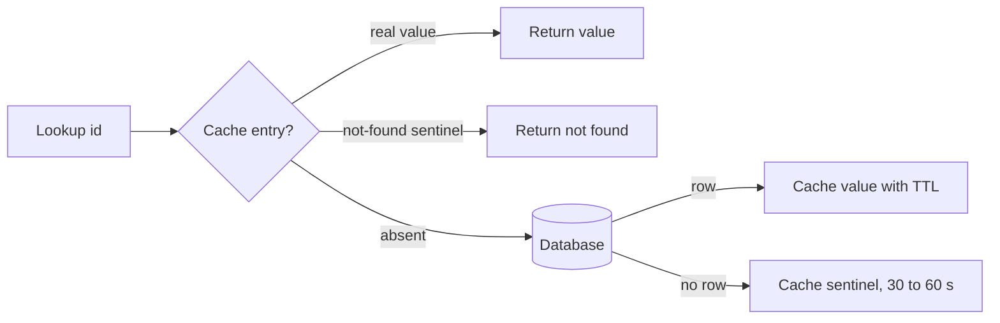
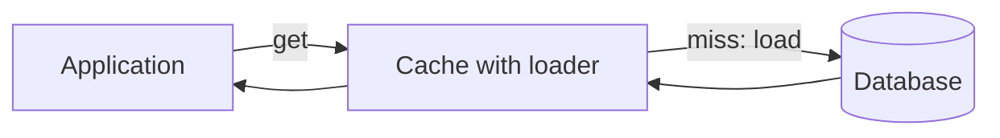
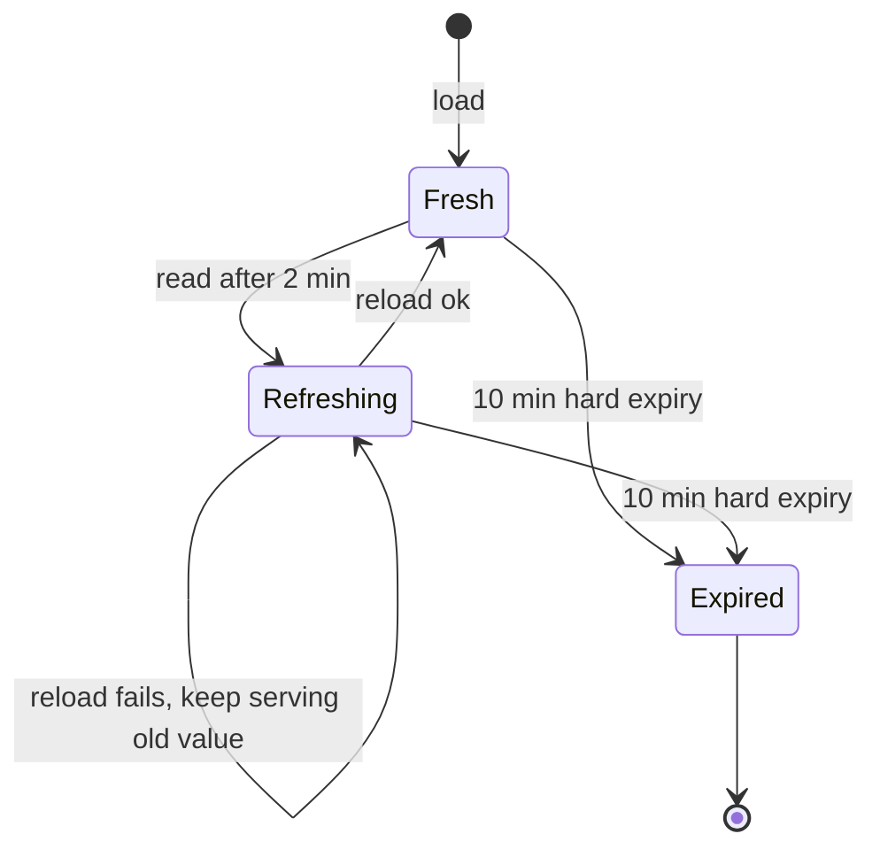
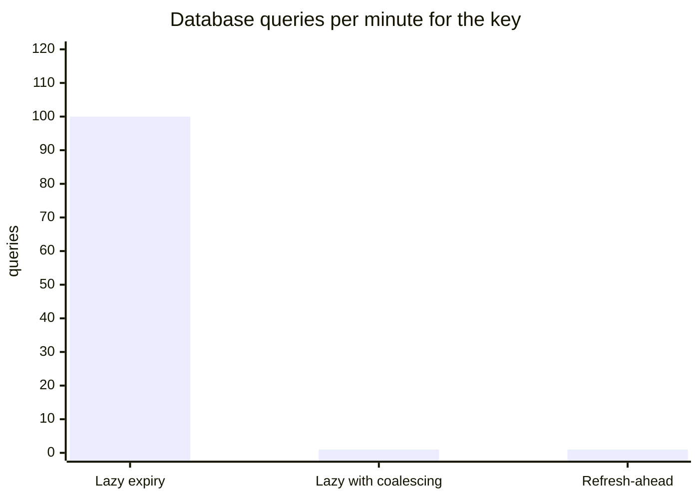

# Cache-aside, read-through and refresh-ahead

## Learning objectives

After studying this lesson you should be able to:

- Describe cache-aside (lazy loading), read-through and refresh-ahead, and say who is responsible for loading data in each.
- Write correct cache-aside code in Java and pseudocode, including the write path (invalidate versus update).
- Explain the race conditions in cache-aside that lead to stale data, with a concrete interleaving, and the mitigations (TTL, versioning, delayed delete, leases).
- Compare these patterns with the write policies from the previous lesson and combine them sensibly.
- Explain negative caching and its risks.
- Compute the load profile of refresh-ahead versus lazy expiry.

## 1. Who loads the data?

The previous lesson asked when a **write** reaches the cache and the store. The read-side question is just as important: when a read misses, **who** goes to the store, who fills the cache, and when? There are three standard answers.

- **Cache-aside** (lazy loading): the _application_ checks the cache; on a miss, it loads from the store and populates the cache itself. The cache is a passive key-value store.
- **Read-through**: the application only talks to the cache. On a miss, the _cache_ loads from the store through a configured loader and returns the value. The cache is an active component.
- **Refresh-ahead**: the cache proactively reloads entries _before_ they expire, so that readers rarely observe a miss on hot keys.

These can be combined with the write policies. Cache-aside is almost always paired with write-around plus invalidation; read-through is paired with write-through or write-behind; refresh-ahead modifies how entries are renewed regardless of the write policy.

## 2. Cache-aside

### The read path

```java
User getUser(long id) {
    String key = "user:" + id;
    User cached = cache.get(key);           // 1. look aside
    if (cached != null) return cached;      // 2. hit
    User fromDb = db.findUser(id);          // 3. miss: load from the source of truth
    if (fromDb != null) {
        cache.set(key, fromDb, TTL);        // 4. populate with an expiry
    }
    return fromDb;
}
```



### The write path: invalidate, do not update

On update, the application writes to the database and then **deletes** the cached key (invalidate). The next reader misses and reloads the fresh value.

```java
void updateUser(User u) {
    db.update(u);                       // 1. source of truth first
    cache.delete("user:" + u.id);       // 2. then invalidate
}
```

Why delete rather than set the new value? Consider two concurrent updates. If both write the database and then both `set` the cache, the interleaving can leave the cache with the older value while the database holds the newer one:

1. Writer A updates DB to v1.
2. Writer B updates DB to v2.
3. Writer B sets cache to v2.
4. Writer A sets cache to v1. Cache now says v1; DB says v2. **Stale until TTL or the next write.**

Deleting is idempotent and order-insensitive in this case: whichever order the deletes arrive, the key ends up absent, and the next read loads the DB's current value. That is why "delete on write" is the dominant recommendation. It is not race-free, as we see next.

### Race conditions in cache-aside

**Race 1: reader repopulates with a stale value.** This is the most famous cache-aside race.

1. Reader R misses on key K, reads v1 from the database.
2. Writer W updates the database to v2.
3. Writer W deletes K from the cache (nothing to delete, or deletes an old entry).
4. Reader R, slowed by a GC pause or network delay, writes v1 into the cache.

The cache now holds v1 while the database has v2, and the stale value remains until TTL expiry. The window requires R's database read to precede W's write and R's cache write to follow W's delete: unlikely per request but certain to happen eventually at scale. Facebook's memcache paper (Nishtala et al., "Scaling Memcache at Facebook") discusses this class of problem and introduces **leases** to address it: a miss returns a token that the loader must present when setting the value, and a delete invalidates outstanding tokens, so the stale set is rejected. The Stampede and Consistency lessons in this chapter return to leases.



**Mitigations.**

1. **TTL as a backstop.** Every entry expires, so staleness is bounded. Choose the TTL from the business tolerance (for example 60 seconds).
2. **Delayed double delete.** After writing the database, delete the key, then delete it again after a short delay (longer than a typical read-and-populate time). It catches the stale populate in most cases but is heuristic, not a guarantee.
3. **Versioned values / compare-and-set.** Store a version number with the value; populate with a conditional set that succeeds only if the cached version is lower (or the key is absent and the version is not older than a known minimum). Requires the cache to support conditional operations or Lua scripts.
4. **Leases or tombstones.** A delete leaves a short-lived tombstone that blocks populates carrying older versions.
5. **Change data capture (CDC).** Invalidate from the database's replication log rather than from application code, so invalidations follow commit order and cover writes made by any client. See the next lesson.

The five mitigations at a glance:



**Race 2: delete before commit.** If the application deletes the cache key _before_ the database transaction commits, a concurrent reader can miss, read the old committed value from the database, and repopulate the cache with it before the commit lands. Always invalidate **after** the commit succeeds (and only if it commits).



**Race 3: failed delete.** If the cache delete fails (network blip), the database holds the new value and the cache the old one. The application should retry, enqueue the invalidation for later retry, or rely on TTL. This is a mini dual-write problem.

### Strengths and weaknesses of cache-aside

Strengths:

- **Simple and resilient**: if the cache is down, the application can still serve (slowly) from the database. The cache is optional.
- **Only requested data is cached** (lazy), so capacity is spent on data that has proven demand.
- **Flexible**: the application can cache any representation (a denormalized view, a rendered fragment) different from the database row.

Weaknesses:

- **Cold start**: a new or flushed cache means all first requests miss, shifting load to the database.
- **Miss penalty**: three round trips on a miss (cache, database, cache set).
- **Staleness window** as discussed.
- **Logic duplication**: every service that reads the data must implement the same read-and-populate code correctly, including key format and TTL. Wrapping it in a library helps.
- **Stampedes**: many concurrent misses on the same hot key all hit the database (covered in the stampede lesson). Request coalescing, locks or leases mitigate this.

### Negative caching

If a lookup finds nothing (the user does not exist), caching "not found" avoids repeated database queries for the same nonexistent key, a protection against **cache penetration**, in which attackers or buggy clients query random missing IDs. Store a sentinel value with a **short** TTL (for example 30 to 60 seconds). The risk: if the entity is created shortly afterwards, readers see "not found" until the sentinel expires. Creating the entity should delete the negative entry. A Bloom filter of known-valid IDs in front of the cache is another defence against penetration.

How a lookup treats a negative entry, a real value and an absent key:



## 3. Read-through

In **read-through**, the application never talks to the database for reads. It calls the cache (or a library wrapping the cache) and supplies, once, a **loader** function the cache uses on a miss.

```java
LoadingCache<Long, User> users = Caffeine.newBuilder()
    .maximumSize(100_000)
    .expireAfterWrite(Duration.ofMinutes(5))
    .build(id -> db.findUser(id));   // loader supplied at configuration time

User u = users.get(42L);              // cache loads on miss
```



**Advantages.**

- **Centralized loading logic**: one place defines how to fetch, so all callers behave consistently.
- **Built-in request coalescing**: because the cache owns the load, it can ensure that when 1,000 threads ask for the same missing key, one load runs while the rest wait. Many libraries (Caffeine, Guava, Ehcache read-through, cloud caching services) do this.
- **Cleaner application code**.

**Disadvantages.**

- **The cache must be able to reach the store.** In distributed settings with a standalone Redis or Memcached, read-through is not natively available: the cache server does not know your database. It exists as a library feature (in-process), as a feature of data grids and some managed products, or as a caching proxy/service that you build.
- **Couples availability**: if the loader fails, calls fail unless fallbacks (stale-if-error) are configured.
- **Less flexible data shape**: the cached value typically equals what the loader returns.

Read-through and cache-aside produce the same data flow; the difference is **who owns the code**. Many practitioners treat a well-designed cache-aside helper (`cache.getOrLoad(key, loader)`) as read-through in practice.

> **Key idea:** cache-aside and read-through move the same data; the difference is who owns the loading code. Owning it in one place is what gives request coalescing.

### Pairing with write policies

Read-through is naturally paired with **write-through** (the same component handles both directions) or **write-behind**. A "cache as the front of the database" architecture does this: the application sees one logical store. This yields simplicity and read-after-write consistency for data written through it, at the cost of requiring all writers to go through the cache; any writer that bypasses it (a migration script, another service) creates staleness.

## 4. Refresh-ahead (refresh-behind-the-scenes)

With plain TTL expiry, an entry becomes invalid at time T and the next request after T pays the miss penalty, which can be high (slow query, remote call). For popular keys the penalty is paid by an unlucky user, and, worse, all concurrent requests at the expiry instant may stampede.

**Refresh-ahead** schedules a reload before expiry. A typical rule: if an entry is read when its remaining lifetime is under some fraction of the TTL (say 20 percent), the cache triggers an asynchronous reload and keeps serving the old value until the new one arrives. Libraries call this `refreshAfterWrite` (in Caffeine) as distinct from `expireAfterWrite`.

```java
LoadingCache<String, Config> cache = Caffeine.newBuilder()
    .expireAfterWrite(Duration.ofMinutes(10))   // hard expiry
    .refreshAfterWrite(Duration.ofMinutes(2))   // async refresh when read after 2 min
    .build(key -> loadConfig(key));
```

Semantics: after 2 minutes, the next read returns the current (possibly slightly old) value immediately and triggers a background refresh. After 10 minutes with no refresh, the entry expires. Hot keys therefore never expire and users never wait; cold keys are not refreshed (the reload is triggered by reads), so you do not waste work on unused data. A related HTTP idea is `stale-while-revalidate`.

The life of one entry with `refreshAfterWrite` at 2 minutes and `expireAfterWrite` at 10 minutes:



### Worked example: load profile

A key serving 500 requests per second has a 60-second TTL and a 200 ms load time.

- **Lazy expiry.** Every 60 seconds, the key expires. During the 200 ms reload, about 500 x 0.2 = 100 requests arrive and, without coalescing, all miss and hit the database: a burst of 100 queries once a minute for this key. Each of those 100 users sees about 200 ms extra latency. With coalescing, one query runs but 100 users still wait up to 200 ms.
- **Refresh-ahead at 48 seconds (80 percent of TTL).** The first read after 48 seconds triggers one background query. All 100 or so requests in the following 200 ms are served from the cached value. Database load: 1 query per minute; user-visible misses: 0.

If the same key had 1 request per minute, refresh-ahead offers little (and wastes a refresh if no request follows); lazy loading is appropriate.

The worked example in numbers (500 requests per second, 200 ms load):



### Costs and caveats

- **Wasted work** for entries that are refreshed but never read again (mitigated by refresh-on-read rather than timer-based).
- **Refresh storms**: if many keys were loaded at the same time they all become refresh-eligible together, producing a thundering herd of refreshes. Add **jitter** to TTLs and refresh times.
- **Error handling**: when a background refresh fails, keep serving the old value until hard expiry (with a log and metric) rather than evicting a good value and amplifying an outage.
- **Staleness bound**: a refreshed key can be up to (refresh interval + load time) behind, not zero. Refresh-ahead improves latency and smooths load; it does not improve consistency.

## 5. Choosing between the patterns

| Question                          | Cache-aside                      | Read-through                       | Refresh-ahead                           |
| --------------------------------- | -------------------------------- | ---------------------------------- | --------------------------------------- |
| Who loads on a miss?              | Application code                 | The cache layer                    | The cache layer, before expiry          |
| Works with plain Redis/Memcached? | Yes                              | Needs a library or proxy           | Needs library or custom worker          |
| If cache is down                  | App can read the DB directly     | Depends on implementation          | Same as underlying pattern              |
| Miss latency for hot keys         | Paid on every expiry             | Paid on every expiry (coalesced)   | Mostly hidden                           |
| Typical write pairing             | Write-around with invalidation   | Write-through or write-behind      | Any                                     |
| Best for                          | General purpose, flexible shapes | Uniform access layer, local caches | Hot, expensive-to-load, read-heavy keys |

A realistic production system often uses cache-aside with a shared helper that provides coalescing, jittered TTLs, negative caching and optionally refresh-ahead, effectively building read-through on top.

## 6. Key design and TTL choice

A pattern is only as good as its keys. Principles:

1. **Include everything the value depends on**: entity type, id, tenant, locale, schema version. A version prefix (`v3:user:42`) lets you invalidate the whole class by deploying a new key format, with old keys aging out.
2. **Normalize**: `user:42` and `user:042` must not both exist.
3. **TTL from tolerance, not habit.** If a product price may be 30 seconds stale, a 30-second TTL gives a guaranteed bound even when invalidations fail. Add jitter (say plus or minus 10 percent) to avoid synchronized expiry.
4. **Cache the smallest useful unit** to avoid invalidating a large object because one field changed, but not so small that assembling a page needs 200 lookups. Batch multi-gets reduce round trips.

## 7. Failure scenarios

- **Cache outage in cache-aside.** All requests fall through to the database at full rate. If the database cannot absorb that, the outage cascades. Defences: circuit breakers, rate limiting, load shedding, serving stale or degraded responses, and keeping a local fallback cache.
- **Poisoned cache.** A bug writes a wrong value with a long TTL. Without a way to purge by pattern or version, the bad data persists. Keep a kill switch: a version prefix in the key.
- **Serialization incompatibility during deploys.** Old and new application versions read each other's cached objects with different class layouts. Include a schema version in the key or use tolerant formats.
- **Thundering herd after restart.** Coordinated expiry or a cold cache. Warm it, coalesce loads, add jitter, or stage the restart.

## Common pitfalls

- **Updating the cache on write instead of deleting it** under concurrency, producing out-of-order stale values.
- **Invalidating before the database commit.**
- **Treating the database read and cache populate as atomic.** They are not; design for the race or accept TTL-bounded staleness.
- **No TTL.** Entries never expire, so any missed invalidation becomes permanent.
- **Same TTL for every key**, which makes expiry synchronized after a bulk load.
- **Negative cache entries with long TTLs.**
- **Caching errors** (a timeout turned into `null`) as if they were "not found".
- **Assuming read-through is available on a plain remote cache.**

## Check your understanding

1. Describe the cache-aside read path and write path. Why do most practitioners delete the key on write rather than set it?
2. Construct an interleaving of one reader and one writer in which cache-aside leaves a stale value in the cache. Name two mitigations.
3. What distinguishes read-through from cache-aside, and what extra capability does read-through often provide?
4. A key receives 200 requests per second, TTL is 30 seconds and a reload takes 300 ms. How many requests arrive during a reload at expiry, and how does refresh-ahead help?
5. What is negative caching, what attack or load pattern does it counter, and what is its main risk?
6. Why must invalidation happen after the database commit?

## Answers

1. Read: check cache; on a miss load from the database and set the cache with a TTL. Write: update the database, then delete the cache key. Deleting is idempotent and order-insensitive, so concurrent writers cannot leave an older value that was written later than a newer one; setting can reorder.
2. Reader misses and reads v1 from the DB; writer updates the DB to v2 and deletes the key (absent); reader then sets v1 in the cache. The cache is stale until TTL. Mitigations: TTL bound, versioned conditional set, leases/tombstones, delayed double delete, CDC-driven invalidation.
3. In cache-aside the application contains the load logic; in read-through the cache owns a loader and the application only calls `get`. Read-through typically provides built-in request coalescing and consistent loading behaviour.
4. 200 x 0.3 = 60 requests arrive during the reload; without coalescing all 60 hit the database and each waits about 300 ms. With refresh-ahead (say at 24 seconds), a single background reload runs while requests continue to be served from the old value, so there is 1 database query and no user-visible miss.
5. Caching the fact that a key does not exist (with a sentinel and short TTL). It counters cache penetration, repeated queries for nonexistent keys. Risk: a newly created entity is invisible until the negative entry expires, unless creation clears it.
6. If you invalidate first, a concurrent reader can read the still-old committed value from the database and repopulate the cache before the commit lands, leaving the stale value in the cache after the commit.

## Summary

Cache-aside has the application check the cache, load on a miss and populate; on writes it updates the database and deletes the key. It is simple and fault tolerant but subject to races (stale repopulation, delete-before-commit, failed deletes) bounded by TTLs, versions, leases or CDC. Read-through moves the load logic into the cache and typically adds request coalescing, but requires the cache to reach the store. Refresh-ahead renews hot entries before they expire, hiding miss latency and smoothing database load without improving consistency. Negative caching protects against penetration, jittered TTLs avoid synchronized expiry, and careful key design carries correctness. The final lesson of this chapter addresses what happens when you must update two systems that cannot be updated atomically.
